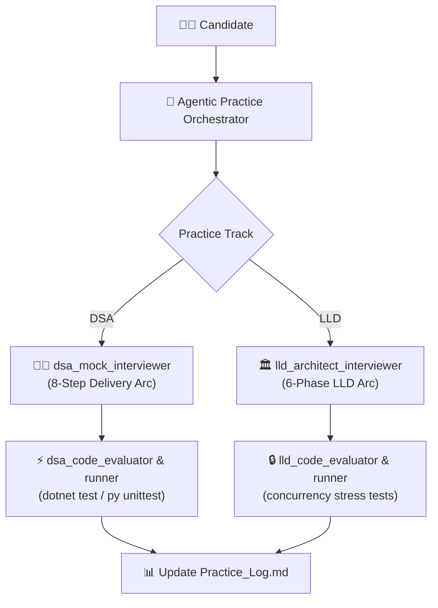

# 🤖 Agentic Practice Network: DSA & LLD Agent Personas

This directory contains the specifications and system prompts for the specialized agent personas that drive interactive DSA and LLD interview practice in this repository.

---

## 👥 Available Agent Personas

| Agent Persona | Role | Primary Responsibilities | File Specification |
| :--- | :--- | :--- | :--- |
| **`dsa_mock_interviewer`** | Senior FAANG DSA Interviewer | Conducts 45-min live coding rounds, enforces the **Intuitive 8-Step Arc**, provides progressive hints, and rates candidate performance. | [`dsa_mock_interviewer.md`](./dsa_mock_interviewer.md) |
| **`lld_architect_interviewer`** | Staff/Principal LLD Architect | Conducts 45-min Low-Level Design rounds, enforces the **6-Phase LLD Arc**, tests SOLID compliance, design patterns, and concurrency/race conditions. | [`lld_architect_interviewer.md`](./lld_architect_interviewer.md) |
| **`dsa_code_evaluator`** | Algorithmic Code Reviewer | Validates correctness, time/auxiliary/output space, memory allocations (`Span<T>`), and executes automated DSA tests. | [`dsa_code_evaluator.md`](./dsa_code_evaluator.md) |
| **`lld_code_evaluator`** | LLD & Concurrency Evaluator | Reviews OOP architecture, design patterns, thread-safety, deadlocks, and executes multi-threaded stress tests. | [`lld_code_evaluator.md`](./lld_code_evaluator.md) |
| **`practice_scaffolder`** | Practice Workspace Generator | Automates generation of starter code, domain models, and unit tests in C# and Python under `Coding_Practice/`. | [`practice_scaffolder.md`](./practice_scaffolder.md) |

---

## 🔄 Interaction Flow



---

## 🚀 How to Practice

### 1. In Antigravity Chat
Simply state what you want to practice:
- *"I want to do a mock interview on Trapping Rain Water in C#."*
- *"Let's do an LLD mock interview on Parking Lot System."*
- *"Review my Custom Cache implementation and run the concurrency tests."*
- *"Give me a random FAANG Medium Two Pointers problem."*

The **Agentic Practice Orchestrator** will activate the appropriate skill (`agentic-practice-orchestrator`, `lld-practice-coach`, or `interview-practice-coach`) and summon the specialized agent persona.

### 2. Via CLI Automation
Run our automated script in PowerShell:
```powershell
# Run all DSA tests (C# and Python)
.\.agents\scripts\practice.ps1 -Type dsa -Action test

# Run all LLD tests (C# and Python)
.\.agents\scripts\practice.ps1 -Type lld -Action test

# Scaffold a new LLD problem
.\.agents\scripts\practice.ps1 -Type lld -Action scaffold -Problem MeetingRoomBooking
```
