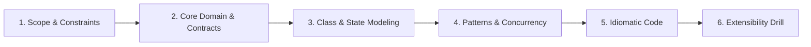

# LLD Methodology: Senior & Staff Interview Protocol

This protocol defines the standardized, 6-phase approach for Low-Level Design (LLD) and Object-Oriented Design (OOD) problem practice in this repository.

---

## 🏛️ The 6-Phase LLD Interview Arc

Senior, Lead, and Staff engineering candidates at FAANG / Tier-1 companies must structure their 45-minute LLD rounds across 6 sequential phases:

---

### Phase 1: Scope & Constraints Clarification (5–7 mins)
- **Clarify Functional Requirements:**
  - What are the 3–5 core use cases the system MUST perform in memory?
  - What operations are explicitly out-of-scope for the 45-minute round?
- **Establish Non-Functional Requirements (NFRs):**
  - **Concurrency:** Is the system accessed by multiple concurrent threads or users? What needs thread safety?
  - **Latency / Throughput:** In-memory lookups (`O(1)` target) vs disk/network persistence.
  - **Memory Limits:** Fixed capacity (e.g., LRU cache eviction) vs dynamic unbound growth.
  - **Persistence / Pluggability:** In-memory data store with interface abstractions for external databases.

---

### Phase 2: Core Domain Model & Interface Contracts (5–8 mins)
- **Entity Identification:**
  - Isolate nouns as domain models (e.g., `Meeting`, `Room`, `User`, `CacheEntry`).
  - Distinguish between **Value Objects** (immutable records) and **Entities** (identity-driven state).
- **Interface Segregation (SOLID 'I'):**
  - Define thin, cohesive interfaces: e.g., `ICache<TKey, TValue>`, `IEvictionPolicy<TKey>`, `IBookingStrategy`.
  - Avoid fat interfaces that force clients to depend on methods they do not use.

---

### Phase 3: Class & State Modeling (8–10 mins)
- **Mermaid Class Diagram:**
  - Illustrate relationships (Inheritance `--|>`, Composition `*--`, Aggregation `o--`, Association `-->`).
  - Keep diagrams uncluttered (under 8–10 core types).
- **State Machine (If Applicable):**
  - For lifecycle-driven entities (e.g., Order: `Created -> Paid -> Shipped -> Delivered`), use state diagrams.

---

### Phase 4: Design Patterns & Concurrency Strategy (5–7 mins)
- **Justify Design Patterns (No Resume-Driven Design):**
  - **Strategy Pattern:** Interchangeable algorithms (e.g., pricing, room allocation, eviction policies).
  - **Factory Pattern:** Polymorphic instantiation without tight coupling.
  - **Observer / Pub-Sub:** Decoupled event notifications (e.g., notifying attendees, cache invalidation).
  - **State Pattern:** Clean handling of complex entity state transitions without nested `switch` statements.
  - **Decorator Pattern:** Adding layered behavior (logging, metrics, caching wrappers).
- **Concurrency & Thread-Safety Blueprint:**
  - **C# Primary:**
    - `ReaderWriterLockSlim` for high read-to-write ratio workloads.
    - `ConcurrentDictionary<TKey, TValue>` for lock-free associative mappings.
    - `SemaphoreSlim` or `Channel<T>` for resource pooling and producer-consumer pipelines.
    - `Interlocked` for atomic counters and metrics.
  - **Python Secondary:**
    - `threading.Lock` / `threading.RLock` for protecting critical shared state.
    - `collections.deque` and `threading.Condition` for thread-safe producer-consumer buffers.
    - Mention GIL boundaries and process/asyncio alternatives for CPU vs I/O bound tasks.

---

### Phase 5: Idiomatic Production Code (15–20 mins)
- **Primary Language: C# (.NET 8/9):**
  - File-scoped namespaces, clean constructor injection.
  - Proper nullability handling (`#nullable enable`).
  - `IDisposable` pattern if managing unmanaged synchronization primitives (`ReaderWriterLockSlim`).
  - Guard clauses and descriptive custom exceptions.
- **Secondary Language: Python (3.11+):**
  - Type hints (`typing.Generic`, `typing.Optional`, `typing.Protocol`).
  - Abstract base classes via `abc.ABC` and `@abstractmethod`.
  - Clean context managers (`with self._lock:`).

---

### Phase 6: Extensibility Drill & Edge-Case Defense (5 mins)
- **Anticipate Interviewer Evolution Curve:**
  - *"What if we need to add a new eviction policy tomorrow?"* -> Show how Strategy pattern allows open-closed extension (`OCP`).
  - *"What if multiple users book the last available room at the exact same millisecond?"* -> Walk through synchronization guards and race condition mitigation.
  - *"What if the cache needs distributed persistence across multiple nodes?"* -> Discuss pluggable storage engine adapters and distributed locking.

---

## 🚫 LLD Anti-Patterns to Strictly Avoid
1. **The God Object:** Putting routing, validation, storage, and notification into a single monolithic class.
2. **Missing Concurrency:** Assuming single-threaded execution in a multi-tenant backend service.
3. **Over-Engineering Patterns:** Introducing Abstract Factory + Composite + Visitor when a simple interface + strategy suffices.
4. **LaTeX in Markdown:** Never write math formulas with `$...$`. Use pure markdown backticks (e.g. `O(1)`, `O(N)`).
5. **No Automated Tests:** Every LLD design must have runnable unit tests verifying happy path, edge cases, and concurrent race conditions.
