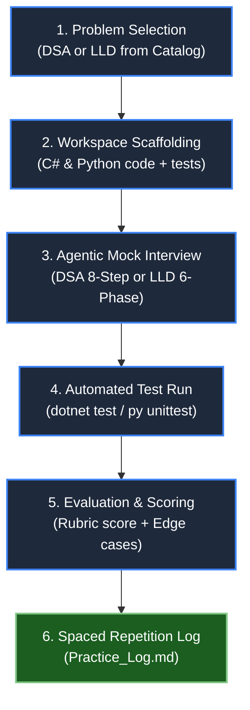

# Agentic Practice Orchestrator Skill

## Purpose & Scope
This skill coordinates the complete multi-agent practice workflow for Senior, Lead, and Staff FAANG interview preparation across both Data Structures & Algorithms (DSA) and Low-Level Design (LLD).



---

## Supported Modes & Workflows

### Mode 1: Interactive DSA Practice Session
1. **Selection:** Pick problem by name, pattern (e.g. Monotonic Stack, Sliding Window), phase (1–25), or Tier (1 Warm-up, 2 FAANG Medium, 3 Hard Anchor).
2. **Scaffold:** Check if problem exists in `Coding_Practice/Senior_Practice/csharp` and `python`. If not, generate starter code and unit tests.
3. **Conduct Interview:** Invoke or emulate `dsa_mock_interviewer` following the **Intuitive 8-Step Delivery Arc**:
   - Clarify & Bounds -> Naive Baseline -> Spot Bottleneck -> Intuitive Hook & Pattern -> Visual Proof -> Complexity -> Idiomatic Code -> Edge-Case Dry Run.
4. **Run Tests:** Execute `dotnet test` or `py -m unittest` to verify the candidate's implementation against all test vectors.
5. **Score & Log:** Grade on the 4-pillar rubric (1–4 each, max 16) and append entry to `learning_tracking/Practice_Log.md`.

---

### Mode 2: Interactive LLD Practice Session
1. **Selection:** Pick an LLD problem from `LLD/` roadmap (Tier 1 Highest Priority: Meeting Room Booking, Generic Message Processor, Custom Cache, Parking Lot, etc.).
2. **Scaffold:** Check if workspace exists in `Coding_Practice/LLD_Practice/`. If not, generate domain model, interface skeleton, and xUnit/unittest files.
3. **Conduct Interview:** Invoke or emulate `lld_architect_interviewer` following the **6-Phase LLD Arc**:
   - Scope & NFRs -> Core Domain Contracts -> Class & State Modeling -> Patterns & Concurrency -> Idiomatic Code -> Extensibility Drill.
4. **Run Tests:** Execute `dotnet test Coding_Practice\LLD_Practice\csharp\LLDPractice.Tests.csproj` or `py -m unittest discover -s Coding_Practice\LLD_Practice\python -p "test_*.py"`.
5. **Score & Log:** Grade on LLD scorecard (1–4 each) and record design choices in `learning_tracking/Practice_Log.md`.

---

### Mode 3: Rapid Automated Code Evaluation
- Run whenever the user provides code and asks for review/feedback:
  - Delegate to `dsa_code_evaluator` or `lld_code_evaluator`.
  - Check time/auxiliary space complexity, allocation overhead (`Span<T>`, avoiding LINQ in hot loops), race conditions, and thread safety.
  - Run the test suite and provide immediate actionable feedback.

---

## 🛠️ CLI Quick Actions

The repository includes a PowerShell runner script at `.agents/scripts/practice.ps1`:

- **Run all DSA tests:**
  ```powershell
  dotnet test Coding_Practice\Senior_Practice\csharp\SeniorPractice.Tests.csproj
  py -m unittest discover -s Coding_Practice\Senior_Practice\python
  ```

- **Run all LLD tests:**
  ```powershell
  dotnet test Coding_Practice\LLD_Practice\csharp\LLDPractice.Tests.csproj
  py -m unittest discover -s Coding_Practice\LLD_Practice\python -p "test_*.py"
  ```

- **Run script helper:**
  ```powershell
  .\.agents\scripts\practice.ps1 -Type dsa -Action test
  .\.agents\scripts\practice.ps1 -Type lld -Action test
  ```

---

## Progress Logging Invariant
Every completed practice session must append a row to `learning_tracking/Practice_Log.md`:
```markdown
| Date | Sprint | Tier | Pattern | Problem & Link | Lang | Time (min) | Status | Complexity | Invariant Key & Edge-Case Notes |
```
Include:
- The core invariant / design pattern used.
- Crucial edge cases verified.
- Spaced repetition follow-up date.
