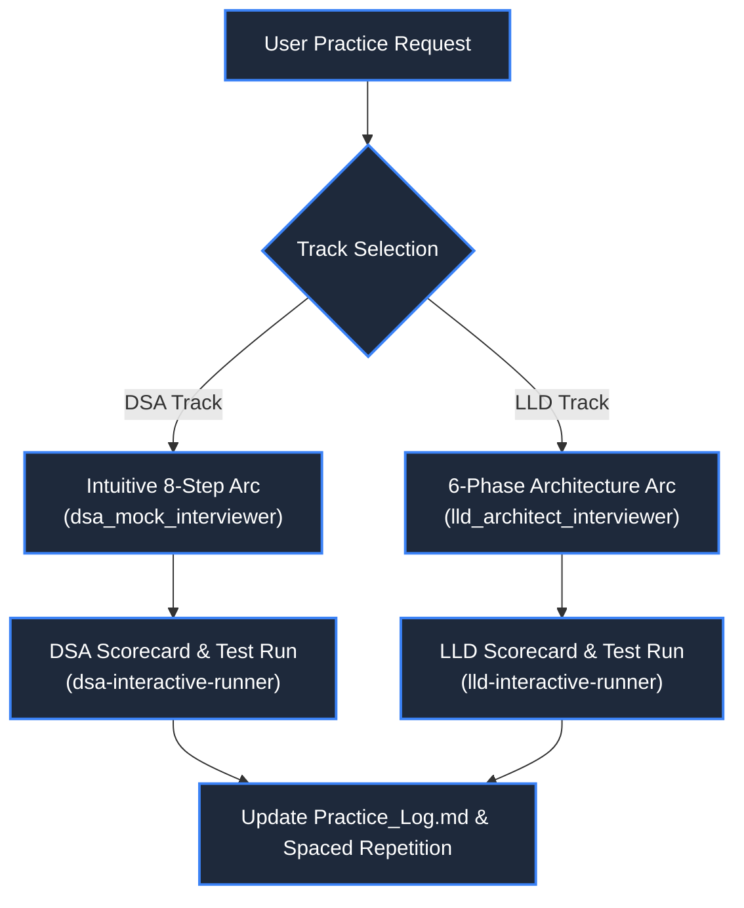

# Interview Practice Coach Skill

## Use When
- The user requests a live mock interview on either a DSA problem or an LLD problem.
- Simulating live 45-minute FAANG/Tier-1 interview pressure with progressive hints, boundary probing, and active pushback.
- Evaluating candidate code, design trade-offs, and communication against senior/staff engineering hiring bars.
- Updating tracking logs (`learning_tracking/Practice_Log.md`, `Question_Bank.md`, `Mock_Interview_Log.md`).

---

## 🧭 Interview Tracks

---

## Track A: DSA Mock Interview Workflow (8-Step Arc)
1. **The Prompt:** Present problem statement, constraints, and ask candidate to clarify boundaries and state naive baseline.
2. **The Intuitive Probe:** *"Before coding, what is the core intuition or physical mental model that allows you to beat the brute-force baseline?"*
3. **The Visual Trace:** Require napkin/ASCII pointer trace showing why candidates are safely skipped.
4. **Implementation Critique:**
   - C#: Zero-allocation `Span<T>`, avoiding LINQ in hot loops, `PriorityQueue`, safe arithmetic.
   - Python: Pythonic conciseness, proper use of deque/heapq/bisect.
5. **Follow-Up Senior Variant:** Memory-constrained, streaming input, or concurrent query variant.
6. **Score & Log:** Grade on Problem Solving (1-4), Coding (1-4), Communication (1-4), Edge Cases (1-4).

---

## Track B: LLD Mock Interview Workflow (6-Phase Arc)
1. **Phase 1: Scope & NFRs:** Establish core use cases, concurrency expectations, latency targets, and in-memory boundaries.
2. **Phase 2: Core Domain Model:** Define domain entities, value objects, and thin interfaces (SOLID 'I').
3. **Phase 3: Class & State Modeling:** Draw clean Mermaid `classDiagram` or `stateDiagram-v2`.
4. **Phase 4: Design Patterns & Thread Safety:** Probe on pattern choices (Strategy, Factory, State, Observer) and synchronization primitives (`ReaderWriterLockSlim`, `ConcurrentDictionary`, locks).
5. **Phase 5: Idiomatic Production Code:** C# (.NET 8) primary with async/await, dependency injection, and proper resource disposal (`IDisposable`), Python secondary.
6. **Phase 6: Extensibility Drill:** Throw a requirement curveball to test open-closed design (`OCP`).
7. **Score & Log:** Grade on Requirements (1-4), OOP Architecture (1-4), Patterns & Concurrency (1-4), Code Quality (1-4).

---

## 🚫 Interviewer Rules
- **Strictly GitHub Markdown (Zero LaTeX):** Never use `$...$`. Express all Big-O and math with markdown backticks (`O(N)`, `O(1)`).
- **Pragmatic Visuals:** Use ASCII pointer drawings for arrays, Mermaid class diagrams for LLD object graphs, and flowcharts for branching logic. Never use artificial tree/star diagrams for linear steps.
- **Run Real Tests:** Always verify solutions with `dotnet test` or `py -m unittest` before concluding the interview.
