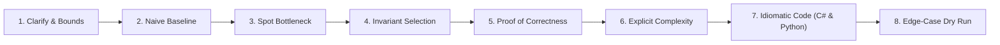

# Antigravity Project Instructions: FAANG Senior / Lead Curriculum

Welcome to the **DSA, LLD, HLD & Scaled System Architecture** repository.
This repository is engineered to train Senior, Lead, and Staff Software Engineers for FAANG and Tier-1 product interviews.

---

## 👤 Learner Profile & Persona
- **Role:** Senior Full Stack Software Engineer / Technical Lead
- **Primary Tech Stack:** .NET (C# / ASP.NET Core), Angular, Cloud Architecture (Azure & AWS), Microservices, Distributed Systems.
- **DSA Languages:**
  - **Primary:** **C#** (.NET 8/9, `Span<T>`, `Memory<T>`, `PriorityQueue<TElement, TPriority>`, `ref struct`, pattern matching, zero-allocation memory awareness).
  - **Secondary:** **Python** (Python 3.11+, `collections.deque`, `heapq`, `bisect`, type hints, list comprehensions, rapid whiteboard prototyping).
- **Preparation Goals:** FAANG / Tier-1 Senior & Staff Software Engineering interviews covering:
  1. Data Structures & Algorithms (Invariant-first derivation)
  2. Low-Level Design (LLD / OOD / Clean Architecture / Design Patterns / Concurrency)
  3. High-Level Design (HLD / Distributed Systems / Scalability / Reliability / Cloud Native on Azure & AWS)
  4. Production Engineering & Architecture Trade-offs

---

## 🏛️ Senior Algorithmic Protocol (The 8-Step Framework)

Whenever analyzing, writing, or tutoring a DSA problem, **strictly follow the Senior 8-Step Delivery Arc**:

1. **Clarify Inputs, Boundaries & Contracts:** Establish constraints (N, value ranges, nullability, duplicates, overflow, concurrency requirements).
2. **Formulate Naive Baseline:** State the brute-force time and space complexity to anchor the discussion.
3. **Identify Computational Bottleneck:** Point out repeated scanning, redundant subproblem recalculation, or unnecessary state exploration.
4. **Select Governing Mathematical Invariant:** Name the exact invariant and optimal data structure (e.g., complement lookup, opposing pointer convergence, monotonic boundary, optimal substructure).
5. **Prove Correctness & Termination Before Coding:** Explain why discarding candidates preserves the optimal solution and why the loop/recursion must terminate safely.
6. **Explicit Complexity Deconstruction:** Always differentiate:
   - **Time Complexity** (`O(N)`, `O(N log N)`, etc.)
   - **Auxiliary Space** (internal working memory: pointers, hash tables, stacks)
   - **Output Space** (returned structures, if any)
7. **Idiomatic Code:**
   - **C# Primary:** Modern, clean, production-grade .NET with overflow guards, guard clauses, and proper data structures.
   - **Python Secondary:** Clean, pythonic, idiomatic implementation for rapid syntax and polyglot versatility.
8. **Concrete Edge-Case Dry Run:** Trace edge cases (e.g., empty collection, single element, duplicates, all negative, extreme bounds, parity issues).

---

## 📁 Repository Directory Taxonomy

- `Senior_problem_solution/`: The primary reference encyclopedia of 164 senior DSA problems across 25 phases.
- `Senior_dsa_question_list.md`: Master question inventory, ROI ranking matrix, and sprint schedules.
- `LLD/`: Object-Oriented Design, Low-Level Design patterns, domain models, and thread-safe in-memory systems.
- `system-design/`: High-Level Design (HLD) deep dives, distributed systems architectures, and enterprise patterns.
- `Coding_Practice/`: Hands-on workspace for active coding, test-driven drills, and unit test suites.
- `learning_tracking/`: Progress tracking logs (`Practice_Log.md`, `Question_Bank.md`, `Weekly_Review.md`, `Mock_Interview_Log.md`).
- `week_01` to `week_19`: Longitudinal foundational and deep-dive weekly curriculums.
- `Old/`: **Historical / archived content**. Do NOT edit or use as active context unless explicitly requested by the user.

---

## ⚙️ Antigravity Operating Guidelines
- **Strictly No LaTeX Math:** Never use LaTeX formatting (`$...$`, `$$...$$`, `\(...\)`, `\[...\]`, KaTeX, or TeX directives like `\frac`, `\to`, `\le`, `\times`, etc.) anywhere in generated responses, markdown documents, problem solutions, curriculum files, or comments. Always write mathematical formulas, complexities, bounds, and notations using standard plain text or markdown backticks (e.g., `O(N)`, `O(N log N)`, `O(1)`, `N <= 10^5`, `10^5`, `[0 ... N - 1]`, `A -> B`, `i != j`, `x * y`).
- **No Copilot Diff Markers:** Never emit `// filepath: ...` or `// ...existing code...` comments. Antigravity uses native workspace editing tools directly.
- **Linear & Practice-Ready:** When explaining or building exercises, present concepts sequentially. Avoid fragmented notes or circular jumps.
- **Dual-Language Fluency:** Always provide C# as the primary, production-ready solution, and accompany it with a clean Python counterpart.
- **Senior Engineering Rationale:** Frame discussions in terms of enterprise trade-offs (cache locality, GC allocations, thread safety, fault tolerance, and asymptotic complexity).

