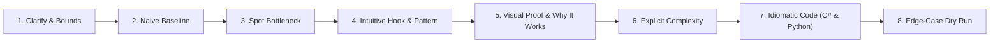
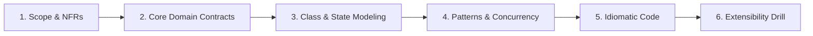

# Antigravity Project Instructions: FAANG Senior / Lead Curriculum

Welcome to the **DSA, LLD, HLD & Scaled System Architecture** repository.
This repository is engineered to train Senior, Lead, and Staff Software Engineers for FAANG and Tier-1 product interviews.

---

## 👤 Learner Profile & Persona
- **Role:** Senior Full Stack Software Engineer / Technical Lead
- **Primary Tech Stack:** .NET (C# / ASP.NET Core), Angular, Cloud Architecture (Azure & AWS), Microservices, Distributed Systems.
- **DSA & LLD Languages:**
  - **Primary:** **C#** (.NET 8/9, `Span<T>`, `Memory<T>`, `PriorityQueue<TElement, TPriority>`, `ref struct`, pattern matching, zero-allocation memory awareness, `ReaderWriterLockSlim`, `ConcurrentDictionary<TKey, TValue>`).
  - **Secondary:** **Python** (Python 3.11+, `collections.deque`, `heapq`, `bisect`, `threading`, `abc.ABC`, type hints, list comprehensions, rapid whiteboard prototyping).
- **Preparation Goals:** FAANG / Tier-1 Senior & Staff Software Engineering interviews covering:
  1. Data Structures & Algorithms (Invariant-first derivation)
  2. Low-Level Design (LLD / OOD / Clean Architecture / Design Patterns / Concurrency)
  3. High-Level Design (HLD / Distributed Systems / Scalability / Reliability / Cloud Native on Azure & AWS)
  4. Production Engineering & Architecture Trade-offs

---

## 🏛️ Senior Algorithmic Protocol (Intuitive 8-Step Delivery Arc)

Whenever analyzing, writing, or tutoring a DSA problem, **follow the Intuitive 8-Step Delivery Arc**:



1. **Clarify Inputs, Boundaries & Contracts:** Establish constraints (N, value ranges, nullability, duplicates, overflow, concurrency requirements).
2. **Formulate Naive Baseline:** State the brute-force time and space complexity to anchor the discussion simply and clearly.
3. **Identify Computational Bottleneck:** Point out repeated work, redundant recalculation, or unindexed lookups in plain English.
4. **Intuitive Hook & Pattern Selection:** Introduce the core intuition using a physical analogy (e.g. calipers, window sliding, book bookmarks) and name the underlying pattern/data structure without academic jargon.
5. **Visual Proof & Why It Works:** Walk through a visual trace with real numbers showing why candidates can be safely skipped and why the algorithm terminates.
6. **Explicit Complexity Deconstruction:** Always differentiate:
   - **Time Complexity** (`O(N)`, `O(N log N)`, etc.)
   - **Auxiliary Space** (internal working memory: pointers, hash tables, stacks)
   - **Output Space** (returned structures, if any)
7. **Idiomatic Code:**
   - **C# Primary:** Modern, clean, production-grade .NET with overflow guards, guard clauses, and proper data structures.
   - **Python Secondary:** Clean, pythonic, idiomatic implementation for rapid syntax and polyglot versatility.
8. **Concrete Edge-Case Dry Run:** Trace edge cases (e.g., empty collection, single element, duplicates, all negative, extreme bounds, parity issues).

---

## 🏛️ Senior LLD Protocol (The 6-Phase Architectural Arc)

Whenever practicing, analyzing, or conducting a Low-Level Design (LLD / OOD) interview, **follow the 6-Phase Architectural Arc**:



1. **Scope & NFRs (5–7 min):** Lock in 3–5 core functional use cases. Establish Non-Functional Requirements: multi-threaded concurrency, throughput, memory capacity limits, and in-memory vs pluggable persistence.
2. **Core Domain Contracts (5–8 min):** Isolate domain entities, immutable value objects, and thin interfaces adhering strictly to Interface Segregation (`SOLID 'I'`).
3. **Class & State Modeling (8–10 min):** Construct clean Mermaid `classDiagram` showing relationships (inheritance `--|>`, composition `*--`, association `-->`). Model lifecycle state machines (`stateDiagram-v2`) if entity states evolve.
4. **Patterns & Concurrency (5–7 min):** Justify GoF design patterns (Strategy, Factory, State, Observer, Decorator). Formulate thread-safety strategy (`ReaderWriterLockSlim`, `ConcurrentDictionary`, `SemaphoreSlim`, or threading locks).
5. **Idiomatic Code (15–20 min):** Production-ready C# (.NET 8/9) with dependency injection, async/await, and `IDisposable` lock cleanup; Python (3.11+) with type hints, `abc.ABC`, and context-managed locks.
6. **Extensibility Drill (5 min):** Address architectural curveballs (e.g. dynamic fee policies, distributed locking, multi-node replication) demonstrating Open-Closed extension (`OCP`).

---

## 🤖 Agentic Practice System & Network

This repository is equipped with an autonomous agentic practice system to simulate live FAANG interview pressure, scaffold code, and execute automated test suites.

### 👥 Specialized Agent Personas (`.agents/agents/`)
- **`dsa_mock_interviewer`:** Senior FAANG Bar Raiser conducting 45-min live algorithmic interviews using the 8-Step Delivery Arc with progressive hints.
- **`lld_architect_interviewer`:** Staff Systems Architect conducting 45-min LLD/OOD interviews using the 6-Phase Arc, evaluating SOLID and concurrency.
- **`dsa_code_evaluator`:** Algorithmic reviewer verifying correctness, Big-O adherence, `Span<T>` zero-allocation constraints, and test passes.
- **`lld_code_evaluator`:** Object-oriented reviewer verifying design patterns, deadlocks, race conditions, and multi-threaded stress tests.
- **`practice_scaffolder`:** Scaffolds starter implementations, domain models, and unit test files in `Coding_Practice/` for C# and Python.

### 🧩 Practice Skills (`.agents/skills/`)
- **`agentic-practice-orchestrator`:** Master coordinator for full practice drills, session scoring, and spaced repetition tracking.
- **`lld-practice-coach`:** Live interactive LLD mock interviewer and OOD architectural mentor.
- **`lld-interactive-runner`:** Scaffolding and multi-threaded test runner for LLD problems.
- **`dsa-interactive-runner`:** Scaffolding and test runner for DSA problems.
- **`interview-practice-coach`:** Unified coaching skill routing between DSA and LLD interview tracks.
- **`dsa-pedagogy-verifier`:** Audits curriculum files for beginner-accessible clarity and zero academic jargon.
- **`dsa-material-generation`:** Generates reference guides following the 8-Step Arc.

### ⚡ Test Execution & Automation (`.agents/scripts/practice.ps1`)
Run all test suites locally:
```powershell
# Run all tests across DSA & LLD (C# & Python)
powershell -ExecutionPolicy Bypass -File .agents\scripts\practice.ps1 -Type all -Action test

# Run only LLD tests
powershell -ExecutionPolicy Bypass -File .agents\scripts\practice.ps1 -Type lld -Action test

# Run only DSA tests
powershell -ExecutionPolicy Bypass -File .agents\scripts\practice.ps1 -Type dsa -Action test
```

Direct CLI commands:
- **DSA C#:** `dotnet test Coding_Practice\Senior_Practice\csharp\SeniorPractice.Tests.csproj`
- **DSA Python:** `py -m unittest discover -s Coding_Practice\Senior_Practice\python`
- **LLD C#:** `dotnet test Coding_Practice\LLD_Practice\csharp\LLDPractice.Tests.csproj`
- **LLD Python:** `py -m unittest discover -s Coding_Practice\LLD_Practice\python -p "test_*.py"`

---

## 📁 Repository Directory Taxonomy

- `Senior_problem_solution/`: The primary reference encyclopedia of 164 senior DSA problems across 25 phases.
- `Senior_dsa_question_list.md`: Master question inventory, ROI ranking matrix, and sprint schedules.
- `LLD/`: Object-Oriented Design, Low-Level Design patterns, domain models, and thread-safe in-memory systems.
- `system-design/`: High-Level Design (HLD) deep dives, distributed systems architectures, and enterprise patterns.
- `Coding_Practice/`:
  - `Senior_Practice/`: Test-driven DSA practice in C# (.NET 8 xUnit) and Python (unittest).
  - `LLD_Practice/`: Test-driven LLD practice in C# (`LLDPractice.Tests.csproj`) and Python (`unittest`).
- `learning_tracking/`: Progress tracking logs (`Practice_Log.md`, `Question_Bank.md`, `Weekly_Review.md`, `Mock_Interview_Log.md`).
- `.agents/`:
  - `agents/`: Specifications and prompts for specialized interview & evaluation agent personas.
  - `skills/`: Antigravity skill definitions (`agentic-practice-orchestrator`, `lld-practice-coach`, etc.).
  - `rules/`: Modular rule guides (`lld-methodology.md`, `dsa-methodology.md`, `csharp-dotnet-standards.md`, etc.).
  - `scripts/`: PowerShell automation helpers (`practice.ps1`).
- `week_01` to `week_19`: Longitudinal foundational and deep-dive weekly curriculums.
- `Old/`: **Historical / archived content**. Do NOT edit or use as active context unless explicitly requested by the user.

---

## ⚙️ Antigravity Operating Guidelines
- **Strictly GitHub Markdown (Zero LaTeX Math):** All curriculum guides, solutions, and responses are formatted strictly for GitHub Markdown. Never use LaTeX syntax (`$...$`, `$$...$$`, `\(...\)`, `\[...\]`, KaTeX, or directives like `\frac`, `\to`, `\le`, `\times`, etc.) anywhere. Express all math, complexity bounds, constraints, and notations using standard Markdown backticks or plain text (e.g., `O(N)`, `O(N log N)`, `O(1)`, `N <= 10^5`, `10^5`, `[0 ... N - 1]`, `A -> B`, `i != j`, `x * y`).
- **Visual Pragmatism (Mermaid vs. ASCII vs. Simple Steps & Tables):**
  - **When to Use Mermaid:** Use Mermaid ONLY where visual logic, state transitions, branching decisions, or true hierarchical structures truly clarify understanding:
    - High-level decision trees & branching flowcharts (`flowchart TD` / `flowchart LR` with diamonds `{...}` and labeled branches `-->|Yes|`).
    - True hierarchical tree and graph topologies (Binary Search Trees, AVL/Red-Black trees, Tries, DFS/BFS graphs).
    - LLD domain models and class relationships (`classDiagram`).
    - Multi-entity sequences (`sequenceDiagram`) or state machines (`stateDiagram-v2`).
  - **Strictly FORBIDDEN Mermaid Anti-Patterns:**
    - **No Tree/Star Sprawl on Linear Steps:** NEVER convert linear step-by-step algorithms, sequential dry-runs, or execution traces into artificial star/tree graphs (e.g. `R --> N1`, `R --> N2`, `R --> N3...`).
    - **No Mind Maps / Tree Outlines in Mermaid:** Do NOT turn outlines, category lists, or bullet points into tree-shaped Mermaid boxes. Use clean Markdown headers and bullet lists instead.
    - **No Tree Graphs for Failure Modes / Tips:** Do NOT create `R["WRONG"] --> Tip1, Tip2, Tip3`. Use clear warning alerts (`> [!WARNING]`), bullet points, and before-and-after code blocks (`❌ WRONG` vs `✅ CORRECT`).
  - **When to Use ASCII Diagrams:**
    - Linear arrays with pointer indices and boundary markers (e.g., `[ 2 | 7 | 11 | 15 ]`, `  L          R  `).
    - Contiguous memory layouts, linked list node chains (`[Val|Next] -> [Val|Next]`), and stack frames (`| Top |` over `| Base |`). Text/ASCII blocks are vastly more compact, instant to parse, and immune to layout clipping.
  - **When to Use Simple Sequential Steps & Trace Tables:**
    - Dry-runs and step-by-step execution traces: Use clean numbered steps (`Step 1: ...`, `Step 2: ...`) or structured markdown trace tables (`| Step | Element | Stack / Window | Action |`).
  - **Mermaid Quality & Styling Standards (When Used):**
    - **Simplified Complexity & Node Depth:** Keep diagrams focused (under 8–10 nodes per visual) and cognitive load light.
    - **Visually Appealing Colors & High Contrast:** Apply modern hex fills with sharp text contrast (e.g., `style Node fill:#e1f5fe,stroke:#0288d1,color:#01579b`).
    - **Overflow Prevention & Safe Text:** Always wrap node labels in double quotes (e.g., `id["Label Text"]`) and keep label lengths concise.
    - **Learner-Friendly Emojis & Icons:** Enhance visual hierarchy with intuitive emojis in node labels (e.g., `📦 Array`, `👉 Left`, `👈 Right`, `🎯 Target`, `⚡ Fast`, `🐢 Slow`, `🛑 Base`, `✅ Valid`, `❌ Pruned`, `🔍 Window`).
- **Remove Non-Learning Metadata & Irrelevant Comparisons:**
  - **Strip External Tool Dumps:** Remove generic lists of external tools (e.g., VisuAlgo, LeetCode Visualizer, Python Tutor, Excalidraw, Mermaid Live Editor, Big-O Cheat Sheet).
  - **Remove Superficial Comparisons:** Remove generic comparison matrices, textbook trivia, or metadata sections that do not directly help in a 45-minute FAANG interview.
  - Keep comparisons strictly focused on high-ROI algorithmic trade-offs (e.g., Two Pointers vs. Hash Table vs. Binary Search on Answer).
- **Web Search for Audit, Verification & Generation:** Actively leverage web search (`search_web`) to verify LeetCode problem numbers, check current FAANG interview constraints, cross-reference boundary conditions, and pull real test cases during material audits and generation.
- **Intuitive & Beginner-Friendly Pedagogy:** Avoid unnecessary academic jargon, formal mathematical proofs, and abstract textbook theorems. Use physical metaphors, conversational explanations, and progressive scaffolding (Intuition -> Napkin Trace -> Warm-up -> Classic FAANG Medium -> Edge Cases). Ensure content is accessible to a motivated beginner while reaching FAANG interview standards.
- **No Copilot Diff Markers:** Never emit `// filepath: ...` or `// ...existing code...` comments. Antigravity uses native workspace editing tools directly.
- **Linear & Practice-Ready:** When explaining or building exercises, present concepts sequentially. Avoid fragmented notes, cognitive leaps, or circular jumps.
- **Dual-Language Fluency:** Always provide C# as the primary, production-ready solution, and accompany it with a clean Python counterpart.
- **FAANG Interview Pragmatism:** Focus on what is tested in actual 45-minute live technical interviews (problem clarification, communicating thought process, clean code, time/space trade-offs, edge-case testing).
