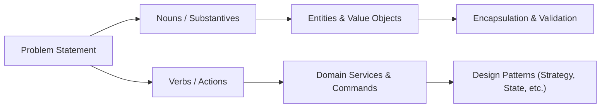

# 06. The Machine Coding & LLD Interview Execution Framework

A successful Low-Level Design (LLD) or Machine Coding interview is rarely won on raw syntax knowledge. Candidates fail because of **poor time management, under-specified requirements, over-engineering too early, or writing untestable code**.

This framework provides a repeatable, battle-tested playbook for 45-minute OOD rounds and 90-minute Machine Coding rounds at top tech firms (FAANG, Uber, Stripe, Atlassian, Razorpay, PhonePe, Swiggy).

---

## ⏱️ 1. Pacing & Time Allocation Strategy

### The 45-Minute OOD Round (Focus: Class Design, Patterns & Tradeoffs)
Used by Google, Meta, Microsoft, Amazon for System/Object-Oriented Design screening.

```mermaid
gantt
    title 45-Minute OOD Interview Timeline
    dateFormat  m
    axisFormat %M min
    section Discovery
    Clarify Requirements & Scoping :0, 8
    section Design
    Class Diagram & Domain Entities :8, 18
    Interface Contracts & Design Patterns :18, 25
    section Implementation
    Core Logic & Concurrency Strategy :25, 38
    section Verification
    Edge Cases, Tradeoffs & Wrap-up :38, 45
```



| Phase | Time | Candidate Deliverables |
| :--- | :---: | :--- |
| **1. Scoping & Constraints** | 0 – 8 min | Functional vs Non-Functional requirements, scale, concurrency expectations, error handling strategy. |
| **2. Domain Modeling** | 8 – 18 min | Identify Entities, Value Objects, Enums, and Relationships (Composition vs Inheritance). Draw Mermaid/ASCII diagram. |
| **3. Interface Contracts & Patterns** | 18 – 25 min | Define clean service interfaces (`IBookingService`, `IPricingStrategy`). Isolate variation points using Strategy/Factory/State. |
| **4. Core Implementation** | 25 – 38 min | Write the critical execution path. Emphasize thread safety, encapsulation, and clean DI. Avoid writing boilerplate getters/setters. |
| **5. Edge Cases & Tradeoffs** | 38 – 45 min | Walk through concurrent scenarios, deadlocks, out-of-stock conditions, scaling tradeoffs, and testing strategy. |

---

### The 90-Minute Machine Coding Round (Focus: Working, Compiling & Clean Code)
Used by Uber, Swiggy, Flipkart, Razorpay, PhonePe, Cred, Zepto.

```mermaid
gantt
    title 90-Minute Machine Coding Timeline
    dateFormat  m
    axisFormat %M min
    section Discovery
    Requirements & Edge Cases :0, 15
    section Modeling
    Domain Entities & Invariants :15, 30
    section Core Coding
    Services, Repositories & Patterns :30, 65
    section Driver & Tests
    Driver Program & Unit Tests :65, 80
    section Review
    Refactoring, Concurrency & Review :80, 90
```



| Phase | Time | Candidate Deliverables |
| :--- | :---: | :--- |
| **1. Requirement Discovery** | 0 – 15 min | Freeze scope with interviewer. Document in-scope vs out-of-scope. Define command formats / APIs. |
| **2. Domain Modeling** | 15 – 30 min | Write pure Entities, Value Objects, and Enums with private setters and invariant protection. |
| **3. Core Logic & Patterns** | 30 – 65 min | Implement Business Services and in-memory thread-safe Repositories (`ConcurrentDictionary`). Apply GoF patterns. |
| **4. Driver & Edge Tests** | 65 – 80 min | Build interactive console `Program.cs` / REPL or comprehensive unit test suite (`xUnit`). |
| **5. Polish & Review** | 80 – 90 min | Code cleanup, thread safety check, exception handling, and self-review before submitting. |

---

## 🧭 2. The Requirement Discovery Cheatsheet

Never start coding immediately. Spend the first 10 minutes asking targeted questions categorized into these 5 dimensions:

### A. Functional Scope (Features)
* *"What is the primary happy path?"* (e.g., Rider books cab $\rightarrow$ Driver assigned $\rightarrow$ Ride completes $\rightarrow$ Payment recorded).
* *"What features are explicitly out of scope for today?"* (e.g., Promo codes, multi-destination stops, driver ratings).
* *"Are there multiple user personas or roles?"* (e.g., Customer, Admin, Vendor, Driver).

### B. Concurrency & Contention
* *"Can multiple users book the exact same resource simultaneously?"* (e.g., Same meeting room, concert seat, or bank account).
* *"Is this single-process multi-threaded or multi-instance distributed?"* (In-memory locks vs Redis/DB locks).
* *"How should the system behave under contention?"* (Fail fast, queue/retry, or return a friendly conflict error).

### C. Data Volume & In-Memory Constraints
* *"How much data will live in memory during a single run?"* (Determines whether you use an array, hash map, or balanced tree).
* *"Do queries require sorted order or range lookups?"* (Hash map $O(1)$ vs Balanced BST / `SortedSet` $O(\log N)$).

### D. Consistency & Transactions
* *"Does this operation require atomic multi-entity updates?"* (e.g., Deduct wallet A and credit wallet B together).
* *"What is the fallback if step 2 fails?"* (Compensating transaction, rollback, or idempotent retry).

### E. Extensibility Points
* *"Is pricing / allocation / notification expected to change frequently?"* (Signals need for **Strategy Pattern**).
* *"Do we expect new payment gateways / message formats?"* (Signals need for **Adapter / Factory Pattern**).

---

## 🧠 3. The Noun-Verb Domain Extraction Technique

When given an ambiguous prompt, use this systematic linguistic parsing technique:



### Example: "Design an Online Cab Booking Service (Uber Lite)"

1. **Extract Nouns**:
   * *Rider, Driver, Cab, Location, Trip, Payment, Invoice.*
   * **Entities (Identity matters)**: `Rider`, `Driver`, `Trip`.
   * **Value Objects (Immutable properties)**: `Location(Latitude, Longitude)`, `Money(Amount, Currency)`.
   * **Enums**: `CabType (Sedan, SUV, Hatchback)`, `TripStatus (Requested, Assigned, InProgress, Completed, Cancelled)`.

2. **Extract Verbs**:
   * *Register driver, Request ride, Find matching driver, Accept ride, Start ride, Calculate fare, Process payment.*
   * **Services**: `TripService`, `MatchingService`, `PricingService`, `PaymentService`.

3. **Identify Variation Points**:
   * Driver matching logic varies (Nearest Driver vs Highest-Rated Driver) $\rightarrow$ `IDriverMatchingStrategy`.
   * Fare calculation varies (Standard vs Surge vs Night-time) $\rightarrow$ `IPricingStrategy`.
   * Trip lifecycle has transitions $\rightarrow$ State transitions guarded inside `Trip` aggregate.

---

## 📝 4. Live Coding Architecture Blueprint (Layering)

Structure your code cleanly inside your single file or project using these 4 strict layers:

```
[Presentation / Driver Layer]   --> Program.cs / REPL / Web API Controller
          ↓
[Application / Service Layer]   --> TripService, OrderCoordinator (Orchestration, DI)
          ↓
[Domain Layer (Core)]           --> Entities, Value Objects, Domain Exceptions, Interfaces
          ↓
[Infrastructure / Storage Layer] --> In-Memory Repositories, ConcurrentDictionary, External Adapters
```

### Golden Rules of Clean Machine Coding:
1. **No Business Logic in Repositories**: Repositories only store and retrieve; they do not calculate pricing or validate business states.
2. **No Storage in Entities**: Entities hold state and protect invariants; they do not call database APIs or I/O.
3. **Immutability by Default**: Use `record` for Value Objects, DTOs, and Events. Use `private set` for Entity properties.
4. **Result Pattern over Raw Exceptions**: Use `Result<T>` for domain validation errors; reserve `Exception` for unexpected system failures.

---

## 💯 5. The Senior Machine Coding Evaluation Rubric

Top product companies evaluate your code against this 100-point scorecard:

| Category | Weight | What Evaluators Look For | Red Flags (-10 to -20 pts) |
| :--- | :---: | :--- | :--- |
| **1. Domain Modeling** | **25 pts** | Rich domain models, proper Value Objects, protected invariants, zero anemic models. | Public setters everywhere, primitive obsession, logic scattered in controllers. |
| **2. SOLID & Design Patterns** | **20 pts** | Proper use of Strategy, Factory, State; interface-driven design; composition over inheritance. | Massive switch/if-else ladders, hardcoded `new` instantiations, bloated God classes. |
| **3. Concurrency & Correctness** | **20 pts** | Thread-safe data structures (`ConcurrentDictionary`), proper locking (`SemaphoreSlim`), deadlock avoidance. | Standard `List<T>` accessed concurrently, synchronous `lock` over async code, race conditions. |
| **4. Code Cleanliness & Structure** | **20 pts** | Clear naming, separation of concerns, DRY, KISS, meaningful folder/namespace layout. | 500-line monolithic files with zero abstraction, cryptically named variables. |
| **5. Testing & Driver Verification** | **15 pts** | Clean `Main` simulating real user flows, multi-threaded stress tests, handling of edge cases. | Code doesn't compile, zero verification, fails on empty/null input. |

---

## 🚀 6. The 5-Minute Pre-Submission Checklist

Before telling the interviewer you are finished, verify:
* [ ] Does the code compile without any warnings or syntax errors?
* [ ] Are all public entity properties protected with `private set`?
* [ ] Did I handle invalid inputs (e.g., negative money, null strings, overlapping times)?
* [ ] Is every shared in-memory collection thread-safe?
* [ ] Did I demonstrate both the happy path and at least two edge-case failures in `Main()`?
* [ ] Can I verbally explain *why* I picked this design pattern over alternatives?

