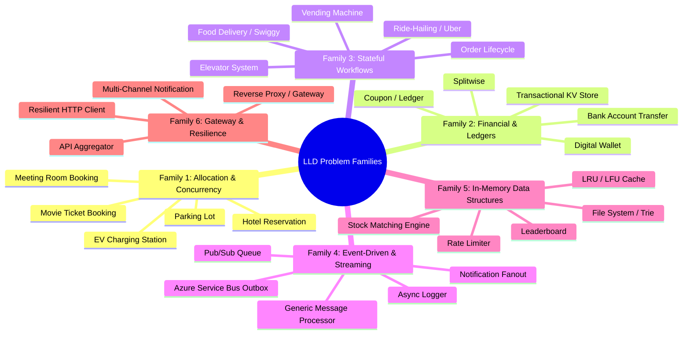

# 08. LLD Problem Families & Design Evolution (V1 → V2)

One of the most powerful methodologies in Low-Level Design (popularized by advanced curricula like CrackingWalnuts) is recognizing that **there are no unique problems—only problem families**.

When an interviewer presents a seemingly novel problem (e.g., *"Design an electric vehicle charging station queue"* or *"Design a locker delivery kiosk"*), a senior engineer does not panic or design from scratch. Within 60 seconds, they map it to a **known Problem Family**, instantiate the standard design patterns for that family, and then evolve the solution from a baseline **V1 (Naive)** to **V2 (Senior Production)**.

---

## 🧭 1. The 6 Reusable Problem Archetypes (Families)

Every machine coding or LLD interview question asked in tech falls into one of these 6 families:



---

### Family 1: Allocation & Concurrency Conflicts
* **The Core Tension**: Multiple concurrent users competing for a limited pool of resources (spots, rooms, seats, items).
* **Key Invariants**: No double-booking; atomic slot reservation with time-to-live (TTL).
* **GoF Patterns**: Strategy (Allocation algorithm: Nearest vs Best-Fit), Factory (Resource creation).
* **Senior Concurrency**: Pessimistic Locking (`SELECT ... FOR UPDATE`), Optimistic Concurrency (`RowVersion`), or Distributed Lock (Redis RedLock).
* **Representative Problems**: [Parking Lot](../01_Tier1_Highest_Priority/06_Parking_Lot.md), [Meeting Room Booking](../01_Tier1_Highest_Priority/01_Meeting_Room_Booking.md), [Movie Ticket Booking](../02_Tier2_Classic_LLD/08_Movie_Booking.md).

---

### Family 2: Financial & Immutable Ledgers
* **The Core Tension**: Accurate monetary calculations, audit trails, and multi-resource balance updates without deadlocks.
* **Key Invariants**: Double-entry bookkeeping (Debits = Credits); no floating-point arithmetic (`decimal` only); immutable audit logs.
* **GoF Patterns**: Command (Atomic transactions), Strategy (Split calculations: Equal, Exact, Percent).
* **Senior Concurrency**: Consistent lock ordering (sorting Account IDs to prevent circular deadlocks), Idempotency Keys.
* **Representative Problems**: [Digital Wallet & Ledger](../04_Tier4_Senior_Backend/22_Digital_Wallet_Ledger.md), [Splitwise](../02_Tier2_Classic_LLD/11_Splitwise.md), [Transactional KV Store](../04_Tier4_Senior_Backend/19_Transactional_Key_Value_Store.md).

---

### Family 3: Stateful Workflow & Transit Engines
* **The Core Tension**: An entity moves through rigid lifecycle states where valid actions depend strictly on the current state.
* **Key Invariants**: Invalid transitions rejected; side-effects emitted on state entry/exit.
* **GoF Patterns**: **State Pattern** (encapsulating state-specific behavior), Observer (notifying interested parties on state change).
* **Senior Concurrency**: State validation atomic compare-and-swap, state transition idempotency.
* **Representative Problems**: [Elevator System](../02_Tier2_Classic_LLD/10_Elevator.md), [Vending Machine](../02_Tier2_Classic_LLD/12_Vending_Machine.md), [Ride-Hailing System](../02_Tier2_Classic_LLD/20_Ride_Hailing_System.md), [Food Delivery](../02_Tier2_Classic_LLD/21_Food_Delivery_System.md).

---

### Family 4: Event-Driven, Messaging & Buffering
* **The Core Tension**: Decoupling producers from consumers while handling backpressure and avoiding data loss.
* **Key Invariants**: Guaranteed at-least-once or exactly-once delivery; no message loss during process restart.
* **GoF Patterns**: Observer, Factory, Chain of Responsibility.
* **Senior Concurrency**: Lock-free producer-consumer via `System.Threading.Channels`, Transactional Outbox Pattern with DB transactions.
* **Representative Problems**: [Pub/Sub Message Queue](../04_Tier4_Senior_Backend/14_Pub_Sub.md), [Generic Message Processor](../01_Tier1_Highest_Priority/02_Generic_Message_Processor.md), [DDD + Outbox Pattern](../01_Tier1_Highest_Priority/04_DDD_CQRS_AzureServiceBus.md), [Logger](../02_Tier2_Classic_LLD/13_Logger.md).

---

### Family 5: High-Performance In-Memory Data Structures
* **The Core Tension**: Sub-millisecond read/write latency under heavy multi-threading.
* **Key Invariants**: $O(1)$ or $O(\log N)$ algorithmic operations; clean composite hierarchy.
* **GoF Patterns**: Composite, Iterator, Decorator.
* **Senior Concurrency**: `ReaderWriterLockSlim` (multi-reader single-writer), `ConcurrentDictionary`, custom `IComparer` on Red-Black trees (`SortedSet`).
* **Representative Problems**: [LRU Cache](../03_Tier3_DSA_Screening/15_LRU_Cache.md), [In-Memory File System](../02_Tier2_Classic_LLD/24_In_Memory_File_System.md), [Stock Matching Engine](../04_Tier4_Senior_Backend/23_Stock_Exchange_Matching_Engine.md), [Rate Limiter](../04_Tier4_Senior_Backend/09_Rate_Limiter.md).

---

### Family 6: Gateway, Resilience & Multi-Channel Dispatch
* **The Core Tension**: Handling slow or failing third-party dependencies without cascading outages.
* **Key Invariants**: Circuit breakers prevent hammering dead services; timeouts protect thread pools.
* **GoF Patterns**: Adapter (normalizing external APIs), Decorator (transparently adding Retry/Logging/Cache), Strategy (Channel dispatch).
* **Senior Concurrency**: `Task.WhenAll`, `HttpClientFactory`, Polly Policies.
* **Representative Problems**: [Resilient API Aggregator](../01_Tier1_Highest_Priority/05_Resilient_API_Aggregator.md), [Notification System](../01_Tier1_Highest_Priority/08_Notification_System.md).

---

## ⚡ 2. The 60-Second Problem Classifier Decision Tree

When given any interview problem, run this rapid mental diagnostic:

```
1. Is money or balance moving between parties?
   └── YES ➔ Family 2 (Financial / Double-Entry Ledger)
2. Are users competing for physical/virtual slots that cannot overlap?
   └── YES ➔ Family 1 (Allocation & Concurrency Conflicts)
3. Does the entity have distinct phases like Requested -> Accepted -> Completed?
   └── YES ➔ Family 3 (Stateful Workflow Engine)
4. Is this handling async events, logs, or background queues?
   └── YES ➔ Family 4 (Event-Driven & Messaging)
5. Is the prompt asking for O(1) operations, file trees, or order books?
   └── YES ➔ Family 5 (High-Performance In-Memory Data Structure)
6. Are we calling multiple flaky external APIs or sending to Email/SMS/Push?
   └── YES ➔ Family 6 (Gateway, Resilience & Dispatch)
```

---

## 🔄 3. The "V1 (Naive) → V2 (Senior Production)" Evolution

In top interviews, the interviewer deliberately starts with a simplified problem and then **drops curveballs** to see if your design can evolve cleanly without a full rewrite.

```mermaid
flowchart LR
    subgraph V1["V1: Naive (Mid-Level)"]
        A1["Anemic Domain Models\n(Public {get; set;})"]
        A2["Big Switch / If-Else\nfor Variations"]
        A3["Simple List<T> / Dictionary\n(Non-thread-safe)"]
    end

    subgraph Pressure["Design Pressures (Curveballs)"]
        P1["'Now add 3 more payment methods'"]
        P2["'1,000 users click Book at the same millisecond'"]
        P3["'Network drops mid-operation'"]
    end

    subgraph V2["V2: Senior Production"]
        B1["Rich Aggregates & Invariants\n(Private setters, Result<T>)"]
        B2["Strategy + Factory Pattern\n(Open/Closed Principle)"]
        B3["Concurrent Primitives & Locks\n(SemaphoreSlim, RowVersion)"]
        B4["Idempotency & Outbox Pattern"]
    end

    V1 --> Pressure
    Pressure --> V2
```



### Contrast Table: What Separates V1 from V2

| Dimension | ❌ V1 (Naive / Mid-Level) | ✅ V2 (Senior Production) |
| :--- | :--- | :--- |
| **Domain Modeling** | Anemic classes: public getters and setters; validation scattered in services. | **Rich Aggregate**: Private setters, self-validating constructors, factory methods. |
| **Extensibility** | `switch (type) { case Email: ... case SMS: ... }` (Violates OCP). | **Strategy + Factory / DI**: New channel added without modifying existing code. |
| **Concurrency** | Uses standard `List<T>` or `Dictionary<K, V>`. Crashes with `InvalidOperationException`. | Uses `ConcurrentDictionary`, `SemaphoreSlim(1,1)`, or `ReaderWriterLockSlim`. |
| **Error Handling** | Throws raw `Exception` for routine business rule violations (expensive stack traces). | Uses **Result Pattern** (`Result.Ok()`, `Result.Fail("msg")`) for business outcomes. |
| **Money Handling** | Uses `double` or `float` (causes rounding errors: `$0.1 + $0.2 != $0.3`). | Uses `decimal` with explicit rounding rules and invariant checks. |
| **Deadlock Risk** | Locks arbitrary resources in the order requests arrive. | Enforces **lexicographical lock ordering** (`idA < idB ? lock(A) : lock(B)`). |

---

## 🎯 4. Practical Script: How to Articulate Evolution to the Interviewer

When interviewing, verbally state your evolution plan:

> *"I will first lay out the clean core domain model and happy path (V1) to establish the contract. Then, I will address the high-concurrency contention and edge-case failures (V2) by introducing deterministic locking, idempotency, and Strategy patterns for extensibility."*

This demonstrates to the interviewer that you understand **pragmatic delivery**, but also possess the **architectural maturity** to make the system production-grade.

