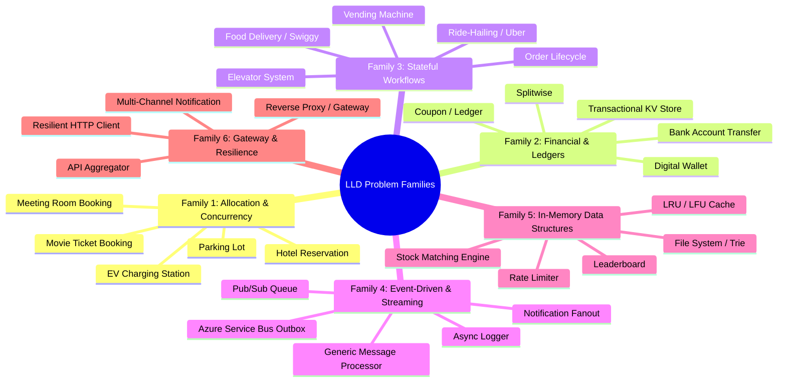

# 08. LLD Problem Families & Design Evolution (V1 → V2)

One of the most powerful methodologies in Low-Level Design (popularized by advanced curricula like CrackingWalnuts) is recognizing that **there are no unique problems—only problem families**.

When an interviewer presents a seemingly novel problem (e.g., *"Design an electric vehicle charging station queue"* or *"Design a locker delivery kiosk"*), a senior engineer does not panic or design from scratch. Within 60 seconds, they map it to a **known Problem Family**, instantiate the standard design patterns for that family, and then evolve the solution from a baseline **V1 (Naive)** to **V2 (Senior Production)**.

---

## 🧭 1. The 6 Reusable Problem Archetypes (Families)

Every machine coding or LLD interview question asked in tech falls into one of these 6 families:



---

### Family 1: Allocation & Concurrency Conflicts
* **The Core Tension**: Multiple concurrent users competing for a limited pool of resources (spots, rooms, seats, items).
* **Key Invariants**: No double-booking; atomic slot reservation with time-to-live (TTL).
* **GoF Patterns**: Strategy (Allocation algorithm: Nearest vs Best-Fit), Factory (Resource creation).
* **Senior Concurrency**: Pessimistic Locking (`SELECT ... FOR UPDATE`), Optimistic Concurrency (`RowVersion`), or Distributed Lock (Redis RedLock).
* **Representative Problems**: [Parking Lot](../01_Tier1_Highest_Priority/06_Parking_Lot.md), [Meeting Room Booking](../01_Tier1_Highest_Priority/01_Meeting_Room_Booking.md), [Movie Ticket Booking](../02_Tier2_Classic_LLD/08_Movie_Booking.md).

---

### Family 2: Financial & Immutable Ledgers
* **The Core Tension**: Accurate monetary calculations, audit trails, and multi-resource balance updates without deadlocks.
* **Key Invariants**: Double-entry bookkeeping (Debits = Credits); no floating-point arithmetic (`decimal` only); immutable audit logs.
* **GoF Patterns**: Command (Atomic transactions), Strategy (Split calculations: Equal, Exact, Percent).
* **Senior Concurrency**: Consistent lock ordering (sorting Account IDs to prevent circular deadlocks), Idempotency Keys.
* **Representative Problems**: [Digital Wallet & Ledger](../04_Tier4_Senior_Backend/22_Digital_Wallet_Ledger.md), [Splitwise](../02_Tier2_Classic_LLD/11_Splitwise.md), [Transactional KV Store](../04_Tier4_Senior_Backend/19_Transactional_Key_Value_Store.md).

---

### Family 3: Stateful Workflow & Transit Engines
* **The Core Tension**: An entity moves through rigid lifecycle states where valid actions depend strictly on the current state.
* **Key Invariants**: Invalid transitions rejected; side-effects emitted on state entry/exit.
* **GoF Patterns**: **State Pattern** (encapsulating state-specific behavior), Observer (notifying interested parties on state change).
* **Senior Concurrency**: State validation atomic compare-and-swap, state transition idempotency.
* **Representative Problems**: [Elevator System](../02_Tier2_Classic_LLD/10_Elevator.md), [Vending Machine](../02_Tier2_Classic_LLD/12_Vending_Machine.md), [Ride-Hailing System](../02_Tier2_Classic_LLD/20_Ride_Hailing_System.md), [Food Delivery](../02_Tier2_Classic_LLD/21_Food_Delivery_System.md).

---

### Family 4: Event-Driven, Messaging & Buffering
* **The Core Tension**: Decoupling producers from consumers while handling backpressure and avoiding data loss.
* **Key Invariants**: Guaranteed at-least-once or exactly-once delivery; no message loss during process restart.
* **GoF Patterns**: Observer, Factory, Chain of Responsibility.
* **Senior Concurrency**: Lock-free producer-consumer via `System.Threading.Channels`, Transactional Outbox Pattern with DB transactions.
* **Representative Problems**: [Pub/Sub Message Queue](../04_Tier4_Senior_Backend/14_Pub_Sub.md), [Generic Message Processor](../01_Tier1_Highest_Priority/02_Generic_Message_Processor.md), [DDD + Outbox Pattern](../01_Tier1_Highest_Priority/04_DDD_CQRS_AzureServiceBus.md), [Logger](../02_Tier2_Classic_LLD/13_Logger.md).

---

### Family 5: High-Performance In-Memory Data Structures
* **The Core Tension**: Sub-millisecond read/write latency under heavy multi-threading.
* **Key Invariants**: $O(1)$ or $O(\log N)$ algorithmic operations; clean composite hierarchy.
* **GoF Patterns**: Composite, Iterator, Decorator.
* **Senior Concurrency**: `ReaderWriterLockSlim` (multi-reader single-writer), `ConcurrentDictionary`, custom `IComparer` on Red-Black trees (`SortedSet`).
* **Representative Problems**: [LRU Cache](../03_Tier3_DSA_Screening/15_LRU_Cache.md), [In-Memory File System](../02_Tier2_Classic_LLD/24_In_Memory_File_System.md), [Stock Matching Engine](../04_Tier4_Senior_Backend/23_Stock_Exchange_Matching_Engine.md), [Rate Limiter](../04_Tier4_Senior_Backend/09_Rate_Limiter.md).

---

### Family 6: Gateway, Resilience & Multi-Channel Dispatch
* **The Core Tension**: Handling slow or failing third-party dependencies without cascading outages.
* **Key Invariants**: Circuit breakers prevent hammering dead services; timeouts protect thread pools.
* **GoF Patterns**: Adapter (normalizing external APIs), Decorator (transparently adding Retry/Logging/Cache), Strategy (Channel dispatch).
* **Senior Concurrency**: `Task.WhenAll`, `HttpClientFactory`, Polly Policies.
* **Representative Problems**: [Resilient API Aggregator](../01_Tier1_Highest_Priority/05_Resilient_API_Aggregator.md), [Notification System](../01_Tier1_Highest_Priority/08_Notification_System.md).

---

## ⚡ 2. The 60-Second Problem Classifier Decision Tree

When given any interview problem, run this rapid mental diagnostic:

```
1. Is money or balance moving between parties?
   └── YES ➔ Family 2 (Financial / Double-Entry Ledger)
2. Are users competing for physical/virtual slots that cannot overlap?
   └── YES ➔ Family 1 (Allocation & Concurrency Conflicts)
3. Does the entity have distinct phases like Requested -> Accepted -> Completed?
   └── YES ➔ Family 3 (Stateful Workflow Engine)
4. Is this handling async events, logs, or background queues?
   └── YES ➔ Family 4 (Event-Driven & Messaging)
5. Is the prompt asking for O(1) operations, file trees, or order books?
   └── YES ➔ Family 5 (High-Performance In-Memory Data Structure)
6. Are we calling multiple flaky external APIs or sending to Email/SMS/Push?
   └── YES ➔ Family 6 (Gateway, Resilience & Dispatch)
```

---

## 🔄 3. The "V1 → V2 → V3 → V4" Design Evolution Model (CrackingWalnuts Architecture)

In elite tech interviews (Google, Meta, Uber, Amazon), the interviewer does not expect a candidate to spit out a 500-line multi-threaded distributed architecture in the first 10 minutes. Doing so signals rehearsed memorization.

Instead, the highest-scoring candidates follow the **CrackingWalnuts 4-Stage Evolution**, intentionally starting with a working baseline and systematically evolving it as requirements and scale constraints are introduced:

```mermaid
flowchart LR
    subgraph V1["V1: Naive (Happy-Path)"]
        direction TB
        V1_1["Anemic Models\n(Public getters/setters)"]
        V1_2["Linear Scans O(N)\nFlat List<T>"]
        V1_3["Hardcoded Switch/If-Else\nSingle Class Logic"]
    end

    subgraph V2["V2: Pattern Decoupling"]
        direction TB
        V2_1["Extract Interfaces\n(Strategy / Factory)"]
        V2_2["Open/Closed Principle\nPolymorphic Dispatch"]
        V2_3["Domain Encapsulation\n(Private setters, Invariants)"]
    end

    subgraph V3["V3: Algorithmic Scalability"]
        direction TB
        V3_1["O(1) Indexed Maps\n(Composite Keys)"]
        V3_2["Balanced Trees / Heaps\n(SortedSet, PriorityQueue)"]
        V3_3["Interval Trees / Bloom / Bitmaps\nfor Sub-ms Lookups"]
    end

    subgraph V4["V4: Production Concurrency"]
        direction TB
        V4_1["Thread Safety\n(ConcurrentDictionary, CAS)"]
        V4_2["Fine-Grained Locks / Striping\n(Deadlock-Free Ordering)"]
        V4_3["Fault Tolerance\n(Result<T>, Idempotency, Outbox)"]
    end

    V1 -->|"Refactor for Extensibility"| V2
    V2 -->|"Optimize Data Structures"| V3
    V3 -->|"Harden for Multi-Threading"| V4
```



### The 4 Stages Defined:

| Stage | Focus & Driver | What Gets Implemented | How Interviewer Evaluates |
| :--- | :--- | :--- | :--- |
| **V1: Naive (Happy Path)** | Establish functional validity; prove you understand core domain mechanics. | Basic classes, flat `List<T>`, linear search ($O(N)$), simple `switch` or `if/else`, direct method calls. | Verifies candidate can produce working, syntactically sound code quickly without paralysis. |
| **V2: Pattern Decoupling** | Open/Closed Principle; absorb new requirements without code regression. | Replace `switch` with **Strategy**; use **Factory** for instantiation; guard invariants inside **Aggregates**; isolate state with **State Pattern**. | Verifies OOP maturity, clean separation of concerns, and dependency inversion. |
| **V3: Algorithmic Scalability** | Throughput & Latency; eliminate bottlenecks before adding concurrency locks. | Replace $O(N)$ lists with $O(1)$ Hash Maps (`Dictionary`), $O(\log N)$ Red-Black trees (`SortedSet`), or Priority Queues for range/interval lookups. | Verifies computer science fundamentals; candidates who try to lock $O(N)$ scans get rejected. |
| **V4: Production Concurrency & Fault Tolerance** | Race conditions, atomicity, idempotency, failure recovery. | Thread-safe data structures (`ConcurrentDictionary`), fine-grained resource locks (`SemaphoreSlim`), deterministic lock ordering, `Result<T>` error modeling, audit ledgers. | **Strong Hire (L6+) signal**: Proves candidate designs systems ready for real-world high-concurrency production. |

---

### Concrete Walkthrough: Parking Lot Evolution (V1 → V4)

1. **V1 (Naive)**:
   - `ParkingLot` has a `List<ParkingSpot>`.
   - To park a car, run `spots.FirstOrDefault(s => !s.IsOccupied && s.Size >= vehicle.Size)` ($O(N)$ scan).
2. **V2 (Patterns & Decoupling)**:
   - Introduce `IParkingStrategy` (e.g., `NearestToEntranceStrategy`, `BestFitStrategy`).
   - Extract `Vehicle` hierarchy (`Car`, `Motorcycle`, `Truck`) via Polymorphism.
   - `ParkingSpot` encapsulates `Park(vehicle)` and protects its internal occupied state.
3. **V3 (Algorithmic Scalability)**:
   - Replace the flat list scan with indexed buckets: `Dictionary<SpotSize, Queue<ParkingSpot>>` or `Dictionary<SpotSize, SortedSet<ParkingSpot>>` ordered by distance to entry gates.
   - Finding an available spot drops from $O(N)$ to $O(1)$ or $O(\log S)$.
4. **V4: Production Concurrency & Fault Tolerance**:
   - Multiple entry gates parking cars simultaneously $\rightarrow$ Wrap spot acquisition in atomic check-and-assign or per-bucket `SemaphoreSlim(1,1)`.
   - Prevent double-allocation under race conditions.
   - Return `Result<ParkingTicket>` instead of throwing raw exceptions.
   - Support transactional checkout with duration calculation and exact currency calculation (`decimal`).

---

### Contrast Matrix: What Separates Junior (V1) from Staff (V4)

| Dimension | ❌ Junior / Mid-Level (V1) | 🟡 Senior (V2 / V3) | 🟢 Staff / Principal (V4) |
| :--- | :--- | :--- | :--- |
| **Data Structures** | Flat `List<T>` with LINQ `.Where()` everywhere. | Hash Maps & Priority Queues indexed by entity ID. | **Partitioned concurrent indices**: Bucketed collections, atomic `TryUpdate`, lock-free where viable. |
| **Extensibility** | Hardcoded logic in giant 400-line controller or service. | Extracted interfaces and Strategy classes via Dependency Injection. | **Domain-Driven Aggregates**: Invariant protection, domain events, extensible plugin pipelines. |
| **Concurrency** | Ignores threads or puts a massive `lock(this)` around the whole method. | Uses `ConcurrentDictionary` and basic `lock` blocks. | **Resource-level lock striping**, deadlock prevention via ID sorting, optimistic concurrency with version stamps. |
| **Error Handling** | Throws generic `System.Exception` on business conflicts. | Custom exceptions with catch blocks. | **Result Pattern** (`Result<T, Error>`) for predictable domain outcomes; exceptions strictly for catastrophic failures. |
| **Numeric Precision** | Uses `double` or `float` for pricing / money. | Uses `decimal` for prices. | Encapsulated `Money` Value Object with currency verification and explicit banker's rounding. |

---

## 🎯 4. Practical Script: How to Articulate the 4-Stage Evolution to the Interviewer

When starting the coding phase, verbally lay out your roadmap:

> *"I will structure our implementation across 4 progressive stages:*
> *First, in **V1**, I will establish the clean domain entities and verify the core happy path.*
> *Next, in **V2**, I will isolate variation points—like allocation and pricing rules—using the Strategy and Factory patterns to keep our design compliant with the Open/Closed Principle.*
> *In **V3**, we'll optimize the data structures from linear scans to indexed $O(1)$ lookups to ensure algorithmic efficiency.*
> *Finally, in **V4**, we'll harden the system for high-concurrency production by introducing fine-grained thread synchronization, deadlock-free lock ordering, and the Result pattern for error handling.*
> *Shall we start with V1?"*

This proactive framing instantly signals senior engineering maturity, takes command of the interview pacing, and reassures the interviewer that you have a comprehensive mastery of the problem.

