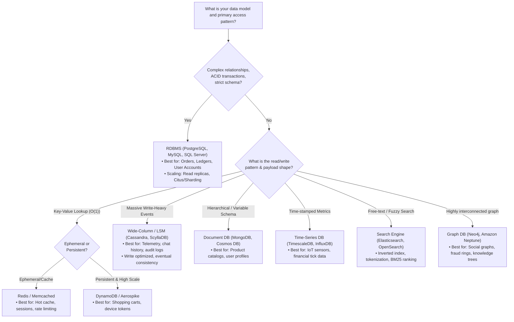
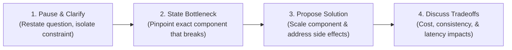

# 10. Interview Quick Reference, Decision Trees & Checklists

A unified, single-source-of-truth operational battle-card for **45-minute OOD rounds**, **90-minute Machine Coding rounds**, and **Senior Backend Architectural Follow-ups** at top-tier tech companies (FAANG, Uber, Stripe, Microsoft, Databricks, Citadel).

---

## ⏱️ 1. Interview Timing & Pacing Blueprints

### 45-Minute OOD / LLD Interview Blueprint
Used for Senior/Staff object-oriented architecture screenings.

| Time Window | Phase | Primary Objectives | Fatal Failure Modes |
| :--- | :--- | :--- | :--- |
| **0 – 5 min** | **Clarifications & Scope** | Extract functional rules, traffic bounds, state mutability, and concurrency expectations. Explicitly agree on out-of-scope boundaries. | Jumping immediately into coding or drawing classes without asking questions. |
| **5 – 15 min** | **Class Discovery & UML** | Categorize into Entities, Value Objects, and Domain Services. Sketch relationships (Composition, Aggregation, Multiplicity). | Creating God Classes or mixing persistence/presentation logic into domain entities. |
| **15 – 35 min** | **Core Implementation** | Write clean, compilable C# domain models, state machines, and strategy interfaces. Protect business invariants. | Getting bogged down in repetitive CRUD getters/setters instead of core business invariants. |
| **35 – 40 min** | **Concurrency & Edge Cases** | Introduce locks, memory barriers, thread-safety, null-object patterns, and transaction boundaries. | Leaving race conditions on shared mutable collections. |
| **40 – 45 min** | **Follow-ups & Tradeoffs** | Scale the system: distributed caching, sharding, DB selection, resilience, and telemetry. | Being defensive when the interviewer challenges your design choices. |

### 90-Minute Machine Coding Round Blueprint
Used by Flipkart, Uber, Swiggy, Razorpay, PhonePe, and Atlassian.

```mermaid
gantt
    title 90-Minute Machine Coding Timeline
    dateFormat  m
    axisFormat %M min
    section Discovery
    Requirement Mining & Invariant Extraction :0, 10
    section Architecture
    Domain Entities, Interfaces & Contracts :10, 25
    section Implementation
    In-Memory Repositories & Business Logic :25, 60
    section Concurrency
    Thread Safety, Locking & Edge Cases :60, 75
    section Verification
    Driver Program / Unit Tests & Demo :75, 90
```



---

## ⚡ 2. Latency Numbers Every Systems Engineer Must Know

*Reference: Jeff Dean (Google) & Colin Scott's Interactive Latency Numbers.*

```
1 ns            L1 CPU Cache reference (~0.5 - 1 ns)
3 ns            Branch mispredict (~3 ns)
7 ns            L2 CPU Cache reference (~3 - 7 ns)
20 ns           Mutex lock / unlock (~17 - 25 ns)
100 ns          Main Memory reference (RAM access)
2 µs (2,000 ns) Compress 1 KB with Zstandard
3 µs            Read 1 MB sequentially from memory
10 µs           Read 1 MB sequentially from NVMe SSD
250 µs          Read 1 MB sequentially from standard SSD
500 µs (0.5 ms) Round-trip within the same datacenter
1 ms            Read 1 MB sequentially from disk (HDD)
10 ms           HDD seek (disk arm mechanical movement)
20 ms           Round-trip NYC to San Francisco (cross-country)
150 ms          Round-trip NYC to London / Amsterdam (transatlantic)
```

### Senior Architectural Takeaways
1. **Memory vs. Network**: Reading from RAM (100 ns) is **5,000x faster** than a local datacenter network hop (0.5 ms) and **1,500,000x faster** than cross-region network calls (150 ms).
2. **Sequential vs. Random Disk**: Sequential disk reads are orders of magnitude faster than random seeks. This is why LSM-Trees (Cassandra, RocksDB) and append-only commit logs (Kafka) achieve massive write throughput compared to random-write B-Trees.
3. **Lock Overhead**: An uncontended lock in C# takes $\approx 20\text{ ns}$. But high contention causes thread context switching, which costs $\approx 1,000 - 3,000\text{ ns}$ plus CPU cache eviction. Prefer lock-free `Interlocked` operations where possible.

---

## 📊 3. Capacity & Back-of-the-Envelope Estimation Formulas

### 3.1 Traffic (QPS)
$$\text{Average QPS} = \frac{\text{Daily Active Users (DAU)} \times \text{Requests Per User Per Day}}{86,400\text{ seconds}}$$

$$\text{Peak QPS} \approx \text{Average QPS} \times (3\text{ to }5)$$

### 3.2 Storage Sizing
$$\text{Raw Daily Storage} = \text{Daily Writes} \times \text{Payload Size (Bytes)}$$

$$\text{Total 5-Year Storage} = \text{Raw Daily Storage} \times 365 \times 5 \times 3\text{ (Replication Factor)} \times 1.2\text{ (Index Overhead)}$$

### 3.3 Network Bandwidth
$$\text{Egress Bandwidth (Bits/sec)} = \text{Peak Read QPS} \times \text{Average Read Payload Size} \times 8$$

$$\text{Ingress Bandwidth (Bits/sec)} = \text{Peak Write QPS} \times \text{Average Write Payload Size} \times 8$$

### 3.4 Memory Cache Sizing (The 80/20 Pareto Rule)
- 20% of the daily read working set accounts for 80% of all traffic.
$$\text{Cache RAM Required} = (\text{Daily Unique Reads} \times \text{Object Size}) \times 0.20 \times 1.5\text{ (Metadata \& Buffer)}$$

---

## 🌳 4. Database & Storage Selection Decision Trees



### Database Comparison Matrix

| Database Type | Primary Technologies | Optimal Workload | Trade-offs & Limitations |
| :--- | :--- | :--- | :--- |
| **Relational (RDBMS)** | PostgreSQL, MySQL, SQL Server | Multi-row ACID transactions, complex joins, financial accuracy. | Vertical scale limit; sharding introduces operational and join complexity. |
| **Key-Value Store** | Redis, DynamoDB | Sub-millisecond $O(1)$ lookups by primary key, ephemeral cache. | Poor support for secondary index range queries. |
| **Wide-Column (LSM)** | Apache Cassandra, ScyllaDB | Multi-million write QPS, append-only logs, high availability. | Eventual consistency, no joins, schema queries must match partition keys. |
| **Document Store** | MongoDB, Azure Cosmos DB | Polymorphic objects, rapid schema evolution, nested hierarchies. | Higher storage footprint; multi-document transactions carry high latency. |
| **Search Engine** | Elasticsearch, OpenSearch | Full-text search, autocomplete, faceted filtering, log analytics. | High write latency (near real-time 1s refresh interval), expensive memory cost. |
| **Time-Series** | TimescaleDB, InfluxDB | Time-partitioned metrics, continuous aggregation, automatic rollups. | Inefficient for arbitrary non-time update/delete operations. |

---

## 🔀 5. Sharding & Partitioning Strategies

| Strategy | Mechanism | Best Used For | Major Pitfall / Tradeoff |
| :--- | :--- | :--- | :--- |
| **Hash-Based** | $\text{Shard} = \text{hash}(\text{key}) \pmod N$ | Uniform distribution across all nodes. | Adding a node ($N \rightarrow N+1$) causes almost all keys to migrate. |
| **Consistent Hashing** | Keys and nodes mapped onto a $2^{32}-1$ virtual ring. | Large-scale elastic caching (Redis cluster, DynamoDB). | Requires virtual nodes (100–250 per physical node) to prevent hotspot clustering. |
| **Range-Based** | Partitions mapped to ranges (e.g., A–C, D–F or date intervals). | Time-series data, alphabetized catalog lookups. | Severe write hotspots (all current writes hit today's partition). |
| **Directory-Based** | Central lookup service maps $\text{Key} \rightarrow \text{Shard ID}$. | Systems with bespoke custom rebalancing needs. | Central lookup service becomes a single point of failure and latency bottleneck. |

---

## 📋 6. Object-Oriented Design (OOD) Master Checklist

Use this checklist during every LLD / Machine Coding interview:

### Phase 1: Requirements & Scope Boundaries
- [ ] Are inputs and outputs strictly typed?
- [ ] Is concurrency required (multi-threaded in-memory vs single-threaded)?
- [ ] What are the immutable invariants that can *never* be broken (e.g., account balance $\ge 0$, no double-booked seats)?
- [ ] What is explicitly **out-of-scope** for this 45/90 minute session?

### Phase 2: SOLID Principles Verification
- [ ] **S (Single Responsibility)**: Does each class have only one reason to change? (Separate business calculations from notifications and persistence).
- [ ] **O (Open/Closed)**: Can a new payment provider, pricing strategy, or notification channel be added without editing existing switch statements?
- [ ] **L (Liskov Substitution)**: Do derived classes honor the base contract without throwing `NotSupportedException`?
- [ ] **I (Interface Segregation)**: Are interfaces lean and cohesive rather than bloated "kitchen-sink" interfaces?
- [ ] **D (Dependency Inversion)**: Do domain entities depend on abstractions (`IPaymentGateway`, `INotificationService`) rather than concrete third-party SDKs?

### Phase 3: Concurrency & State Mutation
- [ ] Is mutable shared state enclosed behind locks or thread-safe primitives?
- [ ] Are lock orders consistent across the codebase to guarantee **zero deadlock potential**?
- [ ] Does reading an item alter internal state (e.g., LRU cache access)? If so, an exclusive lock or lock-free queue is required.
- [ ] Are operations idempotent (can a network retry cause double-allocation)?

---

## 🛠️ 7. Thread-Safe C# Concurrency Templates

### Pattern 1: `ReaderWriterLockSlim` for Read-Heavy Caching
```csharp
public sealed class ReadHeavyCache<TKey, TValue> : IDisposable where TKey : notnull
{
    private readonly Dictionary<TKey, TValue> _store = new();
    private readonly ReaderWriterLockSlim _rwLock = new(LockRecursionPolicy.NoRecursion);

    public bool TryGet(TKey key, out TValue? value)
    {
        _rwLock.EnterReadLock();
        try
        {
            return _store.TryGetValue(key, out value);
        }
        finally
        {
            _rwLock.ExitReadLock();
        }
    }

    public void Put(TKey key, TValue value)
    {
        _rwLock.EnterWriteLock();
        try
        {
            _store[key] = value;
        }
        finally
        {
            _rwLock.ExitWriteLock();
        }
    }

    public void Dispose() => _rwLock.Dispose();
}
```

### Pattern 2: Lock-Free Atomic Token Bucket with `Interlocked`
```csharp
public sealed class AtomicTokenBucket
{
    private readonly int _capacity;
    private readonly double _refillRatePerMillisecond;
    private long _availableTokens;
    private long _lastRefillTimestampTicks;

    public AtomicTokenBucket(int capacity, int refillPerSecond)
    {
        _capacity = capacity;
        _refillRatePerMillisecond = refillPerSecond / 1000.0;
        _availableTokens = capacity;
        _lastRefillTimestampTicks = Environment.TickCount64;
    }

    public bool TryConsume(int tokens = 1)
    {
        while (true)
        {
            long currentTokens = Interlocked.Read(ref _availableTokens);
            long lastTicks = Interlocked.Read(ref _lastRefillTimestampTicks);
            long now = Environment.TickCount64;
            long elapsedMs = Math.Max(0, now - lastTicks);

            long refilledTokens = Math.Min(_capacity, currentTokens + (long)(elapsedMs * _refillRatePerMillisecond));

            if (refilledTokens < tokens)
            {
                return false;
            }

            if (Interlocked.CompareExchange(ref _availableTokens, refilledTokens - tokens, currentTokens) == currentTokens)
            {
                Interlocked.Exchange(ref _lastRefillTimestampTicks, now);
                return true;
            }
        }
    }
}
```

### Pattern 3: Asynchronous Producer-Consumer via `System.Threading.Channels`
```csharp
using System.Threading.Channels;

public sealed class AsyncEventDispatcher<TEvent>
{
    private readonly Channel<TEvent> _channel;

    public AsyncEventDispatcher(int boundedCapacity = 10_000)
    {
        _channel = Channel.CreateBounded<TEvent>(new BoundedChannelOptions(boundedCapacity)
        {
            FullMode = BoundedChannelFullMode.Wait,
            SingleWriter = false,
            SingleReader = false
        });
    }

    public async ValueTask PublishAsync(TEvent evt, CancellationToken ct = default)
    {
        await _channel.Writer.WriteAsync(evt, ct);
    }

    public async IAsyncEnumerable<TEvent> ConsumeAllAsync(
        [System.Runtime.CompilerServices.EnumeratorCancellation] CancellationToken ct = default)
    {
        while (await _channel.Reader.WaitToReadAsync(ct))
        {
            while (_channel.Reader.TryRead(out var item))
            {
                yield return item;
            }
        }
    }
}
```

---

## 🎯 8. FAANG Follow-Up Answering Frameworks

When an interviewer throws a curveball follow-up question, use this universal 4-step framework:



### Scenario 1: "What happens when traffic increases 10x / 100x?"
1. **Identify the Bottleneck**: "At 10x (1M QPS), stateless API servers scale horizontally behind the load balancer. The bottleneck is the single write database, which tops out at 15k writes/sec."
2. **Scale the Bottleneck**: "I will shard the database using consistent hashing on `UserId`. For read amplification, introduce a Redis caching layer with a Cache-Aside strategy."
3. **Address Cascading Effects**: "Sharding makes cross-shard aggregation queries expensive. We will offload reporting to an asynchronous read-model via Kafka and Elasticsearch."

### Scenario 2: "How do you handle a hot partition / celebrity key?"
- **Problem**: In a Twitter-like system, Justin Bieber has 100M followers. Writing to Bieber's shard saturates CPU and network bandwidth.
- **Solution**:
  1. **Detection**: Metrics monitor shard read/write distributions; alert on deviations $> 3\sigma$.
  2. **Read Amplification**: Store celebrity feed entries in a dedicated local L1 in-memory cache on API servers with a 5-second TTL.
  3. **Write Amplification (Key Salting)**: Append random suffix shards (`justin_bieber_01` to `justin_bieber_20`) to scatter writes across multiple physical database partitions.

### Scenario 3: "How do you mitigate a Thundering Herd (Cache Stampede)?"
- **Problem**: A hot key expires, and 50,000 concurrent threads simultaneously miss the cache and overwhelm the SQL database.
- **Solution**:
  1. **Distributed Mutex / SingleFlight**: The first thread to miss acquires a lock (`Redlock` or in-memory `SemaphoreSlim`) to rebuild the cache; all other threads wait or return the stale value.
  2. **Probabilistic Early Expiration (XFetch Algorithm)**: Refresh the cache asynchronously before it officially expires:
     $$\text{currentTime} - (\beta \times \delta \times \ln(\text{random}())) > \text{expiryTime}$$
  3. **Stale-While-Revalidate**: Serve expired data for a 10-second grace window while a background worker refreshes the entry.

### Scenario 4: "What happens when the primary database node crashes?"
1. **Detection**: Consensus heartbeat (Raft/Zookeeper) detects missed heartbeats (typically 3–5 seconds).
2. **Failover**: Automated promotion of the in-sync standby replica to primary.
3. **Split-Brain Prevention**: Use fencing tokens or epoch counters to guarantee that an old primary coming back online cannot accept writes.
4. **Data Loss Window**: If asynchronous replication was used, transactions committed in the last 100ms replication lag window may be lost. If zero data loss is non-negotiable, synchronous quorum replication (`sync_commit = on`) must be used.

### Scenario 5: "How do you maintain data consistency across multi-region deployments?"
- **Trade-off**: Choose between **Synchronous Cross-Region Replication** (high latency: $150\text{ ms}$ transatlantic RTT per write) vs. **Asynchronous Replication** (low latency, eventual consistency with conflict potential).
- **Industry Standard Hybrid Pattern**:
  - Partition write ownership by user geographic home region (e.g., European users write to EU primary; US users write to US primary).
  - Cross-region writes are strictly local and asynchronously synchronized using **Conflict-Free Replicated Data Types (CRDTs)** or **Last-Write-Wins (LWW)** with synchronized atomic clocks.

### Scenario 6: "How do you ensure exactly-once processing (Idempotency)?"
1. Client generates a deterministic `Idempotency-Key` (UUIDv4) attached to the request header.
2. In a single database transaction:
   ```sql
   INSERT INTO IdempotentRequests (Key, Status, ResponsePayload, CreatedAt)
   VALUES (@Key, 'PROCESSING', NULL, NOW());
   ```
3. If unique constraint violation occurs:
   - If status is `COMPLETED`, return the cached `ResponsePayload` immediately.
   - If status is `PROCESSING`, return `409 Conflict` or poll.
4. Execute business logic, update `Status = 'COMPLETED'`, and commit.

### Scenario 7: "P99 latency spiked from 30ms to 1.5s. How do you triage?"
1. **Telemetry Isolation**: Inspect distributed APM traces (OpenTelemetry / Jaeger). Identify which span is consuming 90% of the duration (Database query, downstream HTTP call, thread starvation, or GC pause).
2. **Database Triage**: Check slow-query logs for missing indexes caused by unexpected table scans or connection pool saturation.
3. **Runtime & GC Triage**: Check .NET Gen 2 Garbage Collection pauses and CPU thread-pool starvation (`ThreadPool.GetAvailableThreads`).
4. **Mitigation**: Scale out replicas, increase connection pool limits, or engage circuit breakers to shedding non-essential background load.

---

## 🎖️ 9. Mock Interview Self-Scoring Rubric (50-Point FAANG Scale)

Rate yourself from 1 (Poor) to 10 (Mastery) across all five dimensions:

```
1. Communication & Requirement Mining       [ __ / 10 ]
   • Asked clarifying questions about scale, concurrency, and constraints.
   • Stated explicit assumptions and confirmed alignment before coding.
   • Maintained proactive think-aloud communication.

2. Systematic Architecture & SOLID Design    [ __ / 10 ]
   • Identified correct entities, value objects, and domain services.
   • Applied GoF patterns (Strategy, State, Factory, Observer) purposefully.
   • Prevented God Classes and maintained clean separation of concerns.

3. Technical Depth & Concurrency Safety      [ __ / 10 ]
   • Protected shared state against race conditions and deadlocks.
   • Chose optimal data structures for O(1) or O(log N) operations.
   • Justified memory and runtime costs (GC, allocations, lock overhead).

4. Problem Solving & Edge Case Defense       [ __ / 10 ]
   • Handled zero capacity, null bounds, duplicate keys, and failure modes.
   • Adapted quickly and positively when challenged by the interviewer.
   • Articulated trade-offs between competing approaches.

5. Code Execution & Time Management          [ __ / 10 ]
   • Delivered compilable, clean, production-grade code within 35–40 minutes.
   • Covered key functional paths without getting trapped in boilerplate.
   • Left time for follow-up scaling and distributed systems questions.

─────────────────────────────────────────────────────────────────────────────
TOTAL SCORE:                                 [ __ / 50 ]
```

### Readiness Tiers
- **45 – 50 (FAANG Ready / Staff Level)**: Exceptional design clarity, proactive concurrency defense, effortless follow-up scaling.
- **40 – 44 (Strong Senior)**: Solid architecture and clean code. Minor coaching needed on subtle distributed edge cases.
- **35 – 39 (Developing Mid-Level)**: Can write working code, but jumps into implementation too early or misses concurrency vulnerabilities.
- **< 35 (Foundation Work Needed)**: Needs focused drill practice on SOLID fundamentals, GoF patterns, and time management.

---

## 🧰 10. Pre-Interview Routine Checklist

### 1 Week Before
- [ ] Complete 5 full timed mock interviews (whiteboard or blank IDE, 45 minutes strict).
- [ ] Review the **[31-Problem Portfolio](../README.md#3-the-31-problem-portfolio-code-implementations)**.
- [ ] Practice explaining code aloud while writing it.

### 1 Day Before
- [ ] Do **NOT** cram or learn brand-new complex frameworks.
- [ ] Lightly review this Quick Reference Card (latency numbers, decision trees, estimation formulas).
- [ ] Test camera, microphone, IDE font sizing, and digital drawing tools (Excalidraw / Draw.io).
- [ ] Get 8 hours of sleep.

### 1 Hour Before
- [ ] Hydrate and use the restroom.
- [ ] Perform 5 deep breaths (box breathing).
- [ ] Review the **6-Step Design Funnel**: Mining $\rightarrow$ Classes $\rightarrow$ Relationships $\rightarrow$ Patterns $\rightarrow$ Evolution $\rightarrow$ Tradeoffs.
- [ ] Remember: **The interviewer is your future peer. Treat the interview as a collaborative design meeting.**

