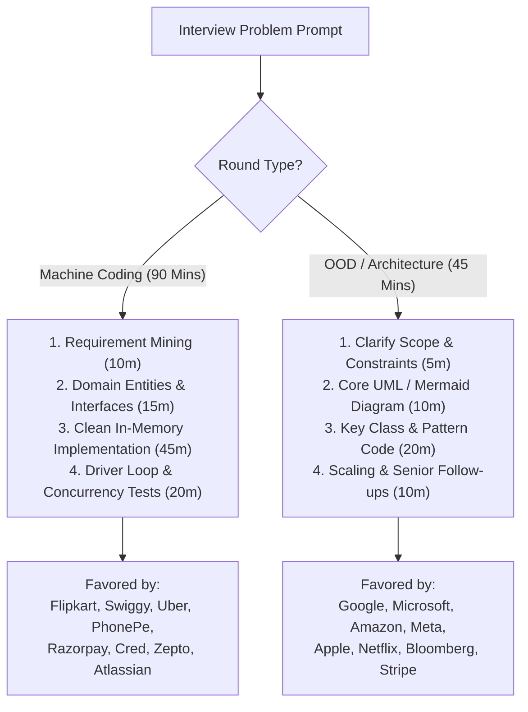

# 🏢 Top 30 Product Companies LLD & Machine Coding Interview Master Guide

Welcome to the definitive interview preparation directory for **Low-Level Design (LLD)**, **Object-Oriented Design (OOD)**, and **Machine Coding Rounds** across the top 30 product companies worldwide.

This guide provides company-specific interview blueprints, evaluation rubrics, high-frequency questions, direct links to production-ready C# implementations in this curriculum, and senior follow-up traps.

---

## 🧭 The Two Formats: 90-Minute Machine Coding vs. 45-Minute OOD

Product companies evaluate LLD in one of two formats:

| Dimension | 90-Minute Machine Coding Round | 45-Minute OOD / Design Round |
| :--- | :--- | :--- |
| **Primary Goal** | **Working, compilable, runnable code** with clean OOP abstractions and edge tests. | **Architectural depth**, design pattern selection, class relationships, and tradeoff defense. |
| **Execution** | You share screen in your local IDE (VS Code / Visual Studio) or HackerRank/CoderPad. | Whiteboard, Excalidraw, Google Docs, or CoderPad without strict execution requirement. |
| **Passing Bar** | Code must compile and execute in the driver test; clean separation of entities vs services. | Clear demonstration of SOLID, extensibility (OCP), and handling concurrency traps. |

---

## 🎯 Top 30 Product Companies Directory

---

### 1. 🔍 Google
* **Format:** 45-Minute OOD / Algorithmic Design Screening
* **Evaluation Focus:** Extreme algorithmic efficiency ($O(1)$ / $O(\log N)$) fused with clean class design. Interviewers care about memory footprint, cache locality, and data structure selection.
* **Top LLD Questions Asked:**
  * [Search Autocomplete / Typeahead System (LC 642)](../03_Tier3_DSA_Screening/29_Search_Autocomplete_System.md) *(Trie + PriorityQueue)*
  * [In-Memory File System (LC 588)](../02_Tier2_Classic_LLD/17_In_Memory_File_System.md) *(Composite + Trie)*
  * [Meeting Room / Calendar Scheduler (LC 56/253)](../01_Tier1_Highest_Priority/01_Meeting_Room_Booking.md) *(Interval Trees / Sorting)*
  * [URL Shortener (TinyURL)](../04_Tier4_Senior_Backend/37_URL_Shortener.md) *(Base62 + Token Allocation)*
  * [LRU & LFU Cache (LC 146 & 460)](../03_Tier3_DSA_Screening/26_LRU_and_LFU_Cache.md) *(Doubly Linked List + HashMaps)*
* **Senior Follow-Up Traps:**
  * *"What if your Autocomplete Trie contains 100M sentences and exceeds memory on a single machine?"* $\rightarrow$ Partition by prefix (`a-c`, `d-f`) or store top-K cached arrays only on leaf/warm nodes.
  * *"Can `GetNewsFeed` or `Get` operations starve writers if using standard locks?"* $\rightarrow$ Explain `ReaderWriterLockSlim` or lock-free atomic pointers.

---

### 2. 🪟 Microsoft
* **Format:** 45–60 Minute OOD & System Architecture
* **Evaluation Focus:** Enterprise .NET patterns, Dependency Injection, Concurrency, State Machines, and strict adherence to SOLID.
* **Top LLD Questions Asked:**
  * [Elevator System](../02_Tier2_Classic_LLD/10_Elevator.md) *(SCAN Algorithm, State Pattern)*
  * [ATM System](../02_Tier2_Classic_LLD/21_ATM_System.md) *(State Machine, Hardware Abstraction)*
  * [Rate Limiter (Token Bucket / Sliding Window)](../04_Tier4_Senior_Backend/31_Rate_Limiter.md) *(Interlocked & Concurrency)*
  * [Generic Message Processor with Azure Service Bus](../01_Tier1_Highest_Priority/02_Generic_Message_Processor.md) *(Generics + DI)*
  * [Parking Lot](../01_Tier1_Highest_Priority/06_Parking_Lot.md) *(Composition over Inheritance)*
* **Senior Follow-Up Traps:**
  * *"How do you prevent elevator request starvation when floors above continuously request service?"* $\rightarrow$ Implement look-ahead SCAN / LOOK disk-scheduling elevator dispatch.
  * *"How does the ATM recover state if power cuts off between cash dispensing and balance deduction?"* $\rightarrow$ Two-phase commit / saga with ledger compensation.

---

### 3. 📦 Amazon
* **Format:** 60-Minute OOD / Customer Obsession Architecture
* **Evaluation Focus:** Extensibility (Open/Closed Principle), Composition over Inheritance, handling physical domain models, and edge cases.
* **Top LLD Questions Asked:**
  * [Amazon Locker Delivery System](../02_Tier2_Classic_LLD/19_Amazon_Locker_System.md) *(Best-Fit Strategy + OTP)*
  * [Parking Lot](../01_Tier1_Highest_Priority/06_Parking_Lot.md) *(Vehicle/Spot mapping, Strategy)*
  * [Movie Ticket Booking (BookMyShow / Prime Video)](../02_Tier2_Classic_LLD/09_Movie_Booking.md) *(Distributed locks + TTL)*
  * [Library Management System](../02_Tier2_Classic_LLD/20_Library_Management_System.md) *(Catalog search + Fines)*
  * [Coupon & Discount Rule Engine](../02_Tier2_Classic_LLD/25_Coupon_and_Discount_Engine.md) *(Composite + Rule Chain)*
* **Senior Follow-Up Traps:**
  * *"What happens if a customer drops a large package in a small locker, or fails to pick it up within 3 days?"* $\rightarrow$ State transition to `Expired`, background cleanup cron, and refund/restock trigger.
  * *"How do you test your pricing strategy without deploying to production?"* $\rightarrow$ Mock strategy injection via DI container.

---

### 4. 🌐 Meta (Facebook / Instagram / WhatsApp)
* **Format:** 45-Minute Product Architecture & OOD
* **Evaluation Focus:** Real-time data streams, fan-out scaling, relationship graphs, and high write concurrency.
* **Top LLD Questions Asked:**
  * [Social Media News Feed & Twitter Lite (LC 355)](../03_Tier3_DSA_Screening/30_Social_Media_Feed_Twitter.md) *(PriorityQueue K-Way Merge)*
  * [Notification System](../01_Tier1_Highest_Priority/08_Notification_System.md) *(Decorator + Multi-Channel)*
  * [Pub/Sub Message Broker](../04_Tier4_Senior_Backend/32_Pub_Sub.md) *(Async Channels, Fan-out)*
  * [LRU & LFU Cache](../03_Tier3_DSA_Screening/26_LRU_and_LFU_Cache.md) *(Eviction + Concurrency)*
* **Senior Follow-Up Traps:**
  * *"When Cristiano Ronaldo (100M followers) posts a photo, how do you prevent fanout-on-write from blowing up memory?"* $\rightarrow$ Hybrid fanout: regular users use push; celebrities use pull on client read.

---

### 5. 🍏 Apple
* **Format:** 45–60 Minute OOD & Systems Programming
* **Evaluation Focus:** Clean APIs, memory management, thread synchronization, low-level efficiency.
* **Top LLD Questions Asked:**
  * [In-Memory File System](../02_Tier2_Classic_LLD/17_In_Memory_File_System.md) *(Composite + ReaderWriterLockSlim)*
  * [Custom Cache with LRU & TTL](../01_Tier1_Highest_Priority/07_Custom_Cache.md) *(Generics + Expiration)*
  * [Logging Framework (Logger)](../02_Tier2_Classic_LLD/13_Logger.md) *(Chain of Responsibility + Buffering)*
  * [Board Game Engine (Chess / Tic-Tac-Toe)](../02_Tier2_Classic_LLD/18_Board_Game_Engine.md) *(Command + Undo/Redo)*
* **Senior Follow-Up Traps:**
  * *"Why use `ReaderWriterLockSlim` instead of simple `lock` or `Monitor`?"* $\rightarrow$ Reads vastly outnumber writes; concurrent readers run without blocking each other.

---

### 6. 🍿 Netflix
* **Format:** 45–60 Minute Distributed Resilient LLD
* **Evaluation Focus:** Resilient client calls, fallback mechanisms, circuit breakers, and rate limiting.
* **Top LLD Questions Asked:**
  * [Resilient API Aggregator](../01_Tier1_Highest_Priority/05_Resilient_API_Aggregator.md) *(Polly, Circuit Breaker, `Task.WhenAll`)*
  * [Rate Limiter](../04_Tier4_Senior_Backend/31_Rate_Limiter.md) *(Token Bucket + Sliding Window)*
  * [Custom Cache with LRU & TTL](../01_Tier1_Highest_Priority/07_Custom_Cache.md) *(Eviction under heavy loads)*
* **Senior Follow-Up Traps:**
  * *"If the Recommendation microservice times out, does the entire home page fail?"* $\rightarrow$ Graceful degradation: catch timeout, fall back to cached trending titles.

---

### 7. 🚗 Uber
* **Format:** 90-Minute Machine Coding or 60-Minute Concurrency LLD
* **Evaluation Focus:** Spatial matching, state machine progression, race conditions during driver allocation, dynamic surge pricing.
* **Top LLD Questions Asked:**
  * [Ride-Hailing System (Uber / Ola)](../02_Tier2_Classic_LLD/15_Ride_Hailing_System.md) *(State + Strategy + Driver Matching)*
  * [In-Memory Transactional Key-Value Store](../04_Tier4_Senior_Backend/33_Transactional_Key_Value_Store.md) *(Stack of HashMaps)*
  * [Rate Limiter](../04_Tier4_Senior_Backend/31_Rate_Limiter.md) *(Per-client token bucket)*
* **Senior Follow-Up Traps:**
  * *"Two drivers click 'Accept' on the exact same ride request simultaneously. How do you prevent both getting it?"* $\rightarrow$ Atomic state transition (`Interlocked.CompareExchange` or optimistic DB `RowVersion`).

---

### 8. 💳 Stripe
* **Format:** 60-Minute Machine Coding & API Design
* **Evaluation Focus:** Idempotency, money precision (`decimal`), double-entry ledger bookkeeping, zero floating-point math, audit logs.
* **Top LLD Questions Asked:**
  * [Digital Wallet & Double-Entry Ledger](../04_Tier4_Senior_Backend/34_Digital_Wallet_Ledger.md) *(Double-entry, deadlock-free)*
  * [Rate Limiter](../04_Tier4_Senior_Backend/31_Rate_Limiter.md) *(Sliding window log)*
  * [Invalid Transactions Detector](../03_Tier3_DSA_Screening/28_Invalid_Transactions.md) *(Sliding window validation)*
* **Senior Follow-Up Traps:**
  * *"What if a network glitch causes the user to submit payment 3 times in 2 seconds?"* $\rightarrow$ Client passes `Idempotency-Key`; backend locks key in cache/DB and returns cached result on replay.

---

### 9. 🗂️ Atlassian
* **Format:** 90-Minute Machine Coding Round
* **Evaluation Focus:** Code modularity, SOLID principles, clean unit tests, Command Pattern for Undo/Redo, hierarchical composite trees.
* **Top LLD Questions Asked:**
  * [Task Management System (Jira Lite)](../02_Tier2_Classic_LLD/14_Task_Management_System.md) *(Composite + Command + Observer)*
  * [Rate Limiter](../04_Tier4_Senior_Backend/31_Rate_Limiter.md) *(Token Bucket with Interlocked)*
  * [In-Memory File System](../02_Tier2_Classic_LLD/17_In_Memory_File_System.md) *(Directory tree)*
* **Senior Follow-Up Traps:**
  * *"How do you implement Undo and Redo for task status edits?"* $\rightarrow$ Use Command Pattern with two stacks: `_undoStack` and `_redoStack`.

---

### 10. ☁️ Salesforce
* **Format:** 60-Minute OOD / Enterprise Architecture
* **Evaluation Focus:** Multi-tenancy, metadata-driven rules engines, reliable event processing.
* **Top LLD Questions Asked:**
  * [Notification System](../01_Tier1_Highest_Priority/08_Notification_System.md) *(Decorator + Multi-Tenant)*
  * [Generic Message Processor](../01_Tier1_Highest_Priority/02_Generic_Message_Processor.md) *(Generics + DI)*
  * [Task Management System](../02_Tier2_Classic_LLD/14_Task_Management_System.md) *(Workflow automation)*

---

### 11. 📈 Bloomberg
* **Format:** 45-Minute High-Performance Algorithmic OOD
* **Evaluation Focus:** Sub-millisecond order books, price-time priority, double-ended queues, cache locality, lock-free structures.
* **Top LLD Questions Asked:**
  * [Stock Exchange Order Matching Engine](../04_Tier4_Senior_Backend/35_Stock_Exchange_Matching_Engine.md) *(Price-Time Priority, SortedSet)*
  * [LRU & LFU Cache](../03_Tier3_DSA_Screening/26_LRU_and_LFU_Cache.md) *(Fast O(1) Lookups)*
  * [Underground Metro System (LC 1396)](../00_Study_Plans/Top_LeetCode_LLD_Questions.md) *(HashMaps + Station averages)*
* **Senior Follow-Up Traps:**
  * *"Why use `SortedSet<Order>` over a simple `List` with `Sort()`?"* $\rightarrow$ Inserting and matching orders happens continuously; $O(\log N)$ tree insertion keeps the order book live without full re-sorts.

---

### 12. 🏡 Airbnb
* **Format:** 60-Minute OOD & Domain Modeling
* **Evaluation Focus:** Calendar interval collisions, dynamic seasonal pricing, search filter strategies.
* **Top LLD Questions Asked:**
  * [Hotel & Vacation Rental Management System](../02_Tier2_Classic_LLD/22_Hotel_Management_System.md) *(Date intervals + Strategy)*
  * [Meeting Room Booking](../01_Tier1_Highest_Priority/01_Meeting_Room_Booking.md) *(Interval overlap detection)*
  * [Merge Intervals](../03_Tier3_DSA_Screening/27_Merge_Intervals.md) *(Calendar merging)*

---

### 13. 🔗 LinkedIn
* **Format:** 45-Minute OOD & Concurrency
* **Evaluation Focus:** Social graph traversals, distributed key-value store semantics, rate limiting.
* **Top LLD Questions Asked:**
  * [In-Memory Transactional Key-Value Store](../04_Tier4_Senior_Backend/33_Transactional_Key_Value_Store.md) *(Redis-Lite)*
  * [Rate Limiter](../04_Tier4_Senior_Backend/31_Rate_Limiter.md) *(Token bucket)*
  * [Social Media Feed / Twitter Lite](../03_Tier3_DSA_Screening/30_Social_Media_Feed_Twitter.md) *(Feed generation)*

---

### 14. 🐦 Twitter / X
* **Format:** 45-Minute Real-Time Data Pipeline & OOD
* **Evaluation Focus:** Fan-out push vs pull models, timeline generation, caching top tweets.
* **Top LLD Questions Asked:**
  * [Social Media News Feed & Followers (LC 355)](../03_Tier3_DSA_Screening/30_Social_Media_Feed_Twitter.md) *(K-way merge)*
  * [Pub/Sub Message Queue](../04_Tier4_Senior_Backend/32_Pub_Sub.md) *(Fan-out observer)*
  * [URL Shortener (TinyURL)](../04_Tier4_Senior_Backend/37_URL_Shortener.md) *(Base62 redirect)*

---

### 15. 🛵 DoorDash / Instacart
* **Format:** 90-Minute Machine Coding
* **Evaluation Focus:** Delivery partner assignment, cart item availability validation, dynamic surge fee.
* **Top LLD Questions Asked:**
  * [Food Delivery System (Swiggy / Zomato / DoorDash)](../02_Tier2_Classic_LLD/16_Food_Delivery_System.md) *(Strategy + Observer)*
  * [Coupon & Discount Rule Engine](../02_Tier2_Classic_LLD/25_Coupon_and_Discount_Engine.md) *(Composite discounts)*
  * [Ride-Hailing System](../02_Tier2_Classic_LLD/15_Ride_Hailing_System.md) *(Driver matching)*

---

### 16. 🛍️ Flipkart
* **Format:** 90-Minute Strict Machine Coding Round (The Indian Standard)
* **Evaluation Focus:** Code must be fully modular, compile, and run with a working CLI/Driver test within 90 minutes. SOLID principles, design patterns, separation of concerns.
* **Top LLD Questions Asked:**
  * [Snake and Ladder Game](../02_Tier2_Classic_LLD/23_Snake_and_Ladder.md) *(Dice strategy, extensible board)*
  * [Cricbuzz / Live Cricket Scoreboard](../02_Tier2_Classic_LLD/24_Cricbuzz_Cricket_Scoreboard.md) *(Innings, balls, strike rotation)*
  * [Splitwise (Expense Sharing)](../02_Tier2_Classic_LLD/11_Splitwise.md) *(Strategy + Debt simplification)*
  * [Coupon & Discount Rule Engine](../02_Tier2_Classic_LLD/25_Coupon_and_Discount_Engine.md) *(Composite + Rule Chain)*
  * [Movie Ticket Booking (BookMyShow)](../02_Tier2_Classic_LLD/09_Movie_Booking.md) *(Seat locking TTL)*
* **Senior Follow-Up Traps:**
  * *"Add a crooked dice rule or dynamic snake movement in 5 minutes without changing existing classes."* $\rightarrow$ Strategy Pattern ensures new dice type implements `IDiceStrategy` without modifying `GameController`.

---

### 17. 🍛 Swiggy
* **Format:** 90-Minute Machine Coding Round
* **Evaluation Focus:** Order lifecycle state machine, real-time tracking with Observer, delivery fee strategy, discount rule validation.
* **Top LLD Questions Asked:**
  * [Food Delivery System](../02_Tier2_Classic_LLD/16_Food_Delivery_System.md) *(Order state + Restaurant menu)*
  * [Coupon & Discount Rule Engine](../02_Tier2_Classic_LLD/25_Coupon_and_Discount_Engine.md) *(Flat, percentage, BOGO)*
  * [Cricbuzz / Live Cricket Scoreboard](../02_Tier2_Classic_LLD/24_Cricbuzz_Cricket_Scoreboard.md) *(Strike rotation & balls)*
  * [Splitwise](../02_Tier2_Classic_LLD/11_Splitwise.md) *(Group expenses)*

---

### 18. 🍅 Zomato
* **Format:** 60–90 Minute Machine Coding / OOD
* **Evaluation Focus:** Restaurant catalog, table booking, delivery driver assignment, review rating engine.
* **Top LLD Questions Asked:**
  * [Food Delivery System](../02_Tier2_Classic_LLD/16_Food_Delivery_System.md) *(Cart & delivery lifecycle)*
  * [Hotel & Table Management System](../02_Tier2_Classic_LLD/22_Hotel_Management_System.md) *(Time slot reservation)*
  * [Coupon & Discount Rule Engine](../02_Tier2_Classic_LLD/25_Coupon_and_Discount_Engine.md) *(Promotions)*

---

### 19. 📱 PhonePe
* **Format:** 90-Minute Machine Coding & Backend Concurrency
* **Evaluation Focus:** Extreme concurrency, distributed locking, double-entry accounting, atomic transaction execution.
* **Top LLD Questions Asked:**
  * [Digital Wallet & Double-Entry Ledger](../04_Tier4_Senior_Backend/34_Digital_Wallet_Ledger.md) *(Deadlock-free transfer)*
  * [Pub/Sub Message Queue](../04_Tier4_Senior_Backend/32_Pub_Sub.md) *(Async queue with backpressure)*
  * [Cricbuzz / Live Scoreboard](../02_Tier2_Classic_LLD/24_Cricbuzz_Cricket_Scoreboard.md) *(Event broadcasting)*
  * [Splitwise](../02_Tier2_Classic_LLD/11_Splitwise.md) *(Money splits)*
* **Senior Follow-Up Traps:**
  * *"If Account A sends money to Account B while Account B sends money to Account A, how do you prevent circular deadlock?"* $\rightarrow$ Deterministic Lock Ordering: always acquire locks in sorted order of Account GUIDs.

---

### 20. ⚡ Razorpay
* **Format:** 90-Minute Machine Coding
* **Evaluation Focus:** Payment gateway state machines, webhooks retry engine, idempotency, refund lifecycle.
* **Top LLD Questions Asked:**
  * [Digital Wallet & Double-Entry Ledger](../04_Tier4_Senior_Backend/34_Digital_Wallet_Ledger.md) *(Ledger entries)*
  * [Generic Message Processor with Azure / Kafka](../01_Tier1_Highest_Priority/02_Generic_Message_Processor.md) *(Polymorphic routing)*
  * [Coupon & Discount Rule Engine](../02_Tier2_Classic_LLD/25_Coupon_and_Discount_Engine.md) *(Checkout pricing)*
  * [Rate Limiter](../04_Tier4_Senior_Backend/31_Rate_Limiter.md) *(API client protection)*

---

### 21. 💎 Cred
* **Format:** 90-Minute Machine Coding
* **Evaluation Focus:** Reward rule engines, gamification, credit card bill reminders, async event processing.
* **Top LLD Questions Asked:**
  * [Coupon & Discount Rule Engine](../02_Tier2_Classic_LLD/25_Coupon_and_Discount_Engine.md) *(Reward rules)*
  * [Task Management & Reminder System](../02_Tier2_Classic_LLD/14_Task_Management_System.md) *(Bill due alerts)*
  * [Pub/Sub Message Queue](../04_Tier4_Senior_Backend/32_Pub_Sub.md) *(Event dispatching)*

---

### 22. ⚡ Zepto / Blinkit
* **Format:** 90-Minute Machine Coding
* **Evaluation Focus:** Dark store inventory allocation, 10-minute order batching, delivery rider dispatch.
* **Top LLD Questions Asked:**
  * [Snake and Ladder Game](../02_Tier2_Classic_LLD/23_Snake_and_Ladder.md) *(Machine coding baseline)*
  * [Food / Grocery Delivery System](../02_Tier2_Classic_LLD/16_Food_Delivery_System.md) *(Inventory allocation)*
  * [Amazon Locker System](../02_Tier2_Classic_LLD/19_Amazon_Locker_System.md) *(Storage compartments)*

---

### 23. 📊 Zerodha / Citadel / Goldman Sachs
* **Format:** 60-Minute Low-Latency Algorithmic OOD
* **Evaluation Focus:** High-frequency order books, zero GC allocation in hot paths, price-time matching, FIFO queues.
* **Top LLD Questions Asked:**
  * [Stock Exchange Order Matching Engine](../04_Tier4_Senior_Backend/35_Stock_Exchange_Matching_Engine.md) *(Price-Time Priority, SortedSet)*
  * [LRU & LFU Cache](../03_Tier3_DSA_Screening/26_LRU_and_LFU_Cache.md) *(Optimal lookups)*
  * [Digital Wallet & Double-Entry Ledger](../04_Tier4_Senior_Backend/34_Digital_Wallet_Ledger.md) *(Margin accounts)*

---

### 24. 💸 PayPal
* **Format:** 60-Minute OOD & Transaction Processing
* **Evaluation Focus:** Dispute resolution state machines, fraud detection rules, monetary precision.
* **Top LLD Questions Asked:**
  * [Digital Wallet & Double-Entry Ledger](../04_Tier4_Senior_Backend/34_Digital_Wallet_Ledger.md) *(Double-entry balance)*
  * [Invalid Transactions Detector](../03_Tier3_DSA_Screening/28_Invalid_Transactions.md) *(Fraud detection)*
  * [Rate Limiter](../04_Tier4_Senior_Backend/31_Rate_Limiter.md) *(Merchant API security)*

---

### 25. 🎨 Adobe
* **Format:** 60-Minute OOD & Document Architecture
* **Evaluation Focus:** Canvas elements, Composite pattern for grouping objects, Command pattern for Undo/Redo.
* **Top LLD Questions Asked:**
  * [Task Management / Canvas Engine](../02_Tier2_Classic_LLD/14_Task_Management_System.md) *(Composite + Command)*
  * [In-Memory File System](../02_Tier2_Classic_LLD/17_In_Memory_File_System.md) *(Asset tree)*
  * [Board Game Engine](../02_Tier2_Classic_LLD/18_Board_Game_Engine.md) *(Command undo/redo)*

---

### 26. 🏢 Oracle
* **Format:** 60-Minute Core Java/C# OOD
* **Evaluation Focus:** Clean OOP fundamentals, Design Patterns, Database connection pools, concurrency.
* **Top LLD Questions Asked:**
  * [ATM System](../02_Tier2_Classic_LLD/21_ATM_System.md) *(State machine)*
  * [Parking Lot](../01_Tier1_Highest_Priority/06_Parking_Lot.md) *(OOP modeling)*
  * [Vending Machine](../02_Tier2_Classic_LLD/12_Vending_Machine.md) *(State transitions)*

---

### 27. 🌐 Cisco
* **Format:** 60-Minute Networking & System OOD
* **Evaluation Focus:** Packet routing, buffer queues, rate limiting, pub/sub topologies.
* **Top LLD Questions Asked:**
  * [Pub/Sub Message Queue](../04_Tier4_Senior_Backend/32_Pub_Sub.md) *(Channels, buffers)*
  * [Rate Limiter](../04_Tier4_Senior_Backend/31_Rate_Limiter.md) *(Token bucket traffic shaping)*
  * [Custom Cache with LRU/TTL](../01_Tier1_Highest_Priority/07_Custom_Cache.md) *(Routing table cache)*

---

### 28. 📊 Intuit
* **Format:** 60-Minute Machine Coding / System OOD
* **Evaluation Focus:** Tax rule calculations, workflow orchestration, clean domain entities.
* **Top LLD Questions Asked:**
  * [Coupon & Discount Rule Engine](../02_Tier2_Classic_LLD/25_Coupon_and_Discount_Engine.md) *(Tax rules)*
  * [Digital Wallet & Double-Entry Ledger](../04_Tier4_Senior_Backend/34_Digital_Wallet_Ledger.md) *(Tax ledger)*
  * [Order Management (DDD + CQRS)](../01_Tier1_Highest_Priority/03_DDD_Order_Management.md) *(Domain validation)*

---

### 29. ✈️ Booking.com / Expedia
* **Format:** 60-Minute OOD & Domain Modeling
* **Evaluation Focus:** Room inventory reservation, date collision algorithms, dynamic pricing.
* **Top LLD Questions Asked:**
  * [Hotel Management System](../02_Tier2_Classic_LLD/22_Hotel_Management_System.md) *(Interval overlap, pricing)*
  * [Movie Ticket Booking (BookMyShow)](../02_Tier2_Classic_LLD/09_Movie_Booking.md) *(Seat hold TTL)*
  * [Merge Intervals](../03_Tier3_DSA_Screening/27_Merge_Intervals.md) *(Date ranges)*

---

### 30. 🎵 ByteDance / TikTok
* **Format:** 45–60 Minute High-Throughput OOD
* **Evaluation Focus:** Video stream session management, recommendation feed ranking, high-concurrency caching.
* **Top LLD Questions Asked:**
  * [Social Media News Feed & Twitter Lite](../03_Tier3_DSA_Screening/30_Social_Media_Feed_Twitter.md) *(Feed generation)*
  * [Search Autocomplete System](../03_Tier3_DSA_Screening/29_Search_Autocomplete_System.md) *(Trie + Top-K)*
  * [Pub/Sub Message Queue](../04_Tier4_Senior_Backend/32_Pub_Sub.md) *(High-throughput streaming)*
  * [Rate Limiter](../04_Tier4_Senior_Backend/31_Rate_Limiter.md) *(DDoS protection)*

---

## 📊 Comprehensive 37-Problem to Company Coverage Matrix

| # | Problem Name | Primary Patterns | Target Companies |
| :-: | :--- | :--- | :--- |
| **01** | [Meeting Room Booking](../01_Tier1_Highest_Priority/01_Meeting_Room_Booking.md) | Interval Tree, Concurrency | Google, Microsoft, Meta, Airbnb |
| **02** | [Generic Message Processor](../01_Tier1_Highest_Priority/02_Generic_Message_Processor.md) | Factory, Generics, DI | Microsoft, Amazon, Salesforce, Razorpay |
| **03** | [DDD Order Management](../01_Tier1_Highest_Priority/03_DDD_Order_Management.md) | DDD, Aggregate Invariants | Amazon, Flipkart, Intuit |
| **04** | [DDD + CQRS + Azure Service Bus](../01_Tier1_Highest_Priority/04_DDD_CQRS_AzureServiceBus.md) | Outbox, CQRS, Events | Microsoft, Enterprise SaaS |
| **05** | [Resilient API Aggregator](../01_Tier1_Highest_Priority/05_Resilient_API_Aggregator.md) | Adapter, Decorator, Polly | Netflix, Uber, Amazon |
| **06** | [Parking Lot](../01_Tier1_Highest_Priority/06_Parking_Lot.md) | Composition, Strategy | Universal (Amazon, Google, MSFT) |
| **07** | [Custom Cache (LRU + TTL)](../01_Tier1_Highest_Priority/07_Custom_Cache.md) | ReaderWriterLock, TTL | Universal (Google, Apple, Netflix) |
| **08** | [Notification System](../01_Tier1_Highest_Priority/08_Notification_System.md) | Decorator, Multi-channel | Amazon, Meta, Salesforce |
| **09** | [Movie Ticket Booking](../02_Tier2_Classic_LLD/09_Movie_Booking.md) | State Machine, Lock TTL | BookMyShow, Flipkart, Amazon |
| **10** | [Elevator System](../02_Tier2_Classic_LLD/10_Elevator.md) | SCAN Algorithm, State | Microsoft, Amazon, Google |
| **11** | [Splitwise](../02_Tier2_Classic_LLD/11_Splitwise.md) | Strategy, Debt Graph | Flipkart, Swiggy, Uber, PhonePe |
| **12** | [Vending Machine](../02_Tier2_Classic_LLD/12_Vending_Machine.md) | State Pattern | Amazon, Google, Microsoft, Oracle |
| **13** | [Logger](../02_Tier2_Classic_LLD/13_Logger.md) | Chain of Resp, Buffering | Amazon, Apple, Microsoft |
| **14** | [Task Management (Jira Lite)](../02_Tier2_Classic_LLD/14_Task_Management_System.md) | Composite, Command, Undo | Atlassian, Adobe, Asana, Microsoft |
| **15** | [Ride-Hailing (Uber/Ola)](../02_Tier2_Classic_LLD/15_Ride_Hailing_System.md) | Strategy, Driver Match | Uber, Ola, Grab, Swiggy |
| **16** | [Food Delivery (Swiggy/Zomato)](../02_Tier2_Classic_LLD/16_Food_Delivery_System.md) | Observer, Order State | Swiggy, Zomato, DoorDash, Zepto |
| **17** | [In-Memory File System](../02_Tier2_Classic_LLD/17_In_Memory_File_System.md) | Composite, Trie, Locks | Google, Amazon, Apple, Airbnb |
| **18** | [Board Game (Chess Lite)](../02_Tier2_Classic_LLD/18_Board_Game_Engine.md) | Command, Strategy | Google, Amazon, Microsoft, Adobe |
| **19** | [Amazon Locker System](../02_Tier2_Classic_LLD/19_Amazon_Locker_System.md) | Best-Fit Strategy, OTP | Amazon, Flipkart, Zepto |
| **20** | [Library Management](../02_Tier2_Classic_LLD/20_Library_Management_System.md) | Catalog, Fine Strategy | Amazon, Microsoft |
| **21** | [ATM System](../02_Tier2_Classic_LLD/21_ATM_System.md) | State Machine, Hardware | Microsoft, Atlassian, Oracle |
| **22** | [Hotel Management](../02_Tier2_Classic_LLD/22_Hotel_Management_System.md) | Interval Collision, Pricing | Booking.com, Airbnb, Expedia |
| **23** | [Snake and Ladder Game](../02_Tier2_Classic_LLD/23_Snake_and_Ladder.md) | Dice Strategy, Game Loop | Flipkart, Amazon, Swiggy, Zepto |
| **24** | [Cricbuzz Scoreboard](../02_Tier2_Classic_LLD/24_Cricbuzz_Cricket_Scoreboard.md) | Strike Rotator, Observer | Flipkart, Disney+ Hotstar, Swiggy |
| **25** | [Coupon & Discount Engine](../02_Tier2_Classic_LLD/25_Coupon_and_Discount_Engine.md) | Composite, Rule Chain | Amazon, Flipkart, Swiggy, Razorpay |
| **26** | [LRU & LFU Cache Mastery](../03_Tier3_DSA_Screening/26_LRU_and_LFU_Cache.md) | Doubly Linked List, Maps | Amazon, Microsoft, Apple, Google |
| **27** | [Merge Intervals](../03_Tier3_DSA_Screening/27_Merge_Intervals.md) | Greedy Interval Sort | Google, Meta, Microsoft, Airbnb |
| **28** | [Invalid Transactions](../03_Tier3_DSA_Screening/28_Invalid_Transactions.md) | Sliding Window Map | Stripe, Bloomberg, PayPal |
| **29** | [Search Autocomplete](../03_Tier3_DSA_Screening/29_Search_Autocomplete_System.md) | Trie + Top-K Heap | Google, Amazon, Meta, Microsoft |
| **30** | [Social Media Feed (Twitter)](../03_Tier3_DSA_Screening/30_Social_Media_Feed_Twitter.md) | K-Way PriorityQueue Merge | Meta, Twitter/X, Amazon, TikTok |
| **31** | [Rate Limiter](../04_Tier4_Senior_Backend/31_Rate_Limiter.md) | Token Bucket, Interlocked | Stripe, Uber, Atlassian, Google |
| **32** | [Pub/Sub Message Queue](../04_Tier4_Senior_Backend/32_Pub_Sub.md) | Observer, Async Channels | PhonePe, Flipkart, Uber, Cisco |
| **33** | [Transactional KV Store](../04_Tier4_Senior_Backend/33_Transactional_Key_Value_Store.md) | Stack of HashMaps, ACID | Uber, Stripe, Google, LinkedIn |
| **34** | [Digital Wallet & Ledger](../04_Tier4_Senior_Backend/34_Digital_Wallet_Ledger.md) | Double-Entry, Deadlock | PhonePe, Razorpay, Stripe, PayPal |
| **35** | [Stock Matching Engine](../04_Tier4_Senior_Backend/35_Stock_Exchange_Matching_Engine.md) | Price-Time, SortedSet | Zerodha, Bloomberg, Citadel |
| **36** | [Online Auction System](../04_Tier4_Senior_Backend/36_Online_Auction_System.md) | Anti-Sniping, Escrow | eBay, Flipkart, TradeDesk |
| **37** | [URL Shortener (TinyURL)](../04_Tier4_Senior_Backend/37_URL_Shortener.md) | Base62, Token Generator | Google, Microsoft, Amazon, Meta |

---

## 🚀 Machine Coding Interview Survival Checklist (90 Minutes)

1. **Minute 0–15: Requirements & Scope**
   * Confirm inputs, outputs, and entities.
   * State explicit assumptions: *"I will assume all data resides in-memory for this round."*
   * Identify concurrency: *"Can multiple players roll simultaneously?"*
2. **Minute 15–30: Skeleton & Interfaces**
   * Write Enums, Records, and Core Interfaces first.
   * Do NOT start with `Program.cs`. Start with domain entities (`Player`, `Board`, `Cell`).
3. **Minute 30–70: Core Business Logic**
   * Implement services and coordinators (`GameController`, `MatchingEngine`).
   * Keep services decoupled from models.
4. **Minute 70–85: Driver Test & Edge Cases**
   * Implement a clean `Main` method demonstrating all happy paths, boundary conditions, and invalid inputs.
5. **Minute 85–90: Tradeoffs Defense**
   * Be ready to answer how to scale from in-memory to distributed (Redis/PostgreSQL/Kafka).

