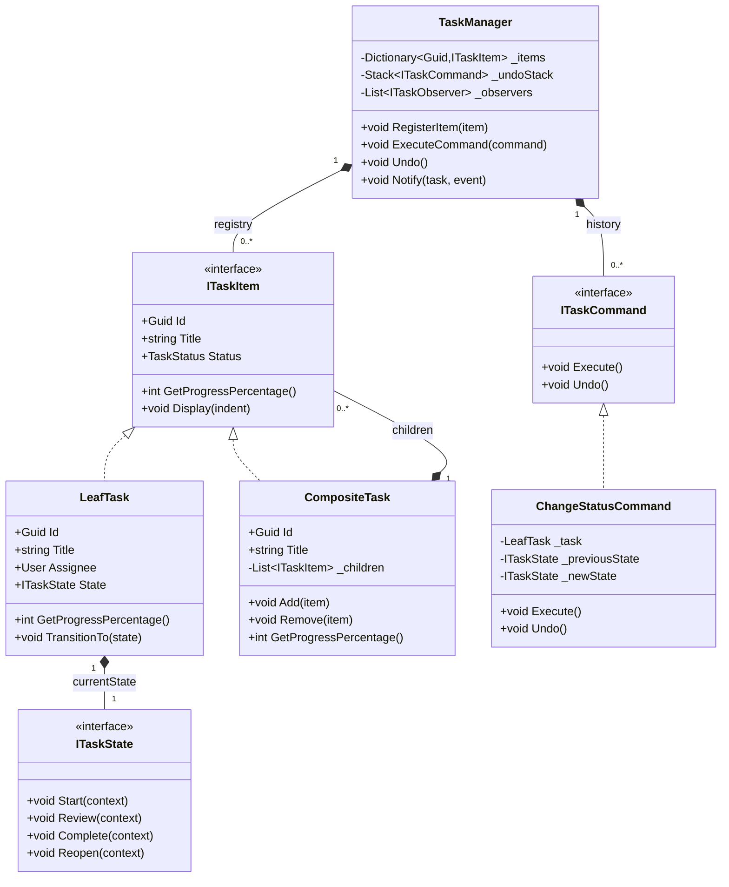

# LLD Problem #18: Task Management System (Jira Lite)

**Tier:** 🟡 Tier 2 (Classic LLD — State & Strategy Mastery)
**Problem Family:** 🟡 Family 3 — Stateful Workflow Engine / 🔵 Family 5 — In-Memory Hierarchy
**Primary Patterns:** Composite, Command, Observer, State
**Difficulty:** Intermediate
**Asked At:** Atlassian, Microsoft, Google, Asana, Monday.com

---

## 🧩 Problem Statement

Design an in-memory Task Management System (similar to Jira or Trello) supporting hierarchical work items (Epics containing Stories, Stories containing Tasks/Subtasks), configurable status workflows, assignee tracking, activity history with undo capability, and automated notifications on status changes.

### Requirements
1. **Hierarchy (Composite Pattern):** Support Epics, Stories, Tasks, and Bugs. An Epic contains multiple Stories; a Story contains multiple Subtasks. A composite item's completion percentage is computed recursively from its children.
2. **State Machine (State Pattern):** Tasks transition through `ToDo -> InProgress -> InReview -> Done`. Invalid transitions (e.g. `Done -> InProgress` directly without reopening) must be rejected.
3. **Audit History & Undo (Command Pattern):** Every action (status change, reassignment, description update) is encapsulated as a Command, enabling complete audit logs and undo/redo operations.
4. **Notifications (Observer Pattern):** When a task changes state or is assigned, the reporter and assignee receive automatic notifications.
5. **Filtering & Search:** Find tasks by assignee, status, priority, or tags.

---

## 🏛️ Architecture

Key design pressures:
1. **Hierarchical work items** → Composite Pattern (`ITaskItem`, `CompositeTaskItem`, `LeafTaskItem`)
2. **State transitions & invariants** → State Pattern (`ITaskState`)
3. **Undo/Redo & audit trail** → Command Pattern (`ITaskCommand`, `ChangeStatusCommand`, `AssignTaskCommand`)
4. **Team notifications** → Observer Pattern (`ITaskObserver`, `EmailNotificationObserver`)

---

## 🗺️ UML Class Diagram



---

## 💻 C# Implementation

```csharp
// ─────────────────────────────────────────────────────────────
// 1. ENUMS & VALUE OBJECTS
// ─────────────────────────────────────────────────────────────
public enum TaskPriority { Low, Medium, High, Critical }
public enum TaskItemType { Epic, Story, Task, Bug }

public record User(Guid Id, string Name, string Email);

// ─────────────────────────────────────────────────────────────
// 2. STATE PATTERN (TASK WORKFLOW)
// ─────────────────────────────────────────────────────────────
public interface ITaskState
{
    string Name { get; }
    void Start(LeafTask task);
    void SubmitForReview(LeafTask task);
    void Complete(LeafTask task);
    void Reopen(LeafTask task);
}

public sealed class ToDoState : ITaskState
{
    public string Name => "To Do";
    public void Start(LeafTask task) => task.SetState(new InProgressState());
    public void SubmitForReview(LeafTask task) => throw new InvalidOperationException("Cannot review a task that hasn't started.");
    public void Complete(LeafTask task) => throw new InvalidOperationException("Cannot complete a task directly from To Do.");
    public void Reopen(LeafTask task) => throw new InvalidOperationException("Task is already in To Do.");
}

public sealed class InProgressState : ITaskState
{
    public string Name => "In Progress";
    public void Start(LeafTask task) => Console.WriteLine("Task is already in progress.");
    public void SubmitForReview(LeafTask task) => task.SetState(new InReviewState());
    public void Complete(LeafTask task) => task.SetState(new DoneState());
    public void Reopen(LeafTask task) => task.SetState(new ToDoState());
}

public sealed class InReviewState : ITaskState
{
    public string Name => "In Review";
    public void Start(LeafTask task) => task.SetState(new InProgressState());
    public void SubmitForReview(LeafTask task) => Console.WriteLine("Task is already in review.");
    public void Complete(LeafTask task) => task.SetState(new DoneState());
    public void Reopen(LeafTask task) => task.SetState(new InProgressState());
}

public sealed class DoneState : ITaskState
{
    public string Name => "Done";
    public void Start(LeafTask task) => throw new InvalidOperationException("Reopen the task before starting.");
    public void SubmitForReview(LeafTask task) => throw new InvalidOperationException("Task is already done.");
    public void Complete(LeafTask task) => Console.WriteLine("Task is already done.");
    public void Reopen(LeafTask task) => task.SetState(new ToDoState());
}

// ─────────────────────────────────────────────────────────────
// 3. COMPOSITE PATTERN (TASK HIERARCHY)
// ─────────────────────────────────────────────────────────────
public interface ITaskItem
{
    Guid Id { get; }
    string Title { get; }
    TaskItemType Type { get; }
    int GetProgressPercentage();
    void Display(int indent = 0);
}

// Leaf: atomic task
public sealed class LeafTask : ITaskItem
{
    public Guid Id { get; } = Guid.NewGuid();
    public string Title { get; }
    public TaskItemType Type { get; }
    public TaskPriority Priority { get; }
    public User? Assignee { get; private set; }
    public ITaskState State { get; private set; }

    public LeafTask(string title, TaskItemType type, TaskPriority priority = TaskPriority.Medium)
    {
        Title = title;
        Type = type;
        Priority = priority;
        State = new ToDoState();
    }

    public void AssignTo(User user) => Assignee = user;

    public void SetState(ITaskState newState)
    {
        Console.WriteLine($"[Task: {Title}] {State.Name} -> {newState.Name}");
        State = newState;
    }

    public int GetProgressPercentage() => State is DoneState ? 100 : (State is InProgressState or InReviewState ? 50 : 0);

    public void Display(int indent = 0)
    {
        string spaces = new(' ', indent * 2);
        string assigneeStr = Assignee != null ? $" (Assigned: {Assignee.Name})" : "";
        Console.WriteLine($"{spaces}- [{Type}] {Title} [{State.Name}] [{GetProgressPercentage()}%]{assigneeStr}");
    }
}

// Composite: Epic or Story containing sub-items
public sealed class CompositeTask : ITaskItem
{
    private readonly List<ITaskItem> _children = new();

    public Guid Id { get; } = Guid.NewGuid();
    public string Title { get; }
    public TaskItemType Type { get; }
    public IReadOnlyCollection<ITaskItem> Children => _children.AsReadOnly();

    public CompositeTask(string title, TaskItemType type)
    {
        Title = title;
        Type = type;
    }

    public void Add(ITaskItem item) => _children.Add(item);
    public void Remove(ITaskItem item) => _children.Remove(item);

    public int GetProgressPercentage()
    {
        if (!_children.Any()) return 0;
        return (int)Math.Round(_children.Average(c => c.GetProgressPercentage()));
    }

    public void Display(int indent = 0)
    {
        string spaces = new(' ', indent * 2);
        Console.WriteLine($"{spaces}+ [{Type}] {Title} [Overall: {GetProgressPercentage()}%]");
        foreach (var child in _children)
            child.Display(indent + 1);
    }
}

// ─────────────────────────────────────────────────────────────
// 4. COMMAND PATTERN (AUDIT LOG & UNDO/REDO)
// ─────────────────────────────────────────────────────────────
public interface ITaskCommand
{
    string Description { get; }
    DateTime ExecutedAt { get; }
    void Execute();
    void Undo();
}

public sealed class ChangeStatusCommand : ITaskCommand
{
    private readonly LeafTask _task;
    private readonly ITaskState _targetState;
    private ITaskState? _previousState;

    public string Description => $"Change status of '{_task.Title}' to {_targetState.Name}";
    public DateTime ExecutedAt { get; } = DateTime.UtcNow;

    public ChangeStatusCommand(LeafTask task, ITaskState targetState)
    {
        _task = task;
        _targetState = targetState;
    }

    public void Execute()
    {
        _previousState = _task.State;
        _task.SetState(_targetState);
    }

    public void Undo()
    {
        if (_previousState != null)
        {
            Console.WriteLine($"[UNDO] Reverting status of '{_task.Title}' to {_previousState.Name}");
            _task.SetState(_previousState);
        }
    }
}

public sealed class AssignUserCommand : ITaskCommand
{
    private readonly LeafTask _task;
    private readonly User? _newUser;
    private User? _previousUser;

    public string Description => $"Assign '{_task.Title}' to {_newUser?.Name ?? "Unassigned"}";
    public DateTime ExecutedAt { get; } = DateTime.UtcNow;

    public AssignUserCommand(LeafTask task, User? newUser)
    {
        _task = task;
        _newUser = newUser;
    }

    public void Execute()
    {
        _previousUser = _task.Assignee;
        _task.AssignTo(_newUser!);
        Console.WriteLine($"[Assign] '{_task.Title}' assigned to {_newUser?.Name ?? "Nobody"}");
    }

    public void Undo()
    {
        Console.WriteLine($"[UNDO] Reverting assignment of '{_task.Title}' to {_previousUser?.Name ?? "Nobody"}");
        _task.AssignTo(_previousUser!);
    }
}

// ─────────────────────────────────────────────────────────────
// 5. OBSERVER PATTERN (NOTIFICATIONS)
// ─────────────────────────────────────────────────────────────
public interface ITaskObserver
{
    void OnTaskUpdated(LeafTask task, string eventType);
}

public sealed class EmailNotificationObserver : ITaskObserver
{
    public void OnTaskUpdated(LeafTask task, string eventType)
    {
        if (task.Assignee != null)
            Console.WriteLine($"[📧 Email -> {task.Assignee.Email}] Task '{task.Title}' event: {eventType} (Status: {task.State.Name})");
    }
}

// ─────────────────────────────────────────────────────────────
// 6. TASK MANAGER (FACADE / INVOCATOR)
// ─────────────────────────────────────────────────────────────
public sealed class TaskManager
{
    private readonly Dictionary<Guid, ITaskItem> _registry = new();
    private readonly Stack<ITaskCommand> _undoStack = new();
    private readonly Stack<ITaskCommand> _redoStack = new();
    private readonly List<ITaskObserver> _observers = new();
    private readonly object _lock = new();

    public void RegisterObserver(ITaskObserver observer) => _observers.Add(observer);

    public void RegisterItem(ITaskItem item)
    {
        lock (_lock)
            _registry[item.Id] = item;
    }

    public void ExecuteCommand(ITaskCommand command)
    {
        lock (_lock)
        {
            command.Execute();
            _undoStack.Push(command);
            _redoStack.Clear(); // New action invalidates redo history
        }
    }

    public bool Undo()
    {
        lock (_lock)
        {
            if (!_undoStack.Any())
            {
                Console.WriteLine("[TaskManager] Nothing to undo.");
                return false;
            }
            var command = _undoStack.Pop();
            command.Undo();
            _redoStack.Push(command);
            return true;
        }
    }

    public bool Redo()
    {
        lock (_lock)
        {
            if (!_redoStack.Any())
            {
                Console.WriteLine("[TaskManager] Nothing to redo.");
                return false;
            }
            var command = _redoStack.Pop();
            command.Execute();
            _undoStack.Push(command);
            return true;
        }
    }

    public void Notify(LeafTask task, string eventType)
    {
        foreach (var observer in _observers)
            observer.OnTaskUpdated(task, eventType);
    }
}
```

---

## 🎯 The 4-Stage Evolution (V1 → V4)

| Version | Feature Added | Architectural Change |
|---|---|---|
| **V1** | Flat list of tasks with simple status string | No hierarchy, switch-case state transitions |
| **V2** | Work breakdown hierarchy (Epic/Story/Task) | Composite Pattern (`ITaskItem`, recursive progress) |
| **V3** | Strict workflow & Command history | State Pattern on `LeafTask` + Command Pattern with Undo/Redo stack |
| **V4** | Multi-tenant team boards & Webhooks | Observer pattern for real-time SignalR broadcasts; Outbox pattern for audit sync |

---

## 🗣️ Interviewer Discussion & Tradeoffs

### Q: Why is Composite Pattern ideal for Jira-like work items?
> **A:** "Composite allows clients (`TaskManager`, progress calculator, tree renderers) to treat single tasks and nested epic hierarchies uniformly through `ITaskItem`. Calling `GetProgressPercentage()` on an Epic automatically recurses through all stories and subtasks without the caller needing `if (item is Epic)` type checks."

### Q: How do you handle deep undo histories without consuming excessive memory?
> **A:** "Instead of deep-cloning the entire task object (Memento), the Command Pattern stores only the delta — e.g. `_previousState` or `_previousUser`. For enterprise scale, cap the in-memory undo stack size (e.g. last 50 actions) and persist older events to an append-only event log (Event Sourcing)."

### Q: How do you support custom workflows per project (e.g. Scrum vs Kanban)?
> **A:** "Extract workflow transition rules into an `IWorkflowStrategy` or configurable state transition table `Dictionary<(TaskStatus Current, TaskStatus Next), Func<bool>>`. This decouples the State Machine from hardcoded C# classes into database-driven transition rules."

---

*Cross-references: [In-Memory File System](./24_In_Memory_File_System.md) (Composite) · [Board Game Engine](./25_Board_Game_Engine.md) (Command + Undo) · [awesome-lld Task Management](https://github.com/ashishps1/awesome-low-level-design/blob/main/problems/task-management-system.md)*

