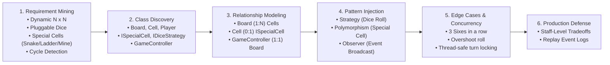
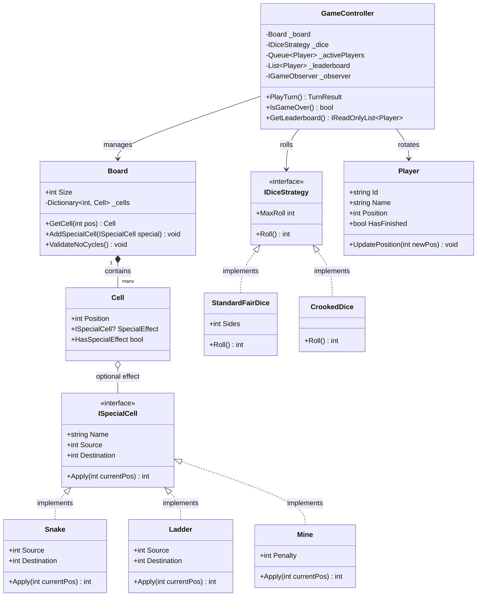

# LLD Problem #23: Snake and Ladder Game (Extensible Board Game Engine)

**Tier:** 🟡 Tier 2 (Classic LLD — State & Strategy Mastery)  
**Problem Family:** 🟡 Family 3 — Stateful Workflow Engine / 🟢 Family 2 — Strategy & Extensible Rules  
**Primary Patterns:** Strategy Pattern, Composite/Visitor Pattern, Factory Method, State Pattern  
**Difficulty:** Medium (Standard Machine Coding Round: 90 - 120 Mins)  
**Asked At:** Flipkart, Amazon, Swiggy, Zepto, Razorpay, Microsoft  

---

## 📌 Problem Statement & Requirements

Design a modular, extensible, and thread-safe **Snake and Ladder Game** supporting multi-player gameplay, dynamic board sizes, configurable special obstacles/boosters, custom dice strategies, and customizable winning rules.

```
+-----+-----+-----+-----+-----+-----+-----+-----+-----+-----+
| 100 |  99 |  98 |  97 |  96 |  95 |  94 |  93 |  92 |  91 |  <-- Win Cell (Exact landing)
|  81 |  82 |  83 |  84 |  85 |  86 |  87 |  88 |  89 |  90 |
|  80 |  79 |  78 |  77 |  76 |  75 |  74 |  73 |  72 |  71 |  [Snake: 99 -> 12]
|  61 |  62 |  63 |  64 |  65 |  66 |  67 |  68 |  69 |  70 |  [Ladder: 14 -> 48]
|  60 |  59 |  58 |  57 |  56 |  55 |  54 |  53 |  52 |  51 |  [Elevator: 25 -> 85]
|  41 |  42 |  43 |  44 |  45 |  46 |  47 |  48 |  49 |  50 |  [Mine: -10 cells]
|  40 |  39 |  38 |  37 |  36 |  35 |  34 |  33 |  32 |  31 |
|  21 |  22 |  23 |  24 |  25 |  26 |  27 |  28 |  29 |  30 |
|  20 |  19 |  18 |  17 |  16 |  15 |  14 |  13 |  12 |  11 |
|   1 |   2 |   3 |   4 |   5 |   6 |   7 |   8 |   9 |  10 |  <-- Start (Outside at 0)
+-----+-----+-----+-----+-----+-----+-----+-----+-----+-----+
```

### Core Requirements
1. **Dynamic Board Dimension**:
   - Configurable grid of size $N \times N$ (default $10 \times 10 = 100$ cells, indices from $1$ to $N^2$).
   - Players start at position $0$ (outside the board) and must reach exactly cell $N^2$ to win.
2. **Special Cells (Obstacles & Boosters)**:
   - **Snakes**: Head at cell $H$, Tail at cell $T$ ($H > T$). Bitten player slides down to $T$.
   - **Ladders**: Foot at cell $F$, Top at cell $E$ ($F < E$). Player climbs to $E$.
   - **Elevators / Portals**: Super ladders that boost players across multiple tiers.
   - **Mines / Traps**: Fixed penalty steps or frozen turn on detonation.
   - **No Cascading / Cycle Prevention**: Cells must not create infinite loops or conflicting multiple special effects on the same cell.
3. **Pluggable Dice Strategies**:
   - **Standard Fair Die**: Uniform random roll in $[1, 6]$ (or $[1, D]$).
   - **Crooked / Biased Die**: Produces only even numbers $\{2, 4, 6\}$ or weighted values.
   - **Multi-Dice**: Support for $K$ dice rolled together with sum or custom combination.
4. **Turn Execution & Winning Rules**:
   - Round-robin queue for $P$ players ($P \ge 2$).
   - **Exact Landing Rule**: If current position + roll $> N^2$, the move is skipped (player stays in place).
   - **Bonus Turn Rule**: Rolling a 6 grants a consecutive bonus roll.
   - **Three Consecutive Sixes Rule**: Rolling three 6s in a row invalidates all rolls of that turn (anti-spam penalty).
   - **Leaderboard / Finish Podiums**: When a player reaches $N^2$, they are awarded 1st, 2nd, 3rd place; game continues until only 1 player remains.

---

## 🎯 CrackingWalnuts 6-Step Methodology Applied



---

## 🏛️ Architecture & Core Design Patterns

1. **Strategy Pattern (`IDiceStrategy`)**: Decouples the dice rolling logic from the game controller. Supports normal, crooked, weighted, or deterministic testing dice.
2. **Open-Closed Special Cells (`ISpecialCell`)**: Instead of `switch (cell.Type)` with hardcoded snakes and ladders, each special element implements `ISpecialCell.Apply(int currentPos)`. Adding `Elevator`, `Mine`, or `Wormhole` requires zero modification to `Board` or `GameController`.
3. **Turn State Machine & Result Encapsulation (`TurnResult`)**: Encapsulates the entire audit log of a turn (initial position, dice rolls, intermediate slides/climbs, final position, extra turn eligibility) for clean replayability and UI rendering.



---

## 💻 Production-Ready C# Implementation (.NET 8 / C# 12)

```csharp
using System;
using System.Collections.Generic;
using System.Linq;
using System.Security.Cryptography;
using System.Text;

namespace SnakeAndLadder.Design;

// ============================================================================
// 1. DOMAIN MODELS & ENUMS
// ============================================================================

public enum SpecialCellType
{
    Snake,
    Ladder,
    Elevator,
    Mine
}

public sealed class Player
{
    public string Id { get; }
    public string Name { get; }
    public int Position { get; private set; }
    public bool HasFinished { get; private set; }
    public int Rank { get; private set; }

    public Player(string id, string name)
    {
        Id = id ?? throw new ArgumentNullException(nameof(id));
        Name = name ?? throw new ArgumentNullException(nameof(name));
        Position = 0; // Starts outside the board
        HasFinished = false;
        Rank = 0;
    }

    public void MoveTo(int newPosition)
    {
        Position = newPosition;
    }

    public void MarkFinished(int rank)
    {
        HasFinished = true;
        Rank = rank;
    }

    public override string ToString() => $"{Name} (Pos: {Position})";
}

// ============================================================================
// 2. SPECIAL CELLS (Open-Closed Polymorphism)
// ============================================================================

public interface ISpecialCell
{
    SpecialCellType Type { get; }
    string Description { get; }
    int Source { get; }
    int Destination { get; }
    int Apply(int currentPos);
}

public sealed class Snake : ISpecialCell
{
    public SpecialCellType Type => SpecialCellType.Snake;
    public string Description => $"Snake bitten at {Source} -> slides down to {Destination}";
    public int Source { get; }
    public int Destination { get; }

    public Snake(int head, int tail)
    {
        if (head <= tail)
            throw new ArgumentException($"Snake head ({head}) must be strictly higher than tail ({tail}).");
        Source = head;
        Destination = tail;
    }

    public int Apply(int currentPos) => Destination;
}

public sealed class Ladder : ISpecialCell
{
    public SpecialCellType Type => SpecialCellType.Ladder;
    public string Description => $"Ladder climbed from {Source} -> climbs up to {Destination}";
    public int Source { get; }
    public int Destination { get; }

    public Ladder(int foot, int top)
    {
        if (foot >= top)
            throw new ArgumentException($"Ladder foot ({foot}) must be strictly lower than top ({top}).");
        Source = foot;
        Destination = top;
    }

    public int Apply(int currentPos) => Destination;
}

public sealed class Elevator : ISpecialCell
{
    public SpecialCellType Type => SpecialCellType.Elevator;
    public string Description => $"Elevator express ride from {Source} -> boosts up to {Destination}";
    public int Source { get; }
    public int Destination { get; }

    public Elevator(int source, int destination)
    {
        if (source >= destination)
            throw new ArgumentException("Elevator must transport player upward.");
        Source = source;
        Destination = destination;
    }

    public int Apply(int currentPos) => Destination;
}

public sealed class Mine : ISpecialCell
{
    public SpecialCellType Type => SpecialCellType.Mine;
    public string Description => $"Landmine triggered at {Source} -> blasts back {Penalty} spaces to {Destination}";
    public int Source { get; }
    public int Destination => Math.Max(1, Source - Penalty);
    public int Penalty { get; }

    public Mine(int position, int penalty)
    {
        if (penalty <= 0)
            throw new ArgumentException("Mine penalty must be positive.");
        Source = position;
        Penalty = penalty;
    }

    public int Apply(int currentPos) => Destination;
}

// ============================================================================
// 3. BOARD & CELL ABSTRACTION
// ============================================================================

public sealed class Cell
{
    public int Number { get; }
    public ISpecialCell? SpecialEffect { get; private set; }

    public bool HasSpecialEffect => SpecialEffect != null;

    public Cell(int number)
    {
        Number = number;
    }

    public void SetSpecialEffect(ISpecialCell effect)
    {
        if (effect.Source != Number)
            throw new InvalidOperationException($"Cannot attach special effect from cell {effect.Source} to cell {Number}.");
        SpecialEffect = effect;
    }
}

public sealed class Board
{
    public int TotalCells { get; }
    private readonly Dictionary<int, Cell> _cells = new();

    public Board(int dimension = 10)
    {
        if (dimension < 3)
            throw new ArgumentException("Board dimension must be at least 3x3.");

        TotalCells = dimension * dimension;
        for (int i = 1; i <= TotalCells; i++)
        {
            _cells[i] = new Cell(i);
        }
    }

    public Cell GetCell(int position)
    {
        if (position < 1 || position > TotalCells)
            throw new ArgumentOutOfRangeException(nameof(position), $"Position {position} is outside board boundaries [1, {TotalCells}].");
        return _cells[position];
    }

    public void AddSpecialCell(ISpecialCell effect)
    {
        if (effect.Source < 1 || effect.Source >= TotalCells)
            throw new ArgumentOutOfRangeException(nameof(effect), "Special cell source cannot be outside board or on the final winning cell.");
        if (effect.Destination < 1 || effect.Destination > TotalCells)
            throw new ArgumentOutOfRangeException(nameof(effect), "Special cell destination must be inside the board.");

        var cell = GetCell(effect.Source);
        if (cell.HasSpecialEffect)
            throw new InvalidOperationException($"Cell {effect.Source} already has an obstacle/booster attached.");

        cell.SetSpecialEffect(effect);
    }

    /// <summary>
    /// Validates that no directed cycle exists between special cells (e.g., Snake 50->20 and Ladder 20->50)
    /// </summary>
    public void ValidateNoCycles()
    {
        var visited = new HashSet<int>();
        var recursionStack = new HashSet<int>();

        foreach (var (pos, cell) in _cells)
        {
            if (cell.HasSpecialEffect && !visited.Contains(pos))
            {
                if (HasCycleDfs(pos, visited, recursionStack))
                {
                    throw new InvalidOperationException($"Detected infinite loop / cycle in board configuration originating from cell {pos}!");
                }
            }
        }
    }

    private bool HasCycleDfs(int current, HashSet<int> visited, HashSet<int> stack)
    {
        visited.Add(current);
        stack.Add(current);

        if (_cells.TryGetValue(current, out var cell) && cell.HasSpecialEffect)
        {
            int next = cell.SpecialEffect!.Destination;
            if (!visited.Contains(next))
            {
                if (HasCycleDfs(next, visited, stack)) return true;
            }
            else if (stack.Contains(next))
            {
                return true; // Cycle detected!
            }
        }

        stack.Remove(current);
        return false;
    }
}

// ============================================================================
// 4. DICE STRATEGIES (Strategy Pattern)
// ============================================================================

public interface IDiceStrategy
{
    int Roll();
    int MaxRoll { get; }
    string Name { get; }
}

public sealed class StandardFairDice : IDiceStrategy
{
    private readonly int _sides;
    public int MaxRoll => _sides;
    public string Name => $"Standard Fair Dice (1-{_sides})";

    public StandardFairDice(int sides = 6)
    {
        if (sides < 2) throw new ArgumentException("Dice must have at least 2 sides.");
        _sides = sides;
    }

    public int Roll() => RandomNumberGenerator.GetInt32(1, _sides + 1);
}

public sealed class CrookedDice : IDiceStrategy
{
    public int MaxRoll => 6;
    public string Name => "Crooked Dice (Even numbers only: 2, 4, 6)";

    public int Roll()
    {
        int[] evens = [2, 4, 6];
        return evens[RandomNumberGenerator.GetInt32(0, evens.Length)];
    }
}

public sealed class DeterministicTestDice : IDiceStrategy
{
    private readonly Queue<int> _predefinedRolls;
    public int MaxRoll => 6;
    public string Name => "Deterministic Test Rig Dice";

    public DeterministicTestDice(IEnumerable<int> rolls)
    {
        _predefinedRolls = new Queue<int>(rolls);
    }

    public int Roll()
    {
        if (_predefinedRolls.Count == 0) return 1;
        return _predefinedRolls.Dequeue();
    }
}

// ============================================================================
// 5. TURN AUDIT & OBSERVABILITY
// ============================================================================

public sealed record TurnEvent(
    string PlayerName,
    int StartPosition,
    IReadOnlyList<int> Rolls,
    bool ThreeSixesCancelled,
    int IntermediatePosition,
    ISpecialCell? SpecialEncountered,
    int FinalPosition,
    bool Won
);

public interface IGameObserver
{
    void OnTurnExecuted(TurnEvent turnEvent);
    void OnPlayerFinished(Player player, int rank);
    void OnGameCompleted(IReadOnlyList<Player> leaderboard);
}

public sealed class ConsoleGameLogger : IGameObserver
{
    public void OnTurnExecuted(TurnEvent evt)
    {
        var sb = new StringBuilder();
        sb.Append($"🎲 [{evt.PlayerName}] Rolls: [{string.Join(", ", evt.Rolls)}]");

        if (evt.ThreeSixesCancelled)
        {
            sb.Append(" 🚨 3 CONSECUTIVE 6s! Turn cancelled & reset to start position.");
            Console.WriteLine(sb.ToString());
            return;
        }

        sb.Append($" | Moved {evt.StartPosition} -> {evt.IntermediatePosition}");

        if (evt.SpecialEncountered != null)
        {
            sb.Append($" | ⚡ {evt.SpecialEncountered.Description}");
        }

        sb.Append($" | Final: Cell {evt.FinalPosition}");

        if (evt.Won)
        {
            sb.Append(" 🏆 FINISHED!");
        }

        Console.WriteLine(sb.ToString());
    }

    public void OnPlayerFinished(Player player, int rank)
    {
        Console.WriteLine($"🏅 Player '{player.Name}' secured Rank #{rank}!");
    }

    public void OnGameCompleted(IReadOnlyList<Player> leaderboard)
    {
        Console.WriteLine("\n==========================================");
        Console.WriteLine("🏁 GAME OVER! FINAL LEADERBOARD:");
        Console.WriteLine("==========================================");
        for (int i = 0; i < leaderboard.Count; i++)
        {
            Console.WriteLine($"  Rank {i + 1}: {leaderboard[i].Name}");
        }
        Console.WriteLine("==========================================\n");
    }
}

// ============================================================================
// 6. GAME CONTROLLER (Workflow Engine)
// ============================================================================

public sealed class SnakeLadderGameController
{
    private readonly Board _board;
    private readonly IDiceStrategy _dice;
    private readonly Queue<Player> _activeTurnQueue;
    private readonly List<Player> _leaderboard = new();
    private readonly IGameObserver _observer;
    private readonly object _lock = new();

    public int TotalCells => _board.TotalCells;
    public bool IsGameOver => _activeTurnQueue.Count <= 1; // Ends when at most 1 player left
    public IReadOnlyList<Player> Leaderboard => _leaderboard.AsReadOnly();

    public SnakeLadderGameController(
        Board board,
        IEnumerable<Player> players,
        IDiceStrategy dice,
        IGameObserver observer)
    {
        _board = board ?? throw new ArgumentNullException(nameof(board));
        _dice = dice ?? throw new ArgumentNullException(nameof(dice));
        _observer = observer ?? throw new ArgumentNullException(nameof(observer));

        var playerList = players?.ToList() ?? throw new ArgumentNullException(nameof(players));
        if (playerList.Count < 2)
            throw new ArgumentException("At least 2 players are required to play Snake and Ladder.");

        _activeTurnQueue = new Queue<Player>(playerList);
        _board.ValidateNoCycles();
    }

    /// <summary>
    /// Executes a single atomic player turn with support for 6s bonus, 3-consecutive-6s penalty,
    /// overshoot rules, and special cell resolution.
    /// </summary>
    public TurnEvent? PlayNextTurn()
    {
        lock (_lock)
        {
            if (IsGameOver)
            {
                if (_activeTurnQueue.Count == 1)
                {
                    var lastPlayer = _activeTurnQueue.Dequeue();
                    lastPlayer.MarkFinished(_leaderboard.Count + 1);
                    _leaderboard.Add(lastPlayer);
                    _observer.OnPlayerFinished(lastPlayer, lastPlayer.Rank);
                }
                _observer.OnGameCompleted(_leaderboard);
                return null;
            }

            var player = _activeTurnQueue.Dequeue();
            int startPos = player.Position;
            var rolls = new List<int>();
            int consecutiveSixes = 0;
            int currentPos = startPos;
            ISpecialCell? triggeredSpecial = null;
            bool cancelledDueToThreeSixes = false;

            while (true)
            {
                int roll = _dice.Roll();
                rolls.Add(roll);

                if (roll == 6)
                {
                    consecutiveSixes++;
                    if (consecutiveSixes == 3)
                    {
                        // Penalty: Cancel whole turn!
                        cancelledDueToThreeSixes = true;
                        currentPos = startPos;
                        break;
                    }
                }
                else
                {
                    consecutiveSixes = 0;
                }

                // Exact landing check
                if (currentPos + roll <= _board.TotalCells)
                {
                    currentPos += roll;
                }
                else
                {
                    // Overshoot rule: move is invalid, stays in place
                }

                // If rolled a 6 and didn't reach the end, grant another roll
                if (roll == 6 && currentPos < _board.TotalCells)
                {
                    continue; // Roll again!
                }

                break;
            }

            int intermediatePos = currentPos;

            // Apply special cell effect if not cancelled and valid cell
            if (!cancelledDueToThreeSixes && currentPos > 0 && currentPos < _board.TotalCells)
            {
                var cell = _board.GetCell(currentPos);
                if (cell.HasSpecialEffect)
                {
                    triggeredSpecial = cell.SpecialEffect;
                    currentPos = triggeredSpecial!.Apply(currentPos);
                }
            }

            player.MoveTo(currentPos);
            bool won = (currentPos == _board.TotalCells);

            if (won)
            {
                int rank = _leaderboard.Count + 1;
                player.MarkFinished(rank);
                _leaderboard.Add(player);
                _observer.OnPlayerFinished(player, rank);
            }
            else
            {
                // Re-enqueue player for next rounds
                _activeTurnQueue.Enqueue(player);
            }

            var turnEvent = new TurnEvent(
                player.Name,
                startPos,
                rolls,
                cancelledDueToThreeSixes,
                intermediatePos,
                triggeredSpecial,
                currentPos,
                won
            );

            _observer.OnTurnExecuted(turnEvent);

            if (IsGameOver)
            {
                if (_activeTurnQueue.Count == 1)
                {
                    var last = _activeTurnQueue.Dequeue();
                    last.MarkFinished(_leaderboard.Count + 1);
                    _leaderboard.Add(last);
                    _observer.OnPlayerFinished(last, last.Rank);
                }
                _observer.OnGameCompleted(_leaderboard);
            }

            return turnEvent;
        }
    }

    public void RunUntilFinished(int maxRounds = 500)
    {
        int round = 0;
        while (!IsGameOver && round < maxRounds)
        {
            PlayNextTurn();
            round++;
        }
    }
}

// ============================================================================
// 7. VERIFICATION DRIVER & SCENARIOS (Program.cs)
// ============================================================================

public static class Program
{
    public static void Main()
    {
        Console.WriteLine("==========================================================");
        Console.WriteLine("🎲 SNAKE & LADDER PRODUCTION ENGINE (C# 12 / .NET 8)");
        Console.WriteLine("==========================================================\n");

        // 1. Setup Board (10x10 = 100 cells)
        var board = new Board(10);

        // Standard Snakes
        board.AddSpecialCell(new Snake(99, 12));
        board.AddSpecialCell(new Snake(95, 56));
        board.AddSpecialCell(new Snake(88, 34));
        board.AddSpecialCell(new Snake(62, 19));
        board.AddSpecialCell(new Snake(36, 6));

        // Standard Ladders
        board.AddSpecialCell(new Ladder(4, 25));
        board.AddSpecialCell(new Ladder(14, 55));
        board.AddSpecialCell(new Ladder(28, 77));
        board.AddSpecialCell(new Ladder(51, 91));
        board.AddSpecialCell(new Ladder(72, 94));

        // Modern Extensibility: Elevator and Landmine
        board.AddSpecialCell(new Elevator(8, 40));
        board.AddSpecialCell(new Mine(45, penalty: 15)); // blasts 45 -> 30

        // 2. Setup Players
        var players = new List<Player>
        {
            new("P1", "Alice"),
            new("P2", "Bob"),
            new("P3", "Charlie"),
            new("P4", "Diana")
        };

        // 3. Setup Strategy & Observer
        var dice = new StandardFairDice(6);
        var logger = new ConsoleGameLogger();
        var game = new SnakeLadderGameController(board, players, dice, logger);

        Console.WriteLine($"Game started with {players.Count} players on {board.TotalCells}-cell board using {dice.Name}.\n");

        // 4. Run Game Loop
        game.RunUntilFinished(maxRounds: 200);

        // 5. Verification of Deterministic Edge Case (3 Consecutive Sixes & Exact Win Overshoot)
        Console.WriteLine("\n--- 🧪 Verifying Edge Cases: 3 Consecutive 6s Penalty ---");
        var testBoard = new Board(5); // 25 cells
        var testPlayers = new List<Player> { new("T1", "Tester1"), new("T2", "Tester2") };
        
        // Feed: 6, 6, 6 (Should cancel!) then Tester2 rolls 4
        var rigDice = new DeterministicTestDice(new[] { 6, 6, 6, 4 });
        var testGame = new SnakeLadderGameController(testBoard, testPlayers, rigDice, logger);

        testGame.PlayNextTurn(); // Tester1 rolls 6, 6, 6 -> cancelled
        testGame.PlayNextTurn(); // Tester2 rolls 4 -> moves 0 -> 4
    }
}
```

---

## 🗣️ Senior Interviewer Discussion & Trade-offs (Staff Level)

| Question / Follow-up | Senior / Staff Engineering Defense |
| :--- | :--- |
| **"How do you mathematically guarantee that snakes and ladders do not form an infinite loop?"** | We model the board as a Directed Graph $G = (V, E)$. During board initialization, we execute a **Tarjan's or DFS 3-Color Cycle Detection algorithm** ($O(V + E)$ time and space). If a back-edge into the recursion stack is encountered (e.g. Snake $50 \rightarrow 20$ and Ladder $20 \rightarrow 50$), initialization throws an `InvalidOperationException`. We also enforce that cell $N^2$ cannot have any obstacle, and no two special cells share the same source cell. |
| **"How would you scale this to a multiplayer online game with 100,000 concurrent rooms?"** | In an online service (e.g. Swiggy/Zepto gamification campaigns), each game session is an **Actor** (e.g. Microsoft Orleans Grain or Akka.NET actor). Turn messages are strictly serialized within the single-threaded actor mailbox, completely eliminating database locks. State can be stored in **Redis with optimistic concurrency (`WATCH` / Lua scripts)**. |
| **"How do you handle idempotency if a player's client double-submits a roll request?"** | Every turn request from the mobile client includes a monotonic `TurnId` / `MoveSequenceNumber`. If the server has already processed `TurnId: 42`, subsequent duplicate requests return the cached `TurnResult` without re-rolling the dice. |
| **"How does the exact landing overshoot rule prevent deadlock at cell 99?"** | If a player is at cell 99, only a roll of $1$ allows them to finish. With an $N$-sided die, the probability of rolling $1$ on each turn is $p = 1/6$. The number of turns required follows a geometric distribution with expected value $E[T] = 1/p = 6$ turns. It is mathematically guaranteed to terminate almost surely ($P(\text{termination}) = 1$). |
| **"How would you support moving obstacles (e.g. snakes that change positions every 5 turns)?"** | Because our `Board` accesses obstacles through `_cells[pos].SpecialEffect`, we can introduce a `BoardModifierService` or `ObstacleRelocationEvent`. Since the game engine queries cell polymorphism dynamically per turn rather than pre-calculating path tables, dynamic obstacle updates are immediately respected without altering the core game loop. |
