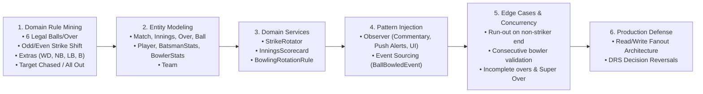
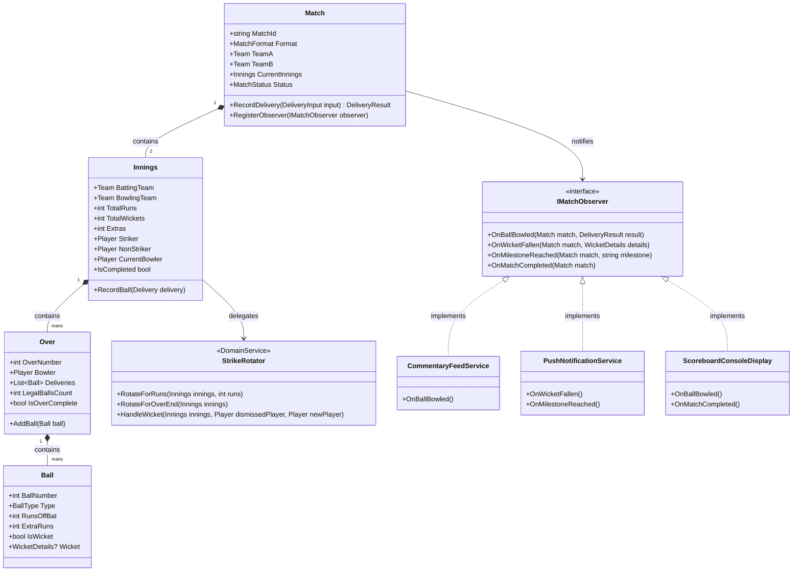

# LLD Problem #24: Cricbuzz / Live Cricket Scoreboard & Commentary System

**Tier:** 🟡 Tier 2 (Classic LLD — State & Strategy Mastery)  
**Problem Family:** 🟡 Family 3 — Stateful Workflow Engine / 🟣 Family 5 — Real-Time Pub-Sub & Observability  
**Primary Patterns:** Observer Pattern, State Pattern, Domain Service (Strike Rotator), Event Sourcing Pattern  
**Difficulty:** Hard (Flagship Machine Coding Round: 90 - 120 Mins)  
**Asked At:** Disney+ Hotstar, Flipkart, Swiggy, PhonePe, Dream11, Cricbuzz  

---

## 📌 Problem Context & Motivation

Live sports engines like **Cricbuzz, ESPNcricinfo, and Disney+ Hotstar** are stateful real-time distributed systems. Unlike a simple counter, cricket scoring involves intricate domain rules:
1. **Asymmetric Delivery Accounting**: Only legal deliveries increment the over count ($6$ legal balls per over). Wides and No-balls add penalty runs and do **not** consume a ball.
2. **Strike Rotation Invariant**: Strike rotates on odd runs ($1, 3, 5$), at the completion of an over ($6^{\text{th}}$ legal ball), but **not** on even boundaries ($0, 2, 4, 6$) unless an over completes.
3. **High Read-to-Write Fan-Out**: While a single certified scorer produces $\approx 1$ ball event every 30 seconds, millions of concurrent clients consume the live scoreboard, ball-by-ball commentary, and push notifications simultaneously.
4. **Resilience to Third-Umpire DRS Overturns**: The system must support replaying or rewinding match events when an umpire's decision is reversed.

---

## 🎯 CrackingWalnuts 6-Step Methodology Applied



---

## 🏗️ Architectural Class Diagram



---

## 💻 Production-Ready C# Implementation (.NET 8 / C# 12)

```csharp
using System;
using System.Collections.Generic;
using System.Collections.ObjectModel;
using System.Linq;
using System.Text;

namespace Cricbuzz.Design;

// ============================================================================
// 1. DOMAIN ENUMS & VALUE OBJECTS
// ============================================================================

public enum BallType
{
    Normal,
    Wide,
    NoBall,
    Bye,
    LegBye
}

public enum DismissalType
{
    None,
    Bowled,
    Caught,
    Lbw,
    RunOut,
    Stumped,
    HitWicket
}

public enum MatchStatus
{
    Scheduled,
    Innings1,
    InningsBreak,
    Innings2,
    Completed,
    Tied,
    Abandoned
}

public sealed record WicketDetails(
    DismissalType Type,
    Player DismissedPlayer,
    Player? BowlerCredit,
    Player? FielderCredit,
    string Description
);

public sealed record DeliveryInput(
    BallType Type,
    int RunsOffBat,
    int ExtraRuns,
    bool IsWicket,
    DismissalType Dismissal = DismissalType.None,
    bool IsStrikerDismissed = true,
    Player? Fielder = null
);

public sealed record DeliveryResult(
    int OverIndex,
    int LegalBallIndex,
    BallType Type,
    int TotalRunsOnBall,
    int RunsOffBat,
    int ExtraRuns,
    bool IsLegal,
    bool IsWicket,
    WicketDetails? Wicket,
    Player Bowler,
    Player Striker,
    Player NonStriker,
    string CommentaryText
);

// ============================================================================
// 2. PLAYER & PLAYER STATISTICS
// ============================================================================

public sealed class BatsmanStats
{
    public int Runs { get; private set; }
    public int BallsFaced { get; private set; }
    public int Fours { get; private set; }
    public int Sixes { get; private set; }
    public bool IsOut { get; private set; }
    public string DismissalSummary { get; private set; } = "Not Out";

    public double StrikeRate => BallsFaced == 0 ? 0.0 : Math.Round((double)Runs / BallsFaced * 100.0, 2);

    public void AddRuns(int runs, BallType ballType)
    {
        // Extras like Wides do not count as balls faced by batsman
        if (ballType != BallType.Wide)
        {
            BallsFaced++;
        }

        if (ballType == BallType.Normal || ballType == BallType.NoBall)
        {
            Runs += runs;
            if (runs == 4) Fours++;
            else if (runs == 6) Sixes++;
        }
    }

    public void MarkOut(string summary)
    {
        IsOut = true;
        DismissalSummary = summary;
    }
}

public sealed class BowlerStats
{
    public int LegalBallsBowled { get; private set; }
    public int RunsConceded { get; private set; }
    public int Wickets { get; private set; }
    public int MaidenOvers { get; private set; }

    public string OversString => $"{LegalBallsBowled / 6}.{LegalBallsBowled % 6}";
    public double OversExact => (LegalBallsBowled / 6) + (LegalBallsBowled % 6) / 6.0;
    public double Economy => OversExact == 0 ? 0.0 : Math.Round(RunsConceded / OversExact, 2);

    public void AddDelivery(DeliveryInput input, bool isLegal)
    {
        if (isLegal)
        {
            LegalBallsBowled++;
        }

        // Byes and Leg Byes do not count against the bowler's economy
        if (input.Type != BallType.Bye && input.Type != BallType.LegBye)
        {
            RunsConceded += (input.RunsOffBat + input.ExtraRuns);
        }

        if (input.IsWicket && input.Dismissal != DismissalType.RunOut)
        {
            Wickets++;
        }
    }
}

public sealed class Player
{
    public string Id { get; }
    public string Name { get; }
    public BatsmanStats BattingStats { get; } = new();
    public BowlerStats BowlingStats { get; } = new();

    public Player(string id, string name)
    {
        Id = id;
        Name = name;
    }

    public override string ToString() => Name;
}

public sealed class Team
{
    public string Id { get; }
    public string Name { get; }
    private readonly List<Player> _players;

    public IReadOnlyList<Player> Players => _players.AsReadOnly();

    public Team(string id, string name, IEnumerable<Player> players)
    {
        Id = id;
        Name = name;
        _players = players.ToList();
        if (_players.Count < 2)
            throw new ArgumentException("A team must have at least 2 players.");
    }
}

// ============================================================================
// 3. OVER & INNINGS DOMAIN ENTITIES
// ============================================================================

public sealed class Ball
{
    public int BallNumber { get; }
    public BallType Type { get; }
    public int RunsOffBat { get; }
    public int ExtraRuns { get; }
    public bool IsWicket { get; }
    public WicketDetails? Wicket { get; }

    public int TotalRuns => RunsOffBat + ExtraRuns;
    public bool IsLegal => Type != BallType.Wide && Type != BallType.NoBall;

    public Ball(int ballNumber, BallType type, int runsOffBat, int extraRuns, bool isWicket, WicketDetails? wicket)
    {
        BallNumber = ballNumber;
        Type = type;
        RunsOffBat = runsOffBat;
        ExtraRuns = extraRuns;
        IsWicket = isWicket;
        Wicket = wicket;
    }
}

public sealed class Over
{
    public int OverNumber { get; }
    public Player Bowler { get; }
    private readonly List<Ball> _deliveries = new();

    public IReadOnlyList<Ball> Deliveries => _deliveries.AsReadOnly();
    public int LegalBallsCount => _deliveries.Count(b => b.IsLegal);
    public bool IsOverComplete => LegalBallsCount >= 6;
    public int TotalRuns => _deliveries.Sum(b => b.TotalRuns);

    public Over(int overNumber, Player bowler)
    {
        OverNumber = overNumber;
        Bowler = bowler ?? throw new ArgumentNullException(nameof(bowler));
    }

    public void AddBall(Ball ball)
    {
        if (IsOverComplete)
            throw new InvalidOperationException($"Over {OverNumber} is already completed.");
        _deliveries.Add(ball);
    }
}

// ============================================================================
// 4. STRIKE ROTATOR DOMAIN SERVICE
// ============================================================================

public sealed class StrikeRotator
{
    public void SwapStrikerAndNonStriker(Innings innings)
    {
        var temp = innings.Striker;
        innings.SetStriker(innings.NonStriker);
        innings.SetNonStriker(temp);
    }

    public void RotateAfterDelivery(Innings innings, DeliveryInput input, bool isLegalOverEnd)
    {
        // 1. Runs off the bat or extras running between wickets:
        // Odd runs swap ends (1, 3, 5 runs)
        int runningRuns = input.RunsOffBat + (input.Type is BallType.Bye or BallType.LegBye ? input.ExtraRuns : 0);
        if (runningRuns % 2 != 0)
        {
            SwapStrikerAndNonStriker(innings);
        }

        // 2. End of over swap (over finishes on 6th legal delivery)
        if (isLegalOverEnd)
        {
            SwapStrikerAndNonStriker(innings);
        }
    }
}

// ============================================================================
// 5. INNINGS AGGREGATE ROOT
// ============================================================================

public sealed class Innings
{
    public Team BattingTeam { get; }
    public Team BowlingTeam { get; }
    public int MaxOvers { get; }
    public int? TargetRuns { get; }

    public int TotalRuns { get; private set; }
    public int TotalWickets { get; private set; }
    public int TotalExtras { get; private set; }
    public Player Striker { get; private set; }
    public Player NonStriker { get; private set; }
    public Player CurrentBowler { get; private set; }

    private int _nextBatsmanIndex;
    private readonly List<Over> _overs = new();
    private readonly StrikeRotator _strikeRotator = new();

    public IReadOnlyList<Over> Overs => _overs.AsReadOnly();
    public Over CurrentOver => _overs.Last();
    public int CompletedLegalBalls => _overs.Sum(o => o.LegalBallsCount);
    public string OversFormatted => $"{CompletedLegalBalls / 6}.{CompletedLegalBalls % 6}";
    public bool IsAllOut => TotalWickets >= BattingTeam.Players.Count - 1;
    public bool IsTargetChased => TargetRuns.HasValue && TotalRuns >= TargetRuns.Value;
    public bool IsCompleted => IsAllOut || IsTargetChased || CompletedLegalBalls >= MaxOvers * 6;

    public Innings(Team battingTeam, Team bowlingTeam, int maxOvers, Player bowler, int? targetRuns = null)
    {
        BattingTeam = battingTeam;
        BowlingTeam = bowlingTeam;
        MaxOvers = maxOvers;
        TargetRuns = targetRuns;

        Striker = battingTeam.Players[0];
        NonStriker = battingTeam.Players[1];
        _nextBatsmanIndex = 2;

        CurrentBowler = bowler;
        _overs.Add(new Over(1, CurrentBowler));
    }

    internal void SetStriker(Player player) => Striker = player;
    internal void SetNonStriker(Player player) => NonStriker = player;

    public void ChangeBowler(Player newBowler)
    {
        if (newBowler.Id == CurrentBowler.Id && CompletedLegalBalls > 0 && CompletedLegalBalls % 6 == 0)
        {
            throw new InvalidOperationException($"Bowler {newBowler.Name} cannot bowl two consecutive overs.");
        }
        CurrentBowler = newBowler;
        _overs.Add(new Over(_overs.Count + 1, CurrentBowler));
    }

    public DeliveryResult RecordDelivery(DeliveryInput input)
    {
        if (IsCompleted)
            throw new InvalidOperationException("Innings is already completed.");

        var currentOver = CurrentOver;
        if (currentOver.IsOverComplete)
            throw new InvalidOperationException("Current over is complete. Set next bowler first.");

        // 1. Calculate Score Increments
        int runsOnDelivery = input.RunsOffBat + input.ExtraRuns;
        TotalRuns += runsOnDelivery;
        TotalExtras += input.ExtraRuns;

        // 2. Update Stats
        Striker.BattingStats.AddRuns(input.RunsOffBat, input.Type);
        bool isLegal = (input.Type != BallType.Wide && input.Type != BallType.NoBall);
        CurrentBowler.BowlingStats.AddDelivery(input, isLegal);

        // 3. Handle Wickets
        WicketDetails? wicket = null;
        if (input.IsWicket)
        {
            TotalWickets++;
            var dismissed = input.IsStrikerDismissed ? Striker : NonStriker;
            var creditedBowler = (input.Dismissal != DismissalType.RunOut) ? CurrentBowler : null;
            string summary = $"{input.Dismissal} b {CurrentBowler.Name}" + (input.Fielder != null ? $" c {input.Fielder.Name}" : "");
            dismissed.BattingStats.MarkOut(summary);

            wicket = new WicketDetails(input.Dismissal, dismissed, creditedBowler, input.Fielder, summary);

            // Bring in new batsman if not all out
            if (!IsAllOut && _nextBatsmanIndex < BattingTeam.Players.Count)
            {
                var nextBatsman = BattingTeam.Players[_nextBatsmanIndex++];
                if (input.IsStrikerDismissed)
                {
                    Striker = nextBatsman;
                }
                else
                {
                    NonStriker = nextBatsman;
                }
            }
        }

        // 4. Record ball into over
        var ball = new Ball(currentOver.Deliveries.Count + 1, input.Type, input.RunsOffBat, input.ExtraRuns, input.IsWicket, wicket);
        currentOver.AddBall(ball);

        // 5. Strike Rotation
        bool overEndedNow = currentOver.IsOverComplete;
        _strikeRotator.RotateAfterDelivery(this, input, overEndedNow);

        // 6. Generate commentary snippet
        string commentary = GenerateCommentary(currentOver, ball, input);

        return new DeliveryResult(
            currentOver.OverNumber,
            currentOver.LegalBallsCount,
            input.Type,
            runsOnDelivery,
            input.RunsOffBat,
            input.ExtraRuns,
            isLegal,
            input.IsWicket,
            wicket,
            CurrentBowler,
            Striker,
            NonStriker,
            commentary
        );
    }

    private string GenerateCommentary(Over over, Ball ball, DeliveryInput input)
    {
        var sb = new StringBuilder();
        sb.Append($"{over.OverNumber - 1}.{over.LegalBallsCount} {CurrentBowler.Name} to {Striker.Name}: ");

        if (input.Type == BallType.Wide) sb.Append("WIDE ball! ");
        if (input.Type == BallType.NoBall) sb.Append("NO BALL! Free hit coming up! ");

        if (input.IsWicket)
        {
            sb.Append($"OUT! {ball.Wicket!.Description}");
        }
        else if (input.RunsOffBat == 4)
        {
            sb.Append("FOUR! Beautifully timed through covers to the fence!");
        }
        else if (input.RunsOffBat == 6)
        {
            sb.Append("SIX! Towering shot into the top tier!");
        }
        else if (input.RunsOffBat == 0)
        {
            sb.Append("Dot ball. Defended back to the bowler.");
        }
        else
        {
            sb.Append($"{input.RunsOffBat} run(s) taken.");
        }

        return sb.ToString();
    }
}

// ============================================================================
// 6. OBSERVER PATTERN (Real-Time Pub/Sub)
// ============================================================================

public interface IMatchObserver
{
    void OnBallBowled(Match match, DeliveryResult result);
    void OnWicketFallen(Match match, WicketDetails wicket);
    void OnMilestoneReached(Match match, string milestone);
    void OnMatchCompleted(Match match, string summary);
}

public sealed class CommentaryLoggerObserver : IMatchObserver
{
    public void OnBallBowled(Match match, DeliveryResult result)
    {
        Console.WriteLine($"🎙️ [LIVE COMMENTARY] {result.CommentaryText}");
    }

    public void OnWicketFallen(Match match, WicketDetails wicket)
    {
        Console.WriteLine($"🚨 [WICKET FLASH] {wicket.DismissedPlayer.Name} OUT! ({wicket.Type})");
    }

    public void OnMilestoneReached(Match match, string milestone)
    {
        Console.WriteLine($"🎉 [MILESTONE] {milestone}");
    }

    public void OnMatchCompleted(Match match, string summary)
    {
        Console.WriteLine($"🏆 [MATCH FINISHED] {summary}");
    }
}

public sealed class ConsoleScoreboardUIObserver : IMatchObserver
{
    public void OnBallBowled(Match match, DeliveryResult result)
    {
        var innings = match.CurrentInnings;
        Console.WriteLine($"   📊 SCORE: {innings.BattingTeam.Name} {innings.TotalRuns}/{innings.TotalWickets} ({innings.OversFormatted}/{innings.MaxOvers} ov) | Striker: {innings.Striker.Name} {innings.Striker.BattingStats.Runs}*({innings.Striker.BattingStats.BallsFaced}) | Bowler: {innings.CurrentBowler.Name} {innings.CurrentBowler.BowlingStats.RunsConceded}/{innings.CurrentBowler.BowlingStats.Wickets}\n");
    }

    public void OnWicketFallen(Match match, WicketDetails wicket) { }
    public void OnMilestoneReached(Match match, string milestone) { }
    public void OnMatchCompleted(Match match, string summary) { }
}

// ============================================================================
// 7. MATCH AGGREGATE (Workflow Engine)
// ============================================================================

public sealed class Match
{
    public string Id { get; }
    public Team TeamA { get; }
    public Team TeamB { get; }
    public int MaxOvers { get; }
    public MatchStatus Status { get; private set; }

    public Innings? Innings1 { get; private set; }
    public Innings? Innings2 { get; private set; }
    public Innings CurrentInnings => Status == MatchStatus.Innings1 ? Innings1! : Innings2!;

    private readonly List<IMatchObserver> _observers = new();
    private readonly object _lock = new();

    public Match(string id, Team teamA, Team teamB, int maxOvers)
    {
        Id = id;
        TeamA = teamA;
        TeamB = teamB;
        MaxOvers = maxOvers;
        Status = MatchStatus.Scheduled;
    }

    public void RegisterObserver(IMatchObserver observer)
    {
        if (!_observers.Contains(observer))
            _observers.Add(observer);
    }

    public void StartMatch(Team battingFirst, Player openingBowler)
    {
        var bowlingFirst = (battingFirst.Id == TeamA.Id) ? TeamB : TeamA;
        Innings1 = new Innings(battingFirst, bowlingFirst, MaxOvers, openingBowler);
        Status = MatchStatus.Innings1;
        Console.WriteLine($"\n🏏 MATCH STARTED: {TeamA.Name} vs {TeamB.Name} ({MaxOvers} Overs)");
        Console.WriteLine($"Toss won by {battingFirst.Name}, elected to bat first.\n");
    }

    public void StartSecondInnings(Player openingBowler)
    {
        if (Status != MatchStatus.InningsBreak)
            throw new InvalidOperationException("First innings must be completed before starting second innings.");

        int target = Innings1!.TotalRuns + 1;
        Innings2 = new Innings(Innings1.BowlingTeam, Innings1.BattingTeam, MaxOvers, openingBowler, targetRuns: target);
        Status = MatchStatus.Innings2;
        Console.WriteLine($"\n🏏 2ND INNINGS COMMENCED: Target is {target} runs from {MaxOvers} overs.\n");
    }

    public DeliveryResult RecordBall(DeliveryInput input)
    {
        lock (_lock)
        {
            var result = CurrentInnings.RecordDelivery(input);

            // Notify observers
            foreach (var obs in _observers)
            {
                obs.OnBallBowled(this, result);
                if (result.IsWicket && result.Wicket != null)
                {
                    obs.OnWicketFallen(this, result.Wicket);
                }
            }

            // Milestone Checks
            CheckMilestones(result);

            // Check Innings/Match Completion
            if (CurrentInnings.IsCompleted)
            {
                if (Status == MatchStatus.Innings1)
                {
                    Status = MatchStatus.InningsBreak;
                    Console.WriteLine($"⏸️ INNINGS BREAK! {CurrentInnings.BattingTeam.Name} finished with {CurrentInnings.TotalRuns}/{CurrentInnings.TotalWickets} in {CurrentInnings.OversFormatted} overs.");
                }
                else if (Status == MatchStatus.Innings2)
                {
                    EvaluateMatchOutcome();
                }
            }

            return result;
        }
    }

    private void CheckMilestones(DeliveryResult result)
    {
        var batsman = result.Striker.BattingStats;
        if (batsman.Runs >= 50 && batsman.Runs - result.RunsOffBat < 50)
        {
            foreach (var obs in _observers) obs.OnMilestoneReached(this, $"HALF-CENTURY! 50 up for {result.Striker.Name} off {batsman.BallsFaced} balls!");
        }
        else if (batsman.Runs >= 100 && batsman.Runs - result.RunsOffBat < 100)
        {
            foreach (var obs in _observers) obs.OnMilestoneReached(this, $"CENTURY! 100 up for {result.Striker.Name} in {batsman.BallsFaced} deliveries!");
        }
    }

    private void EvaluateMatchOutcome()
    {
        Status = MatchStatus.Completed;
        string resultStr;

        if (Innings2!.TotalRuns > Innings1!.TotalRuns)
        {
            int wicketsRemaining = (Innings2.BattingTeam.Players.Count - 1) - Innings2.TotalWickets;
            resultStr = $"{Innings2.BattingTeam.Name} won by {wicketsRemaining} wickets!";
        }
        else if (Innings1.TotalRuns > Innings2.TotalRuns)
        {
            int runDifference = Innings1.TotalRuns - Innings2.TotalRuns;
            resultStr = $"{Innings1.BattingTeam.Name} won by {runDifference} runs!";
        }
        else
        {
            Status = MatchStatus.Tied;
            resultStr = "Match TIED! Proceeding to Super Over!";
        }

        foreach (var obs in _observers)
        {
            obs.OnMatchCompleted(this, resultStr);
        }
    }
}

// ============================================================================
// 8. VERIFICATION DRIVER (Program.cs)
// ============================================================================

public static class Program
{
    public static void Main()
    {
        Console.WriteLine("==========================================================");
        Console.WriteLine("🏏 CRICBUZZ REAL-TIME SCOREBOARD & COMMENTARY ENGINE");
        Console.WriteLine("==========================================================\n");

        // 1. Create Teams & Players
        var teamIndPlayers = new List<Player>
        {
            new("IND-1", "Rohit Sharma"),
            new("IND-2", "Virat Kohli"),
            new("IND-3", "Suryakumar Yadav"),
            new("IND-4", "Hardik Pandya"),
            new("IND-5", "Jasprit Bumrah")
        };
        var teamIndia = new Team("IND", "India", teamIndPlayers);

        var teamAusPlayers = new List<Player>
        {
            new("AUS-1", "Travis Head"),
            new("AUS-2", "David Warner"),
            new("AUS-3", "Mitchell Marsh"),
            new("AUS-4", "Glenn Maxwell"),
            new("AUS-5", "Mitchell Starc")
        };
        var teamAustralia = new Team("AUS", "Australia", teamAusPlayers);

        // 2. Setup Match (Mini 1-Over / 2-Over Thriller)
        var match = new Match("M-2026-FINAL", teamIndia, teamAustralia, maxOvers: 1);

        // Register Observers (Commentary + Scoreboard)
        match.RegisterObserver(new CommentaryLoggerObserver());
        match.RegisterObserver(new ConsoleScoreboardUIObserver());

        // 3. Start 1st Innings: India Batting, Starc Bowling
        match.StartMatch(battingFirst: teamIndia, openingBowler: teamAusPlayers[4]); // Starc

        // Over 1 deliveries:
        // Ball 1: Rohit hits 4
        match.RecordBall(new DeliveryInput(BallType.Normal, RunsOffBat: 4, ExtraRuns: 0, IsWicket: false));

        // Ball 2: Rohit takes single (1 run -> strike swaps to Kohli)
        match.RecordBall(new DeliveryInput(BallType.Normal, RunsOffBat: 1, ExtraRuns: 0, IsWicket: false));

        // Ball 3: Wide ball! (+1 extra, ball is re-bowled, strike does not swap)
        match.RecordBall(new DeliveryInput(BallType.Wide, RunsOffBat: 0, ExtraRuns: 1, IsWicket: false));

        // Ball 3 (Legal re-bowl): Kohli hits towering SIX!
        match.RecordBall(new DeliveryInput(BallType.Normal, RunsOffBat: 6, ExtraRuns: 0, IsWicket: false));

        // Ball 4: Kohli takes 2 runs
        match.RecordBall(new DeliveryInput(BallType.Normal, RunsOffBat: 2, ExtraRuns: 0, IsWicket: false));

        // Ball 5: WICKET! Caught at mid-off! Kohli departs
        match.RecordBall(new DeliveryInput(BallType.Normal, RunsOffBat: 0, ExtraRuns: 0, IsWicket: true, Dismissal: DismissalType.Caught, Fielder: teamAusPlayers[3]));

        // Ball 6 (Legal): Suryakumar Yadav faces, takes 1 run
        match.RecordBall(new DeliveryInput(BallType.Normal, RunsOffBat: 1, ExtraRuns: 0, IsWicket: false));

        // 4. Start 2nd Innings (Australia chases 16 runs in 1 over!)
        // Bowler: Jasprit Bumrah
        match.StartSecondInnings(openingBowler: teamIndPlayers[4]);

        // Australia chase sequence:
        // Ball 1: Travis Head hits 6
        match.RecordBall(new DeliveryInput(BallType.Normal, RunsOffBat: 6, ExtraRuns: 0, IsWicket: false));

        // Ball 2: Travis Head hits 4
        match.RecordBall(new DeliveryInput(BallType.Normal, RunsOffBat: 4, ExtraRuns: 0, IsWicket: false));

        // Ball 3: Travis Head bowled by a yorker!
        match.RecordBall(new DeliveryInput(BallType.Normal, RunsOffBat: 0, ExtraRuns: 0, IsWicket: true, Dismissal: DismissalType.Bowled));

        // Ball 4: Mitchell Marsh takes 2 runs
        match.RecordBall(new DeliveryInput(BallType.Normal, RunsOffBat: 2, ExtraRuns: 0, IsWicket: false));

        // Ball 5: Mitchell Marsh hits 4! (Target 16 reached: Australia 16 runs -> Win!)
        match.RecordBall(new DeliveryInput(BallType.Normal, RunsOffBat: 4, ExtraRuns: 0, IsWicket: false));
    }
}
```

---

## 🗣️ Senior Interviewer Discussion & Trade-offs (Staff Level)

| Question / Follow-up | Senior / Staff Engineering Defense |
| :--- | :--- |
| **"How do you handle high-throughput live delivery broadcasts to 50M+ concurrent users?"** | The scoring engine acts as a single-writer event stream. When `RecordBall` succeeds, it publishes an immutable `BallBowledEvent` to an **Apache Kafka topic** partitioned by `MatchId`. A fleet of stateless WebSocket edge gateways (Node.js/Go/ASP.NET SignalR) consume from Kafka/Redis Pub-Sub and fan out updates over persistent WebSocket/SSE connections to mobile clients. The relational database is never in the live read path; the scoreboard state is cached in Redis with sub-millisecond TTL. |
| **"Why is Event Sourcing the ideal paradigm for a cricket scoring engine?"** | Cricket rules frequently require rollbacks (e.g. Third Umpire review confirms No-Ball after a batsman walked off for caught-behind; or DRS overturns LBW). In traditional CRUD mutation, undoing requires complex reverse-mutation logic. With **Event Sourcing**, every ball is an immutable event in an `Events` append-only log. To overturn a decision, we mark the event void or append a `DecisionOverturnedEvent`, and replay the over's events from the start of the over in $< 5\text{ms}$. |
| **"How does the system ensure strike rotation accuracy on short-runs or penalty runs?"** | In international cricket, short-runs (where a batsman does not cross the crease line) are deducted post-delivery by the umpire. Our `StrikeRotator` accepts an explicit compensation command `AdjustStrike(Innings)` if the umpire signals short-run, ensuring the scoreboard matches on-field match referee sheets. |
| **"How do you prevent duplicate deliveries if the scorer's tablet loses internet connection?"** | Every delivery submission includes a monotonic `BallSequenceId` (e.g. `M1_INN1_O1_B3`). The scoring service validates that incoming balls arrive in strict monotonically increasing sequence. Duplicate submissions with an already committed `BallSequenceId` return HTTP 200 with the existing cached state (Idempotent API design). |
| **"How would you model Duckworth-Lewis-Stern (DLS) rain interruption targets?"** | We extract target calculation into a `ITargetCalculationStrategy` (Standard Target, DLS Strategy, VJD Method). When rain reduces available overs, the `DlsStrategy` consumes resource percentage tables based on wickets in hand and overs remaining to dynamically recalibrate `Innings.TargetRuns`. |
