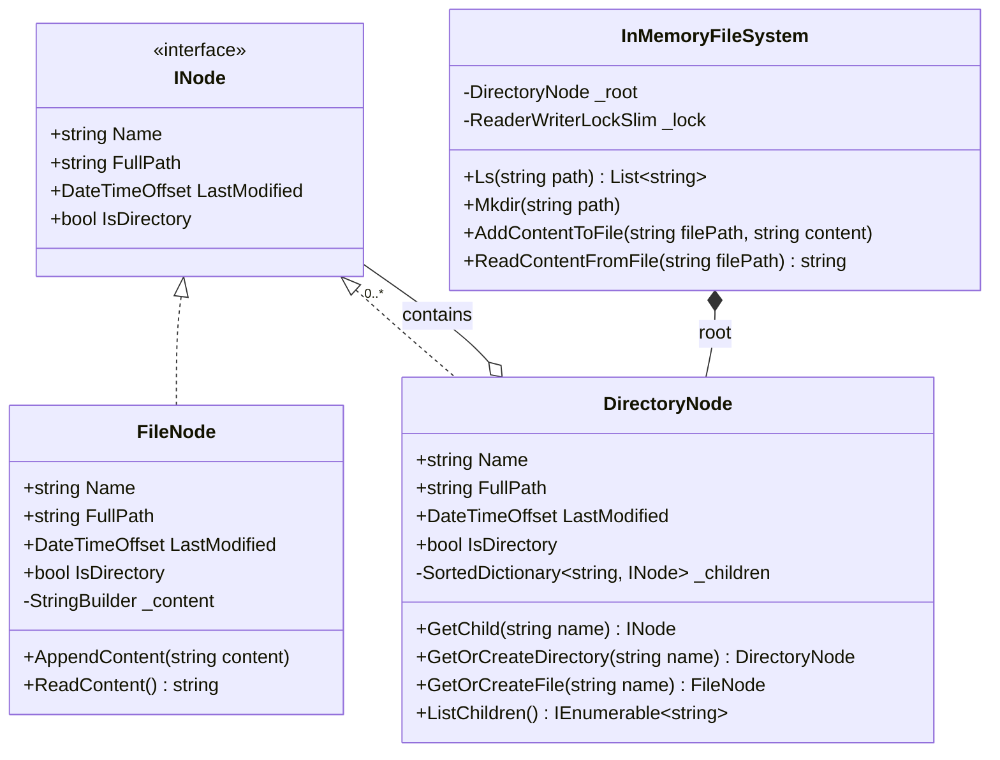

# 24. In-Memory File System (Composite Pattern + Trie)

## 📌 Context
The In-Memory File System (LeetCode 588 & 1166) is an all-time classic interview challenge at **Amazon, Google, Apple, and Uber**. It evaluates your ability to apply the **Composite Pattern** to hierarchical tree structures, handle complex path parsing (`/a/b/c`), and optimize for **multi-reader single-writer concurrency** using `ReaderWriterLockSlim`.

---

## 🏗️ 1. Architecture & The Composite Pattern

A file system is the quintessential example of the **Composite Pattern**:
* **Component (`INode`)**: Common interface for both files and directories.
* **Leaf (`FileNode`)**: Holds content (strings/bytes). Cannot have children.
* **Composite (`DirectoryNode`)**: Holds child `INode` objects (subdirectories and files).



---

## 💻 2. Domain Entities (The Composite Structure)

```csharp
using System.Text;

public interface INode
{
    string Name { get; }
    string FullPath { get; }
    DateTimeOffset LastModified { get; }
    bool IsDirectory { get; }
}

public class FileNode : INode
{
    public string Name { get; }
    public string FullPath { get; }
    public DateTimeOffset LastModified { get; private set; }
    public bool IsDirectory => false;

    private readonly StringBuilder _content = new();

    public FileNode(string name, string fullPath)
    {
        Name = name;
        FullPath = fullPath;
        LastModified = DateTimeOffset.UtcNow;
    }

    public void AppendContent(string content)
    {
        _content.Append(content);
        LastModified = DateTimeOffset.UtcNow;
    }

    public string ReadContent() => _content.ToString();
}

public class DirectoryNode : INode
{
    public string Name { get; }
    public string FullPath { get; }
    public DateTimeOffset LastModified { get; private set; }
    public bool IsDirectory => true;

    // Lexicographical ordering built into SortedDictionary
    private readonly SortedDictionary<string, INode> _children = new();

    public DirectoryNode(string name, string fullPath)
    {
        Name = name;
        FullPath = fullPath;
        LastModified = DateTimeOffset.UtcNow;
    }

    public INode? GetChild(string name) => _children.GetValueOrDefault(name);

    public DirectoryNode GetOrCreateDirectory(string name)
    {
        if (_children.TryGetValue(name, out var existing))
        {
            if (existing is DirectoryNode dir) return dir;
            throw new InvalidOperationException($"Node '{name}' already exists as a file.");
        }

        string childPath = FullPath == "/" ? $"/{name}" : $"{FullPath}/{name}";
        var newDir = new DirectoryNode(name, childPath);
        _children[name] = newDir;
        LastModified = DateTimeOffset.UtcNow;
        return newDir;
    }

    public FileNode GetOrCreateFile(string name)
    {
        if (_children.TryGetValue(name, out var existing))
        {
            if (existing is FileNode file) return file;
            throw new InvalidOperationException($"Node '{name}' already exists as a directory.");
        }

        string childPath = FullPath == "/" ? $"/{name}" : $"{FullPath}/{name}";
        var newFile = new FileNode(name, childPath);
        _children[name] = newFile;
        LastModified = DateTimeOffset.UtcNow;
        return newFile;
    }

    public IEnumerable<string> ListChildren() => _children.Keys;
}
```

---

## ⚡ 3. The FileSystem Engine with `ReaderWriterLockSlim`

```csharp
public class InMemoryFileSystem
{
    private readonly DirectoryNode _root = new("/", "/");
    private readonly ReaderWriterLockSlim _rwLock = new();

    public List<string> Ls(string path)
    {
        _rwLock.EnterReadLock();
        try
        {
            var node = ResolveNode(path);
            if (node == null) throw new DirectoryNotFoundException($"Path '{path}' not found.");

            if (!node.IsDirectory)
            {
                // If path is a file, return only its file name
                return new List<string> { node.Name };
            }

            var dir = (DirectoryNode)node;
            return dir.ListChildren().ToList();
        }
        finally
        {
            _rwLock.ExitReadLock();
        }
    }

    public void Mkdir(string path)
    {
        _rwLock.EnterWriteLock();
        try
        {
            var segments = ParsePath(path);
            var curr = _root;

            foreach (var segment in segments)
            {
                curr = curr.GetOrCreateDirectory(segment);
            }
        }
        finally
        {
            _rwLock.ExitWriteLock();
        }
    }

    public void AddContentToFile(string filePath, string content)
    {
        _rwLock.EnterWriteLock();
        try
        {
            var segments = ParsePath(filePath);
            if (segments.Count == 0) throw new ArgumentException("Invalid file path.");

            string fileName = segments[^1];
            var curr = _root;

            // Traverse to parent directory
            for (int i = 0; i < segments.Count - 1; i++)
            {
                curr = curr.GetOrCreateDirectory(segments[i]);
            }

            var fileNode = curr.GetOrCreateFile(fileName);
            fileNode.AppendContent(content);
        }
        finally
        {
            _rwLock.ExitWriteLock();
        }
    }

    public string ReadContentFromFile(string filePath)
    {
        _rwLock.EnterReadLock();
        try
        {
            var node = ResolveNode(filePath);
            if (node == null) throw new FileNotFoundException($"File '{filePath}' not found.");
            if (node is not FileNode file) throw new InvalidOperationException($"Path '{filePath}' is a directory, not a file.");

            return file.ReadContent();
        }
        finally
        {
            _rwLock.ExitReadLock();
        }
    }

    private INode? ResolveNode(string path)
    {
        var segments = ParsePath(path);
        if (segments.Count == 0) return _root;

        INode curr = _root;
        foreach (var segment in segments)
        {
            if (curr is not DirectoryNode dir) return null;
            var child = dir.GetChild(segment);
            if (child == null) return null;
            curr = child;
        }

        return curr;
    }

    private static List<string> ParsePath(string path)
    {
        if (string.IsNullOrWhiteSpace(path)) return new List<string>();
        return path.Split('/', StringSplitOptions.RemoveEmptyEntries).ToList();
    }
}
```

---

## 🗣️ Interviewer Discussion & Tradeoffs

**Interviewer:** *"Why did you use `ReaderWriterLockSlim` instead of a standard `lock` statement?"*
**You:** "In real-world file systems (and in LeetCode 588), read operations (`Ls`, `ReadContentFromFile`) typically account for over 90% of all access. With a standard `lock`, concurrent reads would serialize and block each other unnecessarily. `ReaderWriterLockSlim` enables multiple concurrent threads to read files and list directories simultaneously, only acquiring an exclusive lock when modifying or creating nodes (`Mkdir`, `AddContentToFile`)."

**Interviewer:** *"How would you support Symbolic Links (symlinks)?"*
**You:** "We add a third class implementing `INode`: `SymlinkNode(string Name, string TargetPath)`. When resolving paths in `ResolveNode()`, if we hit a `SymlinkNode`, we redirect the traversal to the `TargetPath`. To prevent infinite loops caused by circular symlinks (`/a/link -> /b/link -> /a/link`), we maintain a `HashSet<string> visitedSymlinks` during traversal; if a symlink is visited twice, we throw a `SymlinkCycleException`."

**Interviewer:** *"What if file contents are gigabytes in size instead of small strings?"*
**You:** "Instead of `StringBuilder` which buffers the entire file in RAM as contiguous managed strings, `FileNode` would hold an in-memory block-indexed data structure (like an array of 4KB/64KB byte memory buffers or a memory-mapped temporary stream). `ReadContent` would return a `Stream` or `IAsyncEnumerable<ReadOnlyMemory<byte>>` rather than loading the whole payload into memory."

