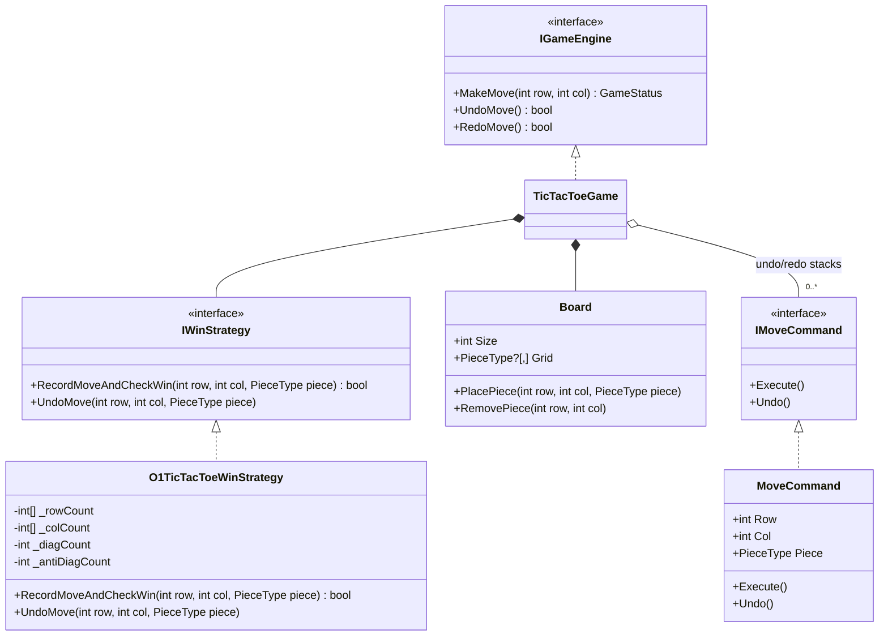
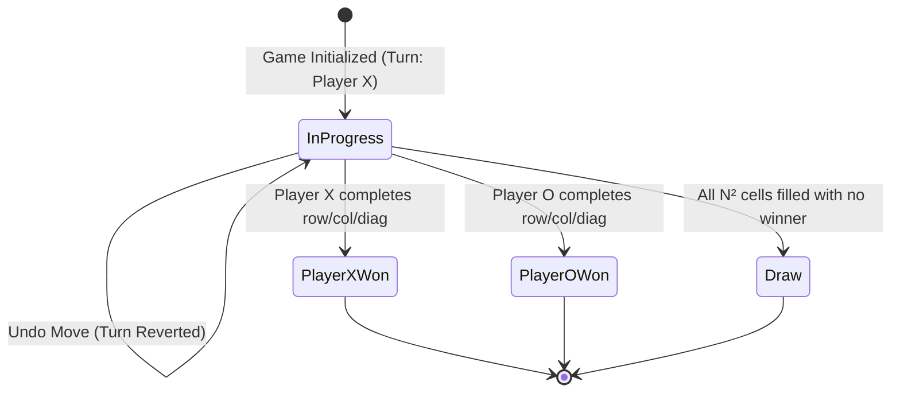

# 25. Extensible Board Game Engine (Tic-Tac-Toe & Chess Lite)

## 📌 Context
Board Game Engines (Tic-Tac-Toe $N \times N$, Chess Lite, Connect Four) are staple Object-Oriented Design (OOD) interview problems at **Amazon, Google, and Microsoft**. They test your ability to implement the **Command Pattern** (for Undo/Redo moves), the **Strategy Pattern** (for move validation and win conditions), and optimize performance to **$O(1)$ win checking** without scanning the board.

---

## 🏗️ 1. Architecture & The Core Patterns



---

## ⚡ 2. The $O(1)$ Win-Checking Strategy

Scanning an $N \times N$ board after every move takes $O(N)$ time (checking the entire row, column, and diagonals).
By tracking running integer scores (+1 for Player X, -1 for Player O), we check win conditions in **$O(1)$ time and $O(N)$ auxiliary space**:
* Row $i$ hits $+N$ or $-N \implies$ Win!
* Col $j$ hits $+N$ or $-N \implies$ Win!
* Diagonal (where $i == j$) hits $+N$ or $-N \implies$ Win!
* Anti-Diagonal (where $i + j == N - 1$) hits $+N$ or $-N \implies$ Win!

```csharp
public enum PieceType { X = 1, O = -1 }
public enum GameStatus { InProgress, PlayerXWon, PlayerOWon, Draw }

public interface IWinStrategy
{
    bool RecordMoveAndCheckWin(int row, int col, PieceType piece);
    void UndoMove(int row, int col, PieceType piece);
}

public class O1TicTacToeWinStrategy : IWinStrategy
{
    private readonly int _n;
    private readonly int[] _rows;
    private readonly int[] _cols;
    private int _diagonal;
    private int _antiDiagonal;

    public O1TicTacToeWinStrategy(int size)
    {
        _n = size;
        _rows = new int[size];
        _cols = new int[size];
    }

    public bool RecordMoveAndCheckWin(int row, int col, PieceType piece)
    {
        int val = (int)piece;

        _rows[row] += val;
        _cols[col] += val;

        if (row == col) _diagonal += val;
        if (row + col == _n - 1) _antiDiagonal += val;

        int target = val * _n;

        return _rows[row] == target ||
               _cols[col] == target ||
               _diagonal == target ||
               _antiDiagonal == target;
    }

    public void UndoMove(int row, int col, PieceType piece)
    {
        int val = (int)piece;

        _rows[row] -= val;
        _cols[col] -= val;

        if (row == col) _diagonal -= val;
        if (row + col == _n - 1) _antiDiagonal -= val;
    }
}
```

---

## 🎮 3. The Command Pattern (Move Execution with Undo/Redo)

```csharp
public interface IMoveCommand
{
    int Row { get; }
    int Col { get; }
    PieceType Piece { get; }
    void Execute();
    void Undo();
}

public class Board
{
    public int Size { get; }
    private readonly PieceType?[,] _grid;

    public Board(int size)
    {
        Size = size;
        _grid = new PieceType?[size, size];
    }

    public bool IsCellEmpty(int row, int col) => _grid[row, col] == null;

    public void PlacePiece(int row, int col, PieceType piece)
    {
        if (row < 0 || row >= Size || col < 0 || col >= Size)
            throw new ArgumentOutOfRangeException("Coordinates outside board boundaries.");
        if (_grid[row, col] != null)
            throw new InvalidOperationException("Cell is already occupied.");

        _grid[row, col] = piece;
    }

    public void RemovePiece(int row, int col)
    {
        _grid[row, col] = null;
    }
}

public class MoveCommand : IMoveCommand
{
    private readonly Board _board;
    private readonly IWinStrategy _winStrategy;

    public int Row { get; }
    public int Col { get; }
    public PieceType Piece { get; }

    public MoveCommand(Board board, IWinStrategy winStrategy, int row, int col, PieceType piece)
    {
        _board = board;
        _winStrategy = winStrategy;
        Row = row;
        Col = col;
        Piece = piece;
    }

    public void Execute()
    {
        _board.PlacePiece(Row, Col, Piece);
    }

    public void Undo()
    {
        _board.RemovePiece(Row, Col);
        _winStrategy.UndoMove(Row, Col, Piece);
    }
}
```

---

## 🧠 4. The Complete Game Engine

```csharp
public class TicTacToeGame
{
    private readonly Board _board;
    private readonly IWinStrategy _winStrategy;
    private readonly Stack<IMoveCommand> _undoStack = new();
    private readonly Stack<IMoveCommand> _redoStack = new();

    public PieceType CurrentTurn { get; private set; }
    public GameStatus Status { get; private set; }
    public int TotalMovesCount => _undoStack.Count;

    public TicTacToeGame(int size = 3)
    {
        _board = new Board(size);
        _winStrategy = new O1TicTacToeWinStrategy(size);
        CurrentTurn = PieceType.X;
        Status = GameStatus.InProgress;
    }

    public GameStatus MakeMove(int row, int col)
    {
        if (Status != GameStatus.InProgress)
            throw new InvalidOperationException("Game has already concluded.");

        if (!_board.IsCellEmpty(row, col))
            throw new InvalidOperationException($"Cell ({row}, {col}) is occupied.");

        var command = new MoveCommand(_board, _winStrategy, row, col, CurrentTurn);
        command.Execute();

        _undoStack.Push(command);
        _redoStack.Clear(); // Clear redo history on new move

        // Check Win Condition
        if (_winStrategy.RecordMoveAndCheckWin(row, col, CurrentTurn))
        {
            Status = CurrentTurn == PieceType.X ? GameStatus.PlayerXWon : GameStatus.PlayerOWon;
            return Status;
        }

        // Check Draw Condition
        if (_undoStack.Count == _board.Size * _board.Size)
        {
            Status = GameStatus.Draw;
            return Status;
        }

        // Switch Turn
        CurrentTurn = CurrentTurn == PieceType.X ? PieceType.O : PieceType.X;
        return Status;
    }

    public bool Undo()
    {
        if (_undoStack.Count == 0 || Status != GameStatus.InProgress)
            return false;

        var lastMove = _undoStack.Pop();
        lastMove.Undo();
        _redoStack.Push(lastMove);

        // Revert turn to the player who made the undone move
        CurrentTurn = lastMove.Piece;
        return true;
    }

    public bool Redo()
    {
        if (_redoStack.Count == 0 || Status != GameStatus.InProgress)
            return false;

        var move = _redoStack.Pop();
        MakeMove(move.Row, move.Col);
        return true;
    }
}
```

---

## 🔄 5. State Machine Diagram



---

## 🗣️ Interviewer Discussion & Tradeoffs

**Interviewer:** *"How does this design scale from Tic-Tac-Toe to a full Chess game?"*
**You:** "The architecture remains largely unchanged due to SOLID design:
1. **Piece Strategy**: Instead of just `PieceType.X` and `O`, we introduce `IPiece` with an `IsValidMove(Position from, Position to, Board board)` method. Pawns, Knights, and Bishops implement their own movement strategies.
2. **Move Command**: In Chess, a move can involve captures, en passant, castling, or pawn promotion. The `MoveCommand` encapsulates capturing an opponent piece on `Execute()` and restoring that piece to the board on `Undo()`.
3. **Turn & Check State**: The game state machine transitions to `Check` or `Checkmate` by querying a `CheckValidator` service that checks if the King's coordinate is targeted by any opposing piece's valid move vector."

**Interviewer:** *"Why did you use the Command Pattern instead of just saving snapshots of the board state in a stack?"*
**You:** "The **Memento / Snapshot pattern** clones the entire $N \times N$ board for every move, which consumes $O(M \times N^2)$ memory for $M$ moves. In contrast, the **Command pattern** stores only delta changes (`Row`, `Col`, `Piece`), which takes $O(1)$ memory per move. For large boards (e.g., $19 \times 19$ Go or Chess games with 100+ moves), the Command pattern is drastically more memory efficient."

**Interviewer:** *"How would you integrate an AI player (like Minimax) into this architecture?"*
**You:** "We create an `IPlayer` interface with `HumanPlayer` and `AiPlayer` implementations. `AiPlayer.GetNextMove(Board board)` runs the Minimax algorithm with Alpha-Beta pruning, utilizing the existing `MakeMove()` and `Undo()` capabilities on a cloned board state to simulate and score future decision trees without mutating the active game."

