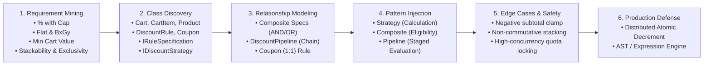
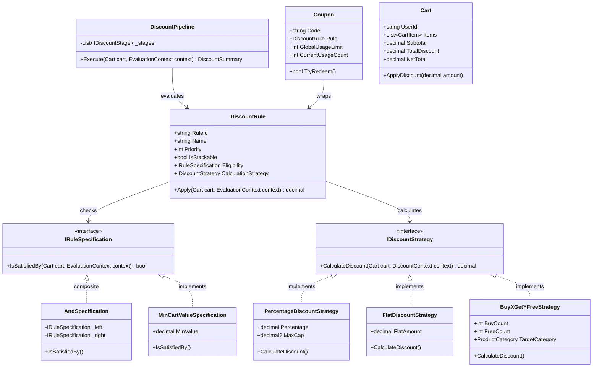

# LLD Problem #25: E-Commerce Coupon & Discount Rule Engine

**Tier:** 🟡 Tier 2 (Classic LLD — State & Strategy Mastery)  
**Problem Family:** 🟢 Family 2 — Strategy & Extensible Rules / 🟡 Family 3 — Stateful Workflow Engine  
**Primary Patterns:** Strategy Pattern, Composite Pattern (Rule Trees), Chain of Responsibility / Pipeline, Specification Pattern  
**Difficulty:** Hard (Flagship Machine Coding Round: 90 - 120 Mins)  
**Asked At:** Amazon, Flipkart, Swiggy, Razorpay, Zepto, Uber  

---

## 📌 Problem Context & Motivation

In global e-commerce and quick-commerce platforms (**Amazon, Flipkart, Swiggy, Zepto**), pricing and discount evaluation is one of the most critical and performance-sensitive microservices. The engine must satisfy complex business rules:
1. **Combinatorial Promo Rules**:
   - **Percentage Discount with Cap**: e.g., "50% off up to ₹150".
   - **Flat / Fixed Discount**: e.g., "Flat ₹100 off on cart value $\ge$ ₹500".
   - **Buy X Get Y Free (BxGy)**: e.g., "Buy 2 items in Clothing, get the cheapest 1 item free".
   - **Tiered / Slab Discount**: e.g., "₹1,000 $\rightarrow$ 10%, ₹2,500 $\rightarrow$ 20%".
2. **Dynamic Eligibility Predicates (Specification Pattern)**:
   - Minimum cart threshold, category-specific items, first-order / VIP customer check, time validity.
   - Rules can be dynamically combined with boolean algebra (`AND`, `OR`, `NOT`).
3. **Multi-Stage Evaluation Pipeline**:
   - Discounts must apply in strict determinism: *Item-Level Promos $\rightarrow$ Cart-Level Auto Promos $\rightarrow$ Coupon Codes $\rightarrow$ Payment Method Cashback*.
4. **Stackability & Mutual Exclusivity**:
   - Some coupons cannot be combined with sitewide sales; others permit stacking up to a maximum policy.
5. **Anti-Fraud & Zero-Loss Invariant**:
   - Total discounts can **never** exceed the cart subtotal (preventing negative totals).
   - Distributed race conditions must not allow 10,000 customers to redeem a 100-user flash voucher.

---

## 🎯 CrackingWalnuts 6-Step Methodology Applied



---

## 🏛️ Architecture & Core Design Patterns



---

## 💻 Production-Ready C# Implementation (.NET 8 / C# 12)

```csharp
using System;
using System.Collections.Concurrent;
using System.Collections.Generic;
using System.Linq;
using System.Threading;

namespace CouponEngine.Design;

// ============================================================================
// 1. DOMAIN MODELS & VALUE OBJECTS
// ============================================================================

public enum ProductCategory
{
    Electronics,
    Clothing,
    Groceries,
    Books,
    Beauty
}

public sealed record Product(string Id, string Name, ProductCategory Category, decimal Price);

public sealed class CartItem
{
    public Product Product { get; }
    public int Quantity { get; }
    public decimal UnitPrice => Product.Price;
    public decimal TotalPrice => UnitPrice * Quantity;
    public decimal DiscountApplied { get; private set; }
    public decimal FinalPrice => Math.Max(0, TotalPrice - DiscountApplied);

    public CartItem(Product product, int quantity)
    {
        if (quantity <= 0) throw new ArgumentException("Quantity must be positive.");
        Product = product ?? throw new ArgumentNullException(nameof(product));
        Quantity = quantity;
    }

    public void AllocateDiscount(decimal amount)
    {
        DiscountApplied += amount;
    }
}

public sealed class Cart
{
    public string CartId { get; }
    public string UserId { get; }
    public bool IsUserFirstOrder { get; }
    public bool IsUserPrimeMember { get; }
    private readonly List<CartItem> _items = new();
    private readonly List<AppliedDiscount> _appliedDiscounts = new();

    public IReadOnlyList<CartItem> Items => _items.AsReadOnly();
    public IReadOnlyList<AppliedDiscount> AppliedDiscounts => _appliedDiscounts.AsReadOnly();

    public decimal Subtotal => _items.Sum(i => i.TotalPrice);
    public decimal TotalDiscount => _appliedDiscounts.Sum(d => d.Amount);
    public decimal NetTotal => Math.Max(0, Subtotal - TotalDiscount);

    public Cart(string cartId, string userId, bool isFirstOrder = false, bool isPrime = false)
    {
        CartId = cartId;
        UserId = userId;
        IsUserFirstOrder = isFirstOrder;
        IsUserPrimeMember = isPrime;
    }

    public void AddItem(Product product, int quantity)
    {
        _items.Add(new CartItem(product, quantity));
    }

    public void AddAppliedDiscount(AppliedDiscount discount)
    {
        _appliedDiscounts.Add(discount);
    }
}

public sealed record AppliedDiscount(
    string RuleId,
    string Description,
    decimal Amount,
    bool IsCoupon
);

public sealed record EvaluationContext(
    DateTime Timestamp,
    string? CouponCode = null
);

// ============================================================================
// 2. SPECIFICATION PATTERN (Composite Rule Eligibility)
// ============================================================================

public interface IRuleSpecification
{
    bool IsSatisfiedBy(Cart cart, EvaluationContext context);
}

public sealed class MinCartValueSpecification : IRuleSpecification
{
    public decimal MinValue { get; }

    public MinCartValueSpecification(decimal minValue)
    {
        MinValue = minValue;
    }

    public bool IsSatisfiedBy(Cart cart, EvaluationContext context) => cart.Subtotal >= MinValue;
}

public sealed class CategoryItemCountSpecification : IRuleSpecification
{
    public ProductCategory Category { get; }
    public int MinRequiredItems { get; }

    public CategoryItemCountSpecification(ProductCategory category, int minRequiredItems)
    {
        Category = category;
        MinRequiredItems = minRequiredItems;
    }

    public bool IsSatisfiedBy(Cart cart, EvaluationContext context) =>
        cart.Items.Where(i => i.Product.Category == Category).Sum(i => i.Quantity) >= MinRequiredItems;
}

public sealed class FirstOrderOnlySpecification : IRuleSpecification
{
    public bool IsSatisfiedBy(Cart cart, EvaluationContext context) => cart.IsUserFirstOrder;
}

public sealed class PrimeMemberOnlySpecification : IRuleSpecification
{
    public bool IsSatisfiedBy(Cart cart, EvaluationContext context) => cart.IsUserPrimeMember;
}

// Composite Specifications: AND, OR, NOT
public sealed class AndSpecification : IRuleSpecification
{
    private readonly IRuleSpecification _left;
    private readonly IRuleSpecification _right;

    public AndSpecification(IRuleSpecification left, IRuleSpecification right)
    {
        _left = left;
        _right = right;
    }

    public bool IsSatisfiedBy(Cart cart, EvaluationContext context) =>
        _left.IsSatisfiedBy(cart, context) && _right.IsSatisfiedBy(cart, context);
}

public sealed class OrSpecification : IRuleSpecification
{
    private readonly IRuleSpecification _left;
    private readonly IRuleSpecification _right;

    public OrSpecification(IRuleSpecification left, IRuleSpecification right)
    {
        _left = left;
        _right = right;
    }

    public bool IsSatisfiedBy(Cart cart, EvaluationContext context) =>
        _left.IsSatisfiedBy(cart, context) || _right.IsSatisfiedBy(cart, context);
}

// ============================================================================
// 3. DISCOUNT CALCULATION STRATEGY (Strategy Pattern)
// ============================================================================

public interface IDiscountStrategy
{
    string StrategyName { get; }
    decimal CalculateDiscount(Cart cart, EvaluationContext context);
}

/// <summary>
/// Percentage discount with optional ceiling cap (e.g. 20% off up to ₹150)
/// </summary>
public sealed class PercentageDiscountStrategy : IDiscountStrategy
{
    public decimal Percentage { get; }
    public decimal? MaxCap { get; }
    public string StrategyName => $"{Percentage}% Discount (Cap: {(MaxCap.HasValue ? $"₹{MaxCap}" : "None")})";

    public PercentageDiscountStrategy(decimal percentage, decimal? maxCap = null)
    {
        if (percentage <= 0 || percentage > 100)
            throw new ArgumentOutOfRangeException(nameof(percentage), "Percentage must be between 1 and 100.");
        Percentage = percentage;
        MaxCap = maxCap;
    }

    public decimal CalculateDiscount(Cart cart, EvaluationContext context)
    {
        decimal rawDiscount = (cart.Subtotal - cart.TotalDiscount) * (Percentage / 100.0m);
        if (MaxCap.HasValue)
        {
            rawDiscount = Math.Min(rawDiscount, MaxCap.Value);
        }
        return Math.Round(rawDiscount, 2);
    }
}

/// <summary>
/// Flat fixed amount discount (e.g. ₹100 off)
/// </summary>
public sealed class FlatDiscountStrategy : IDiscountStrategy
{
    public decimal Amount { get; }
    public string StrategyName => $"Flat ₹{Amount} Off";

    public FlatDiscountStrategy(decimal amount)
    {
        if (amount <= 0) throw new ArgumentOutOfRangeException(nameof(amount), "Amount must be positive.");
        Amount = amount;
    }

    public decimal CalculateDiscount(Cart cart, EvaluationContext context)
    {
        decimal remainingPayable = cart.Subtotal - cart.TotalDiscount;
        return Math.Min(Amount, remainingPayable);
    }
}

/// <summary>
/// Buy X Get Y Free (BxGy) in a specific category: frees the cheapest Y items
/// </summary>
public sealed class BuyXGetYFreeStrategy : IDiscountStrategy
{
    public int BuyCount { get; }
    public int FreeCount { get; }
    public ProductCategory TargetCategory { get; }
    public string StrategyName => $"Buy {BuyCount} Get {FreeCount} Free on {TargetCategory}";

    public BuyXGetYFreeStrategy(int buyCount, int freeCount, ProductCategory targetCategory)
    {
        if (buyCount < 1 || freeCount < 1)
            throw new ArgumentException("Buy and Free counts must be at least 1.");
        BuyCount = buyCount;
        FreeCount = freeCount;
        TargetCategory = targetCategory;
    }

    public decimal CalculateDiscount(Cart cart, EvaluationContext context)
    {
        // Flatten matching items into individual units sorted ascending by price
        var categoryUnits = cart.Items
            .Where(i => i.Product.Category == TargetCategory)
            .SelectMany(i => Enumerable.Repeat(i.Product.Price, i.Quantity))
            .OrderBy(price => price)
            .ToList();

        int groupSize = BuyCount + FreeCount;
        int eligibleGroups = categoryUnits.Count / groupSize;

        if (eligibleGroups == 0) return 0.0m;

        // The cheapest 'eligibleGroups * FreeCount' items become free
        int itemsToDiscount = eligibleGroups * FreeCount;
        decimal totalFreeAmount = categoryUnits.Take(itemsToDiscount).Sum();

        return totalFreeAmount;
    }
}

// ============================================================================
// 4. DISCOUNT RULES & COUPON VALUE OBJECTS
// ============================================================================

public sealed class DiscountRule
{
    public string RuleId { get; }
    public string Name { get; }
    public int Priority { get; } // Lower number = higher priority
    public bool IsStackable { get; }
    public IRuleSpecification EligibilitySpec { get; }
    public IDiscountStrategy CalculationStrategy { get; }

    public DiscountRule(
        string ruleId,
        string name,
        int priority,
        bool isStackable,
        IRuleSpecification eligibilitySpec,
        IDiscountStrategy calculationStrategy)
    {
        RuleId = ruleId;
        Name = name;
        Priority = priority;
        IsStackable = isStackable;
        EligibilitySpec = eligibilitySpec;
        CalculationStrategy = calculationStrategy;
    }

    public bool IsEligible(Cart cart, EvaluationContext context) =>
        EligibilitySpec.IsSatisfiedBy(cart, context);

    public decimal Evaluate(Cart cart, EvaluationContext context) =>
        CalculationStrategy.CalculateDiscount(cart, context);
}

public sealed class Coupon
{
    public string Code { get; }
    public DiscountRule AssociatedRule { get; }
    public int MaxGlobalRedemptions { get; }
    public DateTime ExpiryDate { get; }

    private int _redemptionCounter;

    public int CurrentRedemptions => _redemptionCounter;
    public bool IsExpired(DateTime now) => now > ExpiryDate;

    public Coupon(string code, DiscountRule associatedRule, int maxGlobalRedemptions, DateTime expiryDate)
    {
        Code = code ?? throw new ArgumentNullException(nameof(code));
        AssociatedRule = associatedRule ?? throw new ArgumentNullException(nameof(associatedRule));
        MaxGlobalRedemptions = maxGlobalRedemptions;
        ExpiryDate = expiryDate;
    }

    /// <summary>
    /// Thread-safe atomic quota redemption
    /// </summary>
    public bool TryRedeem()
    {
        while (true)
        {
            int current = _redemptionCounter;
            if (current >= MaxGlobalRedemptions)
            {
                return false; // Quota exhausted
            }

            if (Interlocked.CompareExchange(ref _redemptionCounter, current + 1, current) == current)
            {
                return true; // Successfully claimed
            }
        }
    }
}

// ============================================================================
// 5. DISCOUNT EVALUATION PIPELINE (Pipeline / Chain of Responsibility)
// ============================================================================

public interface IDiscountStage
{
    void Process(Cart cart, EvaluationContext context);
}

/// <summary>
/// Stage 1: Evaluates automatic sitewide and category promotions
/// </summary>
public sealed class AutoPromotionStage : IDiscountStage
{
    private readonly List<DiscountRule> _autoRules;

    public AutoPromotionStage(IEnumerable<DiscountRule> autoRules)
    {
        _autoRules = autoRules.OrderBy(r => r.Priority).ToList();
    }

    public void Process(Cart cart, EvaluationContext context)
    {
        foreach (var rule in _autoRules)
        {
            if (rule.IsEligible(cart, context))
            {
                decimal discount = rule.Evaluate(cart, context);
                if (discount > 0)
                {
                    // Clamp to remaining payable
                    decimal applicable = Math.Min(discount, cart.Subtotal - cart.TotalDiscount);
                    if (applicable > 0)
                    {
                        cart.AddAppliedDiscount(new AppliedDiscount(rule.RuleId, rule.Name, applicable, IsCoupon: false));
                    }
                }
            }
        }
    }
}

/// <summary>
/// Stage 2: Evaluates explicit Coupon Code entered by customer
/// Enforces: Exclusivity/Stackability, Expiry, Quotas, and Eligibility
/// </summary>
public sealed class CouponCodeStage : IDiscountStage
{
    private readonly ConcurrentDictionary<string, Coupon> _couponRepository;

    public CouponCodeStage(IEnumerable<Coupon> coupons)
    {
        _couponRepository = new ConcurrentDictionary<string, Coupon>(
            coupons.ToDictionary(c => c.Code, StringComparer.OrdinalIgnoreCase));
    }

    public void Process(Cart cart, EvaluationContext context)
    {
        if (string.IsNullOrWhiteSpace(context.CouponCode)) return;

        if (!_couponRepository.TryGetValue(context.CouponCode, out var coupon))
        {
            Console.WriteLine($"⚠️ Coupon '{context.CouponCode}' does not exist.");
            return;
        }

        if (coupon.IsExpired(context.Timestamp))
        {
            Console.WriteLine($"⚠️ Coupon '{coupon.Code}' has expired on {coupon.ExpiryDate:yyyy-MM-dd}.");
            return;
        }

        // Mutual exclusivity check: If cart already has promotions and coupon is non-stackable
        if (!coupon.AssociatedRule.IsStackable && cart.AppliedDiscounts.Count > 0)
        {
            Console.WriteLine($"⚠️ Coupon '{coupon.Code}' cannot be stacked with existing cart promotions.");
            return;
        }

        // Check rule eligibility
        if (!coupon.AssociatedRule.IsEligible(cart, context))
        {
            Console.WriteLine($"⚠️ Cart does not meet eligibility requirements for coupon '{coupon.Code}'.");
            return;
        }

        // Thread-safe quota redemption
        if (!coupon.TryRedeem())
        {
            Console.WriteLine($"⚠️ Coupon '{coupon.Code}' has reached its global redemption quota!");
            return;
        }

        decimal discount = coupon.AssociatedRule.Evaluate(cart, context);
        decimal maxApplicable = Math.Min(discount, cart.Subtotal - cart.TotalDiscount);

        if (maxApplicable > 0)
        {
            cart.AddAppliedDiscount(new AppliedDiscount(
                coupon.AssociatedRule.RuleId,
                $"{coupon.Code} - {coupon.AssociatedRule.Name}",
                maxApplicable,
                IsCoupon: true));
        }
    }
}

public sealed class DiscountEngine
{
    private readonly List<IDiscountStage> _stages = new();

    public void AddStage(IDiscountStage stage)
    {
        _stages.Add(stage);
    }

    public void EvaluateCart(Cart cart, EvaluationContext context)
    {
        foreach (var stage in _stages)
        {
            stage.Process(cart, context);
        }
    }
}

// ============================================================================
// 6. VERIFICATION DRIVER & REAL-WORLD SCENARIOS (Program.cs)
// ============================================================================

public static class Program
{
    public static void Main()
    {
        Console.WriteLine("==========================================================");
        Console.WriteLine("🏷️ E-COMMERCE COUPON & DISCOUNT RULE ENGINE (.NET 8)");
        Console.WriteLine("==========================================================\n");

        // Catalog setup
        var pMacbook = new Product("SKU-1", "MacBook Pro M3", ProductCategory.Electronics, 150000m);
        var pAirPods = new Product("SKU-2", "AirPods Pro", ProductCategory.Electronics, 20000m);
        var pTShirt1 = new Product("SKU-3", "Polo T-Shirt Blue", ProductCategory.Clothing, 1200m);
        var pTShirt2 = new Product("SKU-4", "Linen Shirt White", ProductCategory.Clothing, 1800m);
        var pJeans = new Product("SKU-5", "Denim Slim Jeans", ProductCategory.Clothing, 2500m);
        var pCoffee = new Product("SKU-6", "Arabica Coffee Beans", ProductCategory.Groceries, 600m);

        // Rule 1: Buy 2 Get 1 Free on Clothing (BxGy Strategy)
        var bxgyRule = new DiscountRule(
            "RULE_BXGY_CLOTHING",
            "Buy 2 Get 1 Free on Clothing",
            priority: 1,
            isStackable: true,
            eligibilitySpec: new CategoryItemCountSpecification(ProductCategory.Clothing, minRequiredItems: 3),
            calculationStrategy: new BuyXGetYFreeStrategy(buyCount: 2, freeCount: 1, ProductCategory.Clothing)
        );

        // Rule 2: Automatic Flat ₹500 off on Cart Subtotal >= ₹50,000
        var autoHighValueRule = new DiscountRule(
            "RULE_AUTO_HIGH_VAL",
            "Flat ₹500 Mega Cart Bonus",
            priority: 2,
            isStackable: true,
            eligibilitySpec: new MinCartValueSpecification(50000m),
            calculationStrategy: new FlatDiscountStrategy(500m)
        );

        // Coupons:
        // Coupon A: "WELCOME50" - 50% off up to ₹150 for first time users
        var welcomeRule = new DiscountRule(
            "RULE_WELCOME50",
            "50% off up to ₹150 for New Users",
            priority: 3,
            isStackable: true,
            eligibilitySpec: new AndSpecification(new FirstOrderOnlySpecification(), new MinCartValueSpecification(300m)),
            calculationStrategy: new PercentageDiscountStrategy(50m, maxCap: 150m)
        );
        var couponWelcome = new Coupon("WELCOME50", welcomeRule, maxGlobalRedemptions: 100, DateTime.UtcNow.AddDays(30));

        // Coupon B: "BIGSALE20" - 20% off up to ₹5,000 (Non-stackable exclusive coupon!)
        var exclusiveRule = new DiscountRule(
            "RULE_BIGSALE20",
            "20% off Super Sale (Non-stackable)",
            priority: 3,
            isStackable: false, // Mutually exclusive
            eligibilitySpec: new MinCartValueSpecification(1000m),
            calculationStrategy: new PercentageDiscountStrategy(20m, maxCap: 5000m)
        );
        var couponBigSale = new Coupon("BIGSALE20", exclusiveRule, maxGlobalRedemptions: 2, DateTime.UtcNow.AddDays(5));

        // Initialize Engine & Pipeline
        var engine = new DiscountEngine();
        engine.AddStage(new AutoPromotionStage(new[] { bxgyRule, autoHighValueRule }));
        engine.AddStage(new CouponCodeStage(new[] { couponWelcome, couponBigSale }));

        // --------------------------------------------------------------------
        // Scenario 1: Buy 2 Get 1 Free on Clothing + First Order Coupon WELCOME50
        // --------------------------------------------------------------------
        Console.WriteLine("--- 🛍️ Scenario 1: Buy 2 Get 1 Free on Clothing + Coupon 'WELCOME50' ---");
        var cart1 = new Cart("CART-001", "User-Alice", isFirstOrder: true);
        cart1.AddItem(pTShirt1, 1); // ₹1,200 (cheapest -> free!)
        cart1.AddItem(pTShirt2, 1); // ₹1,800
        cart1.AddItem(pJeans, 1);   // ₹2,500
        cart1.AddItem(pCoffee, 1);  // ₹600

        var context1 = new EvaluationContext(DateTime.UtcNow, CouponCode: "WELCOME50");
        engine.EvaluateCart(cart1, context1);
        PrintCartReceipt(cart1);

        // --------------------------------------------------------------------
        // Scenario 2: Non-Stackable Exclusive Coupon Attempt
        // --------------------------------------------------------------------
        Console.WriteLine("--- 🛍️ Scenario 2: Trying Non-Stackable 'BIGSALE20' with existing promo ---");
        var cart2 = new Cart("CART-002", "User-Bob", isFirstOrder: false);
        cart2.AddItem(pTShirt1, 1);
        cart2.AddItem(pTShirt2, 1);
        cart2.AddItem(pJeans, 1); // triggers BxGy auto promotion

        var context2 = new EvaluationContext(DateTime.UtcNow, CouponCode: "BIGSALE20");
        engine.EvaluateCart(cart2, context2);
        PrintCartReceipt(cart2);

        // --------------------------------------------------------------------
        // Scenario 3: High-Value Cart (Electronics + Auto Flat ₹500)
        // --------------------------------------------------------------------
        Console.WriteLine("--- 🛍️ Scenario 3: High-Value Electronics (Flat ₹500 Auto Discount) ---");
        var cart3 = new Cart("CART-003", "User-Charlie", isFirstOrder: false);
        cart3.AddItem(pMacbook, 1); // ₹150,000

        var context3 = new EvaluationContext(DateTime.UtcNow);
        engine.EvaluateCart(cart3, context3);
        PrintCartReceipt(cart3);

        // --------------------------------------------------------------------
        // Scenario 4: Concurrency Stress Test on Coupon Redemptions
        // --------------------------------------------------------------------
        Console.WriteLine("--- ⚡ Scenario 4: Concurrency Stress Test on Coupon Quota (Quota = 2) ---");
        int successCount = 0;
        int rejectCount = 0;

        Parallel.For(0, 10, i =>
        {
            if (couponBigSale.TryRedeem())
            {
                Interlocked.Increment(ref successCount);
            }
            else
            {
                Interlocked.Increment(ref rejectCount);
            }
        });

        Console.WriteLine($"Concurrency Race Results: {successCount} Redeemed, {rejectCount} Rejected. (Max Quota: {couponBigSale.MaxGlobalRedemptions})");
    }

    private static void PrintCartReceipt(Cart cart)
    {
        Console.WriteLine($"Subtotal:       ₹{cart.Subtotal:N2}");
        foreach (var d in cart.AppliedDiscounts)
        {
            Console.WriteLine($"  - [{(d.IsCoupon ? "COUPON" : "AUTO")}] {d.Description}: -₹{d.Amount:N2}");
        }
        Console.WriteLine($"Total Discount: ₹{cart.TotalDiscount:N2}");
        Console.WriteLine($"Net Payable:    ₹{cart.NetTotal:N2}\n");
    }
}
```

---

## 🗣️ Senior Interviewer Discussion & Trade-offs (Staff Level)

| Question / Follow-up | Senior / Staff Engineering Defense |
| :--- | :--- |
| **"Discounts are non-commutative: $100\text{ flat} \rightarrow 20\%$ off gives a different total than $20\% \rightarrow 100\text{ flat}$. How do you resolve this?"** | In production e-commerce (e.g. Amazon), discount order is strictly governed by **Business Priority Pipelines**. The industry standard precedence is: <br>1. **Item / SKU-Level manufacturer discounts** (reduces item base price).<br>2. **Category Bundle Promos** (e.g. BxGy).<br>3. **Cart-Level Percentage Coupons** (computed on current subtotal).<br>4. **Flat / Bank Payment Cashback** (applied last to remaining balance).<br>This deterministic pipeline prevents calculation ambiguities and ensures customer fairness. |
| **"How do you prevent flash-sale coupon overselling across 50 container replicas?"** | In-memory `Interlocked.CompareExchange` only works on a single server node. In distributed architectures, we use **Redis atomic decrements (`DECRBY`)** or a **Lua script**: <br>```lua if redis.call('get', KEYS[1]) > 0 then return redis.call('decr', KEYS[1]) else return -1 end```.<br>Once the cart transaction is committed in Postgres, a background worker confirms the claim; if the checkout is abandoned within 15 minutes, the reservation is rolled back (`INCRBY`). |
| **"How do you ensure discounts never cause a negative total or exploit round-trip refunds?"** | Every calculation stage executes an invariant clamp: `Math.Min(discount, remainingPayable)`. Furthermore, during returns/refunds, the refund engine tracks the **net discounted price actually paid per SKU** (`CartItem.FinalPrice`) rather than the original MSRP, preventing customers from refunding a free BxGy item for full retail price. |
| **"Why not use an external rules engine like Drools or JSON-Rules-Engine?"** | Heavy rule engines introduce high GC pressure, reflection overhead, and unpredictable latency spikes during Diwali flash sales. Top-tier tech companies (Swiggy, Amazon) compile promotional rules into an **in-memory Abstract Syntax Tree (AST)** or native C# expression trees (`System.Linq.Expressions`) compiled to dynamic delegates, achieving microsecond-level execution with zero external I/O. |
| **"How do you support complex user segmentation (e.g. User has spent > ₹10,000 in past 30 days)?"** | The `EvaluationContext` is enriched with a `UserProfileSnapshot` fetched from an edge cache (Aerospike/Redis) before entering the pipeline. The `IRuleSpecification` inspects these pre-calculated features rather than issuing live SQL queries inside the discount loop. |
