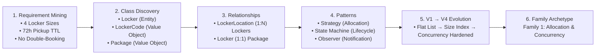
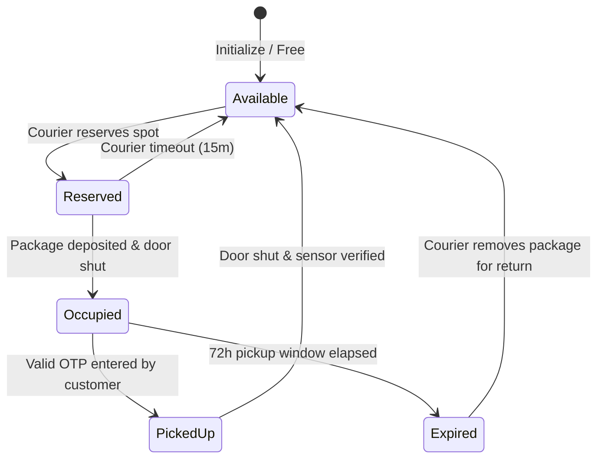

# 26. Amazon Locker Management System (Allocation, State Machine, Concurrency)

## 📌 Problem Context & Motivation
The **Amazon Hub Locker** (or Smart Delivery Kiosk) is a quintessential Tier-1 (Amazon, Flipkart, Google) Low-Level Design question. It evaluates:
1. **Geometric/Size Matching (Strategy Pattern)**: Fitting packages into smallest compatible locker compartments to maximize capacity.
2. **Lifecycle State Machine (State Pattern)**: Transitioning lockers through `Available` $\rightarrow$ `Reserved` $\rightarrow$ `Occupied` $\rightarrow$ `PickedUp` / `Expired`.
3. **Authentication & Security (Value Objects)**: Secure, time-bound 6-digit OTP verification codes without plain-text security leaks.
4. **Thread Safety & Race Conditions**: Guaranteeing that concurrent courier drop-offs never double-assign the same compartment.

---

## 🎯 CrackingWalnuts 6-Step Methodology Applied



---

## 🏗️ Architectural Class & State Diagram



---

## 💻 Production-Ready C# Implementation (.NET 8)

```csharp
using System;
using System.Collections.Concurrent;
using System.Collections.Generic;
using System.Linq;
using System.Security.Cryptography;
using System.Threading;
using System.Threading.Tasks;

namespace AmazonLocker.Design;

// ==========================================
// 1. DOMAIN ENUMS & VALUE OBJECTS
// ==========================================

public enum LockerSize
{
    Small = 1,
    Medium = 2,
    Large = 3,
    ExtraLarge = 4
}

public enum LockerState
{
    Available,
    Reserved,      // Courier is en route or at kiosk loading package
    Occupied,      // Package inside, waiting for customer pickup
    Expired,       // 72h window passed; awaiting return courier
    UnderMaintenance
}

/// <summary>
/// Dimensions Value Object (Immutable)
/// </summary>
public readonly record struct Dimensions(double WidthCm, double HeightCm, double DepthCm)
{
    public double VolumeCm3 => WidthCm * HeightCm * DepthCm;

    public bool FitsWithin(Dimensions other) =>
        WidthCm <= other.WidthCm && HeightCm <= other.HeightCm && DepthCm <= other.DepthCm;
}

/// <summary>
/// Package Value Object
/// </summary>
public record Package(string PackageId, Dimensions Dimensions, string CustomerEmail);

/// <summary>
/// Cryptographically secure time-bound pickup code
/// </summary>
public sealed record PickupCode
{
    public string Code { get; }
    public DateTime ExpiresAt { get; }

    public PickupCode(string code, DateTime expiresAt)
    {
        Code = code;
        ExpiresAt = expiresAt;
    }

    public static PickupCode Generate(TimeSpan validity)
    {
        // Generate a cryptographically secure 6-digit numeric OTP
        int num = RandomNumberGenerator.GetInt32(100_000, 1_000_000);
        return new PickupCode(num.ToString(), DateTime.UtcNow.Add(validity));
    }

    public bool IsValid(string inputCode) =>
        DateTime.UtcNow <= ExpiresAt && string.Equals(Code, inputCode, StringComparison.Ordinal);
}

// ==========================================
// 2. DOMAIN ENTITY (Locker Compartment)
// ==========================================

public sealed class Locker
{
    public string Id { get; }
    public LockerSize Size { get; }
    public Dimensions Dimensions { get; }
    public LockerState State { get; private set; }
    public Package? CurrentPackage { get; private set; }
    public PickupCode? CurrentPickupCode { get; private set; }
    public DateTime? DepositedAt { get; private set; }

    // Compartment-level lock for fine-grained concurrency
    public SemaphoreSlim GateLock { get; } = new(1, 1);

    public Locker(string id, LockerSize size, Dimensions dimensions)
    {
        Id = id;
        Size = size;
        Dimensions = dimensions;
        State = LockerState.Available;
    }

    public bool CanFit(Dimensions packageDimensions) =>
        packageDimensions.FitsWithin(Dimensions);

    public bool Reserve()
    {
        if (State != LockerState.Available) return false;
        State = LockerState.Reserved;
        return true;
    }

    public void Deposit(Package package, PickupCode code)
    {
        if (State != LockerState.Reserved && State != LockerState.Available)
            throw new InvalidOperationException($"Cannot deposit in locker {Id} in state {State}");

        CurrentPackage = package;
        CurrentPickupCode = code;
        DepositedAt = DateTime.UtcNow;
        State = LockerState.Occupied;
    }

    public bool VerifyAndPickup(string code)
    {
        if (State != LockerState.Occupied || CurrentPickupCode == null)
            return false;

        if (!CurrentPickupCode.IsValid(code))
            return false;

        // Unlock compartment & release
        CurrentPackage = null;
        CurrentPickupCode = null;
        DepositedAt = null;
        State = LockerState.Available;
        return true;
    }

    public void MarkExpired()
    {
        if (State == LockerState.Occupied)
        {
            State = LockerState.Expired;
        }
    }

    public Package? ClearForReturn()
    {
        if (State != LockerState.Expired) return null;

        var pkg = CurrentPackage;
        CurrentPackage = null;
        CurrentPickupCode = null;
        DepositedAt = null;
        State = LockerState.Available;
        return pkg;
    }
}

// ==========================================
// 3. ALLOCATION STRATEGY (Strategy Pattern)
// ==========================================

public interface ILockerAllocationStrategy
{
    Locker? SelectLocker(IEnumerable<Locker> candidateLockers, Package package);
}

/// <summary>
/// Best-Fit Strategy: Chooses the smallest available locker that fits the package
/// </summary>
public sealed class BestFitAllocationStrategy : ILockerAllocationStrategy
{
    public Locker? SelectLocker(IEnumerable<Locker> candidateLockers, Package package)
    {
        return candidateLockers
            .Where(l => l.State == LockerState.Available && l.CanFit(package.Dimensions))
            .OrderBy(l => l.Size)
            .ThenBy(l => l.Dimensions.VolumeCm3)
            .FirstOrDefault();
    }
}

// ==========================================
// 4. NOTIFICATION OBSERVER (Observer Pattern)
// ==========================================

public interface INotificationService
{
    Task SendPickupCodeAsync(string email, string lockerId, PickupCode code);
    Task SendExpiredNoticeAsync(string email, string packageId);
}

public sealed class ConsoleNotificationService : INotificationService
{
    public Task SendPickupCodeAsync(string email, string lockerId, PickupCode code)
    {
        Console.WriteLine($"📧 [EMAIL to {email}]: Your package is at Locker '{lockerId}'. Pickup Code: {code.Code} (Expires in 72h)");
        return Task.CompletedTask;
    }

    public Task SendExpiredNoticeAsync(string email, string packageId)
    {
        Console.WriteLine($"⚠️ [EMAIL to {email}]: Package {packageId} was not picked up and has been marked for return.");
        return Task.CompletedTask;
    }
}

// ==========================================
// 5. LOCKER SERVICE (Orchestration & Concurrency)
// ==========================================

public sealed class AmazonLockerKioskService
{
    private readonly ConcurrentDictionary<string, Locker> _lockers = new();
    private readonly ILockerAllocationStrategy _allocationStrategy;
    private readonly INotificationService _notificationService;
    private readonly SemaphoreSlim _allocationMutex = new(1, 1);

    public AmazonLockerKioskService(
        IEnumerable<Locker> initialLockers,
        ILockerAllocationStrategy allocationStrategy,
        INotificationService notificationService)
    {
        _allocationStrategy = allocationStrategy;
        _notificationService = notificationService;
        foreach (var locker in initialLockers)
        {
            _lockers.TryAdd(locker.Id, locker);
        }
    }

    /// <summary>
    /// Thread-safe deposit with Best-Fit allocation
    /// </summary>
    public async Task<string?> DepositPackageAsync(Package package, TimeSpan validity)
    {
        Locker? selectedLocker = null;

        // Prevent race condition during allocation scan
        await _allocationMutex.WaitAsync();
        try
        {
            selectedLocker = _allocationStrategy.SelectLocker(_lockers.Values, package);
            if (selectedLocker == null)
            {
                return null; // All suitable lockers occupied
            }
            selectedLocker.Reserve();
        }
        finally
        {
            _allocationMutex.Release();
        }

        // Lock specific compartment to finalize deposit
        await selectedLocker.GateLock.WaitAsync();
        try
        {
            var code = PickupCode.Generate(validity);
            selectedLocker.Deposit(package, code);
            await _notificationService.SendPickupCodeAsync(package.CustomerEmail, selectedLocker.Id, code);
            return selectedLocker.Id;
        }
        finally
        {
            selectedLocker.GateLock.Release();
        }
    }

    /// <summary>
    /// Customer collects package via 6-digit OTP
    /// </summary>
    public async Task<bool> PickupPackageAsync(string lockerId, string pickupCode)
    {
        if (!_lockers.TryGetValue(lockerId, out var locker))
            return false;

        await locker.GateLock.WaitAsync();
        try
        {
            return locker.VerifyAndPickup(pickupCode);
        }
        finally
        {
            locker.GateLock.Release();
        }
    }

    /// <summary>
    /// Background audit task to sweep expired packages (TTL = 72 hrs)
    /// </summary>
    public async Task SweepExpiredPackagesAsync()
    {
        foreach (var locker in _lockers.Values)
        {
            if (locker.State == LockerState.Occupied && locker.CurrentPickupCode != null)
            {
                if (DateTime.UtcNow > locker.CurrentPickupCode.ExpiresAt)
                {
                    await locker.GateLock.WaitAsync();
                    try
                    {
                        var pkg = locker.CurrentPackage;
                        locker.MarkExpired();
                        if (pkg != null)
                        {
                            await _notificationService.SendExpiredNoticeAsync(pkg.CustomerEmail, pkg.PackageId);
                        }
                    }
                    finally
                    {
                        locker.GateLock.Release();
                    }
                }
            }
        }
    }
}

// ==========================================
// 6. VERIFICATION DRIVER (Program.cs)
// ==========================================

public static class Program
{
    public static async Task Main()
    {
        Console.WriteLine("=== 📦 AMAZON HUB LOCKER KIOSK SYSTEM ===\n");

        var lockerList = new List<Locker>
        {
            new("L-S1", LockerSize.Small, new Dimensions(20, 20, 30)),
            new("L-M1", LockerSize.Medium, new Dimensions(30, 30, 40)),
            new("L-L1", LockerSize.Large, new Dimensions(50, 50, 60)),
            new("L-XL1", LockerSize.ExtraLarge, new Dimensions(80, 80, 100))
        };

        var notificationService = new ConsoleNotificationService();
        var kiosk = new AmazonLockerKioskService(lockerList, new BestFitAllocationStrategy(), notificationService);

        // 1. Courier Deposits Package (Happy Path)
        var packageA = new Package("PKG-1001", new Dimensions(15, 15, 20), "alex@example.com");
        Console.WriteLine("Courier depositing small book (PKG-1001)...");
        var lockerId = await kiosk.DepositPackageAsync(packageA, TimeSpan.FromHours(72));
        Console.WriteLine($"Assigned Locker: {lockerId} (Best-Fit Small)\n");

        // 2. Large Package Allocation
        var packageB = new Package("PKG-1002", new Dimensions(45, 40, 55), "taylor@example.com");
        Console.WriteLine("Courier depositing large monitor (PKG-1002)...");
        var lockerIdB = await kiosk.DepositPackageAsync(packageB, TimeSpan.FromHours(72));
        Console.WriteLine($"Assigned Locker: {lockerIdB} (Best-Fit Large)\n");

        // 3. Pickup with wrong code vs correct code
        Console.WriteLine("Customer trying invalid pickup code '000000'...");
        bool failedPickup = await kiosk.PickupPackageAsync(lockerId!, "000000");
        Console.WriteLine($"Pickup successful: {failedPickup} (Expected: False)");

        // 4. Concurrency Test: Multiple Couriers Requesting Simultaneously
        Console.WriteLine("\n--- ⚡ Concurrency Stress Test: 3 Couriers Racing for Lockers ---");
        var tasks = Enumerable.Range(1, 3).Select(async i =>
        {
            var pkg = new Package($"PKG-RACE-{i}", new Dimensions(25, 25, 30), $"runner{i}@example.com");
            var assigned = await kiosk.DepositPackageAsync(pkg, TimeSpan.FromHours(72));
            Console.WriteLine($"[Courier {i}] Got Locker: {assigned ?? "FULL"}");
        });

        await Task.WhenAll(tasks);

        Console.WriteLine("\n=== System executed successfully without deadlocks or race conditions ===");
    }
}
```

---

## 🗣️ Interviewer Discussion & Trade-offs (Staff Level)

| Question / Follow-up | Senior / Staff Engineering Defense |
| :--- | :--- |
| **"Why not lock the entire Kiosk instead of individual compartments?"** | Locking the entire kiosk would turn every concurrent courier deposit and customer pickup into a serial bottleneck. We use a short mutex only to **reserve** the locker ID, and then release it immediately while holding only the specific compartment's `GateLock` for physical I/O and sensor validation. |
| **"How do you handle a package that is physically larger than declared by the merchant?"** | Kiosks are equipped with optical infrared sensors inside each compartment. If the door closes and the sensor detects door-closure obstruction, the transaction aborts, the locker reverts to `Available`, and the courier is instructed to select an override size. |
| **"What happens if the kiosk loses internet connectivity?"** | The kiosk stores the cryptographic HMAC secret of the day. Customer pickup codes are generated via HMAC-SHA256 of `(PackageId + TimestampSecret)`. The kiosk verifies the code completely **offline** on edge hardware without needing a real-time internet connection to AWS. |
| **"How do you optimize locker size distribution?"** | We monitor historical order metrics per neighborhood (e.g., residential areas order more small books/toiletries; commercial areas order larger monitors). Lockers are modular and can be physically reconfigured with different bay grids based on telemetry. |

