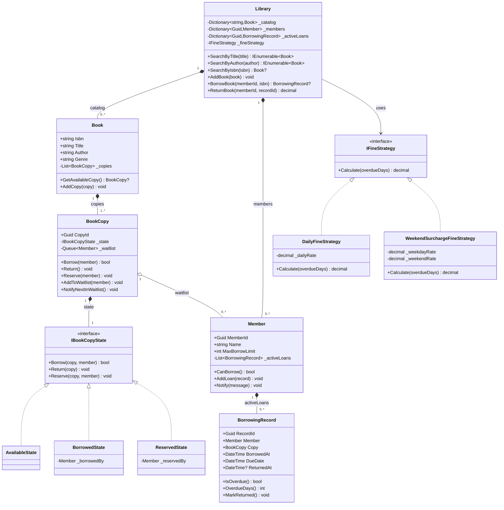

# LLD Problem #27: Library Management System

**Tier:** 🟡 Tier 2 (Classic LLD — State & Strategy Mastery)
**Problem Family:** 🟡 Family 3 — Stateful Workflow Engine / 🔴 Family 1 — Allocation & Concurrency
**Primary Patterns:** Strategy, Observer, State, Factory
**Difficulty:** Intermediate
**Asked At:** Amazon, Flipkart, Walmart Labs, Atlassian, ServiceNow

---

## 🧩 Problem Statement

Design a Library Management System that allows members to search the catalog, borrow and return books, pay fines for overdue returns, and reserve books that are currently checked out.

### Requirements
1. The library maintains a catalog of books (physical copies + metadata).
2. Each book can have **multiple physical copies** with individual availability status.
3. A member can borrow up to a **maximum limit** of books simultaneously.
4. Overdue books incur a **daily fine** calculated by a pluggable strategy (simple daily rate, weekend surcharge, etc.).
5. If a book is unavailable, a member can join a **reservation waitlist**; they are notified when a copy becomes available.
6. The system must support **concurrent borrow/return** operations without double-issuing the same physical copy.

---

## 🏛️ Architecture

Key design pressures:
1. **Fine calculation varies** → Strategy Pattern (`IFineStrategy`)
2. **Waitlist notification** → Observer Pattern (member = subscriber, `BookCopy` = subject)
3. **Book copy transitions** through `Available → Borrowed → Reserved → Available` → State Pattern (`IBookCopyState`)
4. **Catalog search by multiple dimensions** (Title, Author, ISBN) → Inverted Dictionary indexing

---

## 🗺️ UML Class Diagram



---

## 💻 C# Implementation

```csharp
// ─────────────────────────────────────────────────────────────
// 1. FINE STRATEGY (STRATEGY PATTERN)
// ─────────────────────────────────────────────────────────────
public interface IFineStrategy
{
    decimal Calculate(int overdueDays);
}

public sealed class DailyFineStrategy : IFineStrategy
{
    private readonly decimal _dailyRate;
    public DailyFineStrategy(decimal dailyRate = 0.50m) => _dailyRate = dailyRate;
    public decimal Calculate(int overdueDays) => Math.Max(0, overdueDays) * _dailyRate;
}

public sealed class WeekendSurchargeFineStrategy : IFineStrategy
{
    private readonly decimal _weekdayRate;
    private readonly decimal _weekendRate;

    public WeekendSurchargeFineStrategy(decimal weekdayRate = 0.50m, decimal weekendRate = 1.00m)
    {
        _weekdayRate = weekdayRate;
        _weekendRate = weekendRate;
    }

    public decimal Calculate(int overdueDays)
    {
        if (overdueDays <= 0) return 0m;
        int weekendDays = (int)Math.Round(overdueDays * 2.0 / 7.0);
        int weekdays = overdueDays - weekendDays;
        return (weekdays * _weekdayRate) + (weekendDays * _weekendRate);
    }
}

// ─────────────────────────────────────────────────────────────
// 2. DOMAIN MODELS & ENTITIES
// ─────────────────────────────────────────────────────────────
public sealed class BorrowingRecord
{
    public Guid RecordId { get; } = Guid.NewGuid();
    public Member Member { get; }
    public BookCopy Copy { get; }
    public DateTime BorrowedAt { get; } = DateTime.UtcNow;
    public DateTime DueDate { get; }
    public DateTime? ReturnedAt { get; private set; }

    public BorrowingRecord(Member member, BookCopy copy, int loanDays = 14)
    {
        Member = member;
        Copy = copy;
        DueDate = BorrowedAt.AddDays(loanDays);
    }

    public bool IsOverdue() => ReturnedAt == null && DateTime.UtcNow > DueDate;

    public int OverdueDays() =>
        ReturnedAt == null
            ? Math.Max(0, (int)(DateTime.UtcNow - DueDate).TotalDays)
            : Math.Max(0, (int)(ReturnedAt.Value - DueDate).TotalDays);

    public void MarkReturned() => ReturnedAt = DateTime.UtcNow;
}

public sealed class Member
{
    private readonly List<BorrowingRecord> _activeLoans = new();
    private readonly object _loanLock = new();

    public Guid MemberId { get; } = Guid.NewGuid();
    public string Name { get; }
    public int MaxBorrowLimit { get; }
    public IReadOnlyCollection<BorrowingRecord> ActiveLoans => _activeLoans.AsReadOnly();

    public Member(string name, int maxBorrowLimit = 5)
    {
        Name = name;
        MaxBorrowLimit = maxBorrowLimit;
    }

    public bool CanBorrow()
    {
        lock (_loanLock)
            return _activeLoans.Count(r => r.ReturnedAt == null) < MaxBorrowLimit;
    }

    public void AddLoan(BorrowingRecord record)
    {
        lock (_loanLock)
            _activeLoans.Add(record);
    }

    public void Notify(string message)
        => Console.WriteLine($"[Notification -> {Name}] {message}");
}

// ─────────────────────────────────────────────────────────────
// 3. BOOK COPY STATE PATTERN
// ─────────────────────────────────────────────────────────────
public interface IBookCopyState
{
    bool Borrow(BookCopy copy, Member member);
    void Return(BookCopy copy);
    void Reserve(BookCopy copy, Member member);
}

public sealed class AvailableState : IBookCopyState
{
    public bool Borrow(BookCopy copy, Member member)
    {
        Console.WriteLine($"[Library] Copy {copy.CopyId} borrowed by {member.Name}.");
        copy.TransitionTo(new BorrowedState(member));
        return true;
    }

    public void Return(BookCopy copy)
        => Console.WriteLine("[Library] Copy is already available -- no-op.");

    public void Reserve(BookCopy copy, Member member)
    {
        Console.WriteLine($"[Library] Copy {copy.CopyId} reserved for {member.Name}.");
        copy.TransitionTo(new ReservedState(member));
    }
}

public sealed class BorrowedState : IBookCopyState
{
    private readonly Member _borrowedBy;
    public BorrowedState(Member borrowedBy) => _borrowedBy = borrowedBy;

    public bool Borrow(BookCopy copy, Member member)
    {
        Console.WriteLine($"[Library] Copy {copy.CopyId} is already borrowed. Adding {member.Name} to waitlist.");
        copy.AddToWaitlist(member);
        return false;
    }

    public void Return(BookCopy copy)
    {
        Console.WriteLine($"[Library] Copy {copy.CopyId} returned by {_borrowedBy.Name}.");
        copy.NotifyNextInWaitlist();
    }

    public void Reserve(BookCopy copy, Member member)
    {
        Console.WriteLine($"[Library] Copy {copy.CopyId} borrowed. Enqueuing {member.Name} in waitlist.");
        copy.AddToWaitlist(member);
    }
}

public sealed class ReservedState : IBookCopyState
{
    private readonly Member _reservedBy;
    public ReservedState(Member reservedBy) => _reservedBy = reservedBy;

    public bool Borrow(BookCopy copy, Member member)
    {
        if (member.MemberId == _reservedBy.MemberId)
        {
            Console.WriteLine($"[Library] Reserved copy {copy.CopyId} collected by {member.Name}.");
            copy.TransitionTo(new BorrowedState(member));
            return true;
        }
        Console.WriteLine($"[Library] Copy {copy.CopyId} is reserved for another member. Waitlisting {member.Name}.");
        copy.AddToWaitlist(member);
        return false;
    }

    public void Return(BookCopy copy)
        => Console.WriteLine("[Library] Reserved copy cannot be returned without being active loan.");

    public void Reserve(BookCopy copy, Member member)
    {
        Console.WriteLine($"[Library] Copy {copy.CopyId} already reserved. Adding {member.Name} to waitlist.");
        copy.AddToWaitlist(member);
    }
}

// ─────────────────────────────────────────────────────────────
// 4. BOOK COPY & BOOK AGGREGATE
// ─────────────────────────────────────────────────────────────
public sealed class BookCopy
{
    private IBookCopyState _state;
    private readonly Queue<Member> _waitlist = new();
    private readonly object _stateLock = new();

    public Guid CopyId { get; } = Guid.NewGuid();
    public bool IsAvailable => _state is AvailableState;

    public BookCopy() => _state = new AvailableState();

    public bool Borrow(Member member)
    {
        lock (_stateLock)
            return _state.Borrow(this, member);
    }

    public void Return()
    {
        lock (_stateLock)
            _state.Return(this);
    }

    public void Reserve(Member member)
    {
        lock (_stateLock)
            _state.Reserve(this, member);
    }

    internal void TransitionTo(IBookCopyState newState) => _state = newState;
    internal void AddToWaitlist(Member member) => _waitlist.Enqueue(member);

    internal void NotifyNextInWaitlist()
    {
        if (_waitlist.TryDequeue(out var nextMember))
        {
            nextMember.Notify($"The reserved copy {CopyId} is now ready for pick up.");
            TransitionTo(new ReservedState(nextMember));
        }
        else
        {
            TransitionTo(new AvailableState());
        }
    }
}

public sealed class Book
{
    private readonly List<BookCopy> _copies = new();

    public string Isbn { get; }
    public string Title { get; }
    public string Author { get; }
    public string Genre { get; }
    public IReadOnlyCollection<BookCopy> Copies => _copies.AsReadOnly();

    public Book(string isbn, string title, string author, string genre)
    {
        Isbn = isbn;
        Title = title;
        Author = author;
        Genre = genre;
    }

    public void AddCopy(BookCopy copy) => _copies.Add(copy);
    public BookCopy? GetAvailableCopy() => _copies.FirstOrDefault(c => c.IsAvailable);
}

// ─────────────────────────────────────────────────────────────
// 5. LIBRARY FACADE / ORCHESTRATOR
// ─────────────────────────────────────────────────────────────
public sealed class Library
{
    private readonly Dictionary<string, Book> _catalog = new();
    private readonly Dictionary<Guid, Member> _members = new();
    private readonly Dictionary<Guid, BorrowingRecord> _activeLoans = new();
    private readonly IFineStrategy _fineStrategy;
    private readonly object _borrowLock = new();

    public Library(IFineStrategy fineStrategy)
    {
        _fineStrategy = fineStrategy ?? throw new ArgumentNullException(nameof(fineStrategy));
    }

    public void AddBook(Book book) => _catalog[book.Isbn] = book;
    public void RegisterMember(Member member) => _members[member.MemberId] = member;

    public IEnumerable<Book> SearchByTitle(string title)
        => _catalog.Values.Where(b => b.Title.Contains(title, StringComparison.OrdinalIgnoreCase));

    public IEnumerable<Book> SearchByAuthor(string author)
        => _catalog.Values.Where(b => b.Author.Contains(author, StringComparison.OrdinalIgnoreCase));

    public Book? SearchByIsbn(string isbn)
        => _catalog.TryGetValue(isbn, out var book) ? book : null;

    public BorrowingRecord? BorrowBook(Guid memberId, string isbn)
    {
        lock (_borrowLock)
        {
            if (!_members.TryGetValue(memberId, out var member))
                throw new InvalidOperationException($"Member {memberId} not registered.");

            if (!member.CanBorrow())
            {
                Console.WriteLine($"[Library] {member.Name} has reached their borrowing limit ({member.MaxBorrowLimit}).");
                return null;
            }

            if (!_catalog.TryGetValue(isbn, out var book))
                throw new InvalidOperationException($"Book with ISBN {isbn} not found in catalog.");

            var copy = book.GetAvailableCopy();
            if (copy == null)
            {
                Console.WriteLine($"[Library] No copies of "{book.Title}" available. Adding to waitlist.");
                book.Copies.FirstOrDefault()?.Reserve(member);
                return null;
            }

            if (!copy.Borrow(member)) return null;

            var record = new BorrowingRecord(member, copy);
            member.AddLoan(record);
            _activeLoans[record.RecordId] = record;

            Console.WriteLine($"[Library] OK "{book.Title}" issued to {member.Name}. Due date: {record.DueDate:yyyy-MM-dd}.");
            return record;
        }
    }

    public decimal ReturnBook(Guid memberId, Guid recordId)
    {
        lock (_borrowLock)
        {
            if (!_activeLoans.TryGetValue(recordId, out var record))
                throw new InvalidOperationException($"Active loan record {recordId} not found.");

            if (record.Member.MemberId != memberId)
                throw new InvalidOperationException("Security mismatch: loan belongs to a different member.");

            record.MarkReturned();
            record.Copy.Return();

            decimal fine = 0m;
            if (record.IsOverdue())
            {
                fine = _fineStrategy.Calculate(record.OverdueDays());
                Console.WriteLine($"[Library] Overdue: book is overdue by {record.OverdueDays()} day(s). Fine: {fine:C2}.");
            }

            Console.WriteLine($"[Library] OK Copy {record.Copy.CopyId} returned successfully.");
            return fine;
        }
    }
}
```

---

## 🎯 The 4-Stage Evolution (V1 → V4)

| Version | Feature Added | Architectural Change |
|---|---|---|
| **V1** | Single book copy, no fines | Simple `bool IsAvailable` boolean field |
| **V2** | Multiple physical copies & pluggable fines | Strategy Pattern for `IFineStrategy`, `Book` aggregate owning `BookCopy[]` |
| **V3** | Waitlist queue & notifications | Observer pattern (waitlist queue + `Member.Notify`), State Pattern on `BookCopy` |
| **V4** | Multi-branch distributed library | `IBranchService` abstraction, Redis distributed locking on copy checkout |

---

## 🗣️ Interviewer Discussion & Tradeoffs

### Q: How does the waitlist ensure fairness (FIFO)?
> **A:** "`BookCopy._waitlist` is a `Queue<Member>` — strictly FIFO. When a copy is returned, `NotifyNextInWaitlist()` dequeues the first waiting member and transitions the copy to `ReservedState` for them. This prevents starvation."

### Q: What prevents two concurrent threads from issuing the same physical copy?
> **A:** "`BookCopy.Borrow()` is guarded by a `lock (_stateLock)`. Only one thread can evaluate `_state.Borrow()` at a time. The `AvailableState.Borrow()` immediately transitions the state to `BorrowedState` inside the lock, so a second concurrent call sees `BorrowedState` and goes to the waitlist."

### Q: How would you handle digital (unlimited copies) vs physical (limited copies)?
> **A:** "Introduce an `IBookCopyStrategy` or simply derive `DigitalBookCopy` from `BookCopy` where `Borrow()` always succeeds (no state machine needed — infinite availability). The `Library.BorrowBook()` first checks for physical, then falls back to digital."

### Q: How would you scale this to millions of catalog searches?
> **A:** "Invert the index: maintain hash maps `_titleIndex: Dictionary<string, HashSet<string>>` where title words point to ISBN sets. For fuzzy searches, integrate Lucene.NET / Elasticsearch. Keep reads separate from writes via CQRS."

### Design Pattern Callouts
- **Strategy:** `IFineStrategy` — easily swap daily vs tiered weekend fine calculations without touching `Library`.
- **Observer:** `BookCopy.NotifyNextInWaitlist()` → `Member.Notify()` — decoupled member notification.
- **State:** `IBookCopyState` (`AvailableState`, `BorrowedState`, `ReservedState`) — enforces valid transition rules.
- **Facade:** `Library` simplifies interactions across Books, Copies, Members, and Loans.

---

*Cross-references: [Amazon Locker System](./26_Amazon_Locker_System.md) · [Notification System](../01_Tier1_Highest_Priority/08_Notification_System.md) · [awesome-lld Library](https://github.com/ashishps1/awesome-low-level-design/blob/main/problems/library-management-system.md)*
