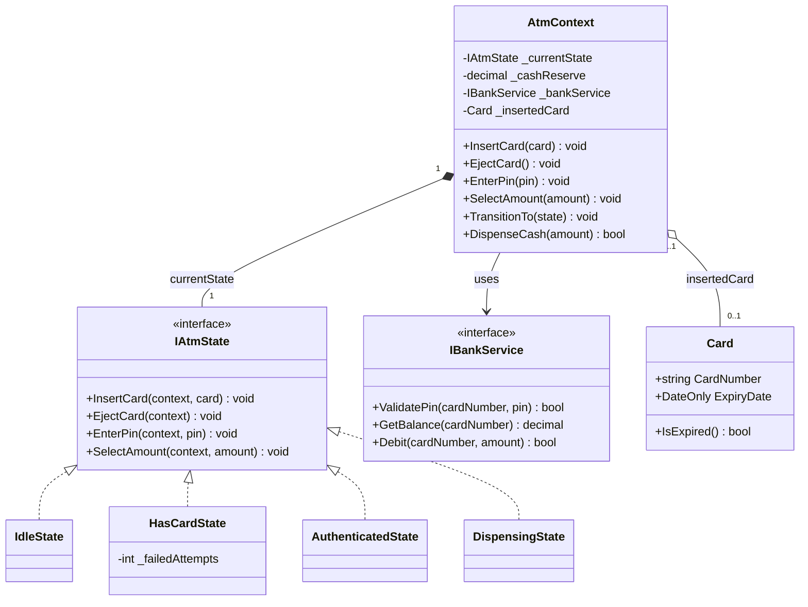

# LLD Problem #28: ATM System

**Tier:** 🟡 Tier 2 (Classic LLD — State & Strategy Mastery)
**Problem Family:** 🟡 Family 3 — Stateful Workflow Engine
**Primary Patterns:** State, Command, Strategy
**Difficulty:** Intermediate
**Asked At:** Amazon, Goldman Sachs, Barclays, Deutsche Bank, Visa

---

## 🧩 Problem Statement

Design an ATM (Automated Teller Machine) system that handles card insertion, PIN authentication, balance enquiry, cash withdrawal, and card ejection. The ATM must enforce strict state-based rules — a user cannot withdraw money before inserting a card, and cannot insert a card while one is already in the slot.

### Requirements
1. An ATM has a finite cash reserve that depletes with each withdrawal.
2. The ATM supports multiple operations: check balance, withdraw, deposit, and change PIN.
3. Each operation is only valid in specific states (Idle, HasCard, Authenticated, Dispensing).
4. Invalid operations in the current state must be rejected gracefully.
5. Multiple ATMs may share the same bank account data (thread-safe balance reads/writes).
6. The system must handle concurrent withdrawal requests without double-spending.

---

## 🏛️ Architecture: Why State Pattern?

Without State Pattern, every method becomes a nested `if (status == X)` bomb:

```csharp
// ❌ ANTI-PATTERN: Switch/If chaos grows with every new state
public void WithdrawCash(decimal amount)
{
    if (_status == "Idle") throw new InvalidOperationException("Insert card first.");
    else if (_status == "HasCard") throw new InvalidOperationException("Enter PIN first.");
    else if (_status == "Authenticated")
    {
        if (_cashReserve < amount) throw new InvalidOperationException("Insufficient ATM cash.");
        _status = "Idle";
    }
}
```

With State Pattern, **each state class knows its own valid transitions**:

```
[Idle] ──InsertCard──► [HasCard] ──EnterPin──► [Authenticated] ──Withdraw──► [Dispensing] ──Complete──► [Idle]
           ◄─EjectCard──                 ◄─WrongPin/EjectCard──            ◄─Cancel──
```

---

## 🗺️ UML Class Diagram



---

## 💻 C# Implementation

```csharp
// ─────────────────────────────────────────────────────────────
// DOMAIN MODELS
// ─────────────────────────────────────────────────────────────
public record Card(string CardNumber, DateOnly ExpiryDate)
{
    public bool IsExpired() => ExpiryDate < DateOnly.FromDateTime(DateTime.Today);
}

// ─────────────────────────────────────────────────────────────
// STATE INTERFACE
// ─────────────────────────────────────────────────────────────
public interface IAtmState
{
    void InsertCard(AtmContext context, Card card);
    void EjectCard(AtmContext context);
    void EnterPin(AtmContext context, string pin);
    void SelectAmount(AtmContext context, decimal amount);
}

// ─────────────────────────────────────────────────────────────
// BANK SERVICE ABSTRACTION
// ─────────────────────────────────────────────────────────────
public interface IBankService
{
    bool ValidatePin(string cardNumber, string pin);
    decimal GetBalance(string cardNumber);
    bool Debit(string cardNumber, decimal amount);
}

// ─────────────────────────────────────────────────────────────
// ATM CONTEXT — State machine host
// ─────────────────────────────────────────────────────────────
public sealed class AtmContext
{
    private IAtmState _currentState;
    private readonly IBankService _bankService;
    private readonly object _cashLock = new();
    private decimal _cashReserve;
    private Card? _insertedCard;

    public Card? InsertedCard => _insertedCard;
    public decimal CashReserve => _cashReserve;

    public AtmContext(decimal initialCashReserve, IBankService bankService)
    {
        _cashReserve = initialCashReserve;
        _bankService = bankService ?? throw new ArgumentNullException(nameof(bankService));
        _currentState = new IdleState();
        Console.WriteLine("[ATM] Initialised. Ready to serve.");
    }

    public void InsertCard(Card card) => _currentState.InsertCard(this, card);
    public void EjectCard() => _currentState.EjectCard(this);
    public void EnterPin(string pin) => _currentState.EnterPin(this, pin);
    public void SelectAmount(decimal amount) => _currentState.SelectAmount(this, amount);

    internal void SetCard(Card? card) => _insertedCard = card;
    internal void TransitionTo(IAtmState newState)
    {
        Console.WriteLine($"[ATM] {_currentState.GetType().Name} -> {newState.GetType().Name}");
        _currentState = newState;
    }

    internal bool ValidatePin(string pin)
        => _bankService.ValidatePin(_insertedCard!.CardNumber, pin);

    internal bool DispenseCash(decimal amount)
    {
        lock (_cashLock) // Thread-safe: physical cash reserve is shared across sessions
        {
            if (_cashReserve < amount)
            {
                Console.WriteLine($"[ATM] Insufficient cash in ATM (reserve: {_cashReserve:C2}).");
                return false;
            }
            if (!_bankService.Debit(_insertedCard!.CardNumber, amount))
            {
                Console.WriteLine("[ATM] Bank declined: insufficient account balance.");
                return false;
            }
            _cashReserve -= amount;
            Console.WriteLine($"[ATM] OK Dispensing {amount:C2}. Reserve remaining: {_cashReserve:C2}.");
            return true;
        }
    }
}

// ─────────────────────────────────────────────────────────────
// CONCRETE STATES
// ─────────────────────────────────────────────────────────────
public sealed class IdleState : IAtmState
{
    public void InsertCard(AtmContext context, Card card)
    {
        if (card.IsExpired()) { Console.WriteLine("[ATM] Card is expired."); return; }
        context.SetCard(card);
        Console.WriteLine($"[ATM] Card {card.CardNumber} inserted.");
        context.TransitionTo(new HasCardState());
    }
    public void EjectCard(AtmContext context) => Console.WriteLine("[ATM] No card inserted.");
    public void EnterPin(AtmContext context, string pin) => Console.WriteLine("[ATM] Insert card first.");
    public void SelectAmount(AtmContext context, decimal amount) => Console.WriteLine("[ATM] Insert card first.");
}

public sealed class HasCardState : IAtmState
{
    private int _failedAttempts;
    private const int MaxAttempts = 3;

    public void InsertCard(AtmContext context, Card card) => Console.WriteLine("[ATM] Card already inserted.");
    public void EjectCard(AtmContext context)
    {
        context.SetCard(null);
        Console.WriteLine("[ATM] Card ejected.");
        context.TransitionTo(new IdleState());
    }
    public void EnterPin(AtmContext context, string pin)
    {
        if (context.ValidatePin(pin))
        {
            Console.WriteLine("[ATM] PIN verified.");
            context.TransitionTo(new AuthenticatedState());
        }
        else
        {
            _failedAttempts++;
            int remaining = MaxAttempts - _failedAttempts;
            if (remaining > 0)
                Console.WriteLine($"[ATM] Incorrect PIN. {remaining} attempt(s) remaining.");
            else
            {
                Console.WriteLine("[ATM] Too many failed attempts. Card retained.");
                context.SetCard(null);
                context.TransitionTo(new IdleState());
            }
        }
    }
    public void SelectAmount(AtmContext context, decimal amount) => Console.WriteLine("[ATM] Enter PIN first.");
}

public sealed class AuthenticatedState : IAtmState
{
    public void InsertCard(AtmContext context, Card card) => Console.WriteLine("[ATM] Session in progress.");
    public void EjectCard(AtmContext context)
    {
        context.SetCard(null);
        Console.WriteLine("[ATM] Session cancelled. Card ejected.");
        context.TransitionTo(new IdleState());
    }
    public void EnterPin(AtmContext context, string pin) => Console.WriteLine("[ATM] Already authenticated.");
    public void SelectAmount(AtmContext context, decimal amount)
    {
        if (amount <= 0) { Console.WriteLine("[ATM] Amount must be positive."); return; }
        Console.WriteLine($"[ATM] Processing withdrawal of {amount:C2}...");
        context.TransitionTo(new DispensingState());
        context.DispenseCash(amount);
        context.SetCard(null);
        Console.WriteLine("[ATM] Card ejected. Thank you.");
        context.TransitionTo(new IdleState());
    }
}

public sealed class DispensingState : IAtmState
{
    public void InsertCard(AtmContext ctx, Card c) => Console.WriteLine("[ATM] Dispensing in progress.");
    public void EjectCard(AtmContext ctx) => Console.WriteLine("[ATM] Dispensing in progress.");
    public void EnterPin(AtmContext ctx, string pin) => Console.WriteLine("[ATM] Dispensing in progress.");
    public void SelectAmount(AtmContext ctx, decimal amt) => Console.WriteLine("[ATM] Dispensing in progress.");
}
```

---

## 🎯 The 4-Stage Evolution (V1 → V4)

| Version | Feature Added | Architectural Change |
|---|---|---|
| **V1** | Withdraw only | `if/else` status checks — intentionally bad |
| **V2** | State Pattern | Separate state classes, valid transitions enforced |
| **V3** | Multi-ATM support | `IBankService` abstraction; `lock` on `_cashReserve` |
| **V4** | Audit Trail | `IAtmCommand` per transaction, stored for replay/dispute |

---

## 🗣️ Interviewer Discussion & Tradeoffs

### Q: Why use State Pattern here vs. a simple switch on an enum?
> **A:** "With State Pattern, each state class encapsulates which transitions are legal. Adding a new state (e.g., `MaintenanceState`) requires only a new class — no changes to existing states. With `switch`, every new state means modifying every existing method — violating OCP."

### Q: How do you prevent two simultaneous withdrawals from double-spending?
> **A:** "The physical cash reserve uses a `lock (_cashLock)`. The bank account balance requires a distributed lock or optimistic concurrency at the `IBankService` layer — e.g., EF Core row-version tokens or a Redis distributed lock."

### Q: How would you add a deposit operation?
> **A:** "Add `Deposit(amount)` to `IAtmState`. Only `AuthenticatedState` implements a meaningful deposit — all others return an error message. No changes to any other state class."

### Design Pattern Callouts
- **State:** Each `IAtmState` represents a lifecycle phase.
- **Command:** Each transaction can be an `IAtmCommand` for audit logging and undo.
- **Strategy:** `IBankService` is swappable — `MockBankService` in tests, real API in production.

---

*Cross-references: [Vending Machine](./12_Vending_Machine.md) · [Digital Wallet](../04_Tier4_Senior_Backend/22_Digital_Wallet_Ledger.md) · [awesome-lld ATM](https://github.com/ashishps1/awesome-low-level-design/blob/main/problems/atm.md)*
