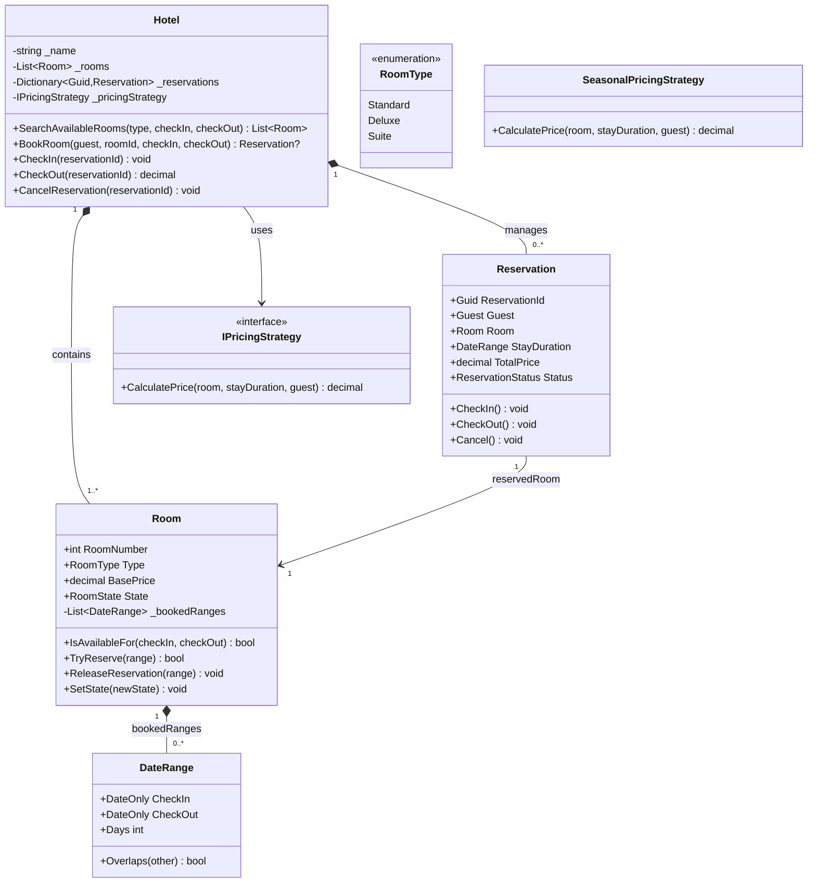

# LLD Problem #29: Hotel Management System

**Tier:** 🟡 Tier 2 (Classic LLD — State & Strategy Mastery)
**Problem Family:** 🔴 Family 1 — Allocation & Concurrency Conflicts / 🟡 Family 3 — Stateful Workflow Engine
**Primary Patterns:** Strategy, State, Factory, Observer
**Difficulty:** Intermediate
**Asked At:** OYO, MakeMyTrip, Booking.com, Airbnb, Expedia

---

## 🧩 Problem Statement

Design a Hotel Management System that manages multiple room types (Standard, Deluxe, Suite), handles guest reservations across date ranges, tracks room status (Available, Reserved, Occupied, Cleaning, OutOfService), and computes dynamic pricing (seasonal rates, weekend surcharges, loyalty discounts).

### Requirements
1. Hotel has multiple rooms across floors; each room has a type, price base, and current state.
2. Guests can search available rooms for a given check-in and check-out date range.
3. Concurrently booking the same room for overlapping dates must be prevented (thread-safe reservation lock).
4. Dynamic pricing: room cost varies based on date, season, and guest loyalty tier (Strategy Pattern).
5. Room lifecycle: `Available -> Reserved -> Occupied (Checked-in) -> Cleaning -> Available`. Housekeeping is notified when a room enters `Cleaning` (Observer Pattern).
6. Support cancellation with refund policies.

---

## 🏛️ Architecture

Key design pressures:
1. **Dynamic Room Pricing** → Strategy Pattern (`IPricingStrategy`)
2. **Room Status Lifecycle** → State Pattern (`IRoomState`)
3. **Overlapping Date Range Check** → DSA Interval Overlap (`[CheckIn, CheckOut)`)
4. **Housekeeping Alert** → Observer Pattern (`IHousekeepingNotifier`)

---

## 🗺️ UML Class Diagram



---

## 💻 C# Implementation

```csharp
// ─────────────────────────────────────────────────────────────
// ENUMS & VALUE OBJECTS
// ─────────────────────────────────────────────────────────────
public enum RoomType { Standard, Deluxe, Suite }
public enum RoomState { Available, Reserved, Occupied, Cleaning, OutOfService }
public enum ReservationStatus { Confirmed, CheckedIn, CheckedOut, Cancelled }

public readonly record struct DateRange(DateOnly CheckIn, DateOnly CheckOut)
{
    public int Days => CheckOut.DayNumber - CheckIn.DayNumber;

    public bool Overlaps(DateRange other)
        => CheckIn < other.CheckOut && other.CheckIn < CheckOut;
}

public record Guest(Guid Id, string Name, string Email, bool IsVip);

// ─────────────────────────────────────────────────────────────
// DYNAMIC PRICING STRATEGY (STRATEGY PATTERN)
// ─────────────────────────────────────────────────────────────
public interface IPricingStrategy
{
    decimal CalculatePrice(Room room, DateRange stay, Guest guest);
}

public sealed class SeasonalPricingStrategy : IPricingStrategy
{
    public decimal CalculatePrice(Room room, DateRange stay, Guest guest)
    {
        decimal multiplier = 1.0m;
        // Peak summer surcharge (June - August)
        if (stay.CheckIn.Month >= 6 && stay.CheckIn.Month <= 8)
            multiplier = 1.35m;

        decimal total = room.BasePrice * stay.Days * multiplier;

        // VIP loyalty discount
        if (guest.IsVip) total *= 0.85m; // 15% discount

        return Math.Round(total, 2);
    }
}

// ─────────────────────────────────────────────────────────────
// ROOM AGGREGATE
// ─────────────────────────────────────────────────────────────
public sealed class Room
{
    private readonly List<DateRange> _bookedRanges = new();
    private readonly object _lock = new();

    public int RoomNumber { get; }
    public RoomType Type { get; }
    public decimal BasePrice { get; }
    public RoomState State { get; private set; }

    public Room(int roomNumber, RoomType type, decimal basePrice)
    {
        RoomNumber = roomNumber;
        Type = type;
        BasePrice = basePrice;
        State = RoomState.Available;
    }

    public bool IsAvailableFor(DateRange range)
    {
        lock (_lock)
        {
            if (State == RoomState.OutOfService) return false;
            return !_bookedRanges.Any(b => b.Overlaps(range));
        }
    }

    public bool TryReserve(DateRange range)
    {
        lock (_lock)
        {
            if (!IsAvailableFor(range)) return false;
            _bookedRanges.Add(range);
            return true;
        }
    }

    public void ReleaseReservation(DateRange range)
    {
        lock (_lock)
        {
            _bookedRanges.Remove(range);
        }
    }

    public void SetState(RoomState newState)
    {
        lock (_lock)
        {
            Console.WriteLine($"[Room {RoomNumber}] Status: {State} -> {newState}");
            State = newState;
        }
    }
}

// ─────────────────────────────────────────────────────────────
// RESERVATION ENTITY
// ─────────────────────────────────────────────────────────────
public sealed class Reservation
{
    public Guid ReservationId { get; } = Guid.NewGuid();
    public Guest Guest { get; }
    public Room Room { get; }
    public DateRange StayDuration { get; }
    public decimal TotalPrice { get; }
    public ReservationStatus Status { get; private set; }

    public Reservation(Guest guest, Room room, DateRange stayDuration, decimal totalPrice)
    {
        Guest = guest;
        Room = room;
        StayDuration = stayDuration;
        TotalPrice = totalPrice;
        Status = ReservationStatus.Confirmed;
    }

    public void CheckIn()
    {
        if (Status != ReservationStatus.Confirmed)
            throw new InvalidOperationException($"Cannot check-in reservation with status {Status}.");
        Status = ReservationStatus.CheckedIn;
        Room.SetState(RoomState.Occupied);
    }

    public void CheckOut()
    {
        if (Status != ReservationStatus.CheckedIn)
            throw new InvalidOperationException("Cannot check-out a reservation not currently checked in.");
        Status = ReservationStatus.CheckedOut;
        Room.SetState(RoomState.Cleaning);
    }

    public void Cancel()
    {
        if (Status != ReservationStatus.Confirmed)
            throw new InvalidOperationException("Only confirmed reservations can be cancelled.");
        Status = ReservationStatus.Cancelled;
        Room.ReleaseReservation(StayDuration);
        Room.SetState(RoomState.Available);
    }
}

// ─────────────────────────────────────────────────────────────
// HOTEL ORCHESTRATOR / FACADE
// ─────────────────────────────────────────────────────────────
public sealed class Hotel
{
    private readonly List<Room> _rooms = new();
    private readonly Dictionary<Guid, Reservation> _reservations = new();
    private readonly IPricingStrategy _pricingStrategy;
    private readonly object _bookingLock = new();

    public string Name { get; }

    public Hotel(string name, IPricingStrategy pricingStrategy)
    {
        Name = name;
        _pricingStrategy = pricingStrategy ?? throw new ArgumentNullException(nameof(pricingStrategy));
    }

    public void AddRoom(Room room) => _rooms.Add(room);

    public List<Room> SearchAvailableRooms(RoomType type, DateOnly checkIn, DateOnly checkOut)
    {
        var range = new DateRange(checkIn, checkOut);
        return _rooms
            .Where(r => r.Type == type && r.IsAvailableFor(range))
            .ToList();
    }

    public Reservation? BookRoom(Guest guest, int roomNumber, DateOnly checkIn, DateOnly checkOut)
    {
        var range = new DateRange(checkIn, checkOut);
        if (range.Days <= 0)
            throw new ArgumentException("Check-out date must be strictly after check-in date.");

        var room = _rooms.FirstOrDefault(r => r.RoomNumber == roomNumber);
        if (room == null)
            throw new InvalidOperationException($"Room {roomNumber} does not exist.");

        if (!room.TryReserve(range))
        {
            Console.WriteLine($"[Hotel] Room {roomNumber} is unavailable for {checkIn} to {checkOut}.");
            return null;
        }

        decimal price = _pricingStrategy.CalculatePrice(room, range, guest);
        var reservation = new Reservation(guest, room, range, price);

        lock (_bookingLock)
        {
            _reservations[reservation.ReservationId] = reservation;
        }

        Console.WriteLine($"[Hotel] OK Reserved Room {roomNumber} for {guest.Name}. Total: {price:C2} ({range.Days} nights).");
        return reservation;
    }

    public void CheckIn(Guid reservationId)
    {
        lock (_bookingLock)
        {
            if (!_reservations.TryGetValue(reservationId, out var reservation))
                throw new KeyNotFoundException("Reservation not found.");
            reservation.CheckIn();
        }
    }

    public void CheckOut(Guid reservationId)
    {
        lock (_bookingLock)
        {
            if (!_reservations.TryGetValue(reservationId, out var reservation))
                throw new KeyNotFoundException("Reservation not found.");
            reservation.CheckOut();
        }
    }

    public void CancelReservation(Guid reservationId)
    {
        lock (_bookingLock)
        {
            if (!_reservations.TryGetValue(reservationId, out var reservation))
                throw new KeyNotFoundException("Reservation not found.");
            reservation.Cancel();
            Console.WriteLine($"[Hotel] Reservation {reservationId} cancelled. Refund processed.");
        }
    }
}
```

---

## 🎯 The 4-Stage Evolution (V1 → V4)

| Version | Feature Added | Architectural Change |
|---|---|---|
| **V1** | Single-day room booking | Fixed price, boolean `IsAvailable` |
| **V2** | Date ranges & Dynamic Pricing | `DateRange` interval collision detection + Strategy pattern |
| **V3** | Room lifecycle & Housekeeping | State machine (`Available -> Occupied -> Cleaning -> Available`) + Observer notification |
| **V4** | Distributed multi-hotel inventory | Distributed locking on `RoomId + DateRange` (Redis Redlock), CQRS for high-speed availability search |

---

## 🗣️ Interviewer Discussion & Tradeoffs

### Q: How do you prevent double-booking under high concurrent traffic?
> **A:** "`Room.TryReserve()` synchronises on an internal `lock (_lock)`. Inside the critical section, it checks `!_bookedRanges.Any(b => b.Overlaps(range))` and atomically appends to `_bookedRanges`. In a distributed database, this maps to an SQL interval exclusion constraint (`EXCLUDE USING gist`) or an optimistic concurrency check with version tokens."

### Q: How do you handle room maintenance / emergency repairs?
> **A:** "Transition the room to `RoomState.OutOfService`. `IsAvailableFor()` immediately returns `false`. If reservations already exist for that room, trigger an event to automatically reassign guests to an equivalent or upgraded room."

### Q: How would you scale search across 10,000 rooms?
> **A:** "Maintain an in-memory Interval Tree or Segment Tree per room type to query free rooms in O(log N + K) time instead of scanning every room's booked ranges. Replicate availability data into a Redis BitMap/RedisBloom filter for sub-millisecond search."

---

*Cross-references: [Meeting Room Booking](../01_Tier1_Highest_Priority/01_Meeting_Room_Booking.md) (intervals) · [Movie Booking](../02_Tier2_Classic_LLD/08_Movie_Booking.md) · [awesome-lld Hotel](https://github.com/ashishps1/awesome-low-level-design/blob/main/problems/hotel-management-system.md)*
