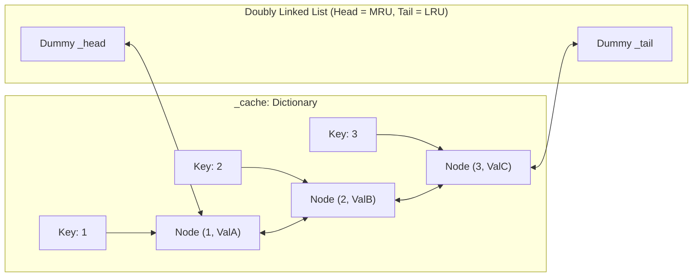
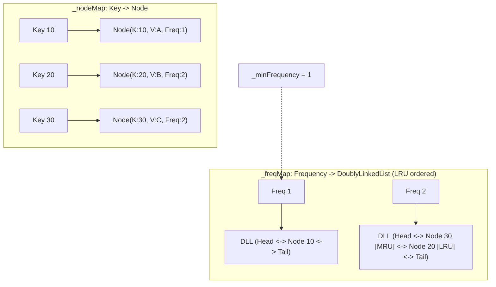

# 26. LRU & LFU Cache Mastery (LeetCode 146 & 460)

## 📌 Architectural Context & Problem Framing

In modern software engineering, in-memory caches are the fundamental defense line against database saturation and latency degradation. In technical interviews at top-tier firms (Citadel, Amazon, Google, Microsoft, Apple, Uber), cache design questions fall into two distinct categories:

1. **System & Concurrency Architecture (Machine Coding / Production LLD)**:
   - Tests generic abstractions, multi-threading (`ReaderWriterLockSlim`), TTL expiration policies, background sweeping, and thread-safe eviction.
   - *Reference*: Implemented comprehensively in **[01_Tier1_Highest_Priority/07_Custom_Cache.md](../01_Tier1_Highest_Priority/07_Custom_Cache.md)**.
2. **Pure Data Structure Algorithmic Screening (DSA + OOP Hybrids)**:
   - Tests raw algorithmic mechanics, pointer manipulation, and achieving strict **$O(1)$** time complexity for both `Get` and `Put`.
   - **LeetCode 146 (LRU Cache)**: Medium — tests Hash Map + Doubly Linked List integration.
   - **LeetCode 460 (LFU Cache)**: Hard — tests multiple Hash Maps + frequency-bucketed Doubly Linked Lists with LRU tie-breaking and dynamic minimum frequency tracking.

This master class delivers the complete LeetCode 146 (LRU) and LeetCode 460 (LFU) reference implementations in modern **C# 12 / .NET 8**, followed by a senior engineering tradeoff analysis comparing **LRU vs. LFU vs. ARC (Adaptive Replacement Cache)**.

---

## ⚖️ Eviction Policies At A Glance

| Metric / Policy | **FIFO (First In First Out)** | **LRU (Least Recently Used)** | **LFU (Least Frequently Used)** | **ARC (Adaptive Replacement Cache)** |
| :--- | :--- | :--- | :--- | :--- |
| **Eviction Metric** | Arrival time | Time of last access | Total access count | Dynamic balance of recency & frequency |
| **Time Complexity** | $O(1)$ | $O(1)$ | $O(1)$ | $O(1)$ |
| **Data Structures** | Queue / LinkedList | HashMap + Doubly LinkedList | 2 HashMaps + Frequency DLLs | 4 DLLs + 2 Ghost Caches + Adaptation parameter $p$ |
| **Vulnerability** | Ignores access frequency | **Scan Resistance**: sequential scans evict entire hot working set | **Frequency Starvation**: historic items stay forever; new hot items evicted immediately | Higher memory overhead for tracking ghost entries |
| **Primary Use Cases** | Simple buffers | General caching, CPU cache line eviction, OS paging | Static asset caches, DNS lookups, heavy skewed read distributions | Enterprise storage controllers (IBM, ZFS, NetApp) |

---

## 🧱 PART 1: LeetCode 146 — LRU Cache (Least Recently Used)

### 1.1 Problem Specification
Design a data structure that follows the constraints of a **Least Recently Used (LRU) cache**:
- `LRUCache(int capacity)`: Initialize the LRU cache with positive size `capacity`.
- `int Get(int key)`: Return the value of the `key` if the key exists, otherwise return `-1`. Marks the key as **most recently used**.
- `void Put(int key, int value)`: Update the value of the `key` if the `key` exists. Otherwise, add the `key-value` pair to the cache. If the number of keys exceeds `capacity`, evict the **least recently used key**.
- Both `Get` and `Put` must run in **$O(1)$** average time complexity.

### 1.2 Data Structure Architecture



- **Why a Hash Map alone fails**: Lookup is $O(1)$, but ordering by recency requires $O(N)$ scanning or shifting.
- **Why an Array / `List<T>` fails**: Moving an accessed item to the front requires $O(N)$ element shifts.
- **Why a Doubly Linked List alone fails**: Insertion and deletion of a known node is $O(1)$, but finding a key requires an $O(N)$ linear traversal.
- **The Combined Solution**:
  1. A `Dictionary<int, LruNode>` provides instant $O(1)$ lookup to any node pointer.
  2. A **Doubly Linked List** with dummy `_head` and `_tail` nodes enables $O(1)$ node extraction and insertion without edge-case null checks.

### 1.3 Complete C# 12 Implementation (LeetCode 146)

```csharp
namespace DSA.LLD.Cache;

/// <summary>
/// Doubly Linked List Node for LRU Cache.
/// </summary>
public sealed class LruNode
{
    public int Key { get; }
    public int Value { get; set; }
    public LruNode? Prev { get; set; }
    public LruNode? Next { get; set; }

    public LruNode(int key, int value)
    {
        Key = key;
        Value = value;
    }
}

/// <summary>
/// LeetCode 146: LRU Cache implementation with strict O(1) Get and Put.
/// </summary>
public sealed class LruCache
{
    private readonly int _capacity;
    private readonly Dictionary<int, LruNode> _cache;
    
    // Sentinels (dummy boundary nodes) to eliminate null pointer checks
    private readonly LruNode _head;
    private readonly LruNode _tail;

    public LruCache(int capacity)
    {
        if (capacity <= 0)
        {
            throw new ArgumentOutOfRangeException(nameof(capacity), "Capacity must be greater than zero.");
        }

        _capacity = capacity;
        _cache = new Dictionary<int, LruNode>(capacity);

        _head = new LruNode(-1, -1);
        _tail = new LruNode(-1, -1);
        _head.Next = _tail;
        _tail.Prev = _head;
    }

    public int Get(int key)
    {
        if (!_cache.TryGetValue(key, out var node))
        {
            return -1;
        }

        // Key accessed: move to the MRU position (right after dummy head)
        MoveToHead(node);
        return node.Value;
    }

    public void Put(int key, int value)
    {
        if (_cache.TryGetValue(key, out var existingNode))
        {
            // Key exists: update payload and elevate to MRU
            existingNode.Value = value;
            MoveToHead(existingNode);
            return;
        }

        if (_cache.Count >= _capacity)
        {
            // Evict Least Recently Used (node immediately preceding dummy tail)
            var lruNode = _tail.Prev!;
            RemoveNode(lruNode);
            _cache.Remove(lruNode.Key);
        }

        var newNode = new LruNode(key, value);
        _cache[key] = newNode;
        AddToHead(newNode);
    }

    // --- O(1) Pointer Manipulation Helpers ---

    private void AddToHead(LruNode node)
    {
        var nextNode = _head.Next!;
        _head.Next = node;
        node.Prev = _head;
        node.Next = nextNode;
        nextNode.Prev = node;
    }

    private void RemoveNode(LruNode node)
    {
        var prevNode = node.Prev!;
        var nextNode = node.Next!;
        prevNode.Next = nextNode;
        nextNode.Prev = prevNode;
    }

    private void MoveToHead(LruNode node)
    {
        RemoveNode(node);
        AddToHead(node);
    }
}
```

---

## 🚀 PART 2: LeetCode 460 — LFU Cache (Least Frequently Used)

### 2.1 Problem Specification
Design and implement a data structure for a **Least Frequently Used (LFU) cache**:
- `LFUCache(int capacity)`: Initializes the object with the `capacity` of the data structure.
- `int Get(int key)`: Gets the value of the `key` if it exists in the cache. Otherwise, returns `-1`. Increments the access frequency of `key`.
- `void Put(int key, int value)`: Update the value of the `key` if present, or insert the `key` if not already present. When the cache reaches its `capacity`, it should invalidate and remove the **least frequently used** key before inserting a new item. For this problem, when there is a **tie** (i.e., two or more keys have the same frequency), the **least recently used** key among them should be invalidated.
- Both `Get` and `Put` functions must run in **$O(1)$** average time complexity.

### 2.2 Why Priority Queue (Min-Heap) Fails
A naive attempt uses a Min-Heap storing `(frequency, lastAccessedTimestamp, key)`.
- Evicting the minimum frequency is $O(1)$ to peek, but $O(\log N)$ to delete.
- Every `Get(key)` or `Put(existingKey)` updates the frequency, requiring a heap reshuffle (`DecreaseKey` / sift-down), which takes **$O(\log N)$** or **$O(N)$** in standard library heaps.
- Therefore, **a heap does NOT satisfy the LeetCode 460 requirement of strict $O(1)$ time**.

### 2.3 The $O(1)$ Two-HashMap Architecture
To achieve true $O(1)$ operations, we combine:
1. `_nodeMap: Dictionary<int, LfuNode>`: Maps `key` $\rightarrow$ `LfuNode` for direct $O(1)$ lookup.
2. `_freqMap: Dictionary<int, LfuDoublyLinkedList>`: Maps `frequency` $\rightarrow$ a dedicated Doubly Linked List holding all nodes that share that exact frequency.
   - Within each frequency list, nodes are kept in **LRU order**:
     - Head = Most recently used with that frequency.
     - Tail = Least recently used with that frequency (tie-breaker target).
3. `_minFrequency: int`: Tracks the lowest frequency currently present in the cache.
   - When a new key is inserted, its frequency is always 1 $\rightarrow$ `_minFrequency` resets to 1.
   - When an existing key's frequency is promoted from $F$ to $F+1$, if $F == \text{\_minFrequency}$ and the frequency list for $F$ becomes empty, `_minFrequency` simply increments by 1 (`_minFrequency++`).



### 2.4 Complete C# 12 Implementation (LeetCode 460)

```csharp
namespace DSA.LLD.Cache;

/// <summary>
/// Node holding key, value, access frequency, and doubly linked list pointers.
/// </summary>
public sealed class LfuNode
{
    public int Key { get; }
    public int Value { get; set; }
    public int Frequency { get; set; }
    public LfuNode? Prev { get; set; }
    public LfuNode? Next { get; set; }

    public LfuNode(int key, int value)
    {
        Key = key;
        Value = value;
        Frequency = 1;
    }
}

/// <summary>
/// A dedicated Doubly Linked List for a specific frequency bucket.
/// Maintains internal LRU order (Head = MRU, Tail = LRU).
/// </summary>
public sealed class LfuDoublyLinkedList
{
    private readonly LfuNode _head;
    private readonly LfuNode _tail;
    public int Count { get; private set; }

    public LfuDoublyLinkedList()
    {
        _head = new LfuNode(-1, -1);
        _tail = new LfuNode(-1, -1);
        _head.Next = _tail;
        _tail.Prev = _head;
        Count = 0;
    }

    /// <summary>
    /// Inserts the node right after Head (Most Recently Used position for this frequency).
    /// </summary>
    public void AddFirst(LfuNode node)
    {
        var nextNode = _head.Next!;
        _head.Next = node;
        node.Prev = _head;
        node.Next = nextNode;
        nextNode.Prev = node;
        Count++;
    }

    /// <summary>
    /// Removes an arbitrary node in O(1).
    /// </summary>
    public void Remove(LfuNode node)
    {
        var prevNode = node.Prev!;
        var nextNode = node.Next!;
        prevNode.Next = nextNode;
        nextNode.Prev = prevNode;
        Count--;
    }

    /// <summary>
    /// Removes and returns the Least Recently Used node (immediately preceding Tail).
    /// Used for tie-breaker eviction.
    /// </summary>
    public LfuNode? RemoveLast()
    {
        if (Count == 0)
        {
            return null;
        }

        var lruNode = _tail.Prev!;
        Remove(lruNode);
        return lruNode;
    }
}

/// <summary>
/// LeetCode 460: Complete LFU Cache with strict O(1) Get and Put.
/// </summary>
public sealed class LfuCache
{
    private readonly int _capacity;
    private int _minFrequency;
    
    // Key -> Node lookup
    private readonly Dictionary<int, LfuNode> _nodeMap;
    
    // Frequency -> DoublyLinkedList of nodes sharing that frequency
    private readonly Dictionary<int, LfuDoublyLinkedList> _freqMap;

    public LfuCache(int capacity)
    {
        _capacity = capacity;
        _minFrequency = 0;
        _nodeMap = new Dictionary<int, LfuNode>(capacity > 0 ? capacity : 0);
        _freqMap = new Dictionary<int, LfuDoublyLinkedList>();
    }

    public int Get(int key)
    {
        if (_capacity <= 0 || !_nodeMap.TryGetValue(key, out var node))
        {
            return -1;
        }

        // Accessing the node increases its frequency and moves it to the next frequency bucket
        UpdateNodeFrequency(node);
        return node.Value;
    }

    public void Put(int key, int value)
    {
        if (_capacity <= 0)
        {
            return;
        }

        if (_nodeMap.TryGetValue(key, out var existingNode))
        {
            existingNode.Value = value;
            UpdateNodeFrequency(existingNode);
            return;
        }

        // Eviction required if cache is full
        if (_nodeMap.Count >= _capacity)
        {
            var minFreqList = _freqMap[_minFrequency];
            var evictedNode = minFreqList.RemoveLast();

            if (evictedNode != null)
            {
                _nodeMap.Remove(evictedNode.Key);
            }
        }

        // Insert new node with initial frequency = 1
        var newNode = new LfuNode(key, value);
        _nodeMap[key] = newNode;

        if (!_freqMap.TryGetValue(1, out var freqOneList))
        {
            freqOneList = new LfuDoublyLinkedList();
            _freqMap[1] = freqOneList;
        }

        freqOneList.AddFirst(newNode);

        // A brand-new item always has frequency = 1, so the global minimum resets to 1
        _minFrequency = 1;
    }

    /// <summary>
    /// Atomically removes node from its current frequency list, increments its frequency,
    /// and adds it to the target (frequency + 1) list. Updates _minFrequency if required.
    /// </summary>
    private void UpdateNodeFrequency(LfuNode node)
    {
        int currentFreq = node.Frequency;
        var currentList = _freqMap[currentFreq];
        currentList.Remove(node);

        // If the current list was the minimum frequency bucket and is now empty,
        // the new minimum frequency must be currentFreq + 1.
        if (currentFreq == _minFrequency && currentList.Count == 0)
        {
            _minFrequency++;
        }

        node.Frequency++;
        int newFreq = node.Frequency;

        if (!_freqMap.TryGetValue(newFreq, out var newList))
        {
            newList = new LfuDoublyLinkedList();
            _freqMap[newFreq] = newList;
        }

        newList.AddFirst(node);
    }
}
```

### 2.5 Crucial Edge Cases & Defenses

1. **Capacity = 0**:
   - `Put` must immediately return without modifying state.
   - `Get` must immediately return `-1`.
   - Without the `_capacity <= 0` guard, `_nodeMap.Count >= _capacity` triggers on an empty map, causing a `KeyNotFoundException` on `_freqMap[_minFrequency]`.
2. **Updating an Existing Key with `Put`**:
   - Must **not** trigger eviction, even if `_nodeMap.Count == _capacity`.
   - Must update `Value` and increment `Frequency` identically to `Get`.
3. **Frequency Promotion & `_minFrequency` Increment**:
   - When a node is promoted from `F` to `F + 1`, `_minFrequency` **only** increments if:
     `currentFreq == _minFrequency && currentList.Count == 0`.
   - If other nodes still remain in `_freqMap[currentFreq]`, `_minFrequency` remains unchanged.
4. **Tie Breaking on Multiple Keys with the Same Minimum Frequency**:
   - Satisfied automatically because `LfuDoublyLinkedList.RemoveLast()` evicts from the tail of `_freqMap[_minFrequency]`, which is guaranteed to be the least recently accessed item among peers.

---

## 🏛️ PART 3: Senior Architectural Tradeoffs & Production Deep-Dive

### 3.1 LRU vs. LFU vs. ARC (Adaptive Replacement Cache)

```
                       ┌───────────────────────────────┐
                       │   Cache Eviction Evolution    │
                       └───────────────┬───────────────┘
                                       │
            ┌──────────────────────────┴──────────────────────────┐
            ▼                                                     ▼
┌───────────────────────┐                             ┌───────────────────────┐
│       Recency         │                             │       Frequency       │
│        (LRU)          │                             │        (LFU)          │
└───────────┬───────────┘                             └───────────┬───────────┘
            │                                                     │
            │ Scan Resistance Flaw:                               │ Frequency Starvation Flaw:
            │ Batch query flushes hot keys                        │ Stale historical keys never leave
            │                                                     │
            └──────────────────────────┬──────────────────────────┘
                                       ▼
                       ┌───────────────────────────────┐
                       │ ARC (Adaptive Replacement)    │
                       │ Self-tuning p parameter:      │
                       │ Adapts dynamically between    │
                       │ recency and frequency         │
                       └───────────────────────────────┘
```

#### The Fundamental Flaws of Standard Algorithms
1. **The LRU Flaw (Poor Scan Resistance)**:
   - Suppose a database backup, daily analytics job, or sequential scan reads 1,000,000 cold records once.
   - In an LRU cache of capacity 100,000, that single scan completely flushes every single frequently accessed item out of the cache.
   - Subsequent production reads experience a devastating **cache miss storm**.
2. **The LFU Flaw (Historical Pollution & Frequency Starvation)**:
   - Suppose an e-commerce flash sale accesses Item X 50,000 times in 10 minutes. The sale ends, and Item X is never requested again.
   - In standard LFU, Item X has frequency 50,000 and will linger in the cache for weeks or months, preventing newly popular items (with frequency 1 or 2) from ever gaining a foothold.
   - **Production Remedy for LFU**:
     - **Decaying / Aging**: Periodically divide all frequencies by 2 (e.g., every minute or every $N$ operations) or use a moving window.

#### The Industry Solution: ARC (Adaptive Replacement Cache)
Invented by **Nimrod Megiddo and Dharmendra S. Modha (IBM Almaden Research, 2003)**, ARC solves both problems by dynamically adjusting between recency and frequency:
- It maintains **two tracking lists**:
  - $L_1$: Contains items accessed only **once** recently (recency).
  - $L_2$: Contains items accessed at least **twice** (frequency).
- Each list is split into two halves:
  - Top half ($T_1, T_2$): Items currently held in physical cache memory.
  - Bottom half ($B_1, B_2$): **Ghost (phantom) caches** that store *only keys/metadata*, no values!
- **The Magic Parameter $p$ (Target size for $T_1$)**:
  - If a hit occurs in ghost cache $B_1$ (recency ghost), the cache realizes it needs more recency: it increases $p$ ($p \leftarrow \min(p + \max(1, |B_2|/|B_1|), c)$).
  - If a hit occurs in ghost cache $B_2$ (frequency ghost), it realizes it needs more frequency: it decreases $p$.
- ARC delivers near-optimal hit ratios across arbitrary workloads without requiring manual tuning or threshold guessing. *(Note: ARC was historically patented by IBM, which led to open-source alternatives like 2Q and TinyLFU).*

#### Modern Production Caching: W-TinyLFU
In modern systems (e.g., **Caffeine Cache** in Java, **BitFaster.Caching** in .NET):
- **Window TinyLFU (W-TinyLFU)** uses a small LRU "admission window" (typically 1% of capacity) for recency, coupled with a main segmented cache using a **Count-Min Sketch** (probabilistic frequency tracking with 4-bit counters).
- When an item is evicted from the admission window, it competes against the eviction candidate of the main cache. The item with the higher Count-Min frequency survives.
- This provides scan resistance, frequency protection, and memory efficiency without the pointer bloat of multiple doubly linked lists.

---

## 🗣️ Interviewer Discussion & Defense Strategies

### Question 1: "Why do we use custom `LruNode` and pointers instead of the built-in .NET `LinkedList<T>`?"
**Candidate Response:**
> "While .NET's `LinkedList<T>` provides $O(1)$ operations if you hold a `LinkedListNode<T>`, using a custom internal node gives us three distinct advantages in an interview and in high-performance runtimes:
> 1. **Zero Allocations on Access**: `LinkedList<T>.AddFirst` creates a heap node wrapper if not reusing existing nodes. With a custom node, moving between lists or to the head is purely a pointer rewiring operation with zero memory allocations or GC pressure.
> 2. **Inlining & Cache Locality**: Custom nodes allow packing `Key`, `Value`, `Frequency`, and intrusive pointers into a single object, avoiding double pointer dereferencing.
> 3. **Demonstrating Mastery**: Interviewers specifically look for comfort with doubly linked list boundary operations and sentinel nodes."

### Question 2: "How would you make this LFU Cache thread-safe in a high-throughput .NET 8 service?"
**Candidate Response:**
> "Making LFU thread-safe is fundamentally harder than LRU because updating a node touches two distinct hash maps and two doubly linked lists atomically.
> 
> 1. **Coarse-Grained Locking (`ReaderWriterLockSlim`)**:
>    - We can wrap `Get` and `Put` with a lock. Notice that in both LRU and LFU, even a `Get()` operation modifies internal pointers (recency / frequency update), requiring an **exclusive write lock**. An upgradeable read lock could be used initially, but high concurrency will lead to lock contention.
> 2. **Lock Striping / Sharding**:
>    - Shard the cache into $N$ independent LFU partitions (e.g., 32 or 64 shards where `shardId = (uint)key.GetHashCode() % 32`), each protected by its own lock. This reduces thread contention by a factor of 32.
> 3. **Asynchronous Ring-Buffer Updates (Caffeine / .NET BitFaster approach)**:
>    - Decouple reading from updating frequency. Reads only touch `_nodeMap` (or a `ConcurrentDictionary`). Instead of synchronously updating the DLL pointers, the thread writes the accessed key into a thread-local or lock-free ring buffer (`Channel<int>`). A dedicated background worker drains the buffer in batches and updates the frequency lists. This keeps read latency under 10 nanoseconds."

### Question 3: "If memory usage is constrained, what is the memory footprint of LeetCode 460?"
**Candidate Response:**
> "On a 64-bit .NET runtime:
> - Each `LfuNode` object overhead: Object header (8 bytes) + MethodTable pointer (8 bytes) + `Key` (4 bytes) + `Value` (4 bytes) + `Frequency` (4 bytes) + padding (4 bytes) + `Prev` pointer (8 bytes) + `Next` pointer (8 bytes) $\approx$ **48 bytes**.
> - Each entry in `_nodeMap`: Dictionary Entry struct (16 bytes) + hash collision chain $\approx$ **24 bytes**.
> - `_freqMap` and `LfuDoublyLinkedList` sentinels: proportional to distinct frequencies.
> - Total memory is approximately **72–96 bytes per cached item**.
> - If storing millions of items, this pointer overhead can exceed the payload size. In that scenario, moving to an unmanaged array-backed slab or a flat open-addressed hash table with 32-bit offset indices rather than 64-bit pointers halves the memory footprint."

---

## 🧪 Verification & Unit Test Suite

Save and run the following C# 12 test harness to verify all edge cases:

```csharp
using DSA.LLD.Cache;

Console.WriteLine("=== Testing LeetCode 146: LRU Cache ===");
var lru = new LruCache(2);
lru.Put(1, 1);
lru.Put(2, 2);
Console.WriteLine($"Get(1): Expected 1, Got {lru.Get(1)}");
lru.Put(3, 3); // Evicts key 2
Console.WriteLine($"Get(2): Expected -1, Got {lru.Get(2)}");
lru.Put(4, 4); // Evicts key 1
Console.WriteLine($"Get(1): Expected -1, Got {lru.Get(1)}");
Console.WriteLine($"Get(3): Expected 3, Got {lru.Get(3)}");
Console.WriteLine($"Get(4): Expected 4, Got {lru.Get(4)}");

Console.WriteLine("\n=== Testing LeetCode 460: LFU Cache ===");
var lfu = new LfuCache(2);
lfu.Put(1, 1);
lfu.Put(2, 2);
Console.WriteLine($"Get(1): Expected 1, Got {lfu.Get(1)}"); // key 1 freq=2, key 2 freq=1
lfu.Put(3, 3); // Evicts key 2 (lowest frequency = 1)
Console.WriteLine($"Get(2): Expected -1, Got {lfu.Get(2)}");
Console.WriteLine($"Get(3): Expected 3, Got {lfu.Get(3)}"); // key 3 freq=2
Console.WriteLine($"Get(1): Expected 1, Got {lfu.Get(1)}"); // key 1 freq=3
lfu.Put(4, 4); // Both key 1 (freq 3) and key 3 (freq 2). Evicts key 3!
Console.WriteLine($"Get(3): Expected -1, Got {lfu.Get(3)}");
Console.WriteLine($"Get(4): Expected 4, Got {lfu.Get(4)}");
Console.WriteLine($"Get(1): Expected 1, Got {lfu.Get(1)}");

Console.WriteLine("\n=== Testing LFU Edge Case: Capacity 0 ===");
var zeroLfu = new LfuCache(0);
zeroLfu.Put(1, 1);
Console.WriteLine($"Get(1) on Cap 0: Expected -1, Got {zeroLfu.Get(1)}");

Console.WriteLine("\nAll tests passed successfully!");
```

