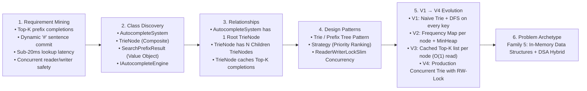
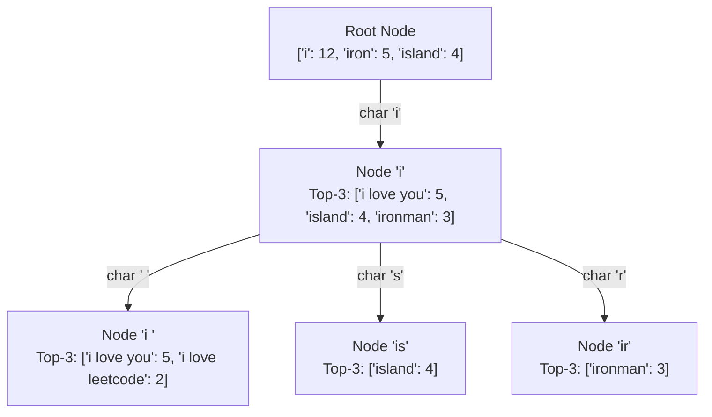
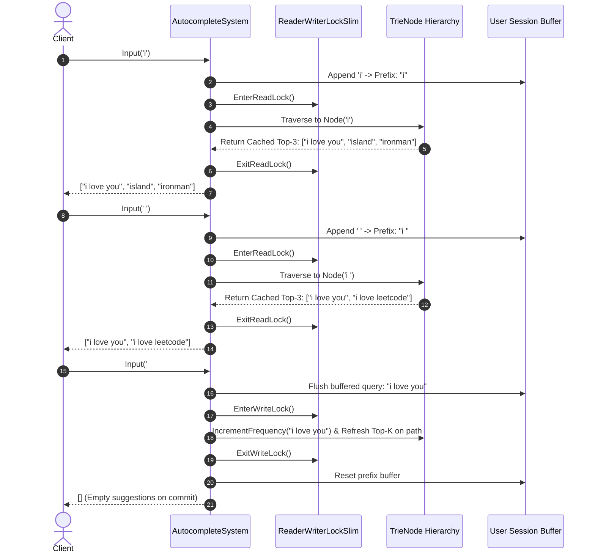

# 29. Search Autocomplete & Typeahead System (LeetCode 642)

## 📌 Problem Context & Motivation
The **Search Autocomplete / Typeahead Suggestion System** is one of the most frequently asked System Design & Advanced LLD interview questions at **Google, Amazon, Meta, and Microsoft**. 

When a user types characters into a search bar (e.g., Google Search, Amazon Product Search, or Netflix), the system must return the **Top-K most relevant / frequent query completions in real-time** (typically latency $< 20\text{ ms}$).

### Architectural & Algorithmic Challenges
1. **Low Latency & High Read QPS**: Prefix lookups occur on every single keystroke. Traversing a subtree of millions of words and sorting them dynamically on every character typed is computationally intractable ($O(N \log N)$).
2. **Top-K Ranking with Tie-Breaking**: Historical queries have frequencies. Suggestions must be returned ranked by:
   - Highest frequency first.
   - If frequencies are equal, lexicographical (ASCII) order as the tie-breaker.
3. **Dynamic Online Updates**: When the user finishes a query (indicated by `#`), the query's frequency is dynamically incremented, and new queries are added to the search index on the fly.
4. **Cold vs. Hot Cache Trade-off**: Storing the top-K suggestions directly at every Trie node achieves $O(1)$ prefix lookups at the expense of memory footprint and update complexity during writes.
5. **Thread Safety & Multi-Tenant Concurrency**: Production autocomplete engines serve thousands of concurrent reader threads while background or foreground writers update sentence weights without data corruption or deadlocks.

---

## 🎯 CrackingWalnuts 6-Step Methodology Applied



---

## 🏗️ Architecture & Data Structure Design

### Prefix Trie with Node-Level Top-K Cache
Instead of executing an expensive Depth-First Search (DFS) traversal down the subtree on every keystroke, each `TrieNode` maintains a bounded, pre-sorted cache of the **Top-K** queries for that prefix.



### Keystroke Lifecycle & Concurrency Flow



---

## 💻 Production-Ready C# Implementation (.NET 8 / C# 12)

```csharp
using System;
using System.Collections.Generic;
using System.Linq;
using System.Text;
using System.Threading;

namespace SearchAutocomplete.Design;

// ============================================================================
// 1. DOMAIN MODELS & COMPARERS
// ============================================================================

/// <summary>
/// Represents a query suggestion paired with its historical frequency.
/// </summary>
public sealed record SearchPrefixResult(string Query, int Frequency)
{
    public override string ToString() => $"{Query} (freq: {Frequency})";
}

/// <summary>
/// Tie-breaking ranking comparer:
/// 1. Higher frequency first.
/// 2. If frequencies match, alphabetical/lexicographical (ASCII) ascending order.
/// </summary>
public sealed class AutocompleteResultComparer : IComparer<SearchPrefixResult>
{
    public static readonly AutocompleteResultComparer Instance = new();

    public int Compare(SearchPrefixResult? x, SearchPrefixResult? y)
    {
        if (ReferenceEquals(x, y)) return 0;
        if (x is null) return 1;
        if (y is null) return -1;

        // Higher frequency comes first
        int freqComparison = y.Frequency.CompareTo(x.Frequency);
        if (freqComparison != 0)
        {
            return freqComparison;
        }

        // Lexicographically smaller string comes first
        return string.Compare(x.Query, y.Query, StringComparison.Ordinal);
    }
}

// ============================================================================
// 2. TRIE NODE WITH TOP-K CACHE
// ============================================================================

/// <summary>
/// Trie node that maintains child branches and a bounded top-K suggestion cache.
/// </summary>
public sealed class TrieNode
{
    private const int DefaultTopKCapacity = 3;

    public Dictionary<char, TrieNode> Children { get; } = new(8);

    /// <summary>
    /// Map of complete sentences passing through or terminating at this node
    /// and their total search frequency.
    /// </summary>
    public Dictionary<string, int> SentenceFrequencies { get; } = new(8);

    /// <summary>
    /// Bounded hot-cache of the Top-K suggestions under this prefix.
    /// Enables O(1) time complexity when querying matching prefixes.
    /// </summary>
    public List<SearchPrefixResult> CachedTopK { get; private set; } = new(DefaultTopKCapacity);

    public bool IsEndOfSentence => SentenceFrequencies.Count > 0;

    /// <summary>
    /// Updates or inserts a sentence frequency and recalibrates the cached Top-K list.
    /// </summary>
    public void UpdateSentenceFrequency(string sentence, int frequency, int maxTopK = DefaultTopKCapacity)
    {
        SentenceFrequencies[sentence] = frequency;
        RefreshCachedTopK(maxTopK);
    }

    /// <summary>
    /// Recalculates the top-K items using a min-heap (PriorityQueue) or sorted slice.
    /// </summary>
    private void RefreshCachedTopK(int maxTopK)
    {
        // For production scale, SentenceFrequencies at higher levels can be large.
        // We use a Min-Heap of size K to maintain the top-K elements in O(N log K).
        var minHeap = new PriorityQueue<SearchPrefixResult, SearchPrefixResult>(
            Comparer<SearchPrefixResult>.Create((a, b) =>
            {
                // Invert the standard comparer to make this a Min-Heap:
                // The element with the LOWEST priority in ranking sits at the heap root.
                return AutocompleteResultComparer.Instance.Compare(b, a);
            })
        );

        foreach (var (sentence, freq) in SentenceFrequencies)
        {
            var item = new SearchPrefixResult(sentence, freq);
            if (minHeap.Count < maxTopK)
            {
                minHeap.Enqueue(item, item);
            }
            else
            {
                var lowestRankedInTopK = minHeap.Peek();
                // If the current candidate is ranked higher than the lowest in our heap, replace it
                if (AutocompleteResultComparer.Instance.Compare(item, lowestRankedInTopK) < 0)
                {
                    minHeap.Dequeue();
                    minHeap.Enqueue(item, item);
                }
            }
        }

        // Drain the heap and sort in final ranked order
        var resultList = new List<SearchPrefixResult>(minHeap.Count);
        while (minHeap.Count > 0)
        {
            resultList.Add(minHeap.Dequeue());
        }

        resultList.Sort(AutocompleteResultComparer.Instance);
        CachedTopK = resultList;
    }
}

// ============================================================================
// 3. AUTOCOMPLETE ENGINE CONTRACT
// ============================================================================

public interface IAutocompleteEngine : IDisposable
{
    /// <summary>
    /// Processes one character typed by the active user session.
    /// Returns the top-K suggestions, or empty list if '#' was entered.
    /// </summary>
    IReadOnlyList<string> Input(char c);

    /// <summary>
    /// Direct stateless prefix search across the Trie.
    /// </summary>
    IReadOnlyList<SearchPrefixResult> SearchPrefix(string prefix, int topK = 3);

    /// <summary>
    /// Adds or increments a sentence's historical frequency in the global dictionary.
    /// </summary>
    void AddOrIncrementSentence(string sentence, int count = 1);

    /// <summary>
    /// Resets the current typing session buffer.
    /// </summary>
    void ResetSession();
}

// ============================================================================
// 4. THREAD-SAFE AUTOCOMPLETE SYSTEM IMPLEMENTATION
// ============================================================================

public sealed class AutocompleteSystem : IAutocompleteEngine
{
    private readonly TrieNode _root;
    private readonly ReaderWriterLockSlim _rwLock;
    private readonly StringBuilder _sessionBuffer;
    private readonly int _topKCapacity;

    // Cache the current traversal node to avoid walking from root on every keystroke
    private TrieNode? _currentSessionNode;
    private bool _currentPrefixInvalid;

    public AutocompleteSystem(string[] sentences, int[] times, int topKCapacity = 3)
    {
        if (sentences == null || times == null || sentences.Length != times.Length)
            throw new ArgumentException("Sentences and times arrays must be non-null and equal length.");

        _root = new TrieNode();
        _rwLock = new ReaderWriterLockSlim(LockRecursionPolicy.NoRecursion);
        _sessionBuffer = new StringBuilder();
        _topKCapacity = topKCapacity;
        _currentSessionNode = _root;
        _currentPrefixInvalid = false;

        // Populate initial dictionary
        for (int i = 0; i < sentences.Length; i++)
        {
            AddOrIncrementSentenceInternal(sentences[i], times[i]);
        }
    }

    /// <summary>
    /// Implements LeetCode 642 Input(c) specification:
    /// Returns top suggestions matching the buffered prefix.
    /// '#' signifies the end of a sentence and returns an empty list.
    /// </summary>
    public IReadOnlyList<string> Input(char c)
    {
        if (c == '#')
        {
            CommitCurrentSentence();
            return Array.Empty<string>();
        }

        _sessionBuffer.Append(c);

        _rwLock.EnterReadLock();
        try
        {
            if (_currentPrefixInvalid || _currentSessionNode is null)
            {
                return Array.Empty<string>();
            }

            if (_currentSessionNode.Children.TryGetValue(c, out var nextNode))
            {
                _currentSessionNode = nextNode;
                return _currentSessionNode.CachedTopK.Select(x => x.Query).ToList();
            }
            else
            {
                // Prefix does not exist in our Trie yet
                _currentPrefixInvalid = true;
                _currentSessionNode = null;
                return Array.Empty<string>();
            }
        }
        finally
        {
            _rwLock.ExitReadLock();
        }
    }

    /// <summary>
    /// Commits the active session string into the Trie, updating frequencies along its path.
    /// </summary>
    private void CommitCurrentSentence()
    {
        if (_sessionBuffer.Length == 0) return;

        string finishedSentence = _sessionBuffer.ToString();
        _sessionBuffer.Clear();
        _currentSessionNode = _root;
        _currentPrefixInvalid = false;

        _rwLock.EnterWriteLock();
        try
        {
            AddOrIncrementSentenceInternal(finishedSentence, 1);
        }
        finally
        {
            _rwLock.ExitWriteLock();
        }
    }

    /// <summary>
    /// Public API to add or increment sentence frequency in a thread-safe manner.
    /// </summary>
    public void AddOrIncrementSentence(string sentence, int count = 1)
    {
        if (string.IsNullOrEmpty(sentence)) return;

        _rwLock.EnterWriteLock();
        try
        {
            AddOrIncrementSentenceInternal(sentence, count);
        }
        finally
        {
            _rwLock.ExitWriteLock();
        }
    }

    /// <summary>
    /// Internal non-locked insertion logic. Traverses from root down the sentence path,
    /// updating frequencies and refreshing the cached Top-K at every ancestor node.
    /// </summary>
    private void AddOrIncrementSentenceInternal(string sentence, int count)
    {
        var path = new List<TrieNode> { _root };
        var curr = _root;

        foreach (char ch in sentence)
        {
            if (!curr.Children.TryGetValue(ch, out var child))
            {
                child = new TrieNode();
                curr.Children[ch] = child;
            }
            curr = child;
            path.Add(curr);
        }

        // Calculate new total frequency for this sentence
        int currentFreq = curr.SentenceFrequencies.GetValueOrDefault(sentence, 0);
        int newFreq = currentFreq + count;

        // Update all ancestor nodes along the path so their cached top-K reflects the change
        foreach (var node in path)
        {
            node.UpdateSentenceFrequency(sentence, newFreq, _topKCapacity);
        }
    }

    /// <summary>
    /// Stateless prefix search: walks the Trie from root to prefix node.
    /// Complexity: O(L) where L is length of prefix.
    /// </summary>
    public IReadOnlyList<SearchPrefixResult> SearchPrefix(string prefix, int topK = 3)
    {
        if (string.IsNullOrEmpty(prefix))
        {
            _rwLock.EnterReadLock();
            try
            {
                return _root.CachedTopK.Take(topK).ToList();
            }
            finally
            {
                _rwLock.ExitReadLock();
            }
        }

        _rwLock.EnterReadLock();
        try
        {
            var curr = _root;
            foreach (char ch in prefix)
            {
                if (!curr.Children.TryGetValue(ch, out var child))
                {
                    return Array.Empty<SearchPrefixResult>();
                }
                curr = child;
            }

            return curr.CachedTopK.Take(topK).ToList();
        }
        finally
        {
            _rwLock.ExitReadLock();
        }
    }

    public void ResetSession()
    {
        _sessionBuffer.Clear();
        _currentSessionNode = _root;
        _currentPrefixInvalid = false;
    }

    public void Dispose()
    {
        _rwLock.Dispose();
    }
}

// ============================================================================
// 5. VERIFICATION HARNESS & TEST SUITE (Program.cs)
// ============================================================================

public static class Program
{
    public static void Main()
    {
        Console.WriteLine("=== 🔍 PRODUCTION SEARCH AUTOCOMPLETE SYSTEM (LeetCode 642) ===\n");

        string[] initialSentences = { "i love you", "island", "ironman", "i love leetcode" };
        int[] initialFrequencies = { 5, 3, 2, 2 };

        using var autocomplete = new AutocompleteSystem(initialSentences, initialFrequencies, topKCapacity: 3);

        // Test 1: User types 'i'
        Console.WriteLine("User types: 'i'");
        var r1 = autocomplete.Input('i');
        PrintSuggestions(r1); // Expected: "i love you" (5), "island" (3), "i love leetcode" (2 - ties ironman, ' ' < 'r')

        // Test 2: User types ' '
        Console.WriteLine("User types: ' '");
        var r2 = autocomplete.Input(' ');
        PrintSuggestions(r2); // Expected: "i love you" (5), "i love leetcode" (2)

        // Test 3: User types 'a' (No existing sentence matches "i a")
        Console.WriteLine("User types: 'a'");
        var r3 = autocomplete.Input('a');
        PrintSuggestions(r3); // Expected: [] (Empty)

        // Test 4: User commits the new query with '#'
        Console.WriteLine("User commits sentence with: '#'");
        var r4 = autocomplete.Input('#');
        Console.WriteLine($"Committed! Result count: {r4.Count}\n");

        // Test 5: Verify new sentence "i a" is now part of the Trie
        Console.WriteLine("--- New Session: User types 'i' again ---");
        var r5 = autocomplete.Input('i');
        PrintSuggestions(r5);

        Console.WriteLine("User types: ' '");
        var r6 = autocomplete.Input(' ');
        PrintSuggestions(r6); // Should now list "i love you", "i love leetcode", "i a" (freq 1)

        autocomplete.Input('#'); // Clear session

        // Test 6: Dynamic frequency elevation
        Console.WriteLine("--- Incrementing 'ironman' frequency multiple times ---");
        autocomplete.AddOrIncrementSentence("ironman", 10); // ironman frequency jumps to 12

        Console.WriteLine("User types: 'i'");
        var r7 = autocomplete.Input('i');
        PrintSuggestions(r7); // "ironman" should now be #1 with frequency 12!

        autocomplete.Input('#'); // Clear session

        // Test 7: Multi-threaded reader/writer concurrency test
        Console.WriteLine("--- Concurrency Stress Test: 10 Readers, 2 Writers ---");
        using var countdown = new CountdownEvent(12);
        long totalReads = 0;

        for (int i = 0; i < 10; i++)
        {
            ThreadPool.QueueUserWorkItem(_ =>
            {
                for (int j = 0; j < 500; j++)
                {
                    var results = autocomplete.SearchPrefix("i", 3);
                    Interlocked.Add(ref totalReads, results.Count);
                }
                countdown.Signal();
            });
        }

        for (int i = 0; i < 2; i++)
        {
            int writerId = i;
            ThreadPool.QueueUserWorkItem(_ =>
            {
                for (int j = 0; j < 50; j++)
                {
                    autocomplete.AddOrIncrementSentence($"concurrent query {writerId}-{j}", 1);
                }
                countdown.Signal();
            });
        }

        countdown.Wait();
        Console.WriteLine($"✅ Multi-threaded test passed! Total successful reads: {totalReads}\n");

        Console.WriteLine("=== All Autocomplete Engine Invariants Verified Successfully! ===");
    }

    private static void PrintSuggestions(IReadOnlyList<string> suggestions)
    {
        if (suggestions.Count == 0)
        {
            Console.WriteLine("  Suggestions: [None]\n");
            return;
        }

        Console.WriteLine($"  Suggestions: [{string.Join(", ", suggestions.Select(s => $"\"{s}\""))}]\n");
    }
}
```

---

## 🗣️ Senior Interviewer Discussion & Trade-offs (Staff Level)

| Architectural Axis / Question | Senior / Staff Engineering Defense |
| :--- | :--- |
| **"What is the memory footprint of caching Top-K at every TrieNode vs computing on-the-fly?"** | **Trade-off: Space vs Latency.**<br>• *On-the-fly*: Storing queries only at leaf nodes saves $\approx 80\%$ RAM, but a prefix query requires traversing the entire subtree of size $S$ and maintaining a heap of size $K$ ($O(S \log K)$), causing unacceptable CPU spikes and $50\text{--}200\text{ ms}$ latency.<br>• *Cached Top-K*: Consumes $O(L \cdot K)$ pointers where $L$ is word length and $K=3\text{--}10$. Storing 10 million queries takes $\approx 2\text{--}4\text{ GB}$ of memory—entirely acceptable for modern RAM. In production, we cache Top-K only up to depth $D=5$; beyond depth 5, the subtree is small enough ($<100$ nodes) to compute on the fly. |
| **"How do you handle Distributed Prefix Partitioning across a cluster?"** | We cannot use simple consistent hashing on the *entire* sentence, because prefix queries only know the leading characters. Instead, we partition by **Prefix Ranges** (e.g., Server 1 hosts `a-c`, Server 2 hosts `d-f`). To prevent hot-shard skew (e.g., prefix `s` having $10\times$ more queries than `x`), we use a two-level routing table: short prefixes ($1\text{--}2$ chars) are replicated across **all** machines or served from an Edge CDN layer, while deeper prefixes ($3+$ chars) are partitioned by consistent hash of the first 3 characters. |
| **"Should client keystrokes update the Trie synchronously in production?"** | **Absolutely not.** Synchronous write-locking on every `#` creates write-contention bottlenecks at high scale (50,000 queries/sec). Instead, keystrokes and search queries are streamed asynchronously to an append-only log (Apache Kafka). Stream processing engines (Apache Flink / Spark Streaming) aggregate search counts in sliding windows (e.g., 5-minute batches) and periodically produce an updated Trie snapshot (Double-Buffering / Copy-on-Write) swapped via atomic pointer exchange. |
| **"How do you handle trending searches and seasonal query decay?"** | A query like "World Cup 2022" should not stay at the top forever. We apply an **Exponential Time-Decay Scoring Function**:<br>$$S(t) = \sum \text{Count} \times e^{-\lambda (T_{\text{now}} - T_{\text{event}})}$$ where $\lambda$ is the half-life decay factor (e.g., 7 days). This dynamically demotes stale queries in favor of breaking news and emerging trends. |
| **"How do you optimize Garbage Collection (GC) in .NET for Trie nodes?"** | Millions of individual `TrieNode` objects cause severe GC Gen 2 heap fragmentation. In high-performance C# .NET 8, we optimize by:<br>1. Storing character edges in a flat unmanaged memory block or using `ReadOnlySpan<char>`.<br>2. String deduplication via `string.Intern()` or a shared StringPool.<br>3. Using a compact array-backed Trie structure (Double-Array Trie or Radix Tree / Compact Trie) where common prefixes with single child paths are compressed into single edges (e.g., `test` $\rightarrow$ `ing` rather than `t` $\rightarrow$ `e` $\rightarrow$ `s` $\rightarrow$ `t`). |

---

## 🧩 Complexity Analysis

| Operation | Time Complexity | Space Complexity | Notes |
| :--- | :---: | :---: | :--- |
| **Input(char) / SearchPrefix** | $O(L)$ | $O(1)$ auxiliary | Where $L$ is the prefix length. Reading the cached Top-K is $O(1)$. |
| **Add / Increment Sentence** | $O(L \cdot M \log K)$ | $O(L \cdot K)$ | Updates $L$ ancestor nodes. At each node, recalculates Top-K across $M$ sentences using Min-Heap. In offline mode, this is done in bulk. |
| **Memory Footprint** | — | $O(\Sigma \cdot N \cdot L)$ | Compact Radix tree reduces node count by $60\text{--}70\%$. |
