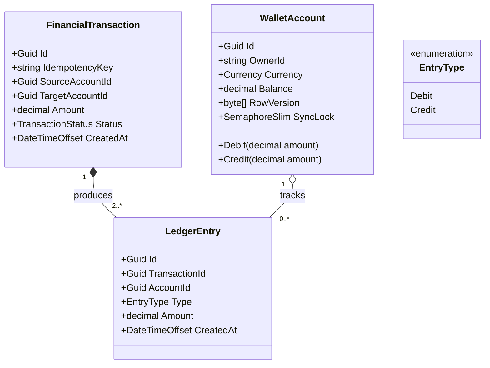
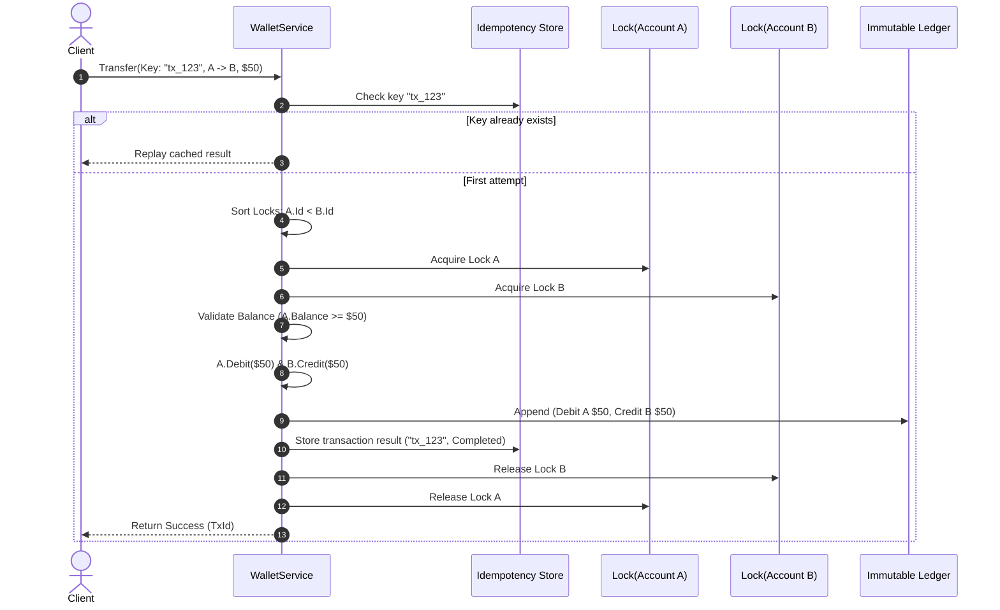

# 22. Digital Wallet & Double-Entry Ledger System (Fintech LLD)

## 📌 Context
Designing a digital wallet (like Stripe, Razorpay, or PhonePe) is the single most popular financial LLD problem in senior backend interviews. It evaluates your mastery of **Double-Entry Bookkeeping**, **Deadlock Avoidance**, **Idempotency**, and **Atomic Money Transfers** without floating-point inaccuracies.

---

## 🏗️ 1. Architecture & Core Concepts

### Core Requirements
1. **Double-Entry Accounting**: Money cannot appear or disappear. Every transfer generates a minimum of two immutable ledger entries: one **Debit** and one **Credit**, whose sum equals zero.
2. **Deadlock Prevention**: When two users transfer money to each other simultaneously (User A $\rightarrow$ User B and User B $\rightarrow$ User A), circular lock acquisition must be prevented.
3. **Idempotency**: Network retries sending the same `IdempotencyKey` must return the original transaction result without double-charging.
4. **Data Integrity**: Never use `float` or `double` for currency. Always use `decimal`.



---

## 💻 2. Domain Entities & Invariants

```csharp
using System.Text.Json.Serialization;

public enum Currency { USD, EUR, INR, GBP }
public enum EntryType { Debit, Credit }
public enum TransactionStatus { Pending, Completed, Failed }

public class WalletAccount
{
    public Guid Id { get; private set; }
    public string OwnerId { get; private set; }
    public Currency Currency { get; private set; }
    public decimal Balance { get; private set; }
    
    // In-memory concurrency lock per account
    [JsonIgnore]
    public SemaphoreSlim SyncLock { get; } = new(1, 1);

    public WalletAccount(Guid id, string ownerId, Currency currency, decimal initialBalance = 0m)
    {
        if (initialBalance < 0) throw new ArgumentException("Initial balance cannot be negative.");
        Id = id;
        OwnerId = ownerId;
        Currency = currency;
        Balance = initialBalance;
    }

    public void Debit(decimal amount)
    {
        if (amount <= 0) throw new ArgumentException("Debit amount must be positive.");
        if (Balance < amount) throw new InvalidOperationException($"Insufficient funds in account {Id}.");
        Balance -= amount;
    }

    public void Credit(decimal amount)
    {
        if (amount <= 0) throw new ArgumentException("Credit amount must be positive.");
        Balance += amount;
    }
}

public class LedgerEntry
{
    public Guid Id { get; private set; }
    public Guid TransactionId { get; private set; }
    public Guid AccountId { get; private set; }
    public EntryType Type { get; private set; }
    public decimal Amount { get; private set; }
    public DateTimeOffset CreatedAt { get; private set; }

    public LedgerEntry(Guid transactionId, Guid accountId, EntryType type, decimal amount)
    {
        if (amount <= 0) throw new ArgumentException("Ledger amount must be strictly positive.");
        Id = Guid.NewGuid();
        TransactionId = transactionId;
        AccountId = accountId;
        Type = type;
        Amount = amount;
        CreatedAt = DateTimeOffset.UtcNow;
    }
}

public class FinancialTransaction
{
    public Guid Id { get; private set; }
    public string IdempotencyKey { get; private set; }
    public Guid SourceAccountId { get; private set; }
    public Guid TargetAccountId { get; private set; }
    public decimal Amount { get; private set; }
    public TransactionStatus Status { get; private set; }
    public string? FailureReason { get; private set; }
    public DateTimeOffset CreatedAt { get; private set; }

    public FinancialTransaction(
        string idempotencyKey, 
        Guid sourceAccountId, 
        Guid targetAccountId, 
        decimal amount)
    {
        if (sourceAccountId == targetAccountId)
            throw new ArgumentException("Source and target accounts cannot be identical.");
        if (amount <= 0)
            throw new ArgumentException("Transaction amount must be greater than zero.");

        Id = Guid.NewGuid();
        IdempotencyKey = idempotencyKey;
        SourceAccountId = sourceAccountId;
        TargetAccountId = targetAccountId;
        Amount = amount;
        Status = TransactionStatus.Pending;
        CreatedAt = DateTimeOffset.UtcNow;
    }

    public void MarkCompleted() => Status = TransactionStatus.Completed;
    public void MarkFailed(string reason)
    {
        Status = TransactionStatus.Failed;
        FailureReason = reason;
    }
}
```

---

## ⚡ 3. Thread-Safe Deadlock-Free Wallet Service

```csharp
public interface IWalletService
{
    Task<Result<Guid>> TransferFundsAsync(
        string idempotencyKey, 
        Guid sourceAccountId, 
        Guid targetAccountId, 
        decimal amount, 
        CancellationToken ct = default);

    Task<decimal> GetBalanceAsync(Guid accountId, CancellationToken ct = default);
}

public class WalletService : IWalletService
{
    private readonly ConcurrentDictionary<Guid, WalletAccount> _accounts = new();
    private readonly ConcurrentDictionary<string, FinancialTransaction> _processedTransactions = new();
    private readonly List<LedgerEntry> _immutableLedger = new();
    private readonly object _ledgerLock = new();

    public void RegisterAccount(WalletAccount account) => _accounts.TryAdd(account.Id, account);

    public async Task<Result<Guid>> TransferFundsAsync(
        string idempotencyKey, 
        Guid sourceAccountId, 
        Guid targetAccountId, 
        decimal amount, 
        CancellationToken ct = default)
    {
        // 1. Idempotency Check (Return original result if already processed)
        if (_processedTransactions.TryGetValue(idempotencyKey, out var existingTx))
        {
            return existingTx.Status == TransactionStatus.Completed
                ? Result<Guid>.Ok(existingTx.Id)
                : Result<Guid>.Fail(existingTx.FailureReason ?? "Transaction previously failed.");
        }

        if (!_accounts.TryGetValue(sourceAccountId, out var source) || 
            !_accounts.TryGetValue(targetAccountId, out var target))
        {
            return Result<Guid>.Fail("One or both accounts do not exist.");
        }

        if (source.Currency != target.Currency)
        {
            return Result<Guid>.Fail("Cross-currency transfers require exchange service.");
        }

        var transaction = new FinancialTransaction(idempotencyKey, sourceAccountId, targetAccountId, amount);

        // 2. Deadlock Prevention: Deterministic Lock Ordering by Account GUID
        var (firstLock, secondLock) = sourceAccountId.CompareTo(targetAccountId) < 0
            ? (source.SyncLock, target.SyncLock)
            : (target.SyncLock, source.SyncLock);

        await firstLock.WaitAsync(ct);
        try
        {
            await secondLock.WaitAsync(ct);
            try
            {
                // 3. Invariant & Balance Check
                if (source.Balance < amount)
                {
                    transaction.MarkFailed("Insufficient balance.");
                    _processedTransactions.TryAdd(idempotencyKey, transaction);
                    return Result<Guid>.Fail("Insufficient balance.");
                }

                // 4. Double-Entry Execution
                source.Debit(amount);
                target.Credit(amount);

                var debitEntry = new LedgerEntry(transaction.Id, source.Id, EntryType.Debit, amount);
                var creditEntry = new LedgerEntry(transaction.Id, target.Id, EntryType.Credit, amount);

                lock (_ledgerLock)
                {
                    _immutableLedger.Add(debitEntry);
                    _immutableLedger.Add(creditEntry);
                }

                transaction.MarkCompleted();
                _processedTransactions.TryAdd(idempotencyKey, transaction);

                return Result<Guid>.Ok(transaction.Id);
            }
            finally
            {
                secondLock.Release();
            }
        }
        finally
        {
            firstLock.Release();
        }
    }

    public async Task<decimal> GetBalanceAsync(Guid accountId, CancellationToken ct = default)
    {
        if (!_accounts.TryGetValue(accountId, out var account))
            throw new KeyNotFoundException("Account not found.");

        await account.SyncLock.WaitAsync(ct);
        try
        {
            return account.Balance;
        }
        finally
        {
            account.SyncLock.Release();
        }
    }
}
```

---

## 🔄 4. Atomic Money Transfer Sequence



---

## 🗣️ Interviewer Discussion & Tradeoffs

**Interviewer:** *"Why did you sort the account locks by `CompareTo(targetAccountId)`?"*
**You:** "To eliminate circular wait, which is one of the four necessary conditions for deadlocks (Coffman conditions). If User 1 transfers from A to B and User 2 transfers from B to A simultaneously, acquiring locks in random order causes Thread 1 to hold A and wait for B, while Thread 2 holds B and waits for A. By enforcing that locks are **always acquired in alphabetical/numerical order of Account ID**, both threads attempt to acquire Lock A first. One thread wins, the other waits, and deadlocks are mathematically impossible."

**Interviewer:** *"In a distributed system with multiple microservice instances, how would you store the Ledger and ensure atomicity?"*
**You:** "In a production microservice:
1. **Database Transactions**: We use a relational SQL database (e.g., PostgreSQL) with `SERIALIZABLE` or `READ COMMITTED` with `SELECT ... FOR UPDATE`.
2. **Idempotency Table**: The `Transactions` table has a `UNIQUE` constraint on `IdempotencyKey`. If a duplicate request arrives, the DB raises a unique key violation.
3. **Double-Entry Ledger**: The debit, credit, and transaction record are inserted inside a single `DbTransaction`. If any step fails, the entire transaction rolls back cleanly."

**Interviewer:** *"What if the source and destination accounts are hosted in two completely different microservices or databases?"*
**You:** "We cannot use a standard local database transaction. We must use the **Saga Pattern** with Orchestration or Choreography. We debit Account A, record a `Pending` state, and send an event to Account B. If Account B fails to credit, a **Compensating Transaction** is emitted to refund Account A. For ledger accuracy, both services write compensating double-entry ledger rows rather than mutating past rows."

