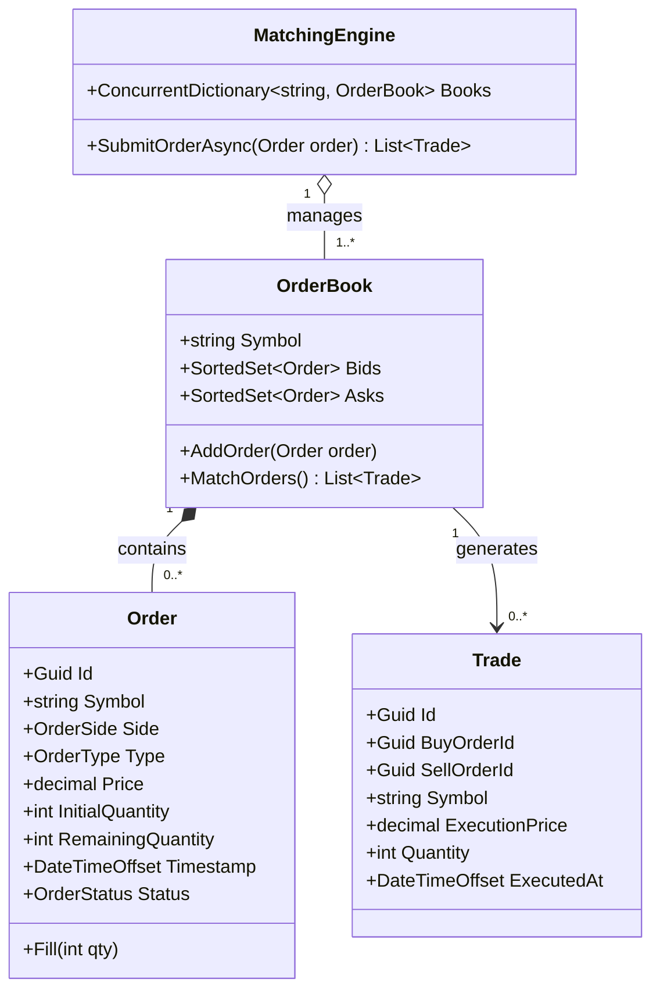
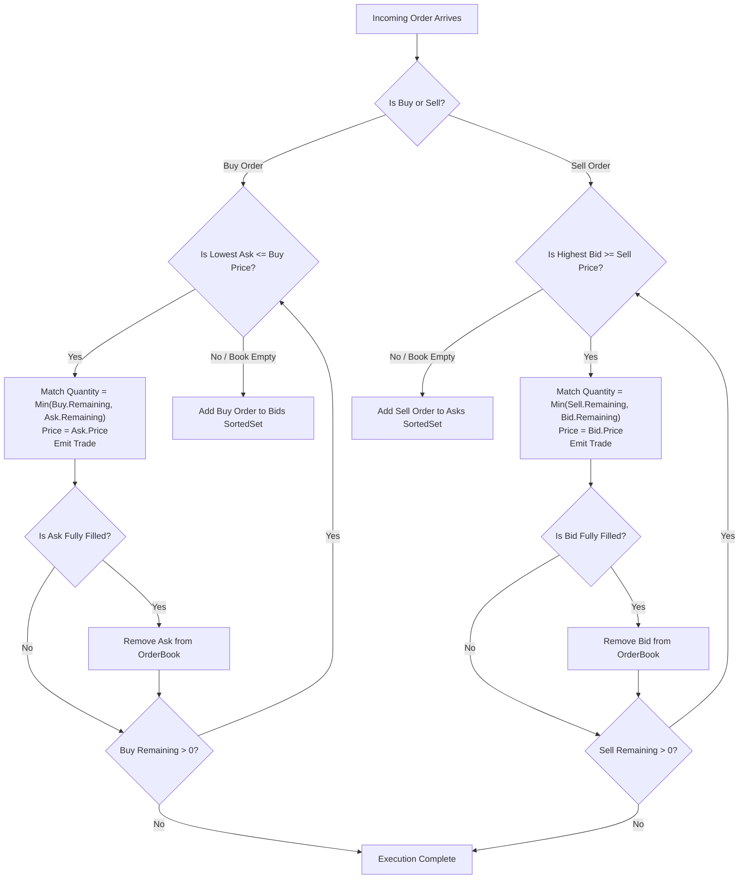

# 23. Stock Exchange Order Matching Engine (Nasdaq Lite)

## 📌 Context
An Order Matching Engine is the beating heart of financial exchanges (Nasdaq, NYSE, Binance, Zerodha). In senior technical interviews, it evaluates your ability to handle **complex multi-key sorting (Price-Time Priority)**, **efficient data structures ($O(\log N)$ or $O(1)$ operations)**, **partial order fills**, and **high-throughput concurrency**.

---

## 🏗️ 1. Architecture & Price-Time Priority

### The Matching Rule: Price-Time Priority (FIFO)
1. **Best Price First**:
   - For **Buyers (Bids)**: Highest price has highest priority.
   - For **Sellers (Asks)**: Lowest price has highest priority.
2. **Earliest Time First**:
   - If two orders have the exact same price, the order placed earlier gets matched first.
3. **Match Condition**:
   - A trade occurs whenever: $\text{Highest Bid Price} \ge \text{Lowest Ask Price}$.



---

## 💻 2. Domain Models & Comparers

```csharp
public enum OrderSide { Buy, Sell }
public enum OrderType { Limit, Market }
public enum OrderStatus { Open, PartiallyFilled, Filled, Cancelled }

public class Order
{
    public Guid Id { get; private set; }
    public string Symbol { get; private set; }
    public OrderSide Side { get; private set; }
    public OrderType Type { get; private set; }
    public decimal Price { get; private set; }
    public int InitialQuantity { get; private set; }
    public int RemainingQuantity { get; private set; }
    public DateTimeOffset Timestamp { get; private set; }
    public OrderStatus Status { get; private set; }

    public Order(string symbol, OrderSide side, OrderType type, decimal price, int quantity)
    {
        if (quantity <= 0) throw new ArgumentException("Quantity must be positive.");
        if (type == OrderType.Limit && price <= 0) throw new ArgumentException("Limit orders require a positive price.");

        Id = Guid.NewGuid();
        Symbol = symbol.ToUpperInvariant();
        Side = side;
        Type = type;
        Price = price;
        InitialQuantity = quantity;
        RemainingQuantity = quantity;
        Timestamp = DateTimeOffset.UtcNow;
        Status = OrderStatus.Open;
    }

    public void Fill(int filledQuantity)
    {
        if (filledQuantity > RemainingQuantity)
            throw new InvalidOperationException("Cannot fill more than remaining quantity.");

        RemainingQuantity -= filledQuantity;
        Status = RemainingQuantity == 0 ? OrderStatus.Filled : OrderStatus.PartiallyFilled;
    }

    public void Cancel()
    {
        if (Status == OrderStatus.Filled)
            throw new InvalidOperationException("Cannot cancel an already filled order.");
        Status = OrderStatus.Cancelled;
    }
}

public record Trade(
    Guid Id, 
    Guid BuyOrderId, 
    Guid SellOrderId, 
    string Symbol, 
    decimal Price, 
    int Quantity, 
    DateTimeOffset ExecutedAt);
```

### Price-Time Comparers for the Order Book
```csharp
// Bids: Descending by Price, then Ascending by Timestamp, then Id tie-breaker
public class BidOrderComparer : IComparer<Order>
{
    public int Compare(Order? x, Order? y)
    {
        if (ReferenceEquals(x, y)) return 0;
        if (x is null) return -1;
        if (y is null) return 1;

        // 1. Highest price first
        int priceComparison = y.Price.CompareTo(x.Price);
        if (priceComparison != 0) return priceComparison;

        // 2. Earliest timestamp first
        int timeComparison = x.Timestamp.CompareTo(y.Timestamp);
        if (timeComparison != 0) return timeComparison;

        // 3. Unique tie-breaker for SortedSet (avoids treating different orders as duplicates)
        return x.Id.CompareTo(y.Id);
    }
}

// Asks: Ascending by Price, then Ascending by Timestamp, then Id tie-breaker
public class AskOrderComparer : IComparer<Order>
{
    public int Compare(Order? x, Order? y)
    {
        if (ReferenceEquals(x, y)) return 0;
        if (x is null) return 1;
        if (y is null) return -1;

        // 1. Lowest price first
        int priceComparison = x.Price.CompareTo(y.Price);
        if (priceComparison != 0) return priceComparison;

        // 2. Earliest timestamp first
        int timeComparison = x.Timestamp.CompareTo(y.Timestamp);
        if (timeComparison != 0) return timeComparison;

        return x.Id.CompareTo(y.Id);
    }
}
```

---

## ⚡ 3. The OrderBook & Matching Logic

```csharp
public class OrderBook
{
    public string Symbol { get; }
    private readonly SortedSet<Order> _bids = new(new BidOrderComparer());
    private readonly SortedSet<Order> _asks = new(new AskOrderComparer());
    private readonly object _bookLock = new();

    public OrderBook(string symbol)
    {
        Symbol = symbol.ToUpperInvariant();
    }

    public List<Trade> ProcessOrder(Order incomingOrder)
    {
        var executedTrades = new List<Trade>();

        lock (_bookLock)
        {
            if (incomingOrder.Side == OrderSide.Buy)
            {
                MatchIncomingBuy(incomingOrder, executedTrades);
            }
            else
            {
                MatchIncomingSell(incomingOrder, executedTrades);
            }

            // If the incoming limit order has remaining volume, place it on the book
            if (incomingOrder.RemainingQuantity > 0 && incomingOrder.Type == OrderType.Limit)
            {
                if (incomingOrder.Side == OrderSide.Buy) _bids.Add(incomingOrder);
                else _asks.Add(incomingOrder);
            }
        }

        return executedTrades;
    }

    private void MatchIncomingBuy(Order buyOrder, List<Trade> trades)
    {
        while (_asks.Count > 0 && buyOrder.RemainingQuantity > 0)
        {
            var bestAsk = _asks.Min!;

            // For Limit order, check if we can cross the spread
            if (buyOrder.Type == OrderType.Limit && buyOrder.Price < bestAsk.Price)
                break; // No match possible

            int matchQuantity = Math.Min(buyOrder.RemainingQuantity, bestAsk.RemainingQuantity);
            decimal tradePrice = bestAsk.Price; // Maker price takes precedence

            // Execute fill
            buyOrder.Fill(matchQuantity);
            bestAsk.Fill(matchQuantity);

            trades.Add(new Trade(
                Guid.NewGuid(), 
                buyOrder.Id, 
                bestAsk.Id, 
                Symbol, 
                tradePrice, 
                matchQuantity, 
                DateTimeOffset.UtcNow));

            // If maker ask is fully filled, remove from book
            if (bestAsk.RemainingQuantity == 0)
            {
                _asks.Remove(bestAsk);
            }
        }
    }

    private void MatchIncomingSell(Order sellOrder, List<Trade> trades)
    {
        while (_bids.Count > 0 && sellOrder.RemainingQuantity > 0)
        {
            var bestBid = _bids.Min!;

            if (sellOrder.Type == OrderType.Limit && sellOrder.Price > bestBid.Price)
                break; // Sell limit price is higher than highest buyer

            int matchQuantity = Math.Min(sellOrder.RemainingQuantity, bestBid.RemainingQuantity);
            decimal tradePrice = bestBid.Price; // Maker price takes precedence

            sellOrder.Fill(matchQuantity);
            bestBid.Fill(matchQuantity);

            trades.Add(new Trade(
                Guid.NewGuid(), 
                bestBid.Id, 
                sellOrder.Id, 
                Symbol, 
                tradePrice, 
                matchQuantity, 
                DateTimeOffset.UtcNow));

            if (bestBid.RemainingQuantity == 0)
            {
                _bids.Remove(bestBid);
            }
        }
    }
}
```

---

## 🔄 4. Order Book Matching Flowchart



---

## 🗣️ Interviewer Discussion & Tradeoffs

**Interviewer:** *"Why did you use `SortedSet<T>` instead of a Priority Queue / Binary Heap?"*
**You:** "`SortedSet` in .NET is a Red-Black tree providing $O(\log N)$ insertions, removals, and min/max queries. While a binary heap (`PriorityQueue<TElement, TPriority>`) has $O(1)$ peek and $O(\log N)$ push/pop, a standard heap **does not support efficient $O(\log N)$ arbitrary order cancellations**. In an exchange, traders cancel up to 90% of their limit orders before execution. `SortedSet.Remove(order)` runs in $O(\log N)$, whereas finding and removing an element inside a heap requires an $O(N)$ linear scan."

**Interviewer:** *"How do institutional exchanges (like Nasdaq or LMAX) achieve millions of orders per second with sub-millisecond latency?"*
**You:** "They do not use tree nodes or locks. Instead, they use:
1. **The LMAX Disruptor Pattern**: A single-threaded, lock-free ring buffer pinned to a dedicated CPU core using CPU cache-line padding to eliminate false sharing.
2. **Bucket-per-Price Array (Price Ladder)**: Since stock prices have fixed ticks (e.g., \$0.01 increments), an array or indexed hash map of Doubly Linked Lists represents each price point. Insertion and cancellation within a price point becomes $O(1)$!
3. **Zero Allocation**: No garbage collection; orders and trade events are pre-allocated in ring buffer memory pools."

**Interviewer:** *"What happens if a Market Order arrives but the order book is empty?"*
**You:** "A Market order has no limit price; it demands immediate liquidity. If the book is empty or has insufficient depth, the order either:
1. **Fills partially** and the remaining unfilled quantity is cancelled immediately (IOC - Immediate or Cancel).
2. **Rejects immediately** with an error ('No market liquidity') so the trader doesn't suffer extreme price slippage."

