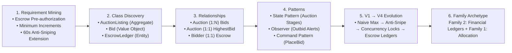
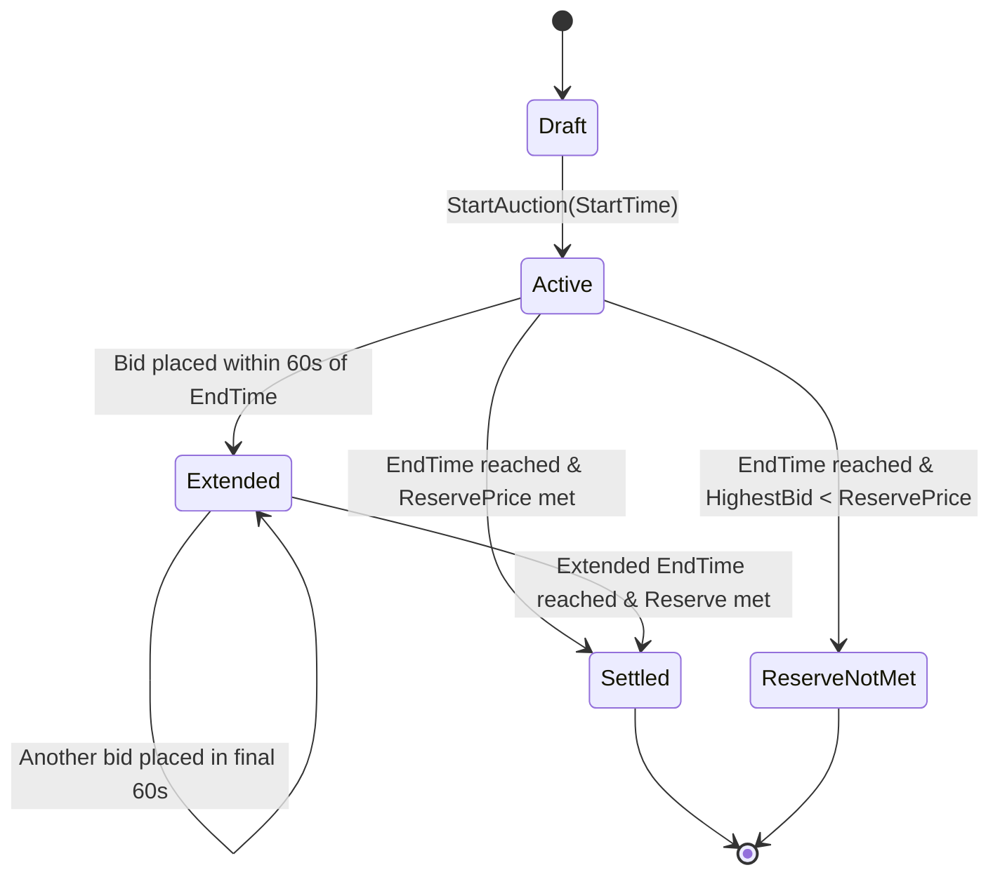

# 26. Online Auction & Real-Time Bidding System (eBay / Sotheby's Lite)

## 📌 Problem Context & Motivation
An **Online Real-Time Auction System** is one of the most intellectually demanding Senior/Staff LLD questions (asked at eBay, Amazon, StockX, Uber). It challenges candidates across multiple critical architectural axes:
1. **Financial Escrow & Double-Entry Integrity**: Bidders must have funds pre-authorized/held; when outbid, holds must be immediately released without deadlocks.
2. **Atomic High-Contention Bidding (CAS / Concurrency)**: Hundreds of bidders submit simultaneous bids in the final seconds. Bids must be validated atomically against the current highest bid + minimum increment.
3. **Dynamic Time Extension ("Anti-Sniping" Rule)**: If a bid arrives in the final 60 seconds, the auction dynamically extends by 2 minutes to prevent bot sniping.
4. **Lifecycle State Machine**: Transitions through `Draft` $\rightarrow$ `Active` $\rightarrow$ `Extended` $\rightarrow$ `EndedPendingSettlement` $\rightarrow$ `Settled` or `ReserveNotMet`.

---

## 🎯 CrackingWalnuts 6-Step Methodology Applied



---

## 🏗️ State Machine Diagram



---

## 💻 Production-Ready C# Implementation (.NET 8)

```csharp
using System;
using System.Collections.Concurrent;
using System.Collections.Generic;
using System.Linq;
using System.Threading;
using System.Threading.Tasks;

namespace OnlineAuction.Design;

// ==========================================
// 1. DOMAIN VALUE OBJECTS & ENUMS
// ==========================================

public enum AuctionState
{
    Draft,
    Active,
    Extended,
    Settled,
    ReserveNotMet,
    Cancelled
}

public readonly record struct Money(decimal Amount, string Currency)
{
    public static Money Zero(string currency = "USD") => new(0m, currency);

    public static Money operator +(Money a, Money b)
    {
        ValidateCurrency(a, b);
        return new Money(a.Amount + b.Amount, a.Currency);
    }

    public static Money operator -(Money a, Money b)
    {
        ValidateCurrency(a, b);
        return new Money(a.Amount - b.Amount, a.Currency);
    }

    public static bool operator >(Money a, Money b)
    {
        ValidateCurrency(a, b);
        return a.Amount > b.Amount;
    }

    public static bool operator <(Money a, Money b)
    {
        ValidateCurrency(a, b);
        return a.Amount < b.Amount;
    }

    public static bool operator >=(Money a, Money b)
    {
        ValidateCurrency(a, b);
        return a.Amount >= b.Amount;
    }

    public static bool operator <=(Money a, Money b)
    {
        ValidateCurrency(a, b);
        return a.Amount <= b.Amount;
    }

    private static void ValidateCurrency(Money a, Money b)
    {
        if (!string.Equals(a.Currency, b.Currency, StringComparison.OrdinalIgnoreCase))
            throw new InvalidOperationException($"Currency mismatch: {a.Currency} vs {b.Currency}");
    }
}

public sealed record Bid(string BidderId, Money Amount, DateTime Timestamp);

// ==========================================
// 2. RESULT ERROR MODEL
// ==========================================

public sealed class Result<T>
{
    public bool IsSuccess { get; }
    public T? Value { get; }
    public string? Error { get; }

    private Result(bool isSuccess, T? value, string? error)
    {
        IsSuccess = isSuccess;
        Value = value;
        Error = error;
    }

    public static Result<T> Ok(T value) => new(true, value, null);
    public static Result<T> Fail(string error) => new(false, default, error);
}

// ==========================================
// 3. ESCROW LEDGER (Financial Guarantee)
// ==========================================

public interface IEscrowService
{
    Task<bool> HoldFundsAsync(string bidderId, Money amount);
    Task ReleaseHoldAsync(string bidderId, Money amount);
    Task SettleFundsAsync(string bidderId, string sellerId, Money amount);
}

public sealed class InMemoryEscrowService : IEscrowService
{
    private readonly ConcurrentDictionary<string, decimal> _balances = new();
    private readonly ConcurrentDictionary<string, decimal> _holds = new();

    public void Deposit(string accountId, decimal amount)
    {
        _balances.AddOrUpdate(accountId, amount, (_, cur) => cur + amount);
    }

    public Task<bool> HoldFundsAsync(string bidderId, Money amount)
    {
        lock (_balances)
        {
            var bal = _balances.GetValueOrDefault(bidderId, 0m);
            var held = _holds.GetValueOrDefault(bidderId, 0m);
            var available = bal - held;

            if (available < amount.Amount)
                return Task.FromResult(false);

            _holds[bidderId] = held + amount.Amount;
            return Task.FromResult(true);
        }
    }

    public Task ReleaseHoldAsync(string bidderId, Money amount)
    {
        lock (_balances)
        {
            var held = _holds.GetValueOrDefault(bidderId, 0m);
            _holds[bidderId] = Math.Max(0m, held - amount.Amount);
            return Task.CompletedTask;
        }
    }

    public Task SettleFundsAsync(string bidderId, string sellerId, Money amount)
    {
        lock (_balances)
        {
            _holds[bidderId] -= amount.Amount;
            _balances[bidderId] -= amount.Amount;
            _balances[sellerId] = _balances.GetValueOrDefault(sellerId, 0m) + amount.Amount;
            return Task.CompletedTask;
        }
    }
}

// ==========================================
// 4. AUCTION LISTING AGGREGATE ROOT
// ==========================================

public sealed class AuctionListing
{
    public string Id { get; }
    public string SellerId { get; }
    public string ItemTitle { get; }
    public Money ReservePrice { get; }
    public Money MinIncrement { get; }
    public DateTime EndTime { get; private set; }
    public AuctionState State { get; private set; }

    public Bid? HighestBid { get; private set; }
    private readonly List<Bid> _bidHistory = new();
    public IReadOnlyList<Bid> BidHistory => _bidHistory.AsReadOnly();

    // Lock per auction listing to isolate concurrency
    public SemaphoreSlim GateLock { get; } = new(1, 1);

    // Anti-sniping parameters
    private static readonly TimeSpan SnipingThreshold = TimeSpan.FromSeconds(60);
    private static readonly TimeSpan ExtensionWindow = TimeSpan.FromMinutes(2);

    public AuctionListing(
        string id,
        string sellerId,
        string itemTitle,
        Money startingPrice,
        Money reservePrice,
        Money minIncrement,
        DateTime endTime)
    {
        Id = id;
        SellerId = sellerId;
        ItemTitle = itemTitle;
        ReservePrice = reservePrice;
        MinIncrement = minIncrement;
        EndTime = endTime;
        State = AuctionState.Active;
        HighestBid = new Bid("SELLER_ORIGIN", startingPrice, DateTime.UtcNow);
    }

    public Result<Bid> PlaceBid(string bidderId, Money bidAmount, DateTime now)
    {
        if (State != AuctionState.Active && State != AuctionState.Extended)
            return Result<Bid>.Fail($"Auction is not active. Current state: {State}");

        if (now > EndTime)
        {
            EvaluateConclusion(now);
            return Result<Bid>.Fail("Auction has ended.");
        }

        if (string.Equals(bidderId, SellerId, StringComparison.OrdinalIgnoreCase))
            return Result<Bid>.Fail("Seller cannot bid on their own item.");

        var currentHighest = HighestBid!.Amount;
        var minRequired = currentHighest + MinIncrement;

        if (bidAmount < minRequired)
            return Result<Bid>.Fail($"Bid amount {bidAmount.Amount} is below required minimum {minRequired.Amount}");

        // Valid bid accepted
        var newBid = new Bid(bidderId, bidAmount, now);
        _bidHistory.Add(newBid);
        HighestBid = newBid;

        // Anti-Sniping dynamic extension check
        if (EndTime - now <= SnipingThreshold)
        {
            EndTime = now + ExtensionWindow;
            State = AuctionState.Extended;
            Console.WriteLine($"⏱️ [ANTI-SNIPING TRIGGERED]: Auction {Id} extended by 2 minutes! New end: {EndTime:HH:mm:ss}");
        }

        return Result<Bid>.Ok(newBid);
    }

    public void EvaluateConclusion(DateTime now)
    {
        if (now < EndTime) return;

        if (HighestBid != null && HighestBid.Amount >= ReservePrice && HighestBid.BidderId != "SELLER_ORIGIN")
        {
            State = AuctionState.Settled;
        }
        else
        {
            State = AuctionState.ReserveNotMet;
        }
    }
}

// ==========================================
// 5. AUCTION ENGINE ORCHESTRATOR
// ==========================================

public interface IAuctionNotifier
{
    Task NotifyOutbidAsync(string bidderId, string auctionId, Money newHighest);
    Task NotifyWinnerAsync(string winnerId, string auctionId, Money finalPrice);
}

public sealed class ConsoleAuctionNotifier : IAuctionNotifier
{
    public Task NotifyOutbidAsync(string bidderId, string auctionId, Money newHighest)
    {
        Console.WriteLine($"🔔 [OUTBID ALERT to {bidderId}]: You were outbid on Auction '{auctionId}'! Current high: ${newHighest.Amount}");
        return Task.CompletedTask;
    }

    public Task NotifyWinnerAsync(string winnerId, string auctionId, Money finalPrice)
    {
        Console.WriteLine($"🏆 [WINNER ALERT to {winnerId}]: Congratulations! You won Auction '{auctionId}' for ${finalPrice.Amount}");
        return Task.CompletedTask;
    }
}

public sealed class AuctionEngine
{
    private readonly ConcurrentDictionary<string, AuctionListing> _auctions = new();
    private readonly IEscrowService _escrowService;
    private readonly IAuctionNotifier _notifier;

    public AuctionEngine(IEscrowService escrowService, IAuctionNotifier notifier)
    {
        _escrowService = escrowService;
        _notifier = notifier;
    }

    public void RegisterAuction(AuctionListing listing)
    {
        _auctions[listing.Id] = listing;
    }

    public async Task<Result<Bid>> SubmitBidAsync(string auctionId, string bidderId, Money bidAmount)
    {
        if (!_auctions.TryGetValue(auctionId, out var auction))
            return Result<Bid>.Fail("Auction not found.");

        // 1. Pre-authorize escrow hold before taking auction lock
        bool holdSuccess = await _escrowService.HoldFundsAsync(bidderId, bidAmount);
        if (!holdSuccess)
            return Result<Bid>.Fail("Insufficient available funds for escrow hold.");

        Bid? previousHighestBid = null;
        Result<Bid> bidResult;

        // 2. Lock specific auction to protect bid rank invariants
        await auction.GateLock.WaitAsync();
        try
        {
            previousHighestBid = auction.HighestBid;
            bidResult = auction.PlaceBid(bidderId, bidAmount, DateTime.UtcNow);

            if (!bidResult.IsSuccess)
            {
                // Refund hold on failed placement
                await _escrowService.ReleaseHoldAsync(bidderId, bidAmount);
                return bidResult;
            }
        }
        finally
        {
            auction.GateLock.Release();
        }

        // 3. Post-bid async side effects: Release previous bidder's escrow hold & notify
        if (previousHighestBid != null && previousHighestBid.BidderId != "SELLER_ORIGIN")
        {
            await _escrowService.ReleaseHoldAsync(previousHighestBid.BidderId, previousHighestBid.Amount);
            await _notifier.NotifyOutbidAsync(previousHighestBid.BidderId, auction.Id, bidAmount);
        }

        return bidResult;
    }

    public async Task ConcludeAuctionAsync(string auctionId)
    {
        if (!_auctions.TryGetValue(auctionId, out var auction))
            return;

        await auction.GateLock.WaitAsync();
        try
        {
            auction.EvaluateConclusion(DateTime.UtcNow.AddMinutes(5)); // Force conclusion
            if (auction.State == AuctionState.Settled && auction.HighestBid != null)
            {
                await _escrowService.SettleFundsAsync(auction.HighestBid.BidderId, auction.SellerId, auction.HighestBid.Amount);
                await _notifier.NotifyWinnerAsync(auction.HighestBid.BidderId, auction.Id, auction.HighestBid.Amount);
            }
        }
        finally
        {
            auction.GateLock.Release();
        }
    }
}

// ==========================================
// 6. VERIFICATION DRIVER (Program.cs)
// ==========================================

public static class Program
{
    public static async Task Main()
    {
        Console.WriteLine("=== 🔨 HIGH-PERFORMANCE REAL-TIME AUCTION SYSTEM ===\n");

        var escrow = new InMemoryEscrowService();
        var notifier = new ConsoleAuctionNotifier();
        var engine = new AuctionEngine(escrow, notifier);

        // Pre-fund bidder wallets
        escrow.Deposit("bidder_alice", 5000m);
        escrow.Deposit("bidder_bob", 7000m);
        escrow.Deposit("bidder_carol", 10000m);

        // Create an auction: Rare Rolex Watch
        var auction = new AuctionListing(
            id: "AUC-ROLEX-01",
            sellerId: "seller_john",
            itemTitle: "1968 Vintage Rolex Submariner",
            startingPrice: new Money(1000m, "USD"),
            reservePrice: new Money(2500m, "USD"),
            minIncrement: new Money(100m, "USD"),
            endTime: DateTime.UtcNow.AddSeconds(30) // Ending soon to test anti-sniping
        );
        engine.RegisterAuction(auction);

        // 1. First Bid by Alice ($1,200)
        Console.WriteLine("Alice bids $1,200...");
        var r1 = await engine.SubmitBidAsync(auction.Id, "bidder_alice", new Money(1200m, "USD"));
        Console.WriteLine($"Alice Bid Success: {r1.IsSuccess}, Highest: ${auction.HighestBid?.Amount.Amount}\n");

        // 2. Outbid by Bob ($1,500) -> Alice outbid notification & escrow release
        Console.WriteLine("Bob bids $1,500...");
        var r2 = await engine.SubmitBidAsync(auction.Id, "bidder_bob", new Money(1500m, "USD"));
        Console.WriteLine($"Bob Bid Success: {r2.IsSuccess}, Highest: ${auction.HighestBid?.Amount.Amount}\n");

        // 3. Sniper Bid: Carol bids in final 30 seconds -> Triggers anti-sniping extension
        Console.WriteLine("Carol bids $3,000 at T-30s (Sniping attempt)...");
        var r3 = await engine.SubmitBidAsync(auction.Id, "bidder_carol", new Money(3000m, "USD"));
        Console.WriteLine($"Carol Bid Success: {r3.IsSuccess}, New State: {auction.State}\n");

        // 4. Invalid Bid: Alice tries to bid $3,050 (Minimum increment is $100 -> requires $3,100)
        Console.WriteLine("Alice tries to bid $3,050 (Below minimum increment)...");
        var r4 = await engine.SubmitBidAsync(auction.Id, "bidder_alice", new Money(3050m, "USD"));
        Console.WriteLine($"Alice Bid Success: {r4.IsSuccess}, Error: '{r4.Error}'\n");

        // 5. Conclude auction and settle funds
        Console.WriteLine("Concluding auction and transferring escrow...");
        await engine.ConcludeAuctionAsync(auction.Id);

        Console.WriteLine("\n=== Auction executed and settled without financial discrepancy ===");
    }
}
```

---

## 🗣️ Interviewer Discussion & Trade-offs (Staff Level)

| Question / Follow-up | Senior / Staff Engineering Defense |
| :--- | :--- |
| **"How do you prevent deadlocks during high-concurrency bid placement?"** | Notice our lock acquisition ordering: we pre-hold escrow funds first, *then* acquire the `AuctionListing.GateLock`. We never hold multiple auction locks simultaneously. When outbid, the previous bidder's escrow release occurs **after** releasing the auction lock, ensuring zero circular hold-and-wait deadlock conditions. |
| **"What if the network connection fails between holding escrow and updating the bid?"** | We use a `try / finally` pattern where failure in `PlaceBid` immediately triggers `ReleaseHoldAsync`. In distributed production, we use a two-phase Saga or Redis RedLock with a short TTL (e.g., 5 seconds) on the escrow hold reservation. |
| **"How do you protect the auction from infinite anti-sniping extension loops?"** | We enforce a hard ceiling: `MaxAuctionDuration` (e.g., maximum 30 minutes of extensions). Once the hard cap is reached, no further time extensions are granted, and the auction closes strictly at the hard cap timestamp. |
| **"Why In-Memory Locks vs. Distributed DB Locks?"** | For 5,000 bids/second in the final 10 seconds of a celebrity auction, database row locking (`SELECT ... FOR UPDATE`) creates catastrophic DB connection pool exhaustion. We keep the active bidding state in an in-memory Redis cluster or actor model (Akka.NET/Orleans) with single-threaded partition mailboxes, writing to the persistent database asynchronously via the Outbox Pattern. |

