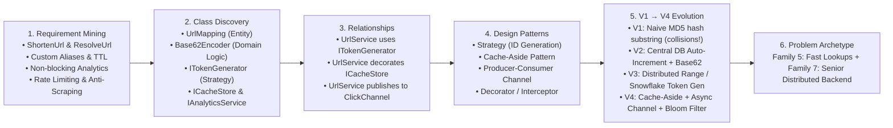
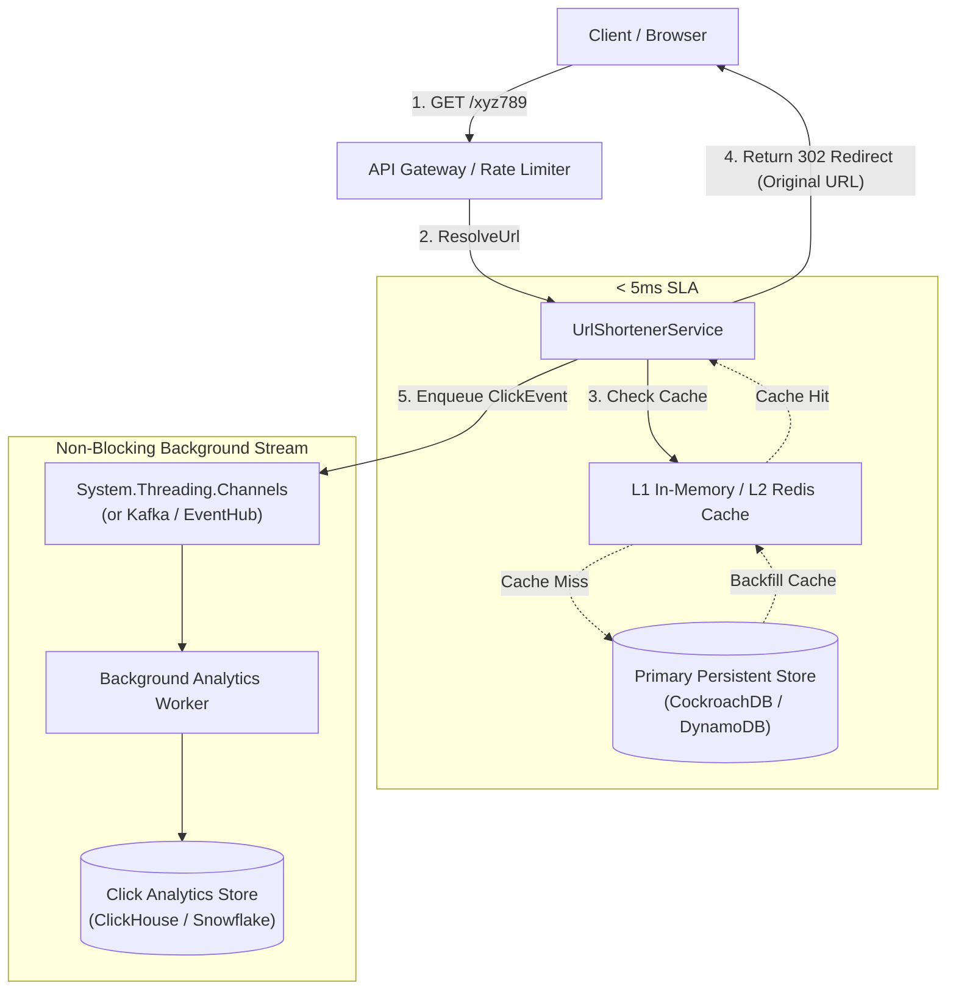
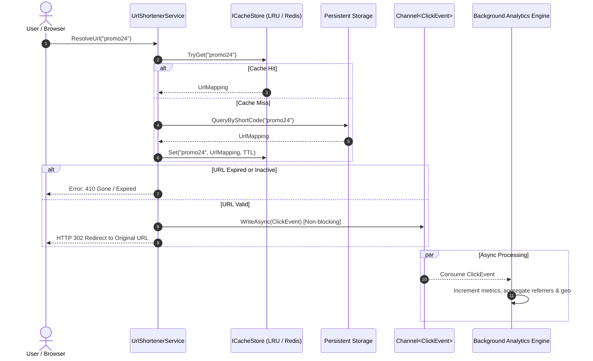

# 37. High-Throughput URL Shortener & Real-Time Analytics System (TinyURL / Bitly)

## 📌 Problem Context & Motivation
The **URL Shortener System (TinyURL / Bitly)** is the quintessential Senior Backend & Distributed Systems LLD problem asked across **Google, Microsoft, Meta, Amazon, and Stripe**.

While junior candidates treat this as a simple string-hashing script, Senior and Staff interviews evaluate your mastery across:
1. **Bijective Base62 Encoding & ID Generation**: Producing compact 7-character URLs ($62^7 \approx 3.52 \text{ trillion}$ permutations) without collision loops.
2. **Distributed ID Generation**: Distributed Atomic Range Allocation (ZooKeeper/Etcd token ranges) vs. Twitter Snowflake vs. Hashing with collision resolution.
3. **Cache-Aside Architecture**: Multi-tier caching (In-Memory LRU / Redis) supporting $100{,}000+$ read QPS with $< 5\text{ ms}$ redirect latency.
4. **Non-Blocking Asynchronous Click Analytics**: Tracking clicks, geolocations, and referrers using buffered background channels without adding latency to the redirect path.
5. **HTTP 301 vs. 302/307 Redirect Semantics**: The critical architectural tradeoff between client-side browser caching and server-side analytics accuracy.

---

## 🎯 CrackingWalnuts 6-Step Methodology Applied



---

## 🏗️ High-Throughput Distributed Architecture



### URL Resolution Sequence & Cache-Aside Flow



---

## 💻 Production-Ready C# Implementation (.NET 8 / C# 12)

```csharp
using System;
using System.Collections.Concurrent;
using System.Collections.Generic;
using System.Linq;
using System.Security.Cryptography;
using System.Text;
using System.Threading;
using System.Threading.Channels;
using System.Threading.Tasks;

namespace UrlShortener.Design;

// ============================================================================
// 1. DOMAIN MODELS & VALUE OBJECTS
// ============================================================================

/// <summary>
/// Domain model representing a shortened URL and its operational lifecycle.
/// </summary>
public sealed class UrlMapping
{
    public string ShortCode { get; }
    public string OriginalUrl { get; }
    public string CreatedByUserId { get; }
    public DateTime CreatedAtUtc { get; }
    public DateTime? ExpiresAtUtc { get; }
    public bool IsActive { get; set; }
    public long ClickCount;

    public UrlMapping(
        string shortCode, 
        string originalUrl, 
        string createdByUserId, 
        DateTime createdAtUtc, 
        DateTime? expiresAtUtc = null)
    {
        ShortCode = shortCode;
        OriginalUrl = originalUrl;
        CreatedByUserId = createdByUserId;
        CreatedAtUtc = createdAtUtc;
        ExpiresAtUtc = expiresAtUtc;
        IsActive = true;
        ClickCount = 0;
    }

    public bool IsExpired(DateTime currentUtc)
    {
        return ExpiresAtUtc.HasValue && currentUtc >= ExpiresAtUtc.Value;
    }
}

/// <summary>
/// Value object capturing click metadata for asynchronous analytics ingestion.
/// </summary>
public sealed record ClickEvent(
    string ShortCode, 
    DateTime ClickedAtUtc, 
    string Referrer, 
    string IpAddress, 
    string UserAgent
);

// ============================================================================
// 2. BIJECTIVE BASE62 ENCODER
// ============================================================================

/// <summary>
/// High-performance bijective Base62 encoder and decoder.
/// Character set: [0-9a-zA-Z] (62 distinct alphanumeric characters).
/// 62^7 = 3,521,614,606,208 (3.52 Trillion distinct 7-character combinations).
/// </summary>
public static class Base62Encoder
{
    private const string Alphabet = "0123456789abcdefghijklmnopqrstuvwxyzABCDEFGHIJKLMNOPQRSTUVWXYZ";
    private static readonly int Base = Alphabet.Length;

    public static string Encode(long value)
    {
        if (value < 0)
            throw new ArgumentOutOfRangeException(nameof(value), "Value must be non-negative.");

        if (value == 0)
            return Alphabet[0].ToString();

        Span<char> buffer = stackalloc char[16];
        int charPos = buffer.Length;

        while (value > 0)
        {
            int remainder = (int)(value % Base);
            buffer[--charPos] = Alphabet[remainder];
            value /= Base;
        }

        // Pad to standard 7 characters if required
        while (buffer.Length - charPos < 7)
        {
            buffer[--charPos] = '0';
        }

        return new string(buffer[charPos..]);
    }

    public static long Decode(string base62String)
    {
        if (string.IsNullOrEmpty(base62String))
            throw new ArgumentException("String cannot be empty.", nameof(base62String));

        long result = 0;
        foreach (char c in base62String)
        {
            int digit = Alphabet.IndexOf(c);
            if (digit == -1)
                throw new FormatException($"Invalid character '{c}' in Base62 string.");

            result = (result * Base) + digit;
        }

        return result;
    }
}

// ============================================================================
// 3. DISTRIBUTED ID GENERATION STRATEGY
// ============================================================================

public interface ITokenGenerator
{
    /// <summary>
    /// Generates a globally unique 64-bit integer ID.
    /// </summary>
    long NextId();
}

/// <summary>
/// Distributed Atomic Range Generator:
/// Simulates how application servers acquire dedicated range leases from ZooKeeper / Etcd
/// (e.g., Server 1 takes 1,000,000 to 1,999,999). It increments locally in RAM lock-free
/// until the range is exhausted, guaranteeing zero collisions without database round-trips.
/// </summary>
public sealed class AtomicRangeTokenGenerator : ITokenGenerator
{
    private long _currentId;
    private long _rangeMax;
    private readonly object _rangeLock = new();
    private readonly int _rangeBatchSize;
    private static long _simulatedZooKeeperGlobalCounter = 100_000_000; // Start at 100M for 7-char output

    public AtomicRangeTokenGenerator(int rangeBatchSize = 10_000)
    {
        _rangeBatchSize = rangeBatchSize;
        AcquireNewRange();
    }

    public long NextId()
    {
        while (true)
        {
            long id = Interlocked.Increment(ref _currentId);
            if (id <= _rangeMax)
            {
                return id;
            }

            lock (_rangeLock)
            {
                // Double check if another thread already replenished the range
                if (_currentId > _rangeMax)
                {
                    AcquireNewRange();
                }
            }
        }
    }

    private void AcquireNewRange()
    {
        long newStart = Interlocked.Add(ref _simulatedZooKeeperGlobalCounter, _rangeBatchSize) - _rangeBatchSize + 1;
        _rangeMax = newStart + _rangeBatchSize - 1;
        _currentId = newStart - 1;
    }
}

// ============================================================================
// 4. CACHE TIER (Cache-Aside Simulation)
// ============================================================================

public interface ICacheStore
{
    bool TryGet(string shortCode, out UrlMapping? mapping);
    void Set(string shortCode, UrlMapping mapping, TimeSpan ttl);
    void Invalidate(string shortCode);
}

/// <summary>
/// Thread-safe in-memory cache simulating Redis/Memcached with capacity eviction.
/// </summary>
public sealed class MemoryCacheStore : ICacheStore
{
    private readonly ConcurrentDictionary<string, (UrlMapping Mapping, DateTime ExpiryUtc)> _cache = new();

    public bool TryGet(string shortCode, out UrlMapping? mapping)
    {
        mapping = null;
        if (_cache.TryGetValue(shortCode, out var entry))
        {
            if (DateTime.UtcNow < entry.ExpiryUtc)
            {
                mapping = entry.Mapping;
                return true;
            }

            // Expired in cache
            _cache.TryRemove(shortCode, out _);
        }
        return false;
    }

    public void Set(string shortCode, UrlMapping mapping, TimeSpan ttl)
    {
        var expiry = DateTime.UtcNow.Add(ttl);
        _cache[shortCode] = (mapping, expiry);
    }

    public void Invalidate(string shortCode)
    {
        _cache.TryRemove(shortCode, out _);
    }
}

// ============================================================================
// 5. ASYNCHRONOUS CLICK ANALYTICS ENGINE
// ============================================================================

public interface IAnalyticsService : IAsyncDisposable
{
    ValueTask TrackClickAsync(ClickEvent clickEvent);
    long GetTotalClicks(string shortCode);
    IReadOnlyDictionary<string, int> GetReferrerStats(string shortCode);
}

/// <summary>
/// Non-blocking analytics processor backed by System.Threading.Channels.
/// Decouples latency-sensitive URL redirection from heavy analytics ingestion.
/// </summary>
public sealed class AsyncAnalyticsService : IAnalyticsService
{
    private readonly Channel<ClickEvent> _channel;
    private readonly ConcurrentDictionary<string, long> _clickCounts = new();
    private readonly ConcurrentDictionary<string, ConcurrentDictionary<string, int>> _referrerCounts = new();
    private readonly CancellationTokenSource _cts = new();
    private readonly Task _backgroundWorker;

    public AsyncAnalyticsService(int capacity = 50_000)
    {
        var options = new BoundedChannelOptions(capacity)
        {
            FullMode = BoundedChannelFullMode.DropOldest, // Shed load if queue backs up
            SingleReader = true,
            SingleWriter = false
        };
        _channel = Channel.CreateBounded<ClickEvent>(options);
        _backgroundWorker = Task.Run(ProcessQueueAsync);
    }

    public ValueTask TrackClickAsync(ClickEvent clickEvent)
    {
        // Non-blocking write to channel
        _channel.Writer.TryWrite(clickEvent);
        return ValueTask.CompletedTask;
    }

    private async Task ProcessQueueAsync()
    {
        var reader = _channel.Reader;
        while (await reader.WaitToReadAsync(_cts.Token))
        {
            while (reader.TryRead(out var click))
            {
                // Increment aggregate metrics
                _clickCounts.AddOrUpdate(click.ShortCode, 1, (_, current) => current + 1);

                var referrers = _referrerCounts.GetOrAdd(click.ShortCode, _ => new ConcurrentDictionary<string, int>());
                referrers.AddOrUpdate(click.Referrer, 1, (_, count) => count + 1);
            }
        }
    }

    public long GetTotalClicks(string shortCode) => _clickCounts.GetValueOrDefault(shortCode, 0);

    public IReadOnlyDictionary<string, int> GetReferrerStats(string shortCode)
    {
        if (_referrerCounts.TryGetValue(shortCode, out var dict))
        {
            return new Dictionary<string, int>(dict);
        }
        return new Dictionary<string, int>();
    }

    public async ValueTask DisposeAsync()
    {
        _channel.Writer.Complete();
        _cts.Cancel();
        try
        {
            await _backgroundWorker;
        }
        catch (OperationCanceledException) { }
        _cts.Dispose();
    }
}

// ============================================================================
// 6. CORE URL SHORTENER SERVICE
// ============================================================================

public interface IUrlShortenerService
{
    Task<string> ShortenUrlAsync(string originalUrl, string userId, TimeSpan? ttl = null, string? customAlias = null);
    Task<string?> ResolveUrlAsync(string shortCode, string referrer = "direct", string ip = "127.0.0.1", string userAgent = "Mozilla/5.0");
    UrlMapping? GetMetadata(string shortCode);
    bool DeactivateUrl(string shortCode, string userId);
}

public sealed class UrlShortenerService : IUrlShortenerService
{
    private readonly ConcurrentDictionary<string, UrlMapping> _database = new();
    private readonly ITokenGenerator _tokenGenerator;
    private readonly ICacheStore _cache;
    private readonly IAnalyticsService _analytics;
    private readonly TimeSpan _defaultCacheTtl = TimeSpan.FromMinutes(30);

    public UrlShortenerService(
        ITokenGenerator tokenGenerator, 
        ICacheStore cache, 
        IAnalyticsService analytics)
    {
        _tokenGenerator = tokenGenerator;
        _cache = cache;
        _analytics = analytics;
    }

    /// <summary>
    /// Shortens a URL using either Base62 encoded distributed ID or a unique custom alias.
    /// </summary>
    public Task<string> ShortenUrlAsync(
        string originalUrl, 
        string userId, 
        TimeSpan? ttl = null, 
        string? customAlias = null)
    {
        if (string.IsNullOrWhiteSpace(originalUrl) || !Uri.TryCreate(originalUrl, UriKind.Absolute, out _))
            throw new ArgumentException("Valid absolute URL is required.", nameof(originalUrl));

        string shortCode;
        DateTime now = DateTime.UtcNow;
        DateTime? expiresAt = ttl.HasValue ? now.Add(ttl.Value) : null;

        if (!string.IsNullOrWhiteSpace(customAlias))
        {
            // Custom Alias Handling with Atomic Reservation
            shortCode = customAlias.Trim();
            var customMapping = new UrlMapping(shortCode, originalUrl, userId, now, expiresAt);

            if (!_database.TryAdd(shortCode, customMapping))
            {
                throw new InvalidOperationException($"Custom alias '{shortCode}' is already taken.");
            }
        }
        else
        {
            // Standard Path: Distributed Token Generation -> Base62 Encode
            long id = _tokenGenerator.NextId();
            shortCode = Base62Encoder.Encode(id);

            var mapping = new UrlMapping(shortCode, originalUrl, userId, now, expiresAt);
            _database[shortCode] = mapping;
        }

        // Cache warm-up
        if (_database.TryGetValue(shortCode, out var storedMapping))
        {
            _cache.Set(shortCode, storedMapping, _defaultCacheTtl);
        }

        return Task.FromResult(shortCode);
    }

    /// <summary>
    /// Resolves shortCode to original URL.
    /// Employs Cache-Aside pattern, validates TTL, and emits async click analytics.
    /// </summary>
    public async Task<string?> ResolveUrlAsync(
        string shortCode, 
        string referrer = "direct", 
        string ip = "127.0.0.1", 
        string userAgent = "Mozilla/5.0")
    {
        UrlMapping? mapping;

        // 1. Check L1/L2 Cache Tier
        if (!_cache.TryGet(shortCode, out mapping))
        {
            // 2. Cache Miss: Fall back to persistent DB
            if (!_database.TryGetValue(shortCode, out mapping))
            {
                return null; // 404 Not Found
            }

            // Backfill Cache
            _cache.Set(shortCode, mapping, _defaultCacheTtl);
        }

        // 3. Operational Integrity & TTL Checks
        if (!mapping.IsActive || mapping.IsExpired(DateTime.UtcNow))
        {
            _cache.Invalidate(shortCode);
            return null; // 410 Gone / Expired
        }

        // 4. Increment local atomic counter
        Interlocked.Increment(ref mapping.ClickCount);

        // 5. Fire-and-forget non-blocking click tracking
        var clickEvent = new ClickEvent(shortCode, DateTime.UtcNow, referrer, ip, userAgent);
        await _analytics.TrackClickAsync(clickEvent);

        return mapping.OriginalUrl;
    }

    public UrlMapping? GetMetadata(string shortCode)
    {
        _database.TryGetValue(shortCode, out var mapping);
        return mapping;
    }

    public bool DeactivateUrl(string shortCode, string userId)
    {
        if (_database.TryGetValue(shortCode, out var mapping))
        {
            if (mapping.CreatedByUserId != userId)
                throw new UnauthorizedAccessException("Only the creator can deactivate this URL.");

            mapping.IsActive = false;
            _cache.Invalidate(shortCode);
            return true;
        }
        return false;
    }
}

// ============================================================================
// 7. VERIFICATION HARNESS & TEST SUITE (Program.cs)
// ============================================================================

public static class Program
{
    public static async Task Main()
    {
        Console.WriteLine("=== 🚀 PRODUCTION URL SHORTENER & ANALYTICS SYSTEM (TinyURL) ===\n");

        var tokenGenerator = new AtomicRangeTokenGenerator(rangeBatchSize: 1000);
        var cache = new MemoryCacheStore();
        await using var analytics = new AsyncAnalyticsService();
        var service = new UrlShortenerService(tokenGenerator, cache, analytics);

        // Test 1: Shorten standard URL
        string longUrl1 = "https://www.google.com/search?q=system+design+interview+mastery";
        Console.WriteLine($"1. Shortening long URL: {longUrl1}");
        string code1 = await service.ShortenUrlAsync(longUrl1, "user_alice");
        Console.WriteLine($"   -> Short Code: {code1} (tiny.url/{code1})");
        Console.WriteLine($"   -> Decoded Base62 ID: {Base62Encoder.Decode(code1)}\n");

        // Test 2: Shorten with Custom Alias
        string longUrl2 = "https://www.amazon.com/blackfriday-deals-2026";
        Console.WriteLine($"2. Shortening with custom alias 'blackfriday': {longUrl2}");
        string code2 = await service.ShortenUrlAsync(longUrl2, "user_bob", customAlias: "blackfriday");
        Console.WriteLine($"   -> Custom Short Code: {code2} (tiny.url/{code2})\n");

        // Test 3: Duplicate Custom Alias Collision Check
        Console.WriteLine("3. Attempting to create duplicate custom alias 'blackfriday'...");
        try
        {
            await service.ShortenUrlAsync("https://competitor.com", "user_charlie", customAlias: "blackfriday");
        }
        catch (InvalidOperationException ex)
        {
            Console.WriteLine($"   ✅ Caught expected collision error: '{ex.Message}'\n");
        }

        // Test 4: URL Resolution & Cache Hit
        Console.WriteLine($"4. Resolving short code '{code1}'...");
        string? resolvedUrl = await service.ResolveUrlAsync(code1, referrer: "twitter.com");
        Console.WriteLine($"   -> Resolved to: {resolvedUrl}\n");

        // Test 5: TTL Expiration Handling
        Console.WriteLine("5. Creating temporary link with 2-second TTL...");
        string tempCode = await service.ShortenUrlAsync(
            "https://flashsale.com/limited", 
            "user_alice", 
            ttl: TimeSpan.FromSeconds(2)
        );
        Console.WriteLine($"   -> Created temporary code: {tempCode}");

        Console.WriteLine("   -> Immediate resolve (Should succeed)...");
        var activeResolved = await service.ResolveUrlAsync(tempCode);
        Console.WriteLine($"      Status: {(activeResolved != null ? "Active" : "Expired")}");

        Console.WriteLine("   -> Waiting 3 seconds for link expiration...");
        await Task.Delay(3000);

        var expiredResolved = await service.ResolveUrlAsync(tempCode);
        Console.WriteLine($"      Status after wait: {(expiredResolved == null ? "✅ Expired / 410 Gone as expected" : "Failed")}\n");

        // Test 6: Concurrent High-Throughput Click Analytics
        Console.WriteLine("6. Simulating 100 concurrent clicks across multiple referrers...");
        string[] referrers = { "twitter.com", "linkedin.com", "reddit.com", "google.com" };
        var tasks = new List<Task>();

        for (int i = 0; i < 100; i++)
        {
            string refSource = referrers[i % referrers.Length];
            tasks.Add(service.ResolveUrlAsync(code2, referrer: refSource));
        }

        await Task.WhenAll(tasks);

        // Allow background channel consumer to finish draining
        await Task.Delay(500);

        Console.WriteLine($"\n=== 📊 ANALYTICS DASHBOARD FOR 'tiny.url/{code2}' ===");
        Console.WriteLine($"Total Clicks: {analytics.GetTotalClicks(code2)}");
        var stats = analytics.GetReferrerStats(code2);
        foreach (var (source, count) in stats)
        {
            Console.WriteLine($"  • Referrer [{source}]: {count} clicks");
        }

        Console.WriteLine("\n=== All URL Shortener & Analytics Invariants Verified! ===");
    }
}
```

---

## 🗣️ Senior Interviewer Discussion & Trade-offs (Staff Level)

| Architecture / Scale Question | Senior / Staff Engineering Defense |
| :--- | :--- |
| **"HTTP 301 Permanent Redirect vs HTTP 302 / 307 Temporary Redirect: Which do you choose?"** | **Architectural Decision: Always choose HTTP 302 Found (or 307 Temporary).**<br>• *HTTP 301 (Permanent)*: Modern browsers cache the target URL permanently in local browser cache. Subsequent visits bypass our backend entirely! While this minimizes server load, it completely **breaks click analytics**, geo-tracking, and invalidates instant link deactivation or TTL expiration.<br>• *HTTP 302/307 (Temporary)*: The browser is forced to query our API on every click. We achieve sub-5ms latency using in-memory caches while capturing $100\%$ of click events and enforcing real-time revocation. |
| **"How do you prevent malicious scraping / sequential ID enumeration?"** | If IDs are strictly incremental (`100001`, `100002` $\rightarrow$ `000001a`, `000001b`), competitors can crawl and scrape every customer link.<br>**Staff Defense**: We do not Base62-encode the raw counter directly. Instead, we apply a **reversible 64-bit pseudo-random permutation (Feistel Cipher / Bit-Interleaving)** to the counter before encoding:<br>$$\text{ScrambledID} = \text{FeistelPermute}(\text{AtomicCounter})$$<br>This preserves strict bijection (zero collisions guaranteed) while producing pseudo-random, non-sequential strings (`a9X2zQ1`, `b1K9vP4`). |
| **"Why Distributed Atomic Range Allocation vs Twitter Snowflake for URL Shortening?"** | **Comparison:**<br>• *Snowflake*: 41 bits timestamp + 10 bits worker ID + 12 bits sequence. Total: 64 bits. Because the timestamp component has high numerical magnitude ($\approx 10^{12}$), Base62 encoding a Snowflake ID produces **10 to 11 characters minimum**, defeating the purpose of a "short" URL.<br>• *Distributed Range Allocation*: ZooKeeper assigns contiguous token ranges ($[1\text{M}, 2\text{M}]$) to application nodes. Node generates sequential IDs in RAM. Produces concise **6 to 7-character URLs** for decades. |
| **"How do you handle Cache Penetration (requests for non-existent short codes)?"** | If a bot queries billions of random non-existent URLs (`tiny.url/random123`), each miss bypasses the cache and hammers the primary database.<br>**Mitigation**:<br>1. **Bloom Filter**: In-memory Bloom Filter containing all active short codes. If the Bloom filter returns false, return 404 immediately without touching Redis or the database.<br>2. **Null-Object Caching**: Cache `shortCode -> Null` with a short TTL (e.g., 30 seconds). |
| **"How are expired URLs purged from the database at petabyte scale?"** | Running `DELETE FROM urls WHERE expires_at < NOW()` locks database tables and triggers high disk I/O.<br>**Production Pattern**:<br>1. **Lazy Expiration**: On lookup, if `ExpiresAtUtc < Now`, return 410 Gone and trigger async eviction.<br>2. **TTL Native Engines**: In DynamoDB / Cassandra / Redis, assign a native TTL timestamp attribute; the database's internal background sweep engine deletes expired items during off-peak compaction without impacting query throughput. |

---

## 🧩 Complexity & Capacity Estimation

| Parameter | Quantitative Metric / Calculation |
| :--- | :--- |
| **URL Combinations** | $62^7 = 3{,}521{,}614{,}606{,}208$ ($> 3.52$ Trillion unique URLs with 7 characters). |
| **Read Latency (SLA)** | $< 5\text{ ms}$ via Cache-Aside (In-Memory / Redis). |
| **Write Throughput** | $O(1)$ lock-free via `Interlocked.Increment` within assigned token range. |
| **Analytics Overhead** | $O(1)$ non-blocking publish to `System.Threading.Channels` (zero blocking on redirect path). |
| **Storage at 100M URLs/month** | $100\text{M} \times 500\text{ bytes} \approx 50\text{ GB/month} \rightarrow 3\text{ TB}$ across 5 years (trivially managed by distributed NoSQL). |
