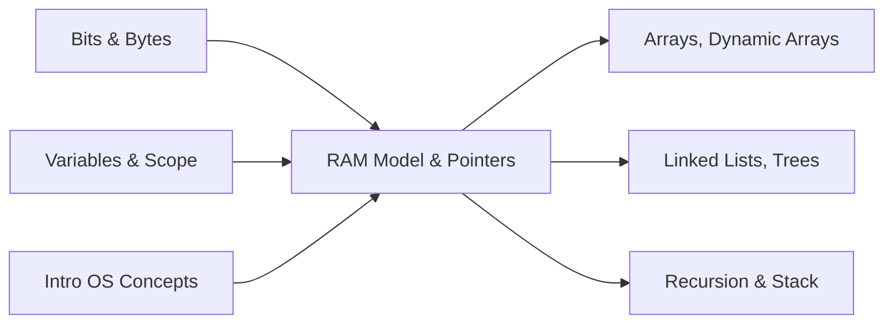

# 🎯 WEEK 1 DAY 1: RAM MODEL & POINTERS — COMPLETE GUIDE  

**Duration:** 45–60 minutes | **Difficulty:** 🟢 Easy Foundations  
**Prerequisites:** Basic idea of variables, functions, and data types in at least one language  
**Interview Frequency:** Indirectly ~100% (every algorithm assumes this model)  
**Real-World Impact:** Governs how fast your code runs, why programs crash, and how memory limits and caches affect all data structures and algorithms.

---

## 🎓 LEARNING OBJECTIVES

By the end of this section, you will:

- ✅ Understand the **RAM model** used in algorithm analysis  
- ✅ Explain **process memory layout**: code, globals, heap, stack  
- ✅ Describe **pointers/references**, pointer arithmetic, and aliasing  
- ✅ Reason about **memory hierarchy** (caches, RAM, disk) and locality  
- ✅ Explain **virtual memory**, pages, and TLB at a high level  
- ✅ Recognize common **pointer-related bugs** (null, dangling, out-of-bounds)  
- ✅ Connect these concepts to **real systems** like Linux, JVM, PostgreSQL, Redis, Docker

### 📊 Objectives vs Sections

| ✅ Objective                                                 | 🔎 Covered Mainly In Sections |
|-------------------------------------------------------------|-------------------------------|
| RAM model for algorithms                                    | 1, 2, 5, 8                    |
| Process memory layout (stack/heap/globals/code)            | 2, 3, 4                       |
| Pointers, references, arithmetic, aliasing                 | 2, 3, 4                       |
| Memory hierarchy & locality                                | 2, 3, 4, 5                    |
| Virtual memory, pages, TLB                                 | 2, 3, 5, 6                    |
| Pointer-related failure modes                              | 1, 3, 4, 5, 10                |
| Real systems using these ideas                             | 1, 6, 7                       |

---

## 🤔 SECTION 1: THE WHY

Most algorithm books jump straight into Big-O notation, but they quietly assume a particular view of how computers execute your code. That view is the **RAM (Random Access Machine) model**: a machine where memory is a flat array of cells and each access takes constant time. Pointers are how real code navigates that memory.

If you don’t understand this model and how pointers work:

- You can compute Big-O, but **not** understand why  
- You can write “correct” code that is **10x slower** than necessary  
- You can accidentally introduce **crashes and security bugs** through memory misuse  

### 🎯 Real-World Problems This Solves

#### 1. “My O(n) solution is much slower than someone else’s O(n) solution.”

Two engineers implement a function that scans a large dataset:

- Implementation A uses a **contiguous array** and iterates linearly  
- Implementation B uses a **linked list** of nodes scattered in memory  

Both are O(n) in the RAM model. On real hardware, A can be several times faster than B. Why?

| 🧩 Problem                          | 🌍 Where It Appears                        | 💼 Business Impact                             | 🏭 Example System |
|------------------------------------|--------------------------------------------|-----------------------------------------------|-------------------|
| O(n) vs O(n) but 5x slower         | Data processing, analytics, ML pipelines   | Higher compute cost, missed SLAs              | Spark workers, in-memory DBs |
| Cache-thrashing pointer traversal  | High-throughput services, microservices    | Latency spikes, reduced throughput            | In-memory caches (Redis-like) |

Understanding **cache lines, locality, and pointer chasing** explains these differences and lets you design memory-friendly data structures.

#### 2. “The service sometimes crashes with access violations / segmentation faults.”

A large C/C++ service crashes intermittently. Root cause:

- A pointer is dereferenced after its object was freed (dangling pointer)  
- Or an array is indexed out of bounds  
- Or a null pointer is dereferenced

In systems like:

- Trading engines  
- Payment gateways  
- Storage engines  

this can translate directly into money lost or data corrupted.

#### 3. “It worked on my laptop but times out or thrashes in production.”

On a small dataset:

- Everything fits in L3 cache or RAM  
- There are almost no page faults  

On production scale:

- The working set size exceeds RAM → page faults (swapping to disk)  
- TLB misses become common because many pages are touched randomly  
- Performance collapses even if asymptotic complexity is unchanged

This happens in:

- Database queries (PostgreSQL, MySQL) on large tables  
- In-memory key-value stores (Redis) under heavy load  
- Large-scale analytics or ML training jobs

The RAM model gives a **first-order approximation** of cost; knowing where it diverges from hardware reality lets you interpret and fix performance issues.

### ⚖ Design Goals & Trade-offs

The RAM model and explicit pointer view are designed to:

- 🎯 Provide a **simple cost model**:  
  - Each primitive operation (add, compare, read, write) costs O(1)  
  - Each memory access via an address costs O(1)
- 🧠 Make algorithms **hardware-independent** at the complexity level  
- 🧹 Abstract away messy details (caches, TLB, specific CPU) while still being usable

Trade-offs:

| ⚙ Aspect           | ⏮ Naive “Realistic” Modeling                         | ⏭ RAM Model & Pointers                         | 🔍 Trade-off                       |
|--------------------|------------------------------------------------------|------------------------------------------------|------------------------------------|
| Time complexity    | Include exact latencies of cache, TLB, disk         | Treat most operations as O(1)                  | Lose fine detail, gain simplicity |
| Space modeling     | Exact bytes in each cache, page, and heap structure | Count cells/words, often ignore constant factors | Less precise, easier to reason    |
| Portability        | Model each hardware platform separately             | One universal abstract machine                 | Less hardware specificity         |

### 💼 Interview Relevance

Interviewers rarely ask “Explain the RAM model,” but they constantly test it indirectly:

- “Why is random access in an array O(1) but in a linked list O(n)?” 
- “What is the difference between stack and heap memory?” 
- “Why might deep recursion cause a crash?” 
- “Why can two O(n) algorithms have drastically different performance?” 

Strong candidates:

- Can **draw memory diagrams** (stack, heap, pointers)  
- Can **justify** complexities from memory layout assumptions  
- Can **explain performance differences** in terms of locality, cache, and indirection  

This foundational understanding makes all later topics (arrays, trees, graphs, DP, system design) much easier and more grounded.

---

## 📌 SECTION 2: THE WHAT

### 🧠 Core Analogy

Think of system memory as a **huge hotel corridor**:

- Each room has a **number** (address) and can hold a fixed-size “box” of data  
- A **pointer** is like a slip of paper with a room number written on it  
- Programs are like staff following these slips, going room to room to read/write boxes  

The RAM model says:  

> “Assume it takes the **same time** to walk to any room, no matter where it is.”

Reality is more like:

- Rooms close together are faster to move between (cache lines)  
- Some rooms may be on another floor (RAM vs disk)  
- You need to check a map (page table) to find physical rooms from logical numbers

But for algorithm analysis, we adopt the simpler view.

### 🎨 Analogy Table

| 🎨 Real-World Object | 📌 DSA Concept         | 🔍 Similarity                                    |
|----------------------|------------------------|--------------------------------------------------|
| Hotel corridor       | Address space / RAM    | Long sequence of numbered locations              |
| Room number          | Memory address         | Identifies exactly one location                  |
| Slip with room #     | Pointer / reference    | Stores where to go next                          |
| Floor / zone         | Page / segment         | Group of rooms managed together                  |
| Floor map            | Page table             | Maps logical areas to physical ones              |

### 📋 CORE CONCEPTS — RAM MODEL & POINTERS (LIST ALL)

1. **RAM Model (Random Access Machine)**  
   - One infinite (or very large) array of memory cells, each addressable in O(1).  
   - A finite number of registers to hold values and addresses.  
   - Instructions (load, store, add, compare, jump) each cost constant time.  
   - Complexity: Time O(1) per primitive step, Space O(1) per cell accessed.

2. **Process Address Space Layout**  
   - Logical view of memory for a process:  
     - Code (instructions)  
     - Data (globals/static)  
     - Heap (dynamic allocations)  
     - Stack (function call frames)  
   - Complexity: Access to a known address is O(1) in RAM model.

3. **Stack vs Heap Memory**  
   - Stack: LIFO frames for function calls and local variables.  
   - Heap: Region for dynamic, manually or GC-managed allocations.  
   - Complexity: Push/pop stack frame O(1); heap allocation usually amortized O(1).

4. **Pointers and References**  
   - A pointer holds an address; dereferencing accesses the memory at that address.  
   - References in managed languages are pointer-like abstractions.  
   - Complexity: Pointer dereference O(1) per access in RAM model.

5. **Pointer Arithmetic**  
   - Adding k to a pointer to type T moves `k * sizeof(T)` bytes forward.  
   - Used heavily for array indexing and low-level traversal.  
   - Complexity: O(1) for arithmetic + O(1) for access.

6. **Aliasing & Indirection**  
   - Aliasing: multiple pointers refer to the same memory location.  
   - Indirection: pointers to pointers, or pointer chains (e.g., linked lists).  
   - Complexity: O(k) for k levels of dereference, each considered O(1).

7. **Memory Hierarchy & Caches**  
   - Registers, L1, L2, L3, RAM, disk.  
   - Data is moved in **blocks** (cache lines, pages).  
   - RAM model treats all memory as one flat level; real performance depends on which level you hit.

8. **Virtual Memory, Pages, and TLB**  
   - Virtual addresses (what the program sees) vs physical addresses (hardware).  
   - Pages (e.g., 4 KB) mapped via page tables; TLB caches recent mappings.  
   - Complexity: Address translation is O(1) but with different constant factors.

9. **Locality (Spatial & Temporal)**  
   - Spatial: if you access address A, you’re likely to access nearby addresses soon.  
   - Temporal: if you access A, you’re likely to access it again soon.  
   - Drives cache performance and explains why contiguous arrays are fast.

### 📊 Core Concepts Summary Table

| # | 🧩 Concept / Variation          | ✏️ Brief Description                             | ⏱ Time (RAM Model) | 💾 Space (Per Element/Op) |
|---|--------------------------------|--------------------------------------------------|--------------------|--------------------------|
| 1 | RAM Model                      | Flat O(1) access machine model                   | O(1) per step      | O(1) per cell            |
| 2 | Address Space Layout           | Code, data, heap, stack regions                  | O(1) access        | N/A                      |
| 3 | Stack vs Heap                  | Automatic vs dynamic allocation regions          | O(1) ops           | O(n) total usage         |
| 4 | Pointers/References            | Variables storing addresses                      | O(1) dereference   | O(1) per pointer         |
| 5 | Pointer Arithmetic             | Address computation based on element size        | O(1)               | O(1)                     |
| 6 | Aliasing & Indirection         | Multiple names / levels to same data             | O(k) for k levels  | O(1) per pointer         |
| 7 | Memory Hierarchy & Caches      | Multi-level storage with differing latencies     | O(1) abstract      | O(n) data, plus metadata |
| 8 | Virtual Memory & TLB           | Page-based mapping from virtual to physical      | O(1) logical       | O(#pages) for tables     |
| 9 | Locality                       | Pattern of accesses in time and space            | Affects constants  | N/A                      |

### 🖼 Visual Representation — Process Address Space

```text
High Addresses
+-----------------------------+
|         Kernel Space        |  (not accessible directly)
+-----------------------------+
|          Stack              |  (grows down)
| [frames: main → f() → g()]  |
+-----------------------------+
|           Heap              |  (grows up)
| [dynamic allocations]       |
+-----------------------------+
|     Globals / Static Data   |
+-----------------------------+
|           Code              |
+-----------------------------+
Low Addresses
```

### 🔑 Key Properties & Invariants

| 🧷 Invariant                          | 📖 Description                                      | ❗ What breaks if violated                     |
|--------------------------------------|-----------------------------------------------------|-----------------------------------------------|
| Stack is LIFO                        | Last function called is the first to return         | Return into wrong frame → crashes, corruption |
| Pointer must be valid or null        | Points to allocated object or null                  | Dangling/out-of-bounds → UB / crash           |
| No access outside allocated regions  | Stay within array/object bounds                     | Buffer overflow, security bugs                |
| Page mapping defines valid addresses | Only mapped virtual pages may be accessed           | Page faults if touched otherwise              |

### 📐 Formal Definition (RAM Model)

- Memory is an array `M[0..N-1]` of cells.  
- There is a finite set of registers `R1, R2, …`.  
- Each instruction does one operation (e.g., `Ri ← M[j]`, `M[j] ← Ri`, `Ri ← Rj + Rk`) and costs O(1).  
- A pointer is an integer index `i` such that `0 ≤ i < N`.  
- `M[i]` is readable/writable in O(1) time.

All later complexity analysis assumes this model unless stated otherwise.

---

## ⚙ SECTION 3: THE HOW

Here we walk through **mechanics**: how stacks, heaps, pointers, and virtual memory actually behave.

### 📋 Algorithm/Logic Overview — Pointer-Based Access

We’ll model a simple “read through pointer” operation:

```text
PointerRead
Input: p (pointer to a memory cell)
Output: value stored at address p

Step 1: Interpret p as an address a.
Step 2: Translate a to physical location (virtual memory).
Step 3: Check caches / memory hierarchy for a.
Step 4: Retrieve the value v stored at M[a].
Return v.
```

### 🔁 Flow of Pointer Dereference (Mermaid Diagram)

```mermaid
flowchart TD
  S[Start: have pointer p] --> A[Interpret p as virtual address v]
  A --> B[TLB Lookup for v]
  B -->|Hit| C[Get physical frame f]
  B -->|Miss| D[Page Table Walk → possibly Page Fault]
  D --> C
  C --> E[Compute physical address a = f + offset]
  E --> F[Check caches (L1/L2/L3)]
  F -->|Hit| G[Return value from cache]
  F -->|Miss| H[Fetch from RAM (maybe disk)]
  H --> G
  G --> End[Value returned to CPU register]
```

In the RAM model, all of this is collapsed to “read M[p] in O(1) time,” but the diagram shows what actually happens.

### 🔍 Detailed Mechanics

#### 1. Stack Frame Creation (Function Call)

When `f()` calls `g()`:

1. **Push return address** onto stack.  
2. **Allocate new frame** for `g`:
   - Space for parameters (if passed on stack)  
   - Space for local variables  
   - Saved registers  

Simplified state table:

| ⏱ Step | 🔄 State Before                            | 🔁 Operation                       | 📦 State After                              |
|--------|---------------------------------------------|------------------------------------|---------------------------------------------|
| 1      | Stack top at frame of `f`                  | Call `g()`                         | New frame for `g` pushed on stack           |
| 2      | `g`’s frame on top                         | Allocate locals, set base pointer  | Locals live in `g`’s frame                  |
| 3      | `g` executing                              | Return from `g`                    | `g`’s frame popped, back to `f`’s frame     |

#### 2. Heap Allocation (Dynamic Memory)

For a dynamic object:

1. The allocator finds a **free chunk** of sufficient size in heap.  
2. It marks that chunk as allocated (possibly storing metadata).  
3. It returns a **pointer** to the start of the allocated region.

Simplified view:

```text
Heap region:

+------+  +--------+  +-----------+  +----------+
|Used A|  |  Free  |  |   Used B  |  |   Free   |
+------+  +--------+  +-----------+  +----------+
           ^
           |
      new object here → returns pointer p
```

#### 3. Pointer Arithmetic on Arrays

For an array of 4-byte ints starting at base address `B`:

- Address of `arr[i]` = `B + i * 4`  

The CPU:

1. Multiplies index `i` by element size (constant-time).  
2. Adds to base address.  
3. Dereferences that address.

This is why **indexing an array** is O(1) in the RAM model.

#### 4. Indirection & Linked Structures

Linked list:

```text
[Node1] -> [Node2] -> [Node3] -> null
```

Each node contains:

- `value`  
- `next` (a pointer to the next node)

To traverse:

1. Start pointer `p` = address of head node.  
2. While `p != null`:
   - Read node at `p`  
   - Process `p->value`  
   - Set `p = p->next`

This is **pointer chasing**. Each `p->next` adds another dereference step.

#### 5. Virtual Memory Address Translation

Mechanically:

1. Split virtual address `v` into `(page_number, offset)`  
2. TLB lookup: if mapping found → get frame `f`  
3. If not in TLB:
   - Walk page table in memory to find frame `f`  
   - If the page isn’t in RAM, trigger page fault → load from disk  
   - Update TLB  
4. Compute physical address `a = f + offset`  
5. Access caches/RAM with `a`

### 💾 State Management Snapshot

A simplified snapshot at some point during program execution:

```text
+--------------------------+
| Stack (top → bottom)     |
| [Frame: g()]             |
| [Frame: f()]             |
| [Frame: main()]          |
+--------------------------+
| Heap                     |
| [Object A @ 0x5000]      |
| [Node 1 @ 0x6000]        |
| [Node 2 @ 0x9000]        |
+--------------------------+
| Globals / Statics        |
| [config, cache size...]  |
+--------------------------+
| Code                     |
+--------------------------+
```

Pointers in stack frames and globals reference heap objects and nodes; all rely on invariants like “only dereference valid addresses.”

### 🧮 Memory Behavior (Hierarchy View)

```text
[CPU Registers] → [L1 Cache] → [L2/L3 Cache] → [RAM] → [Disk]
    ↑ hottest data      ↑ main working set        ↑ backing store
```

- Sequential array scans cooperate with this hierarchy (predictable, contiguous).  
- Random pointer chasing may constantly force data from “farther right” (RAM/disk).

### 🛡 Edge Case Handling

Common edge cases and expected behaviors:

| 🚧 Edge Case                  | ✅ Expected Handling                                      |
|-------------------------------|----------------------------------------------------------|
| Null pointer                  | Check for null before dereference, or guarantee non-null|
| Empty list/array              | Loops terminate immediately; no dereferences            |
| Very deep recursion           | Detect possible stack overflow, convert to iteration    |
| Freed memory dereferenced     | Avoid using freed pointers; set to null or redesign     |
| Out-of-bounds index           | Bounds check (in safe languages), or explicit checks    |

---

## 🎨 SECTION 4: VISUALIZATION

Now we visualize memory and pointer behavior through concrete examples.

### 🧊 Example 1: Single Variable and Pointer (Simple Case)

Suppose:

- `int x = 42;`  
- `int* p = &x;`  

Conceptual memory (addresses are illustrative):

```text
Address  Content       Meaning
-------  ------------  ---------------------
1000     42            x (int)
1004     1000          p (pointer to x)
```

Graphical view:

```text
p (at 1004) ──► 1000 ──► x = 42
```

Tabular trace of reading `*p`:

| ⏱ Step | 📥 Input View      | 📦 Internal State                   | 📤 Output / Action          |
|--------|--------------------|-------------------------------------|-----------------------------|
| 0      | x = 42, p = &x     | p holds 1000                        | -                           |
| 1      | want `*p`          | interpret p as 1000                 | prepare to read address 1000|
| 2      | read M[1000]       | M[1000] = 42                        | return 42                   |

The entire dereference is O(1) in the RAM model.

### 📈 Example 2: Array vs Linked List Traversal (Medium Case)

We compare traversal across 4 elements.

**Array (contiguous) example:**

```text
Base address B = 2000

Address  Value   Meaning
-------  ------  ------------------
2000     10      arr[0]
2004     20      arr[1]
2008     30      arr[2]
2012     40      arr[3]
```

Traversal:

```text
for i in 0..3:
  read arr[i]
```

Trace:

| ⏱ Step | 📥 Input View                | 📦 Internal State             | 📤 Output / Action      |
|--------|------------------------------|-------------------------------|-------------------------|
| 0      | arr = [10,20,30,40]          | i = 0                         | -                       |
| 1      | need arr[0]                  | address = B + 0 * 4 = 2000   | read 10                 |
| 2      | i = 1                        | address = B + 1 * 4 = 2004   | read 20                 |
| 3      | i = 2                        | address = B + 2 * 4 = 2008   | read 30                 |
| 4      | i = 3                        | address = B + 3 * 4 = 2012   | read 40                 |

**Linked list (scattered) example:**

```text
Node 1 @ 5000: value=10, next=9000
Node 2 @ 9000: value=20, next=1500
Node 3 @ 1500: value=30, next=4000
Node 4 @ 4000: value=40, next=null
```

Diagram:

```text
[Node1 @5000] ──► [Node2 @9000] ──► [Node3 @1500] ──► [Node4 @4000] ──► null
    10                20                30                40
```

Traversal trace:

| ⏱ Step | 📥 Input View            | 📦 Internal State                      | 📤 Output / Action |
|--------|--------------------------|----------------------------------------|--------------------|
| 0      | head = 5000             | p = 5000                               | -                  |
| 1      | deref p                 | M[5000] = Node1                        | value 10           |
| 2      | p = Node1.next = 9000   | p = 9000                               | -                  |
| 3      | deref p                 | M[9000] = Node2                        | value 20           |
| 4      | p = 1500               | ...                                    | ...                |

#### Side-by-side Comparison

| 🔁 Aspect            | Array (Simple)                           | Linked List (Medium)                 | 🔍 Difference                                      |
|----------------------|------------------------------------------|--------------------------------------|----------------------------------------------------|
| Memory layout        | Contiguous                               | Scattered                            | A: great spatial locality; L: poor locality        |
| Access pattern       | Predictable (i = 0..n-1)                 | Pointer-chasing via next pointers    | A: hardware prefetch helps; L: hard to prefetch    |
| Cache behavior       | Few misses, many hits                    | Many misses (each node possibly new) | Both O(n), but huge constant factor difference     |
| Algorithmic time     | O(n)                                     | O(n)                                 | Same Big-O, but very different real performance    |

### 🔥 Example 3: Stack Growth and Recursion (Complex Case)

Consider a recursive function `fact(n)`:

```text
fact(3) calls fact(2)
fact(2) calls fact(1)
fact(1) calls fact(0)
```

Stack frames (conceptually):

```text
Top of stack
+--------------------------+  <-- frame: fact(0)
| n = 0, return to fact(1) |
+--------------------------+
| n = 1, return to fact(2) |
+--------------------------+
| n = 2, return to fact(3) |
+--------------------------+
| n = 3, return to main    |
+--------------------------+
Bottom of stack
```

As `n` grows, more frames are pushed. With very large `n`, you may run out of stack memory → **stack overflow**.

### ❌ Counter-Example: Out-of-Bounds Access

Array of 4 elements:

```text
Address  Value
-------  -----
3000     10   arr[0]
3004     20   arr[1]
3008     30   arr[2]
3012     40   arr[3]
3016     ??   (not part of arr)
```

Accessing `arr[4]`:

- Computed address = 3000 + 4 * 4 = 3016  
- But 3016 is **not** within `arr`; it may be another variable or unallocated memory.

Correct vs incorrect:

| 📌 Scenario                  | ✅ Correct Behavior                                   | ❌ Incorrect Behavior                            | 🧠 Lesson                             |
|-----------------------------|-------------------------------------------------------|--------------------------------------------------|---------------------------------------|
| Access arr[0..3]            | Only use indices 0–3                                  | Use 4 or more                                   | Respect array bounds                  |
| After freeing heap object   | Do not use pointer; set it to null or reuse carefully | Continue dereferencing freed pointer            | Freed memory is no longer yours       |
| Deep recursion              | Limit depth or convert to iterative approach          | Allow unbounded recursion until stack overflow  | Stack is finite; each call consumes it|

---

## 📊 SECTION 5: CRITICAL ANALYSIS

### 📈 Complexity Analysis Table

| 📌 Concept / Operation                      | 🟢 Best ⏱ | 🟡 Avg ⏱ | 🔴 Worst ⏱ | 💾 Space | 📝 Notes                                                |
|-------------------------------------------|----------|----------|-----------|---------|--------------------------------------------------------|
| Direct array access `arr[i]`              | O(1)     | O(1)     | O(1)      | O(1)    | Constant-time index computation + dereference          |
| Sequential array scan (size n)            | O(n)     | O(n)     | O(n)      | O(1)    | Very cache-friendly, prefetcher helps                  |
| Linked list traversal (n nodes)           | O(n)     | O(n)     | O(n)      | O(1)    | Pointer chasing; poor locality in practice             |
| Stack push/pop (function call/return)     | O(1)     | O(1)     | O(1)      | O(1)    | Adjust stack pointer, very fast                        |
| Heap allocation (typical allocator)       | O(1)     | amort. O(1) | O(k)   | O(1)    | Depends on fragmentation and allocator algorithm       |
| Virtual address translation (TLB hit)     | O(1)     | O(1)     | O(1)      | O(1)    | Fast; hidden constant factor                           |
| Virtual address translation (TLB miss)    | O(1)*    | O(1)*    | O(1)*     | O(1)    | *Still modeled as O(1), but much slower constant       |
| Page fault (swap-in from disk)            | O(1)*    | O(1)*    | O(1)*     | O(1)    | *Enormous constant; can dominate runtime               |

### 🤔 Why Big-O Might Be Misleading

Big-O hides:

- **Constant factors**: cache hits vs misses, TLB hits vs misses  
- **Memory access patterns**: random vs sequential  
- **I/O costs**: page faults bring in disk, which is orders of magnitude slower  

Example: Array vs linked list traversal

| Structure   | Big-O Time | Real Pattern          | Real Behavior                                   |
|------------|------------|-----------------------|-------------------------------------------------|
| Array      | O(n)       | Sequential, contiguous| Fewer misses, good prefetching, very fast       |
| Linked list| O(n)       | Random-ish node layout| Many misses, TLB misses, sometimes page faults  |

They are both O(n), but performance can differ by an order of magnitude for large n.

### ⚡ When Does Analysis Break Down?

RAM-model complexity is insufficient when:

- Data exceeds RAM, and disk I/O dominates.  
- Access patterns are adversarial to caches/TLB (e.g., random accesses in a very large array).  
- Systems are distributed (network costs far outweigh CPU).  

Then we need models like:

- External memory / I/O model  
- Cache-oblivious model  
- Distributed computing models (e.g., BSP, MapReduce cost models)

### 🖥 Real Hardware Considerations

Conceptual bottleneck stack:

```text
CPU → L1 → L2/L3 → RAM → SSD/HDD
```

- CPU vs L1: few cycles  
- L1 vs RAM: tens to hundreds of cycles  
- RAM vs disk: millions of cycles  

Algorithms that:

- Minimize **random accesses**  
- Maximize **reuse** of data in caches  
- Use **contiguous storage** where possible  

tend to perform far better in practice than those that rely heavily on scattered pointer chasing—despite similar Big-O.

---

## 🏭 SECTION 6: REAL SYSTEMS

### System–Concept Mapping

| 🏭 System / Domain          | 🧩 How RAM & Pointers Are Used                            | 🎯 Benefit                                  | ⚠ Pitfall if Ignored                          |
|----------------------------|-----------------------------------------------------------|---------------------------------------------|-----------------------------------------------|
| Linux kernel               | Page tables, process memory, kernel data structures       | Isolation, protection, efficient resource use | Crashes, security holes, poor performance     |
| Windows memory manager     | Virtual memory, paging, memory-mapped files               | Large address space, file I/O optimization  | Thrashing when working set misunderstood      |
| JVM / .NET runtimes        | Object heap, references, GC                               | Safe memory, abstraction                    | GC pauses, poor locality if layout ignored    |
| PostgreSQL                 | Buffer pool, page cache, index structures                 | Fast queries via memory-resident pages      | Excess random I/O, slow queries               |
| Redis                      | Pointer-rich in-memory structures                         | Sub-millisecond responses                   | Fragmentation, poor locality under load       |
| TCP/IP stack               | Buffers, descriptors, DMA, zero-copy paths                | High throughput networking                  | Extra copies, cache misses reduce throughput  |
| Docker / containers        | Shared kernel, cgroups, isolated address spaces           | Multi-tenant efficiency                     | Memory contention, noisy neighbors            |

### 🏭 Real System 1: Linux Kernel (Virtual Memory & Paging)

- 🎯 Problem: Provide each process with an isolated, contiguous virtual address space.  
- 🔧 Implementation: Uses multi-level page tables and TLB; kernel structures (e.g., task structs, file descriptors) use pointers extensively.  
- 📊 Impact: Enables process isolation, memory protection, and flexible memory usage (overcommit, mapping files into memory).

### 🏭 Real System 2: Windows Memory Manager

- 🎯 Problem: Manage memory for GUI apps, services, and background tasks simultaneously.  
- 🔧 Implementation: Virtual memory with working set limits, page replacement algorithms.  
- 📊 Impact: App responsiveness depends heavily on access patterns; poor locality means more page faults.

### 🏭 Real System 3: JVM Heaps (Java / Scala / Kotlin)

- 🎯 Problem: Provide a safe, garbage-collected heap for objects.  
- 🔧 Implementation:  
  - Objects allocated in contiguous regions (young generation, old generation).  
  - References (pointers) link objects.  
  - GC compacts objects to improve locality.  
- 📊 Impact: Data structure layout and pointer density affect both GC cost and cache behavior.

### 🏭 Real System 4: PostgreSQL Buffer Cache

- 🎯 Problem: Efficiently manage data pages read from disk.  
- 🔧 Implementation:  
  - Uses a shared buffer pool; each page is identified by a descriptor with pointers into internal structures.  
  - Access patterns leverage locality in indices and pages.  
- 📊 Impact: Frequently accessed pages stay in memory; random, sparse access leads to I/O thrashing.

### 🏭 Real System 5: Redis

- 🎯 Problem: Serve key-value requests with extremely low latency.  
- 🔧 Implementation:  
  - In-memory data structures; many pointers for linked structures (lists, skip lists).  
  - Careful allocation strategies to mitigate fragmentation.  
- 📊 Impact: Understanding memory layout explains why certain commands and data structures are faster.

### 🏭 Real System 6: Docker / Container Platforms

- 🎯 Problem: Run many isolated services on one host.  
- 🔧 Implementation: Each container shares the kernel but has separate namespaces and cgroup-limited memory; processes see isolated address spaces.  
- 📊 Impact: Container memory limits, working sets, and allocation patterns affect performance and stability.

---

## 🔗 SECTION 7: CONCEPT CROSSOVERS

### 📚 Prerequisites: What You Need First

| 📖 Topic                  | 🔍 What You Need                        | 🎯 Why It Matters Here                    |
|---------------------------|-----------------------------------------|-------------------------------------------|
| Bits and bytes            | Understand byte vs word                 | Memory cells store bytes/words            |
| Variables & scope         | Local vs global variables               | Stack vs global segments                  |
| Basic OS concepts         | Process, address space, kernel vs user | Virtual memory and protection             |



### 🔀 Dependents: What Builds on This

- 🚀 **Arrays & Dynamic Arrays (Week 2)**  
  - Rely on contiguous memory and pointer arithmetic.  
  - Performance depends on locality and RAM model assumptions.

- 🚀 **Linked Lists & Trees (Week 2, Week 5)**  
  - Entirely pointer-based structures.  
  - Layout affects traversal speed.

- 🚀 **Recursion & DP (Week 1 Day 4–5, Week 11)**  
  - Stack frames and memory usage dictate limits and optimizations.

- 🚀 **Hash Tables (Week 3)**  
  - Use arrays + pointer chains (chaining) or clever probing; memory layout is critical.

### 🔄 Similar Models: How Do They Compare?

| 📌 Model / Abstraction          | ⏱ Time View                      | 💾 Space View                                | ✅ Best For                          | 🔀 vs RAM Model                            |
|--------------------------------|-----------------------------------|----------------------------------------------|--------------------------------------|---------------------------------------------|
| RAM Model                      | Uniform O(1) access per cell     | Flat array of cells                          | Standard DSA and algorithm analysis  | Simpler, hides hierarchy                    |
| External Memory / I/O Model    | Page/block I/O cost dominates    | Disk blocks/pages explicitly modeled         | Very large data sets on disk         | More realistic for big data                 |
| Cache-Oblivious Model          | Minimizes cache misses generically| Multi-level caches without explicit sizes    | Cache-friendly algorithm design      | Refines RAM with cache assumptions          |
| Managed runtime (JVM/.NET)     | Abstracts pointers as references | GC-managed heap, layout influenced by GC     | High-level application development   | RAM model still applies underneath          |

This topic is the **foundation** on which all higher-level models build.

---

## 📐 SECTION 8: MATHEMATICAL

### 📋 Formal Definition of RAM Machine

A RAM machine consists of:

- A finite set of registers `R1, R2, …` holding integers  
- A (conceptually) unbounded array `M[0..]` of memory cells  
- A program: finite sequence of instructions such as:
  - `LOAD Ri, j` (load from memory `M[j]` into register `Ri`)  
  - `STORE Ri, j` (store register `Ri` into memory `M[j]`)  
  - `ADD Ri, Rj` (add `Rj` to `Ri`)  
  - `JUMP k` (go to instruction k)  
  - `JZ Ri, k` (jump if `Ri` is zero)

Each instruction is assumed to take constant time independent of `j` and values stored.

### 📐 Key Properties and Implications

- **Constant-Time Access:**  
  Given index `i`, accessing `M[i]` always costs O(1).  
  → Array indexing is O(1) regardless of size.

- **Sequential Loops:**  
  For loops that run `n` times with O(1) work per iteration have time O(n).  

- **Pointer Traversals:**  
  A pointer-chasing loop that moves along a list of length `n` has O(n) steps.

### 🧩 Theorem: Array Access is O(1) in RAM Model

**Statement:**  
Accessing element `arr[i]` in a static array is O(1) time in the RAM model.

**Proof Sketch:**

1. Let `base` be the starting index for `arr[0]`, each element has fixed size `s`.  
2. The address for `arr[i]` is computed as `base + i * s`.  
3. Multiplying `i` by `s` is one RAM arithmetic instruction → O(1).  
4. Adding the product to `base` is another O(1) instruction.  
5. A `LOAD` instruction from this computed address is O(1).  
6. Total steps: constant number of instructions, independent of `i` and array length.  

Therefore, array access is O(1) under the RAM model.

### Theorem → Design Implication Table

| 📐 Theorem / Property          | 💡 Practical Meaning                                  | 🛠 Where Used                        |
|--------------------------------|-------------------------------------------------------|--------------------------------------|
| Array access O(1)             | Indexing by position is fast and scalable            | Arrays, dynamic arrays, heaps        |
| Pointer-chasing O(1) per step | Each node hop is cheap in theory                     | Linked lists, tree traversals        |
| Sequential O(n) scan          | One pass cost grows linearly with size               | Searches, scans, simple analytics    |

---

## 💡 SECTION 9: ALGORITHMIC INTUITION

### 🎯 Decision Framework: When Does Memory Layout Matter?

When you pick or design a data structure, use this mental flow:

```mermaid
flowchart TD
  S[Problem] --> Q1{Need fast random access?}
  Q1 -->|Yes| A[Prefer contiguous array-like layout]
  Q1 -->|No| Q2{Many insert/delete in middle?}
  Q2 -->|Yes| B[Pointer-rich structures (lists/trees)]
  Q2 -->|No| Q3{Data size >> cache?}
  Q3 -->|Yes| C[Optimize for locality & sequential scans]
  Q3 -->|No| D[Simple structure may suffice]
```

**Use contiguous arrays / vector-like structures when:**

- You need **O(1) random access** by index  
- You perform many full/partial scans  
- Data size is large enough that cache behavior matters

**Use pointer-based structures when:**

- You frequently insert/delete in the middle  
- You need complex shapes (trees, graphs)  
- Object lifetimes are varied and complex

### ✅ Use This Topic’s Mental Model When:

- You’re trying to **derive complexity** instead of memorizing:  
  “What operations does this algorithm do per element, and how does it use memory?” 

- You’re comparing alternatives:  
  “Should I store this as an array of structs, a struct of arrays, or a linked structure?” 

- You’re debugging performance:  
  “Is my algorithm slow because of the number of operations, or because of memory layout?”

### ❌ Don’t Ignore Memory When:

- Problem constraints mention **very large n**, close to memory limits  
- You’re working in **low-level languages** (C/C++/Rust) with manual allocations  
- You see performance dominated by cache misses, page faults, or GC pauses

### 🔍 Interview Pattern Recognition

**🔴 Red flags (obvious indicators):**

- “Explain the difference between stack and heap.” 
- “Why is a linked list slower than a dynamic array in practice?” 
- “What happens when you allocate too many local variables in recursion?”

**🔵 Blue flags (subtle indicators):**

- “Our service is O(n) but still too slow on large inputs. What might be wrong?” 
- “We see a lot of page faults / GC pauses. How might data layout be involved?” 
- “How would you store this structure to minimize cache misses?”

You can mentally map clues to patterns:

| 🕵️ Clue in Question                        | 🎯 Likely Concept Involved                          |
|--------------------------------------------|-----------------------------------------------------|
| “Array vs linked list performance”         | Contiguity, locality, pointer chasing               |
| “Stack overflow”                           | Recursion depth, stack frames                       |
| “Page faults” or “swapping”                | Working set size, random vs sequential access       |
| “GC pauses” on large heaps                 | Heap layout, object density, pointer graphs         |

---

## ❓ SECTION 10: KNOWLEDGE CHECK

Reflect on these without looking up answers immediately:

1. **Why do we assume memory access is O(1) in the RAM model, even though actual access time can vary widely (cache vs RAM vs disk)?**  
   - How does this simplification help when comparing algorithms?

2. **Suppose two algorithms both traverse n items: one uses an array, the other uses a linked list. Both are O(n).**  
   - Explain in concrete terms why one is usually faster on real hardware.

3. **Explain the difference between stack and heap memory in terms of allocation, lifetime, and typical usage.**  
   - Give one scenario where using the stack is clearly preferable, and one where the heap is necessary.

4. **Describe what happens, at a high level, when a program accesses a null pointer or a pointer to freed memory.**  
   - Why can this be a security risk?

5. **Consider a program that randomly accesses a huge array vs one that sequentially scans it.**  
   - How will their page fault behavior differ for large data sets?

Sketch diagrams (stack/heap diagrams, pointer arrows, simple flows) as you reason through each question.

---

## 🎯 SECTION 11: RETENTION HOOK

### 💎 One-Liner Essence

“**Algorithms run on data, but their speed runs on memory.**”

### 🧠 Mnemonic Device — “MAPS”

Remember **MAPS** for memory fundamentals:

- **M**odel — RAM model: flat, O(1) access  
- **A**ddress — every value lives at an address; pointers store addresses  
- **P**laces — code, data, heap, stack: where things live  
- **S**tructure — layout (contiguous vs scattered) shapes performance

Use MAPS whenever you analyze an algorithm:

> “What is my **Model** of cost?  
> Where are the data **Addresses**?  
> In which **Places** (stack/heap) do they live?  
> What **Structure** (layout) do they form?”

### 🖼 Visual Cue

```text
          +-----------------------+
          |        STACK          |  (frames, locals)
          +-----------------------+
          |        HEAP           |  (objects, nodes)
          +-----------------------+
          |   GLOBALS / DATA      |
          +-----------------------+
          |        CODE           |
          +-----------------------+

        ↑        ↑
        |        |
    pointers  pointers
    from stack to heap and between heap objects
```

Picture:

- A vertical memory bar divided into regions  
- Arrows (pointers) from stack frames to heap objects and between heap objects  

Every time you see “pointer”, imagine an arrow between boxes in this diagram.

### 💼 Real Interview Story (Condensed)

A candidate was asked to optimize a log-processing job:

- **Initial solution:**  
  - Used a linked list of log entries.  
  - Each pass performed multiple pointer dereferences over millions of nodes.  
  - Complexity: O(n), but runtime was too high.

- **Optimized solution:**  
  - Switched to an array of structs (contiguous in memory).  
  - Performed the same number of logical operations.  
  - Complexity: still O(n), but now data access was sequential and cache-friendly.

When asked **why** the second version was faster, the strong candidate:

- Drew a quick **stack/heap/caches** diagram  
- Explained **spatial locality**, cache lines, and pointer chasing  
- Related it to the **RAM model assumption** vs real hardware hierarchy

This demonstrated **deep understanding**, not just rote algorithm knowledge — exactly what senior interviewers look for.

---

## 🧩 5 COGNITIVE LENSES

### 🖥 COMPUTATIONAL LENS

From the hardware’s view:

- Memory is accessed via **addresses**; each access must go through the hierarchy: registers → caches → RAM → disk.  
- The RAM model flattens this into “O(1) per access”, but reality brings large constant factors.

Cache-level view:

| Level   | Example Size     | Approx Latency (cycles) | Notes                       |
|---------|------------------|-------------------------|-----------------------------|
| L1      | 32–64 KB         | ~4                      | Per-core, very fast         |
| L2      | 256–512 KB       | ~10–20                  | Per-core / per cluster      |
| L3      | 4–20 MB          | ~40–60                  | Shared, slower              |
| RAM     | GBs              | ~100–200+               | Off-chip, much slower       |
| Disk    | 100s GB–TB       | 10^5–10^7 cycles        | Orders of magnitude slower  |

Pointer-heavy structures that hop around memory tend to miss caches and hurt performance; contiguous layouts cooperate with hardware prefetch and cache lines.

### 🧠 PSYCHOLOGICAL LENS

Common mental traps:

- “Memory is infinite and uniform” → ignoring stack limits, cache, and disk.  
- “Pointers are magic/dangerous” → avoiding understanding them instead of taming them.  
- “O(1) always means ‘fast’” → ignoring huge constant factors from memory hierarchy.

Better mental model:

- A pointer is just a **number with responsibility**: it tells you where to look, but you must ensure it’s valid.  
- The stack is a **physical stack** of frames; heap is a **flexible storage area**.  
- Visual diagrams (boxes and arrows) simplify reasoning; always draw them for complex structures.

Quick fix table:

| ❌ Misconception                      | ✅ Correct View                                    | 💡 Quick Fix                          |
|--------------------------------------|---------------------------------------------------|---------------------------------------|
| “Pointers are magic/dangerous”       | They are explicit addresses; misuse is dangerous  | Draw them as arrows between boxes     |
| “O(1) means always fast”             | O(1) hides large constants                        | Ask: where is data, how is it accessed? |
| “Stack vs heap doesn’t matter”       | Lifetimes, sizes, recursion depth depend on it    | Always label where data lives in diagrams |

### 🔄 DESIGN TRADE-OFF LENS

Every data structure decision involves:

- ⏱ vs 💾: Time vs Space  
- 📖 vs 🔧: Simplicity vs Optimization  
- Static layout vs **runtime flexibility**

Design trade-offs:

| Design Choice          | ⏱ Time                      | 💾 Space           | ✅ When to Prefer                 |
|------------------------|----------------------------|--------------------|----------------------------------|
| Contiguous arrays      | Great locality, fast scans | Fixed or resizing  | Large datasets, performance-critical reads |
| Linked structures      | Flexible insert/delete     | Extra pointer overhead | Frequent structural changes      |
| Deep recursion         | Simple code                | Uses stack heavily | Small depth, clarity important   |
| Iterative + explicit stack | More code              | Explicit stack in heap/stack | High-depth or controlled memory |

Understanding RAM and pointers lets you choose the **right trade-off** for each problem.

### 🤖 AI/ML ANALOGY LENS

In ML systems:

- Tensors and feature matrices are stored **contiguously**, on CPU or GPU — just like arrays.  
- Kernels expect data in layouts that exploit **coalesced memory access** (similar to good locality).  
- Pointer-heavy structures are avoided in performance-critical kernels because of poor GPU memory access patterns.

Analogy mapping:

| DSA Concept          | AI/ML Analog                  |
|----------------------|-------------------------------|
| Contiguous arrays    | Dense tensors, batch matrices |
| Pointer graphs       | Neural net computation graphs |
| Locality             | Cache-friendly minibatch layout|
| Page faults / cache misses | Slow data loader / I/O bottlenecks |

Even if frameworks hide pointers, **memory layout** remains crucial for training and inference speed.

### 📚 HISTORICAL CONTEXT LENS

- Early computers had small, more uniform memories; the RAM model was a natural abstraction.  
- As caches and virtual memory were introduced, complexity increased, but the **RAM model persisted** because of its simplicity and usefulness for theory.  
- Over time, as data sizes grew and hierarchical memory became a performance bottleneck, researchers introduced:
  - External memory model  
  - Cache-oblivious algorithms  
  - NUMA-aware designs  

Yet, the RAM model and pointer abstraction remain the **standard starting point** for algorithm analysis and systems programming education.

---

## ⚔ SUPPLEMENTARY OUTCOMES

### ⚔ Practice Problems (8–10)

(No solutions provided.)

1. **⚔ Stack vs Heap Diagram**  
   - Draw the stack and heap layout for a simple program that calls one function which allocates a dynamic array and returns it. Label all pointers and lifetimes.

2. **⚔ Array vs Linked List Traversal**  
   - Explain why traversing a linked list and an array with the same number of elements can have very different performance, even though both are O(n).

3. **⚔ Pointer Safety Scenarios**  
   - Given several C-like code snippets using pointers, identify which dereferences are safe, which are null, and which are dangling or out-of-bounds.

4. **⚔ Virtual Memory Thought Exercise**  
   - For a program that sequentially scans a 1 GB array vs randomly accesses 1 GB of data, reason about the number and pattern of page faults.

5. **⚔ Recursion Depth and Stack Overflow**  
   - Estimate the maximum safe recursion depth given an approximate per-frame size and a known stack size (e.g., 8 MB). Discuss how to avoid overflow.

6. **⚔ Locality Optimization**  
   - Take a nested loop over a 2D array and rearrange the loop order to optimize for row-major storage. Explain expected cache behavior improvement.

7. **⚔ Pointer Aliasing Effects**  
   - Consider a function that receives two pointers that may alias the same memory. Explain how aliasing affects reasoning about side effects and optimizations.

8. **⚔ RAM Model vs Real Machine**  
   - Pick a simple algorithm (e.g., linear search) and discuss where RAM-model assumptions diverge most from real CPU + cache + disk behavior.

9. **⚔ Heap Fragmentation Sketch**  
   - Sketch a sequence of allocations and frees that leads to fragmentation and explain how it affects later allocations.

10. **⚔ TLB Behavior**  
    - Explain qualitatively how accessing a large array in strides (e.g., every 4 KB) affects TLB behavior compared to sequential access.

---

### 🎙 Interview Questions (6+ pairs)

(Questions only; no solutions.)

1. **Q1:** What is the RAM model of computation, and why is it used in algorithm analysis?  
   - 🔀 Follow-up 1: In what real-world scenarios does the constant-time memory access assumption break down?  
   - 🔀 Follow-up 2: How would you adapt your reasoning when data does not fit in RAM?

2. **Q2:** Explain the difference between stack and heap memory.  
   - 🔀 Follow-up 1: How does recursion use stack memory, and why can it cause a stack overflow?  
   - 🔀 Follow-up 2: When might you rewrite a recursive algorithm iteratively for memory reasons?

3. **Q3:** Compare arrays and linked lists in terms of memory layout and performance.  
   - 🔀 Follow-up 1: Why is random access O(1) in arrays but O(n) in linked lists?  
   - 🔀 Follow-up 2: Can you propose a data structure that combines some benefits of both?

4. **Q4:** Describe virtual memory and the role of page tables and the TLB.  
   - 🔀 Follow-up 1: How do random vs sequential access patterns affect TLB hit rates?  
   - 🔀 Follow-up 2: What symptoms might you see if a program suffers from many TLB misses or page faults?

5. **Q5:** What is a dangling pointer, and how might such a bug manifest in a production system?  
   - 🔀 Follow-up 1: How can languages and tools help prevent dangling pointers?  
   - 🔀 Follow-up 2: How would you debug a suspected dangling pointer issue?

6. **Q6:** Two algorithms both have O(n) time complexity. One uses an array; the other uses a linked list. Why might the array-based algorithm be significantly faster in practice?  
   - 🔀 Follow-up 1: How does the memory hierarchy (caches) influence this behavior?  
   - 🔀 Follow-up 2: How would you measure and confirm that memory layout is the bottleneck?

7. **Q7:** In a managed language like Java or C#, we rarely deal with raw pointers. Why should we still care about memory layout and references?  
   - 🔀 Follow-up 1: How can object layout and allocation patterns affect garbage collector performance?  
   - 🔀 Follow-up 2: How would you design a data structure in such a language to be cache-friendly?

---

### ⚠ Common Misconceptions (3–5)

1. **❌ “O(1) means always fast.”**  
   - ✅ Reality: O(1) hides constant factors; memory hierarchy can make some “constant-time” operations much slower than others.  
   - 🧠 Why it matters: Leads to poor data structure choices in performance-critical systems.  
   - 💡 Memory aid: “O(1) is a **class**, not a speed.”

2. **❌ “Pointers are inherently unsafe and should be avoided entirely.”**  
   - ✅ Reality: Pointers are a fundamental abstraction; misuse is unsafe, but understanding them is essential to reasoning about memory. Even managed languages rely on pointer-like references.  
   - 🧠 Why it matters: Avoiding the concept blinds you to performance and correctness issues.  
   - 💡 Memory aid: “Pointers are just **addresses plus responsibility**.”

3. **❌ “Stack and heap are just different names for memory.”**  
   - ✅ Reality: They are different regions with distinct allocation strategies, lifetimes, and usage patterns.  
   - 🧠 Why it matters: Misunderstanding them causes confusion about recursion, leaks, and performance.  
   - 💡 Memory aid: “Stack = **short-lived**, Heap = **long-lived**.”

4. **❌ “Virtual memory is only about using disk when RAM is full.”**  
   - ✅ Reality: It’s primarily about isolation, protection, and flexible address spaces; disk is the fallback.  
   - 🧠 Why it matters: Misleads expectations about performance and memory behavior.  
   - 💡 Memory aid: “Virtual memory = **private map**, not just a swap file.”

---

### 🚀 Advanced Concepts (3–5)

1. **📈 Cache-Oblivious Algorithms**  
   - 🎓 Prerequisite: RAM model, recursion, basic cache idea.  
   - 🔗 Relates to: Designing algorithms that minimize cache misses without knowing cache sizes.  
   - 💼 Use when: Working on large data and multi-level memory hierarchies.

2. **📈 NUMA (Non-Uniform Memory Access)**  
   - 🎓 Prerequisite: Basic multi-core architecture, RAM model.  
   - 🔗 Relates to: Different access times depending on which CPU “owns” a memory bank.  
   - 💼 Use when: Optimizing on multi-socket servers or large-scale deployments.

3. **📈 Memory-Mapped Files**  
   - 🎓 Prerequisite: Virtual memory, pages.  
   - 🔗 Relates to: Mapping file contents directly into process address space.  
   - 💼 Use when: Implementing high-performance I/O or DB engines.

4. **📈 Garbage Collection Algorithms**  
   - 🎓 Prerequisite: Heap, references, pointer graphs.  
   - 🔗 Relates to: Automatically reclaiming memory via reachability analysis.  
   - 💼 Use when: Building or tuning managed runtimes.

5. **📈 Pointer Compression / Tagged Pointers**  
   - 🎓 Prerequisite: Pointers, alignment, bit-level reasoning.  
   - 🔗 Relates to: Encoding extra info into pointer bits or reducing pointer size.  
   - 💼 Use when: Saving memory in large pointer-heavy structures or runtimes.

---

### 🔗 External Resources (3–5)

1. **📖 Book: *Computer Systems: A Programmer’s Perspective* (Bryant & O’Hallaron)**  
   - 🎯 Teaches: Memory hierarchy, virtual memory, cache behavior, and how code interacts with hardware.  
   - 🔗 Level: Intermediate–Advanced.

2. **📖 Online Book: *Operating Systems: Three Easy Pieces* (Arpaci-Dusseau & Arpaci-Dusseau)**  
   - 🎯 Teaches: Virtual memory, address spaces, paging, and OS design.  
   - 🔗 Level: Intermediate.

3. **📝 Article: “What Every Programmer Should Know About Memory” by Ulrich Drepper**  
   - 🎯 Teaches: Deep dive into caches, memory hierarchy, and performance implications.  
   - 🔗 Level: Advanced.

4. **🎥 Lecture: MIT OpenCourseWare — Memory & Pointers Lectures**  
   - 🎯 Teaches: Intro-level understanding of pointers, stack vs heap, and memory layout.  
   - 🔗 Level: Beginner–Intermediate.

5. **🛠 Tool: `valgrind` / `cachegrind` / `perf`**  
   - 🎯 Teaches (by doing): How to see cache misses, memory leaks, and performance bottlenecks in real programs.  
   - 🔗 Level: Intermediate–Advanced.

---