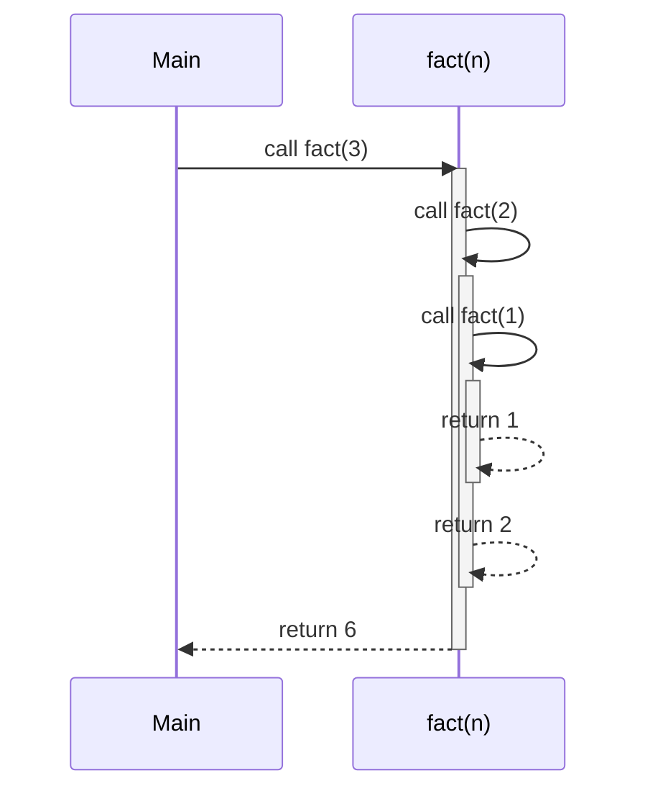
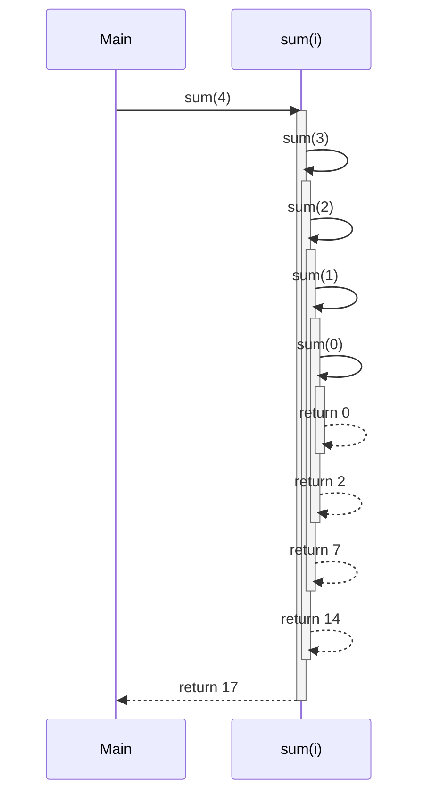
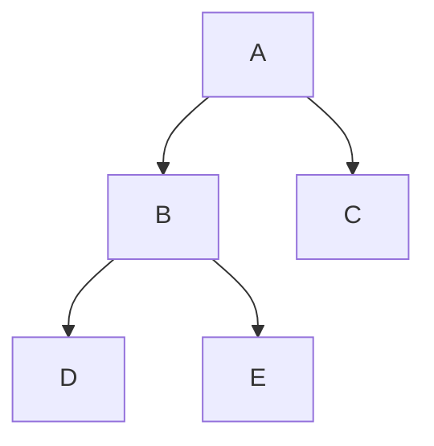
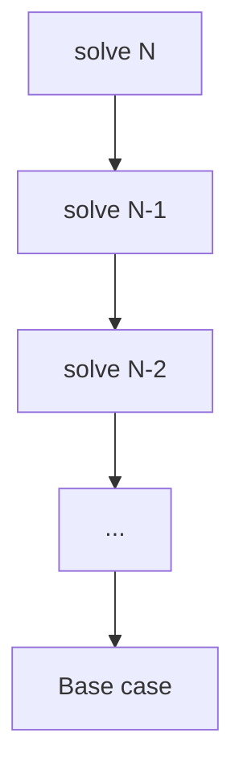

# 📚 Week_1_Day_4_Recursion_I_Instructional.md

🗓 **Week:** 1 | 📅 **Day:** 4  
📌 **Topic:** Recursion I — Call Stack & Basic Patterns  
⏱ **Duration:** ~60–75 minutes (reading) + practice  
🎯 **Difficulty:** 🟢🟡 Easy → Medium  
📚 **Prerequisites:**  
- Week 1 Day 1 – RAM Model & Pointers  
- Week 1 Day 2 – Asymptotic Analysis (Big-O)  
- Week 1 Day 3 – Space Complexity  
📊 **Interview Frequency (explicit):** Medium (~30–40%)  
📊 **Interview Frequency (implicit):** Very High (trees, DFS, backtracking, DP explanations)

🏭 **Real-World Impact:** Recursion is how we express many algorithms over **trees, graphs, and hierarchical data**. Misunderstanding recursion leads to stack overflow, incorrect base cases, or inefficient exponential behavior.

---

## 🎯 LEARNING OBJECTIVES

By the end of this file, you will:

✅ Explain what recursion is, and the roles of **base case** and **recursive case**  
✅ Trace recursive functions using **call stack** and **recursion tree** views (ASCII + Mermaid)  
✅ Analyze time and space complexity of basic recursive algorithms  
✅ Understand the **relationship between recursion and induction**  
✅ Know when recursion is appropriate vs when iteration is safer or clearer  

---

## 🤔 SECTION 1: THE WHY (Motivation & Context)

Recursion is the idea of **solving a problem by solving smaller instances of the same problem**. Many real-world structures are naturally **recursive**:

- File systems: directories containing files and subdirectories.
- HTML / XML / JSON: elements contain nested elements.
- Organizational charts, family trees, ASTs in compilers.

Rather than manually dealing with each level, recursion lets us say:

> “To process the whole structure, process this node and then recursively process its children.”

### 💼 Real-World Problems This Solves

1. **Tree- and Graph-Structured Data**

Modern applications heavily rely on structured data:

- JSON APIs (nested objects).
- DOM trees in browsers.
- Abstract syntax trees (AST) in compilers.

Example: DOM rendering in a browser:

- Each node (div, span, etc.) may contain children nodes.
- Layout algorithms recursively:
  - Compute layout of a node.
  - Recursively compute layout of its children.
  - Combine their sizes/positions.

Without recursion (explicit or implicit), code becomes deeply nested and error-prone.

2. **Divide-and-Conquer Algorithms**

Algorithms like **merge sort**, **quicksort**, and **binary search**:

- Divide problems into smaller subproblems.
- Solve subproblems recursively.
- Combine results.

These are standard in real systems:

- Libraries (C++ `std::sort`, Java `Arrays.sort`).
- DB query planners.
- Search engines.

Understanding recursion is crucial to internalize how these algorithms work and why their complexity is O(n log n) or similar.

3. **Backtracking and Search in Constraint Problems**

Sudoku solvers, puzzle solvers, AI search, and pathfinding:

- Explore possibility space recursively.
- At each level:
  - Try a choice.
  - Recursively explore consequences.
  - Backtrack if invalid.

Real examples:

- Game AI exploring move trees.
- Constraint solvers (scheduling, resource allocation).
- Configuration search in compilers.

Recursion gives a **natural framework** for exploring tree-like search spaces.

4. **Human Reasoning & Problem Decomposition**

Recursion mirrors how humans often reason:

- “To clean the house, clean each room; to clean each room, tidy surfaces, vacuum floor, etc.”

In code, recursion expresses:

- **Self-similarity**: large problem is made up of smaller copies of itself.
- **Inductive reasoning**: if we can solve small cases, we can build up to big cases.

### 🎯 Design Goals & Trade-offs

Recursion aims to:

- Express algorithms over hierarchical data **clearly and concisely**.
- Match mathematical definitions (factorial, Fibonacci, tree height).
- Simplify reasoning: think in terms of **base case + smaller case**.

Trade-offs:

- ✅ Clarity and conciseness.
- ✅ Natural for trees, graphs, and combinatorial search.
- ❌ Stack usage: risk of stack overflow when depth is large.
- ❌ Overhead per call: function call costs time and space.
- ❌ Risk of exponential blowup if subproblems overlap but are not memoized.

### 📜 Historical Context (Brief)

- Recursion originates in **mathematics**: recursive definitions of sequences (e.g., Fibonacci), sets, and functions.
- In **computer science**, languages like Lisp embraced recursion early as a core abstraction.
- The lambda calculus (foundational to functional programming) is inherently recursive.
- Many early algorithms are described recursively in seminal texts and research papers.

### 🎓 Interview Relevance

Recursion shows up in interviews in multiple ways:

- Classic recursion problems:
  - Factorial, Fibonacci, permutations, subsets.
- Tree and graph traversal:
  - Preorder/inorder/postorder, DFS.
- Divide-and-conquer:
  - Binary search, merge sort, quicksort.
- Backtracking:
  - N-Queens, Sudoku, combination sum.

Interviewers test recursion to see if you:

- Can reason about **base cases and recursion depth**.
- Understand **stack space**.
- Avoid exponential blowups unless necessary.

---

## 📌 SECTION 2: THE WHAT (Core Concepts)

### 💡 Core Analogy

Think of recursion like **standing between two mirrors**:

- Each mirror reflects your image into a “smaller” copy, and that copy reflects another, and so on.
- Eventually, at some distance, the reflection becomes invisible (base case).

In recursion:

- A function calls a **smaller version of itself**.
- Eventually, it reaches a base case where no further recursive call is made.

### 📌 Key Concepts

- **Recursive Function**: A function that calls itself directly or indirectly.
- **Base Case**: Condition under which the function **does not recurse**; returns a direct answer.
- **Recursive Case**: Part of the function where it calls itself with a “smaller” input.
- **Call Stack / Activation Record**:
  - Each function call gets its own frame: parameters, locals, return address.
  - Frames are pushed/popped in LIFO order.

### 🎨 Visual Representation — Call Stack (ASCII)

Example: factorial(3) = 3! = 3 × 2 × 1.

Call stack as recursion deepens:

```
Top of Stack
+---------------------+  ← fact(1)
| n = 1               |
| base case returns 1 |
+---------------------+
+---------------------+  ← fact(2)
| n = 2               |
| waiting for fact(1) |
+---------------------+
+---------------------+  ← fact(3)
| n = 3               |
| waiting for fact(2) |
+---------------------+
Bottom of Stack
```

On return, stack frames pop in reverse order:

- fact(1) returns 1 → fact(2) computes 2*1.
- fact(2) returns 2 → fact(3) computes 3*2.
- fact(3) returns 6.

### 🎨 Visual Representation — Recursion Tree (Mermaid)

Factorial recursion tree for n = 4:

```mermaid
flowchart TD
    A[fact(4)] --> B[fact(3)]
    B --> C[fact(2)]
    C --> D[fact(1)]
    D --> E[Base case: return 1]
```

- Each node represents a call.
- Each edge represents a recursive call to a smaller argument.

### 🎨 Visual Representation — Call Stack Timeline (Mermaid)



This sequence diagram shows nested calls and returns.

### 📋 Key Properties & Invariants

1. **Strictly Smaller Argument (Progress Measure)**  
   Every recursive call must move closer to a base case (e.g., `n-1`, smaller subarray, subtree).

2. **Base Case Coverage**  
   All possible inputs must eventually reach a base case; otherwise, recursion never terminates.

3. **Stack Discipline (LIFO)**  
   The call stack is last-in, first-out:
   - The most recently called function returns first.

4. **Purity of Subproblem Definition**  
   The recursive problem instance should be **the same problem type** but on a smaller input:
   - e.g., sum of first n elements → sum of first (n−1) plus last element.

---

## ⚙ SECTION 3: THE HOW (Mechanics)

### 📋 Designing a Recursive Solution

**Step 1: Define the Problem Clearly**

- Decide what the function is supposed to compute:
  - e.g., `sum(arr, n)` = sum of first n elements of array.

**Step 2: Identify Base Case(s)**

- Simple, smallest input where answer is trivial.
  - e.g., `sum(arr, 0) = 0`.

**Step 3: Define Recursive Case**

- Express answer for n in terms of answer for smaller n.
  - e.g., `sum(arr, n) = sum(arr, n−1) + arr[n−1]`.

**Step 4: Ensure Progress**

- Confirm that each recursive call is on smaller input.
  - e.g., n decreases by 1 each time.

**Step 5: Combine Results**

- Combine results from recursive calls with local computation to form answer.

**Step 6: Reason About Termination & Correctness**

- Termination: eventually hits base case.
- Correctness: often argued by **induction** (later section).

### ⚙ Mechanism on RAM Model

For each function call:

1. A new **frame** is pushed onto the stack:
   - Contains parameters, local variables, return address.
2. Execution jumps to function body.
3. On return:
   - Frame is popped.
   - Control flows back to caller.

In recursion:

- New frames keep being pushed until base case.
- Beyond some depth, stack overflow may occur.

### 🧱 Example: Recursive Sum Logic (No Code Syntax)

Define `sum(n)` over an array `A[0..n-1]` conceptually:

- If n = 0:
  - Return 0.
- Otherwise:
  - Let partial = sum(n−1).
  - Return partial + A[n−1].

State transitions:

- Each call holds its own `n` and its own suspended computation “waiting for sum(n−1)”.

Stack behavior:

- Depth grows linearly with n.
- Each frame stores `n` and perhaps an accumulator.

### 💾 State Management

In recursion, state is split:

- **Implicit state**: stored on the call stack (parameters, locals).
- **Explicit state**: sometimes we use parameters to thread state (e.g., accumulator).

For example, tail-recursive style:

- `sumTail(index, currentSum)`:
  - At each call, update currentSum and increment index.
  - Base case: index == n.

Conceptually, tail recursion can be transformed to iteration, reducing stack usage.

### ⚠ Edge Case Handling

For recursion:

- Make sure base case handles:
  - Empty input.
  - Single-element input.
- Avoid negative arguments or indices.
- Ensure logic does not skip base case due to off-by-one errors.

---

## 🎨 SECTION 4: VISUALIZATION (Examples & Traces)

### 📌 Example 1: Factorial (Simple Linear Recursion)

Compute 4! recursively.

Definition:

- fact(0) = 1 (base case).
- fact(n) = n * fact(n−1) for n > 0.

**Trace:**

1. Call fact(4):
   - Needs result of fact(3).
2. Call fact(3):
   - Needs result of fact(2).
3. Call fact(2):
   - Needs result of fact(1).
4. Call fact(1):
   - Needs result of fact(0).
5. Call fact(0):
   - Base case: return 1.

Unwinding:

- fact(1) = 1 * fact(0) = 1.
- fact(2) = 2 * 1 = 2.
- fact(3) = 3 * 2 = 6.
- fact(4) = 4 * 6 = 24.

ASCII call stack at deepest point:

```
Top
+------------------+  fact(0) -> returns 1
| n = 0            |
+------------------+
+------------------+  fact(1) waiting for fact(0)
| n = 1            |
+------------------+
+------------------+  fact(2)
| n = 2            |
+------------------+
+------------------+  fact(3)
| n = 3            |
+------------------+
+------------------+  fact(4)
| n = 4            |
+------------------+
Bottom
```

Mermaid recursion tree:

```mermaid
flowchart TD
    F4[fact(4)] --> F3[fact(3)]
    F3 --> F2[fact(2)]
    F2 --> F1[fact(1)]
    F1 --> F0[fact(0)]
    F0 --> R1[return 1]
```

Complexity:

- Time: O(n).
- Stack space: O(n).

---

### 📌 Example 2: Sum of Array (Recursive Decomposition)

Problem: sum elements of [2, 5, 7, 3].

Definition:

- sum(i) = sum of first i elements (indices 0..i-1).
- sum(0) = 0.
- sum(i) = sum(i−1) + A[i−1].

Trace:

- sum(4)
  - sum(3) + A[3]
    - sum(2) + A[2]
      - sum(1) + A[1]
        - sum(0) + A[0]
          - returns 0

Execution table:

| Call     | i | Expression                | Value |
|----------|---|---------------------------|-------|
| sum(0)   | 0 | 0                         | 0     |
| sum(1)   | 1 | sum(0) + A[0] = 0 + 2     | 2     |
| sum(2)   | 2 | sum(1) + A[1] = 2 + 5     | 7     |
| sum(3)   | 3 | sum(2) + A[2] = 7 + 7     | 14    |
| sum(4)   | 4 | sum(3) + A[3] = 14 + 3    | 17    |

Mermaid sequence of calls:



Again:

- Time: O(n).
- Stack space: O(n).

---

### 📌 Example 3: Preorder Traversal of Binary Tree

Binary tree:

```
       A
      / \
     B   C
    / \
   D   E
```

Preorder traversal: visit node, then left subtree, then right subtree.

Recursive definition:

- preorder(node):
  - If node is null: return.
  - Visit node.
  - preorder(node.left).
  - preorder(node.right).

Execution order: A, B, D, E, C.

Recursion tree is literally the tree:



Call stack at moment of visiting D:

- preorder(D)
- preorder(B)
- preorder(A)
- main

Complexity:

- Time: O(n) (visit each node once).
- Stack space: O(h), where h is tree height.

---

### ❌ Counter-Example: Missing Base Case

Bad recursive definition:

- `foo(n): return foo(n−1) + 1` (no base case).

Result:

- Calls foo(n−1), foo(n−2), ... infinitely until stack overflow.
- No termination.

This illustrates why **base cases are mandatory** and must be reachable.

---

## 📊 SECTION 5: CRITICAL ANALYSIS (Complexity & Correctness)

Let’s consider generic linear recursion of the form:

- `solve(n)` calls `solve(n−1)` once and does O(1) work.

### 📈 Complexity Table (Linear Recursion)

| 📌 Aspect        | ⏱ Time  | 💾 Space  | 📝 Notes                                                     |
|-----------------|---------|----------|--------------------------------------------------------------|
| **🟢 Best**      | O(n)    | O(n)     | Every call reduces n by 1 until base case.                  |
| **🟡 Average**   | O(n)    | O(n)     | Same pattern regardless of input distribution.              |
| **🔴 Worst**     | O(n)    | O(n)     | Depth n; stack frames leak if recursion doesn’t terminate.  |
| **🔄 Cache**     | —       | —        | Access pattern depends on problem; may be good or bad.      |
| **💼 Practical** | O(n)    | O(n)     | Overhead per call may be significant for large n.           |

For tree recursion like preorder traversal of a binary tree:

- Time: O(n) (each node visited once).
- Space: O(h) (call stack depth; h is tree height).

### 🤔 Overheads & Limitations

- **Call overhead**:
  - Each recursive call involves pushing a new frame.
  - For large numbers of calls, overhead can be non-trivial.
- **Stack limits**:
  - Many environments cap recursion depth (e.g., Python’s default recursion limit).
  - O(n) depth with large n can overflow.

### When Big-O Hides Important Details

- Two O(n) solutions:
  - Iterative solution: no recursion stack, tight loops.
  - Recursive solution: O(n) stack, possible overflow, overhead.

Asymptotic complexity says both are O(n), but:

- For large n, the recursive version may be unsafe or slower.
- For moderate n, clarity may outweigh overhead.

### Correctness via Induction

For simple recursive algorithms, correctness can often be shown by induction:

- Base case: show it returns correct result.
- Inductive step: assume correctness for smaller n; show it implies correctness for n.

This aligns closely with the structure of recursive code.

---

## 🏭 SECTION 6: REAL SYSTEMS (Recursion in Practice)

### 🏭 System 1: Quicksort in Standard Libraries

- **Problem:** Efficient general-purpose sorting.
- **Implementation:** Uses quicksort-like recursion:
  - choose pivot, partition array, recursively sort subarrays.
- **Space:** O(log n) expected stack depth (if balanced partitioning).
- **Impact:** Recursion enables clear divide-and-conquer structure.

### 🏭 System 2: Merge Sort in Language Runtimes

- **Problem:** Stable sorting.
- **Implementation:** Merge sort recursion:
  - split array in halves, recursively sort, merge.
- **Space:** O(n) auxiliary array plus O(log n) stack.
- **Impact:** Recursion aligns with natural splitting of array.

### 🏭 System 3: Filesystem Traversal (Unix `find`, backup tools)

- **Problem:** Traverse directories to find files, compute sizes, etc.
- **Implementation:** Recursively:
  - process directory.
  - for each subdirectory, recursively process it.
- **Impact:** Recursion matches hierarchical structure of directories.

### 🏭 System 4: Compilers and Interpreters (AST Traversal)

- **Problem:** Parse and process source code.
- **Implementation:** Recursive descent parsers and AST visitors:
  - parse expressions recursively (e.g., term → factor → literal).
  - recursively traverse tree for type-checking, optimization, codegen.
- **Impact:** Recursion simplifies complex syntax handling.

### 🏭 System 5: UI Layout Engines (e.g., Android, React)

- **Problem:** Compute size and position of UI components in nested layouts.
- **Implementation:** Recursively:
  - layout each parent component.
  - recursively layout children based on parent constraints.
- **Impact:** Recursion matches nested component trees.

### 🏭 System 6: Graph Search in Network Tools

- **Problem:** Check connectivity, find routes, perform DFS.
- **Implementation:** Often recursive DFS in prototypes; iterative for robustness.
- **Impact:** Recursion offers concise implementation; iterative used when stack safety is critical.

---

## 🔗 SECTION 7: CONCEPT CROSSOVERS

### 📚 Prerequisites

- RAM model and call stack (Week 1 Day 1).
- Big-O and space complexity (Week 1 Day 2–3).

### 🔀 Dependents (What Builds on This)

- **Week 4: Divide and Conquer Pattern**:
  - Recursion is the implementation mechanism for merge sort, quicksort, etc.
- **Week 6–7: Graph Algorithms (DFS)**:
  - Recursive DFS vs iterative DFS.
- **Week 10: Backtracking**:
  - Recursion for combinatorial search (subsets, permutations).
- **Week 11: Dynamic Programming (Top-Down)**:
  - Recursion + memoization as top-down DP.
- **Mathematical Induction**:
  - Used to prove correctness of recursive algorithms.

### 🔄 Similar Concepts & Differences

- **Recursion vs Iteration**:
  - Recursion: uses call stack, often simpler to express tree-like logic.
  - Iteration: uses explicit loops and data structures (stacks/queues), often more space-efficient and robust.

- **Recursion vs DP**:
  - Recursion alone: may recompute subproblems (exponential).
  - Recursion + memoization = DP: stores subproblem results to avoid recomputation.

---

## 📐 SECTION 8: MATHEMATICAL (Formal Basis)

### 📌 Recursive Definition Example

Factorial function:

- Base case: 0! = 1.
- Recursive case: n! = n × (n−1)! for n > 0.

### 📐 Inductive Proof of Correctness

**Claim:** For all integers n ≥ 0, the recursive factorial function computes n!.

**Proof (by induction)**:

- Base case (n = 0):
  - Definition: fact(0) returns 1.
  - By mathematics, 0! = 1.
  - So correct.

- Inductive step:
  - Assume fact(k) = k! for all k < n.
  - For n > 0:
    - fact(n) = n × fact(n−1) (recursive definition).
    - By induction hypothesis, fact(n−1) = (n−1)!.
    - So fact(n) = n × (n−1)! = n!.
  - Thus, fact(n) returns n!.

By induction, the recursive definition is correct for all n ≥ 0.

### 📈 Recurrence Perspective

For linear recursion:

- T(n) = T(n−1) + O(1), T(0) = O(1).
- Solve:
  - T(n) = O(n).

Space recursion:

- S(n) = S(n−1) + O(1) → S(n) = O(n).

---

## 💡 SECTION 9: ALGORITHMIC INTUITION (Decision Framework)

### 🎯 When to Use Recursion

Use recursion when:

- The problem is naturally **self-similar**:
  - Trees, graphs, nested structures.
- You see a **clear smaller subproblem** structure:
  - n → n−1, array → subarray, node → children.
- You want to express **divide-and-conquer**:
  - Solve halves, combine.

Typical patterns:

- Tree traversals (pre/in/post-order).
- DFS on graphs.
- Backtracking / combinatorial enumeration.

### ❌ When Not to Use Recursion

Avoid or be cautious when:

- Maximum recursion depth may exceed practical stack limits.
  - e.g., n up to 10^5 with naive recursion.
- The iterative version is straightforward and more robust.
- The language/environment has low recursion limits (e.g., Python default ~1000 frames).

In such cases:

- Rewrite recursion as iteration:
  - Use explicit stack or queue.
  - Simulate call stack behavior.

### 🔍 Interview Pattern Recognition

Red flags (recursion is likely the intended approach):

- Problem describes:
  - “Tree,” “nested,” “hierarchical,” “substructures.”
- Definition of problem is **self-referential**:
  - “The result depends on results for smaller subarrays, subtrees, or subproblems.”
- Problem asks for “all permutations/subsets/paths”:
  - Often solved via backtracking recursion.

Blue flags:

- Input constraints large with simple pattern:
  - Might need iterative solution or DP rather than naive recursion.

### ⚠ Common Misconceptions (Recursion)

- “Recursion is always slower”:
  - Overhead exists, but clarity and correctness may outweigh; plus, optimization and tail-call optimizations can mitigate.
- “If I don’t allocate arrays, recursion is free in space”:
  - Incorrect due to stack usage.
- “Any problem solvable by recursion must use recursion”:
  - Every recursive algorithm can be transformed into an iterative one (using explicit stack or similar).

---

## ❓ SECTION 10: KNOWLEDGE CHECK (Deep Questions)

1. **Explain how the call stack evolves during the execution of a recursive function like factorial. How do base cases and return values interact with the stack structure?**  
2. **Given a recursive function that calls itself twice with arguments roughly half the size (like merge sort), explain in detail why the time complexity is O(n log n) and space complexity is O(log n).**  
3. **How would you systematically convert a recursive DFS on a binary tree to an iterative one using an explicit stack? What space complexity do you obtain, and how does it compare with recursion?**  
4. **Consider a recursive function defined with multiple base cases (e.g., fib(0) and fib(1)). How does the choice and completeness of base cases affect termination and correctness?**  
5. **Describe how mathematical induction relates to proving correctness of recursive algorithms. Give a concrete example where you sketch both the recursive definition and the inductive proof.**

---

## 🎯 SECTION 11: RETENTION HOOK (Memory Devices)

### 💎 One-Liner Essence

“**Recursion solves big problems by solving smaller copies of the same problem, stacking calls until a base case, then unwinding with the answers.**”

### 🧠 Mnemonic Device

Acronym: **BARS**

- **B** – **B**ase case: where recursion stops.  
- **A** – **A**rguments shrink: each call moves closer to base.  
- **R** – **R**eturn combine: combine subresults on the way back.  
- **S** – **S**tack: calls live on the call stack.

When designing recursion, check **BARS**:

- Do I have a **Base** case?  
- Are **Arguments** shrinking?  
- How do I **Return and combine** results?  
- What is the **Stack** depth (space)?

### 📐 Visual Cue (ASCII + Mermaid)

ASCII:

```
Problem of size N
      |
      v
+------------------+
|  solve(N)        |
+------------------+
      |
      v
  smaller problem N-1
      |
   ...
      |
Base case (smallest problem)
```

Mermaid recursion ladder:



Picture: each call is a rung of a ladder descending to the base; then you climb back up with results.

### 📖 Real Interview Story

An interviewer asks:

> “Generate all subsets of a given set of distinct integers.”

Candidate A tries to do it iteratively with complex nested loops. They quickly get lost managing indices and edge cases.

Candidate B thinks in recursion:

- At each step, either **include** or **exclude** the current element.
- Base case: when there are no more elements, record the current subset.

They describe:

- `rec(i, currentSubset)`:
  - If i == n, record currentSubset, return.
  - Else:
    - Option 1: exclude A[i], call rec(i+1, currentSubset).
    - Option 2: include A[i], call rec(i+1, currentSubset ∪ {A[i]}).

They draw a recursion tree for small n, showing all subsets.

The interviewer sees:

- Clear recursive thinking.
- Correct base and recursive cases.
- Understanding of exponential complexity (O(2^n) subsets).

Candidate B gets a strong “hire” signal.

---

## 🧩 5 COGNITIVE LENSES

### 🖥 Computational Lens

- Each recursive call:
  - Allocates a stack frame (constant-sized, but stack depth matters).
- Recursion depth:
  - O(n) (linear), O(log n) (divide-and-conquer), or more complex (backtracking).
- Cost per call:
  - Constant overhead plus work.
- Cache behavior:
  - Recursion on contiguous data (arrays) often has good locality.
  - Tree recursion depends on node layout in memory.

### 🧠 Psychological Lens

- Students often think:
  - “Recursion is magic” → treat as black box and get lost.
  - “Recursion is always bad” → avoid it even when it is natural and clear.
- Effective mental models:
  - Visualize recursion as:
    - A **stack of calls**.
    - A **tree of subproblems**.
- Common errors:
  - Missing base case or incorrect base condition.
  - Not ensuring arguments shrink, leading to infinite recursion.
  - Misunderstanding which variables are local vs shared across calls.

### 🔄 Design Trade-off Lens

- Recursion vs iteration:
  - Recursion: simpler code, natural for tree/graph.
  - Iteration: more control over memory, often more efficient.
- Space vs clarity:
  - Recursion uses stack but yields clarity.
  - In-place iterative solutions may be harder to reason about.
- Backtracking recursion vs BFS:
  - Recursion (DFS/backtracking) vs BFS (queue).
  - Different memory patterns and performance characteristics.

### 🤖 AI/ML Analogy Lens

- Recursive definitions:
  - RNNs and recursive neural networks apply same transformation repeatedly, akin to recursive calls over sequences or trees (though implemented iteratively).
- Dynamic programming:
  - Recursion with memoization corresponds to value iteration / Bellman equations.
- Auto-differentiation:
  - Reverse-mode AD unwinds computation graph similarly to unwinding recursion.

### 📚 Historical Context Lens

- Recursion is foundational in theoretical CS:
  - Turing machines, lambda calculus, recursive function theory.
- Functional languages (Lisp, Scheme, Haskell) heavily rely on recursion.
- Early algorithms literature uses recursive descriptions extensively.
- Over time, iterative styles became popular in imperative languages to avoid stack issues, but recursion remains fundamental conceptually.

---

## 🎁 SUPPLEMENTARY OUTCOMES

### ⚔ Practice Problems (8–10, no solutions)

1. **Factorial** (basic recursion) – classic textbook problem  
   🎯 Concepts: Base case + linear recursion, stack depth O(n).

2. **Fibonacci Number** (LeetCode 509 – 🟢 Easy)  
   🎯 Concepts: Naive recursion (O(2^n)), then improve with memoization (DP).

3. **Power of a Number (x^n)** – recursive exponentiation  
   🎯 Concepts: Divide-and-conquer recursion (O(log n) via exponentiation by squaring).

4. **Sum of Linked List** – recursively compute sum  
   🎯 Concepts: Structural recursion on linked list nodes, stack depth O(n).

5. **Maximum Depth of Binary Tree** (LeetCode 104 – 🟢 Easy)  
   🎯 Concepts: Tree recursion, stack depth = height.

6. **Binary Tree Preorder Traversal** (LeetCode 144 – 🟢 Easy)  
   🎯 Concepts: Recursive traversal order, call stack vs tree structure.

7. **Subsets** (LeetCode 78 – 🟡 Medium)  
   🎯 Concepts: Backtracking recursion, recursion tree size O(2^n).

8. **Permutations** (LeetCode 46 – 🟡 Medium)  
   🎯 Concepts: Recursive generation via swapping or building permutations.

9. **Combination Sum** (LeetCode 39 – 🟡 Medium)  
   🎯 Concepts: Recursive DFS with pruning; stack tracks partial combination.

10. **N-Queens** (LeetCode 51 – 🔴 Hard)  
    🎯 Concepts: Complex backtracking, recursion tree, exponential search.

---

### 🎙 Interview Q&A (6+ pairs)

**Q1:** Why is recursion a natural fit for tree traversal problems?  
📢 **A:**  
Trees are inherently recursive structures: each node has children that are themselves roots of subtrees. Traversal tasks (preorder, inorder, postorder) follow naturally from this structure: “visit node, then traverse its left subtree, then its right subtree.” Recursion mirrors this definition: a function that processes a node then recursively processes its children. Implementation becomes simple and aligns with the problem’s mathematical structure. The call stack keeps track of where we are in the tree. While iterative solutions using stacks are possible, the recursive version directly encodes the tree’s self-similarity.

🔀 **Follow-up 1:** How would you convert recursive tree traversal into an iterative one?  
🔀 **Follow-up 2:** What is the space complexity of recursive traversal in terms of tree height?

---

**Q2:** What are the main components you think about when designing a recursive function?  
📢 **A:**  
I think in terms of **BARS**:

- **Base case:** The smallest input where the answer is trivial; prevents infinite recursion.
- **Arguments shrink:** Each recursive call must move closer to the base case (smaller or simpler input).
- **Return combine:** How the results of recursive calls combine with local work to form the final answer.
- **Stack:** I estimate the recursion depth to understand space complexity and risk of stack overflow.

This ensures termination, correctness, and awareness of space usage.

🔀 **Follow-up 1:** Can you give an example where missing a base case leads to infinite recursion?  
🔀 **Follow-up 2:** How do you ensure arguments shrink in a divide-and-conquer recursion?

---

**Q3:** How does recursion affect space complexity?  
📢 **A:**  
Recursion uses the call stack: each call pushes a frame containing parameters, local variables, and bookkeeping information. If the maximum recursion depth is D and each frame uses O(1) space, then stack space is O(D). For linear recursion that reduces n by 1 each time, D = O(n). For balanced divide-and-conquer (e.g., merge sort), D = O(log n). So even without explicit heap allocations, recursion can contribute O(n) or O(log n) auxiliary space.

🔀 **Follow-up 1:** What happens if recursion depth exceeds stack limits?  
🔀 **Follow-up 2:** How can you avoid stack overflow in a deep recursive algorithm?

---

**Q4:** Why might a recursive solution be preferred over an iterative one, even if they have the same time and space complexity?  
📢 **A:**  
A recursive solution often mirrors the **conceptual structure** of the problem, especially for trees, graphs, and divide-and-conquer algorithms. It can be more concise and easier to reason about. This reduces the risk of bugs and makes correctness arguments clearer (via induction). In many cases, performance differences between a well-implemented recursive and iterative solution are negligible compared to the development and debugging cost. Unless recursion depth is a practical concern, the clarity and maintainability of recursive code can justify its use.

🔀 **Follow-up 1:** Provide an example where recursion significantly simplifies the code.  
🔀 **Follow-up 2:** When would you still avoid recursion despite these advantages?

---

**Q5:** Explain why the naive recursive Fibonacci implementation is exponential time, and how you can improve it.  
📢 **A:**  
Naive recursive Fibonacci is defined as:

- fib(0) = 0, fib(1) = 1.
- fib(n) = fib(n−1) + fib(n−2).

The recursion tree for fib(n) has two children at each node (except base cases), leading to roughly 2^n nodes. Many subproblems are recomputed multiple times (e.g., fib(k) is recomputed from both fib(k+1) and fib(k+2)). This leads to exponential time. To improve, we can **memoize** results (top-down DP) or build them bottom-up (iterative DP). Both approaches ensure each fib(k) is computed once, reducing time complexity to O(n). Space complexity is O(n) for DP array or memo table; can be optimized to O(1) using just two variables.

🔀 **Follow-up 1:** What is the space complexity of naive recursive Fibonacci?  
🔀 **Follow-up 2:** How would you implement Fibonacci iteratively while preserving O(n) time?

---

**Q6:** How do you reason about the correctness of a recursive algorithm?  
📢 **A:**  
I align correctness reasoning with **mathematical induction**:

1. **Base case:** Show that when the base condition is met, the function returns the correct result.
2. **Inductive step:** Assume the function works correctly for all smaller inputs (induction hypothesis). Under that assumption, show that the function produces the correct result for the current input by combining the results of recursive calls appropriately.

This mirrors how the function operates: each call trusts its recursive calls to work on smaller inputs, and then it performs a correct local computation. If both base case and inductive step hold and the recursion always reaches a base case, the algorithm is correct.

🔀 **Follow-up 1:** Walk through an inductive correctness argument for recursive sum.  
🔀 **Follow-up 2:** How do you account for multiple base cases in the induction?

---

### ⚠ Common Misconceptions (3–5)

1. **❌ Misconception:** “Recursion is always less efficient than iteration.”  
   🧠 **Why:** Students hear about call overhead and stack usage.  
   ✅ **Reality:** While recursion has overhead, it can match iteration in asymptotic complexity and be more maintainable. Modern compilers and languages optimize many recursive patterns.  
   💡 **Memory aid:** “Recursion trades a bit of performance for clarity; use it where it fits naturally.”

2. **❌ Misconception:** “If I do not allocate arrays or lists, recursion has O(1) space complexity.”  
   🧠 **Why:** They equate explicit data structures with space usage and ignore the stack.  
   ✅ **Reality:** Each recursive call uses stack space; O(n) depth means O(n) auxiliary space.  
   💡 **Memory aid:** Visualize each call as a box on the stack; more calls, more boxes.

3. **❌ Misconception:** “Base case should only trigger rarely; recursion is about recursive cases.”  
   🧠 **Why:** They focus on the recursive step and neglect termination.  
   ✅ **Reality:** Base cases must cover all paths and be correct; they are essential for termination and correctness.  
   💡 **Memory aid:** “No base, no brace” — without base case, recursion never “embraces” completion.

4. **❌ Misconception:** “Any problem with loops can be rewritten with recursion to gain performance.”  
   🧠 **Why:** Misunderstanding of recursion’s role; they think recursion is magical.  
   ✅ **Reality:** Recursion is a different style of expressing control, not inherently faster. Performance depends on algorithmic complexity, not just syntactic style.  
   💡 **Memory aid:** “Recursion is a different road, not a shortcut.”

---

### 📈 Advanced Concepts (3–5)

1. **Tail Recursion and Tail-Call Optimization**

   🎓 Prerequisite: Understanding of recursion and stack.  
   🔗 Extends: Some languages optimize tail-recursive calls to avoid growing the stack.  
   💼 Use when: Writing recursion in languages with TCO (e.g., some functional languages).

2. **Mutual Recursion**

   🎓 Prerequisite: Basic recursion.  
   🔗 Relates to: Two or more functions calling each other recursively.  
   💼 Use when: Modeling alternating states, e.g., even/odd checks, state machines.

3. **Recursion + Memoization (Top-Down DP)**

   🎓 Prerequisite: Basic recursion and hash maps.  
   🔗 Extends: Avoids recomputation of subproblems by caching results.  
   💼 Use when: Recursion tree has overlapping subproblems.

4. **Higher-Order Recursion Schemes**

   🎓 Prerequisite: Functional programming basics.  
   🔗 Relates to: Map, fold, and other patterns that express recursion via higher-order functions.  
   💼 Use when: Abstracting common recursive patterns.

5. **Structural vs Generative Recursion**

   🎓 Prerequisite: Recursive data structures.  
   🔗 Relates to: Recursion following data structure shape (structural) vs recursing on generated values (generative).  
   💼 Use when: Designing recursive algorithms over trees, graphs, etc.

---

### 🔗 External Resources (3–5)

1. 🔗 **“How to Design Programs” – Felleisen et al. (HTDP)**  
   🎥 Type: 📖 Book  
   💡 Value: Excellent step-by-step approach to designing recursive functions, especially on lists and trees.  
   📊 Difficulty: Beginner–Intermediate.

2. 🔗 **MIT 6.001 / 6.009 Lectures on Recursion**  
   🎥 Type: 🎥 Video lectures  
   💡 Value: Visual explanation of call stack, recursion, and higher-order recursion patterns.  
   📊 Difficulty: Beginner–Intermediate.

3. 🔗 **“Structure and Interpretation of Computer Programs” (SICP)**  
   🎥 Type: 📖 Book + lectures  
   💡 Value: Deep conceptual treatment of recursion, including mathematical perspectives.  
   📊 Difficulty: Intermediate–Advanced.

4. 🔗 **VisuAlgo – Recursion Visualization**  
   🎥 Type: 🛠 Interactive tool  
   💡 Value: Step-by-step visualization of recursive calls and stack frames for common algorithms.  
   📊 Difficulty: Beginner–Intermediate.

5. 🔗 **Wikipedia: Recursion (Computer Science)**  
   🎥 Type: 📝 Article  
   💡 Value: Definitions, examples, and links to related topics (mutual recursion, recursion in math).  
   📊 Difficulty: Beginner.
