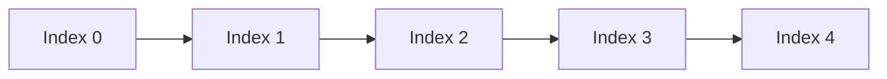
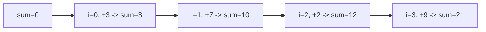
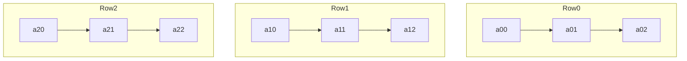

# 📚 Week_2_Day_1_Arrays_Instructional.md

🗓 **Week:** 2 | 📅 **Day:** 1  
📌 **Topic:** Arrays — Static Arrays & Indexing, Memory Layout, Insertion/Deletion, Variants  
⏱ **Duration:** ~60–75 minutes (reading) + practice  
🎯 **Difficulty:** 🟢🟡 Easy → Medium  
📚 **Prerequisites:**  
- Week 1 (RAM Model, Big-O, Space Complexity, Recursion I)  

📊 **Interview Frequency:** Very High (arrays appear in 50%+ interview problems, either explicitly or as underlying structure)  

🏭 **Real-World Impact:** Arrays are the **baseline data structure** in almost all programming environments. Understanding their memory layout and cost model is critical to designing efficient algorithms and understanding higher-level structures (dynamic arrays, heaps, hash tables, matrices).

---

## 🎯 LEARNING OBJECTIVES

By the end of this file, you will:

✅ Understand arrays as **contiguous blocks of memory** with O(1) random access  
✅ Explain the cost of **insertion/deletion at arbitrary positions** (O(n))  
✅ Recognize **cache locality** and why arrays are usually faster than pointer-heavy structures  
✅ Know the main **array variants**: multidimensional, jagged, and array-of-structs vs struct-of-arrays  
✅ Connect arrays to **real systems** (Python lists, Java arrays, C arrays, DB page layouts)  
✅ Know when arrays are the right choice vs lists or other structures  

---

## 🤔 SECTION 1: THE WHY (Motivation & Context)

Arrays are the **fundamental building block** for many other data structures:

- Dynamic arrays (vectors, ArrayList) wrap static arrays.
- Heaps are usually stored as arrays with implicit tree structure.
- Hash tables store buckets in arrays.
- Matrices are represented as 1D arrays with indexing formulas.

Understanding arrays gives you:

- A mental model for **memory layout and locality**.
- A basis for **O(1) random access** assumptions.
- A way to reason about insertion/deletion costs.

### 💼 Real-World Problems Arrays Solve

1. **Fast Indexing in Performance-Critical Systems**

In a trading engine or real-time analytics system:

- You might maintain a list of latest prices or metrics for thousands of instruments.
- Access patterns are often “get the ith element” or “scan contiguous ranges”.

With arrays:

- Accessing element i is O(1) (base address + offset).
- Sequential scans are cache-friendly.

Performance-critical C++ and Java systems heavily rely on array-backed structures because they:

- Reduce pointer chasing.
- Keep data packed tightly in memory.
- Exploit CPU caches and prefetching.

2. **Low-Level Systems & Memory Mapped I/O**

Operating systems and databases:

- Represent pages, frames, and other fixed-size units as entries in arrays.
- For example, a page table is essentially an array of entries representing mappings.

Arrays:

- Provide direct index-based access to hardware-related tables.
- Allow constant-time lookup by index (e.g., page number, descriptor ID).

3. **Graphics & Scientific Computing**

In graphics, signal processing, linear algebra:

- Images are 2D arrays (matrices) of pixels.
- Simulation grids are multidimensional arrays of values (e.g., temperature at points).

Performance often depends on:

- Accessing contiguous memory.
- Efficiently iterating with loops.

Arrays provide the necessary layout: contiguous memory for rows/columns.

4. **High-Level Data Structures Under the Hood**

In high-level languages:

- Python’s `list`, Java’s `ArrayList`, JavaScript’s arrays are **dynamic arrays** built on top of static arrays.
- Their behavior (amortized O(1) append, O(1) index) relies on underlying array properties.

Understanding arrays helps you:

- Reason about these library structures.
- Predict performance behavior (e.g., why random insert in the middle of a Python list is slow).

### 🎯 Design Goals & Trade-offs

Arrays optimize for:

- **O(1) random access by index**.
- **Contiguity**: improved cache locality on sequential scans.
- Simplicity: fixed-size block, no internal pointers inside the structure itself (element-level pointers are separate).

Trade-offs:

- ❌ Fixed size: capacity is typically fixed once allocated (unless wrapped by dynamic structure).
- ❌ Insertion/deletion in the middle: requires shifting elements → O(n) time.
- ❌ Expensive resize: copying entire array to a new location if needed.

Despite these, arrays are often the **fastest** choice for read-heavy workloads and the base representation for many algorithms.

### 🎓 Interview Relevance

Arrays show up in almost every interview:

- Direct questions:
  - “Implement an in-place array rotation.”
  - “Find two numbers in an array that sum to a target.”
  - “Rotate matrix, set matrix zeroes.”
- As underlying structure:
  - Sliding window / two pointers.
  - Binary search.
  - Dynamic arrays.
  - Heaps, priority queues.

Understanding arrays as contiguous memory helps you:

- See why two pointers & sliding windows are efficient.
- Reason about O(1) indexing and O(n) shifting.

---

## 📌 SECTION 2: THE WHAT (Core Concepts)

### 💡 Core Analogy

Think of an array as a **row of lockers**, numbered sequentially:

- Each locker has an address (index).
- Each locker has a fixed-size slot.
- To find the ith locker, you walk directly to it: no need to open all lockers before it.

In RAM model terms:

- An array is a **contiguous block of memory cells**.
- Index i maps to address: `base + i * element_size`.

### 🎨 Visual Representation (ASCII)

#### Basic 1D Array

Suppose we have an array of length 5, storing integers:

```
Index:   0     1     2     3     4
        +-----+-----+-----+-----+-----+
Value:  | 10  | 25  | 37  | 19  | 42  |
        +-----+-----+-----+-----+-----+
          ↑
        base
```

If base address in RAM is B (say 1000), and each int is 4 bytes:

- Element at index i is at address: `B + i * 4`.

#### Multidimensional Array (Logical View)

A 2D matrix 2×3:

```
Row 0:  [ a00  a01  a02 ]
Row 1:  [ a10  a11  a12 ]
```

Memory (row-major) as 1D array:

```
Index:   0     1     2     3     4     5
Elem:   a00   a01   a02   a10   a11   a12
```

Address formula (row-major):

- For element at (row r, col c), with nCols = 3: index = r * nCols + c.

### 🎨 Mermaid Representation

Array as a linear chain:



Think: moving from A0 to A4 is just stepping through contiguous cells.

### 📋 Key Properties & Invariants

1. **Contiguity Invariant**

   - All elements occupy **consecutive memory addresses**.
   - There are no gaps between array elements.

2. **Fixed Element Size**

   - Each element in the array has the same size (homogeneous type).
   - Simplifies index→address calculation.

3. **Index Bounds**

   - Valid indices: `[0, n-1]` for size n.
   - Access outside this range is invalid (leads to undefined behavior or bounds exceptions).

4. **Random Access O(1)**

   - Given index i, computing its address and reading/writing is constant-time under RAM model.

---

## ⚙ SECTION 3: THE HOW (Mechanics)

### 📋 Core Operations

We care about the **time and space behavior** of:

- Access by index.
- Traversal.
- Insertion.
- Deletion.
- Resize (if part of a wrapper structure).

### ⚙ Access by Index

Logical steps:

1. Maintain:
   - base address B
   - element size s
2. For index i:
   - Compute address = B + i * s.
   - Read or write to that address.

Under RAM model:

- Each of these steps is constant time → O(1).

### ⚙ Insertion at the End

If array has **unused capacity**:

1. Place new element at index `size`.
2. Increment `size`.

Auxiliary space: O(1).  
Time: O(1) (ignoring rare resizes; that’s Week 2 Day 2).

If array is exactly full and fixed-size:

- You cannot insert without resizing to a larger array (dynamic array topic).

### ⚙ Insertion at the Middle

To insert at index `k` (0 ≤ k ≤ size):

1. Ensure capacity (in fixed-size array, may not be possible).
2. Shift elements at indices [k..size−1] one position to the right:
   - For i from size−1 down to k:
     - A[i+1] = A[i].
3. Write new element at A[k].
4. size++.

Worst case: insertion at front (k = 0) shifts all size elements → O(n) time.

### ⚙ Deletion at the Middle

To delete element at index `k`:

1. Optionally store A[k] if you need it.
2. Shift elements [k+1..size−1] left one step:
   - For i from k+1 to size−1:
     - A[i−1] = A[i].
3. Decrement size.

Again, worst case O(n) (if deleting near front).

### 🎨 Visual Insertion Example (ASCII)

Array = [10, 20, 30, 40], size = 4. Insert 25 at index 2.

Initial:

```
Index: 0   1   2   3   4
       10  20  30  40  [ ]
```

Steps:

- Shift from right:
  - Move A[3] to A[4] → [10, 20, 30, 40, 40]
  - Move A[2] to A[3] → [10, 20, 30, 30, 40]
- Place 25 at A[2] → [10, 20, 25, 30, 40]

Result:

```
Index: 0   1   2   3   4
       10  20  25  30  40
```

### 🖥 Memory Behavior

- Sequential access (for loops) hits contiguous addresses:
  - Great for caches and prefetching.
- Insertion/deletion shifts cause many reads/writes:
  - Still contiguous but O(n) operations.

---

## 🎨 SECTION 4: VISUALIZATION (Examples & Traces)

### 📌 Example 1: Array Traversal

Goal: compute sum of array [3, 7, 2, 9].

Trace:

- sum = 0
- i=0 → sum += 3 → 3
- i=1 → sum += 7 → 10
- i=2 → sum += 2 → 12
- i=3 → sum += 9 → 21

Visualization:



Time: O(n); auxiliary space: O(1).

---

### 📌 Example 2: Element Access vs Linked List Access

Array A = [5, 10, 15, 20, 25].

- Access A[3]:

  - Address = B + 3*s (constant-time).
  - Single memory read.

Linked list (conceptual):

```
Head → [5 | *] → [10 | *] → [15 | *] → [20 | *] → [25 | null]
```

- Access 4th element (0-based index 3):

  - Start at head; follow 3 next pointers.
  - 3 pointer dereferences → O(n).

Arrays provide **direct indexing**, linked lists do **sequential traversal**.

---

### 📌 Example 3: Multidimensional Arrays and Cache

2D matrix 3x3 stored row-major:

```
[ a00  a01  a02
  a10  a11  a12
  a20  a21  a22 ]
```

Linear memory (row-major):

```
Index: 0    1    2    3    4    5    6    7    8
Value: a00  a01  a02  a10  a11  a12  a20  a21  a22
```

- Iterating **row-wise**:

  - Access sequence: a00, a01, a02, a10, a11, a12, a20, a21, a22 ⇒ contiguous.
- Iterating **column-wise**:

  - Access sequence: a00, a10, a20, a01, a11, a21, ... ⇒ jump with stride.

Row-wise is more cache-friendly.

Mermaid showing row-major mapping:



Each row stored contiguously; row-major scanning will use cache better.

---

### ❌ Counter-Example: Out-of-Bounds Access

Array size n = 4, indices 0..3.

If code tries to access A[4] or A[-1]:

- In high-level languages:
  - IndexError / exception.
- In low-level languages:
  - Undefined behavior: might read/write arbitrary memory.

This violates the **index bounds invariant** and is a serious bug.

---

## 📊 SECTION 5: CRITICAL ANALYSIS (Complexity & Trade-offs)

### 📈 Complexity Summary

| 📌 Operation                    | ⏱ Time        | 💾 Aux Space | 📝 Notes                                           |
|--------------------------------|---------------|-------------|---------------------------------------------------|
| Access A[i]                    | O(1)          | O(1)        | Direct index→address mapping                      |
| Update A[i]                    | O(1)          | O(1)        | Constant-time write                               |
| Traverse all elements          | O(n)          | O(1)        | Single pass                                       |
| Insert at end (free capacity)  | O(1)          | O(1)        | Just write next slot; dynamic arrays amortized    |
| Insert at position k           | O(n−k) ≈ O(n) | O(1)        | Shift elements to the right                       |
| Delete at position k           | O(n−k) ≈ O(n) | O(1)        | Shift elements to the left                        |
| Resize (copy to new array)     | O(n)          | O(n)        | For dynamic arrays; rare but expensive            |

### 🤔 Why Big-O Might Be Misleading

- Although we say “insert at end is O(1),” in many languages with dynamic arrays:
  - Sometimes they need to resize → O(n) copy.
  - But amortized over many operations, average is O(1).
- Constant factors matter:
  - Accessing A[i] is extremely fast due to contiguity.
  - Inserting in middle is expensive due to copies.

### Practical Notes

- Arrays are ideal for **read-heavy** workloads and algorithms that mostly:
  - Append at end.
  - Traverse sequentially.
  - Occasionally perform O(n) operations (like resizing in dynamic arrays).

- Arrays are less ideal if:
  - Frequent insertions/deletions in the middle at arbitrary positions.
  - You need flexible size and many such operations → linked lists or balanced trees may be better.

---

## 🏭 SECTION 6: REAL SYSTEMS (Arrays in Practice)

### 🏭 System 1: C/ C++ Raw Arrays

- **Problem:** Low-level system programming needs tight control over memory.
- **Implementation:** Arrays declared with fixed size:
  - `int arr[100];` conceptually.
- **Impact:** 
  - Direct mapping to contiguous memory.
  - Indexing is pointer arithmetic.
  - Very fast, but no bounds checking.

### 🏭 System 2: Python Lists

- **Problem:** Provide flexible, dynamic sequence type.
- **Implementation:** Dynamic array under the hood:
  - Over-allocated capacity.
  - Append amortized O(1).
  - Insert/delete in middle O(n).
- **Impact:** Python developers rely on O(1) indexing and amortized O(1) append without worrying about implementation details—built on arrays.

### 🏭 System 3: Java Arrays and ArrayList

- **Problem:** Provide both fixed-size and dynamic sequences.
- **Implementation:**
  - `int[] arr` → fixed-length array.
  - `ArrayList<E>` → dynamic array that manages resizing internally.
- **Impact:** Many frameworks and libraries build on these, expecting O(1) index operations.

### 🏭 System 4: Heaps in Priority Queues

- **Problem:** Efficiently store a priority queue with O(log n) insert/extract-min.
- **Implementation:** Binary heap stored in an array:
  - Children and parents derived by index: for node at i, children at 2i+1, 2i+2.
- **Impact:** Avoids pointer-heavy structures; uses contiguous memory for efficiency.

### 🏭 System 5: Databases — Page and Slot Arrays

- **Problem:** Organize fixed-size pages containing variable/fixed-length records.
- **Implementation:** Page contains array-like structures for slots or offsets.
- **Impact:** Fast indexing by slot number; predictable layout useful for storage engines.

### 🏭 System 6: GPU & SIMD Processing

- **Problem:** Achieve massive parallelism on arrays of data (vectors, images).
- **Implementation:** GPU kernels operate on arrays; vectorized CPU instructions (SIMD) assume contiguous memory.
- **Impact:** Arrays map directly to vector hardware, enabling huge speedups.

---

## 🔗 SECTION 7: CONCEPT CROSSOVERS

### 📚 Prerequisites

- RAM model (Week 1 Day 1).
- Big-O (Week 1 Day 2).
- Space complexity (Week 1 Day 3).

### 🔀 Dependencies / Future Topics

- **Dynamic Arrays (Week 2 Day 2):**
  - Build on arrays and amortized analysis.
- **Linked Lists (Week 2 Day 3):**
  - Contrast: contiguous vs pointer-based memory layout.
- **Stacks & Queues (Week 2 Day 4):**
  - Array-backed stacks/queues; circular arrays.
- **Binary Search (Week 2 Day 5):**
  - Requires random access arrays as prerequisite.
- **Heaps, Segment Trees (Weeks 5, 8):**
  - Implemented using arrays.
- **Matrix algorithms, DP on grids:**
  - Use arrays for state tables.

### 🔄 Arrays vs Alternatives (High-Level)

- Arrays vs Linked Lists:
  - Arrays: O(1) indexing, O(n) middle insert/delete, excellent locality.
  - Lists: O(n) indexing, O(1) insert/delete given pointer, poor locality.
- Arrays vs Resizable Arrays:
  - Static arrays: fixed size.
  - Dynamic: arrays with growth strategy; we analyze them next.

---

## 📐 SECTION 8: MATHEMATICAL (Formal Model)

### 📌 Formal Model of an Array

In the RAM model:

- An array A of length n is:
  - A mapping from index set `{0, 1, ..., n−1}` to values.
  - Implemented with a base address B such that:
    - For each i in [0, n−1], A[i] is stored at address `B + i`.

More precisely (in word units):

- If each element occupies one word:
  - `addr(A[i]) = B + i`.

### 📐 O(1) Access Justification

Under the RAM model:

- Address computation `B + i` is constant-time.
- Memory access `M[B+i]` is constant-time.
- So reading or writing A[i] is O(1).

### 📈 Cost of Middle Insertion

To insert at index k:

- You shift each element at indices j ∈ [k..n−1] one step right.
- Number of moves = n − k.
- In worst case (k = 0): moves = n.
- So time is Θ(n).

Mathematically:

- Let T(n) be time for inserting at front of array of size n.
- T(n) = cn + d (for constants c, d) → T(n) = Θ(n).

---

## 💡 SECTION 9: ALGORITHMIC INTUITION (Decision Framework)

### 🎯 When to Choose Arrays

Use arrays when:

- You need **fast random access** by index.
- You mainly **append** or operate at the end.
- You iterate **sequentially** over data.
- The size is known or can be handled by dynamic arrays.

Common patterns:

- Two-pointer techniques (e.g., container with most water).
- Sliding window (fixed/variable) on contiguous data.
- Binary search on sorted array.

### ❌ When Not to Use Arrays (or Use With Care)

Avoid pure arrays when:

- You need frequent insertion/deletion at arbitrary positions in large datasets.
- You need indefinite growth but cannot afford occasional O(n) resizes and shifts.
- Data structure semantics are better expressed as a linked or tree structure.

### 🔍 Interview Pattern Recognition

Red flags for arrays:

- Problem gives input as “array” or “list” and implies:
  - Frequent indexing.
  - Sorting.
  - Binary search.
- Hints:
  - “In-place” operations (rotate, partition).
  - “Subarrays,” “prefix sums,” “sliding windows.”

Interviewers expect you to:

- Exploit O(1) indexing.
- Reason about O(n) traversal vs O(n^2) naive double loops.

---

## ❓ SECTION 10: KNOWLEDGE CHECK (Deep Questions)

1. **Why does an array provide O(1) access by index under the RAM model, and how does its contiguity in memory enable this?**  
2. **Explain why insertion in the middle of a static array is O(n) time, and discuss how this affects performance when insertions are frequent.**  
3. **Compare the cache behavior of arrays and linked lists when traversing all elements sequentially. How does this affect performance in practice?**  
4. **In what situations would you prefer an array over a linked list, even though insertion in the middle is more expensive for arrays?**  
5. **How would you represent a 2D array in a 1D memory space, and what indexing formulas would you use to compute the address of element (i, j)?**

---

## 🎯 SECTION 11: RETENTION HOOK (Memory Devices)

### 💎 One-Liner Essence

“**Arrays are contiguous lockers in memory, giving O(1) random access at the cost of expensive shifts for middle insertions.**”

### 🧠 Mnemonic Device

Acronym: **LOCKER**

- **L** – **L**inear, contiguous memory  
- **O** – **O(1)** random access  
- **C** – **C**ache-friendly (sequential)  
- **K** – **K**illing performance for middle insert/delete (O(n))  
- **E** – **E**asy to reason about (simple layout)  
- **R** – **R**equired foundation for many structures (dynamic arrays, heaps, etc.)

### 📐 Visual Cue (ASCII)

Think of array as a row of lockers:

```text
Lockers (Array):

+-----+-----+-----+-----+-----+
|  0  |  1  |  2  |  3  |  4  |
+-----+-----+-----+-----+-----+
  ^              ^
  |              |
  direct index   direct index (no walking)
```

Indices are like locker numbers: you walk straight to the locker.

### 📖 Real Interview Story

An interviewer asks:

> “Given an array of integers, remove all occurrences of a value in-place and return the new length.”

Candidate A:

- Creates a new array, copies over non-target elements.
- Time: O(n).
- Space: O(n) extra.

Candidate B:

- Uses a write index:
  - Iterate read index from 0..n−1.
  - If A[read] != target, write A[write] = A[read], increment write.
- At the end, write is the new length.
- Time: O(n), space: O(1), in-place.

Candidate B explains:

> “Since arrays are contiguous and support O(1) random access, I can overwrite elements in-place while scanning once. I only need two indices; no extra arrays.”

Interviewer likes that:

- Candidate B exploited the array’s **contiguity** and **O(1) random access** to design an in-place O(n) algorithm.

---

## 🧩 5 COGNITIVE LENSES

### 🖥 Computational Lens

- Arrays map directly to RAM addresses:
  - `addr = base + i * element_size`.
- Cache-friendly:
  - Sequential loops iterate over contiguous cache lines.
- Poor for frequent middle insertions:
  - Many memory writes; but still contiguous, so no pointer chasing.
- Compared to linked lists:
  - Arrays: fewer pointer dereferences, better cache behavior.
  - Lists: more pointer chasing, worse locality.

### 🧠 Psychological Lens

- Students often think:
  - “Array” = “just a list” without appreciating contiguity implications.
- Misconceptions:
  - Assuming insert/delete in array are O(1) because “we just put it there” (ignoring shifting).
- Helpful mental model:
  - Lockers in a row; inserting a locker in the middle requires shifting all subsequent lockers.
- Memory aids:
  - Whenever you see an index like A[i], visualize direct jump to locker i in a long row.

### 🔄 Design Trade-off Lens

- Arrays vs Linked Lists:
  - Random access vs insertion/deletion speed.
- Static vs Dynamic Array:
  - Simpler fixed-size vs flexible capacity with occasional resize cost.
- Memory vs Speed:
  - Arrays pack data tightly, using less overhead per element.
  - Pointers in lists add overhead and fragmentation.

### 🤖 AI/ML Analogy Lens

- Tensors (in ML frameworks) are essentially multi-dimensional arrays:
  - Layout (row-major/column-major) and strides affect performance.
- Vectorization:
  - GPU kernels and SIMD operations assume array-like contiguous storage.
- Data loaders:
  - Often batch operations over contiguous arrays for throughput.

### 📚 Historical Context Lens

- Early programming (Fortran, C) was built around arrays for numeric computing.
- Classic algorithms (sorting, searching) were defined on arrays.
- As memory hierarchies became important, arrays remained central because they align with how hardware prefers to fetch data.
- Many new abstractions (tensors, DataFrames) still rely on array-like structures internally.

---

## 🎁 SUPPLEMENTARY OUTCOMES

### ⚔ Practice Problems (8–10)

1. **Remove Element** (LeetCode 27 – 🟢 Easy)  
   🎯 Concepts: Two pointers, in-place overwrite, O(1) extra space.

2. **Remove Duplicates from Sorted Array** (LeetCode 26 – 🟢 Easy)  
   🎯 Concepts: Two pointers, understanding sorted property, array compaction.

3. **Move Zeroes** (LeetCode 283 – 🟢 Easy)  
   🎯 Concepts: In-place stable compaction, maintaining order.

4. **Rotate Array** (LeetCode 189 – 🟡 Medium)  
   🎯 Concepts: In-place rotation, reversal method, O(1) space.

5. **Merge Sorted Array** (LeetCode 88 – 🟢 Easy)  
   🎯 Concepts: Two-pointer merge in-place from the end.

6. **Best Time to Buy and Sell Stock** (LeetCode 121 – 🟢 Easy)  
   🎯 Concepts: Single pass array, tracking min so far.

7. **Container With Most Water** (LeetCode 11 – 🟡 Medium)  
   🎯 Concepts: Two pointers on array, O(n) solution vs O(n^2) naive.

8. **Product of Array Except Self** (LeetCode 238 – 🟡 Medium)  
   🎯 Concepts: Arrays, prefix/suffix products, O(1) extra space trick.

9. **Maximum Subarray** (LeetCode 53 – 🟡 Medium)  
   🎯 Concepts: Kadane’s algorithm, linear pass, array DP.

10. **Find Minimum in Rotated Sorted Array** (LeetCode 153 – 🟡 Medium)  
    🎯 Concepts: Binary search on array, O(log n) time.

---

### 🎙 Interview Q&A (6+ pairs)

**Q1:** Why does an array provide O(1) access by index?  
📢 **A:**  
Because arrays are contiguous in memory, the address of A[i] can be computed directly using a simple arithmetic formula: `addr = base + i * element_size`. Under the RAM model, arithmetic operations and memory accesses are O(1). Therefore, indexing is constant-time regardless of array length. There is no need to traverse from the beginning to reach index i, unlike linked lists, which must follow pointers step by step.

🔀 **Follow-up 1:** How does this change if we consider cache and memory hierarchies in practice?  
🔀 **Follow-up 2:** Why can’t linked lists provide the same O(1) indexing?

---

**Q2:** Why is inserting or deleting in the middle of an array O(n)?  
📢 **A:**  
In a contiguous array, elements occupy consecutive memory cells with no gaps. To insert at position k, we must make room by shifting each element from indices k..n−1 one position to the right; that’s O(n−k) moves. Similarly, deleting at k requires shifting elements from k+1..n−1 left by one. In the worst case (near the front), this is O(n) operations. There is no cheap way to “link around” a position as in a linked list; contiguity forces us to move all subsequent elements to preserve order and index mapping.

🔀 **Follow-up 1:** How does this behavior influence your choice between arrays and linked lists in practice?  
🔀 **Follow-up 2:** What happens if order doesn’t matter—can you do better?

---

**Q3:** What is the difference between a static array and a dynamic array in terms of behavior and implementation?  
📢 **A:**  
A static array has a fixed size determined at allocation; you cannot grow or shrink it without creating a new array and copying elements. A dynamic array, like `ArrayList` or Python’s `list`, maintains an internal static array but tracks a logical size and capacity. When full, it allocates a larger array (often doubling capacity), copies elements, and continues. Behaviorally, the dynamic array offers:

- O(1) random access, like a static array.
- Amortized O(1) append at end.
- O(n) insertion/deletion in the middle.

Implementation-wise, dynamic arrays use arrays and manage capacity and resizing internally.

🔀 **Follow-up 1:** Why is append amortized O(1) for dynamic arrays?  
🔀 **Follow-up 2:** What are the space trade-offs of over-allocating capacity?

---

**Q4:** How does cache locality make arrays faster than linked lists in many real workloads?  
📢 **A:**  
Arrays store elements contiguously, so iterating from A[0] to A[n−1] accesses memory addresses in a predictable, sequential way. CPUs fetch data in cache lines, and prefetching mechanisms anticipate such sequential access and bring future elements into cache before they are needed. Linked lists store nodes at scattered addresses; each node access involves following a pointer to an unpredictable address, often causing cache misses. As a result, even though both traversals are O(n) in Big-O terms, array traversal is often significantly faster in practice due to fewer cache misses and better prefetching.

🔀 **Follow-up 1:** Can you think of a scenario where linked lists might still be preferable despite poorer cache locality?  
🔀 **Follow-up 2:** How does this influence your choice of data structure for high-performance code?

---

**Q5:** How do you represent a 2D array using a 1D array in memory?  
📢 **A:**  
Assuming row-major order and dimensions `rows` and `cols`, we can store all elements in a 1D array `data` of length `rows * cols`. The element at row `r` and column `c` (0-based) is stored at linear index `r * cols + c`. Accessing `A[r][c]` translates to `data[r * cols + c]`. This approach is how most languages represent 2D arrays under the hood, even if they expose a syntactic `A[r][c]` notation.

🔀 **Follow-up 1:** How would this change for column-major order (e.g., in Fortran/NumPy)?  
🔀 **Follow-up 2:** What implications does this have for cache-friendly access patterns?

---

**Q6:** When would you choose to use an array even if you know you’ll need to insert in the middle occasionally?  
📢 **A:**  
If random access and sequential performance are critical and middle insertions are rare or over small n, arrays can still be the better choice. For example, in many UI or analytics applications, you compute over large arrays and occasionally insert or delete a small number of elements. The O(n) cost is acceptable for those rare operations, while you benefit from arrays’ O(1) indexing and cache-friendly traversal the rest of the time. Additionally, simplicity and lower per-element memory overhead may outweigh the downside of occasional O(n) operations.

🔀 **Follow-up 1:** How might you mitigate the cost of frequent middle insertions if you must stick with arrays?  
🔀 **Follow-up 2:** What other structures could you consider if insertions become very frequent?

---

### ⚠ Common Misconceptions (3–5)

1. **❌ Misconception:** “Array insertion is O(1) because I just assign A[k] = x.”  
   ✅ **Reality:** To preserve order and contiguity, you must shift elements to make space. Only overwriting is O(1); insertion that changes size is O(n).  
   💡 **Memory aid:** Think “**insert** ≠ overwrite”; inserting means creating room.

2. **❌ Misconception:** “Arrays and lists in high-level languages behave the same.”  
   ✅ **Reality:** Language “lists” often are dynamic arrays (Python) or linked lists (some libraries). Their performance characteristics differ; you must know underlying structure.  
   💡 **Memory aid:** Always ask: “Is this **really** an array or a linked list under the hood?”

3. **❌ Misconception:** “All O(1) operations are equally fast.”  
   ✅ **Reality:** O(1) hides constants and hardware behavior; array indexing is often extremely fast, but other O(1) operations might involve cache misses or more instructions.  
   💡 **Memory aid:** “Same Big-O, different **big constant**.”

4. **❌ Misconception:** “2D arrays are true 2D memory blocks.”  
   ✅ **Reality:** They are almost always 1D arrays with indexing formulas; understanding mapping is essential for optimizing access patterns.  
   💡 **Memory aid:** Visualize a “flattened” grid into a line.

---

### 📈 Advanced Concepts (3–5)

1. **Struct of Arrays (SoA) vs Array of Structs (AoS)**  
   - AoS: `struct {x,y,z}` in an array → better for object-centric operations.  
   - SoA: separate arrays for x, y, z → often more cache-friendly for vectorized operations.

2. **Circular Buffers (Ring Buffers)**  
   - Fixed-size array with head/tail indices wrapping around.  
   - Used for efficient queues, logging buffers, audio processing.

3. **Sparse vs Dense Arrays**  
   - Dense: standard arrays for mostly-filled data.  
   - Sparse representations (like coordinate lists, CSR) used when majority of entries are zero.

4. **SIMD / Vectorization**  
   - Using CPU vector instructions or GPU kernels to process array data in parallel.  
   - Requires aligned, contiguous arrays.

5. **Memory Alignment and Padding**  
   - Arrays of structs may suffer from padding; designing struct layouts impacts cache and memory usage.

---

### 🔗 External Resources (3–5)

1. 🔗 **“Computer Systems: A Programmer’s Perspective” (CS:APP)** – Chapters on memory and arrays  
   🎥 Type: 📖 Book  
   💡 Value: Detailed explanation of arrays, memory layout, and cache behavior.  

2. 🔗 **“Algorithms” by Sedgewick & Wayne** – Array-based algorithm implementations  
   🎥 Type: 📖 Book + online lectures  
   💡 Value: Shows how arrays underpin many basic algorithms and data structures.  

3. 🔗 **MIT 6.172: Performance Engineering – Lectures on Memory & Locality**  
   🎥 Type: 🎥 Video  
   💡 Value: Explains why contiguous arrays are fast and how to exploit them.  

4. 🔗 **CPython source for listobject.c**  
   🎥 Type: 📝 Source code  
   💡 Value: Real implementation of Python’s dynamic array (list) and its growth strategies.  

5. 🔗 **NumPy Documentation on ndarray**  
   🎥 Type: 📝 Docs  
   💡 Value: Explains strides, shapes, and how arrays map to memory for scientific computing.  

---