# 📚 Week_2_Day_2_Dynamic_Arrays_Instructional.md — Dynamic Arrays & Amortized Analysis

🗓 **Week:** 2 | 📅 **Day:** 2  
📌 **Topic:** Dynamic Arrays — Growth Strategies & Amortized O(1) Operations  
⏱ **Duration:** ~60–90 minutes (reading) + practice  
🎯 **Difficulty:** 🟡 Medium  
📚 **Prerequisites:**  
- Week 1 (RAM Model, Big-O, Space Complexity)  
- Week_2_Day_1_Arrays_Instructional.md  

📊 **Interview Frequency:** High (~40–50% as explicit or implicit concept)

🏭 **Real-World Impact:** Dynamic arrays are how most high-level languages implement “lists” or “arrays.” Understanding them explains why `append` is usually O(1), why sporadic operations are slow (resizes), and why these structures are the default choice in libraries (Python `list`, Java `ArrayList`, C++ `vector`, Go slices, JavaScript arrays).

---

## 🤔 SECTION 1: THE WHY (Motivation & Context)

Static arrays are powerful but rigid:

- Size is fixed at allocation.
- Exceeding capacity causes errors or requires manual reallocation & copying.
- You must know the needed size in advance or over-allocate.

Real-world programs almost never know the exact number of elements in advance:

- Logs grow dynamically.
- Users add items to shopping carts.
- Live streams produce events continuously.
- Data pipelines ingest unknown volumes.

We need **flexible sequences**:

- Support O(1) random access like arrays.
- Allow efficient appends (and often pops from end).
- Grow as needed without constant manual resizing.

Dynamic arrays solve this by:

- Wrapping a static array.
- Tracking **size** (logical length) and **capacity** (allocated length).
- Growing capacity occasionally (e.g., doubling) when more space is needed.

### 💼 Real-World Problems This Solves

1. **Generic “List”/“Vector” in Languages**

Almost every general-purpose language provides a growable list type:

- Python `list`
- Java `ArrayList`
- C++ `std::vector`
- Go slices
- JavaScript arrays

These must behave like:

- O(1) indexed access.
- O(1) amortized append at end.
- Reasonable behavior when removing from end.

Without dynamic arrays, each “push” could require new allocations and copies, making simple idioms prohibitively expensive.

2. **Streaming Data / Online Algorithms**

In real systems:

- You read data from a file, network, or socket.
- You don’t know size ahead of time.
- You want to store all items in a growable buffer.

Dynamic arrays:

- Start small.
- Expand only when necessary.
- Allocate more capacity than currently needed to amortize cost.

For example, a log ingestion service uses a dynamic array to buffer log entries before flushing to disk or sending to another service.

3. **User-Facing Collections (UI, Apps)**

User actions:

- Add items to playlists, carts, favorites.
- Remove items occasionally.

Dynamic arrays shine:

- Most operations: append/remove at end → O(1) amortized.
- Rare operations: insert/delete in middle → O(n), but usually acceptable.

4. **Implementing Other Structures Efficiently**

Many other data structures benefit from dynamic arrays:

- Stacks and queues (array-backed).
- Min-heaps and priority queues.
- Dynamic adjacency lists for graphs.

Using dynamic arrays simplifies implementation:

- You get flexible size and array-like performance.
- You can design high-level structures without micromanaging memory.

### 🎯 Design Goals & Trade-offs

Dynamic arrays aim to:

- Maintain O(1) **random access** (same as static arrays).
- Provide O(1) **amortized** append at end.
- Hide complexity of memory management from the user.

Trade-offs:

- ✅ Excellent for mostly-append workloads.
- ✅ Good constant factors and cache locality (contiguous memory).
- ❌ Occasional O(n) spikes when resizing (copy all elements).
- ❌ Memory overhead: capacity > size (unused slots).
- ❌ Middle insert/delete remain O(n) because we must shift elements.

The **amortized** perspective is essential: though some operations are expensive, the **average cost per operation over long sequences** is O(1).

### 📜 Historical Context (Brief)

- Early languages like C provided only static arrays; dynamic growth had to be implemented manually.
- C++ introduced `std::vector` as a standard dynamic array, setting a pattern for many later languages.
- Python, Java, Go, JS all follow similar principles:
  - Over-allocate capacity.
  - Resize by a factor (e.g., 2x or 1.5x) when full.
- Amortized analysis was developed to reason about such data structures rigorously, ensuring they meet performance guarantees.

### 🎓 Interview Relevance

Dynamic arrays and amortized analysis appear as:

- Direct questions:
  - “Design a dynamic array (vector) API and analyze complexity.”
  - “Explain why `append` in Python list is O(1) amortized.”
  - “What is the difference between size and capacity?”
- Indirect:
  - Stack/queue implemented on arrays.
  - Resizable buffers.

Interviewers look for:

- Understanding of **capacity**, **size**, and **growth strategy**.
- Ability to explain **amortized O(1)** properly (not “it’s just O(1) always”).
- Awareness of **space overhead** and occasional O(n) copies.

---

## 📌 SECTION 2: THE WHAT (Core Concepts)

### 💡 Core Analogy

Imagine a **stretchy bookshelf**:

- You start with a small shelf (capacity for 4 books).
- As you add books:
  - When full, you buy a larger shelf (say double size), move all books, and throw away the old shelf.
- Day to day:
  - Adding a book is just “put it on the next free slot.”
  - Occasionally, you have a “big moving day” when you resize.

Dynamic array is that stretchy shelf:

- Most inserts are cheap; occasional resizing is expensive.
- Averaged over all inserts, cost per insert is small.

### 📌 Conceptual Structure

Dynamic array maintains:

- A pointer to an underlying static array of capacity C.
- A **size** field: number of elements currently in use (0 ≤ size ≤ C).
- A **capacity** field: number of slots allocated.

Invariants:

1. **0 ≤ size ≤ capacity** always holds.
2. Elements are stored contiguously in indices [0..size−1].
3. Slots [size..capacity−1] are unused (available for future inserts).
4. When size == capacity and a new element is added:
   - Allocate new array with larger capacity.
   - Copy size elements.
   - Replace old array with new one.
   - Insert element.

### 🎨 Visual Representation (ASCII)

#### Initial State

Empty dynamic array with capacity 4:

```
size = 0, capacity = 4

Index: 0    1    2    3
       [ ]  [ ]  [ ]  [ ]
```

#### After Adding 3 Elements

`push` 10, 20, 30:

```
size = 3, capacity = 4

Index: 0    1    2    3
       10   20   30  [ ]
```

#### When Full and Adding One More

`push` 40 (size becomes 4):

```
size = 4, capacity = 4

Index: 0    1    2    3
       10   20   30   40
```

`push` 50 requires resize:

1. Allocate new array with capacity, say 8.
2. Copy elements 10, 20, 30, 40.
3. Insert 50 at index 4.

After resize and push:

```
size = 5, capacity = 8

Index: 0    1    2    3    4    5    6    7
       10   20   30   40   50  [ ]  [ ]  [ ]
```

### 🎨 Mermaid Capacity Growth Diagram

```mermaid
sequenceDiagram
    participant DA as DynamicArray
    Note over DA: capacity=4, size=0
    DA->>DA: push(10) (size=1)
    DA->>DA: push(20) (size=2)
    DA->>DA: push(30) (size=3)
    DA->>DA: push(40) (size=4)
    DA->>DA: push(50)\ncapacity full → allocate new (8)\ncopy 4 elements\ninsert 50
    Note over DA: capacity=8, size=5
```



Capacity stays 4 until it cannot fit, then jumps to 8 and so on.

### 📋 Key Properties & Invariants

1. **Capacity ≥ Size** at all times.
2. **Contiguity**: elements A[0..size−1] are stored contiguously in memory.
3. **Amortized O(1) Push**: series of pushes, even with occasional O(n) resizes, yields O(1) average cost per push.
4. **Random Access**: index access (A[i]) remains O(1), like in static arrays.

---

## ⚙ SECTION 3: THE HOW (Mechanics)

### 📋 Representation

Conceptually, a dynamic array stores:

- `array`: a pointer/reference to a static array.
- `size`: number of elements currently stored.
- `capacity`: length of `array`.

### ⚙ Push Back (Append)

Logical steps:

1. If `size < capacity`:
   - Write value at `array[size]`.
   - Increment `size`.
2. Else (array full):
   - Compute newCapacity = growthFunction(capacity).
   - Allocate newArray with length newCapacity.
   - Copy all `size` elements from old `array` to `newArray`.
   - Replace `array` with `newArray`.
   - Update `capacity = newCapacity`.
   - Write value at `array[size]`.
   - Increment `size`.

### ⚙ Pop Back (Remove Last Element)

Logical steps:

1. If `size == 0`: error or no-op.
2. Else:
   - Optionally store `array[size−1]` if needed.
   - Decrement `size`.
   - (Underlying capacity typically remains unchanged; dynamic arrays rarely shrink aggressively because shrinking/resizing too often is expensive and thrashy.)

### ⚙ Growth Strategies

Common growth factors:

- Double capacity: newCapacity = 2 * oldCapacity.
- 1.5x growth: newCapacity = floor(1.5 * oldCapacity) + small constant.

Properties:

- Factor > 1 ensures that resizes happen logarithmically many times (in terms of total pushes).
- Doubling is simple and yields nice amortized bounds.

### 🎨 ASCII Growth Trace Example

Starting from capacity = 1, pushing elements 1..8:

```
Push 1:
  capacity=1, size=0  → arr=[ ]
  space -> store 1 → [1], size=1
Push 2:
  size==capacity -> grow to 2, copy [1]
  store 2 → [1,2], size=2
Push 3:
  size==capacity -> grow to 4, copy [1,2]
  store 3 → [1,2,3,_], size=3
Push 4:
  store 4 → [1,2,3,4], size=4
Push 5:
  size==capacity -> grow to 8, copy [1,2,3,4]
  store 5 → [1,2,3,4,5,_,_,_], size=5
...
```

Count total copies:

- resize 1→2: copy 1 element
- resize 2→4: copy 2 elements
- resize 4→8: copy 4 elements
Total copies for first 8 pushes: 1 + 2 + 4 = 7 < 8.

We’ll use this in amortized analysis.

---

## 🎨 SECTION 4: VISUALIZATION (Examples & Traces)

### 📌 Example 1: Push Sequence with Doubling

Assume initial capacity = 1, growth factor = 2.

We push values 10, 20, 30, 40, 50.

Trace:

1. Push 10:
   - capacity=1, size=0 → store at index 0.
   - size=1.
2. Push 20:
   - size==capacity → grow to capacity=2, copy [10].
   - store 20 at index 1 → [10, 20], size=2.
3. Push 30:
   - size==capacity → grow to capacity=4, copy [10, 20].
   - store 30 at index 2 → [10, 20, 30, _], size=3.
4. Push 40:
   - capacity=4, size=3 → store 40 at index 3 → [10, 20, 30, 40], size=4.
5. Push 50:
   - size==capacity → grow to capacity=8, copy [10,20,30,40].
   - store 50 at index 4 → [10,20,30,40,50,_,_,_], size=5.

Mermaid timeline:

```mermaid
flowchart TD
    C1[cap=1, size=0] --> P1[push 10 → cap=1, size=1]
    P1 --> P2[push 20 → grow to 2, copy 1, size=2]
    P2 --> P3[push 30 → grow to 4, copy 2, size=3]
    P3 --> P4[push 40 → cap=4, size=4]
    P4 --> P5[push 50 → grow to 8, copy 4, size=5]
```



Total copies (excluding first allocation):

- 1 + 2 + 4 = 7 copies for 5 pushes.
- Average per push ≈ 7/5 < 2 — constant.

---

### 📌 Example 2: Amortized Cost Perspective

Suppose we push n elements into an initially empty dynamic array with doubling growth.

Resizes happen at sizes:

- 1, 2, 4, 8, ..., up to largest power of 2 less than or equal to n.

Each resize copies all current elements:

- Copy 1, 2, 4, 8, ..., roughly ≤ n.

Total elements copied over all resizes ≤ 2n − 1.

Total work for n pushes:

- n writes for each push + up to 2n copies during resizes.
- Total ≤ 3n operations.
- Amortized cost per push: ≤ 3 → O(1).

You can visualize this as each element “paying” for its own copy in advance (“banking” credits).

---

### 📌 Example 3: Contrast with Naive Growth ( +1 Capacity )

If we grew capacity by +1 each time we needed more space:

- At push k, we allocate new array of size k, copy k−1 elements, and add one.
- Total copies:
  - For n pushes: 1 + 2 + ... + (n−1) = O(n²).

Thus naive growth is O(n²) total time, O(n) per push on average. Doubling avoids this.

---

### ❌ Counter-Example: Aggressive Shrinking

If we shrink capacity every time `size` decreases (e.g., pop):

- After a pop, capacity shrinks to equal size.
- Next push will require reallocation and copy again.

This leads to **thrashing**:

- Many resizes back and forth.
- Amortized cost may no longer be O(1).

Proper dynamic arrays:

- Grow fast (by factor).
- Shrink conservatively, if at all (e.g., when size < capacity/4).

---

## 📊 SECTION 5: CRITICAL ANALYSIS (Complexity & Trade-offs)

### 📈 Complexity Table — Dynamic Array (Doubling Strategy)

| 📌 Operation                   | ⏱ Time (Worst)     | ⏱ Amortized  | 💾 Aux Space | 📝 Notes                                              |
|--------------------------------|--------------------|-------------|-------------|------------------------------------------------------|
| Access A[i]                    | O(1)               | O(1)        | O(1)        | Same as static array                                 |
| Update A[i]                    | O(1)               | O(1)        | O(1)        |                                                      |
| Push back (append)             | O(n) (on resize)   | O(1)        | O(1)        | Doubling ensures amortized constant time             |
| Pop back                       | O(1)               | O(1)        | O(1)        | Occasionally may shrink, but many implementations don’t shrink aggressively |
| Insert/delete in middle        | O(n)               | O(n)        | O(1)        | Shifts elements; amortization doesn’t change this    |
| Space overhead (capacity-size) | —                  | —           | O(capacity) | Typically capacity in [size, ~2·size) depending on policy |

### 🤔 Why Amortized O(1) Matters

If a problem specification says:

> “Use a data structure with O(1) amortized insert at end.”

Dynamic array is a perfect fit.

However, **worst case** for a push remains O(n) due to resize. For real-time systems with hard deadlines per operation, amortized guarantees may not be enough.

### Practical Considerations

- When n is relatively small, even naive growth may be okay.
- For very large n, doubling ensures efficient growth.
- Some languages choose factors like 1.5 instead of 2 to balance memory overhead and resizing frequency.

---

## 🏭 SECTION 6: REAL SYSTEMS (Dynamic Arrays in Practice)

### 🏭 System 1: Python `list`

- **Structure:** Over-allocated dynamic array of PyObject pointers.
- **Growth policy:** CPython uses an over-allocation strategy roughly proportional to current size (not exactly 2x; more subtle).
- **Operations:**
  - `append` → amortized O(1).
  - `insert(0, x)` → O(n) due to shifting.
- **Impact:** Many Python algorithms rely on lists as the default sequence type, and their performance is governed by dynamic array semantics.

### 🏭 System 2: Java `ArrayList<E>`

- **Structure:** Backed by `Object[] elementData`.
- **Growth:** Usually grows by 1.5x or so.
- **Complexity:**
  - `add(e)` at end: amortized O(1).
  - `add(index, e)` or `remove(index)` near front: O(n).
- **Impact:** Widely used in Java codebases as default list implementation.

### 🏭 System 3: C++ `std::vector<T>`

- **Structure:** Contiguous array of T (not pointers).
- **Growth:** Typically doubling or similar factor; implementation-defined.
- **Guarantees:**
  - `push_back` amortized O(1).
  - `operator[]` O(1).
  - Provides `reserve(n)` to pre-allocate capacity.
- **Impact:** Standard container for performance-critical code; often used instead of raw arrays.

### 🏭 System 4: Go Slices

- **Structure:** Descriptor with pointer to array, length, and capacity.
- **Growth:** Runtime chooses growth factor; often ~2x or smaller for large slices.
- **Operations:** Append grows underlying array as needed.
- **Impact:** The idiomatic dynamic sequence type in Go; understanding capacity and slicing is central to effective Go programming.

### 🏭 System 5: JavaScript Arrays

- **Structure:** Dynamic arrays with heuristics to optimize for dense or sparse arrays.
- **Behavior:** Frequently used as general-purpose flexible containers.
- **Impact:** Performance can vary depending on how “array-like” the usage is (dense indices, not too many holes).

### 🏭 System 6: Dynamic Buffers (Networking, IO)

- **Problem:** Building variable-length messages or file buffers.
- **Implementation:** Growable buffer (dynamic array of bytes).
- **Impact:** Buffer types (ByteBuffer variants, vector<char>, etc.) rely on dynamic array semantics for efficient writes.

---

## 🔗 SECTION 7: CONCEPT CROSSOVERS

### 📚 Prerequisites

- Arrays (Week 2 Day 1).
- Big-O and amortized analysis (Week 1).
- Space complexity (need to reason about extra capacity).

### 🔀 Dependents

- **Stacks & Queues (Week 2 Day 4):**
  - Often implemented on dynamic arrays.
- **Heaps / Priority Queues (Week 5):**
  - Implemented as dynamic array of heap elements.
- **String Builders:**
  - Append operations on strings often use dynamic array behavior under the hood.
- **Array-backed Deques / Ring Buffers:**
  - Combine dynamic and circular array patterns.

### 🔄 Dynamic Array vs Linked List vs Static Array

- **Static Array:**
  - Fixed size, no growth.
  - No extra capacity overhead.
- **Dynamic Array:**
  - Flexible size, amortized O(1) append.
  - Extra capacity overhead; occasional O(n) resizes.
- **Linked List:**
  - True dynamic size with O(1) insert/delete given node.
  - O(n) random access; poor cache locality.

When you want:

- Random access + mostly append → dynamic array.
- Many middle inserts/deletes + no random access requirement → linked list or a more advanced structure.
- Fixed-size, known upfront → static array.

---

## 📐 SECTION 8: MATHEMATICAL (Formal Amortized Analysis)

### 📌 Doubling Strategy — Aggregate Analysis

Consider dynamic array with initial capacity 1, and growth factor 2.

We perform n push operations.

Resizes happen when size reaches:

- 1, 2, 4, 8, ..., up to 2^k ≤ n.

Cost of k-th resize:

- Copy 2^(k−1) elements.

Total copying cost C:

- C = 1 + 2 + 4 + ... + 2^{⌊log₂n⌋−1}
- This is a geometric series: C < 2^⌊log₂n⌋ ≤ n.

Thus:

- Total pushing cost ≤ n (for the actual insert writes) + C (for copies) ≤ n + n = 2n.
- Total time = O(n).
- Amortized time per push: O(n)/n = O(1).

### 📐 Potential Method Sketch

Define potential Φ as:

- Φ = α · (capacity − size), for some constant α > 0.

Intuition:

- Extra capacity stores “credits” that pay for future copies.

When we push:

- If no resize: actual cost = 1 (writing element). Potential decreases slightly; amortized cost remains constant.
- If resize:
  - We pay cost of copying size elements.
  - But capacity doubles, so new potential increases significantly.
  - The amortized cost (actual + change in potential) can be bounded by a constant.

This is a more formal way to show amortized O(1) using potential functions.

---

## 💡 SECTION 9: ALGORITHMIC INTUITION (Decision Framework)

### 🎯 When to Use Dynamic Arrays

Use dynamic arrays when:

- You need **array-like behavior** (indexing, contiguous memory).
- Size is not known upfront, or you’d like to grow as needed.
- Most operations are:
  - Appends at the end.
  - Occasional pops at end.
  - Reads by index.

Common scenarios:

- Implementing a stack in interviews.
- Building large sequences (e.g., reading input, logs).
- Maintaining a dynamic list of tasks or events.

### ❌ When Dynamic Arrays Are Not Ideal

Avoid or be cautious when:

- You frequently insert/delete in the **middle** for large n.
- Hard real-time guarantees require each operation to be strictly O(1) worst-case rather than amortized.
- Memory overhead (extra capacity) must be minimized (e.g., tiny memory environments).

In such cases, consider:

- Linked lists for frequent middle operations (with trade-offs).
- Balanced trees or skip lists for more complex order-sensitive operations.
- Preallocating static arrays when upper bounds are known.

### 🔍 Interview Pattern Recognition

Red flags that dynamic arrays are the proper mental model:

- Problem mentions:
  - “List” or “resizable array.”
  - Frequent appends.
  - Need for O(1) indexing.
- Questions like:
  - “Explain why vector push_back is amortized O(1).”
  - “Design a dynamic array API.”

Also:

- Implement stack/queue via array → often dynamic array under the hood.

---

## ❓ SECTION 10: KNOWLEDGE CHECK (Deep Questions)

1. **Explain, in your own words, why `push_back` on a dynamic array is amortized O(1) even though some pushes trigger O(n) time resizes. Use either aggregate analysis or a payment metaphor.**  
2. **If a dynamic array grows by adding a fixed amount (e.g., +10) each time it fills, what is the amortized cost per push and why? Compare to the doubling strategy.**  
3. **Discuss the trade-offs between choosing a growth factor of 2 versus 1.5 in a dynamic array implementation. How do they affect time and space usage?**  
4. **Why do most dynamic array implementations not shrink capacity aggressively on each pop? What are the potential negative consequences of shrinking too often?**  
5. **In which kind of applications is amortized O(1) not good enough, and what data structure alternatives might you consider for such cases?**

---

## 🎯 SECTION 11: RETENTION HOOK (Memory Devices)

### 💎 One-Liner Essence

“**Dynamic arrays are stretchy arrays that over-allocate and occasionally resize so that appends are O(1) on average, not every time.**”

### 🧠 Mnemonic Device

Acronym: **GROW**

- **G** – **G**ap between size and capacity (over-allocation).  
- **R** – **R**esize rarely (when full).  
- **O** – **O(1)** amortized append.  
- **W** – **W**orst-case O(n) on resize.

When thinking about dynamic arrays, remember **GROW**:  
They keep a **Gap**, **Resize** rarely, give **O(1)** average, but have **Worst-case** O(n) spikes.

### 📐 Visual Cue (ASCII)

Think of capacity as a staircase:

```
capacity
^
|          _________
|         |         |
|    _____|         |
|   |               |
|___|_______________|____________> pushes
    0    1   2  3  4  5  6 ...
```

Capacity jumps (staircase), size grows linearly beneath. Most pushes don’t change capacity; occasional ones cause a “step up.”

### 📖 Real Interview Story

An interviewer asks:

> “Explain why `std::vector::push_back` is amortized O(1).”

Candidate A says:

- “Because it’s just O(1), we only do one insertion.”

This is incomplete; they ignore resizes.

Candidate B:

- Describes:
  - Vector maintains size and capacity.
  - When size < capacity, push_back writes in O(1).
  - When size == capacity, vector allocates a larger array (usually 2x), copies elements, and then appends.
- Explains aggregate analysis:
  - For n pushes, each element gets moved at most O(1) times across resizes due to doubling, total O(n) operations.
  - So average cost per push is O(1).
- Adds nuance:
  - Worst-case push is O(n).
  - Amortized guarantee is about the long-run average.

Interviewer is happy:

- Candidate understands both the **implementation** and the **amortized analysis**.

---

## 🧩 5 COGNITIVE LENSES

### 🖥 Computational Lens

- Dynamic arrays use **contiguous memory** like static arrays.
- Resizing involves:
  - Allocating new array (cost depends on allocator).
  - Copying all elements (O(n) memory operations).
- Locality:
  - After resize, elements remain contiguous; good cache performance.
- Memory overhead:
  - capacity − size slots may be unused but still occupy RAM and cache space.

### 🧠 Psychological Lens

- Misconception: “Append is always O(1).”
  - Reality: worst-case O(n), amortized O(1).
- Misconception: “Capacity == size at all times.”
  - Reality: capacity typically > size to avoid frequent resizes.
- Helpful mental models:
  - Stretchy shelf.
  - Banked credits per element to pay for future copies.
- Memory aids:
  - Think “occasional moving day” when shelf gets full.

### 🔄 Design Trade-off Lens

- Growth factor:
  - Larger factor → fewer resizes, more memory overhead.
  - Smaller factor → more resizes, less memory overhead.
- Amortized vs worst-case:
  - Amortized O(1) is fine for many apps.
  - Not enough for hard real-time; might need ring buffers or bounded queues.
- Shrinking policy:
  - Not shrinking vs moderate shrinking vs aggressive shrinking; each trade-offs memory vs performance stability.

### 🤖 AI/ML Analogy Lens

- Growing datasets:
  - During training, datasets maintained as arrays or tensors may need to grow; dynamic array-like behavior is used in pipelines before final tensor forming.
- Mini-batch buffers:
  - Dynamic buffers accumulate variable numbers of samples before conversion to fixed-size batches.
- Data loaders:
  - Use dynamic arrays for staging before feeding into ML models.

### 📚 Historical Context Lens

- Arrays predate dynamic arrays; dynamic arrays evolved to bridge gap between fixed-size arrays and linked structures.
- `std::vector` set a standard for dynamic arrays in C++ STL.
- Modern dynamic arrays influenced many language runtime designs (CPython list, JVM ArrayList, etc.).
- Amortized analysis was formalized around data structures like dynamic arrays and hash tables to provide realistic guarantees.

---

## 🎁 SUPPLEMENTARY OUTCOMES

### ⚔ Practice Problems (8–10)

1. **Design Dynamic Array** (common interview design task, many sources)  
   🎯 Concepts: Implement size, capacity, push, pop, index access; explain amortized analysis.

2. **Implement Stack using Dynamic Array** (Cracking the Coding Interview-style)  
   🎯 Concepts: Use dynamic array semantics to implement push/pop/top with O(1) amortized.

3. **ArrayList Implementation** (e.g., LeetCode “Design ArrayList”-like tasks or custom design question)  
   🎯 Concepts: Encapsulate dynamic array, handle resizing and indexing.

4. **Min Stack** (LeetCode 155 – 🟡 Medium)  
   🎯 Concepts: Stacks often built on dynamic arrays; maintain additional info (min values).

5. **Implement Queue using Array / Circular Buffer** (LeetCode 622 – 🟡 Medium)  
   🎯 Concepts: Combine dynamic/static array with head/tail indices.

6. **Dynamic Array Simulation** (HackerRank “Dynamic Array”)  
   🎯 Concepts: Understand indexing and append semantics under sequence of operations.

7. **Kth Largest Element in a Stream** (LeetCode 703 – 🟢 Easy)  
   🎯 Concepts: Underlying dynamic array used in heap implementation for streaming.

8. **Text Editor Undo History using Stack** (design-style problem)  
   🎯 Concepts: Use array-backed stacks (dynamic) for history.

9. **Dynamic Vector Capacity Tracking** (various C++-oriented problems)  
   🎯 Concepts: Use `reserve`, `capacity`, `size` properly.

10. **Implement StringBuilder** (design question)  
    🎯 Concepts: Use dynamic array-like growth for characters or segments.

---

### 🎙 Interview Q&A (6+ pairs)

**Q1:** Explain why appending to a dynamic array is amortized O(1).  
📢 **A:**  
A dynamic array keeps extra unused capacity so that most appends can place the new element at index `size` and increment size in O(1) time. Only when `size == capacity` does the dynamic array need to grow: allocate a larger array (e.g., double capacity) and copy all existing elements. Although this resize is O(n), it happens rarely. Over n appends, the total number of element copies due to resizes is O(n) (because each element moves only a constant number of times). Thus, total time for n appends is O(n), giving an amortized cost of O(1) per append.

🔀 **Follow-up 1:** How does the growth factor (2x vs 1.5x) affect the amortized analysis?  
🔀 **Follow-up 2:** What if capacity grew only by +1 each time? What would the amortized cost be?

---

**Q2:** What is the difference between `size` and `capacity` in a dynamic array?  
📢 **A:**  
`size` is the number of elements currently stored and logically part of the array. `capacity` is the total number of elements the underlying array can hold before resizing is necessary. Invariants include 0 ≤ size ≤ capacity. When size reaches capacity and we append a new element, the dynamic array typically resizes to increase capacity. Many languages expose `size` (or `length`) and may expose `capacity` or a similar concept (e.g., `reserve` in C++).

🔀 **Follow-up 1:** Why is it useful to have a `reserve` function in C++ vectors?  
🔀 **Follow-up 2:** How does capacity affect memory usage even when size is small?

---

**Q3:** Why do many dynamic array implementations not shrink capacity every time the size decreases?  
📢 **A:**  
Shrinking capacity on every size decrease would cause frequent reallocations and copies, especially in workloads where size fluctuates around a threshold. This is similar to using a growth factor of +1 instead of a multiplicative factor, leading to thrashing. Shrinking too aggressively can destroy the amortized O(1) guarantee and lead to bad performance. Instead, implementations often:

- Avoid shrinking at all, or  
- Shrink only when size falls below a fraction of capacity (e.g., size < capacity/4), thereby reducing capacity reallocation frequency.

This balances memory usage with performance stability.

🔀 **Follow-up 1:** What policies might you use to decide when to shrink?  
🔀 **Follow-up 2:** How would you analyze the amortized behavior with such shrinking?

---

**Q4:** When would you prefer a dynamic array over a linked list in a real system?  
📢 **A:**  
I’d prefer a dynamic array when:

- I need O(1) random access to elements.
- The typical workload involves many appends at the end and few middle insertions/deletions.
- Cache performance matters: dynamic arrays are contiguous and benefit from good locality.
- Memory overhead per element needs to be low; linked lists require pointers and node overhead.

Examples include implementing stacks, storing large arrays of numeric data, or maintaining lists that mostly grow and are rarely modified in the middle.

🔀 **Follow-up 1:** In which scenarios would a linked list still be preferable?  
🔀 **Follow-up 2:** How might you combine both in a hybrid structure?

---

**Q5:** What is amortized analysis, and why is it appropriate for dynamic array operations?  
📢 **A:**  
Amortized analysis looks at the **average cost per operation over a sequence** of operations, instead of focusing on worst-case cost of individual operations. For dynamic arrays, most appends are cheap (O(1)), and occasional appends are expensive (O(n) due to resize). Amortized analysis lets us show that although some operations are expensive, the average cost over n operations is still O(1). This is a realistic model for dynamic arrays, where resizes are rare and the cost is spread out across many cheap operations.

🔀 **Follow-up 1:** How is amortized analysis different from average-case analysis?  
🔀 **Follow-up 2:** Give another data structure where amortized analysis is critical (e.g., hash tables).

---

**Q6:** How would you design an API for a dynamic array? What operations would you expose and what complexities would you aim for?  
📢 **A:**  
I’d expose operations like:

- `get(i)` / `set(i, value)` → O(1)  
- `push_back(value)` → amortized O(1)  
- `pop_back()` → O(1)  
- `size()` → O(1)  
- `capacity()` → O(1)  
- Optional: `reserve(newCapacity)` → O(n) to allocate and copy, used to pre-allocate and avoid multiple resizes.

Complexities:

- Index access and update must be O(1).
- Append and pop from end should be amortized O(1).
- Insertion/deletion in the middle may remain O(n) due to shifting.

Internally, I’d manage an underlying array, size, and capacity, with a growth strategy like doubling on resize.

🔀 **Follow-up 1:** How would you document the amortized behavior to API users?  
🔀 **Follow-up 2:** Would you provide a shrink-to-fit function, and what would its complexity be?

---

### ⚠ Common Misconceptions (3–5)

1. **❌ Misconception:** “Append on dynamic array is always O(1).” 
   ✅ **Reality:** Some appends trigger a resize and are O(n); the guarantee is **amortized** O(1), not per-operation worst-case.  
   💡 **Memory aid:** Think “cheap most days, expensive on moving day.”

2. **❌ Misconception:** “Capacity always equals size.” 
   ✅ **Reality:** Dynamic arrays deliberately over-allocate; capacity is often larger than size to reduce resize frequency.  
   💡 **Memory aid:** Capacity = “what I can hold”, size = “what I actually hold.”

3. **❌ Misconception:** “Grow-by-1 strategy is as good as doubling because they are both O(n).” 
   ✅ **Reality:** Grow-by-1 leads to O(n²) total time for n pushes; doubling leads to O(n). Big-O for per-push worst-case hides this difference.  
   💡 **Memory aid:** “Linear growth is quadratic pain.”

4. **❌ Misconception:** “Dynamic arrays must shrink immediately when elements are removed to save memory.” 
   ✅ **Reality:** Shrinking too often causes thrashing and harms performance; careful policies are needed.  
   💡 **Memory aid:** “Growing is rare; shrinking should be rarer.”

---

### 📈 Advanced Concepts (3–5)

1. **Small Vector Optimization (SVO)**  
   - Store a small number of elements directly inside the object (stack storage).  
   - Only allocate heap memory when size exceeds small inline capacity.

2. **Segmented Arrays / Deques**  
   - Use multiple fixed-size chunks instead of one contiguous array.  
   - Reduce cost of middle insertions and resizes; basis for `std::deque`.

3. **Custom Allocators**  
   - Control how dynamic arrays allocate memory (pool allocators, arenas).  
   - Useful in high-performance or memory-constrained systems.

4. **Capacity Management Heuristics**  
   - Growth factors depending on size ranges (e.g., doubling for small sizes, smaller factor for large sizes).  
   - Balancing memory overhead and resize frequency.

5. **Persistent / Functional Vectors**  
   - Data structures that provide array semantics but support persistent versions heavily using trees and structural sharing (e.g., Clojure’s persistent vectors).

---

### 🔗 External Resources (3–5)

1. 🔗 **C++ Reference: `std::vector`**  
   🎥 Type: 📝 Documentation  
   💡 Value: Details on growth behavior, complexity guarantees, and functions like `reserve`, `capacity`.

2. 🔗 **CPython `listobject.c` Source**  
   🎥 Type: 📝 Source code  
   💡 Value: Real-world implementation of Python’s dynamic array, including growth strategy.

3. 🔗 **Java `ArrayList` Documentation**  
   🎥 Type: 📝 Docs  
   💡 Value: Specifies amortized constant-time for add and behavior of capacity management.

4. 🔗 **MIT 6.006 Lecture: Amortized Analysis**  
   🎥 Type: 🎥 Video  
   💡 Value: Clear explanation of dynamic array amortized analysis (doubling strategy).

5. 🔗 **“Introduction to Algorithms” (CLRS)** – Section on Amortized Analysis  
   🎥 Type: 📖 Book  
   💡 Value: Formal treatment of dynamic tables (dynamic arrays) and amortized cost.
