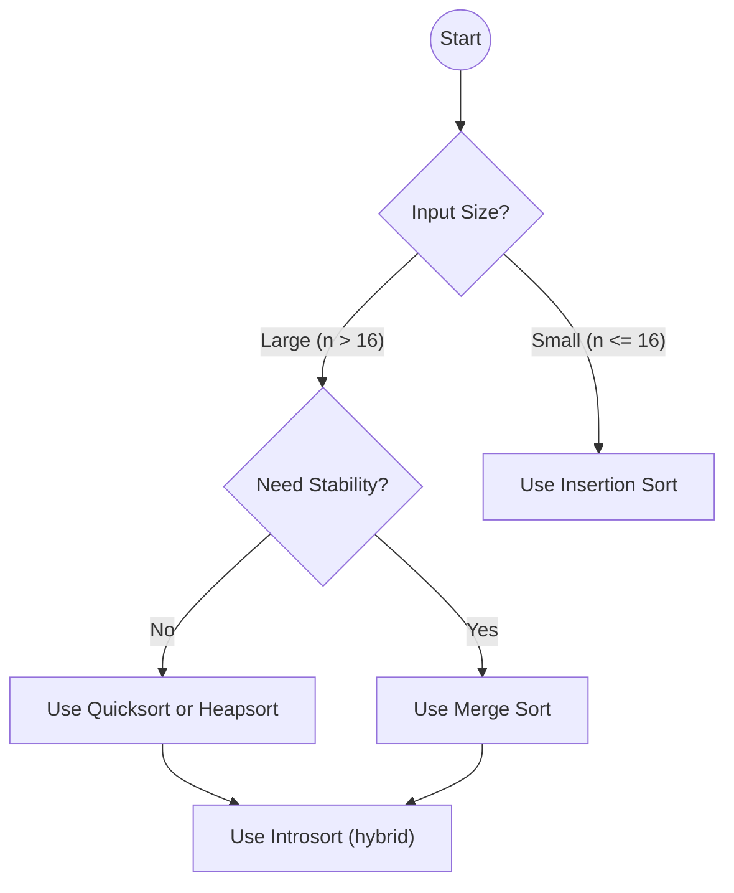

# 📚 Week_3_Day_1_Elementary_Sorts_Instructional.md — Bubble, Selection, Insertion Sort

🗓 **Week:** 3 | 📅 **Day:** 1  
📌 **Topic:** Elementary Sorts — Bubble Sort, Selection Sort, Insertion Sort  
🎯 **Theme:** O(n^2) Sorting, Stability, Cache Behavior, and When Simplicity Wins  
👤 **Audience:** Senior AWS / C# Engineer (systems-oriented, not beginner algorithms)

---

## 🎯 Learning Objectives

By the end of this file, you should be able to:

- Clearly explain **how** bubble sort, selection sort, and insertion sort work without looking them up.
- Analyze their **time and space complexity** and understand why they are O(n^2) in general.
- Reason about **cache behavior** and why insertion sort often outperforms other O(n^2) sorts in practice.
- Distinguish **stable vs unstable sorting**, and identify which elementary sorts are stable.
- Know **when** to deliberately choose an elementary sort over O(n log n) algorithms.
- Connect these algorithms to **real systems**, including .NET’s sorting internals and TimSort’s use of insertion sort on small runs.

---

## 🤔 The Why

Elementary sorts are often dismissed as “toy algorithms” you learn in CS 101 and never use again. That mental model is wrong for a systems-level engineer.

They matter because:

1. They are the **building blocks** of real-world hybrid sorting implementations.
2. They illustrate critical **performance trade-offs**:
   - Simplicity vs asymptotic optimality.
   - Constant factors vs Big-O.
   - Cache friendliness vs pointer chasing.
3. They are **easier to reason about**, which makes them a perfect playground for understanding:
   - Stability.
   - In-place vs out-of-place.
   - How small input sizes change decisions.

### 1. Real-World Hybrid Sorting

Modern runtime libraries, including .NET, rarely use a pure O(n log n) algorithm uniformly across the entire input. Instead, they use **hybrid strategies**:

- .NET’s `Array.Sort` and `List<T>.Sort` use an **introspective sort**:
  - Quicksort for partitioning.
  - Heap sort when recursion goes too deep.
  - **Insertion sort for small partitions** because it has low overhead and excellent locality.

Similarly, Python’s TimSort (in CPython) relies heavily on **insertion sort** on small “runs” that are already mostly sorted.

So your production code is *already* relying on elementary sorts, even if indirectly.

### 2. Performance at Small n

For small arrays (for example, n <= 16 or n <= 32):

- O(n^2) sorts can be **faster** than O(n log n) sorts due to:
  - Lower constant overhead.
  - Better cache utilization (simple tight loops over contiguous memory).
  - No recursion and very predictable branch behavior.

If you are sorting thousands of tiny arrays (length 10–20) inside a larger algorithm, an “elementary sort” often wins.

### 3. Conceptual Foundation

These sorts clarify key concepts:

- **Swap-based vs selection-based vs insertion-based strategies.**
- **Stability:**
  - Does equal-key ordering survive sorting?
- **In-place vs out-of-place:**
  - All three main elementary sorts are in-place (O(1) extra memory).

Understanding them deeply lets you:

- Explain and debug higher-level sorting logic.
- Gracefully handle edge cases and pathological patterns.
- Teach or mentor junior developers effectively.

### 4. Interview Relevance

Many interviews still ask:

- “Explain how insertion sort works and when you would use it.”
- “Which elementary sorts are stable?”
- “Why might insertion sort be preferred for small subarrays?”

More importantly, they show up as **components of more complex algorithms**:

- “In our hybrid algorithm, we switch to insertion sort for subarrays smaller than k. Why?”
- “Explain why TimSort uses insertion sort on short runs.”

These questions probe your understanding of **practical performance**, not just Big-O notation.

---

## 📌 The What

We’ll focus on three algorithms:

1. **Bubble Sort**
2. **Selection Sort**
3. **Insertion Sort**

All three:

- Are **comparison-based** sorting algorithms.
- Work in-place with **O(1)** auxiliary space.
- Have worst-case **O(n^2) time**.
- Run in a few tight loops over the array.

### 1. Bubble Sort — Repeated Swapping of Adjacent Elements

Intuition:

- Repeatedly “bubble” larger items toward the end by swapping adjacent out-of-order pairs.

High-level behavior:

- Multiple passes over the array.
- On each pass:
  - Compare `A[j]` and `A[j+1]` for j from 0 to n-2.
  - If out of order, swap them.
- After the first pass:
  - Largest element is at the end.
- After i passes:
  - The last i elements are in their final sorted positions.

ASCII illustration (one pass):

Unsorted segment:

```text
Index: 0   1   2   3
Value: 5   3   8   2
```

Compare indices 0,1 (5 and 3):

- Swap because 5 > 3:

```text
[3, 5, 8, 2]
```

Compare indices 1,2 (5 and 8):

- No swap.

Compare indices 2,3 (8 and 2):

- Swap because 8 > 2:

```text
[3, 5, 2, 8]
```

Largest element 8 has bubbled to the end.

### 2. Selection Sort — Choosing the Minimum for Each Position

Intuition:

- Repeatedly select the smallest remaining element and place it at the front of the unsorted region.

High-level behavior:

- Divide array into:
  - Sorted prefix [0..i-1].
  - Unsorted suffix [i..n-1].
- For each i from 0 to n-1:
  - Find index `minIndex` of smallest element in [i..n-1].
  - Swap A[i] with A[minIndex].

ASCII illustration:

```text
Initial: [ 5, 3, 8, 2 ]
Step i=0: minimum in [5,3,8,2] is 2 → swap with A[0]
After:    [ 2, 3, 8, 5 ]
Step i=1: minimum in [3,8,5] is 3 → already at position 1
After:    [ 2, 3, 8, 5 ]
Step i=2: minimum in [8,5] is 5 → swap with A[2]
After:    [ 2, 3, 5, 8 ]
```

### 3. Insertion Sort — Build Sorted Prefix by Inserting One Element at a Time

Intuition:

- Like sorting a hand of playing cards:
  - Take the next card.
  - Insert it into the correct position among the already sorted cards in your hand.

High-level behavior:

- Maintain sorted prefix [0..i-1].
- For i from 1 to n-1:
  - Let `key = A[i]`.
  - Shift all elements greater than key one position to the right.
  - Insert key into the hole.

ASCII example:

Array: [5, 3, 8, 2]

Step i=1 (key=3, sorted prefix [5]):

```text
Compare 5 and 3 → shift 5 right:
[5, 5, 8, 2]
Place 3 at position 0:
[3, 5, 8, 2]
```

Step i=2 (key=8, prefix [3,5]):

- 8 is larger than 5 → no shifts, stays at index 2.

Step i=3 (key=2, prefix [3,5,8]):

- Compare 8 > 2 → shift 8.
- Compare 5 > 2 → shift 5.
- Compare 3 > 2 → shift 3.
- Insert 2 at index 0:

```text
[2, 3, 5, 8]
```

### Stability and In-Place Properties

- **Bubble Sort:**
  - **Stable** if implemented with only adjacent swaps.
  - In-place (O(1) extra space).
- **Selection Sort:**
  - Typically **unstable** (swapping distant elements can reorder equal keys).
  - In-place.
- **Insertion Sort:**
  - **Stable** (elements greater than key are shifted; equal elements do not cross over).
  - In-place.

---

## ⚙ The How

We’ll describe each algorithm’s logic step-by-step, focusing on procedures rather than language syntax.

### 1. Bubble Sort — Stepwise Logic

State:

- Array A of length n.

Procedure:

1. For `i` from 0 to n-1:
   - Consider this an outer pass.
2. For `j` from 0 to n-2-i:
   - Compare A[j] and A[j+1].
   - If A[j] > A[j+1]:
     - Swap A[j] and A[j+1].
3. If in some pass no swaps occur:
   - Array is sorted; you can break early.

Key implementation considerations:

- Early exit optimization:
  - Track whether any swap occurred in a pass.
  - If not, array is already sorted.
- Number of passes:
  - In worst case, n-1 passes.

### 2. Selection Sort — Stepwise Logic

State:

- Array A of length n.

Procedure:

1. For `i` from 0 to n-1:
   - Let `minIndex = i`.
2. For `j` from i+1 to n-1:
   - If A[j] < A[minIndex], set `minIndex = j`.
3. After inner loop:
   - If `minIndex != i`, swap A[i] and A[minIndex].

Key characteristics:

- Exactly one swap per outer iteration (n-1 swaps in total).
- Number of comparisons is always the same, regardless of input order.

### 3. Insertion Sort — Stepwise Logic

State:

- Array A of length n.

Procedure:

1. For `i` from 1 to n-1:
   - Let `key = A[i]`.
   - Let `j = i-1`.
2. While `j >= 0` and `A[j] > key`:
   - Shift A[j] to position j+1.
   - Decrement j.
3. When loop ends, insert key at position j+1.

This logic:

- Creates a “hole” at position i.
- Slides larger elements right.
- Drops key into that hole.

### How They Behave on Nearly-Sorted Data

- Bubble sort:
  - With early-exit optimization, can finish in O(n) if no swaps are needed.
- Selection sort:
  - Always does O(n^2) comparisons; does not exploit near-sorted order.
- Insertion sort:
  - Runs close to O(n) if each element is close to its final position.
  - Because inner loop (shifting) is short for each i.

This makes **insertion sort** particularly attractive for:

- Nearly-sorted arrays.
- Small chunks inside hybrid sorting algorithms.

---

## 🎨 Visualization

### 1. Comparison of Algorithms with a Simple Array

Let’s use the same starting array: [4, 2, 7, 1]

#### Bubble Sort Trace (with passes)

Initial: [4, 2, 7, 1]

Pass 1:

- Compare 4,2 → swap → [2,4,7,1]
- Compare 4,7 → no swap → [2,4,7,1]
- Compare 7,1 → swap → [2,4,1,7]
- Largest element 7 is now at index 3.

Pass 2:

- Compare 2,4 → no swap → [2,4,1,7]
- Compare 4,1 → swap → [2,1,4,7]
- Index 3 already sorted; ignore.

Pass 3:

- Compare 2,1 → swap → [1,2,4,7]

Sorted: [1,2,4,7]

ASCII timeline:

```text
[4,2,7,1]
 -> [2,4,7,1]
 -> [2,4,1,7]
 -> [2,1,4,7]
 -> [1,2,4,7]
```

#### Selection Sort Trace

Initial: [4, 2, 7, 1]

i=0, search min in [4,2,7,1]:

- minIndex = 3 (value 1).
- Swap A[0] and A[3] → [1,2,7,4].

i=1, search min in [2,7,4]:

- minIndex = 1 (value 2).
- Already in place → [1,2,7,4].

i=2, search min in [7,4]:

- minIndex = 3 (value 4).
- Swap A[2] and A[3] → [1,2,4,7].

Sorted: [1,2,4,7].

#### Insertion Sort Trace

Initial: [4, 2, 7, 1]

i=1 (key=2):

- Compare with 4:
  - 4 > 2 → shift 4 right → [4,4,7,1]
  - Insert 2 at index 0 → [2,4,7,1].

i=2 (key=7):

- Compare with 4:
  - 4 ≤ 7 → no shift.
- Insert 7 at index 2 → [2,4,7,1].

i=3 (key=1):

- Compare with 7:
  - 7 > 1 → shift 7 right → [2,4,7,7]
- Compare with 4:
  - 4 > 1 → shift 4 right → [2,4,4,7]
- Compare with 2:
  - 2 > 1 → shift 2 right → [2,2,4,7]
- j becomes -1 → insert 1 at index 0: [1,2,4,7].

Sorted: [1,2,4,7].

---

### 2. Stability Visualization

Suppose elements have (key, id):

```text
[(3, 'A'), (3, 'B'), (1, 'C')]
```

Stable sort should keep A before B among equal keys.

- Bubble sort and insertion sort (standard implementations) are stable:
  - They never swap equal-key elements in a way that reverses them.
- Selection sort can be unstable:
  - When you swap the min into position i, you can move an equal element from later position before earlier equal elements.

Example for selection sort instability:

Initial:

```text
[(3, 'A'), (3, 'B'), (1, 'C')]
```

i=0, min is (1, 'C') at index 2:

- Swap positions 0 and 2:

```text
[(1, 'C'), (3, 'B'), (3, 'A')]
```

Now, among key=3 elements, B appears before A, but originally A was before B. The relative order changed → sort is unstable.

---

### 3. Cache Behavior (High-Level)

Consider memory layout of an array:

```text
+----+----+----+----+----+
| A0 | A1 | A2 | A3 | A4 |
+----+----+----+----+----+
```

All three algorithms scan and modify contiguous memory.

However:

- Insertion sort:
  - Accesses elements within the sorted prefix [0..i-1] when inserting key.
  - Access pattern: moving backward across contiguous memory.
- Bubble sort:
  - Sweep left to right repeatedly; adjacent comparisons.
- Selection sort:
  - For each i, scanning entire suffix [i..n-1].

On modern CPUs:

- Sequential scans of contiguous memory are cache-friendly.
- Repeated full scans (selection sort) have slightly worse behavior than insertion sort’s short backward scans when the array is nearly sorted.

---

### 4. Mermaid Overview of Algorithm Flow

High-level decision flow (which algorithm to use):



This is conceptual; in real systems, you rarely choose bubble or selection sort outside teaching, but they are useful mental options.

---

## 📊 Critical Analysis

### Time Complexity

Let n be the number of elements.

- **Bubble Sort:**
  - Worst case: O(n^2).
  - Best case (with early exit on sorted input): O(n).
  - Average case: O(n^2).
- **Selection Sort:**
  - Worst case: O(n^2).
  - Best case: O(n^2) (it always scans all remaining elements).
  - Average case: O(n^2).
- **Insertion Sort:**
  - Worst case: O(n^2) (reverse sorted input).
  - Best case: O(n) (already sorted).
  - Average case: O(n^2).

Space complexity:

- All are **in-place**: O(1) extra space (beyond the input array).

### Comparison Count vs Swap Count

- Bubble Sort:
  - Comparisons: roughly n(n−1)/2.
  - Swaps: can be up to that in worst case.
- Selection Sort:
  - Comparisons: exactly n(n−1)/2, regardless of input.
  - Swaps: at most n−1.
- Insertion Sort:
  - Comparisons and shifts depend heavily on input order.
  - On average O(n^2) operations, but with low overhead and good branch predictability.

### When Elementary Sorts Are Acceptable or Even Preferred

1. **Very small arrays:**
   - For n up to a small constant (like 16 or 32), insertion sort often outperforms quicksort or merge sort.
2. **Nearly-sorted arrays:**
   - Insertion sort is particularly efficient.
3. **As a tail mechanism in hybrid sorts:**
   - Real libraries switch to insertion sort for small partitions.

Rarely recommended in isolation for large n in application code, except for specialized tuning.

---

## 🏭 Real Systems

### 1. .NET `Array.Sort` and `List<T>.Sort`

- .NET uses an **introspective sort**:
  - Starts with quicksort-like partitioning.
  - Switches to heap sort when depth gets too large.
  - For very small ranges (subarrays), uses **insertion sort** because:
    - Fewer comparisons and swaps.
    - Better cache locality on small segments.
    - Simple straight-line code with good branch prediction.

So in C#:

- When you call `Array.Sort(int[])` or `List<T>.Sort()`:
  - You are indirectly relying on insertion sort for small subproblems.

### 2. TimSort in CPython and Other Runtimes

- TimSort:
  - Designed to exploit partially sorted data.
  - Detects ascending runs.
  - Uses **binary insertion sort** to sort small runs.
- Why insertion sort:
  - Excellent performance on small, nearly-sorted data.
  - Stability.

While you might not be coding in Python, the pattern is identical:

- Use insertion sort for small runs.
- Use more complex O(n log n) method for large, less-structured data.

### 3. In-Memory Sorting in Databases

- Some database engines:
  - Use simple O(n^2) sorts for small in-memory collections (e.g., sorting results of small subqueries).
  - Use external merge sort for large datasets.

The decision is often based on:

- Estimated cardinality.
- Memory availability.
- Cost of more complex algorithms vs simplicity.

### 4. Embedded Systems and Firmware

- In memory-constrained environments (firmware, small microcontrollers):
  - Implementing full-featured O(n log n) sorts may be unnecessary or too complex.
  - Insertion sort is often used for small arrays.
- The combination of:
  - Very small n.
  - Simplicity.
  - Low memory footprint.
- Makes insertion sort a pragmatic choice.

### 5. Application-Specific Small Sorts

In real C# systems:

- Sorting short arrays of:
  - Log messages.
  - Metrics.
  - Small result sets before formatting.
- Rather than invoking heavy library sorting for each small array, a hand-rolled insertion sort can sometimes be more optimal (when used judiciously and measured).

---

## 🔗 Concept Crossovers

### Prerequisites From Week 1 and Week 2

- Arrays & dynamic arrays:
  - Understanding contiguous memory.
  - Knowing how swaps and shifts work at the memory level.
- Recursion & divide-and-conquer:
  - Helps for understanding merge sort and quicksort (coming on Day 2).
- Space complexity:
  - Recognizing in-place algorithms and auxiliary space.

### Related Upcoming Topics

- **Merge Sort & Quick Sort (Day 2):**
  - Elementary sorts act as base cases for small partitions.
  - Compare O(n^2) vs O(n log n) behaviors.
- **Heap Sort (Day 3):**
  - Another O(n log n) sort with different trade-offs (in-place, not stable).
- **Hashing (Days 4–5):**
  - Sorting vs hashing for search and grouping tasks (sort + binary search vs hash table).

### Conceptual Links

- Stability:
  - Crucial for understanding stable vs unstable variants of quicksort and merge sort.
- In-place vs out-of-place:
  - Influences memory usage, especially in low-memory environments.
- Cache behavior:
  - Insertions into sorted arrays and B-tree nodes echo insertion sort’s access pattern.

---

## 📐 Mathematical / Theoretical

### Worst-Case Comparison Counts

For all three algorithms:

- Bubble sort:
  - Outer loop indices i=0..n-2.
  - Inner comparisons: n−1, n−2, ..., 1.
  - Total comparisons:
    - (n−1) + (n−2) + ... + 1 = n(n−1)/2.
    - This is O(n^2).
- Selection sort:
  - Outer i=0..n−2.
  - For each i, inner loop j=i+1..n-1.
  - Same sum: n(n−1)/2 comparisons.

Insertion sort:

- Worst case (reverse sorted):
  - For each i from 1 to n−1, we compare and shift against all previous elements:
    - 1 + 2 + ... + (n−1) = n(n−1)/2 comparisons/shifts.
  - O(n^2).

### Best-Case Behavior

- Insertion sort:
  - Already sorted array:
    - For each i, inner while condition fails immediately.
    - Only one comparison: A[j] <= key.
    - Total O(n) comparisons, minimal shifts.
- Bubble sort with early exit:
  - Already sorted array:
    - One pass with no swaps.
    - O(n) comparisons.
- Selection sort:
  - Unaffected by input order (always O(n^2)).

### Stability Formalization (Informal)

Let’s define:

- Input array elements as pairs (key, id), where id indicates original position.
- A sort is stable if:
  - For any i < j where key_i == key_j, after sorting, the relative order preserves id_i before id_j.

Insertion sort:

- For elements with equal key, the algorithm only shifts elements strictly greater than key.
- Equal elements are not moved past each other:
  - The one that appeared earlier in the original array will never cross a later equal element.
- Thus, insertion sort is stable.

---

## 💡 Algorithmic Intuition

### Choosing Between Bubble, Selection, and Insertion Sort

From a practical engineering standpoint:

- **Insertion Sort is the only one you should seriously consider** for real workloads.
- Bubble sort and selection sort are mainly:
  - Teaching tools.
  - Simple to reason about and easy to implement.
  - Useful for understanding fundamental trade-offs.

Intuitive rules:

- If array is small and may be nearly sorted:
  - Use insertion sort.
- If you want to minimize writes (e.g., writing to EEPROM or flash, where each write is expensive):
  - Selection sort’s O(n) swaps might be more appropriate than bubble sort’s potential O(n^2) swaps.
- If you want to illustrate stable vs unstable:
  - Use bubble & insertion for stable examples; selection for unstable.

### Why Insertion Sort “Feels” Natural

Think of how you naturally sort things by hand:

- Cards in hand.
- Papers on a desk.

You almost never do “bubble” or “selection” manually; you “insert” items into the right position among what’s already sorted. That’s insertion sort.

This is why insertion sort shows up so heavily in hybrid algorithms:

- “Humans do it this way for small sets; CPUs like it too.”

---

## ❓ Knowledge Check

Reflect on these questions (no need to answer here, but you should know how to explain them):

1. Why might insertion sort be preferred over quicksort for sorting subarrays of size <= 16 inside a hybrid algorithm like introsort?
2. In what sense is selection sort more “predictable” than bubble sort in terms of the number of comparisons and swaps?
3. How does the stability of insertion sort affect its use in multi-key sorting (sorting by secondary key then primary key)?
4. Suppose you must sort 10-element arrays millions of times per second in .NET. How would you evaluate whether an insertion sort implementation is better than calling `Array.Sort` on each array?
5. How does cache locality influence the real-world performance of insertion sort compared to other O(n^2) algorithms?

---

## 🎯 Retention Hook

### Mnemonic for the Three Algorithms

Remember **B-S-I** as:

- **B**ubble: **B**ump the big ones to the **B**ack by swapping neighbors.
- **S**election: **S**can and **S**elect the smallest for each position.
- **I**nsertion: **I**nsert each element into its sorted **I**nterior prefix.

Alternatively, a phrase:

> “Bubble swaps neighbors, Selection picks winners, Insertion places cards.”

### Visual Summary (ASCII)

```text
Bubble Sort:
- Repeatedly scan adjacent pairs and swap out-of-order ones.
- Largest elements bubble to the end.

Selection Sort:
- For each position i, find the smallest element in the unsorted suffix.
- Swap it into position i.

Insertion Sort:
- Treat prefix as sorted.
- Take next element and insert it into correct position in the prefix.
```

### Real-World Story Hook

A .NET engineer is explaining why `Array.Sort` on small arrays is surprisingly fast. They mention:

- “Under the hood, the framework doesn’t always use the same algorithm. For small slices, it falls back to insertion sort because it’s incredibly cache-friendly and has low overhead.”

Your mental note:

- “Insertion sort is slow in theory but fast in practice on tiny ranges and nearly-sorted data. It’s the ‘secret weapon’ inside big-boy algorithms.”

This is exactly how you should think about elementary sorts: not as obsolete curiosities, but as **small, sharp tools** used inside more complex machinery.

---

## 🧩 5 Cognitive Lenses

### 🖥️ COMPUTATIONAL LENS (Hardware / Memory)

- All three algorithms:
  - Use contiguous arrays.
  - Operate in-place with tiny constant memory overhead.
- Insertion sort:
  - Very tight inner loop, predictable branching.
  - Access pattern: mostly sequential with backward scans in small window.
- Selection sort:
  - Full scans across the unsorted suffix each time; higher memory traffic.
- Bubble sort:
  - Multiple passes with adjacent accesses; good locality but many comparisons.

On modern CPUs:

- Simple tight loops over arrays (like insertion sort) often run faster than more complex algorithms for small n because:
  - Branch predictors learn quickly.
  - Data stays in L1/L2 cache.

### 🧠 PSYCHOLOGICAL LENS (Mental Models)

Common misconceptions:

- “These sorts are useless now that we have quicksort and merge sort.”
  - Reality: They are crucial inside hybrid algorithms and for small problems.
- “O(n^2) means always slow.”
  - Reality: For n <= 20 or 30, constant factors dominate; O(n^2) can win.

Mental models:

- Bubble sort: “air bubbles rising to the surface.”
- Selection sort: “choosing the shortest person from the line and putting them at the front.”
- Insertion sort: “sorting cards in your hand.”

Use the card analogy heavily for insertion sort; it aligns perfectly with intuitive behavior.

### 🔄 DESIGN TRADE-OFF LENS (Architecture)

Key trade-offs:

- Performance vs simplicity:
  - Elementary sorts are trivial to implement and verify.
  - They have predictable behavior and are easy to reason about.
- Complexity vs ergonomics:
  - Libraries hide complexity inside `Sort` methods but still rely on elementary sorts internally.
- Writes vs reads:
  - Selection sort uses fewer writes than bubble or insertion sort, which can matter when writes are expensive (e.g., flash memory).

Architectural decisions:

- Use hybrid sort: choose divide-and-conquer plus insertion sort for small segments for best-of-both-worlds design.

### 🤖 AI/ML ANALOGY LENS

- Sorting “weights” or scores in small batches:
  - In data preprocessing pipelines, sorting tiny batches (e.g., top-k operations) is common.
- In many ML frameworks:
  - Sorting small lists (like candidate beam search sequences) might use simple O(n^2) algorithms under the hood.
- The idea of:
  - “Use a simple method for local adjustments and a complex method for global structure” appears in ML too:
    - Local gradient steps vs global architecture.
    - Greedy local decisions vs global optimization.

Insertion sort is the analog of a local refinement step in an otherwise heavier algorithm.

### 📚 HISTORICAL CONTEXT LENS

- These algorithms have been around since early days of computer science.
- They are documented extensively in Knuth’s “The Art of Computer Programming”.
- Over time:
  - They moved from being “the main event” to “supporting actors” in hybrid algorithms.
- Their simplicity is why they persist:
  - Easy to implement correctly.
  - Easy to reason about under all conditions.

They are part of the “algorithmic standard library” every engineer should understand deeply.

---

## ⚔ Practice Problems (8+)

1. **Insertion Sort List**  
   - Platforms: LeetCode 147  
   - Focus: Implement insertion sort on singly linked list; understand algorithm beyond arrays.

2. **Sort Colors**  
   - Platforms: LeetCode 75  
   - Focus: Dutch National Flag; though not pure insertion/bubble/selection, good for practicing in-place partitioning logic.

3. **Sort an Array with Most Elements Nearly Sorted**  
   - Task: Given an array where each element is at most k positions away from its sorted position (small k), try insertion sort and compare with using a priority queue.

4. **Minimum Swaps to Sort**  
   - Platforms: GFG / others  
   - Focus: Reason about swap counts; selection sort swap behavior.

5. **Custom Sort for Small Fixed-Size Arrays**  
   - Task: Design and analyze an insertion sort specialized for arrays of size <= 10; compare conceptual performance versus calling library sort.

6. **Stable vs Unstable Sort Demonstration**  
   - Task: Construct a small example showing how selection sort breaks stability while insertion sort preserves it.

7. **Bubble Sort with Early Exit**  
   - Task: Conceptually add early-exit optimization; analyze best-case complexity improvement from O(n^2) to O(n).

8. **Adaptive Sorting**  
   - Task: For arrays that are mostly sorted (few inversions), compare insertion sort vs naive O(n^2) algorithms analytically.

9. **Analyze Introspective Sort Hybrid**  
   - Task: Document at what thresholds you would switch from quicksort partitioning to insertion sort.

10. **Write Sorting Benchmark Pseudocode**  
    - Task: Sketch how you would design a micro-benchmark to compare insertion sort vs `Array.Sort` for small n in C#.

---

## 🎙 Interview Q&A (6+ Pairs)

**Q1:** Why do modern sorting implementations like .NET’s `Array.Sort` switch to insertion sort for small subarrays?  
**A:**  
Because for small n, the overhead of more complex O(n log n) algorithms (like quicksort or mergesort) is greater than their asymptotic advantage. Insertion sort has extremely simple, tight loops and excellent cache locality. When sorting subarrays of, say, 16 elements during a recursive sort, insertion sort often outperforms more complex methods. Hybrid sort implementations exploit this by using a divide-and-conquer algorithm for large partitions and switching to insertion sort for small ones.

Follow-ups:
- How would you empirically determine the threshold n at which to switch to insertion sort?
- How does nearly-sorted input influence this decision?

---

**Q2:** Which elementary sorts are stable, and why does stability matter?  
**A:**  
Standard insertion sort and bubble sort (with adjacent swaps only) are stable; they do not reverse the relative order of elements with equal keys. Selection sort is typically unstable because it may swap a later equal element into an earlier position, crossing over another equal element. Stability matters when sorting by multiple keys: for example, sorting by last name, then by first name, relies on stable sorting so that the relative order from the first sort is preserved.

Follow-ups:
- How can you enforce stability if your primary sorting algorithm is unstable?
- Give a scenario where instability breaks correctness.

---

**Q3:** When, if ever, would you consciously choose selection sort in a real system?  
**A:**  
Selection sort guarantees a fixed number of writes: at most n−1 swaps. If writes are significantly more expensive than reads (for example, writing to flash memory or EEPROM), and n is small, minimizing writes might matter more than minimizing comparisons. In that narrow scenario, selection sort could make sense. It’s also conceptually simple, so it can be useful in teaching or extremely constrained embedded environments.

Follow-ups:
- How does selection sort’s predictable behavior help with worst-case guarantees?
- Can you design a variant that preserves stability?

---

**Q4:** Why is insertion sort particularly efficient for nearly-sorted arrays?  
**A:**  
Insertion sort’s work is proportional to the number of elements that need to move backward. If each element is close to its final position, the inner loop does very few comparisons and shifts per element. In the best case (already sorted), insertion sort runs in O(n) time with minimal overhead. This adaptiveness to the degree of disorder makes it ideal for nearly-sorted arrays.

Follow-ups:
- How could you quantify “degree of disorder” (e.g., number of inversions)?
- Are there other algorithms that adapt to almost-sorted input?

---

**Q5:** Compare bubble sort and insertion sort on already sorted input.  
**A:**  
Both can achieve O(n) time if implemented with early exit (bubble sort) or minimal inner loop (insertion sort). However, bubble sort must still compare adjacent elements across the array to detect no swaps, while insertion sort simply checks that each element does not need to move backward. Insertion sort’s inner loop exits quickly for each element in sorted order, and because it doesn’t need a separate pass to detect sortedness, it tends to be more efficient and is favored in practice.

Follow-ups:
- How would you implement “early exit” for bubble sort?
- Is there any scenario where bubble sort would be preferable?

---

**Q6:** Why are these O(n^2) algorithms still worth learning for a senior engineer?  
**A:**  
Because they appear inside more complex, production-level systems as building blocks, especially for small data sizes and specialized contexts. They help you understand hybrid sorting strategies, stability, cache behavior, and lower-level performance trade-offs. Also, understanding their mechanics deepens your ability to reason about algorithms generally, to debug performance anomalies, and to teach or mentor others. As a senior engineer, you’re expected to understand not just “what sort to call” but why a library might be implemented a certain way under the hood.

Follow-ups:
- Give an example where misunderstanding these internals could lead to a bad design choice.
- How would you explain insertion sort’s role in a hybrid algorithm to a junior engineer?

---

## ⚠ Common Misconceptions (3–5)

1. **“O(n^2) sorts are always unusably slow.”**  
   In reality, for small n (like 10–30), O(n^2) algorithms can be faster than O(n log n) due to lower constant factors and better locality. They are absolutely usable in constrained or small input contexts.

2. **“Selection sort is better because it does fewer swaps, so it must be faster.”**  
   Swaps are not necessarily the dominant cost on modern CPUs; memory reads and branch mispredictions often matter more. Selection sort still does O(n^2) comparisons and scans entire unsorted suffix for each pass.

3. **“Bubble sort is how real code sorts data.”**  
   Bubble sort is almost never used in production directly; it’s primarily educational. Real systems use hybrid sorts that may rely on insertion sort, heapsort, mergesort, or quicksort, not bubble sort.

4. **“Stable vs unstable sorting is an academic detail.”**  
   Stability matters greatly in multi-key sorts and when the relative order of equal elements encodes information. Ignoring stability can break features subtly.

---

## 📈 Advanced Concepts (3–5)

1. **Binary Insertion Sort**  
   Use binary search to find insertion position in the sorted prefix, then shift elements. This reduces comparisons but not shifts, often helpful when comparisons are expensive.

2. **Shell Sort (Teaser for Gaps / Incremental Sorting)**  
   Generalizes insertion sort by allowing exchanges of far-apart elements. Can achieve better than O(n^2) performance with proper gap sequences.

3. **Hybrid Sort Design**  
   Combining quicksort/introsort with insertion sort for small partitions:
   - Choose a cutover threshold (e.g., array segments of size <= 16).
   - Use insertion sort on those segments for speed.

4. **Adaptive Sorting Algorithms**  
   Algorithms that measure disorder and adapt, such as TimSort, rely heavily on inserting into small segments, conceptually related to insertion sort.

5. **Write-Optimized Sorting**  
   For systems where writes are much more expensive than reads, algorithms that minimize writes (like selection sort variants) become relevant.

---

## 🔗 External Resources (3–5)

1. **“The Art of Computer Programming, Volume 3: Sorting and Searching” by Donald Knuth**  
   Classic, deep treatment of sorting algorithms, including bubble, selection, insertion, and their analysis.

2. **.NET Runtime Source Code (CoreCLR / CoreFX)**  
   Explore the implementation of `Array.Sort` and `List<T>.Sort` to see how hybrid sorting and insertion sort thresholds are used in practice.

3. **“Engineering a Sort Function” by Bentley and McIlroy**  
   A classic paper describing high-performance sorting design and why simple algorithms matter inside hybrid designs.

4. **CPython TimSort Implementation Notes**  
   Read about how Python’s sort uses insertion sort for small runs and merge strategies at scale.

5. **MIT 6.006 / 6.046 Lecture Notes on Sorting**  
   Conceptual coverage of elementary sorts as a foundation for advanced algorithms.

---
