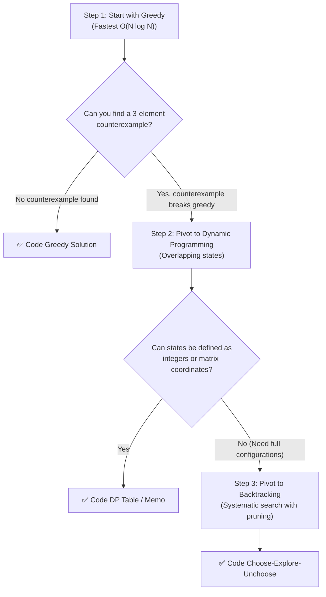

# 🧭 The Paradigm Decision Framework & Interview Talk Track

> *"In a 45-minute FAANG technical interview, knowing WHICH paradigm to pick in the first 5 minutes is 80% of the battle."*

---

## 💥 The Interview War Story: The Candidate Who Over-Engineered 3D DP

A Senior Software Engineer with 8 years of distributed systems experience was interviewing at Google for an L5/L6 Staff Engineer role.

In Round 2, the interviewer gave the following problem:
> *"You are given a list of scheduled video streams with start and finish times. Find the maximum number of non-overlapping streams a single encoder can process."*

The candidate immediately jumped to conclusions:
> *"This is an optimization problem maximizing a count. Optimization means Dynamic Programming! I will define a 2D state `dp[i][j]` representing the maximum streams using a subset of streams up to time `j`..."*

For the next 30 minutes, the candidate filled the whiteboard with intricate recurrence relations, memoization hash tables, and coordinate compression logic. With 5 minutes left, they were frantically trying to debug a boundary index bug in their 45-line recursive function.

With 2 minutes remaining, the interviewer gently asked:
> *"What if you simply sorted the video streams by their finish times and greedily picked each stream that starts after the previous one finishes?"*

The candidate froze. The greedy solution took **6 lines of clean code** and ran in `O(N log N)` time instead of `O(N^2)`. The candidate failed the round not because they couldn't code, but because **they picked the wrong paradigm and over-engineered a simple problem into an unmaintainable mess**.

**The Golden Takeaway:** Always evaluate the simplest, fastest paradigm first (Greedy / Two Pointers). Only escalate to heavy machinery (Dynamic Programming / Backtracking) when you have proven that simpler approaches fail!

---

## 🎯 1. The 45-Minute Interview Delivery Cadence

Follow this structured delivery timeline to avoid getting trapped:

```
[ Minutes 0 - 5 ]   Clarify inputs, check bounds, and announce candidate paradigm.
[ Minutes 5 - 12 ]  Walk through a visual napkin trace with 3 real numbers.
[ Minutes 12 - 30 ] Write clean, idiomatic C# / Python code with guard clauses.
[ Minutes 30 - 40 ] Dry-run edge cases (empty, single element, duplicates, negative).
[ Minutes 40 - 45 ] Discuss production trade-offs and complexity deconstruction.
```

---

## 🔎 2. Problem Statement Clues: Pattern-to-Paradigm Mapping

| Clue in Problem Statement | First Instinct | Why? | Typical Variations |
| :--- | :--- | :--- | :--- |
| *"Find ALL possible combinations / permutations / arrangements..."* | **🧶 Backtracking** | Exhaustive search over valid states | Subsets, Permutations, Word Search, N-Queens |
| *"Find MIN / MAX..."* AND choices don't conflict | **⚡ Greedy** | Local choice is globally safe (`O(N log N)`) | Interval Scheduling, Meeting Rooms, Jump Game, Gas Station |
| *"Find MIN / MAX..."* AND early choice restricts future options | **📝 Dynamic Programming** | Overlapping subproblems, 0/1 choices | Coin Change, 0/1 Knapsack, House Robber, Edit Distance |
| *"Independent halves that can be processed separately"* | **✂️ Divide & Conquer** | Subproblems share zero state | Merge Sort, QuickSelect, Tree Diameter, Binary Search on Answer |
| *"Hard optimization (TSP, Knapsack)"* with small `N <= 25` | **🏷️ Branch & Bound** | Pruning branches that can't beat best score | 0/1 Knapsack B&B, Traveling Salesperson |
| *"Design data structure with occasional resizing/rebalancing"* | **🏦 Amortized Analysis** | Spiky operations average out | Dynamic Array (`2x`), Two-Stack Queue, Monotonic Stack |

---

## 🗣️ 3. The Interview Talk Track (What to Say Out Loud)

Never write code in silence. Announce your paradigm choice to the interviewer using these proven scripts:

### Talk Track 1: Choosing Greedy (Interval Scheduling)
> *"Looking at the constraints, we want to maximize the count of non-overlapping intervals. A brute force subset search would take `O(2^N)` time.  
> However, if we sort intervals by **finish time**, picking the earliest finishing interval always frees up our resource as soon as possible, leaving maximum open room for all future intervals. Because this local choice never restricts our future possibilities, we can use a **Greedy approach** in `O(N log N)` time and `O(1)` auxiliary space."*

### Talk Track 2: Explaining Why Greedy Fails & Pivoting to DP (Coin Change)
> *"My first instinct is to check if a greedy approach works — for example, always taking the largest coin denomination first.  
> However, if our coin denominations are `[1, 3, 4]` and our target is `6`, greedy picks `4 + 1 + 1` (3 coins), whereas the optimal answer is `3 + 3` (2 coins).  
> Because an early greedy choice can eliminate a better combination later, we have overlapping subproblems and optimal substructure. Therefore, I will use **Dynamic Programming** with a 1D array to store the minimum coins needed for each sub-amount up to the target in `O(Amount * Coins)` time."*

### Talk Track 3: Choosing Backtracking (Word Search / Permutations)
> *"Since we need to explore paths on a 2D matrix where characters must match sequentially and cells cannot be reused in the same word, there is no simple numerical formula.  
> I will use a **Backtracking DFS approach** with the Choose-Explore-Unchoose rhythm. To keep auxiliary memory optimal, I will stamp the visited cell in-place with a special character `#` during exploration, and restore it upon backtracking, running in `O(M * N * 4^L)` time with zero extra matrix allocation."*

---

## 🔄 4. The 5-Step Emergency Pivot

If your first idea hits a dead end during an interview:



1. **Don't Panic:** Announce out loud: *"Let's test this greedy idea against a counterexample."*
2. **Break It Simply:** Use a 3-element case (like coins `[1, 3, 4]` or intervals `[1, 10]` vs `[1, 5]` and `[6, 10]`).
3. **Praise the Self-Correction:** Say: *"Since greedy fails on this counterexample, we have overlapping choices. That clearly indicates Dynamic Programming is required."*
4. **Identify the State:** State what the DP array index represents: *"Let `dp[i]` represent the minimum cost to reach state `i`."*
5. **Code with Confidence:** Build the base cases first, then the loop.
