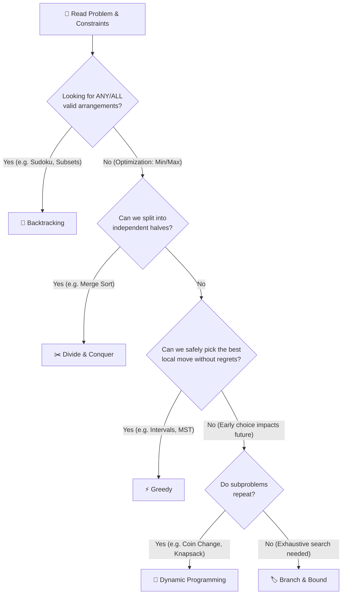

# 🧭 Algorithmic Paradigms: The Beginner's Intuitive Guide

Welcome to the **Algorithmic Paradigms** learning module. 

When beginners prepare for technical interviews, they often make the mistake of trying to memorize hundreds of individual LeetCode problems one by one. This quickly leads to burnout, confusion, and panic when an interviewer asks an unseen problem.

The secret used by Senior and Staff engineers is to focus on **Algorithmic Paradigms** — the core mental blueprints and problem-solving strategies from which almost every algorithm is born.

---

## 🍳 What is an "Algorithmic Paradigm"?

Think of cooking:
- Instead of memorizing 500 individual recipes, a professional chef masters **cooking techniques**: *baking*, *grilling*, *steaming*, *stir-frying*, and *braising*.
- Once you know how to stir-fry, you can adapt to whatever vegetables or proteins you find in the kitchen.

In software engineering:
- An **algorithmic paradigm** is a high-level strategy for attacking a problem.
- Master just **6 core blueprints**, and you will instantly know how to approach 95% of algorithmic interview problems.

---

## 🗺️ The 6 Master Paradigms at a Glance

| Paradigm | Everyday Analogy | The Core Intuition | Typical Complexity | When to Pick |
| :--- | :--- | :--- | :--- | :--- |
| **1. Greedy** | Picking the biggest cookie on the plate | Make the best local choice right now and never look back. | `O(N)` or `O(N log N)` | When a local choice is guaranteed to never hurt future choices. |
| **2. Divide & Conquer** | Splitting a giant book between two translators | Chop problem into independent halves, solve each, stitch results. | `O(N log N)` | When subproblems are completely independent with zero overlap. |
| **3. Dynamic Programming** | Taking notes on a scratchpad so you don't re-count | Store solutions to subproblems so you never calculate twice. | `O(N^2)` or `O(N * W)` | When choices overlap and early decisions impact future feasibility. |
| **4. Backtracking** | Exploring a maze with a ball of yarn | Try a path step-by-step; hit a dead end? Rewind and try the next. | `O(2^N)` or `O(N!)` | Puzzles, permutations, subsets, and finding any or all valid arrangements. |
| **5. Branch & Bound** | An auction bidder with a strict budget | Backtracking with a scoreboard: prune branches that cannot beat your best. | Exponential (pruned) | Optimization problems (min cost / max profit) over combinatorics. |
| **6. Amortized Analysis** | Buying a monthly subway pass | One expensive day pays for 29 free days; average cost stays tiny. | `O(1)` average | Operations that resize buffers or batch cleanup work infrequently. |

---

## 🚦 The Beginner's Paradigm Decision Flowchart

When you read a problem in a 45-minute interview, use this mental flowchart to zero in on the right strategy:

---

## 📚 Curriculum Navigation & Deep-Dive Guides

Each guide in this folder pairs a realistic **production war story** (explaining how misunderstandings of this paradigm caused catastrophic million-dollar outages or interview failures) with **comprehensive coverage of every primary interview variation**, ASCII napkin traces, and clean **C#** + **Python** code:

1. **[01. Greedy Paradigm Explained Simply](01_Greedy_Paradigm_Explained_Simply.md)**  
   *War Story:* The Black Friday Cloud Auto-Scaler Disaster (\$1.8M lost to stranded capacity).  
   *Interview Variations Covered:* Interval Scheduling (Earliest Finish), Meeting Rooms II (Chronological Resource Timeline), Jump Game I & II (Farthest Reach Boundary), Gas Station (Running Deficit & Reset), Task Scheduler / Huffman Coding (Frequency Merging).

2. **[02. Divide & Conquer Explained Simply](02_Divide_And_Conquer_Explained_Simply.md)**  
   *War Story:* The 10-Million Log Ingestion Freeze (5-hour batch sort reduced to 1.4 seconds).  
   *Interview Variations Covered:* Classical Sort & Zipper Merge (Merge Sort), Order Statistics (QuickSelect `O(N)` average for Kth Largest), Tree Recursion & Subtree Combine (Tree Diameter, Max Path Sum), Binary Search on Answer Space (Ship Packages / Koko Eating).

3. **[03. Dynamic Programming vs. Greedy](03_Dynamic_Programming_vs_Greedy.md)**  
   *War Story:* The Cloud VM Container Packing Catastrophe (\$1.4M saved by switching from Greedy to 2D Knapsack).  
   *Interview Variations Covered:* Coin Change (Standard vs. Arbitrary denominations), 0/1 Knapsack (Indivisible items with 1D reverse memory optimization), Skipping & Robbing (House Robber `O(1)` space), Longest Common Subsequence & Edit Distance.

4. **[04. Backtracking & Branch and Bound](04_Backtracking_And_Branch_Bound.md)**  
   *War Story:* The Drone Route Dispatcher Blizzard Out-of-Memory Crash (68 billion paths cut to 1,200).  
   *Interview Variations Covered:* Subsets & Combinations (The Pick-or-Skip Pattern), Permutations (Orderings with Tracking), 2D Grid Exploration (Word Search with In-Place Board Stamping), Constraint Placement (N-Queens with `O(1)` Diagonal Math), Branch & Bound (Scoreboard Pruning with Greedy Ceilings).

5. **[05. Amortized Analysis in Plain English](05_Amortized_Analysis_Plain_English.md)**  
   *War Story:* The High-Frequency Trading P99 Latency Nightmare (142ms spikes eliminated by capacity awareness).  
   *Interview Variations Covered:* Dynamic Array Doubling (Why `2x` is `O(1)` but `+K` degrades to `O(N)`), Two-Stack Queue (Lazy Transfer Dequeue), Monotonic Stack (Why nested loops are still `O(N)` total), Union-Find with Path Compression (Inverse Ackermann `O(α(N))`).

6. **[06. Paradigm Decision Framework & Interview Talk Track](06_Paradigm_Decision_Framework.md)**  
   *War Story:* The Senior Candidate Who Over-Engineered a 3D DP Table for a 6-Line Greedy Problem.  
   *Interview Variations Covered:* 45-Minute Delivery Cadence, Keyword Signal Mapping Table, Verbal Talk Tracks for Interviews, and the 5-Step Emergency Pivot when your first idea fails.

7. **[Learning Progression & Milestone Plan](Paradigms_Learning_Progression_Plan.md)**  
   *Your Step-by-Step Study Roadmap:* A structured, milestone-based timeline moving from absolute beginner to FAANG-ready problem solver.

---

## 💡 How to Study This Module
- **Step 1:** Read the **Everyday Hook** in each guide first. Make sure the physical metaphor clicks before looking at code.
- **Step 2:** Follow the **ASCII trace**. Watch the numbers move step-by-step.
- **Step 3:** Compare the **C#** and **Python** implementations. Notice how the core algorithmic pattern remains identical across both languages.
- **Step 4:** Review the **Edge Cases & Failure Modes**. Understanding *where a paradigm breaks* is what distinguishes senior engineers from novices.
