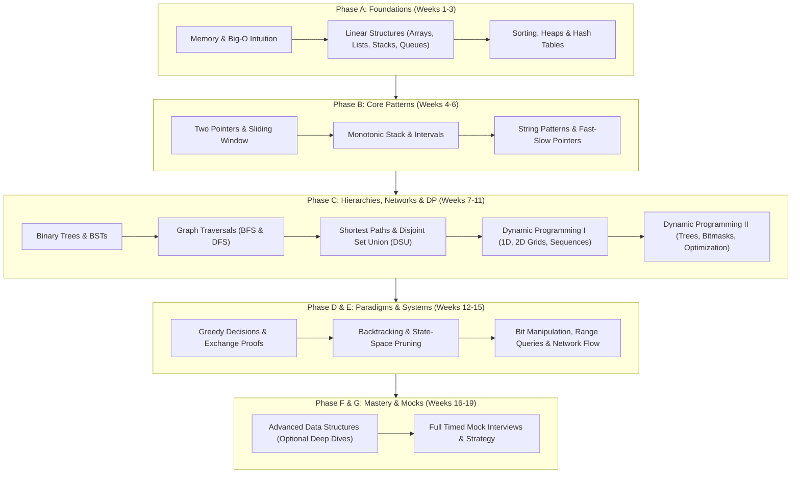

# 🚀 DSA Master Curriculum

> **A practical, intuition-first Data Structures & Algorithms curriculum designed for modern software engineers.**  
> Master the mental models, core patterns, and engineering trade-offs required for top-tier product and FAANG interviews—without memorizing hundreds of disconnected solutions.

---

## 💡 The Core Philosophy: Patterns Over Memorization

Most learners struggle with DSA not because they lack intelligence, but because they are told to grind hundreds of random problems. When an interview throws a slight twist at them, the memorized solution falls apart.

This curriculum is built on three simple principles:
1. **The Intuitive Hook:** Every data structure and pattern starts with a real-world problem. Why does an array fail here? Why do we need a heap?
2. **Visual Mental Models:** Algorithms are visual processes. We use clear, compact diagrams to build intuition before writing a single line of code.
3. **The Invariant:** Every optimal algorithm preserves one governing rule (e.g., "the window only grows when valid," or "the stack only holds decreasing elements"). Once you see the invariant, the code writes itself.

> 💡 **Instructor Guidance Note:**  
> *Not all sections or topics are mandatory. As a learner, you can adapt your pace freely. If you are preparing on an accelerated interview timeline or already feel confident with specific foundational concepts, feel free to skip or skim optional topics and prioritize high-yield patterns based on your personal interview goals.*

---

## 🗺️ Visual Curriculum Roadmap

Here is how concepts naturally build on one another throughout the curriculum:



---

## 🎯 Choose Your Learning Track

Depending on your background, timeline, and current interview schedule, choose the track that fits you best:

| Track | Duration | Target Audience | Primary Focus |
| :--- | :--- | :--- | :--- |
| **Track 1: Full Foundations Track** | 16–20 weeks (8–12 hrs/wk) | Deep learners, career switchers, staff-level prep | Full computer architecture foundations, memory hierarchy, cache effects, formal invariants, and advanced deep dives. |
| **Track 2: Accelerated Interview Track** | 8–10 weeks (15–20 hrs/wk) | Active job seekers with upcoming interviews | High-yield pattern mastery: Two Pointers, Sliding Window, Monotonic Stack, Trees, Backtracking before DP, Graphs, and Top Mocks. |
| **Track 3: Targeted Pattern Refresh** | 3–4 weeks (flexible) | Experienced developers refreshing specific gaps | Jump directly to targeted [Traversal Guides](#-pattern-traversal-guides) and Phase C (Graphs & DP). |

---

## 🧭 Pattern Recognition Cheat Sheet ("When to Use What")

When you see a problem in an interview, use this quick reference matrix to instantly identify the optimal pattern:

| Clue in the Problem Statement | Likely Pattern | Core Mental Model | Primary Data Structure |
| :--- | :--- | :--- | :--- |
| Sorted array; find pair with target sum or condition | **Two Pointers (Opposing)** | Converge inward; eliminate half the search space | In-place pointers |
| Contiguous subarray meeting a condition (min/max length, sum) | **Sliding Window** | Expand right to satisfy; shrink left to optimize | Two pointers / Hash Map |
| Find the "next greater" or "next smaller" element | **Monotonic Stack** | Maintain strict ascending or descending order | Stack (holding indices) |
| Overlapping time ranges, meetings, or resource scheduling | **Intervals / Greedy** | Sort by start or end time; resolve collisions | Array sort |
| Cycle detection in a linked list or sequence | **Fast & Slow Pointers** | Floyd's tortoise and hare; relative speed gap closes | Two pointers |
| Explore all possible combinations, subsets, or permutations | **Backtracking** | Build candidate step-by-step; undo choice on return | Recursion + State Stack |
| Optimization (min/max/count) with overlapping subproblems | **Dynamic Programming** | Remember previous answers so you never recompute | 1D/2D Array or Variables |
| Shortest path on an unweighted grid or network | **Breadth-First Search (BFS)** | Level-by-level outward wave expansion | Queue |
| Shortest path on a weighted graph with non-negative edges | **Dijkstra's Algorithm** | Greedily expand shortest unvisited distance | Priority Queue (Min-Heap) |
| Grouping dynamic elements or finding cycle in an undirected graph | **Union-Find (DSU)** | Disjoint sets with path compression & union by rank | Parent array |
| Running median or top K frequent elements | **Two Heaps / Min-Heap** | Maintain balance between upper and lower halves | PriorityQueue |
| Prefix search, autocomplete, or word board lookup | **Trie (Prefix Tree)** | Tree where edge represents a character | Multi-way Tree |

---

## 📅 Week-by-Week Curriculum

### Phase A: Foundations & Mental Models (Weeks 1–3)

*   **[Week 1: Computational Fundamentals & Complexity](week_01_foundations_i_computational_fundamentals/README.md)**
    *   Day 1: How computers actually execute programs (RAM model, cache lines, pointers).
    *   Day 2: Asymptotic analysis made simple (Big-O, Omega, Theta without scary formulas).
    *   Day 3: Space complexity & memory allocations (stack vs. heap, auxiliary space).
    *   Day 4: Recursion fundamentals (call stack mechanics and base cases).
    *   Day 5: Recursion patterns (branching factor, recursion trees, and memoization).
    *   Day 6 *(optional)*: Peak finding in 1D and 2D arrays.
*   **[Week 2: Linear Data Structures & Binary Search](week_02_foundations_ii_linear_data_structures/README.md)**
    *   Day 1: Static arrays and contiguous memory layout.
    *   Day 2: Dynamic arrays, resizing strategies, and amortized O(1) growth.
    *   Day 3: Singly and doubly linked lists (pointer manipulation and trade-offs).
    *   Day 4: Stacks, queues, and deques (LIFO vs. FIFO semantics).
    *   Day 5: Binary search and boundary invariants (avoiding off-by-one errors forever).
    *   Day 6: Strings and number representations.
*   **[Week 3: Sorting, Heaps & Hashing](week_03_foundations_iii_sorting_and_hashing/README.md)**
    *   Day 1: Elementary sorts (Bubble, Selection, Insertion) and why they matter.
    *   Day 2: Divide-and-conquer sorting (Merge Sort and Quick Sort with partition proofs).
    *   Day 3: Priority queues, binary heaps, and Heap Sort.
    *   Day 4: Hash tables part 1 (hash functions and collision resolution via chaining).
    *   Day 5: Hash tables part 2 (open addressing, Robin Hood hashing, and rolling hash).

---

### Phase B: Core Problem-Solving Patterns (Weeks 4–6)

*   **[Week 4: Core Problem-Solving Patterns I](week_04_core_problem_solving_patterns_i/README.md)**
    *   Day 1: Two-pointer opposing and same-direction convergence.
    *   Day 2: Fixed-size sliding window (rolling sums and frequency counts).
    *   Day 3: Variable-size sliding window (shrink-and-expand dynamic ranges).
    *   Day 4: Divide-and-conquer problem decomposition.
    *   Day 5: Binary search on the answer space (monotonic predicate functions).
*   **[Week 5: Tier-1 Critical Patterns](week_05_tier_1_critical_patterns/README.md)** ⭐
    *   Day 1: Hash map and hash set lookup patterns (frequency maps, complement search).
    *   Day 2: Monotonic stack (next greater element, daily temperatures, stock spans).
    *   Day 3: Interval merging, intersections, and insert operations.
    *   Day 4: Partitioning, cyclic sort, and Kadane's maximum subarray algorithm.
    *   Day 5: Fast and slow pointers (cycle detection and midpoint finding).
*   **[Week 6: String Manipulation Patterns](week_06_string_manipulation_patterns/README.md)**
    *   Day 1: Palindrome verification, expansion around center, and palindrome pairs.
    *   Day 2: Substring search with sliding window and character maps.
    *   Day 3: Parentheses validation, expression evaluation, and bracket matching.
    *   Day 4: In-place string mutations, string builders, and anagram grouping.
    *   Day 5 *(optional)*: String matching with rolling hash (Rabin-Karp).

---

### Phase C: Trees, Graphs & Dynamic Programming (Weeks 7–11)

*   **[Week 7: Trees & Balanced Search Trees](week_07_trees_and_balanced_search_trees/README.md)**
    *   Day 1: Binary tree representations, DFS traversals (in/pre/post), and BFS level-order.
    *   Day 2: Binary Search Trees (BST search, insertion, deletion, and validation).
    *   Day 3: Balanced BST intuition (AVL rotations and Red-Black tree principles).
    *   Day 4: Tree patterns: Maximum path sum, diameter, and Lowest Common Ancestor (LCA).
    *   Day 5 *(optional)*: Order-statistic trees and range counting.
*   **[Week 8: Graph Fundamentals](week_08_graph_fundamentals/README.md)**
    *   Day 1: Graph representations: Adjacency list vs. adjacency matrix vs. edge list.
    *   Day 2: Breadth-First Search (shortest path on unweighted graphs, multi-source BFS).
    *   Day 3: Depth-First Search (connected components, flood fill, island counting).
    *   Day 4: Topological sort (Kahn's BFS algorithm and DFS cycle detection).
    *   Day 5: Bipartite graphs (2-coloring) and Strongly Connected Components (Tarjan/Kosaraju).
*   **[Week 9: Graph Algorithms I — Shortest Paths & MST](week_09_graph_algorithms_i/README.md)**
    *   Day 1: Dijkstra's algorithm for weighted non-negative graphs.
    *   Day 2: Bellman-Ford algorithm and detecting negative weight cycles.
    *   Day 3: Floyd-Warshall for all-pairs shortest paths.
    *   Day 4: Minimum Spanning Trees (Kruskal's and Prim's algorithms).
    *   Day 5: Disjoint Set Union (Union-Find with path compression and rank optimization).
*   **[Week 10: Dynamic Programming I — Fundamentals](week_10_dynamic_programming_i_fundamentals/README.md)**
    *   Day 1: DP mental models: Overlapping subproblems, optimal substructure, memoization vs. tabulation.
    *   Day 2: 1D DP: Climbing stairs, House Robber, Coin Change, and space optimization.
    *   Day 3: 2D Grid DP: Unique paths, minimum path sum, and Edit Distance.
    *   Day 4: Sequence DP: Longest Common Subsequence (LCS) and Longest Increasing Subsequence (LIS).
    *   Day 5 *(optional)*: Story-driven DP problems and state transitions.
*   **[Week 11: Dynamic Programming II — Advanced](week_11_dp_ii_advanced/README.md)**
    *   Day 1: Tree DP: Subtree computations, tree diameter, and independent sets.
    *   Day 2: DAG DP: Longest paths and topological order evaluations.
    *   Day 3: Bitmask DP: Subset assignments, Traveling Salesperson (TSP) intuition.
    *   Day 4: State space compression, circular DP, and rolling buffer techniques.
    *   Day 5 *(optional)*: Mixed complex DP rounds.

---

### Phase D: Algorithm Paradigms (Weeks 12–13)

> 💡 **Quick Reference:** Explore the standalone, jargon-free **[Algorithmic Paradigms Learning Guide](Paradigms/README.md)** for beginner mental models, decision flowcharts, and 45-minute interview talk tracks.

*   **[Week 12: Greedy Algorithms & Exchange Arguments](week_12_greedy_and_paradigms/README.md)**
    *   Day 1: The Greedy choice property and why local optimality succeeds (or fails).
    *   Day 2: Interval scheduling, activity selection, and meeting rooms.
    *   Day 3: Minimum Spanning Trees viewed through the Greedy lens (cut property).
    *   Day 4: Huffman coding and optimal prefix trees.
    *   Day 5: Counterexamples: When Greedy fails and Dynamic Programming is required.
*   **[Week 13: Backtracking & Branch and Bound](week_13_backtracking_and_branch_bound/README.md)**
    *   Day 1: Backtracking mental models: Choice, constraint, and goal.
    *   Day 2: Classical backtracking problems (Subsets, Permutations, Combinations, N-Queens).
    *   Day 3: Branch and Bound pruning techniques to cut search trees exponentially.
    *   Day 4: Amortized analysis techniques (aggregate, accounting, and potential methods).
    *   Day 5 *(optional)*: Mixed paradigm challenge problems.

---

### Phase E: Integration & Systems (Weeks 14–15)

*   **[Week 14: Matrix, Bitmasks & Number Theory](week_14_matrix_backtracking_bits/README.md)**
    *   Day 1: 2D Matrix traversals, spiral orders, rotations, and binary search on grids.
    *   Day 2: Bitwise operations: XOR tricks, bitmask subsets, and state compression.
    *   Day 3: Number theory basics: GCD/LCM, Sieve of Eratosthenes, and modular arithmetic.
    *   Day 4: Advanced string problems: rolling hash, frequency patterns, and transformations.
    *   Day 5 *(optional)*: Advanced number theory, modular inverse via Fermat's Little Theorem, and Euler's Totient.
*   **[Week 15: Advanced Strings, Range Queries & Network Flow](week_15_advanced_strings_flow/README.md)**
    *   Day 1: Z-Algorithm and KMP pattern matching without complex DFA tables.
    *   Day 2: Segment Trees for range sum and range minimum queries with point updates.
    *   Day 3: Network Flow basics: Residual graphs, augmenting paths, and Edmonds-Karp.
    *   Day 4: Network Flow applications: Bipartite matching and min-cut max-flow theorem.
    *   Day 5 *(optional)*: Practical algorithmic design patterns in distributed systems.

---

### Phase F: Advanced Deep Dives (Weeks 16–18, Optional)

*   **[Week 16: Advanced Data Structures](week_16_advanced_data_structures/README.md)**
    *   Skip Lists, Treaps, Link-Cut Trees, Persistent Segment Trees, Cache-Oblivious algorithms, and Robin Hood Hashing.
*   **[Week 17: Advanced Optimization & Game Theory](week_17_advanced_graphs_hld_fft/README.md)**
    *   Convex Hull Trick (CHT) for DP, Slope Trick, Sprague-Grundy theorem (Nimbers), Combinatorics, and Catalan numbers.
*   **[Week 18: Probabilistic Data Structures & Distributed Systems](week_18_probabilistic_ds_systems/README.md)**
    *   Meet-in-the-Middle, Square Root Decomposition (Mo's Algorithm), Heavy-Light Decomposition (HLD), Bloom Filters, and Consistent Hashing Rings.

---

### Phase G: Mock Interviews & Final Mastery (Week 19)

*   **[Week 19: Mock Interviews & Mastery](week_19_mock_interviews_mastery/README.md)**
    *   Day 1: Mock Round 1: Arrays, Strings, and Two-Pointer challenges (Trapping Rain Water).
    *   Day 2: Mock Round 2: Trees and Graphs (Lowest Common Ancestor via Binary Lifting).
    *   Day 3: Mock Round 3: Dynamic Programming (Edit Distance & Patience Sorting LIS).
    *   Day 4: Mock Round 4: Mixed Complex Systems (Monotonic Deque & O(1) LRU Cache).
    *   Day 5: Final Assessment: Weakness diagnosis, communication rubrics, and interview recovery strategies.
    *   Day 6 *(optional)*: Interview Specific Tips, Verbal Communication Protocols & Final Drills.

---

## 📁 What's in Each Weekly Folder?

Every `week_*` directory maintains a strictly uniform, predictable structure:

```text
week_XX_*/
|-- README.md                                             # Weekly mission, schedule & jump links
|-- WEEK_XX_FULL_PLAYBOOK.md                             # Deep conceptual reference & edge cases
|-- Week_XX_Visual_Concepts_Playbook_HYBRID.md           # Mermaid charts, failure modes & visual traces
|-- Week_XX_Extended_CSharp_Complete.md              # Production-grade C# (.NET 8/9) code
|-- Week_XX_Extended_Python_Complete.md              # Idiomatic Python 3.11+ reference implementations
|-- Week_XX_Day_01_*_Instructional.md                    # Core daily instructional modules (Days 1-5/6)
`-- support files/                                       # Canonical 5-file support suite
    |-- Week_XX_Daily_Progress_Checklist.md              # Daily learning checkpoints
    |-- Week_XX_Guidelines.md                            # Weekly strategy & common pitfalls
    |-- Week_XX_Interview_QA_Reference.md                # Real interview Q&A with follow-ups
    |-- Week_XX_Problem_Solving_Roadmap.md               # Step-by-step problem progression
    `-- Week_XX_Summary_Key_Concepts.md                  # Quick-review cheat sheet
```

---

## 📚 Pattern Traversal Guides

Need a deep dive into one specific pattern across multiple weeks? Use these standalone traversal guides:

| Pattern | Comprehensive Guide |
| :--- | :--- |
| **Arrays** | [FlowWise Array Mastery Guide](traversal%20guides/arrays/FlowWise_Array_Mastery_v5_Final.md) |
| **Linked Lists** | [LinkedList Mastery Enhanced Guide](traversal%20guides/linked%20lists/FlowWise_LinkedList_Mastery_Enhanced_v3.md) |
| **Stacks** | [Stack Mastery Guide](traversal%20guides/stacks/stack_mastery_guide_L1-L6_lenient.md) |
| **Queues** | [Queue Traversal Mastery Guide](traversal%20guides/queues/FlowWise_Queue_Traversal_Mastery_Enhanced_v2.md) |
| **Trees** | [Tree Traversal Unified Guide](traversal%20guides/Trees/Tree_Traversal_Mastery_Unified_with_Appendix.md) |
| **Graphs** | [Graphs Traversal Unified Guide](traversal%20guides/graphs/Graphs_Traversal_Mastery_Unified_Guide_v4.md) |
| **Binary Search** | [Binary Search Mastery Curriculum](traversal%20guides/binary_search/Binary_Search_Mastery_Curriculum_v1.md) |
| **Two Pointers** | [Two Pointers Mastery Curriculum](traversal%20guides/two_pointers/Two_Pointers_Mastery_Curriculum_v1.md) |
| **Sliding Window** | [Sliding Window Mastery Curriculum](traversal%20guides/sliding_window/Sliding_Window_Mastery_Curriculum_v1.md) |
| **Hashing** | [Hashing Mastery Curriculum](traversal%20guides/hashing/Hashing_Mastery_Curriculum_v1.md) |
| **Heaps** | [Heaps Mastery Curriculum](traversal%20guides/heaps/Heaps_Mastery_Curriculum_v1.md) |
| **Sorting** | [Quicksort & Mergesort Mastery](traversal%20guides/sorting/quicksort_mergesort_traversal_mastery.md) |
| **Strings** | [String Traversal Mastery](traversal%20guides/strings/string_traversal_mastery_all_levels.md) |
| **Monotonic Stack** | [Monotonic Stack Mastery Curriculum](traversal%20guides/monotonic_stack/Monotonic_Stack_Mastery_Curriculum_v1.md) |
| **Prefix Sums** | [Prefix Sums Mastery Curriculum](traversal%20guides/prefix_sums/Prefix_Sums_Mastery_Curriculum_v1.md) |
| **Intervals** | [Intervals Mastery Curriculum](traversal%20guides/intervals/Intervals_Mastery_Curriculum_v1.md) |
| **Dynamic Programming** | [DP Traversal Mastery Curriculum](traversal%20guides/dynamic_programming/DP_Traversal_Mastery_Curriculum_v1.md) |
| **Backtracking** | [Backtracking Mastery Curriculum](traversal%20guides/backtracking/Backtracking_Mastery_Curriculum_v1.md) |
| **Greedy** | [Greedy Traversal Mastery Curriculum](traversal%20guides/greedy/Greedy_Traversal_Mastery_Curriculum_v1.md) |
| **Matrix Traversal** | [Matrix Traversal Mastery Curriculum](traversal%20guides/matrix_traversal/Matrix_Traversal_Mastery_Curriculum_v1.md) |
| **Tries** | [Tries Mastery Curriculum](traversal%20guides/tries/Tries_Mastery_Curriculum_v1.md) |
| **Union Find** | [Union Find Mastery Curriculum](traversal%20guides/union_find/Union_Find_Mastery_Curriculum_v1.md) |
| **Bit Manipulation** | [Bit Manipulation Mastery Curriculum](traversal%20guides/bit_manipulation/Bit_Manipulation_Mastery_Curriculum_v1.md) |
| **Quick Reference** | [String & Array Traversal Cheatsheet](traversal%20guides/String%20Array%20Traversal%20Cheatsheet.md) |

*Full Traversal Index:* [traversal_guides_INDEX.md](traversal%20guides/traversal_guides_INDEX.md)

---

## 🎯 Practice Problem Sets

| Practice List | Description |
| :--- | :--- |
| **[DSA Hybrid Master Problem List](dsa_problem_solving_path_v1/DSA-Hybrid-Problem-List.md)** | ~235 curated problems progressing from Anchor to High-Value and Advanced. |
| **[300+ Problem Phase Progression](Coding_Practice/DSA-Hybrid-Practice-Problem-List-Phases-300plus.md)** | Comprehensive 300+ problem catalog mapped to phases. |
| **[Weeks 1–3 Foundations Practice](Coding_Practice/Week_01_03_LeetCode_Practice_Problems.md)** | Target problems for arrays, recursion, sorting, and hash tables. |
| **[Weeks 4–6 Core Patterns Practice](Coding_Practice/Week_04_06_LeetCode_Practice_Problems.md)** | Two Pointers, Sliding Window, Monotonic Stack, and String drills. |
| **[Blind 100 Mixed Problem List](Coding_Practice/Blind_100_Mixed_Problem_List_week1-6.md)** | Blind 100 aligned directly with Weeks 1–6. |
| **[Senior DSA Question List](Senior_dsa_question_list.md)** | Senior & staff-level interview challenges with deep system invariants. |

---

## ⏱️ The Recommended Daily Study Rhythm

To build long-term retention without burnout, structure your study sessions around the **Learn → Code → Reflect** cycle:

1. **Morning: Understand the Concept (45–60 min)**
   * Read the day's instructional guide. Focus on the *Intuitive Hook* and the *Mermaid Diagram*.
   * Explain the invariant aloud in your own words without looking at the code.
2. **Afternoon / Evening: Active Coding (60–90 min)**
   * Implement the primary problem without copying.
   * If stuck for 20 minutes, inspect the invariant—not the full code.
   * Solve 1–2 related problems from the week's roadmap.
3. **End of Day: Reflection & Retention (15 min)**
   * Answer 2–3 questions from `support files/Week_XX_Interview_QA_Reference.md`.
   * Log tricky edge cases in [learning_tracking/Practice_Log.md](learning_tracking/Practice_Log.md).

---

## 📈 Learning Tracking Suite

Keep yourself accountable and track pattern mastery across sprints:
* [Daily Practice Log](learning_tracking/Practice_Log.md) — Log completed problems, runtimes, and hurdles.
* [Question & Mistake Bank](learning_tracking/Question_Bank.md) — Record bugs and failed invariants for weekly retry.
* [Weekly Review Template](learning_tracking/Weekly_Review.md) — Retrospective to identify pattern blind spots.
* [Mock Interview Log](learning_tracking/Mock_Interview_Log.md) — Evaluate communication, time management, and follow-ups.

---

## ❓ Frequently Asked Questions (FAQ)

**Q: Do I need to know C# to use this curriculum?**  
No. All core algorithmic invariants, time/space complexities, and mental models are language-agnostic. Every instructional module includes dual implementations in both **C# (.NET 8/9)** and **Python 3.11+**.

**Q: Are Weeks 16 through 18 required for standard FAANG interviews?**  
No. Weeks 16–18 are advanced deep dives (Treaps, Link-Cut Trees, Flow, FFT, Probabilistic structures). They are designed for competitive programming and specialized infrastructure roles. For standard software engineering interviews, mastering **Weeks 1 through 15 and Week 19** covers over 95% of all interview questions.

**Q: What if I only have 8 weeks to prepare?**  
Follow **Track 2 (Accelerated Interview Track)**: focus on Weeks 4–11 (Core Patterns, Trees, Graphs, DP), Week 13 (Backtracking), and Week 19 (Mock Interviews).

---

**License:** MIT — Learn freely, teach openly, and build great things.
