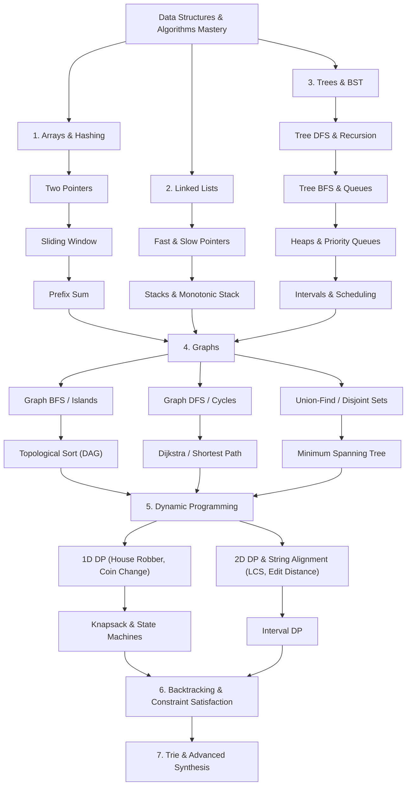
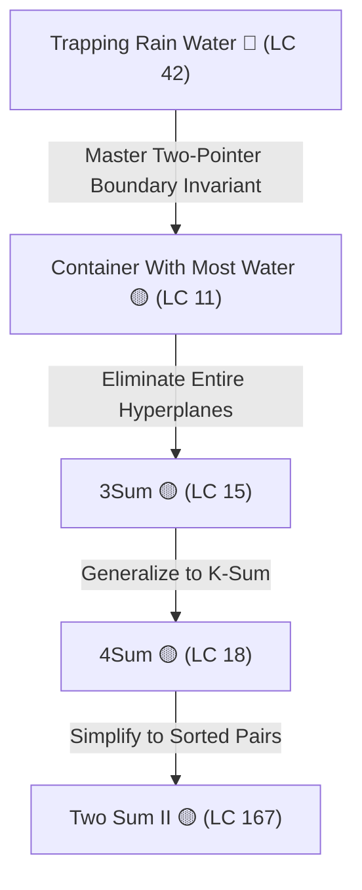
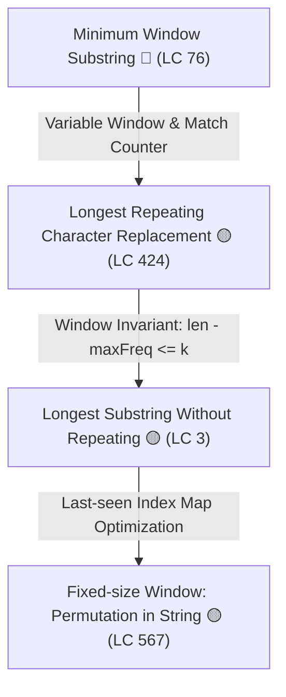
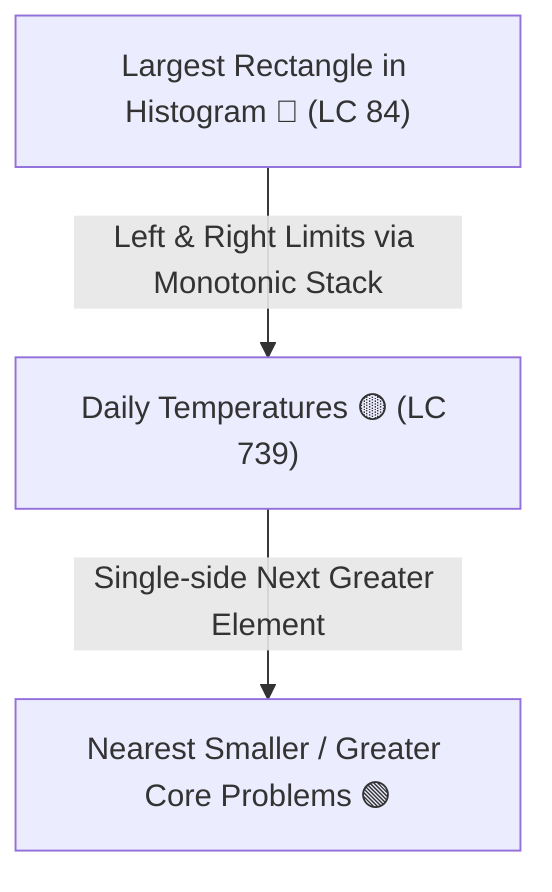
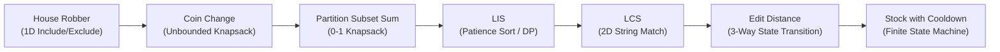
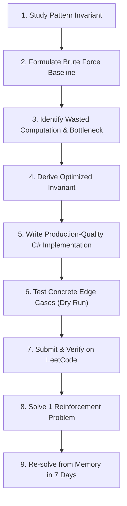
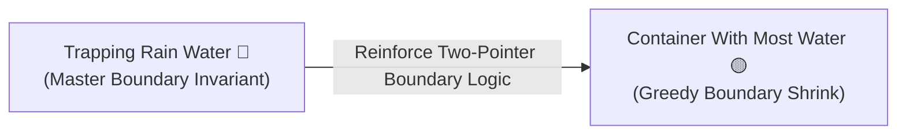

# 🎯 Senior / Lead DSA Interview — Unified Problem List

> **Curated DSA curriculum for Senior Software Engineer / Lead Software Engineer interviews at product tech companies.**  
> **Target Level:** Senior / Lead Software Engineer (.NET / C# / Polyglot)  
> **Core Philosophy:** Master foundational invariants and algorithmic patterns rather than memorizing individual solutions.  
> **Approach:** Learn the hardest representative problem of each pattern deeply, then leverage simpler variations to lock in pattern recognition.

---

## 🧭 Legend

### 🚥 Difficulty Levels
- 🟢 **Easy** — Syntax fluency, baseline data structure manipulation, and warmup variations.
- 🟡 **Medium** — The core staple of Senior/Lead interviews (~70% of questions). Tests invariant identification, optimization, and edge-case handling.
- 🔴 **Hard** — Multi-pattern synthesis, subtle invariant proofs, or advanced state-space DP.

### 🎯 Priority Ratings
- ⭐ **Core** — Must master first. Fundamental anchor problems representing universal patterns.
- 🔥 **High** — Strongly recommended. Essential variants frequently tested at top tech companies.
- 💡 **Advanced** — Deepens algorithmic maturity and teaches multi-pattern composition.
- ⚪ **Reinforcement** — Targeted practice to solidify mechanics and speed without cognitive overload.

### 🏷️ Pattern Tag Taxonomy
Tags are standardized into three distinct tiers for precision:
1. **Algorithmic Family:** `#two-pointers`, `#sliding-window`, `#prefix-sum`, `#binary-search`, `#monotonic-stack`, `#monotonic-queue`, `#heap`, `#intervals`, `#graph-traversal`, `#topological-sort`, `#union-find`, `#shortest-path`, `#mst`, `#greedy`, `#1d-dp`, `#2d-dp`, `#knapsack`, `#state-machine-dp`, `#interval-dp`, `#backtracking`, `#trie`.
2. **Technique & Invariant:** `#boundary-invariant`, `#complement-lookup`, `#canonical-representation`, `#fast-slow-pointers`, `#floyd-tortoise-hare`, `#expand-around-center`, `#k-way-merge`, `#patience-sorting`, `#running-deficit-invariant`, `#in-place-write`, `#sweep-line`, `#pruning`.
3. **Data Structure:** `#hash-map`, `#hash-set`, `#monotonic-stack`, `#min-heap`, `#max-heap`, `#two-heaps`, `#deque`, `#trie`, `#sentinel-node`.

---

## 📦 Phase 1 — Arrays, Hashing & Frequency

**Focus:** `HashSet` / `Dictionary`, Frequency maps, Complement lookup, Canonical representation, Array invariants

| # | Problem | LC# | Difficulty | Priority | Pattern Tags |
| :---: | :--- | :---: | :---: | :---: | :--- |
| 1 | [Two Sum](https://leetcode.com/problems/two-sum/) | 1 | 🟢 Easy | ⭐ Core | `#hash-map` `#complement-lookup` `#array` |
| 2 | [Contains Duplicate](https://leetcode.com/problems/contains-duplicate/) | 217 | 🟢 Easy | ⚪ Reinforcement | `#hash-set` `#lookup` `#early-exit` |
| 3 | [Valid Anagram](https://leetcode.com/problems/valid-anagram/) | 242 | 🟢 Easy | ⚪ Reinforcement | `#frequency-map` `#counting` `#string` |
| 4 | [Group Anagrams](https://leetcode.com/problems/group-anagrams/) | 49 | 🟡 Medium | ⭐ Core | `#hash-map` `#canonical-representation` `#string` `#sorting` |
| 5 | [Longest Consecutive Sequence](https://leetcode.com/problems/longest-consecutive-sequence/) | 128 | 🟡 Medium | ⭐ Core | `#hash-set` `#sequence-building` `#array` `#O(n)` |
| 6 | [Majority Element](https://leetcode.com/problems/majority-element/) | 169 | 🟢 Easy | 🔥 High | `#boyer-moore-voting` `#frequency` `#array` |
| 7 | [Product of Array Except Self](https://leetcode.com/problems/product-of-array-except-self/) | 238 | 🟡 Medium | ⭐ Core | `#prefix-suffix-product` `#array` `#space-optimization` |

### 💡 Pattern Milestone
You should be able to recognize:
- **Need fast existence lookup** ➔ `HashSet<T>`
- **Need key → count/value lookup** ➔ `Dictionary<TKey, TValue>`
- **Need grouping by equivalence class** ➔ Canonical representation + `Dictionary`

---

## 📦 Phase 2 — Two Pointers

**Focus:** Sorted arrays, Opposing pointers, Same-direction pointers, Eliminating impossible candidates, Boundary reasoning

| # | Problem | LC# | Difficulty | Priority | Pattern Tags |
| :---: | :--- | :---: | :---: | :---: | :--- |
| 8 | [Valid Palindrome](https://leetcode.com/problems/valid-palindrome/) | 125 | 🟢 Easy | ⚪ Reinforcement | `#two-pointers` `#opposing-pointers` `#string` |
| 9 | [Two Sum II — Input Array Is Sorted](https://leetcode.com/problems/two-sum-ii-input-array-is-sorted/) | 167 | 🟡 Medium | ⭐ Core | `#two-pointers` `#opposing-pointers` `#sorted-array` |
| 10 | [Container With Most Water](https://leetcode.com/problems/container-with-most-water/) | 11 | 🟡 Medium | ⭐ Core | `#two-pointers` `#greedy-elimination` `#boundary-shrink` |
| 11 | [3Sum](https://leetcode.com/problems/3sum/) | 15 | 🟡 Medium | ⭐ Core | `#two-pointers` `#sorting` `#k-sum` `#deduplication` |
| 12 | [4Sum](https://leetcode.com/problems/4sum/) | 18 | 🟡 Medium | 🔥 High | `#k-sum` `#two-pointers` `#recursion-pruning` `#deduplication` |
| 13 | [Trapping Rain Water](https://leetcode.com/problems/trapping-rain-water/) | 42 | 🔴 Hard | ⭐ Core | `#two-pointers` `#prefix-suffix-max` `#boundary-invariant` |

### 💡 Pattern Milestone
Understand this deeply:
> *"If the search space is ordered, can I eliminate a whole class of candidate pairs/triplets by moving one boundary inward?"*

---

## 📦 Phase 3 — Sliding Window

**Focus:** Fixed-size windows, Variable-size windows, Frequency tracking, Window invariants, Expand → validate → shrink

| # | Problem | LC# | Difficulty | Priority | Pattern Tags |
| :---: | :--- | :---: | :---: | :---: | :--- |
| 14 | [Maximum Average Subarray I](https://leetcode.com/problems/maximum-average-subarray-i/) | 643 | 🟢 Easy | ⚪ Reinforcement | `#sliding-window` `#fixed-size` `#array` |
| 15 | [Longest Substring Without Repeating Characters](https://leetcode.com/problems/longest-substring-without-repeating-characters/) | 3 | 🟡 Medium | ⭐ Core | `#sliding-window` `#variable-size` `#hash-set` `#last-seen-map` |
| 16 | [Longest Repeating Character Replacement](https://leetcode.com/problems/longest-repeating-character-replacement/) | 424 | 🟡 Medium | ⭐ Core | `#sliding-window` `#variable-size` `#frequency-map` `#window-invariant` |
| 17 | [Permutation in String](https://leetcode.com/problems/permutation-in-string/) | 567 | 🟡 Medium | 🔥 High | `#sliding-window` `#fixed-size` `#frequency-matching` |
| 18 | [Minimum Window Substring](https://leetcode.com/problems/minimum-window-substring/) | 76 | 🔴 Hard | ⭐ Core | `#sliding-window` `#variable-size` `#frequency-map` `#match-counter` |

### 💡 Pattern Milestone
Recognize:
- **Contiguous range + Find longest/shortest/valid range** ➔ Sliding Window (Maintain window invariant while expanding right, then contract left when violated).

---

## 📦 Phase 4 — Prefix Sum & Subarray Patterns

**Focus:** Running sums, Prefix sums, Prefix sum + HashMap, Range queries, Maximum subarray

| # | Problem | LC# | Difficulty | Priority | Pattern Tags |
| :---: | :--- | :---: | :---: | :---: | :--- |
| 19 | [Running Sum of 1d Array](https://leetcode.com/problems/running-sum-of-1d-array/) | 1480 | 🟢 Easy | ⚪ Reinforcement | `#prefix-sum` `#running-sum` `#array` |
| 20 | [Find Pivot Index](https://leetcode.com/problems/find-pivot-index/) | 724 | 🟢 Easy | 🔥 High | `#prefix-sum` `#balance-point` `#total-sum` |
| 21 | [Subarray Sum Equals K](https://leetcode.com/problems/subarray-sum-equals-k/) | 560 | 🟡 Medium | ⭐ Core | `#prefix-sum` `#hash-map` `#complement-lookup` |
| 22 | [Maximum Subarray](https://leetcode.com/problems/maximum-subarray/) | 53 | 🟡 Medium | ⭐ Core | `#kadanes-algorithm` `#dynamic-programming` `#greedy` |
| 23 | [Range Sum Query — Immutable](https://leetcode.com/problems/range-sum-query-immutable/) | 303 | 🟢 Easy | ⚪ Reinforcement | `#prefix-sum` `#range-queries` `#precomputation` |

### 💡 Pattern Milestone
Understand:
- `prefix[j] - prefix[i] == sum(nums[i..j-1])` ➔ Subarray sum reduction.
- **Need count/existence of subarrays with target sum** ➔ Prefix Sum + `Dictionary<int, int>` (storing frequency of prefix sums).

---

## 📦 Phase 5 — Strings

**Focus:** Character manipulation, Palindromes, String compression, String pattern recognition

| # | Problem | LC# | Difficulty | Priority | Pattern Tags |
| :---: | :--- | :---: | :---: | :---: | :--- |
| 24 | [Reverse String](https://leetcode.com/problems/reverse-string/) | 344 | 🟢 Easy | ⚪ Reinforcement | `#two-pointers` `#in-place` `#string` |
| 25 | [Longest Common Prefix](https://leetcode.com/problems/longest-common-prefix/) | 14 | 🟢 Easy | ⚪ Reinforcement | `#string` `#horizontal-scanning` `#vertical-scanning` |
| 26 | [String Compression](https://leetcode.com/problems/string-compression/) | 443 | 🟡 Medium | 🔥 High | `#two-pointers` `#in-place-write` `#run-length-encoding` |
| 27 | [Longest Palindromic Substring](https://leetcode.com/problems/longest-palindromic-substring/) | 5 | 🟡 Medium | ⭐ Core | `#expand-around-center` `#2d-dp` `#palindrome` |
| 28 | [Palindromic Substrings](https://leetcode.com/problems/palindromic-substrings/) | 647 | 🟡 Medium | 🔥 High | `#expand-around-center` `#dp` `#counting` |

---

## 📦 Phase 6 — Linked Lists

**Focus:** Pointer manipulation, Fast/slow pointers, Reversal, Cycle detection, Merge, Recursive pointer transformations

| # | Problem | LC# | Difficulty | Priority | Pattern Tags |
| :---: | :--- | :---: | :---: | :---: | :--- |
| 29 | [Reverse Linked List](https://leetcode.com/problems/reverse-linked-list/) | 206 | 🟢 Easy | ⭐ Core | `#linked-list` `#pointer-reversal` `#iterative-recursive` |
| 30 | [Merge Two Sorted Lists](https://leetcode.com/problems/merge-two-sorted-lists/) | 21 | 🟢 Easy | ⚪ Reinforcement | `#linked-list` `#sentinel-node` `#two-pointers` |
| 31 | [Linked List Cycle](https://leetcode.com/problems/linked-list-cycle/) | 141 | 🟢 Easy | ⭐ Core | `#linked-list` `#fast-slow-pointers` `#floyd-tortoise-hare` |
| 32 | [Remove Nth Node From End of List](https://leetcode.com/problems/remove-nth-node-from-end-of-list/) | 19 | 🟡 Medium | ⭐ Core | `#linked-list` `#fast-slow-gap` `#sentinel-node` |
| 33 | [Reorder List](https://leetcode.com/problems/reorder-list/) | 143 | 🟡 Medium | ⭐ Core | `#linked-list` `#fast-slow-split` `#reversal` `#interleave-merge` |
| 34 | [Merge K Sorted Lists](https://leetcode.com/problems/merge-k-sorted-lists/) | 23 | 🔴 Hard | ⭐ Core | `#min-heap` `#divide-and-conquer` `#k-way-merge` `#linked-list` |
| 35 | [Reverse Nodes in K-Group](https://leetcode.com/problems/reverse-nodes-in-k-group/) | 25 | 🔴 Hard | 🔥 High | `#linked-list` `#k-group-reversal` `#subsegment-reversal` |

### 💡 Pattern Milestone
Recognize:
- **Linked list + position from end / middle** ➔ Fast/slow pointers
- **Linked list + cycle detection** ➔ Floyd's Tortoise and Hare
- **Linked list + reverse sections** ➔ Three-pointer reversal (`prev`, `curr`, `next`) with sentinel dummy head

---

## 📦 Phase 7 — Stack & Monotonic Stack

**Focus:** Matching/open-close structures, Expression evaluation, Previous/next greater element, Monotonic structures

| # | Problem | LC# | Difficulty | Priority | Pattern Tags |
| :---: | :--- | :---: | :---: | :---: | :--- |
| 36 | [Valid Parentheses](https://leetcode.com/problems/valid-parentheses/) | 20 | 🟢 Easy | ⭐ Core | `#stack` `#bracket-matching` `#hash-map` |
| 37 | [Min Stack](https://leetcode.com/problems/min-stack/) | 155 | 🟡 Medium | ⭐ Core | `#stack` `#auxiliary-stack` `#constant-time-min` |
| 38 | [Evaluate Reverse Polish Notation](https://leetcode.com/problems/evaluate-reverse-polish-notation/) | 150 | 🟡 Medium | 🔥 High | `#stack` `#postfix-evaluation` `#expression-parsing` |
| 39 | [Daily Temperatures](https://leetcode.com/problems/daily-temperatures/) | 739 | 🟡 Medium | ⭐ Core | `#monotonic-stack` `#next-greater-element` `#index-tracking` |
| 40 | [Largest Rectangle in Histogram](https://leetcode.com/problems/largest-rectangle-in-histogram/) | 84 | 🔴 Hard | ⭐ Core | `#monotonic-stack` `#previous-next-smaller` `#boundary-expansion` |

### 💡 Pattern Milestone
Understand:
- **Need nearest greater/smaller element in $O(N)$** ➔ Monotonic Stack
- **For each element: determine maximum contiguous valid span** ➔ Previous smaller index + next smaller index

---

## 📦 Phase 8 — Binary Search

**Focus:** Classic binary search, Boundary search, Rotated arrays, Binary search on answer

| # | Problem | LC# | Difficulty | Priority | Pattern Tags |
| :---: | :--- | :---: | :---: | :---: | :--- |
| 41 | [Binary Search](https://leetcode.com/problems/binary-search/) | 704 | 🟢 Easy | ⭐ Core | `#binary-search` `#search-template` `#sorted-array` |
| 42 | [Search Insert Position](https://leetcode.com/problems/search-insert-position/) | 35 | 🟢 Easy | ⚪ Reinforcement | `#binary-search` `#lower-bound` `#insert-position` |
| 43 | [Find First and Last Position of Element in Sorted Array](https://leetcode.com/problems/find-first-and-last-position-of-element-in-sorted-array/) | 34 | 🟡 Medium | ⭐ Core | `#binary-search` `#lower-bound` `#upper-bound` |
| 44 | [Search in Rotated Sorted Array](https://leetcode.com/problems/search-in-rotated-sorted-array/) | 33 | 🟡 Medium | ⭐ Core | `#binary-search` `#rotated-sorted-array` `#pivot-partition` |
| 45 | [Find Minimum in Rotated Sorted Array](https://leetcode.com/problems/find-minimum-in-rotated-sorted-array/) | 153 | 🟡 Medium | 🔥 High | `#binary-search` `#rotated-sorted-array` `#inflection-point` |
| 46 | [Koko Eating Bananas](https://leetcode.com/problems/koko-eating-bananas/) | 875 | 🟡 Medium | ⭐ Core | `#binary-search-on-answer` `#monotonic-feasibility` |
| 47 | [Search a 2D Matrix](https://leetcode.com/problems/search-a-2d-matrix/) | 74 | 🟡 Medium | 🔥 High | `#binary-search` `#virtual-flattening` `#matrix-coordinate-mapping` |

### 💡 Pattern Milestone
Distinguish:
- **Search a sorted collection** ➔ Binary Search on Indices
- **Minimize the maximum / Maximize the minimum over a monotonic range** ➔ Binary Search on Answer Space (Predicate function `CanComplete(speed)`)

---

## 📦 Phase 9 — Binary Trees

**Focus:** DFS, BFS, Tree recursion, Tree invariants, Bottom-up vs top-down reasoning

| # | Problem | LC# | Difficulty | Priority | Pattern Tags |
| :---: | :--- | :---: | :---: | :---: | :--- |
| 48 | [Maximum Depth of Binary Tree](https://leetcode.com/problems/maximum-depth-of-binary-tree/) | 104 | 🟢 Easy | ⭐ Core | `#binary-tree` `#dfs-recursion` `#tree-depth` |
| 49 | [Same Tree](https://leetcode.com/problems/same-tree/) | 100 | 🟢 Easy | ⚪ Reinforcement | `#binary-tree` `#structural-dfs` `#isomorphism` |
| 50 | [Invert Binary Tree](https://leetcode.com/problems/invert-binary-tree/) | 226 | 🟢 Easy | ⚪ Reinforcement | `#binary-tree` `#dfs-bfs` `#pointer-swap` |
| 51 | [Binary Tree Level Order Traversal](https://leetcode.com/problems/binary-tree-level-order-traversal/) | 102 | 🟡 Medium | ⭐ Core | `#binary-tree` `#bfs` `#queue-level-by-level` |
| 52 | [Diameter of Binary Tree](https://leetcode.com/problems/diameter-of-binary-tree/) | 543 | 🟢 Easy | ⭐ Core | `#binary-tree` `#dfs-postorder` `#bottom-up-height` |
| 53 | [Validate Binary Search Tree](https://leetcode.com/problems/validate-binary-search-tree/) | 98 | 🟡 Medium | ⭐ Core | `#bst` `#dfs-inorder` `#range-validity` `#bst-invariant` |
| 54 | [Lowest Common Ancestor of a Binary Tree](https://leetcode.com/problems/lowest-common-ancestor-of-a-binary-tree/) | 236 | 🟡 Medium | ⭐ Core | `#binary-tree` `#dfs-postorder` `#lca` `#sub-tree-search` |
| 55 | [Kth Smallest Element in a BST](https://leetcode.com/problems/kth-smallest-element-in-a-bst/) | 230 | 🟡 Medium | 🔥 High | `#bst` `#inorder-traversal` `#stack` `#early-stopping` |

### 💡 Pattern Milestone
For every tree problem, explicitly formulate:
> *"What information must my subtree compute and return to its parent?"*  
> (Bottom-up post-order returns depth/state; global optimum updated via reference variable).

---

## 📦 Phase 10 — Heap / Priority Queue

**Focus:** Top K, Streaming data, Min-heap / Max-heap, Maintaining partial ordering

| # | Problem | LC# | Difficulty | Priority | Pattern Tags |
| :---: | :--- | :---: | :---: | :---: | :--- |
| 56 | [Kth Largest Element in an Array](https://leetcode.com/problems/kth-largest-element-in-an-array/) | 215 | 🟡 Medium | ⭐ Core | `#min-heap` `#quickselect` `#top-k` |
| 57 | [Top K Frequent Elements](https://leetcode.com/problems/top-k-frequent-elements/) | 347 | 🟡 Medium | ⭐ Core | `#hash-map` `#min-heap` `#bucket-sort` `#top-k` |
| 58 | [K Closest Points to Origin](https://leetcode.com/problems/k-closest-points-to-origin/) | 973 | 🟡 Medium | 🔥 High | `#max-heap` `#quickselect` `#geometry` `#top-k` |
| 59 | [Find Median from Data Stream](https://leetcode.com/problems/find-median-from-data-stream/) | 295 | 🔴 Hard | ⭐ Core | `#two-heaps` `#min-max-heap-balance` `#streaming-median` |

### 💡 Pattern Milestone
Recognize:
- **Need Top/Bottom $K$ elements** ➔ Min-Heap of size $K$ (keeps largest $K$) or Quickselect
- **Need dynamic median in streaming data** ➔ Two Heaps (Max-Heap for lower half, Min-Heap for upper half, balanced within size difference $\le 1$)

---

## 📦 Phase 11 — Intervals

**Focus:** Sorting by start/end, Merging, Overlap detection, Scheduling

| # | Problem | LC# | Difficulty | Priority | Pattern Tags |
| :---: | :--- | :---: | :---: | :---: | :--- |
| 60 | [Merge Intervals](https://leetcode.com/problems/merge-intervals/) | 56 | 🟡 Medium | ⭐ Core | `#intervals` `#sorting-by-start` `#overlap-merge` |
| 61 | [Insert Interval](https://leetcode.com/problems/insert-interval/) | 57 | 🟡 Medium | 🔥 High | `#intervals` `#linear-scan` `#overlap-merge` |
| 62 | [Non-overlapping Intervals](https://leetcode.com/problems/non-overlapping-intervals/) | 435 | 🟡 Medium | 🔥 High | `#intervals` `#greedy-earliest-end` `#interval-scheduling` |
| 63 | [Meeting Rooms II](https://leetcode.com/problems/meeting-rooms-ii/) | 253 | 🟡 Medium | ⭐ Core | `#intervals` `#min-heap` `#sweep-line` `#two-pointers-events` |

### 💡 Pattern Milestone
Usually:
- **Interval overlaps/merging** ➔ Sort by `start` time ➔ Iterate comparing `curr.start <= prev.end`.
- **Concurrency / Minimum resources needed** ➔ Min-Heap of end times OR Sweep-Line event sorting (`+1` at start, `-1` at end).

---

## 📦 Phase 12 — Graph Traversal

**Focus:** Graph representation, DFS, BFS, Visited state, Connected components, Grid as graph

| # | Problem | LC# | Difficulty | Priority | Pattern Tags |
| :---: | :--- | :---: | :---: | :---: | :--- |
| 64 | [Number of Islands](https://leetcode.com/problems/number-of-islands/) | 200 | 🟡 Medium | ⭐ Core | `#graph` `#grid-dfs-bfs` `#connected-components` |
| 65 | [Clone Graph](https://leetcode.com/problems/clone-graph/) | 133 | 🟡 Medium | 🔥 High | `#graph` `#dfs-bfs` `#hash-map-visited` `#deep-copy` |
| 66 | [Number of Provinces](https://leetcode.com/problems/number-of-provinces/) | 547 | 🟡 Medium | 🔥 High | `#graph` `#dfs-bfs` `#union-find` `#connected-components` |
| 67 | [Number of Connected Components in an Undirected Graph](https://leetcode.com/problems/number-of-connected-components-in-an-undirected-graph/) | 323 | 🟡 Medium | ⭐ Core | `#graph` `#dfs-bfs` `#union-find` `#undirected-graph` |
| 68 | [Course Schedule](https://leetcode.com/problems/course-schedule/) | 207 | 🟡 Medium | ⭐ Core | `#graph` `#topological-sort` `#kahns-algorithm` `#cycle-detection-dfs` |
| 69 | [Course Schedule II](https://leetcode.com/problems/course-schedule-ii/) | 210 | 🟡 Medium | 🔥 High | `#graph` `#topological-sort` `#kahns-algorithm` `#ordering` |

---

## 📦 Phase 13 — Graph Algorithms

**Focus:** Shortest paths, Weighted graphs, MST, Union-Find, Advanced graph reasoning

| # | Problem | LC# | Difficulty | Priority | Pattern Tags |
| :---: | :--- | :---: | :---: | :---: | :--- |
| 70 | [Network Delay Time](https://leetcode.com/problems/network-delay-time/) | 743 | 🟡 Medium | ⭐ Core | `#graph` `#dijkstras-algorithm` `#min-heap` `#shortest-path` |
| 71 | [Redundant Connection](https://leetcode.com/problems/redundant-connection/) | 684 | 🟡 Medium | ⭐ Core | `#union-find` `#cycle-detection` `#disjoint-set-union` |
| 72 | [Cheapest Flights Within K Stops](https://leetcode.com/problems/cheapest-flights-within-k-stops/) | 787 | 🟡 Medium | 🔥 High | `#bellman-ford` `#bfs-level` `#dijkstra-with-stops` `#shortest-path` |
| 73 | [Min Cost to Connect All Points](https://leetcode.com/problems/min-cost-to-connect-all-points/) | 1584 | 🟡 Medium | ⭐ Core | `#minimum-spanning-tree` `#prims-algorithm` `#kruskals-algorithm` `#union-find` |
| 74 | [Critical Connections in a Network](https://leetcode.com/problems/critical-connections-in-a-network/) | 1192 | 🔴 Hard | 💡 Advanced | `#graph` `#tarjans-bridge-finding` `#dfs-low-link` |

---

## 📦 Phase 14 — Greedy

**Focus:** Local optimal decisions, Proving greedy choices, Reachability, Scheduling, Exchange arguments

| # | Problem | LC# | Difficulty | Priority | Pattern Tags |
| :---: | :--- | :---: | :---: | :---: | :--- |
| 75 | [Jump Game](https://leetcode.com/problems/jump-game/) | 55 | 🟡 Medium | ⭐ Core | `#greedy` `#max-reach` `#boundary-scanning` |
| 76 | [Gas Station](https://leetcode.com/problems/gas-station/) | 134 | 🟡 Medium | ⭐ Core | `#greedy` `#circular-array` `#running-deficit-invariant` |
| 77 | [Partition Labels](https://leetcode.com/problems/partition-labels/) | 763 | 🟡 Medium | 🔥 High | `#greedy` `#two-pointers` `#last-occurrence-map` |
| 78 | [Non-overlapping Intervals](https://leetcode.com/problems/non-overlapping-intervals/) | 435 | 🟡 Medium | 🔥 High | `#greedy` `#earliest-end-time` `#intervals` |

> [!NOTE]
> *Non-overlapping Intervals* (LC 435) appears in both Phase 11 and Phase 14 intentionally to demonstrate how interval scheduling is proved via greedy exchange arguments.

---

## 📦 Phase 15 — Dynamic Programming Fundamentals

**Focus:** State definition, Recurrence, Base cases, Memoization, Tabulation, Space optimization

| # | Problem | LC# | Difficulty | Priority | Pattern Tags |
| :---: | :--- | :---: | :---: | :---: | :--- |
| 79 | [Climbing Stairs](https://leetcode.com/problems/climbing-stairs/) | 70 | 🟢 Easy | ⭐ Core | `#1d-dp` `#fibonacci-recurrence` `#space-optimization` |
| 80 | [House Robber](https://leetcode.com/problems/house-robber/) | 198 | 🟡 Medium | ⭐ Core | `#1d-dp` `#include-exclude` `#state-transition` |
| 81 | [Coin Change](https://leetcode.com/problems/coin-change/) | 322 | 🟡 Medium | ⭐ Core | `#1d-dp` `#unbounded-knapsack` `#bottom-up-tabulation` |
| 82 | [Word Break](https://leetcode.com/problems/word-break/) | 139 | 🟡 Medium | ⭐ Core | `#1d-dp` `#hash-set` `#string-partition` |
| 83 | [Partition Equal Subset Sum](https://leetcode.com/problems/partition-equal-subset-sum/) | 416 | 🟡 Medium | 🔥 High | `#0-1-knapsack` `#1d-dp-space-opt` `#boolean-reachability` |
| 84 | [Longest Increasing Subsequence](https://leetcode.com/problems/longest-increasing-subsequence/) | 300 | 🟡 Medium | ⭐ Core | `#dp` `#patience-sorting` `#binary-search` `#O(n-log-n)` |
| 85 | [Maximum Product Subarray](https://leetcode.com/problems/maximum-product-subarray/) | 152 | 🟡 Medium | 🔥 High | `#dp` `#min-max-tracking` `#sign-flip-invariant` |

---

## 📦 Phase 16 — Advanced Dynamic Programming

**Focus:** 2D DP, String DP, Sequence alignment, State transitions, Optimization

| # | Problem | LC# | Difficulty | Priority | Pattern Tags |
| :---: | :--- | :---: | :---: | :---: | :--- |
| 86 | [Unique Paths](https://leetcode.com/problems/unique-paths/) | 62 | 🟡 Medium | ⚪ Reinforcement | `#2d-dp` `#grid-paths` `#space-optimization` |
| 87 | [Minimum Path Sum](https://leetcode.com/problems/minimum-path-sum/) | 64 | 🟡 Medium | 🔥 High | `#2d-dp` `#grid-cost-min` `#in-place-tabulation` |
| 88 | [Longest Common Subsequence](https://leetcode.com/problems/longest-common-subsequence/) | 1143 | 🟡 Medium | ⭐ Core | `#2d-dp` `#string-alignment` `#subsequence-grid` |
| 89 | [Edit Distance](https://leetcode.com/problems/edit-distance/) | 72 | 🔴 Hard | ⭐ Core | `#2d-dp` `#string-levenshtein` `#insert-delete-replace` |
| 90 | [Decode Ways](https://leetcode.com/problems/decode-ways/) | 91 | 🟡 Medium | 🔥 High | `#1d-dp` `#string-decoding` `#valid-prefix-states` |
| 91 | [Target Sum](https://leetcode.com/problems/target-sum/) | 494 | 🟡 Medium | 🔥 High | `#0-1-knapsack` `#subset-sum-reduction` `#1d-dp` |
| 92 | [Best Time to Buy and Sell Stock with Cooldown](https://leetcode.com/problems/best-time-to-buy-and-sell-stock-with-cooldown/) | 309 | 🟡 Medium | 💡 Advanced | `#state-machine-dp` `#stock-trading` `#rest-held-sold` |

---

## 📦 Phase 17 — Backtracking

**Focus:** State-space search, Decision trees, Choose → explore → undo, Pruning, Combinatorial generation

| # | Problem | LC# | Difficulty | Priority | Pattern Tags |
| :---: | :--- | :---: | :---: | :---: | :--- |
| 93 | [Subsets](https://leetcode.com/problems/subsets/) | 78 | 🟡 Medium | ⭐ Core | `#backtracking` `#cascade-inclusion` `#bitmask` |
| 94 | [Permutations](https://leetcode.com/problems/permutations/) | 46 | 🟡 Medium | ⭐ Core | `#backtracking` `#visited-boolean-array` `#element-swap` |
| 95 | [Combination Sum](https://leetcode.com/problems/combination-sum/) | 39 | 🟡 Medium | ⭐ Core | `#backtracking` `#unbounded-choice` `#sum-pruning` |
| 96 | [Letter Combinations of a Phone Number](https://leetcode.com/problems/letter-combinations-of-a-phone-number/) | 17 | 🟡 Medium | 🔥 High | `#backtracking` `#digit-mapping` `#cartesian-product` |
| 97 | [Word Search](https://leetcode.com/problems/word-search/) | 79 | 🟡 Medium | ⭐ Core | `#backtracking` `#grid-dfs` `#in-place-marking` |
| 98 | [N-Queens](https://leetcode.com/problems/n-queens/) | 51 | 🔴 Hard | 💡 Advanced | `#backtracking` `#diagonal-bitsets` `#constraint-satisfaction` |

---

## 📦 Phase 18 — Trie / String Search

**Focus:** Prefix trees, Prefix queries, Dictionary search, DFS + Trie

| # | Problem | LC# | Difficulty | Priority | Pattern Tags |
| :---: | :--- | :---: | :---: | :---: | :--- |
| 99 | [Implement Trie (Prefix Tree)](https://leetcode.com/problems/implement-trie-prefix-tree/) | 208 | 🟡 Medium | ⭐ Core | `#trie` `#prefix-tree` `#design` |
| 100 | [Design Add and Search Words Data Structure](https://leetcode.com/problems/design-add-and-search-words-data-structure/) | 211 | 🟡 Medium | 🔥 High | `#trie` `#wildcard-search` `#dfs-backtracking` |
| 101 | [Word Search II](https://leetcode.com/problems/word-search-ii/) | 212 | 🔴 Hard | 💡 Advanced | `#trie` `#grid-backtracking` `#prefix-pruning` |

---

## 📦 Phase 19 — Union-Find / Disjoint Set

**Focus:** Dynamic connectivity, Connected components, Cycle detection, Kruskal's MST

| # | Problem | LC# | Difficulty | Priority | Pattern Tags |
| :---: | :--- | :---: | :---: | :---: | :--- |
| 102 | [Number of Provinces](https://leetcode.com/problems/number-of-provinces/) | 547 | 🟡 Medium | 🔥 High | `#union-find` `#rank-path-compression` `#connected-components` |
| 103 | [Redundant Connection](https://leetcode.com/problems/redundant-connection/) | 684 | 🟡 Medium | ⭐ Core | `#union-find` `#cycle-detection` `#undirected-graph` |
| 104 | [Accounts Merge](https://leetcode.com/problems/accounts-merge/) | 721 | 🟡 Medium | 💡 Advanced | `#union-find` `#email-graph` `#connected-components` |
| 105 | [Min Cost to Connect All Points](https://leetcode.com/problems/min-cost-to-connect-All-points/) | 1584 | 🟡 Medium | ⭐ Core | `#union-find` `#kruskals-algorithm` `#minimum-spanning-tree` |

---

## 📦 Phase 20 — Advanced / Senior-Level Patterns

**Focus:** Multi-pattern synthesis, Deque monotonicity, Implicit graphs, 2D State DP, System-level algorithmic maturity

| # | Problem | LC# | Difficulty | Priority | Pattern Tags |
| :---: | :--- | :---: | :---: | :---: | :--- |
| 106 | [Sliding Window Maximum](https://leetcode.com/problems/sliding-window-maximum/) | 239 | 🔴 Hard | ⭐ Core | `#monotonic-queue` `#deque` `#sliding-window` |
| 107 | [Median of Two Sorted Arrays](https://leetcode.com/problems/median-of-two-sorted-arrays/) | 4 | 🔴 Hard | 💡 Advanced | `#binary-search` `#partition-cut` `#O(log(min(m,n)))` |
| 108 | [Largest Rectangle in Histogram](https://leetcode.com/problems/largest-rectangle-in-histogram/) | 84 | 🔴 Hard | ⭐ Core | `#monotonic-stack` `#left-right-limits` `#area-maximization` |
| 109 | [Trapping Rain Water](https://leetcode.com/problems/trapping-rain-water/) | 42 | 🔴 Hard | ⭐ Core | `#two-pointers` `#prefix-suffix-max` `#boundary-invariant` |
| 110 | [Word Ladder](https://leetcode.com/problems/word-ladder/) | 127 | 🔴 Hard | 🔥 High | `#bfs` `#bidirectional-bfs` `#implicit-graph` `#shortest-path` |
| 111 | [Swim in Rising Water](https://leetcode.com/problems/swim-in-rising-water/) | 778 | 🔴 Hard | 💡 Advanced | `#dijkstras-algorithm` `#binary-search-on-answer` `#union-find` |
| 112 | [Longest Valid Parentheses](https://leetcode.com/problems/longest-valid-parentheses/) | 32 | 🔴 Hard | 💡 Advanced | `#monotonic-stack` `#1d-dp` `#boundary-two-pointers` |
| 113 | [Regular Expression Matching](https://leetcode.com/problems/regular-expression-matching/) | 10 | 🔴 Hard | 💡 Advanced | `#2d-dp` `#memoization` `#regex-state-machine` |
| 114 | [Burst Balloons](https://leetcode.com/problems/burst-balloons/) | 312 | 🔴 Hard | 💡 Advanced | `#interval-dp` `#divide-and-conquer` `#subproblem-boundary` |
| 115 | [Serialize and Deserialize Binary Tree](https://leetcode.com/problems/serialize-and-deserialize-binary-tree/) | 297 | 🔴 Hard | 🔥 High | `#binary-tree` `#preorder-dfs` `#bfs-level-order` `#system-design` |

---

## 📊 Pattern Coverage Matrix

The objective is not to memorize 115 individual solutions. The objective is to master the fundamental algorithmic patterns that power them:

| Algorithmic Pattern | Representative Anchor Problems |
| :--- | :--- |
| **Hashing & Frequency** | [Two Sum](https://leetcode.com/problems/two-sum/), [Group Anagrams](https://leetcode.com/problems/group-anagrams/), [Longest Consecutive Sequence](https://leetcode.com/problems/longest-consecutive-sequence/) |
| **Two Pointers** | [Container With Most Water](https://leetcode.com/problems/container-with-most-water/), [3Sum](https://leetcode.com/problems/3sum/), [4Sum](https://leetcode.com/problems/4sum/), [Trapping Rain Water](https://leetcode.com/problems/trapping-rain-water/) |
| **Sliding Window** | [Longest Substring Without Repeating Characters](https://leetcode.com/problems/longest-substring-without-repeating-characters/), [Longest Repeating Character Replacement](https://leetcode.com/problems/longest-repeating-character-replacement/), [Minimum Window Substring](https://leetcode.com/problems/minimum-window-substring/) |
| **Prefix Sum & Running Invariants** | [Find Pivot Index](https://leetcode.com/problems/find-pivot-index/), [Subarray Sum Equals K](https://leetcode.com/problems/subarray-sum-equals-k/) |
| **Fast & Slow Pointers** | [Linked List Cycle](https://leetcode.com/problems/linked-list-cycle/), [Remove Nth Node From End](https://leetcode.com/problems/remove-nth-node-from-end-of-list/), [Reorder List](https://leetcode.com/problems/reorder-list/) |
| **Monotonic Stack** | [Daily Temperatures](https://leetcode.com/problems/daily-temperatures/), [Largest Rectangle in Histogram](https://leetcode.com/problems/largest-rectangle-in-histogram/) |
| **Monotonic Queue (Deque)** | [Sliding Window Maximum](https://leetcode.com/problems/sliding-window-maximum/) |
| **Binary Search (Index Space)** | [Binary Search](https://leetcode.com/problems/binary-search/), [Search in Rotated Sorted Array](https://leetcode.com/problems/search-in-rotated-sorted-array/) |
| **Binary Search on Answer Space** | [Koko Eating Bananas](https://leetcode.com/problems/koko-eating-bananas/) |
| **Tree DFS (Post-order / In-order)** | [Maximum Depth](https://leetcode.com/problems/maximum-depth-of-binary-tree/), [Diameter of Binary Tree](https://leetcode.com/problems/diameter-of-binary-tree/), [Lowest Common Ancestor](https://leetcode.com/problems/lowest-common-ancestor-of-a-binary-tree/), [Validate BST](https://leetcode.com/problems/validate-binary-search-tree/) |
| **Tree BFS (Level Order)** | [Binary Tree Level Order Traversal](https://leetcode.com/problems/binary-tree-level-order-traversal/) |
| **Heap / Top K** | [Kth Largest Element](https://leetcode.com/problems/kth-largest-element-in-an-array/), [Top K Frequent Elements](https://leetcode.com/problems/top-k-frequent-elements/), [K Closest Points to Origin](https://leetcode.com/problems/k-closest-points-to-origin/) |
| **Two Heaps (Streaming)** | [Find Median from Data Stream](https://leetcode.com/problems/find-median-from-data-stream/) |
| **Intervals & Sweeping** | [Merge Intervals](https://leetcode.com/problems/merge-intervals/), [Insert Interval](https://leetcode.com/problems/insert-interval/), [Meeting Rooms II](https://leetcode.com/problems/meeting-rooms-ii/) |
| **Graph DFS / BFS / Components** | [Number of Islands](https://leetcode.com/problems/number-of-islands/), [Clone Graph](https://leetcode.com/problems/clone-graph/), [Connected Components](https://leetcode.com/problems/number-of-connected-components-in-an-undirected-graph/) |
| **Topological Sort** | [Course Schedule](https://leetcode.com/problems/course-schedule/), [Course Schedule II](https://leetcode.com/problems/course-schedule-ii/) |
| **Disjoint Set Union (Union-Find)** | [Redundant Connection](https://leetcode.com/problems/redundant-connection/), [Number of Provinces](https://leetcode.com/problems/number-of-provinces/) |
| **Shortest Path (Dijkstra / Bellman-Ford)**| [Network Delay Time](https://leetcode.com/problems/network-delay-time/), [Cheapest Flights Within K Stops](https://leetcode.com/problems/cheapest-flights-within-k-stops/) |
| **Minimum Spanning Tree (MST)** | [Min Cost to Connect All Points](https://leetcode.com/problems/min-cost-to-connect-all-points/) |
| **Greedy & Invariants** | [Jump Game](https://leetcode.com/problems/jump-game/), [Gas Station](https://leetcode.com/problems/gas-station/), [Non-overlapping Intervals](https://leetcode.com/problems/non-overlapping-intervals/) |
| **1D Dynamic Programming** | [House Robber](https://leetcode.com/problems/house-robber/), [Coin Change](https://leetcode.com/problems/coin-change/), [Word Break](https://leetcode.com/problems/word-break/) |
| **2D Dynamic Programming** | [Longest Common Subsequence](https://leetcode.com/problems/longest-common-subsequence/), [Edit Distance](https://leetcode.com/problems/edit-distance/) |
| **Knapsack Patterns** | [Partition Equal Subset Sum](https://leetcode.com/problems/partition-equal-subset-sum/), [Coin Change](https://leetcode.com/problems/coin-change/) |
| **State Machine DP** | [Best Time to Buy and Sell Stock with Cooldown](https://leetcode.com/problems/best-time-to-buy-and-sell-stock-with-cooldown/) |
| **Interval DP** | [Burst Balloons](https://leetcode.com/problems/burst-balloons/) |
| **Backtracking** | [Subsets](https://leetcode.com/problems/subsets/), [Permutations](https://leetcode.com/problems/permutations/), [Combination Sum](https://leetcode.com/problems/combination-sum/), [Word Search](https://leetcode.com/problems/word-search/) |
| **Trie (Prefix Trees)** | [Implement Trie](https://leetcode.com/problems/implement-trie-prefix-tree/), [Word Search II](https://leetcode.com/problems/word-search-ii/) |

---

## 🗺️ Recommended Learning Order

Do not simply solve sequentially #1 → #115. Follow this dependency-driven progression:



### Text Representation of Dependency Flow

```text
                    DSA
                     │
       ┌─────────────┼─────────────┐
       │             │             │
    Arrays         Lists         Trees
       │             │             │
 Hashing         Pointers       DFS/BFS
       │             │             │
Two Pointers   Fast/Slow       BST
       │             │             │
Sliding Window   Stack          Heap
       │             │             │
Prefix Sum           │        Intervals
       └─────────────┼─────────────┘
                     │
                   Graphs
                     │
        ┌────────────┼────────────┐
        │            │            │
       BFS          DFS       Union-Find
        │            │            │
       DAG        Shortest       MST
                     │
                   DP
                     │
          ┌──────────┴──────────┐
          │                     │
       1D DP                  2D DP
          │                     │
      Knapsack             String DP
          │                     │
          └──────────┬──────────┘
                     │
                Backtracking
                     │
                   Trie
```

---

## ⚡ Hard-First Learning Strategy

For each major algorithmic pattern, master one difficult representative problem first. Deriving its boundary conditions and loop invariants makes all derivative medium and easy questions trivial to recognize.

### 1. Two Pointers Pipeline



- **Step 1:** [Trapping Rain Water](https://leetcode.com/problems/trapping-rain-water/) 🔴 ➔ Understand how `left_max` and `right_max` boundaries decide trapped water without knowing internal heights.
- **Step 2:** [Container With Most Water](https://leetcode.com/problems/container-with-most-water/) 🟡 ➔ Prove why moving the shorter pointer is the only action that could increase area.
- **Step 3:** [3Sum](https://leetcode.com/problems/3sum/) 🟡 ➔ Fix first element, apply two-pointer elimination, manage duplicates.
- **Step 4:** [4Sum](https://leetcode.com/problems/4sum/) 🟡 ➔ Generalize to $K$-Sum via recursion and pruning.
- **Step 5:** [Two Sum II](https://leetcode.com/problems/two-sum-ii-input-array-is-sorted/) 🟡 ➔ Classic baseline.

---

### 2. Sliding Window Pipeline



- **Step 1:** [Minimum Window Substring](https://leetcode.com/problems/minimum-window-substring/) 🔴 ➔ Master tracking remaining target characters with `matchCount` and sliding boundaries.
- **Step 2:** [Longest Repeating Character Replacement](https://leetcode.com/problems/longest-repeating-character-replacement/) 🟡 ➔ Maintain window invariant `(windowLength - maxFrequency) <= k`.
- **Step 3:** [Longest Substring Without Repeating Characters](https://leetcode.com/problems/longest-substring-without-repeating-characters/) 🟡 ➔ Fast shrink via last-seen index map.
- **Step 4:** Fixed-size window problems ([Permutation in String](https://leetcode.com/problems/permutation-in-string/) 🟡) ➔ Slide with constant window width.

---

### 3. Monotonic Stack Pipeline



- **Step 1:** [Largest Rectangle in Histogram](https://leetcode.com/problems/largest-rectangle-in-histogram/) 🔴 ➔ For every bar, find how far it extends left and right using a strictly increasing stack.
- **Step 2:** [Daily Temperatures](https://leetcode.com/problems/daily-temperatures/) 🟡 ➔ Simpler one-directional Next Greater Element.
- **Step 3:** General nearest element queries.

---

### 4. Dynamic Programming Pipeline

Do not begin with dozens of trivial DP problems. Build state-space discipline incrementally:



1. [House Robber](https://leetcode.com/problems/house-robber/) ➔ 1D Include/Exclude decision.
2. [Coin Change](https://leetcode.com/problems/coin-change/) ➔ Unbounded knapsack (infinite supply).
3. [Partition Equal Subset Sum](https://leetcode.com/problems/partition-equal-subset-sum/) ➔ 0-1 Knapsack (single item usage).
4. [Longest Increasing Subsequence](https://leetcode.com/problems/longest-increasing-subsequence/) ➔ $O(N^2)$ DP transitioned into $O(N \log N)$ patience sorting.
5. [Longest Common Subsequence](https://leetcode.com/problems/longest-common-subsequence/) ➔ 2D Grid DP matching prefixes.
6. [Edit Distance](https://leetcode.com/problems/edit-distance/) ➔ 3-way branch (Insert, Delete, Replace).
7. [Best Time to Buy and Sell Stock with Cooldown](https://leetcode.com/problems/best-time-to-buy-and-sell-stock-with-cooldown/) ➔ State machine with explicit states (`Held`, `Sold`, `Reset`).

---

## 🛠️ Problem-Solving Protocol (Senior / Lead Execution)

In senior engineering interviews, code is only ~40% of the evaluation. Communication, rigorous derivation, and edge-case defensibility carry the remaining 60%.

### Step 1 — Understand & Clarify
Explicitly state and confirm:
- **Input Types & Sizes:** What is $N$? Can $N=0$? Can numbers be negative?
- **Output Expectations:** In-place mutation vs returning new allocated structures?
- **Constraints:** Are values bounded within 32-bit integers? Does memory fit in RAM?
- **Edge Cases:** Empty collection, 1 element, duplicates, all elements identical, already sorted, reverse sorted.

### Step 2 — Formulate Naive Baseline (Brute Force)
Before jumping to an optimal algorithm, establish the baseline:
- *"The naive approach is to generate all pairs/subarrays in $O(N^2)$ / $O(2^N)$ time."*
- State its exact time and space complexity.

### Step 3 — Identify the Bottleneck
Analyze the repeated or wasted computation:
- What redundant operations are occurring?
- Can I cache intermediate states (`Dictionary`, memoization)?
- Can I maintain a rolling state incrementally (Sliding Window, Prefix Sum)?
- Can I eliminate a branch of decisions by sorting or moving boundaries (Two Pointers, Binary Search)?

### Step 4 — Select Pattern & State Invariant
Name the algorithmic technique and its invariant:
- *"I will use opposing two pointers. The invariant is that the container width strictly decreases while we only discard heights strictly less than the opposing boundary."*

### Step 5 — Prove Correctness Before Coding
Do not just state *"this works"*. Explain:
- **Loop Invariant:** What remains true at the start of every iteration?
- **Safety:** Why does discarding this candidate never lose an optimal solution?
- **Termination:** Why is progress guaranteed and infinite loops prevented?

### Step 6 — Explicit Complexity Analysis
Always state both time and memory dimensions explicitly:
```text
Time Complexity:      O(N log N) — dominated by sorting
Auxiliary Space:      O(1)       — pointers modified in-place
Output Space:         O(K)       — memory allocated for the returned result
```

> [!IMPORTANT]
> Always distinguish **Auxiliary Space** (memory used internally by the algorithm) from **Output Space** (memory required to store the answer). Senior interviewers scrutinize this distinction.

### Step 7 — Production-Quality Implementation (C# / .NET)
Write clean, idiomatic code:
- Meaningful variable names (`left`, `right`, `maxWater`, `prefixSum`).
- Guard clauses at the top for trivial edge cases (`if (nums == null || nums.Length == 0) return 0;`).
- Avoid unnecessary garbage collection allocations (`Span<T>`, arrays over LINQ in critical inner loops).
- Defend against arithmetic overflow: use `mid = left + (right - left) / 2` instead of `(left + right) / 2`.
- Focus code comments on invariants rather than reiterating obvious syntax.

### Step 8 — Systematic Dry Run & Testing
Walk through your code line-by-line with a concrete test case before declaring completion:
1. **Standard Case:** Normal array with mixed elements.
2. **Boundary Cases:** `nums.Length == 0`, `nums.Length == 1`.
3. **Extreme Cases:** Duplicate values, all identical values, negative values, integer limits (`int.MinValue`, `int.MaxValue`).

---

## 🎯 Mastery Levels

For each Core problem, track your progress against these 5 maturity levels:

- **Level 1 — Understand:** Can explain how the algorithm works and explain the editorial solution.
- **Level 2 — Implement:** Can write bug-free, clean code without looking at references.
- **Level 3 — Recognize:** Can identify the pattern immediately when disguised under real-world domain phrasing.
- **Level 4 — Derive:** Can derive the algorithm and its invariant from first principles even if forgotten.
- **Level 5 — Senior Interview Ready:** Can articulate:
  $$\text{Problem} \longrightarrow \text{Brute Force} \longrightarrow \text{Bottleneck} \longrightarrow \text{Optimization} \longrightarrow \text{Invariant Proof} \longrightarrow \text{Complexity} \longrightarrow \text{Idiomatic Code} \longrightarrow \text{Edge Cases}$$

> [!IMPORTANT]
> A Senior/Lead candidate should target **Level 4–5** across all **50 Core Problems**.

---

## 🏆 Senior / Lead Must-Master Set (Top 50)

If interview preparation time is limited, prioritize this definitive set of 50 problems. Every problem includes the core invariant and the architectural insight expected in a senior evaluation.

### Arrays & Hashing

#### 1. [Two Sum](https://leetcode.com/problems/two-sum/) (LC #1)
- **Difficulty:** 🟢 Easy | **Priority:** ⭐ Core
- **Senior Takeaway & Invariant:** Trade $O(N)$ auxiliary space for $O(1)$ complement lookup. A one-pass hash map simultaneously probes history while registering current elements, avoiding self-pairing.
- **Tags:** `#hash-map` `#complement-lookup` `#array` `#one-pass`

#### 2. [Group Anagrams](https://leetcode.com/problems/group-anagrams/) (LC #49)
- **Difficulty:** 🟡 Medium | **Priority:** ⭐ Core
- **Senior Takeaway & Invariant:** Grouping requires an equivalence relation. Project each element into an immutable canonical key (either sorted string $O(K \log K)$ or a 26-character frequency count tuple $O(K)$) as the dictionary hash key.
- **Tags:** `#hash-map` `#canonical-representation` `#frequency-map` `#string`

#### 3. [Longest Consecutive Sequence](https://leetcode.com/problems/longest-consecutive-sequence/) (LC #128)
- **Difficulty:** 🟡 Medium | **Priority:** ⭐ Core
- **Senior Takeaway & Invariant:** Achieve $O(N)$ without sorting by initiating a streak scan only from sequence heads: element $x$ is a sequence start if and only if $x-1 \notin \text{HashSet}$. Every number is visited at most twice.
- **Tags:** `#hash-set` `#sequence-building` `#O(n)` `#array`

#### 4. [Product of Array Except Self](https://leetcode.com/problems/product-of-array-except-self/) (LC #238)
- **Difficulty:** 🟡 Medium | **Priority:** ⭐ Core
- **Senior Takeaway & Invariant:** Deconstruct product without division into prefix product and suffix product. Maintain $O(1)$ auxiliary space by storing prefixes in the output array and accumulating suffixes in a rolling scalar.
- **Tags:** `#prefix-suffix-product` `#array` `#space-optimization`

---

### Two Pointers & K-Sum

#### 5. [Container With Most Water](https://leetcode.com/problems/container-with-most-water/) (LC #11)
- **Difficulty:** 🟡 Medium | **Priority:** ⭐ Core
- **Senior Takeaway & Invariant:** The area is constrained by $\min(h[L], h[R]) \times (R - L)$. Moving the taller boundary cannot increase area (width decreases, height is still bounded by shorter). Thus, greedily advancing the shorter pointer is strictly safe.
- **Tags:** `#two-pointers` `#greedy-elimination` `#boundary-shrink`

#### 6. [3Sum](https://leetcode.com/problems/3sum/) (LC #15)
- **Difficulty:** 🟡 Medium | **Priority:** ⭐ Core
- **Senior Takeaway & Invariant:** Sort array in $O(N \log N)$. Fix element $i$, then execute opposing two-pointers on $nums[i+1 \dots N-1]$. Critical senior aspect: eliminating duplicate triplets without an auxiliary `HashSet` by skipping adjacent identical numbers at both outer and inner loops.
- **Tags:** `#two-pointers` `#sorting` `#k-sum` `#deduplication`

#### 7. [Trapping Rain Water](https://leetcode.com/problems/trapping-rain-water/) (LC #42)
- **Difficulty:** 🔴 Hard | **Priority:** ⭐ Core
- **Senior Takeaway & Invariant:** Water trapped at index $i$ is $\max(0, \min(\text{leftMax}, \text{rightMax}) - h[i])$. With two pointers, if $h[L] < h[R]$, water at $L$ depends strictly on $leftMax$, because we know $rightMax \ge h[R] > h[L]$. This reduces space from $O(N)$ to $O(1)$.
- **Tags:** `#two-pointers` `#prefix-suffix-max` `#boundary-invariant` `#O(1)-space`

---

### Sliding Window

#### 8. [Longest Substring Without Repeating Characters](https://leetcode.com/problems/longest-substring-without-repeating-characters/) (LC #3)
- **Difficulty:** 🟡 Medium | **Priority:** ⭐ Core
- **Senior Takeaway & Invariant:** Expand right boundary $R$ to discover new characters. When encountering a duplicate previously seen at index $j$, immediately jump left pointer $L = \max(L, j + 1)$ via a last-seen index map, preventing redundant $O(N)$ inner shrinks.
- **Tags:** `#sliding-window` `#variable-size` `#last-seen-map` `#string`

#### 9. [Minimum Window Substring](https://leetcode.com/problems/minimum-window-substring/) (LC #76)
- **Difficulty:** 🔴 Hard | **Priority:** ⭐ Core
- **Senior Takeaway & Invariant:** Two-pointer window tracking character frequencies. Use a scalar `formedMatches` counter to verify validity in $O(1)$ time rather than comparing hash maps of size 128 on every single step. Contract $L$ until validity is lost.
- **Tags:** `#sliding-window` `#variable-size` `#frequency-map` `#match-counter`

---

### Prefix Sum

#### 10. [Subarray Sum Equals K](https://leetcode.com/problems/subarray-sum-equals-k/) (LC #560)
- **Difficulty:** 🟡 Medium | **Priority:** ⭐ Core
- **Senior Takeaway & Invariant:** $Sum(i, j) = prefix[j] - prefix[i-1] = k \iff prefix[i-1] = prefix[j] - k$. Store frequency of prefix sums in a `Dictionary<int, int>` initialized with `{0: 1}` (empty prefix) to find target subarrays in $O(N)$ time. Negative numbers preclude sliding window.
- **Tags:** `#prefix-sum` `#hash-map` `#complement-lookup` `#subarray`

---

### Linked Lists

#### 11. [Reverse Linked List](https://leetcode.com/problems/reverse-linked-list/) (LC #206)
- **Difficulty:** 🟢 Easy | **Priority:** ⭐ Core
- **Senior Takeaway & Invariant:** Loop invariant: `prev` points to reversed head, `curr` points to unreversed head. Cache `next = curr.next`, point `curr.next = prev`, shift `prev = curr` and `curr = next`. Demonstrate both iterative ($O(1)$ space) and recursive versions.
- **Tags:** `#linked-list` `#pointer-reversal` `#in-place`

#### 12. [Linked List Cycle](https://leetcode.com/problems/linked-list-cycle/) (LC #141)
- **Difficulty:** 🟢 Easy | **Priority:** ⭐ Core
- **Senior Takeaway & Invariant:** Floyd's Tortoise and Hare algorithm. Fast pointer advances by 2, slow by 1. If a cycle exists, relative distance closes by 1 node per iteration, guaranteeing convergence in at most cycle length $C$ steps without modifying node structures.
- **Tags:** `#linked-list` `#fast-slow-pointers` `#floyd-tortoise-hare`

#### 13. [Reorder List](https://leetcode.com/problems/reorder-list/) (LC #143)
- **Difficulty:** 🟡 Medium | **Priority:** ⭐ Core
- **Senior Takeaway & Invariant:** Tri-pattern composite problem: (1) Find middle via fast/slow pointers, (2) Reverse second half in-place, (3) Interleave merge two lists. Solves complex reordering in $O(N)$ time and $O(1)$ auxiliary space.
- **Tags:** `#linked-list` `#fast-slow-split` `#reversal` `#interleave-merge`

#### 14. [Merge K Sorted Lists](https://leetcode.com/problems/merge-k-sorted-lists/) (LC #23)
- **Difficulty:** 🔴 Hard | **Priority:** ⭐ Core
- **Senior Takeaway & Invariant:** $K$-way merge. Maintain a Min-Heap of size $K$ containing the heads of all remaining lists ($O(N \log K)$ time, $O(K)$ space) OR apply divide-and-conquer pairwise list merging ($O(N \log K)$ time, $O(1)$ auxiliary space).
- **Tags:** `#min-heap` `#divide-and-conquer` `#k-way-merge` `#linked-list`

---

### Stack & Monotonic Stack

#### 15. [Daily Temperatures](https://leetcode.com/problems/daily-temperatures/) (LC #739)
- **Difficulty:** 🟡 Medium | **Priority:** ⭐ Core
- **Senior Takeaway & Invariant:** Monotonic decreasing stack of indices. When encountering temperature $T[i] > T[stack.Peek()]$, pop and resolve the waiting index's span $i - poppedIndex$. Guarantees $O(N)$ amortized time as each index enters and leaves the stack at most once.
- **Tags:** `#monotonic-stack` `#next-greater-element` `#index-tracking`

#### 16. [Largest Rectangle in Histogram](https://leetcode.com/problems/largest-rectangle-in-histogram/) (LC #84)
- **Difficulty:** 🔴 Hard | **Priority:** ⭐ Core
- **Senior Takeaway & Invariant:** For every bar of height $H$, maximum rectangle using $H$ as minimum is bounded by nearest smaller bar on left and nearest smaller bar on right. A monotonic increasing stack resolves both boundaries concurrently in $O(N)$ time.
- **Tags:** `#monotonic-stack` `#previous-next-smaller` `#boundary-expansion`

---

### Binary Search

#### 17. [Binary Search](https://leetcode.com/problems/binary-search/) (LC #704)
- **Difficulty:** 🟢 Easy | **Priority:** ⭐ Core
- **Senior Takeaway & Invariant:** Search range $[L, R]$. Calculate `mid = L + (R - L) / 2` to avoid integer overflow. Invariant: candidate value is guaranteed to exist inside $[L, R]$ if present. Shrink strictly based on comparison.
- **Tags:** `#binary-search` `#search-template` `#overflow-prevention`

#### 18. [Search in Rotated Sorted Array](https://leetcode.com/problems/search-in-rotated-sorted-array/) (LC #33)
- **Difficulty:** 🟡 Medium | **Priority:** ⭐ Core
- **Senior Takeaway & Invariant:** At least one half of a rotated sorted array around `mid` is always normally sorted. Check if `nums[L] <= nums[mid]` (left is sorted) or `nums[mid] <= nums[R]` (right is sorted). Test if target falls within the sorted half's boundaries to discard half the search space.
- **Tags:** `#binary-search` `#rotated-sorted-array` `#pivot-partition`

#### 19. [Koko Eating Bananas](https://leetcode.com/problems/koko-eating-bananas/) (LC #875)
- **Difficulty:** 🟡 Medium | **Priority:** ⭐ Core
- **Senior Takeaway & Invariant:** Binary Search on Monotonic Answer Space. If eating speed $K$ is sufficient, any speed $> K$ is also sufficient. Binary search speed in $[1, \max(piles)]$ with predicate function `CanEatAll(speed, H)` in $O(N \log(\max P))$ time.
- **Tags:** `#binary-search-on-answer` `#monotonic-feasibility` `#optimization`

---

### Binary Trees & BST

#### 20. [Maximum Depth of Binary Tree](https://leetcode.com/problems/maximum-depth-of-binary-tree/) (LC #104)
- **Difficulty:** 🟢 Easy | **Priority:** ⭐ Core
- **Senior Takeaway & Invariant:** Bottom-up tree recursion: $\text{Depth}(node) = 1 + \max(\text{Depth}(left), \text{Depth}(right))$. Distinguish DFS call stack depth ($O(H)$) from iterative BFS level order queue space ($O(W)$).
- **Tags:** `#binary-tree` `#dfs-recursion` `#tree-depth`

#### 21. [Binary Tree Level Order Traversal](https://leetcode.com/problems/binary-tree-level-order-traversal/) (LC #102)
- **Difficulty:** 🟡 Medium | **Priority:** ⭐ Core
- **Senior Takeaway & Invariant:** Breadth-First Search using a `Queue<TreeNode>`. Snapshot queue size `int levelSize = queue.Count` at start of each outer loop to cleanly decouple nodes of the current level from newly enqueued children.
- **Tags:** `#binary-tree` `#bfs` `#queue-level-by-level`

#### 22. [Diameter of Binary Tree](https://leetcode.com/problems/diameter-of-binary-tree/) (LC #543)
- **Difficulty:** 🟢 Easy | **Priority:** ⭐ Core
- **Senior Takeaway & Invariant:** Tree DP pattern: Subtree returns its height $1 + \max(L, R)$ to parent, but simultaneously computes longest path passing through itself $L + R$ to update a global diameter maximum reference variable.
- **Tags:** `#binary-tree` `#dfs-postorder` `#bottom-up-height` `#tree-dp`

#### 23. [Validate Binary Search Tree](https://leetcode.com/problems/validate-binary-search-tree/) (LC #98)
- **Difficulty:** 🟡 Medium | **Priority:** ⭐ Core
- **Senior Takeaway & Invariant:** Local node checks (`node.val > node.left.val`) are insufficient. Every node must satisfy an inherited global range: $\text{low} < \text{node.val} < \text{high}$. Alternatively, verify that in-order traversal produces a strictly monotonically increasing sequence.
- **Tags:** `#bst` `#dfs-inorder` `#range-validity` `#bst-invariant`

#### 24. [Lowest Common Ancestor of a Binary Tree](https://leetcode.com/problems/lowest-common-ancestor-of-a-binary-tree/) (LC #236)
- **Difficulty:** 🟡 Medium | **Priority:** ⭐ Core
- **Senior Takeaway & Invariant:** Post-order DFS. If current node matches $P$ or $Q$, return self. If both left and right recursive calls return non-null, current node is the LCA. If only one returns non-null, propagate that result upwards.
- **Tags:** `#binary-tree` `#dfs-postorder` `#lca` `#sub-tree-search`

#### 25. [Kth Smallest Element in a BST](https://leetcode.com/problems/kth-smallest-element-in-a-bst/) (LC #230)
- **Difficulty:** 🟡 Medium | **Priority:** 🔥 High
- **Senior Takeaway & Invariant:** In-order traversal of a BST visits values in sorted order. Implement iteratively using an explicit stack to stop traversal immediately upon reaching the $K$-th element, achieving $O(H + K)$ time without traversing the entire tree.
- **Tags:** `#bst` `#inorder-traversal` `#stack` `#early-stopping`

---

### Heap / Priority Queue

#### 26. [Kth Largest Element in an Array](https://leetcode.com/problems/kth-largest-element-in-an-array/) (LC #215)
- **Difficulty:** 🟡 Medium | **Priority:** ⭐ Core
- **Senior Takeaway & Invariant:** Contrast two senior architectures: Min-Heap of size $K$ ($O(N \log K)$ time, $O(K)$ space) vs Quickselect with randomized pivot selection ($O(N)$ average time, $O(1)$ space). Explain why Heap is preferred for streaming data.
- **Tags:** `#min-heap` `#quickselect` `#top-k` `#streaming-friendly`

#### 27. [Top K Frequent Elements](https://leetcode.com/problems/top-k-frequent-elements/) (LC #347)
- **Difficulty:** 🟡 Medium | **Priority:** ⭐ Core
- **Senior Takeaway & Invariant:** Hash map frequency count followed by selection: either Min-Heap of size $K$ ($O(N \log K)$) or Bucket Sort by frequency where frequencies index an array of lists ($O(N)$ linear time).
- **Tags:** `#hash-map` `#min-heap` `#bucket-sort` `#top-k`

#### 28. [Find Median from Data Stream](https://leetcode.com/problems/find-median-from-data-stream/) (LC #295)
- **Difficulty:** 🔴 Hard | **Priority:** ⭐ Core
- **Senior Takeaway & Invariant:** Maintain dynamic median using two balanced heaps: Max-Heap for numbers $\le$ median, Min-Heap for numbers $\ge$ median. Rebalance heaps so size difference is at most 1. Finding median is $O(1)$, insertion is $O(\log N)$.
- **Tags:** `#two-heaps` `#min-max-heap-balance` `#streaming-median`

---

### Intervals

#### 29. [Merge Intervals](https://leetcode.com/problems/merge-intervals/) (LC #56)
- **Difficulty:** 🟡 Medium | **Priority:** ⭐ Core
- **Senior Takeaway & Invariant:** Sort intervals by `start` ascending. If `curr.start <= prev.end`, merge by updating `prev.end = max(prev.end, curr.end)`. Otherwise, `curr` begins a non-overlapping new interval. Guarantees $O(N \log N)$ time.
- **Tags:** `#intervals` `#sorting-by-start` `#overlap-merge`

#### 30. [Meeting Rooms II](https://leetcode.com/problems/meeting-rooms-ii/) (LC #253)
- **Difficulty:** 🟡 Medium | **Priority:** ⭐ Core
- **Senior Takeaway & Invariant:** Resource allocation/concurrency. Sort meetings by start time and push end times into a Min-Heap (earliest freeing room). If `curr.start >= heap.Peek()`, reuse the room (`heap.Dequeue()`); always enqueue `curr.end`. Final heap size is minimum rooms needed.
- **Tags:** `#intervals` `#min-heap` `#sweep-line` `#concurrency`

---

### Graphs

#### 31. [Number of Islands](https://leetcode.com/problems/number-of-islands/) (LC #200)
- **Difficulty:** 🟡 Medium | **Priority:** ⭐ Core
- **Senior Takeaway & Invariant:** Grid traversal for connected components. Iterate through cells; upon finding `'1'`, trigger DFS/BFS to sink all adjacent land cells to `'0'` (or mark in `visited[,]`), incrementing island count. Analyzed as $O(M \times N)$ time and space.
- **Tags:** `#graph` `#grid-dfs-bfs` `#connected-components`

#### 32. [Course Schedule](https://leetcode.com/problems/course-schedule/) (LC #207)
- **Difficulty:** 🟡 Medium | **Priority:** ⭐ Core
- **Senior Takeaway & Invariant:** Cycle detection in a Directed Graph. Solve via Kahn's Algorithm (BFS with indegrees; if total processed nodes $< V$, cycle exists) OR 3-state DFS coloring (`0 = unvisited`, `1 = visiting / on recursion stack`, `2 = visited / safe`).
- **Tags:** `#graph` `#topological-sort` `#kahns-algorithm` `#cycle-detection`

#### 33. [Network Delay Time](https://leetcode.com/problems/network-delay-time/) (LC #743)
- **Difficulty:** 🟡 Medium | **Priority:** ⭐ Core
- **Senior Takeaway & Invariant:** Single-Source Shortest Path on non-negative weighted graphs. Dijkstra's Algorithm using a Min-Heap / PriorityQueue. State distance table; relax edges greedily. Time complexity: $O((V + E) \log V)$.
- **Tags:** `#graph` `#dijkstras-algorithm` `#min-heap` `#shortest-path`

#### 34. [Redundant Connection](https://leetcode.com/problems/redundant-connection/) (LC #684)
- **Difficulty:** 🟡 Medium | **Priority:** ⭐ Core
- **Senior Takeaway & Invariant:** Dynamic connectivity and cycle detection in undirected graphs. Use Disjoint Set Union (Union-Find) with path compression and union by rank. If `Find(u) == Find(v)`, edge $(u, v)$ completes a cycle and is redundant.
- **Tags:** `#union-find` `#cycle-detection` `#disjoint-set-union`

#### 35. [Min Cost to Connect All Points](https://leetcode.com/problems/min-cost-to-connect-all-points/) (LC #1584)
- **Difficulty:** 🟡 Medium | **Priority:** ⭐ Core
- **Senior Takeaway & Invariant:** Minimum Spanning Tree (MST) on complete coordinate graphs. Implement Kruskal's with Union-Find or Prim's with PriorityQueue. Teaches selection between dense graph optimizations ($O(V^2)$ Prim's) vs sparse graph approaches.
- **Tags:** `#minimum-spanning-tree` `#prims-algorithm` `#kruskals-algorithm` `#union-find`

---

### Greedy

#### 36. [Jump Game](https://leetcode.com/problems/jump-game/) (LC #55)
- **Difficulty:** 🟡 Medium | **Priority:** ⭐ Core
- **Senior Takeaway & Invariant:** Single-pass greedy reachability. Maintain `maxReach = max(maxReach, i + nums[i])`. If index $i > maxReach$, progress is impossible, return `false`. If $maxReach \ge N - 1$, target reached. Replaces $O(N^2)$ DP with $O(N)$ time and $O(1)$ space.
- **Tags:** `#greedy` `#max-reach` `#boundary-scanning`

#### 37. [Gas Station](https://leetcode.com/problems/gas-station/) (LC #134)
- **Difficulty:** 🟡 Medium | **Priority:** ⭐ Core
- **Senior Takeaway & Invariant:** Circular array greedy invariant. If $\sum \text{gas} \ge \sum \text{cost}$, a valid starting station is guaranteed to exist. If running tank drops below 0 when traveling from $start$ to $i$, no station between $start$ and $i$ can be the answer; reset $start = i + 1$ and $tank = 0$.
- **Tags:** `#greedy` `#circular-array` `#running-deficit-invariant`

---

### Dynamic Programming

#### 38. [House Robber](https://leetcode.com/problems/house-robber/) (LC #198)
- **Difficulty:** 🟡 Medium | **Priority:** ⭐ Core
- **Senior Takeaway & Invariant:** 1D DP state transition: $\text{dp}[i] = \max(\text{dp}[i-1], \text{dp}[i-2] + nums[i])$. Optimize space to $O(1)$ by maintaining only two scalar variables (`rob1`, `rob2`) representing previous decisions.
- **Tags:** `#1d-dp` `#include-exclude` `#space-optimization`

#### 39. [Coin Change](https://leetcode.com/problems/coin-change/) (LC #322)
- **Difficulty:** 🟡 Medium | **Priority:** ⭐ Core
- **Senior Takeaway & Invariant:** Unbounded knapsack minimum-cost problem. $\text{dp}[a] = \min_{c \in coins}(\text{dp}[a - c] + 1)$. Bottom-up tabulation from $1 \dots \text{amount}$ with base case $\text{dp}[0] = 0$. Initialize array with $\text{amount} + 1$ to represent infinity cleanly.
- **Tags:** `#1d-dp` `#unbounded-knapsack` `#bottom-up-tabulation`

#### 40. [Longest Increasing Subsequence](https://leetcode.com/problems/longest-increasing-subsequence/) (LC #300)
- **Difficulty:** 🟡 Medium | **Priority:** ⭐ Core
- **Senior Takeaway & Invariant:** Contrast $O(N^2)$ standard DP ($\text{dp}[i] = 1 + \max_{j < i}(\text{dp}[j])$) with the optimal $O(N \log N)$ Patience Sorting algorithm: maintain an array `tails` where `tails[len]` stores the smallest tail of all increasing subsequences of length `len + 1` updated via binary search.
- **Tags:** `#dp` `#patience-sorting` `#binary-search` `#O(n-log-n)`

#### 41. [Longest Common Subsequence](https://leetcode.com/problems/longest-common-subsequence/) (LC #1143)
- **Difficulty:** 🟡 Medium | **Priority:** ⭐ Core
- **Senior Takeaway & Invariant:** 2D String DP alignment. If $s1[i] == s2[j]$, $\text{dp}[i][j] = 1 + \text{dp}[i-1][j-1]$. Else, $\text{dp}[i][j] = \max(\text{dp}[i-1][j], \text{dp}[i][j-1])$. Optimize space from $O(M \times N)$ to $O(\min(M, N))$ using two rolling 1D rows.
- **Tags:** `#2d-dp` `#string-alignment` `#subsequence-grid` `#space-optimization`

#### 42. [Edit Distance](https://leetcode.com/problems/edit-distance/) (LC #72)
- **Difficulty:** 🔴 Hard | **Priority:** ⭐ Core
- **Senior Takeaway & Invariant:** Classic Levenshtein distance 2D DP. If $s1[i-1] == s2[j-1]$, $\text{dp}[i][j] = \text{dp}[i-1][j-1]$. Else take $1 + \min(\text{Insert}, \text{Delete}, \text{Replace})$. Clear base case initialization corresponding to empty strings.
- **Tags:** `#2d-dp` `#string-levenshtein` `#insert-delete-replace`

---

### Backtracking

#### 43. [Subsets](https://leetcode.com/problems/subsets/) (LC #78)
- **Difficulty:** 🟡 Medium | **Priority:** ⭐ Core
- **Senior Takeaway & Invariant:** Power set generation ($2^N$ states). State-space search invariant: At step $i$, decide to either include or exclude $nums[i]$. Implement via backtracking pattern: `track.Add(nums[i]); Backtrack(); track.RemoveAt(track.Count - 1)`.
- **Tags:** `#backtracking` `#cascade-inclusion` `#bitmask`

#### 44. [Permutations](https://leetcode.com/problems/permutations/) (LC #46)
- **Difficulty:** 🟡 Medium | **Priority:** ⭐ Core
- **Senior Takeaway & Invariant:** Ordering of $N$ distinct items ($N!$ configurations). Track used elements using a `bool[] used` array or via in-place element swapping within the candidate array to eliminate auxiliary tracking space.
- **Tags:** `#backtracking` `#visited-boolean-array` `#element-swap`

#### 45. [Combination Sum](https://leetcode.com/problems/combination-sum/) (LC #39)
- **Difficulty:** 🟡 Medium | **Priority:** ⭐ Core
- **Senior Takeaway & Invariant:** Unbounded choice tree with sum pruning. Sort candidates to break early when $candidate > remainingTarget$. Pass current index $start$ forward to allow reuse of current element while preventing duplicate permutations.
- **Tags:** `#backtracking` `#unbounded-choice` `#sum-pruning`

#### 46. [Word Search](https://leetcode.com/problems/word-search/) (LC #79)
- **Difficulty:** 🟡 Medium | **Priority:** ⭐ Core
- **Senior Takeaway & Invariant:** 2D Grid DFS backtracking. Temporarily mark current cell `board[r][c] = '#'` to prevent re-visiting along the same path without allocating a $M \times N$ boolean matrix; restore character upon returning (backtracking undo).
- **Tags:** `#backtracking` `#grid-dfs` `#in-place-marking`

---

### Trie

#### 47. [Implement Trie (Prefix Tree)](https://leetcode.com/problems/implement-trie-prefix-tree/) (LC #208)
- **Difficulty:** 🟡 Medium | **Priority:** ⭐ Core
- **Senior Takeaway & Invariant:** Tree where edges represent characters. Each node contains `TrieNode[] children = new TrieNode[26]` and `bool isEndOfWord`. Enables $O(L)$ insertion, search, and prefix matching where $L$ is word length.
- **Tags:** `#trie` `#prefix-tree` `#system-design`

---

### Advanced Senior-Level Problems

#### 48. [Sliding Window Maximum](https://leetcode.com/problems/sliding-window-maximum/) (LC #239)
- **Difficulty:** 🔴 Hard | **Priority:** ⭐ Core
- **Senior Takeaway & Invariant:** Monotonic Queue implemented via `LinkedList` / double-ended queue (`Deque`). Maintain indices with strictly decreasing values. Remove out-of-window indices from the front; pop smaller elements from the back before adding current. Window maximum is always at `deque.First()`, achieving $O(N)$ amortized runtime.
- **Tags:** `#monotonic-queue` `#deque` `#sliding-window` `#O(n)`

#### 49. [Serialize and Deserialize Binary Tree](https://leetcode.com/problems/serialize-and-deserialize-binary-tree/) (LC #297)
- **Difficulty:** 🔴 Hard | **Priority:** 🔥 High
- **Senior Takeaway & Invariant:** System design and data representation problem. Pre-order traversal with explicit delimiters and `"null"` tokens creates a unique encoding that can be reconstructed via a queue without requiring both in-order and pre-order sequences.
- **Tags:** `#binary-tree` `#preorder-dfs` `#serialization` `#system-design`

#### 50. [Word Ladder](https://leetcode.com/problems/word-ladder/) (LC #127)
- **Difficulty:** 🔴 Hard | **Priority:** 🔥 High
- **Senior Takeaway & Invariant:** Unweighted shortest path on an implicit graph. Model words as nodes; edges exist if words differ by 1 letter. BFS guarantees shortest path. Senior optimization: Bidirectional BFS (expand simultaneously from `beginWord` and `endWord`) reducing search branch factor from $O(B^D)$ to $O(B^{D/2})$.
- **Tags:** `#bfs` `#bidirectional-bfs` `#implicit-graph` `#shortest-path`

---

## 🔍 Core Pattern Map (Trigger ➔ Pattern)

Use this quick lookup table during live interviews to map problem cues directly to candidate patterns:

| If you observe this in the problem... | Immediate Algorithmic Pattern to Consider | Key Invariant / Data Structure |
| :--- | :--- | :--- |
| Fast existence lookup / complement finding | `#hash-map` / `#hash-set` | $O(1)$ amortized lookup |
| Sorted array + find pair/triplet meeting condition | `#two-pointers` | Shrink search space by moving opposing bounds |
| Contiguous subarray/substring + min/max/valid span | `#sliding-window` | Maintain window invariant (`expand R`, `shrink L`) |
| Range sum queries / counts of subarray sum $= K$ | `#prefix-sum` | $Sum(i, j) = prefix[j] - prefix[i-1]$ |
| Nearest greater/smaller element / histogram area | `#monotonic-stack` | Maintain strictly increasing/decreasing order |
| Sliding window min/max in linear time | `#monotonic-queue` | Deque storing indices of monotonic candidates |
| Sorted collection / monotonic decision predicate | `#binary-search` / `#binary-search-on-answer` | Cut monotonic search space in half |
| Tree parent requires metrics computed by subtrees | `#tree-dfs` (Post-order) | Bottom-up return of heights/states |
| Level-by-level processing / shortest unweighted path | `#bfs` | Queue tracking `levelSize` snapshots |
| Top $K$ elements / streaming median / scheduling | `#heap` / `#two-heaps` | PriorityQueue of size $K$ or balanced min/max pair |
| Overlapping intervals / event schedules | `#intervals` | Sort by start time; sweep-line / min-heap |
| Connected components / grid exploration | `#graph-traversal` (DFS/BFS) | Visited state tracking |
| Dependencies / build order / prerequisite ordering | `#topological-sort` | Kahn's algorithm (indegrees) or DFS cycle colors |
| Dynamic connectivity / cycle in undirected graph | `#union-find` | Disjoint Set with path compression and rank |
| Shortest path with non-negative edge weights | `#shortest-path` (Dijkstra) | Min-Heap edge relaxation |
| Minimum cost to connect all nodes (no cycles) | `#mst` (Prim's / Kruskal's) | Greedy edge/node selection |
| Local choice yields global optimum | `#greedy` | Exchange argument / reachability boundary |
| Overlapping subproblems + optimal substructure | `#dynamic-programming` | State transition formula + memo/tabulation |
| Explore all combinations / permutations / paths | `#backtracking` | Choose $\to$ Explore $\to$ Undo (state-space search) |
| Prefix lookup / wildcard dictionary search | `#trie` | Character tree with terminal markers |

---

## 🔄 Recommended Practice Workflow

For every problem in this curriculum, follow this disciplined review loop:



---

## 🔁 Reinforcement Rule

After solving any **⭐ Core** problem, immediately solve one corresponding **⚪ Reinforcement** or **🔥 High** problem that applies the identical invariant in a slightly different disguise.



> [!NOTE]
> The ultimate interview objective is **not**:
> *"Can I recall the solution to this specific LeetCode problem?"*  
> The objective is:
> *"Can I instantly recognize the underlying invariant and derive the optimal algorithm from first principles when the problem is presented under unfamiliar domain terminology?"*
