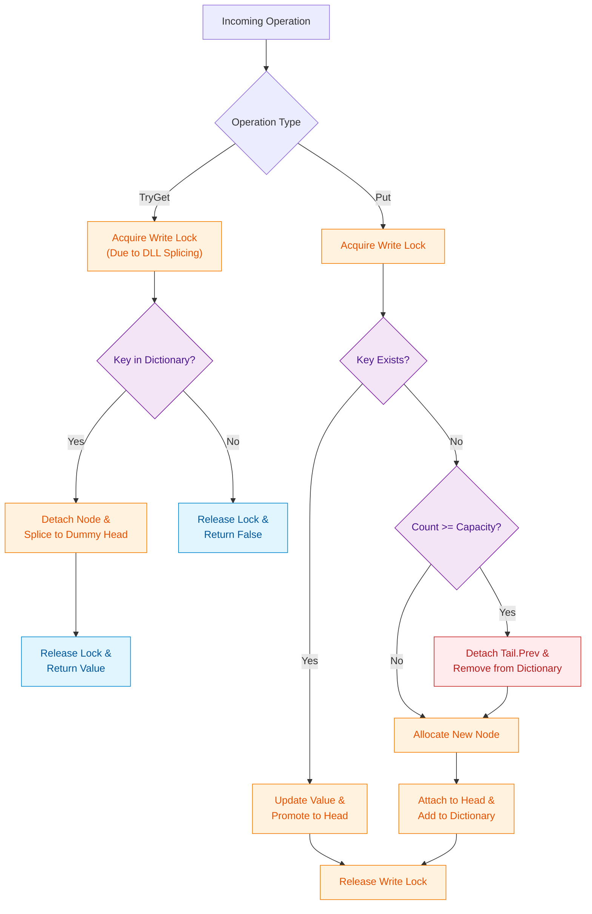
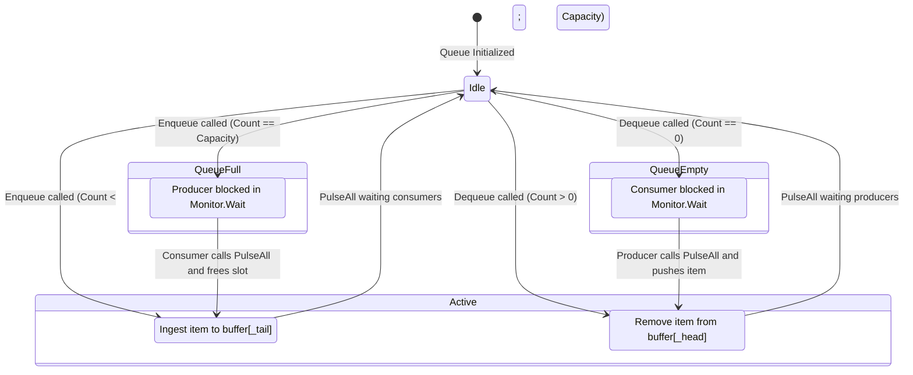

# Phase 26: Thread-Safe Data Structures & Concurrency Bridges

> **Focus:** High-Throughput Thread-Safe LRU Cache, Bounded Blocking Queue (Producer-Consumer), and Burst-Tolerant Token Bucket Rate Limiter.  
> **Target Level:** Senior / Staff Software Engineer (.NET & Polyglot Concurrency)  
> **Core Philosophy:** Bridge the gap between algorithmic data structures (O(1) amortized complexities) and production-grade low-level systems (lock contention, memory fences, deadlocks, spurious wakeups, and race conditions).

---

## 🧭 Concurrency Mechanics Comparison

| Metric / Attribute | Coarse Mutex (`lock` / `Monitor`) | Reader-Writer Lock (`ReaderWriterLockSlim`) | Condition Variable (`Monitor.Wait/Pulse`) | Lock-Free / CAS (`Interlocked`) |
| :--- | :--- | :--- | :--- | :--- |
| **Throughput Model** | Strictly serialized (1 thread at a time) | High read concurrency; exclusive writes | Event-driven thread parking & waking | Maximum hardware parallelism |
| **Context Switching** | Kernel transition upon contention | User-mode spinning then kernel wait | Thread suspended in OS wait-sleep set | Zero thread suspension (hardware bus lock) |
| **Deadlock Risk** | Low (if single monitor) | Moderate (lock inversion, upgrade deadlock) | Moderate (missed pulses if not guarded) | Extremely low (ABA problem if pointer-based) |
| **Primary Use Case** | Small critical sections | Read-heavy in-memory lookups | Bounded buffer, Producer-Consumer | High-throughput atomic counters, rates |

---

## 1. Thread-Safe LRU Cache

### 1.1 Problem Specification & Concurrency Challenge
Design a thread-safe Least Recently Used (LRU) Cache supporting `TryGet(key)` and `Put(key, value)` with strict `O(1)` average time complexity under heavy concurrent reader and writer contention.

#### The "Read-Requires-Write" Dilemma in LRU
In standard caches, reading a value is a non-mutating operation. In an LRU cache, **every read is also a mutation**:
- `TryGet(key)` must promote the accessed node to the Head of the Doubly Linked List (Most Recently Used position).
- If multiple threads attempt to read concurrently while modifying pointers, the doubly linked list pointers (`node.Prev`, `node.Next`) will corrupt instantly without proper synchronization.

```text
[ Concurrent Readers: T1 (Get A), T2 (Get B) ]
                     │
                     ▼
  ┌─────────────────────────────────────────────────────────┐
  │ DUMMY HEAD <---> [ Node A ] <---> [ Node B ] <---> TAIL │
  └─────────────────────────────────────────────────────────┘
        ▲                                    ▲
        │                                    │
   T1 splices A to Head               T2 splices B to Head
   (RACE CONDITION: Pointer cycles, memory leaks, orphaned nodes)
```

### 1.2 Synchronization Strategy: `ReaderWriterLockSlim` vs Coarse `lock`
1. **Coarse `lock`:** Simplest, zero deadlock risk, but bottlenecks under 100+ concurrent threads.
2. **`ReaderWriterLockSlim` with Write Lock on Promotion:** Guarantees absolute consistency while avoiding lock recursion pitfalls.
3. **Striped Segmented LRU (Advanced):** Partition key-space across `K` distinct LRU shards (e.g. `key.GetHashCode() & (K - 1)`). Each shard has its own independent lock, reducing lock contention by a factor of `K`.

### 1.3 State Transition Flow



### 1.4 Production C# Implementation (.NET 8/10)

```csharp
namespace SeniorPractice.Phase11;

/// <summary>
/// Thread-Safe LRU Cache implementing IDisposable.
/// Uses ReaderWriterLockSlim to guarantee deterministic memory safety under concurrent loads.
/// </summary>
public class ThreadSafeLruCache<TKey, TValue> : IDisposable where TKey : notnull
{
    private sealed class Node
    {
        public TKey Key { get; }
        public TValue Value { get; set; }
        public Node? Prev { get; set; }
        public Node? Next { get; set; }

        public Node(TKey key, TValue value)
        {
            Key = key;
            Value = value;
        }
    }

    private readonly int _capacity;
    private readonly Dictionary<TKey, Node> _map;
    private readonly Node _head;
    private readonly Node _tail;
    private readonly ReaderWriterLockSlim _rwLock = new(LockRecursionPolicy.NoRecursion);

    public int Capacity => _capacity;

    public ThreadSafeLruCache(int capacity)
    {
        if (capacity <= 0)
            throw new ArgumentOutOfRangeException(nameof(capacity), "Capacity must be positive.");

        _capacity = capacity;
        _map = new Dictionary<TKey, Node>(capacity);
        _head = new Node(default!, default!);
        _tail = new Node(default!, default!);
        _head.Next = _tail;
        _tail.Prev = _head;
    }

    public int Count
    {
        get
        {
            _rwLock.EnterReadLock();
            try { return _map.Count; }
            finally { _rwLock.ExitReadLock(); }
        }
    }

    public bool TryGet(TKey key, out TValue value)
    {
        _rwLock.EnterWriteLock();
        try
        {
            if (_map.TryGetValue(key, out var node))
            {
                Detach(node);
                AttachToHead(node);
                value = node.Value;
                return true;
            }

            value = default!;
            return false;
        }
        finally
        {
            _rwLock.ExitWriteLock();
        }
    }

    public void Put(TKey key, TValue value)
    {
        _rwLock.EnterWriteLock();
        try
        {
            if (_map.TryGetValue(key, out var existing))
            {
                existing.Value = value;
                Detach(existing);
                AttachToHead(existing);
                return;
            }

            if (_map.Count >= _capacity)
            {
                var lru = _tail.Prev!;
                Detach(lru);
                _map.Remove(lru.Key);
            }

            var newNode = new Node(key, value);
            _map[key] = newNode;
            AttachToHead(newNode);
        }
        finally
        {
            _rwLock.ExitWriteLock();
        }
    }

    private void Detach(Node node)
    {
        node.Prev!.Next = node.Next;
        node.Next!.Prev = node.Prev;
    }

    private void AttachToHead(Node node)
    {
        node.Next = _head.Next;
        node.Prev = _head;
        _head.Next!.Prev = node;
        _head.Next = node;
    }

    public void Dispose()
    {
        _rwLock.Dispose();
        GC.SuppressFinalize(this);
    }
}
```

### 1.5 Idiomatic Python Implementation (3.11+)

```python
import threading
from typing import Generic, TypeVar, Optional

K = TypeVar('K')
V = TypeVar('V')

class Node(Generic[K, V]):
    def __init__(self, key: Optional[K] = None, val: Optional[V] = None):
        self.key = key
        self.val = val
        self.prev: Optional[Node[K, V]] = None
        self.next: Optional[Node[K, V]] = None

class ThreadSafeLruCache(Generic[K, V]):
    """
    Thread-Safe LRU Cache using Reentrant Lock (RLock).
    Guarantees atomic recency updates and bounded capacity under multi-threaded loads.
    """
    def __init__(self, capacity: int):
        if capacity <= 0:
            raise ValueError("Capacity must be positive")
        self.capacity = capacity
        self.map: dict[K, Node[K, V]] = {}
        self.head: Node[K, V] = Node()
        self.tail: Node[K, V] = Node()
        self.head.next = self.tail
        self.tail.prev = self.head
        self.lock = threading.RLock()

    @property
    def count(self) -> int:
        with self.lock:
            return len(self.map)

    def get(self, key: K) -> Optional[V]:
        with self.lock:
            if key not in self.map:
                return None
            node = self.map[key]
            self._detach(node)
            self._attach_head(node)
            return node.val

    def put(self, key: K, val: V) -> None:
        with self.lock:
            if key in self.map:
                existing = self.map[key]
                existing.val = val
                self._detach(existing)
                self._attach_head(existing)
                return

            if len(self.map) >= self.capacity:
                lru = self.tail.prev
                assert lru is not None and lru.key is not None
                self._detach(lru)
                del self.map[lru.key]

            new_node = Node(key, val)
            self.map[key] = new_node
            self._attach_head(new_node)

    def _detach(self, node: Node[K, V]) -> None:
        assert node.prev is not None and node.next is not None
        node.prev.next = node.next
        node.next.prev = node.prev

    def _attach_head(self, node: Node[K, V]) -> None:
        assert self.head.next is not None
        node.next = self.head.next
        node.prev = self.head
        self.head.next.prev = node
        self.head.next = node
```

---

## 2. Bounded Blocking Queue (LeetCode #1188 Pattern)

### 2.1 Problem Specification & Invariants
Implement a thread-safe Bounded Blocking Queue:
- `BoundedBlockingQueue(int capacity)`: Initializes queue with maximum capacity.
- `void Enqueue(T item)`: Adds an item. If the queue is full, the calling thread blocks until space becomes available.
- `T Dequeue()`: Returns and removes the head item. If the queue is empty, the calling thread blocks until an item is available.
- `int Size()`: Returns current element count.

#### The Spurious Wakeup Law
In POSIX and OS threading models, a thread blocked on `Monitor.Wait` or a condition variable can be awakened **without any thread calling signal/pulse** (due to OS kernel signal interrupts or multi-processor races).
- ❌ **Fatal Bug:** `if (_count == _capacity) Monitor.Wait(_lock);`
- ✅ **Defensive Invariant:** `while (_count == _capacity) Monitor.Wait(_lock);`

### 2.2 Circular Ring Buffer Architecture

```text
Capacity = 5
Head = 1 (Dequeue point)
Tail = 4 (Next Enqueue point)
Count = 3

Index:   [ 0 ]   [ 1 ]   [ 2 ]   [ 3 ]   [ 4 ]
Data:    [ - ]   [ A ]   [ B ]   [ C ]   [ - ]
                   ▲                       ▲
                   │                       │
                 _head                   _tail
```

### 2.3 State Machine for Producer-Consumer



### 2.4 Production C# Implementation (.NET 8/10)

```csharp
namespace SeniorPractice.Phase11;

/// <summary>
/// High-Performance Bounded Blocking Queue with Zero GC allocations.
/// Employs a circular array ring buffer and Monitor condition synchronization.
/// Defends against spurious wakeups via rigorous while-loop predicate re-checks.
/// </summary>
public class BoundedBlockingQueue<T>
{
    private readonly T[] _buffer;
    private readonly int _capacity;
    private readonly object _lock = new();
    private int _head;
    private int _tail;
    private int _count;

    public int Capacity => _capacity;

    public BoundedBlockingQueue(int capacity)
    {
        if (capacity <= 0)
            throw new ArgumentOutOfRangeException(nameof(capacity), "Capacity must be positive.");

        _capacity = capacity;
        _buffer = new T[capacity];
        _head = 0;
        _tail = 0;
        _count = 0;
    }

    public void Enqueue(T item)
    {
        lock (_lock)
        {
            // Defend against spurious wakeups
            while (_count == _capacity)
            {
                Monitor.Wait(_lock);
            }

            _buffer[_tail] = item;
            _tail = (_tail + 1) % _capacity;
            _count++;

            // Wake waiting consumers
            Monitor.PulseAll(_lock);
        }
    }

    public T Dequeue()
    {
        lock (_lock)
        {
            // Defend against spurious wakeups
            while (_count == 0)
            {
                Monitor.Wait(_lock);
            }

            T item = _buffer[_head];
            _buffer[_head] = default!; // Clear reference for GC
            _head = (_head + 1) % _capacity;
            _count--;

            // Wake waiting producers
            Monitor.PulseAll(_lock);
            return item;
        }
    }

    public int Size()
    {
        lock (_lock)
        {
            return _count;
        }
    }
}
```

### 2.5 Idiomatic Python Implementation (3.11+)

```python
import threading
from typing import Generic, TypeVar

T = TypeVar('T')

class BoundedBlockingQueue(Generic[T]):
    """
    Bounded Blocking Queue using threading.Condition and a circular array.
    """
    def __init__(self, capacity: int):
        if capacity <= 0:
            raise ValueError("Capacity must be positive")
        self.capacity = capacity
        self.buffer: list[T] = [None] * capacity  # type: ignore
        self.head = 0
        self.tail = 0
        self.count = 0
        self.lock = threading.Lock()
        self.not_full = threading.Condition(self.lock)
        self.not_empty = threading.Condition(self.lock)

    def enqueue(self, item: T) -> None:
        with self.not_full:
            while self.count == self.capacity:
                self.not_full.wait()

            self.buffer[self.tail] = item
            self.tail = (self.tail + 1) % self.capacity
            self.count += 1
            self.not_empty.notify_all()

    def dequeue(self) -> T:
        with self.not_empty:
            while self.count == 0:
                self.not_empty.wait()

            item = self.buffer[self.head]
            self.head = (self.head + 1) % self.capacity
            self.count -= 1
            self.not_full.notify_all()
            return item

    def size(self) -> int:
        with self.lock:
            return self.count
```

---

## 3. High-Throughput Token Bucket Rate Limiter

### 3.1 Problem Specification & Senior Architecture Invariants
Design an in-memory Rate Limiter capable of handling 50,000+ requests per second with burst tolerance.
- **Capacity:** Maximum number of tokens that can accumulate (maximum burst size).
- **Refill Rate:** Tokens added per second continuously.
- **Consumption:** `TryConsume(tokens)` returns `true` if sufficient tokens exist, else `false`.

#### The Background Daemon Anti-Pattern
- ❌ **Naive Anti-Pattern:** Spawning a background thread with `while(true) { Thread.Sleep(100); AddTokens(); }`. This burns CPU cycles, suffers from OS timer jitter (15ms precision on Windows), and introduces thread scheduling contention.
- ✅ **Lazy Replenishment Invariant:** Do not push tokens on a clock. Instead, on every incoming call, compute:
  `tokensToAdd = (now - lastRefillTimestamp) * refillRate`
  Update the timestamp and clamp tokens to `Capacity`. Work occurs only when requests arrive!

### 3.2 Token Flow Dynamics

```text
Refill Stream: +R tokens / second
         │
         ▼
┌─────────────────────────┐
│      TOKEN BUCKET       │
│  [ • • • • • • • • • ]  │ ─── Excess overflow dropped (max = Capacity)
│  Tokens: Min(Cap, N+Δ)  │
└────────────┬────────────┘
             │
      TryConsume(K)
             ▼
     Are Tokens >= K?
     ├── Yes: Tokens -= K, Allow request (HTTP 200)
     └── No:  Tokens unchanged, Deny request (HTTP 429 Too Many Requests)
```

### 3.3 Production C# Implementation (.NET 8/10)

```csharp
namespace SeniorPractice.Phase11;

using System.Diagnostics;

/// <summary>
/// High-Throughput Burst-Tolerant Token Bucket Rate Limiter.
/// Employs lazy time-differential replenishment via Stopwatch.GetTimestamp()
/// ensuring sub-microsecond latency and zero background thread overhead.
/// </summary>
public class TokenBucketRateLimiter
{
    private readonly double _capacity;
    private readonly double _refillRatePerSecond;
    private double _tokens;
    private long _lastRefillTimestampTicks;
    private readonly object _lock = new();

    public double Capacity => _capacity;
    public double RefillRatePerSecond => _refillRatePerSecond;

    public TokenBucketRateLimiter(double capacity, double refillRatePerSecond)
    {
        if (capacity <= 0)
            throw new ArgumentOutOfRangeException(nameof(capacity), "Capacity must be positive.");
        if (refillRatePerSecond <= 0)
            throw new ArgumentOutOfRangeException(nameof(refillRatePerSecond), "Refill rate must be positive.");

        _capacity = capacity;
        _refillRatePerSecond = refillRatePerSecond;
        _tokens = capacity; // Bucket starts filled
        _lastRefillTimestampTicks = Stopwatch.GetTimestamp();
    }

    /// <summary>
    /// Attempts to consume the specified number of tokens.
    /// Thread-safe and non-blocking.
    /// </summary>
    public bool TryConsume(double tokens = 1.0)
    {
        lock (_lock)
        {
            Refill();

            if (_tokens >= tokens)
            {
                _tokens -= tokens;
                return true;
            }

            return false;
        }
    }

    private void Refill()
    {
        long nowTicks = Stopwatch.GetTimestamp();
        double elapsedSeconds = (double)(nowTicks - _lastRefillTimestampTicks) / Stopwatch.Frequency;

        if (elapsedSeconds > 0)
        {
            double newTokens = elapsedSeconds * _refillRatePerSecond;
            _tokens = Math.Min(_capacity, _tokens + newTokens);
            _lastRefillTimestampTicks = nowTicks;
        }
    }
}
```

### 3.4 Idiomatic Python Implementation (3.11+)

```python
import time
import threading

class TokenBucketRateLimiter:
    """
    High-Throughput Token Bucket Rate Limiter using monotonic time and lazy refill.
    """
    def __init__(self, capacity: float, refill_rate_per_second: float):
        if capacity <= 0 or refill_rate_per_second <= 0:
            raise ValueError("Capacity and refill rate must be positive")
        self.capacity = capacity
        self.refill_rate = refill_rate_per_second
        self.tokens = capacity
        self.last_refill = time.monotonic()
        self.lock = threading.Lock()

    def try_consume(self, tokens: float = 1.0) -> bool:
        with self.lock:
            self._refill()
            if self.tokens >= tokens:
                self.tokens -= tokens
                return True
            return False

    def _refill(self) -> None:
        now = time.monotonic()
        elapsed = now - self.last_refill
        if elapsed > 0:
            self.tokens = min(self.capacity, self.tokens + elapsed * self.refill_rate)
            self.last_refill = now
```

---

## 4. Senior Interview Talk Track & Architectural Trade-Offs

When asked these questions in a FAANG Senior/Staff technical interview:

1. **"Why not use `ConcurrentDictionary` for LRU Cache?"**
   - *Senior Answer:* `ConcurrentDictionary` provides thread-safe key-value operations, but it possesses **no concept of ordering or recency**. Combining `ConcurrentDictionary` with a separate doubly linked list still requires synchronizing the two data structures atomically. If a thread updates the dictionary but crashes or gets context-switched before splicing the list, the cache invariants break. Hence, a unified synchronization domain or segmented lock is mandatory.

2. **"How do you eliminate lock contention under millions of requests per second?"**
   - *Senior Answer:* **Lock Striping / Sharding**. Divide the key space into 32 or 64 independent shards using `GetHashCode() & 31`. Each shard maintains its own `ThreadSafeLruCache` with its own lock. Contention is reduced by a factor of 32x.
   - For Rate Limiting: Use distributed Redis token buckets with Lua scripts, or local in-memory token buckets with thread-local batching.

3. **"Why use `Monitor.PulseAll` instead of `Monitor.Pulse` in Bounded Blocking Queue?"**
   - *Senior Answer:* If multiple producers and consumers are waiting on the same lock object, `Pulse` wakes only a single arbitrary thread. If a producer finishes and calls `Pulse`, it might wake another producer instead of a consumer. The awakened producer checks the condition, sees the queue is still full, and goes back to sleep—resulting in **deadlock / lost wakeups**. Calling `PulseAll` ensures both waiting producers and consumers get a chance to make progress.
