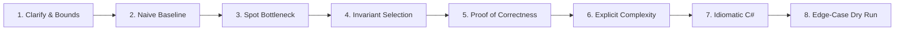

# 🎯 Senior & Lead DSA Solutions Master Index

> **A curated, first-principles algorithmic solution repository for Senior and Lead Software Engineers (.NET / C#).**  
> **Source Curriculum:** [`Senior_dsa_question_list.md`](../Senior_dsa_question_list.md) & [`Top_10_Company_High_ROI_DSA_Curriculum.md`](../Top_10_Company_High_ROI_DSA_Curriculum.md)  
> **Target Level:** Senior / Staff / Lead Software Engineer  
> **Methodology:** Invariant derivation $	o$ Step flow $	o$ Complexity deconstruction $	o$ Production C#

---

## 🏛️ Algorithmic Paradigms & Phase Navigation

The 164 problems are categorized across **11 Algorithmic Paradigms** and organized into **25 Phase Solution Modules**:

| Paradigm | Focus & Core Invariants | Included Phase Guides | Problems |
| :--- | :--- | :--- | :---: |
| **I. Linear & Subarray Scanning** | Complement lookups, opposing/fast-slow boundaries, rolling window validity, prefix differences | [Phase 01: Arrays, Hashing & Frequency](01_Arrays_Hashing_Frequency.md) [Phase 02: Two Pointers](02_Two_Pointers.md) [Phase 03: Sliding Window](03_Sliding_Window.md) [Phase 04: Prefix Sum & Subarray Patterns](04_Prefix_Sum_Subarray.md) [Phase 05: Strings](05_Strings.md) | #1 – #28 |
| **II. Pointer Structures & Monotonicity** | Node manipulation, cycle convergence, nearest smaller/greater boundaries | [Phase 06: Linked Lists](06_Linked_Lists.md) [Phase 07: Stack & Monotonic Stack](07_Stack_Monotonic_Stack.md) | #29 – #40 |
| **III. Search Space Reduction & Heaps** | Monotonic predicate search, bottom-up tree recursion, partial order streams, interval sweep | [Phase 08: Binary Search](08_Binary_Search.md) [Phase 09: Binary Trees](09_Binary_Trees.md) [Phase 10: Heap / Priority Queue](10_Heap_Priority_Queue.md) [Phase 11: Intervals](11_Intervals.md) | #41 – #63 |
| **IV. Graph Exploration & Connectivity** | BFS level snapshots, cycle coloring, shortest path relaxation, disjoint-set path compression | [Phase 12: Graph Traversal](12_Graph_Traversal.md) [Phase 13: Graph Algorithms](13_Graph_Algorithms.md) [Phase 19: Union-Find / Disjoint Set](19_Union_Find_Disjoint_Set.md) | #64 – #74, #102 – #105 |
| **V. Greedy Choice Optimization** | Exchange arguments, max reach envelopes, running deficit resets | [Phase 14: Greedy](14_Greedy.md) | #75 – #78 |
| **VI. Dynamic Programming & State Machines** | Optimal substructure, overlapping subproblems, knapsack directions, finite state machines | [Phase 15: Dynamic Programming Fundamentals](15_Dynamic_Programming_Fundamentals.md) [Phase 16: Advanced Dynamic Programming](16_Advanced_Dynamic_Programming.md) | #79 – #92 |
| **VII. Combinatorial Search & Prefix Trees** | State-space decision trees, backtrack pruning, prefix tree branching | [Phase 17: Backtracking](17_Backtracking.md) [Phase 18: Trie / String Search](18_Trie_String_Search.md) | #93 – #101 |
| **VIII. Senior Multi-Pattern Synthesis** | Monotonic deques, coordinate partitioning, bidirectional search, interval DP | [Phase 20: Advanced / Senior-Level Patterns](20_Advanced_Senior_Patterns.md) | #106 – #115 |
| **IX. System & In-Memory Cache Design** | Dual-map frequency bucketing, LRU sentinels, swap-and-pop $O(1)$ dynamic arrays, bounded TTL queues, lazy stack iterators | [Phase 21: System Design Data Structures](21_System_Design_Data_Structures.md) | #116 – #122 |
| **X. Company Signatures & In-Place Engines** | Columnar BFS coordinate projections, multi-source wavefronts, monotonic range contributions, 4-boundary matrix contractions, token parsers | [Phase 22: Meta Signature Patterns](22_Meta_Signature_Patterns.md) [Phase 23: Amazon, Google & Uber Signatures](23_Amazon_Google_Uber_Signatures.md) [Phase 24: Matrix, Strings, Parsing & In-Place Signatures](24_Matrix_Strings_Parsing_Signatures.md) | #123 – #153 |
| **XI. Scaled Stream Counters & High-Concurrency Systems** | Fixed circular bucket buffers, time-indexed binary search, weighted interval DP, 2-coloring bipartite invariants, card transit aggregators | [Phase 25: Scale, Design and Advanced Signatures](25_Scale_Design_and_Advanced_Signatures.md) | #154 – #164 |

---

## 🧭 Master Phase Directory & Problem Index

| Phase | Topic | Problem Count | Key Anchor Problem | Module Link |
| :---: | :--- | :---: | :--- | :--- |
| **01** | Arrays, Hashing & Frequency | 7 | [Group Anagrams](01_Arrays_Hashing_Frequency.md#4-group-anagrams-leetcode-49) | [`01_Arrays_Hashing_Frequency.md`](01_Arrays_Hashing_Frequency.md) |
| **02** | Two Pointers | 6 | [Trapping Rain Water](02_Two_Pointers.md#13-trapping-rain-water-leetcode-42) | [`02_Two_Pointers.md`](02_Two_Pointers.md) |
| **03** | Sliding Window | 5 | [Minimum Window Substring](03_Sliding_Window.md#18-minimum-window-substring-leetcode-76) | [`03_Sliding_Window.md`](03_Sliding_Window.md) |
| **04** | Prefix Sum & Subarrays | 5 | [Subarray Sum Equals K](04_Prefix_Sum_Subarray.md#21-subarray-sum-equals-k-leetcode-560) | [`04_Prefix_Sum_Subarray.md`](04_Prefix_Sum_Subarray.md) |
| **05** | Strings | 5 | [Longest Palindromic Substring](05_Strings.md#27-longest-palindromic-substring-leetcode-5) | [`05_Strings.md`](05_Strings.md) |
| **06** | Linked Lists | 7 | [Merge K Sorted Lists](06_Linked_Lists.md#34-merge-k-sorted-lists-leetcode-23) | [`06_Linked_Lists.md`](06_Linked_Lists.md) |
| **07** | Stack & Monotonic Stack | 5 | [Largest Rectangle in Histogram](07_Stack_Monotonic_Stack.md#40-largest-rectangle-in-histogram-leetcode-84) | [`07_Stack_Monotonic_Stack.md`](07_Stack_Monotonic_Stack.md) |
| **08** | Binary Search | 7 | [Koko Eating Bananas](08_Binary_Search.md#46-koko-eating-bananas-leetcode-875) | [`08_Binary_Search.md`](08_Binary_Search.md) |
| **09** | Binary Trees & BST | 8 | [Lowest Common Ancestor](09_Binary_Trees.md#54-lowest-common-ancestor-of-a-binary-tree-leetcode-236) | [`09_Binary_Trees.md`](09_Binary_Trees.md) |
| **10** | Heap / Priority Queue | 4 | [Find Median from Data Stream](10_Heap_Priority_Queue.md#59-find-median-from-data-stream-leetcode-295) | [`10_Heap_Priority_Queue.md`](10_Heap_Priority_Queue.md) |
| **11** | Intervals | 4 | [Meeting Rooms II](11_Intervals.md#63-meeting-rooms-ii-leetcode-253) | [`11_Intervals.md`](11_Intervals.md) |
| **12** | Graph Traversal | 6 | [Course Schedule](12_Graph_Traversal.md#68-course-schedule-leetcode-207) | [`12_Graph_Traversal.md`](12_Graph_Traversal.md) |
| **13** | Graph Algorithms | 5 | [Network Delay Time](13_Graph_Algorithms.md#70-network-delay-time-leetcode-743) | [`13_Graph_Algorithms.md`](13_Graph_Algorithms.md) |
| **14** | Greedy | 4 | [Gas Station](14_Greedy.md#76-gas-station-leetcode-134) | [`14_Greedy.md`](14_Greedy.md) |
| **15** | Dynamic Programming I | 7 | [Coin Change](15_Dynamic_Programming_Fundamentals.md#81-coin-change-leetcode-322) | [`15_Dynamic_Programming_Fundamentals.md`](15_Dynamic_Programming_Fundamentals.md) |
| **16** | Dynamic Programming II | 7 | [Edit Distance](16_Advanced_Dynamic_Programming.md#89-edit-distance-leetcode-72) | [`16_Advanced_Dynamic_Programming.md`](16_Advanced_Dynamic_Programming.md) |
| **17** | Backtracking | 6 | [N-Queens](17_Backtracking.md#98-n-queens-leetcode-51) | [`17_Backtracking.md`](17_Backtracking.md) |
| **18** | Trie / Prefix Trees | 3 | [Word Search II](18_Trie_String_Search.md#101-word-search-ii-leetcode-212) | [`18_Trie_String_Search.md`](18_Trie_String_Search.md) |
| **19** | Union-Find / Disjoint Set | 4 | [Accounts Merge](19_Union_Find_Disjoint_Set.md#104-accounts-merge-leetcode-721) | [`19_Union_Find_Disjoint_Set.md`](19_Union_Find_Disjoint_Set.md) |
| **20** | Advanced Senior Patterns | 10 | [Sliding Window Maximum](20_Advanced_Senior_Patterns.md#106-sliding-window-maximum-leetcode-239) | [`20_Advanced_Senior_Patterns.md`](20_Advanced_Senior_Patterns.md) |
| **21** | System Design Data Structures | 7 | [LRU Cache](21_System_Design_Data_Structures.md#116-lru-cache-leetcode-146) | [`21_System_Design_Data_Structures.md`](21_System_Design_Data_Structures.md) |
| **22** | Meta Signature Patterns | 10 | [Binary Tree Vertical Order](22_Meta_Signature_Patterns.md#123-binary-tree-vertical-order-traversal-leetcode-314) | [`22_Meta_Signature_Patterns.md`](22_Meta_Signature_Patterns.md) |
| **23** | Amazon, Google & Uber Signatures | 9 | [Rotting Oranges](23_Amazon_Google_Uber_Signatures.md#133-rotting-oranges-leetcode-994) | [`23_Amazon_Google_Uber_Signatures.md`](23_Amazon_Google_Uber_Signatures.md) |
| **24** | Matrix, Strings, Parsing & In-Place | 12 | [Spiral Matrix](24_Matrix_Strings_Parsing_Signatures.md#142-spiral-matrix-leetcode-54) | [`24_Matrix_Strings_Parsing_Signatures.md`](24_Matrix_Strings_Parsing_Signatures.md) |
| **25** | Scale, Design & Advanced Signatures | 11 | [Design Hit Counter](25_Scale_Design_and_Advanced_Signatures.md#155-design-hit-counter-leetcode-362) | [`25_Scale_Design_and_Advanced_Signatures.md`](25_Scale_Design_and_Advanced_Signatures.md) |

---

## 🛠️ Senior Interview Execution Protocol

Every problem solution in this repository strictly adheres to the **Senior / Lead 8-Step Delivery Framework**:

1. **Clarify Inputs & Boundaries:** Establish $N$, values, constraints, nullability, and memory budgets.
2. **Formulate Naive Baseline:** Articulate the brute-force time/space to ground the discussion.
3. **Identify Bottleneck:** Point out repeated scanning, duplicated calculations, or unnecessary state exploration.
4. **Select Algorithmic Invariant:** Name the exact invariant and data structure.
5. **Prove Correctness Before Coding:** Explain why discarding candidates preserves the optimal solution and why termination is guaranteed.
6. **Explicit Complexity Dimensions:** Always distinguish **Time**, **Auxiliary Space** (working memory), and **Output Space** (returned structure).
7. **Production C# Implementation:** Use modern C# idioms (.NET 8/9, `PriorityQueue`, `Span<T>`, guard clauses, overflow-safe arithmetic `left + (right - left) / 2`).
8. **Systematic Dry Run:** Trace edge cases (empty, single-element, all duplicates, negative numbers, extreme values).

---

## 💡 Quick Invariant Trigger Reference

| Problem Cue / Symptom | Algorithmic Pattern | Governing Invariant | Primary Data Structure |
| :--- | :--- | :--- | :--- |
| Find pair summing to target | Hash Map | $nums[i] + \text{complement} = \text{target}$ | `Dictionary<int, int>` |
| Group strings by character equivalence | Canonical Representation | Anagrams map to identical frequency signature | `Dictionary<string, List<string>>` |
| Sorted pair/triplet conditions | Opposing Two Pointers | Moving outer pointer strictly increases/decreases sum | `left`, `right` indices |
| Trapped water between walls | Boundary Invariant | Water depends on $\min(\text{leftMax}, \text{rightMax})$ | Two pointers tracking maxes |
| Longest/shortest valid contiguous subarray | Sliding Window | Expand $R$; restore validity by shrinking $L$ | `left`, `right` pointers + counts |
| Count subarrays summing to $K$ | Prefix Sum + Map | $P[j] - P[i-1] = K \iff P[i-1] = P[j] - K$ | `Dictionary<int, int>` counts |
| Reversal / Mid / Cycle in linked list | Fast/Slow & 3-Pointer | Slow moves 1, Fast moves 2; $prev, curr, next$ | Sentinel dummy node |
| Nearest greater or smaller element | Monotonic Stack | Monotonic strictly increasing/decreasing indices | `Stack<int>` |
| Min / Max in sliding window of size $K$ | Monotonic Queue | Queue front holds current window extremum | `LinkedList<int>` / Deque |
| Minimize maximum over monotonic range | Binary Search on Answer | Feasibility predicate $P(x)$ is monotonic in $x$ | Binary search $[low, high]$ |
| Subtree computes metrics for parent | Bottom-up Tree DFS | Subtree returns state; global max updated by ref | Post-order traversal |
| Continuous median in stream | Two Balanced Heaps | $\text{MaxHeap} \le \text{median} \le \text{MinHeap}$; $\Delta \text{size} \le 1$ | Two `PriorityQueue` instances |
| Resource overlap / concurrency count | Interval Sweep / Heap | Active intervals tracked by earliest end time | Sort by start + Min-Heap |
| Dependency ordering / Cycle in DAG | Topological Sort | Process nodes with in-degree 0; track count | Kahn's algorithm queue |
| Dynamic connectivity / Cycles in graph | Disjoint Set Union (DSU) | Connected if $\text{Find}(u) == \text{Find}(v)$ | Parent array + rank |
| Shortest path with non-negative weights | Dijkstra's Algorithm | Always relax edge with minimum known distance | `PriorityQueue<int, int>` |
| Unbounded / 0-1 Knapsack | Tabulation DP | Subproblem recurrence over capacity | 1D / 2D DP array |
| State-space combinatorial generation | Backtracking + Pruning | Choose $\to$ Recurse $\to$ Undo; prune early | Recursion + state stack |
| $O(1)$ cache recency eviction | Hash Map + DLL | Recency updated on hit; detach and splice to MRU head | `Dictionary<K, DNode>` + Doubly Linked List |
| $O(1)$ uniform random sampling with deletions | Dense Array + Map | Swap target element with array tail, pop tail | `List<T>` + `Dictionary<T, int>` |
| Frequency eviction with LRU tie-break | Dual Map + DLL Buckets | Keys partitioned by frequency; minimum frequency tracked | `Dictionary<int, DLL>` + `minFreq` scalar |
| Sliding window timestamp rate limit | Monotonic Deque / TTL Queue | Evict entries older than $t - W$; count active window | `Queue<(int, string)>` + `HashSet` |
| Hierarchical nested structure iteration | Enumerator Stack | Top of stack holds deepest active iterator; drill to integer | `Stack<IEnumerator<T>>` |
| Matrix boundary perimeter traversal | 4-Pointer Contraction | Progress `top`, `bottom`, `left`, `right`; contract after sweep | Boundary coordinates |
| Arithmetic expression with precedence | Operator Precedence Stack | Immediate evaluate `*` and `/`; delay `+` and `-` on stack | `Stack<int>` or accumulator scalars |
| Subarray sum of all ranges | Contribution Counting | Total range sum = $\sum \max - \sum \min$ using monotonic spans | Two monotonic stacks |
| Sliding 300s window hit aggregation | Circular Bucket Array | Modulo timestamp indexing; overwrite expired epoch buckets | Parallel `int[]` times & counts |
| Point-in-time key lookup | Time-Indexed Binary Search | Exact match or floor timestamp via rightmost binary search | `Dictionary<K, List<(int, V)>>` |
| Variable ratio transitivity | Directed Graph Evaluation | Currency conversion path product; graph BFS or weighted DSU | Adjacency `Dictionary<K, List<(K, double)>>` |
| Longest path in DAG grid | Memoized DFS / Topological Sort | Strict monotonic ascent guarantees DAG acyclicity | 2D memo table `int[,]` |
| Non-overlapping weighted intervals | Sort by End + DP + Binary Search | Optimal prefix at $t$ either skips job or includes + precedes | Sorted array + 1D DP table |
| Next lexicographical permutation | Suffix Monotonic Inversion | Find first drop from right, swap with ceiling, reverse suffix | In-place array two-pointer scan |
| Multi-calendar mutual free time | Interval Sweep-Line / K-Way Heap | Merge all busy intervals; identify gaps between merged ends | `PriorityQueue<Interval, int>` |
| 2-Colorable conflict detection | Parity Graph BFS / DFS | Alternate adjacent vertex colors; detect same-color edge | Color array `int[]` {-1, 0, 1} |
| Valid delivery order sequences | Permutation Combinatorics | Place $P_i$ and $D_i$ in $2n-1$ slots: $P(n) = P(n-1) \times \frac{2n(2n-1)}{2}$ | Modular arithmetic |
| Origin-destination transit averages | Dual Hash Map Aggregator | Card ID check-in table + Route `(totalTime, trips)` statistics | Two `Dictionary` instances |

