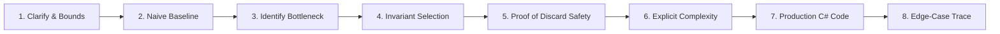

# 🏢 Top 10 Product Companies: High-ROI DSA Interview Curriculum

> **Target Level:** Senior / Staff / Lead Software Engineer (.NET / C# / Polyglot)  
> **Core Philosophy:** Invariant Derivation $\to$ Pattern Recognition $\to$ Production Code $\to$ Defensive Verification.  
> **Source Solutions Repository:** [`Senior_problem_solution/`](Senior_problem_solution/README.md) (153 Comprehensive 8-Step Problem Solutions).  
> **Curriculum Purpose:** Maximize interview ROI across the top 10 tech companies by mastering high-frequency patterns, identifying company-specific archetypes, and executing bug-free solutions under time constraints.  
> **🚀 Expanded Edition Available:** See [`Top_20_Company_High_ROI_DSA_Curriculum.md`](Top_20_Company_High_ROI_DSA_Curriculum.md) for the expanded curriculum covering all 20 Tier-1 Product Companies (adding Salesforce, Adobe, Bloomberg, Airbnb, DoorDash, Snowflake, Databricks, Palantir, Atlassian, Pinterest) and 164 total solutions.

---

## 🧭 Table of Contents

1. [🏛️ Part I: Executive Strategy & Cross-Company Pattern Heatmap](#-part-i-executive-strategy--cross-company-pattern-heatmap)
   - [Cross-Company Algorithmic Pattern Distribution](#cross-company-algorithmic-pattern-distribution)
   - [Company Hiring Bar & Evaluation Dimensions](#company-hiring-bar--evaluation-dimensions)
2. [🏢 Part II: Company-by-Company High-ROI Curricula](#-part-ii-company-by-company-high-roi-curricula)
   - [1. Google (Alphabet)](#1-google-alphabet)
   - [2. Meta (Facebook)](#2-meta-facebook)
   - [3. Amazon](#3-amazon)
   - [4. Microsoft](#4-microsoft)
   - [5. Apple](#5-apple)
   - [6. Netflix](#6-netflix)
   - [7. Uber](#7-uber)
   - [8. Stripe](#8-stripe)
   - [9. ByteDance (TikTok)](#9-bytedance-tiktok)
   - [10. LinkedIn](#10-linkedin)
3. [⚡ Part III: 48-Hour Rapid Revision Playbook & Senior Delivery Framework](#-part-iii-48-hour-rapid-revision-playbook--senior-delivery-framework)

---

## 🏛️ Part I: Executive Strategy & Cross-Company Pattern Heatmap

Different product tech companies evaluate algorithmic competence through vastly different lenses. While LeetCode contains 3,000+ problems, **over 85% of interview questions at Tier-1 companies derive from just 10 foundational invariants**.

### Cross-Company Algorithmic Pattern Distribution

| Company | Arrays & 2-Pointers | Sliding Window | Monotonic Stack/Deque | Trees & LCA | Graph BFS/DFS/Dijkstra | Dynamic Programming | Heap / Streaming | Intervals & Sweep | System Cache Design | String & Expression Parsing |
| :--- | :---: | :---: | :---: | :---: | :---: | :---: | :---: | :---: | :---: | :---: |
| **Google** | 🟢 Moderate | 🟡 High | 🔴 Essential | 🔴 Essential | 🔴 Essential | 🔴 Essential | 🟡 High | 🟡 High | 🟢 Moderate | 🟡 High |
| **Meta** | 🔴 Essential | 🔴 Essential | 🟡 High | 🔴 Essential | 🟡 High | 🟢 Moderate | 🟡 High | 🟢 Moderate | 🟢 Moderate | 🔴 Essential |
| **Amazon** | 🟡 High | 🟡 High | 🔴 Essential | 🟡 High | 🔴 Essential | 🟢 Moderate | 🔴 Essential | 🔴 Essential | 🔴 Essential | 🟢 Moderate |
| **Microsoft** | 🔴 Essential | 🟡 High | 🟢 Moderate | 🔴 Essential | 🟡 High | 🟡 High | 🟢 Moderate | 🟡 High | 🟡 High | 🔴 Essential |
| **Apple** | 🔴 Essential | 🟡 High | 🟡 High | 🟡 High | 🟢 Moderate | 🟢 Moderate | 🟢 Moderate | 🟢 Moderate | 🔴 Essential | 🔴 Essential |
| **Netflix** | 🟡 High | 🔴 Essential | 🔴 Essential | 🟡 High | 🟢 Moderate | 🟡 High | 🔴 Essential | 🔴 Essential | 🔴 Essential | 🟢 Moderate |
| **Uber** | 🟡 High | 🟢 Moderate | 🟢 Moderate | 🟢 Moderate | 🔴 Essential | 🟡 High | 🟡 High | 🔴 Essential | 🔴 Essential | 🟢 Moderate |
| **Stripe** | 🟡 High | 🟡 High | 🟢 Moderate | 🟢 Moderate | 🟡 High | 🟢 Moderate | 🟢 Moderate | 🟡 High | 🔴 Essential | 🔴 Essential |
| **ByteDance** | 🔴 Essential | 🔴 Essential | 🔴 Essential | 🔴 Essential | 🟡 High | 🔴 Essential | 🟡 High | 🟡 High | 🟡 High | 🟢 Moderate |
| **LinkedIn** | 🟡 High | 🟡 High | 🟢 Moderate | 🔴 Essential | 🔴 Essential | 🟡 High | 🟢 Moderate | 🟢 Moderate | 🔴 Essential | 🟡 High |

> **Legend:** 🔴 **Essential** (Tested in ~40%+ of loops) | 🟡 **High** (Tested in ~20-35% of loops) | 🟢 **Moderate** (Occasional or team-specific).

### Company Hiring Bar & Evaluation Dimensions

| Company | Speed Expectation | Algorithmic Depth | Code Cleanliness / Idioms | Follow-Up / Scalability Weight | Behavioral / Leadership Weight |
| :--- | :--- | :--- | :--- | :--- | :--- |
| **Google** | 1 Medium/Hard in 40 min | Extreme (Proof, custom bounds) | High (Clean abstractions) | Extreme (Streaming, infinite bounds) | Moderate (Googlyness & Leadership) |
| **Meta** | 2 Mediums in 40 min | Moderate to High (Standard variants) | Extreme (Zero compiler, bug-free) | Moderate (Scale & memory bounds) | Low to Moderate |
| **Amazon** | 1-2 Mediums in 30 min | Moderate (Emphasis on data structures) | High (Defensive checks) | High (Edge cases, volume bounds) | Extreme (16 Leadership Principles) |
| **Microsoft** | 1-2 Mediums in 35 min | Moderate (Core CS foundations) | High (Readable, OOP friendly) | Moderate (Memory, garbage collection) | Moderate (Growth Mindset) |
| **Apple** | 1 Medium/Hard in 45 min | High (Systems, memory, pointers) | High (C# / C++ efficiency, allocations) | High (Cache locality, thread safety) | Moderate (Team-specific culture) |
| **Netflix** | 1 Hard / Complex in 45 min | Extreme (Concurrency, caching, streaming) | Extreme (Senior/Staff production code) | Extreme (Real-world distributed failures) | High (Culture memo alignment) |
| **Uber** | 1-2 Mediums in 45 min | High (Shortest path, Graph BFS) | High (Clean graph representations) | High (Geospatial scale, latency budgets) | Moderate (Uber values & ownership) |
| **Stripe** | 1 Multi-Part in 45 min | Practical / Applied (Parsers, state machines) | Extreme (Compilable, unit tests pass) | Extreme (Backward compatibility, idempotency)| Moderate (Operating principles) |
| **ByteDance** | 2 Hard/Medium in 40 min | Extreme (Complex DP, Monotonic Deques) | High (Algorithmic fluency under pressure) | Moderate (Time/space complexity proofs) | Low to Moderate |
| **LinkedIn** | 1-2 Mediums in 45 min | High (Nested iterators, inverted indices) | High (Clean OOP, interfaces, separation) | High (Search scale, index latency) | Moderate (Culture & craftsmanship) |

---

## 🏢 Part II: Company-by-Company High-ROI Curricula

### 1. Google (Alphabet)

> **Archetype:** *Scale, Invariant Rigor, Graph Traversal & Algorithmic Generalization*  
> **Hiring Bar:** Heavy emphasis on proving correctness before coding. Google rarely asks direct LeetCode clones; instead, they alter problem constraints (streaming input, implicit graph expansion, dynamic edge weights, ultra-scale bounds). You must articulate $O(1)$ space proofs or asymptotic trade-offs fluently.  
> **Interview Structure:** 1 Phone Screen (45 min) + 4-5 Onsite Technical Loops (including 1 System Design / Architecture round for Senior+).

#### 🎯 Core High-ROI Question Roster

| # | Problem Title | Difficulty | Priority | Pattern & Invariant Tags | Status | Solution Link |
| :---: | :--- | :---: | :---: | :--- | :---: | :--- |
| 1 | Trapping Rain Water (LC #42) | 🔴 Hard | 👑 Lead Anchor | `#two-pointers` `#boundary-invariant` | ⭐ Covered in Curriculum | [Trapping Rain Water](Senior_problem_solution/20_Advanced_Senior_Patterns.md#109-trapping-rain-water-leetcode-42) |
| 2 | Word Ladder (LC #127) | 🔴 Hard | 👑 Lead Anchor | `#graph` `#bfs` `#shortest-path` | ⭐ Covered in Curriculum | [Word Ladder](Senior_problem_solution/20_Advanced_Senior_Patterns.md#110-word-ladder-leetcode-127) |
| 3 | Meeting Rooms II (LC #253) | 🟡 Medium | ⭐ Core | `#intervals` `#min-heap` `#sweep-line` | ⭐ Covered in Curriculum | [Meeting Rooms II](Senior_problem_solution/11_Intervals.md#63-meeting-rooms-ii-leetcode-253) |
| 4 | Serialize and Deserialize Binary Tree (LC #297) | 🔴 Hard | 👑 Lead Anchor | `#tree` `#bfs` `#dfs` `#serialization` | ⭐ Covered in Curriculum | [Serialize and Deserialize Binary Tree](Senior_problem_solution/20_Advanced_Senior_Patterns.md#115-serialize-and-deserialize-binary-tree-leetcode-297) |
| 5 | Largest Rectangle in Histogram (LC #84) | 🔴 Hard | 👑 Lead Anchor | `#monotonic-stack` `#nearest-smaller` | ⭐ Covered in Curriculum | [Largest Rectangle in Histogram](Senior_problem_solution/20_Advanced_Senior_Patterns.md#108-largest-rectangle-in-histogram-leetcode-84) |
| 6 | Swim in Rising Water (LC #778) | 🔴 Hard | 👑 Lead Anchor | `#graph` `#dijkstra` `#binary-search` | ⭐ Covered in Curriculum | [Swim in Rising Water](Senior_problem_solution/20_Advanced_Senior_Patterns.md#111-swim-in-rising-water-leetcode-778) |
| 7 | Number of Islands (LC #200) | 🟡 Medium | ⭐ Core | `#graph` `#bfs` `#dfs` `#grid-sinking` | ⭐ Covered in Curriculum | [Number of Islands](Senior_problem_solution/12_Graph_Traversal.md#64-number-of-islands-leetcode-200) |
| 8 | Network Delay Time (LC #743) | 🟡 Medium | ⭐ Core | `#graph` `#dijkstra` `#min-heap` | ⭐ Covered in Curriculum | [Network Delay Time](Senior_problem_solution/13_Graph_Algorithms.md#70-network-delay-time-leetcode-743) |
| 9 | Split Array Largest Sum (LC #410) | 🔴 Hard | 👑 Lead Anchor | `#binary-search-on-answer` `#greedy` `#partitioning` | 🆕 New Signature Solution | [Split Array Largest Sum](Senior_problem_solution/23_Amazon_Google_Uber_Signatures.md#134-split-array-largest-sum-leetcode-410) |
| 10 | Decode String (LC #394) | 🟡 Medium | 🔥 High Value | `#stack` `#string` `#recursion` `#parser` | 🆕 New Signature Solution | [Decode String](Senior_problem_solution/23_Amazon_Google_Uber_Signatures.md#135-decode-string-leetcode-394) |
| 11 | Bus Routes (LC #815) | 🔴 Hard | 👑 Lead Anchor | `#graph` `#bfs` `#bipartite-graph` `#shortest-path` | 🆕 New Signature Solution | [Bus Routes](Senior_problem_solution/23_Amazon_Google_Uber_Signatures.md#136-bus-routes-leetcode-815) |
| 12 | Step-By-Step Directions From a Binary Tree Node to Another (LC #2096) | 🟡 Medium | 🔥 High Value | `#tree` `#lca` `#dfs` `#path-construction` | 🆕 New Signature Solution | [Step-By-Step Directions From a Binary Tree Node to Another](Senior_problem_solution/23_Amazon_Google_Uber_Signatures.md#137-step-by-step-directions-from-a-binary-tree-node-to-another-leetcode-2096) |
| 13 | Logger Rate Limiter (LC #359) | 🟢 Easy | 🔥 High Value | `#design` `#hash-map` `#sliding-window-timestamp` | 🆕 New Signature Solution | [Logger Rate Limiter](Senior_problem_solution/21_System_Design_Data_Structures.md#119-logger-rate-limiter-leetcode-359) |
| 14 | LRU Cache (LC #146) | 🟡 Medium | 🔥 High Value | `#design` `#hash-map` `#doubly-linked-list` | 🆕 New Signature Solution | [LRU Cache](Senior_problem_solution/21_System_Design_Data_Structures.md#116-lru-cache-leetcode-146) |

#### 💡 Signature Company Invariants & Defense Checklist
- **Implicit Graph Modeling:** In Bus Routes (#136) and Word Ladder (#110), do not build an $N \times N$ dense adjacency matrix. Model stops $\leftrightarrow$ routes as a bipartite graph or use wildcard buckets to keep edge relaxation bounded.
- **Binary Search on Monotonic Predicates:** In Split Array Largest Sum (#134), recognize that feasibility $P(\text{maxSum})$ is monotonically non-increasing. Binary search over $[\max(nums), \sum nums]$ with a greedy partition predicate.
- **LCA Path Splicing:** In Step-By-Step Directions (#137), avoid separate path traversals from root. Find the LCA first, then string prefix pruning eliminates redundant ancestor branches directly.

---

### 2. Meta (Facebook)

> **Archetype:** *Speed, Flawless Bug-Free Execution, Trees, String & Two-Pointer Invariants*  
> **Hiring Bar:** Meta tests extreme coding velocity: 2 Medium problems (or 1 Hard + 1 Medium) in 45 minutes on CoderPad with **zero compiler execution**. You must dry-run edge cases manually. Top categories: Binary Trees (Vertical, LCA), Strings (abbreviations, palindromes, parentheses), and Two Pointers.  
> **Interview Structure:** 1 Technical Screen (45 min) + 2 Coding Loops (45 min each) + 1 System Design (or Product Architecture) + 1 Behavioral.

#### 🎯 Core High-ROI Question Roster

| # | Problem Title | Difficulty | Priority | Pattern & Invariant Tags | Status | Solution Link |
| :---: | :--- | :---: | :---: | :--- | :---: | :--- |
| 1 | Subarray Sum Equals K (LC #560) | 🟡 Medium | ⭐ Core | `#prefix-sum` `#hash-map` | ⭐ Covered in Curriculum | [Subarray Sum Equals K](Senior_problem_solution/04_Prefix_Sum_Subarray.md#21-subarray-sum-equals-k-leetcode-560) |
| 2 | Lowest Common Ancestor of a Binary Tree (LC #236) | 🟡 Medium | ⭐ Core | `#tree` `#dfs` `#post-order` `#lca` | ⭐ Covered in Curriculum | [Lowest Common Ancestor of a Binary Tree](Senior_problem_solution/09_Binary_Trees.md#54-lowest-common-ancestor-of-a-binary-tree-leetcode-236) |
| 3 | 3Sum (LC #15) | 🟡 Medium | ⭐ Core | `#two-pointers` `#sorting` `#dedup` | ⭐ Covered in Curriculum | [3Sum](Senior_problem_solution/02_Two_Pointers.md#11-3sum-leetcode-15) |
| 4 | Minimum Window Substring (LC #76) | 🔴 Hard | 👑 Lead Anchor | `#sliding-window` `#match-counter` | ⭐ Covered in Curriculum | [Minimum Window Substring](Senior_problem_solution/03_Sliding_Window.md#18-minimum-window-substring-leetcode-76) |
| 5 | Kth Largest Element in an Array (LC #215) | 🟡 Medium | ⭐ Core | `#heap` `#quickselect` `#kth-element` | ⭐ Covered in Curriculum | [Kth Largest Element in an Array](Senior_problem_solution/10_Heap_Priority_Queue.md#56-kth-largest-element-in-an-array-leetcode-215) |
| 6 | Valid Palindrome (LC #125) | 🟢 Easy | ⭐ Core | `#two-pointers` `#string` | ⭐ Covered in Curriculum | [Valid Palindrome](Senior_problem_solution/02_Two_Pointers.md#8-valid-palindrome-leetcode-125) |
| 7 | Binary Tree Vertical Order Traversal (LC #314) | 🟡 Medium | 🔥 High Value | `#tree` `#bfs` `#hash-map` `#column-indexing` | 🆕 New Signature Solution | [Binary Tree Vertical Order Traversal](Senior_problem_solution/22_Meta_Signature_Patterns.md#123-binary-tree-vertical-order-traversal-leetcode-314) |
| 8 | Minimum Remove to Make Valid Parentheses (LC #1249) | 🟡 Medium | 🔥 High Value | `#stack` `#string` `#balance-invariant` | 🆕 New Signature Solution | [Minimum Remove to Make Valid Parentheses](Senior_problem_solution/22_Meta_Signature_Patterns.md#124-minimum-remove-to-make-valid-parentheses-leetcode-1249) |
| 9 | Valid Word Abbreviation (LC #408) | 🟢 Easy | 🔥 High Value | `#two-pointers` `#string` `#pointer-arithmetic` | 🆕 New Signature Solution | [Valid Word Abbreviation](Senior_problem_solution/22_Meta_Signature_Patterns.md#125-valid-word-abbreviation-leetcode-408) |
| 10 | Valid Palindrome II (LC #680) | 🟢 Easy | 🔥 High Value | `#two-pointers` `#greedy` `#single-deletion` | 🆕 New Signature Solution | [Valid Palindrome II](Senior_problem_solution/22_Meta_Signature_Patterns.md#126-valid-palindrome-ii-leetcode-680) |
| 11 | Buildings With an Ocean View (LC #1762) | 🟡 Medium | 🔥 High Value | `#monotonic-stack` `#right-to-left` `#running-max` | 🆕 New Signature Solution | [Buildings With an Ocean View](Senior_problem_solution/22_Meta_Signature_Patterns.md#127-buildings-with-an-ocean-view-leetcode-1762) |
| 12 | Random Pick with Weight (LC #528) | 🟡 Medium | 🔥 High Value | `#prefix-sum` `#binary-search` `#probability` | 🆕 New Signature Solution | [Random Pick with Weight](Senior_problem_solution/22_Meta_Signature_Patterns.md#128-random-pick-with-weight-leetcode-528) |
| 13 | Dot Product of Two Sparse Vectors (LC #1570) | 🟡 Medium | 🔥 High Value | `#two-pointers` `#hash-map` `#array` `#sparse-matrix` | 🆕 New Signature Solution | [Dot Product of Two Sparse Vectors](Senior_problem_solution/22_Meta_Signature_Patterns.md#129-dot-product-of-two-sparse-vectors-leetcode-1570) |
| 14 | Lowest Common Ancestor of a Binary Tree III (LC #1650) | 🟡 Medium | 🔥 High Value | `#tree` `#two-pointers` `#linked-list-cycle-analogy` | 🆕 New Signature Solution | [Lowest Common Ancestor of a Binary Tree III](Senior_problem_solution/22_Meta_Signature_Patterns.md#130-lowest-common-ancestor-of-a-binary-tree-iii-leetcode-1650) |
| 15 | Merge Sorted Array (LC #88) | 🟢 Easy | 🔥 High Value | `#two-pointers` `#three-pointers` `#backward-fill` | 🆕 New Signature Solution | [Merge Sorted Array](Senior_problem_solution/22_Meta_Signature_Patterns.md#132-merge-sorted-array-leetcode-88) |

#### 💡 Signature Company Invariants & Defense Checklist
- **BFS Column Coordinates for Vertical Order:** In Vertical Order Traversal (#123), maintaining min/max column bounds alongside BFS queue guarantees top-to-bottom and left-to-right order without sorting coordinates.
- **Two-Pass Balanced Parentheses Filter:** In Minimum Remove (#1249), balance counter removes excess closing brackets left-to-right, then right-to-left scan removes leftover unmatched opening brackets.
- **Parent-Pointer LCA as Linked List Intersection:** In LCA III (#130), node-to-parent pointers reduce LCA to finding the intersection of two linked lists (Floyd's pointer swap technique) in $O(H)$ time and $O(1)$ space.

---

### 3. Amazon

> **Archetype:** *Heaps/Priority Queues, Grid BFS, Monotonic Stack Contributions & Object-Oriented Design*  
> **Hiring Bar:** Every interview loop blends 20-25 minutes of Leadership Principles (Customer Obsession, Ownership, Bias for Action, Dive Deep) with 25-30 minutes of DSA. Amazon heavily tests Heaps (Top-K, Streaming Median), Multi-Source Grid BFS (Rotting Oranges), and Cache/Trie Systems.  
> **Interview Structure:** 1 Online Assessment (OA2: 2 coding questions + work style) + 1 Tech Phone Screen + 4-5 Loop Rounds (Coding, System Design, Bar Raiser).

#### 🎯 Core High-ROI Question Roster

| # | Problem Title | Difficulty | Priority | Pattern & Invariant Tags | Status | Solution Link |
| :---: | :--- | :---: | :---: | :--- | :---: | :--- |
| 1 | LRU Cache (LC #146) | 🟡 Medium | 🔥 High Value | `#design` `#hash-map` `#doubly-linked-list` | 🆕 New Signature Solution | [LRU Cache](Senior_problem_solution/21_System_Design_Data_Structures.md#116-lru-cache-leetcode-146) |
| 2 | Rotting Oranges (LC #994) | 🟡 Medium | 🔥 High Value | `#graph` `#multi-source-bfs` `#matrix` `#layer-timing` | 🆕 New Signature Solution | [Rotting Oranges](Senior_problem_solution/23_Amazon_Google_Uber_Signatures.md#133-rotting-oranges-leetcode-994) |
| 3 | Number of Islands (LC #200) | 🟡 Medium | ⭐ Core | `#graph` `#bfs` `#dfs` `#grid-sinking` | ⭐ Covered in Curriculum | [Number of Islands](Senior_problem_solution/12_Graph_Traversal.md#64-number-of-islands-leetcode-200) |
| 4 | Merge K Sorted Lists (LC #23) | 🔴 Hard | 👑 Lead Anchor | `#heap` `#priority-queue` `#k-way-merge` | ⭐ Covered in Curriculum | [Merge K Sorted Lists](Senior_problem_solution/06_Linked_Lists.md#34-merge-k-sorted-lists-leetcode-23) |
| 5 | Find Median from Data Stream (LC #295) | 🔴 Hard | 👑 Lead Anchor | `#two-heaps` `#streaming-median` | ⭐ Covered in Curriculum | [Find Median from Data Stream](Senior_problem_solution/10_Heap_Priority_Queue.md#59-find-median-from-data-stream-leetcode-295) |
| 6 | Merge Intervals (LC #56) | 🟡 Medium | ⭐ Core | `#intervals` `#sorting` `#contiguous-merging` | ⭐ Covered in Curriculum | [Merge Intervals](Senior_problem_solution/11_Intervals.md#60-merge-intervals-leetcode-56) |
| 7 | Meeting Rooms II (LC #253) | 🟡 Medium | ⭐ Core | `#intervals` `#min-heap` `#sweep-line` | ⭐ Covered in Curriculum | [Meeting Rooms II](Senior_problem_solution/11_Intervals.md#63-meeting-rooms-ii-leetcode-253) |
| 8 | K Closest Points to Origin (LC #973) | 🟡 Medium | ⭐ Core | `#heap` `#top-k` `#quickselect` | ⭐ Covered in Curriculum | [K Closest Points to Origin](Senior_problem_solution/10_Heap_Priority_Queue.md#58-k-closest-points-to-origin-leetcode-973) |
| 9 | Gas Station (LC #134) | 🟡 Medium | ⭐ Core | `#greedy` `#running-deficit` | ⭐ Covered in Curriculum | [Gas Station](Senior_problem_solution/14_Greedy.md#76-gas-station-leetcode-134) |
| 10 | Trapping Rain Water (LC #42) | 🔴 Hard | 👑 Lead Anchor | `#two-pointers` `#boundary-invariant` | ⭐ Covered in Curriculum | [Trapping Rain Water](Senior_problem_solution/20_Advanced_Senior_Patterns.md#109-trapping-rain-water-leetcode-42) |
| 11 | Sum of Subarray Ranges (LC #2104) | 🟡 Medium | 🔥 High Value | `#monotonic-stack` `#contribution-counting` `#subarray` | 🆕 New Signature Solution | [Sum of Subarray Ranges](Senior_problem_solution/23_Amazon_Google_Uber_Signatures.md#138-sum-of-subarray-ranges-leetcode-2104) |
| 12 | Search Suggestions System (LC #1268) | 🟡 Medium | 🔥 High Value | `#trie` `#binary-search` `#two-pointers` `#string` | 🆕 New Signature Solution | [Search Suggestions System](Senior_problem_solution/23_Amazon_Google_Uber_Signatures.md#139-search-suggestions-system-leetcode-1268) |
| 13 | Analyze User Website Visit Pattern (LC #1152) | 🟡 Medium | 🔥 High Value | `#hash-map` `#combinatorics` `#sorting` `#simulation` | 🆕 New Signature Solution | [Analyze User Website Visit Pattern](Senior_problem_solution/23_Amazon_Google_Uber_Signatures.md#140-analyze-user-website-visit-pattern-leetcode-1152) |
| 14 | Copy List with Random Pointer (LC #138) | 🟡 Medium | 🔥 High Value | `#linked-list` `#hash-map` `#in-place-interleaving` | 🆕 New Signature Solution | [Copy List with Random Pointer](Senior_problem_solution/23_Amazon_Google_Uber_Signatures.md#141-copy-list-with-random-pointer-leetcode-138) |

#### 💡 Signature Company Invariants & Defense Checklist
- **Multi-Source BFS Level Waves:** In Rotting Oranges (#133), enqueue ALL rotten oranges simultaneously at $t=0$. The BFS layer counter directly tracks minutes without secondary time matrices.
- **Monotonic Stack Contribution Principle:** In Sum of Subarray Ranges (#138), calculate $\sum \max - \sum \min$ in $O(N)$ by finding how many subarrays each element dominates as minimum and maximum using monotonic stacks.
- **Trie-Assisted Top-3 Suggestions:** In Search Suggestions (#139), store up to 3 lexicographically smallest words at each Trie node during insertion to answer prefix queries in $O(L)$ time.

---

### 4. Microsoft

> **Archetype:** *Matrix In-Place Manipulations, Trees, Strings, Linked Lists & Clean Modular Architecture*  
> **Hiring Bar:** Focuses on engineering excellence, readable code, and solid foundational data structures. Matrix manipulation (Spiral, Rotate, Zeroes), Linked Lists, and Tree traversals are staples. Interviewers prize code readability, modular helper methods, and defensive edge-case testing.  
> **Interview Structure:** 1 Screening round (45 min) + 4 Onsite rounds (Coding, Object-Oriented Design / System Architecture, AA/Hiring Manager).

#### 🎯 Core High-ROI Question Roster

| # | Problem Title | Difficulty | Priority | Pattern & Invariant Tags | Status | Solution Link |
| :---: | :--- | :---: | :---: | :--- | :---: | :--- |
| 1 | LRU Cache (LC #146) | 🟡 Medium | 🔥 High Value | `#design` `#hash-map` `#doubly-linked-list` | 🆕 New Signature Solution | [LRU Cache](Senior_problem_solution/21_System_Design_Data_Structures.md#116-lru-cache-leetcode-146) |
| 2 | Spiral Matrix (LC #54) | 🟡 Medium | 🔥 High Value | `#matrix` `#simulation` `#boundary-contraction` | 🆕 New Signature Solution | [Spiral Matrix](Senior_problem_solution/24_Matrix_Strings_Parsing_Signatures.md#142-spiral-matrix-leetcode-54) |
| 3 | Rotate Image (LC #48) | 🟡 Medium | 🔥 High Value | `#matrix` `#in-place` `#transpose-reflect` | 🆕 New Signature Solution | [Rotate Image](Senior_problem_solution/24_Matrix_Strings_Parsing_Signatures.md#143-rotate-image-leetcode-48) |
| 4 | Set Matrix Zeroes (LC #73) | 🟡 Medium | 🔥 High Value | `#matrix` `#in-place-state-markers` | 🆕 New Signature Solution | [Set Matrix Zeroes](Senior_problem_solution/24_Matrix_Strings_Parsing_Signatures.md#144-set-matrix-zeroes-leetcode-73) |
| 5 | Reverse Words in a String (LC #151) | 🟡 Medium | 🔥 High Value | `#string` `#two-pointers` `#in-place-reverse` | 🆕 New Signature Solution | [Reverse Words in a String](Senior_problem_solution/24_Matrix_Strings_Parsing_Signatures.md#145-reverse-words-in-a-string-leetcode-151) |
| 6 | Compare Version Numbers (LC #165) | 🟡 Medium | 🔥 High Value | `#string` `#two-pointers` `#token-parsing` | 🆕 New Signature Solution | [Compare Version Numbers](Senior_problem_solution/24_Matrix_Strings_Parsing_Signatures.md#146-compare-version-numbers-leetcode-165) |
| 7 | Flatten Binary Tree to Linked List (LC #114) | 🟡 Medium | 🔥 High Value | `#tree` `#morris-traversal` `#post-order` | 🆕 New Signature Solution | [Flatten Binary Tree to Linked List](Senior_problem_solution/24_Matrix_Strings_Parsing_Signatures.md#147-flatten-binary-tree-to-linked-list-leetcode-114) |
| 8 | Number of Islands (LC #200) | 🟡 Medium | ⭐ Core | `#graph` `#bfs` `#dfs` `#grid-sinking` | ⭐ Covered in Curriculum | [Number of Islands](Senior_problem_solution/12_Graph_Traversal.md#64-number-of-islands-leetcode-200) |
| 9 | Lowest Common Ancestor of a Binary Tree (LC #236) | 🟡 Medium | ⭐ Core | `#tree` `#dfs` `#post-order` `#lca` | ⭐ Covered in Curriculum | [Lowest Common Ancestor of a Binary Tree](Senior_problem_solution/09_Binary_Trees.md#54-lowest-common-ancestor-of-a-binary-tree-leetcode-236) |
| 10 | Search in Rotated Sorted Array (LC #33) | 🟡 Medium | ⭐ Core | `#binary-search` `#rotated-array` | ⭐ Covered in Curriculum | [Search in Rotated Sorted Array](Senior_problem_solution/08_Binary_Search.md#44-search-in-rotated-sorted-array-leetcode-33) |
| 11 | String Compression (LC #443) | 🟡 Medium | ⭐ Core | `#two-pointers` `#in-place-write` | ⭐ Covered in Curriculum | [String Compression](Senior_problem_solution/05_Strings.md#26-string-compression-leetcode-443) |
| 12 | Valid Parentheses (LC #20) | 🟢 Easy | ⭐ Core | `#stack` `#matching-brackets` | ⭐ Covered in Curriculum | [Valid Parentheses](Senior_problem_solution/07_Stack_Monotonic_Stack.md#36-valid-parentheses-leetcode-20) |
| 13 | Merge Sorted Array (LC #88) | 🟢 Easy | 🔥 High Value | `#two-pointers` `#three-pointers` `#backward-fill` | 🆕 New Signature Solution | [Merge Sorted Array](Senior_problem_solution/22_Meta_Signature_Patterns.md#132-merge-sorted-array-leetcode-88) |

#### 💡 Signature Company Invariants & Defense Checklist
- **4-Boundary Matrix Contraction:** In Spiral Matrix (#142), contract `top`, `bottom`, `left`, `right` boundaries strictly after completing each directional sweep, with guard clauses defending against single row/column collapses.
- **In-Place State Flagging via Row/Col 0:** In Set Matrix Zeroes (#144), reuse the first row and column as bitmap markers, with two boolean scalars preserving the original zero status of row 0 and col 0.
- **Two-Pass String Inversion:** In Reverse Words (#145), trim and reverse the entire character span, then reverse each individual word in-place to achieve $O(1)$ auxiliary memory.

---

### 5. Apple

> **Archetype:** *Systems Mindset, Low-Level Memory Awareness, Stack Expressions & Clean Pointer Logic*  
> **Hiring Bar:** Apple interviews vary across Hardware, OS/CoreOS, Services, and Applications teams. They frequently focus on memory bounds, cache locality, avoiding redundant allocations, Linked List re-wiring, and Stack-based evaluation.  
> **Interview Structure:** 1-2 Technical Phone Screens (45-60 min) + 5-6 Onsite Interview Rounds.

#### 🎯 Core High-ROI Question Roster

| # | Problem Title | Difficulty | Priority | Pattern & Invariant Tags | Status | Solution Link |
| :---: | :--- | :---: | :---: | :--- | :---: | :--- |
| 1 | Two Sum (LC #1) | 🟢 Easy | ⭐ Core | `#hash-map` `#complement-lookup` | ⭐ Covered in Curriculum | [Two Sum](Senior_problem_solution/01_Arrays_Hashing_Frequency.md#1-two-sum-leetcode-1) |
| 2 | Longest Substring Without Repeating Characters (LC #3) | 🟡 Medium | ⭐ Core | `#sliding-window` `#hash-set` | ⭐ Covered in Curriculum | [Longest Substring Without Repeating Characters](Senior_problem_solution/03_Sliding_Window.md#15-longest-substring-without-repeating-characters-leetcode-3) |
| 3 | Trapping Rain Water (LC #42) | 🔴 Hard | 👑 Lead Anchor | `#two-pointers` `#boundary-invariant` | ⭐ Covered in Curriculum | [Trapping Rain Water](Senior_problem_solution/20_Advanced_Senior_Patterns.md#109-trapping-rain-water-leetcode-42) |
| 4 | Valid Parentheses (LC #20) | 🟢 Easy | ⭐ Core | `#stack` `#matching-brackets` | ⭐ Covered in Curriculum | [Valid Parentheses](Senior_problem_solution/07_Stack_Monotonic_Stack.md#36-valid-parentheses-leetcode-20) |
| 5 | Word Search (LC #79) | 🟡 Medium | ⭐ Core | `#backtracking` `#grid-dfs` | ⭐ Covered in Curriculum | [Word Search](Senior_problem_solution/17_Backtracking.md#97-word-search-leetcode-79) |
| 6 | LRU Cache (LC #146) | 🟡 Medium | 🔥 High Value | `#design` `#hash-map` `#doubly-linked-list` | 🆕 New Signature Solution | [LRU Cache](Senior_problem_solution/21_System_Design_Data_Structures.md#116-lru-cache-leetcode-146) |
| 7 | Insert Delete GetRandom O(1) (LC #380) | 🟡 Medium | 🔥 High Value | `#design` `#hash-map` `#dynamic-array` | 🆕 New Signature Solution | [Insert Delete GetRandom O(1)](Senior_problem_solution/21_System_Design_Data_Structures.md#117-insert-delete-getrandom-o1-leetcode-380) |
| 8 | Spiral Matrix (LC #54) | 🟡 Medium | 🔥 High Value | `#matrix` `#simulation` `#boundary-contraction` | 🆕 New Signature Solution | [Spiral Matrix](Senior_problem_solution/24_Matrix_Strings_Parsing_Signatures.md#142-spiral-matrix-leetcode-54) |
| 9 | Best Time to Buy and Sell Stock (LC #121) | 🟢 Easy | 🔥 High Value | `#array` `#greedy` `#prefix-min` | 🆕 New Signature Solution | [Best Time to Buy and Sell Stock](Senior_problem_solution/24_Matrix_Strings_Parsing_Signatures.md#148-best-time-to-buy-and-sell-stock-leetcode-121) |
| 10 | Add Two Numbers II (LC #445) | 🟡 Medium | 🔥 High Value | `#linked-list` `#stack` `#math` `#digit-carry` | 🆕 New Signature Solution | [Add Two Numbers II](Senior_problem_solution/24_Matrix_Strings_Parsing_Signatures.md#149-add-two-numbers-ii-leetcode-445) |
| 11 | Copy List with Random Pointer (LC #138) | 🟡 Medium | 🔥 High Value | `#linked-list` `#hash-map` `#in-place-interleaving` | 🆕 New Signature Solution | [Copy List with Random Pointer](Senior_problem_solution/23_Amazon_Google_Uber_Signatures.md#141-copy-list-with-random-pointer-leetcode-138) |
| 12 | Merge Sorted Array (LC #88) | 🟢 Easy | 🔥 High Value | `#two-pointers` `#three-pointers` `#backward-fill` | 🆕 New Signature Solution | [Merge Sorted Array](Senior_problem_solution/22_Meta_Signature_Patterns.md#132-merge-sorted-array-leetcode-88) |

#### 💡 Signature Company Invariants & Defense Checklist
- **Swap-to-Back O(1) Deletion:** In Insert Delete GetRandom O(1) (#117), swap target item with array tail, update hash table index mapping, and pop back in $O(1)$ without shifting elements.
- **Non-Reversing Linked List Addition:** In Add Two Numbers II (#149), push both list digit streams onto stacks to reverse digit significance without mutating original structures, then prepend carry nodes.
- **Interleaved Cloning:** In Copy List with Random Pointer (#141), interleave cloned nodes directly between originals ($A \to A' \to B \to B'$) to copy random pointers in $O(1)$ auxiliary space.

---

### 6. Netflix

> **Archetype:** *Senior/Staff Bar, Streaming Algorithms, Concurrency & Advanced Caching Schemes*  
> **Hiring Bar:** Netflix primarily hires Senior and Staff engineers. DSA problems are tested with an emphasis on production resilience: streaming inputs, sliding window maximums, LFU/LRU eviction semantics, interval collision handling, and memory predictability.  
> **Interview Structure:** 1 Recruiter Screen + 1 Technical Video Screen (60 min) + 2 Half-Day Onsite Loops (Deep technical DSA, Distributed Architecture, Culture alignment).

#### 🎯 Core High-ROI Question Roster

| # | Problem Title | Difficulty | Priority | Pattern & Invariant Tags | Status | Solution Link |
| :---: | :--- | :---: | :---: | :--- | :---: | :--- |
| 1 | LRU Cache (LC #146) | 🟡 Medium | 🔥 High Value | `#design` `#hash-map` `#doubly-linked-list` | 🆕 New Signature Solution | [LRU Cache](Senior_problem_solution/21_System_Design_Data_Structures.md#116-lru-cache-leetcode-146) |
| 2 | LFU Cache (LC #460) | 🔴 Hard | 👑 Lead Anchor | `#design` `#hash-map` `#doubly-linked-list` `#frequency-buckets` | 🆕 New Signature Solution | [LFU Cache](Senior_problem_solution/21_System_Design_Data_Structures.md#118-lfu-cache-leetcode-460) |
| 3 | Sliding Window Maximum (LC #239) | 🟡 Medium | ⭐ Core | `#monotonic-deque` `#sliding-window` | ⭐ Covered in Curriculum | [Sliding Window Maximum](Senior_problem_solution/20_Advanced_Senior_Patterns.md#106-sliding-window-maximum-leetcode-239) |
| 4 | Meeting Rooms II (LC #253) | 🟡 Medium | ⭐ Core | `#intervals` `#min-heap` `#sweep-line` | ⭐ Covered in Curriculum | [Meeting Rooms II](Senior_problem_solution/11_Intervals.md#63-meeting-rooms-ii-leetcode-253) |
| 5 | Largest Rectangle in Histogram (LC #84) | 🔴 Hard | 👑 Lead Anchor | `#monotonic-stack` `#nearest-smaller` | ⭐ Covered in Curriculum | [Largest Rectangle in Histogram](Senior_problem_solution/20_Advanced_Senior_Patterns.md#108-largest-rectangle-in-histogram-leetcode-84) |
| 6 | Find Median from Data Stream (LC #295) | 🔴 Hard | 👑 Lead Anchor | `#two-heaps` `#streaming-median` | ⭐ Covered in Curriculum | [Find Median from Data Stream](Senior_problem_solution/10_Heap_Priority_Queue.md#59-find-median-from-data-stream-leetcode-295) |
| 7 | Binary Tree Maximum Path Sum (LC #124) | 🔴 Hard | 👑 Lead Anchor | `#tree` `#dfs` `#post-order` `#bottom-up-dp` | 🆕 New Signature Solution | [Binary Tree Maximum Path Sum](Senior_problem_solution/24_Matrix_Strings_Parsing_Signatures.md#153-binary-tree-maximum-path-sum-leetcode-124) |
| 8 | Top K Frequent Elements (LC #347) | 🟡 Medium | ⭐ Core | `#heap` `#hash-map` `#bucket-sort` | ⭐ Covered in Curriculum | [Top K Frequent Elements](Senior_problem_solution/10_Heap_Priority_Queue.md#57-top-k-frequent-elements-leetcode-347) |
| 9 | Merge Intervals (LC #56) | 🟡 Medium | ⭐ Core | `#intervals` `#sorting` `#contiguous-merging` | ⭐ Covered in Curriculum | [Merge Intervals](Senior_problem_solution/11_Intervals.md#60-merge-intervals-leetcode-56) |
| 10 | Minimum Window Substring (LC #76) | 🔴 Hard | 👑 Lead Anchor | `#sliding-window` `#match-counter` | ⭐ Covered in Curriculum | [Minimum Window Substring](Senior_problem_solution/03_Sliding_Window.md#18-minimum-window-substring-leetcode-76) |
| 11 | Trapping Rain Water (LC #42) | 🔴 Hard | 👑 Lead Anchor | `#two-pointers` `#boundary-invariant` | ⭐ Covered in Curriculum | [Trapping Rain Water](Senior_problem_solution/20_Advanced_Senior_Patterns.md#109-trapping-rain-water-leetcode-42) |

#### 💡 Signature Company Invariants & Defense Checklist
- **LFU Frequency Buckets:** In LFU Cache (#118), organize keys into frequency-indexed doubly linked lists, tracking `minFrequency` to achieve guaranteed $O(1)$ evictions upon capacity exhaustion.
- **Monotonic Deque Window Extremum:** In Sliding Window Maximum (#106), keep deque elements strictly monotonically decreasing; the front element is guaranteed to be the active window maximum in $O(1)$.
- **Two Balanced Heaps Streaming Invariant:** In Find Median from Data Stream (#59), maintain $\text{MaxHeap} \le \text{MinHeap}$ with size difference $\le 1$ to return the median in $O(1)$ time.

---

### 7. Uber

> **Archetype:** *Geospatial Routing, Shortest Paths, Multi-Source BFS, Rate Limiting & Intervals*  
> **Hiring Bar:** Uber questions reflect core ride-sharing and logistics challenges: shortest path across road networks (Dijkstra, Bellman-Ford), transit route transfers (Bus Routes BFS), rate limiting requests, and driver-passenger matching intervals.  
> **Interview Structure:** 1 Phone Screen (60 min) + 4 Onsite Rounds (2 Coding, 1 High-Level System Design, 1 Bar Raiser/Culture).

#### 🎯 Core High-ROI Question Roster

| # | Problem Title | Difficulty | Priority | Pattern & Invariant Tags | Status | Solution Link |
| :---: | :--- | :---: | :---: | :--- | :---: | :--- |
| 1 | Bus Routes (LC #815) | 🔴 Hard | 👑 Lead Anchor | `#graph` `#bfs` `#bipartite-graph` `#shortest-path` | 🆕 New Signature Solution | [Bus Routes](Senior_problem_solution/23_Amazon_Google_Uber_Signatures.md#136-bus-routes-leetcode-815) |
| 2 | Logger Rate Limiter (LC #359) | 🟢 Easy | 🔥 High Value | `#design` `#hash-map` `#sliding-window-timestamp` | 🆕 New Signature Solution | [Logger Rate Limiter](Senior_problem_solution/21_System_Design_Data_Structures.md#119-logger-rate-limiter-leetcode-359) |
| 3 | LRU Cache (LC #146) | 🟡 Medium | 🔥 High Value | `#design` `#hash-map` `#doubly-linked-list` | 🆕 New Signature Solution | [LRU Cache](Senior_problem_solution/21_System_Design_Data_Structures.md#116-lru-cache-leetcode-146) |
| 4 | Insert Delete GetRandom O(1) (LC #380) | 🟡 Medium | 🔥 High Value | `#design` `#hash-map` `#dynamic-array` | 🆕 New Signature Solution | [Insert Delete GetRandom O(1)](Senior_problem_solution/21_System_Design_Data_Structures.md#117-insert-delete-getrandom-o1-leetcode-380) |
| 5 | Network Delay Time (LC #743) | 🟡 Medium | ⭐ Core | `#graph` `#dijkstra` `#min-heap` | ⭐ Covered in Curriculum | [Network Delay Time](Senior_problem_solution/13_Graph_Algorithms.md#70-network-delay-time-leetcode-743) |
| 6 | Cheapest Flights Within K Stops (LC #787) | 🟡 Medium | ⭐ Core | `#graph` `#bellman-ford` `#shortest-path` | ⭐ Covered in Curriculum | [Cheapest Flights Within K Stops](Senior_problem_solution/13_Graph_Algorithms.md#72-cheapest-flights-within-k-stops-leetcode-787) |
| 7 | Number of Islands (LC #200) | 🟡 Medium | ⭐ Core | `#graph` `#bfs` `#dfs` `#grid-sinking` | ⭐ Covered in Curriculum | [Number of Islands](Senior_problem_solution/12_Graph_Traversal.md#64-number-of-islands-leetcode-200) |
| 8 | Meeting Rooms II (LC #253) | 🟡 Medium | ⭐ Core | `#intervals` `#min-heap` `#sweep-line` | ⭐ Covered in Curriculum | [Meeting Rooms II](Senior_problem_solution/11_Intervals.md#63-meeting-rooms-ii-leetcode-253) |
| 9 | Trapping Rain Water (LC #42) | 🔴 Hard | 👑 Lead Anchor | `#two-pointers` `#boundary-invariant` | ⭐ Covered in Curriculum | [Trapping Rain Water](Senior_problem_solution/20_Advanced_Senior_Patterns.md#109-trapping-rain-water-leetcode-42) |
| 10 | Merge Intervals (LC #56) | 🟡 Medium | ⭐ Core | `#intervals` `#sorting` `#contiguous-merging` | ⭐ Covered in Curriculum | [Merge Intervals](Senior_problem_solution/11_Intervals.md#60-merge-intervals-leetcode-56) |
| 11 | Rotting Oranges (LC #994) | 🟡 Medium | 🔥 High Value | `#graph` `#multi-source-bfs` `#matrix` `#layer-timing` | 🆕 New Signature Solution | [Rotting Oranges](Senior_problem_solution/23_Amazon_Google_Uber_Signatures.md#133-rotting-oranges-leetcode-994) |

#### 💡 Signature Company Invariants & Defense Checklist
- **Route-to-Stop BFS Graph Inversion:** In Bus Routes (#136), traversing stops causes $O(N^2)$ explosion; instead, traverse *bus routes* as graph nodes and transfer between intersecting routes.
- **Priority Queue Dijkstra Relaxation:** In Network Delay Time (#70), always relax the unvisited node with minimal cumulative latency; greedy choice guarantees optimal arrival times.
- **Timestamp Expiration Invariant:** In Logger Rate Limiter (#119), compare current timestamp against registered timestamp; prune historical entries older than sliding window threshold (10 seconds).

---

### 8. Stripe

> **Archetype:** *Practical Software Engineering, Text & Token Parsing, State Machines, Invariant Ledgers*  
> **Hiring Bar:** Stripe has the most distinctive interview in tech: practical engineering in an IDE with compiler execution and unit tests. DSA problems involve text parsing, HTTP/Unix path canonicalization, arithmetic expression evaluation, text formatting, and rate limiting.  
> **Interview Structure:** 1 Technical Screen (Practical Coding) + 5 Onsite Loops (Coding 1, Coding 2, Integration / Debugging, System Design, Values).

#### 🎯 Core High-ROI Question Roster

| # | Problem Title | Difficulty | Priority | Pattern & Invariant Tags | Status | Solution Link |
| :---: | :--- | :---: | :---: | :--- | :---: | :--- |
| 1 | LRU Cache (LC #146) | 🟡 Medium | 🔥 High Value | `#design` `#hash-map` `#doubly-linked-list` | 🆕 New Signature Solution | [LRU Cache](Senior_problem_solution/21_System_Design_Data_Structures.md#116-lru-cache-leetcode-146) |
| 2 | Logger Rate Limiter (LC #359) | 🟢 Easy | 🔥 High Value | `#design` `#hash-map` `#sliding-window-timestamp` | 🆕 New Signature Solution | [Logger Rate Limiter](Senior_problem_solution/21_System_Design_Data_Structures.md#119-logger-rate-limiter-leetcode-359) |
| 3 | Decode String (LC #394) | 🟡 Medium | 🔥 High Value | `#stack` `#string` `#recursion` `#parser` | 🆕 New Signature Solution | [Decode String](Senior_problem_solution/23_Amazon_Google_Uber_Signatures.md#135-decode-string-leetcode-394) |
| 4 | Simplify Path (LC #71) | 🟡 Medium | 🔥 High Value | `#stack` `#string` `#canonical-path` | 🆕 New Signature Solution | [Simplify Path](Senior_problem_solution/24_Matrix_Strings_Parsing_Signatures.md#150-simplify-path-leetcode-71) |
| 5 | Text Justification (LC #68) | 🔴 Hard | 👑 Lead Anchor | `#string` `#greedy` `#line-packing` `#round-robin` | 🆕 New Signature Solution | [Text Justification](Senior_problem_solution/24_Matrix_Strings_Parsing_Signatures.md#151-text-justification-leetcode-68) |
| 6 | Basic Calculator II (LC #227) | 🟡 Medium | 🔥 High Value | `#stack` `#string` `#expression-evaluation` `#operator-precedence` | 🆕 New Signature Solution | [Basic Calculator II](Senior_problem_solution/24_Matrix_Strings_Parsing_Signatures.md#152-basic-calculator-ii-leetcode-227) |
| 7 | Insert Delete GetRandom O(1) (LC #380) | 🟡 Medium | 🔥 High Value | `#design` `#hash-map` `#dynamic-array` | 🆕 New Signature Solution | [Insert Delete GetRandom O(1)](Senior_problem_solution/21_System_Design_Data_Structures.md#117-insert-delete-getrandom-o1-leetcode-380) |
| 8 | Meeting Rooms II (LC #253) | 🟡 Medium | ⭐ Core | `#intervals` `#min-heap` `#sweep-line` | ⭐ Covered in Curriculum | [Meeting Rooms II](Senior_problem_solution/11_Intervals.md#63-meeting-rooms-ii-leetcode-253) |
| 9 | Course Schedule (LC #207) | 🟡 Medium | ⭐ Core | `#graph` `#topological-sort` `#kahn-algo` | ⭐ Covered in Curriculum | [Course Schedule](Senior_problem_solution/12_Graph_Traversal.md#68-course-schedule-leetcode-207) |
| 10 | Word Ladder (LC #127) | 🔴 Hard | 👑 Lead Anchor | `#graph` `#bfs` `#shortest-path` | ⭐ Covered in Curriculum | [Word Ladder](Senior_problem_solution/20_Advanced_Senior_Patterns.md#110-word-ladder-leetcode-127) |
| 11 | Longest Substring Without Repeating Characters (LC #3) | 🟡 Medium | ⭐ Core | `#sliding-window` `#hash-set` | ⭐ Covered in Curriculum | [Longest Substring Without Repeating Characters](Senior_problem_solution/03_Sliding_Window.md#15-longest-substring-without-repeating-characters-leetcode-3) |

#### 💡 Signature Company Invariants & Defense Checklist
- **Canonical Path Stack Tokenization:** In Simplify Path (#150), split path by `/` and treat as command tokens: `..` pops parent directory, `.` / empty are ignored, and valid folder names push to stack.
- **Operator Precedence without Recursion:** In Basic Calculator II (#152), delay addition/subtraction on stack; immediately evaluate multiplication/division with the previous operand.
- **Round-Robin Space Justification:** In Text Justification (#151), pack words greedily until width is exceeded, then distribute surplus spaces with extra spaces given to leftmost word gaps.

---

### 9. ByteDance (TikTok)

> **Archetype:** *Peak Algorithmic Complexity, Advanced Dynamic Programming, Hard Deques & Trees*  
> **Hiring Bar:** ByteDance has arguably the highest purely algorithmic bar in Big Tech. Expect 2 Hard (or 1 Hard + 1 tricky Medium) problems per 45-minute round. Heavy focus on Advanced DP (Interval, Bitmask, State Machine), Monotonic Deques, and Tree Path traversals.  
> **Interview Structure:** 1-2 Phone Technical Screens + 3-4 Onsite Coding Loops + 1 System Design (Senior+).

#### 🎯 Core High-ROI Question Roster

| # | Problem Title | Difficulty | Priority | Pattern & Invariant Tags | Status | Solution Link |
| :---: | :--- | :---: | :---: | :--- | :---: | :--- |
| 1 | Reverse Nodes in K-Group (LC #25) | 🔴 Hard | 👑 Lead Anchor | `#linked-list` `#recursion` `#k-group` | ⭐ Covered in Curriculum | [Reverse Nodes in K-Group](Senior_problem_solution/06_Linked_Lists.md#35-reverse-nodes-in-k-group-leetcode-25) |
| 2 | Trapping Rain Water (LC #42) | 🔴 Hard | 👑 Lead Anchor | `#two-pointers` `#boundary-invariant` | ⭐ Covered in Curriculum | [Trapping Rain Water](Senior_problem_solution/20_Advanced_Senior_Patterns.md#109-trapping-rain-water-leetcode-42) |
| 3 | Edit Distance (LC #72) | 🔴 Hard | 👑 Lead Anchor | `#2d-dp` `#string-edit` | ⭐ Covered in Curriculum | [Edit Distance](Senior_problem_solution/16_Advanced_Dynamic_Programming.md#89-edit-distance-leetcode-72) |
| 4 | Sliding Window Maximum (LC #239) | 🟡 Medium | ⭐ Core | `#monotonic-deque` `#sliding-window` | ⭐ Covered in Curriculum | [Sliding Window Maximum](Senior_problem_solution/20_Advanced_Senior_Patterns.md#106-sliding-window-maximum-leetcode-239) |
| 5 | Median of Two Sorted Arrays (LC #4) | 🔴 Hard | 👑 Lead Anchor | `#binary-search` `#partitioning` | ⭐ Covered in Curriculum | [Median of Two Sorted Arrays](Senior_problem_solution/20_Advanced_Senior_Patterns.md#107-median-of-two-sorted-arrays-leetcode-4) |
| 6 | Largest Rectangle in Histogram (LC #84) | 🔴 Hard | 👑 Lead Anchor | `#monotonic-stack` `#nearest-smaller` | ⭐ Covered in Curriculum | [Largest Rectangle in Histogram](Senior_problem_solution/20_Advanced_Senior_Patterns.md#108-largest-rectangle-in-histogram-leetcode-84) |
| 7 | Longest Valid Parentheses (LC #32) | 🔴 Hard | 👑 Lead Anchor | `#stack` `#dp` `#substring-indices` | ⭐ Covered in Curriculum | [Longest Valid Parentheses](Senior_problem_solution/20_Advanced_Senior_Patterns.md#112-longest-valid-parentheses-leetcode-32) |
| 8 | Regular Expression Matching (LC #10) | 🔴 Hard | 👑 Lead Anchor | `#2d-dp` `#recursion` | ⭐ Covered in Curriculum | [Regular Expression Matching](Senior_problem_solution/20_Advanced_Senior_Patterns.md#113-regular-expression-matching-leetcode-10) |
| 9 | Burst Balloons (LC #312) | 🔴 Hard | 👑 Lead Anchor | `#interval-dp` `#reverse-thinking` | ⭐ Covered in Curriculum | [Burst Balloons](Senior_problem_solution/20_Advanced_Senior_Patterns.md#114-burst-balloons-leetcode-312) |
| 10 | Binary Tree Maximum Path Sum (LC #124) | 🔴 Hard | 👑 Lead Anchor | `#tree` `#dfs` `#post-order` `#bottom-up-dp` | 🆕 New Signature Solution | [Binary Tree Maximum Path Sum](Senior_problem_solution/24_Matrix_Strings_Parsing_Signatures.md#153-binary-tree-maximum-path-sum-leetcode-124) |
| 11 | Split Array Largest Sum (LC #410) | 🔴 Hard | 👑 Lead Anchor | `#binary-search-on-answer` `#greedy` `#partitioning` | 🆕 New Signature Solution | [Split Array Largest Sum](Senior_problem_solution/23_Amazon_Google_Uber_Signatures.md#134-split-array-largest-sum-leetcode-410) |
| 12 | LRU Cache (LC #146) | 🟡 Medium | 🔥 High Value | `#design` `#hash-map` `#doubly-linked-list` | 🆕 New Signature Solution | [LRU Cache](Senior_problem_solution/21_System_Design_Data_Structures.md#116-lru-cache-leetcode-146) |
| 13 | LFU Cache (LC #460) | 🔴 Hard | 👑 Lead Anchor | `#design` `#hash-map` `#doubly-linked-list` `#frequency-buckets` | 🆕 New Signature Solution | [LFU Cache](Senior_problem_solution/21_System_Design_Data_Structures.md#118-lfu-cache-leetcode-460) |

#### 💡 Signature Company Invariants & Defense Checklist
- **Median Partition Border Invariant:** In Median of Two Sorted Arrays (#107), binary search partition index in smaller array such that $\text{left}_A \le \text{right}_B$ and $\text{left}_B \le \text{right}_A$.
- **Burst Balloons Interval DP Anchor:** In Burst Balloons (#114), frame recurrence around the *last* balloon to burst in interval $(i, j)$ so that boundary multipliers remain stable and independent.
- **Longest Valid Parentheses Stack Indices:** In Longest Valid Parentheses (#112), push indices of opening brackets onto stack with sentinel $-1$; popping matching brackets leaves the index immediately preceding the valid substring.

---

### 10. LinkedIn

> **Archetype:** *Nested Data Structures, Inverted Index Lookups, Social Graph BFS & Caches*  
> **Hiring Bar:** LinkedIn values clean OOP abstractions, recursive flattening of arbitrary nested structures, inverted index word distance lookups, and graph traversals simulating connection paths (Degrees of Separation).  
> **Interview Structure:** 1 Phone Screen (45-60 min) + 4-5 Onsite Rounds (2 DSA Coding, 1 System Design, 1 Host/Behavioral, 1 Craftsmanship).

#### 🎯 Core High-ROI Question Roster

| # | Problem Title | Difficulty | Priority | Pattern & Invariant Tags | Status | Solution Link |
| :---: | :--- | :---: | :---: | :--- | :---: | :--- |
| 1 | Nested List Weight Sum (LC #339) | 🟡 Medium | 🔥 High Value | `#tree-dfs` `#bfs` `#recursion` `#nested-structure` | 🆕 New Signature Solution | [Nested List Weight Sum](Senior_problem_solution/22_Meta_Signature_Patterns.md#131-nested-list-weight-sum-leetcode-339) |
| 2 | Flatten Nested List Iterator (LC #341) | 🟡 Medium | 🔥 High Value | `#design` `#stack` `#lazy-evaluation` `#tree-dfs` | 🆕 New Signature Solution | [Flatten Nested List Iterator](Senior_problem_solution/21_System_Design_Data_Structures.md#120-flatten-nested-list-iterator-leetcode-341) |
| 3 | Shortest Word Distance II (LC #244) | 🟡 Medium | 🔥 High Value | `#design` `#inverted-index` `#two-pointers` | 🆕 New Signature Solution | [Shortest Word Distance II](Senior_problem_solution/21_System_Design_Data_Structures.md#121-shortest-word-distance-ii-leetcode-244) |
| 4 | LRU Cache (LC #146) | 🟡 Medium | 🔥 High Value | `#design` `#hash-map` `#doubly-linked-list` | 🆕 New Signature Solution | [LRU Cache](Senior_problem_solution/21_System_Design_Data_Structures.md#116-lru-cache-leetcode-146) |
| 5 | Insert Delete GetRandom O(1) (LC #380) | 🟡 Medium | 🔥 High Value | `#design` `#hash-map` `#dynamic-array` | 🆕 New Signature Solution | [Insert Delete GetRandom O(1)](Senior_problem_solution/21_System_Design_Data_Structures.md#117-insert-delete-getrandom-o1-leetcode-380) |
| 6 | Maximum Product Subarray (LC #152) | 🟡 Medium | ⭐ Core | `#dp` `#state-machine` `#min-max-product` | ⭐ Covered in Curriculum | [Maximum Product Subarray](Senior_problem_solution/15_Dynamic_Programming_Fundamentals.md#85-maximum-product-subarray-leetcode-152) |
| 7 | Number of Islands (LC #200) | 🟡 Medium | ⭐ Core | `#graph` `#bfs` `#dfs` `#grid-sinking` | ⭐ Covered in Curriculum | [Number of Islands](Senior_problem_solution/12_Graph_Traversal.md#64-number-of-islands-leetcode-200) |
| 8 | Word Ladder (LC #127) | 🔴 Hard | 👑 Lead Anchor | `#graph` `#bfs` `#shortest-path` | ⭐ Covered in Curriculum | [Word Ladder](Senior_problem_solution/20_Advanced_Senior_Patterns.md#110-word-ladder-leetcode-127) |
| 9 | Serialize and Deserialize Binary Tree (LC #297) | 🔴 Hard | 👑 Lead Anchor | `#tree` `#bfs` `#dfs` `#serialization` | ⭐ Covered in Curriculum | [Serialize and Deserialize Binary Tree](Senior_problem_solution/20_Advanced_Senior_Patterns.md#115-serialize-and-deserialize-binary-tree-leetcode-297) |
| 10 | Minimum Window Substring (LC #76) | 🔴 Hard | 👑 Lead Anchor | `#sliding-window` `#match-counter` | ⭐ Covered in Curriculum | [Minimum Window Substring](Senior_problem_solution/03_Sliding_Window.md#18-minimum-window-substring-leetcode-76) |
| 11 | Lowest Common Ancestor of a Binary Tree (LC #236) | 🟡 Medium | ⭐ Core | `#tree` `#dfs` `#post-order` `#lca` | ⭐ Covered in Curriculum | [Lowest Common Ancestor of a Binary Tree](Senior_problem_solution/09_Binary_Trees.md#54-lowest-common-ancestor-of-a-binary-tree-leetcode-236) |

#### 💡 Signature Company Invariants & Defense Checklist
- **Lazy Stack Flattening:** In Nested List Iterator (#120), maintain a stack of enumerators/lists and unroll only until the top element is confirmed to be an integer, preserving $O(D)$ memory bounds.
- **Inverted Index Distance Convergence:** In Shortest Word Distance II (#121), pre-index word occurrence lists; two opposing pointers converge in $O(L_1 + L_2)$ time to find minimum absolute difference.
- **Depth-Weighted DFS Accumulation:** In Nested List Weight Sum (#131), pass running depth counter down recursive DFS frames; sum products directly without allocating intermediate flat collections.

---

## ⚡ Part III: 48-Hour Rapid Revision Playbook & Senior Delivery Framework

### The Senior / Lead 8-Step Interview Delivery Protocol

When you are on the clock in a Senior/Lead interview, follow this exact cadence:

1. **Clarify Inputs & Boundaries (0–3 min):** Establish $N$, value domains, nullability, duplicates, mutability, and memory limits.
2. **State Naive Baseline (3–5 min):** Give the brute-force time/space to establish the baseline and demonstrate immediate problem grasp.
3. **Identify Bottleneck (5–7 min):** Highlight repeated scans, duplicated subtree calculations, or redundant sorting passes.
4. **Select Algorithmic Invariant (7–10 min):** State the exact data structure and governing mathematical invariant before writing code.
5. **Prove Discard Safety (10–12 min):** Explain why eliminating candidates does not discard the optimal answer.
6. **Explicit Complexity Dimensions (12–14 min):** State Time (Best/Avg/Worst), Auxiliary Space, Output Space, and Cache Locality.
7. **Production C# Implementation (14–30 min):** Write clean, compilable C# (.NET 8/9, `PriorityQueue`, `Span<T>`, guard clauses, overflow-safe arithmetic).
8. **Systematic Edge-Case Dry Run (30–35 min):** Trace manually through empty, single-element, duplicates, negative numbers, and boundary extremes.

### 48-Hour Interview Triage Plan

| Time Window | Focus Area | High-ROI Target Problems | Objective |
| :--- | :--- | :--- | :--- |
| **Hours 0 – 12** | Universal Anchors | LC 146 (LRU), LC 42 (Rain Water), LC 200 (Islands), LC 56 (Intervals) | Lock in two-pointers, hash-map DLL, intervals, and grid BFS. |
| **Hours 12 – 24** | Company Signature Focus | Meta: LC 314, 1249, 1762   Google: LC 410, 815, 394   Amazon: LC 994, 2104, 295   Microsoft: LC 54, 48, 151 | Master the 3 signature questions most likely to appear at your target company. |
| **Hours 24 – 36** | High-Yield Trees & Search | LC 236 (LCA), LC 297 (Serialize), LC 33 (Rotated Array), LC 84 (Histogram) | Solidify monotonic stack boundaries, tree post-orders, and binary search templates. |
| **Hours 36 – 48** | Rapid Dry-Run & Edge Defense | 10 Random Problem Traces on Paper / Whiteboard (No IDE) | Practice tracing edge cases, boundary indices, and runtime complexity proofs under pressure. |

---

> [!TIP]
> **Master Phase Index:** Access the complete collection of 153 problem solutions with in-depth state traces and production C# code in [`Senior_problem_solution/README.md`](Senior_problem_solution/README.md).