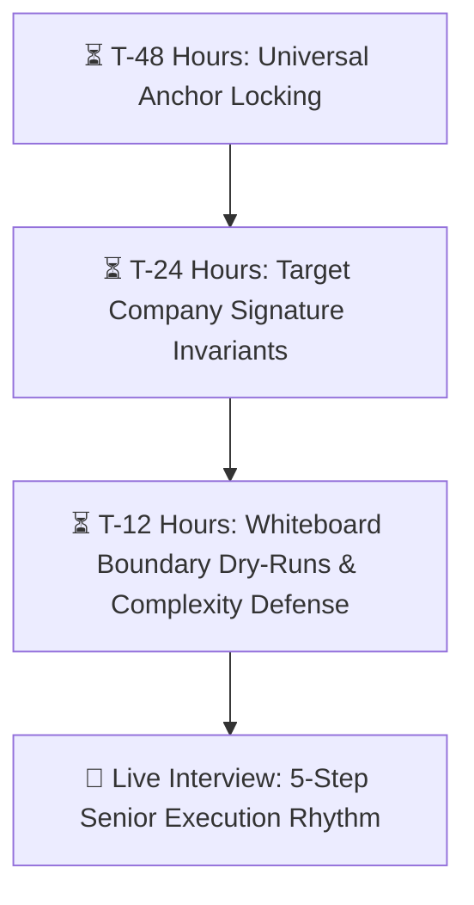
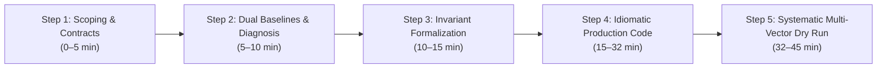

# 🏢 Top 20 Product Companies: High-ROI DSA Interview Curriculum

> **Target Level:** Senior / Staff / Principal / Lead Software Engineer (.NET / C# / Polyglot)  
> **Core Philosophy:** Invariant Derivation $\to$ Pattern Recognition $\to$ Production Code $\to$ Defensive Verification.  
> **Source Solutions Repository:** [`Senior_problem_solution/`](Senior_problem_solution/README.md) (164 Comprehensive Production Solutions across 25 Phased Modules).  
> **Curriculum Purpose:** Maximize interview ROI across the world's top 20 product tech companies by mastering high-frequency invariants, identifying company-specific architectural archetypes, and executing bug-free solutions under live pressure.

---

## 🧭 Table of Contents

1. [🏛️ Part I: Executive Strategy & Macro Heatmap](#-part-i-executive-strategy--macro-heatmap)
   - [Macro Heatmap: 20 Companies × 12 Algorithmic Patterns](#macro-heatmap-20-companies--12-algorithmic-patterns)
   - [Company Hiring Bar & Evaluation Dimensions (20 Companies)](#company-hiring-bar--evaluation-dimensions-20-companies)
2. [🏢 Part II: Company-by-Company High-ROI Curricula (20 Dedicated Sections)](#-part-ii-company-by-company-high-roi-curricula)
   - [1. Google (Alphabet)](#1-google-alphabet)
   - [2. Meta (Facebook)](#2-meta-facebook)
   - [3. Amazon](#3-amazon)
   - [4. Microsoft](#4-microsoft)
   - [5. Apple](#5-apple)
   - [6. Netflix](#6-netflix)
   - [7. Uber](#7-uber)
   - [8. Stripe](#8-stripe)
   - [9. ByteDance (TikTok)](#9-bytedance-tiktok)
   - [10. LinkedIn](#10-linkedin)
   - [11. Salesforce](#11-salesforce)
   - [12. Adobe](#12-adobe)
   - [13. Bloomberg](#13-bloomberg)
   - [14. Airbnb](#14-airbnb)
   - [15. DoorDash](#15-doordash)
   - [16. Snowflake](#16-snowflake)
   - [17. Databricks](#17-databricks)
   - [18. Palantir](#18-palantir)
   - [19. Atlassian](#19-atlassian)
   - [20. Pinterest](#20-pinterest)
3. [⚡ Part III: 48-Hour Rapid Revision Playbook & Senior Delivery Framework](#-part-iii-48-hour-rapid-revision-playbook--senior-delivery-framework)
   - [48-Hour, 24-Hour, and 12-Hour Triage Matrix](#48-hour-24-hour-and-12-hour-triage-matrix)
   - [Senior Live Coding Playbook (The 5-Step Execution Rhythm)](#senior-live-coding-playbook-the-5-step-execution-rhythm)

---

## 🏛️ Part I: Executive Strategy & Macro Heatmap

Modern product tech companies do not evaluate candidates uniformly. While a candidate facing **Meta** must achieve near-instantaneous muscle memory on 2 Mediums in 40 minutes with zero compiler runs, a candidate facing **Stripe** or **Palantir** works inside a full IDE tackling multi-stage parsers or ontology graphs with full unit test suites. Similarly, **Google** stresses mathematical proofs and asymptotic bounds under unbounded streaming constraints, **Snowflake** and **Databricks** interrogate memory layout, cache locality, and concurrency primitives, and **Bloomberg** expects sub-millisecond financial stream processing patterns.

Across all 20 elite tech companies, over **85% of interview questions derive from 12 foundational algorithmic patterns**.

### Macro Heatmap: 20 Companies × 12 Algorithmic Patterns

| Company | Arrays & 2-Pointers | Sliding Window | Monotonic Stack/Deque | Trees & LCA | Graph BFS/DFS/Dijkstra | Dynamic Programming | Heap / Streaming | Intervals & Sweep | System Design / Caches | String & Parsing | Union-Find / Bipartite | Backtracking / Tries |
| :--- | :---: | :---: | :---: | :---: | :---: | :---: | :---: | :---: | :---: | :---: | :---: | :---: |
| **Google** | 🟢 Moderate | 🟡 High | 🔴 Essential | 🔴 Essential | 🔴 Essential | 🔴 Essential | 🟡 High | 🟡 High | 🟢 Moderate | 🟡 High | 🟡 High | 🟡 High |
| **Meta** | 🔴 Essential | 🔴 Essential | 🟡 High | 🔴 Essential | 🟡 High | 🟢 Moderate | 🟡 High | 🟢 Moderate | 🟢 Moderate | 🔴 Essential | 🟢 Moderate | 🟡 High |
| **Amazon** | 🟡 High | 🟡 High | 🔴 Essential | 🟡 High | 🔴 Essential | 🟢 Moderate | 🔴 Essential | 🔴 Essential | 🔴 Essential | 🟢 Moderate | 🟡 High | 🟢 Moderate |
| **Microsoft** | 🔴 Essential | 🟡 High | 🟢 Moderate | 🔴 Essential | 🟡 High | 🟡 High | 🟢 Moderate | 🟡 High | 🟡 High | 🔴 Essential | 🟢 Moderate | 🟡 High |
| **Apple** | 🔴 Essential | 🟡 High | 🟡 High | 🟡 High | 🟢 Moderate | 🟢 Moderate | 🟢 Moderate | 🟢 Moderate | 🔴 Essential | 🔴 Essential | 🟢 Moderate | 🟡 High |
| **Netflix** | 🟡 High | 🔴 Essential | 🔴 Essential | 🟡 High | 🟢 Moderate | 🟡 High | 🔴 Essential | 🔴 Essential | 🔴 Essential | 🟢 Moderate | 🟢 Moderate | 🟢 Moderate |
| **Uber** | 🟡 High | 🟢 Moderate | 🟢 Moderate | 🟢 Moderate | 🔴 Essential | 🟡 High | 🟡 High | 🔴 Essential | 🔴 Essential | 🟢 Moderate | 🟡 High | 🟢 Moderate |
| **Stripe** | 🟡 High | 🟡 High | 🟢 Moderate | 🟢 Moderate | 🟡 High | 🟢 Moderate | 🟢 Moderate | 🟡 High | 🔴 Essential | 🔴 Essential | 🟢 Moderate | 🟢 Moderate |
| **ByteDance** | 🔴 Essential | 🔴 Essential | 🔴 Essential | 🔴 Essential | 🟡 High | 🔴 Essential | 🟡 High | 🟡 High | 🟡 High | 🟢 Moderate | 🟡 High | 🟡 High |
| **LinkedIn** | 🟡 High | 🟡 High | 🟢 Moderate | 🔴 Essential | 🔴 Essential | 🟡 High | 🟢 Moderate | 🟢 Moderate | 🔴 Essential | 🟡 High | 🟢 Moderate | 🟢 Moderate |
| **Salesforce** | 🔴 Essential | 🟡 High | 🟡 High | 🔴 Essential | 🟡 High | 🟢 Moderate | 🟡 High | 🔴 Essential | 🔴 Essential | 🟡 High | 🟢 Moderate | 🟡 High |
| **Adobe** | 🔴 Essential | 🟡 High | 🟡 High | 🟡 High | 🟡 High | 🟡 High | 🟡 High | 🟡 High | 🟡 High | 🔴 Essential | 🟢 Moderate | 🟡 High |
| **Bloomberg** | 🔴 Essential | 🟡 High | 🔴 Essential | 🟡 High | 🟡 High | 🟢 Moderate | 🔴 Essential | 🔴 Essential | 🔴 Essential | 🔴 Essential | 🟢 Moderate | 🟢 Moderate |
| **Airbnb** | 🟡 High | 🟡 High | 🟢 Moderate | 🟡 High | 🔴 Essential | 🟢 Moderate | 🟡 High | 🔴 Essential | 🟡 High | 🟡 High | 🟡 High | 🔴 Essential |
| **DoorDash** | 🟡 High | 🟡 High | 🟡 High | 🟢 Moderate | 🔴 Essential | 🔴 Essential | 🔴 Essential | 🔴 Essential | 🔴 Essential | 🟢 Moderate | 🟡 High | 🟡 High |
| **Snowflake** | 🔴 Essential | 🟡 High | 🔴 Essential | 🟡 High | 🟡 High | 🟡 High | 🔴 Essential | 🟡 High | 🔴 Essential | 🟡 High | 🔴 Essential | 🟢 Moderate |
| **Databricks** | 🟡 High | 🟡 High | 🟡 High | 🟡 High | 🔴 Essential | 🟡 High | 🔴 Essential | 🟡 High | 🔴 Essential | 🟡 High | 🔴 Essential | 🟢 Moderate |
| **Palantir** | 🟡 High | 🟡 High | 🟡 High | 🟡 High | 🔴 Essential | 🔴 Essential | 🟡 High | 🟡 High | 🟡 High | 🔴 Essential | 🔴 Essential | 🔴 Essential |
| **Atlassian** | 🟡 High | 🟡 High | 🟢 Moderate | 🔴 Essential | 🟡 High | 🟢 Moderate | 🟡 High | 🟡 High | 🔴 Essential | 🔴 Essential | 🟢 Moderate | 🟢 Moderate |
| **Pinterest** | 🔴 Essential | 🟡 High | 🟢 Moderate | 🔴 Essential | 🔴 Essential | 🟡 High | 🔴 Essential | 🟢 Moderate | 🟡 High | 🟢 Moderate | 🔴 Essential | 🟡 High |

> **Legend:** 🔴 **Essential** (Tested in ~40%+ of interview loops) | 🟡 **High** (Tested in ~20–35% of loops) | 🟢 **Moderate** (Occasional or team-specific).

---

### Company Hiring Bar & Evaluation Dimensions (20 Companies)

| Company | Speed Expectation | Algorithmic Depth | Code Quality / Idioms | Follow-Up / Scalability Weight | Behavioral / Culture Weight |
| :--- | :--- | :--- | :--- | :--- | :--- |
| **Google** | 1 Medium/Hard in 40 min | Extreme (Formal proof, custom bounds) | High (Clean abstractions, modular) | Extreme (Streaming, infinite bounds, memory) | Moderate (Googlyness & Navigating Ambiguity) |
| **Meta** | 2 Mediums in 40 min | Moderate to High (Standard patterns) | Extreme (Zero compiler, zero syntax bugs) | Moderate (Scale & memory boundaries) | Low to Moderate (Meta Core Values) |
| **Amazon** | 1–2 Mediums in 30 min | Moderate (Data structures & trade-offs) | High (Defensive checks, edge guards) | High (Volume bounds, large data handling) | Extreme (16 Leadership Principles integration) |
| **Microsoft** | 1–2 Mediums in 35 min | Moderate (Core CS foundations, memory) | High (OOP friendly, readable, clean) | Moderate (Garbage collection & allocations) | Moderate (Growth Mindset & Customer Focus) |
| **Apple** | 1 Medium/Hard in 45 min | High (Systems awareness, memory, cache) | High (Allocation efficiency, Span/Pointers) | High (Cache locality, thread safety) | Moderate (Team-specific craft & ownership) |
| **Netflix** | 1 Hard / Complex in 45 min | Extreme (Concurrency, caching, streams) | Extreme (Senior/Staff production code) | Extreme (Real-world distributed failure modes) | High (Netflix Culture Memo & Judgement) |
| **Uber** | 1–2 Mediums in 45 min | High (Shortest path, Graph BFS/Dijkstra) | High (Clean graph representations) | High (Geospatial scale, latency budgets) | Moderate (Uber Values & Bias for Action) |
| **Stripe** | 1 Multi-Part in 45 min | Practical / Applied (Parsers, state machines) | Extreme (Compilable, unit tests pass) | Extreme (Backward compatibility, idempotency) | Moderate (Stripe Operating Principles) |
| **ByteDance** | 2 Hard/Medium in 40 min | Extreme (Complex DP, Monotonic Deques) | High (Algorithmic fluency under pressure) | Moderate (Time/space complexity proofs) | Low to Moderate (ByteDance Style) |
| **LinkedIn** | 1–2 Mediums in 45 min | High (Nested iterators, inverted indices) | High (Clean OOP, interfaces, separation) | High (Search scale, index latency) | Moderate (Craftsmanship & Culture) |
| **Salesforce** | 1–2 Mediums in 45 min | High (Multi-tenant structures, caches) | High (Clean OOP, extensibility) | High (Multi-tenant quotas, high concurrency) | Moderate (Trust, Customer Success, Equality) |
| **Adobe** | 1–2 Mediums in 45 min | High (Matrix transforms, string geometry) | High (Modular methods, algorithmic clarity) | High (Rendering buffers, 2D processing latency) | Moderate (Adobe Core Values & Creativity) |
| **Bloomberg** | 1–2 Mediums in 40 min | High (Real-time financial streams, queues) | Extreme (Low allocation, high performance) | Extreme (Throughput, streaming order books) | Moderate (Bloomberg Terminal & Market Domain) |
| **Airbnb** | 1–2 Mediums in 45 min | High (Interval sweep, calendar constraints) | Extreme (Production clarity, test cases) | High (Global booking concurrency, availability) | High (Core Values & Belonging Everywhere) |
| **DoorDash** | 1–2 Mediums in 45 min | High (Courier dispatch routing, combinatorics) | High (Defensive boundary logic) | Extreme (Real-time dynamic logistics, batches) | High (DoorDash Values / Bias for Action) |
| **Snowflake** | 1 Hard / 2 Med in 45 min | Extreme (Query engines, sorting, columnar) | Extreme (Cache lines, zero GC churn) | Extreme (Petabyte scale, concurrency primitives) | Moderate (Values & High Performance) |
| **Databricks** | 1 Hard / 2 Med in 45 min | Extreme (DAG scheduling, memory spilling) | Extreme (Systems engineering, idiomatic) | Extreme (Distributed scale, network partitions) | Moderate (Technical Leadership & Innovation) |
| **Palantir** | 1 Multi-Part in 60 min | Extreme (Graph ontologies, dynamic parsing) | High (Decomposition into robust modules) | Extreme (Arbitrary schema evolution, data mesh) | High (Mission Focus, Impact & Ownership) |
| **Atlassian** | 1–2 Mediums in 45 min | High (Document trees, rate limiters, search) | Extreme (Code cleanliness, design patterns) | High (Tenant isolation, rate bounds, SLAs) | High (Open Company No Bullshit, Play As A Team) |
| **Pinterest** | 1–2 Mediums in 45 min | High (Graph clustering, bipartite feeds) | High (Clean modular data processing) | High (Feed ranking scale, visual latency) | Moderate (Be Act As An Owner, Put Pinner First) |

---

## 🏢 Part II: Company-by-Company High-ROI Curricula

### 1. Google (Alphabet)

> **Archetype:** *Scale, Invariant Rigor, Graph Traversal & Algorithmic Generalization*  
> **Hiring Bar:** Google places exceptional weight on mathematical invariant proofs and boundary reasoning before a candidate writes a single line of code. Interviewers frequently modify standard LeetCode problems (introducing unbounded streaming inputs, dynamic edge weights, continuous time windows, or multi-dimensional constraints). Candidates must articulate $O(1)$ space trade-offs, state-space pruning proofs, and cache-friendly asymptotic bounds fluently.  
> **Interview Structure:** 1 Phone Technical Screen (45 min) + 4–5 Onsite Technical Loops (including 1 System Architecture round for Senior/Staff+, and 1 Googlyness & Leadership round).

#### 🎯 Core High-ROI Question Roster

| # | Problem Title | Difficulty | Priority | Pattern & Invariant Tags | Status | Solution Link |
| :---: | :--- | :---: | :---: | :--- | :---: | :--- |
| 1 | Trapping Rain Water (LC #42) | 🔴 Hard | 👑 Lead Anchor | `#two-pointers` `#boundary-invariant` | ⭐ Covered in Curriculum | [Trapping Rain Water](Senior_problem_solution/20_Advanced_Senior_Patterns.md#109-trapping-rain-water-leetcode-42) |
| 2 | Word Ladder (LC #127) | 🔴 Hard | 👑 Lead Anchor | `#graph` `#bfs` `#shortest-path` | ⭐ Covered in Curriculum | [Word Ladder](Senior_problem_solution/20_Advanced_Senior_Patterns.md#110-word-ladder-leetcode-127) |
| 3 | Meeting Rooms II (LC #253) | 🟡 Medium | ⭐ Core | `#intervals` `#min-heap` `#sweep-line` | ⭐ Covered in Curriculum | [Meeting Rooms II](Senior_problem_solution/11_Intervals.md#63-meeting-rooms-ii-leetcode-253) |
| 4 | Serialize and Deserialize Binary Tree (LC #297) | 🔴 Hard | 👑 Lead Anchor | `#tree` `#bfs` `#dfs` `#serialization` | ⭐ Covered in Curriculum | [Serialize and Deserialize Binary Tree](Senior_problem_solution/20_Advanced_Senior_Patterns.md#115-serialize-and-deserialize-binary-tree-leetcode-297) |
| 5 | Largest Rectangle in Histogram (LC #84) | 🔴 Hard | 👑 Lead Anchor | `#monotonic-stack` `#nearest-smaller` | ⭐ Covered in Curriculum | [Largest Rectangle in Histogram](Senior_problem_solution/20_Advanced_Senior_Patterns.md#108-largest-rectangle-in-histogram-leetcode-84) |
| 6 | Swim in Rising Water (LC #778) | 🔴 Hard | 👑 Lead Anchor | `#graph` `#dijkstra` `#binary-search` | ⭐ Covered in Curriculum | [Swim in Rising Water](Senior_problem_solution/20_Advanced_Senior_Patterns.md#111-swim-in-rising-water-leetcode-778) |
| 7 | Number of Islands (LC #200) | 🟡 Medium | ⭐ Core | `#graph` `#bfs` `#dfs` `#grid-sinking` | ⭐ Covered in Curriculum | [Number of Islands](Senior_problem_solution/12_Graph_Traversal.md#64-number-of-islands-leetcode-200) |
| 8 | Network Delay Time (LC #743) | 🟡 Medium | ⭐ Core | `#graph` `#dijkstra` `#min-heap` | ⭐ Covered in Curriculum | [Network Delay Time](Senior_problem_solution/13_Graph_Algorithms.md#70-network-delay-time-leetcode-743) |
| 9 | Split Array Largest Sum (LC #410) | 🔴 Hard | 👑 Lead Anchor | `#binary-search-on-answer` `#greedy` `#partitioning` | 🆕 New Signature Solution | [Split Array Largest Sum](Senior_problem_solution/23_Amazon_Google_Uber_Signatures.md#134-split-array-largest-sum-leetcode-410) |
| 10 | Decode String (LC #394) | 🟡 Medium | 🔥 High Value | `#stack` `#string` `#recursion` `#parser` | 🆕 New Signature Solution | [Decode String](Senior_problem_solution/23_Amazon_Google_Uber_Signatures.md#135-decode-string-leetcode-394) |
| 11 | Bus Routes (LC #815) | 🔴 Hard | 👑 Lead Anchor | `#graph` `#bfs` `#bipartite-graph` `#shortest-path` | 🆕 New Signature Solution | [Bus Routes](Senior_problem_solution/23_Amazon_Google_Uber_Signatures.md#136-bus-routes-leetcode-815) |
| 12 | Step-By-Step Directions From a Binary Tree Node to Another (LC #2096) | 🟡 Medium | 🔥 High Value | `#tree` `#lca` `#dfs` `#path-construction` | 🆕 New Signature Solution | [Step-By-Step Directions From a Binary Tree Node to Another](Senior_problem_solution/23_Amazon_Google_Uber_Signatures.md#137-step-by-step-directions-from-a-binary-tree-node-to-another-leetcode-2096) |
| 13 | Logger Rate Limiter (LC #359) | 🟢 Easy | 🔥 High Value | `#design` `#hash-map` `#sliding-window-timestamp` | 🆕 New Signature Solution | [Logger Rate Limiter](Senior_problem_solution/21_System_Design_Data_Structures.md#119-logger-rate-limiter-leetcode-359) |
| 14 | LRU Cache (LC #146) | 🟡 Medium | 🔥 High Value | `#design` `#hash-map` `#doubly-linked-list` | 🆕 New Signature Solution | [LRU Cache](Senior_problem_solution/21_System_Design_Data_Structures.md#116-lru-cache-leetcode-146) |
| 15 | Longest Increasing Path in a Matrix (LC #329) | 🔴 Hard | 👑 Lead Anchor | `#graph` `#memoization` `#topological-sort` `#matrix-dfs` | 🆕 New Signature Solution | [Longest Increasing Path in a Matrix](Senior_problem_solution/25_Scale_Design_and_Advanced_Signatures.md#158-longest-increasing-path-in-a-matrix-leetcode-329) |

#### 💡 Signature Company Invariants & Defense Checklist
- **Implicit Graph Modeling over Dense Adjacency:** In problems like Bus Routes (#136) and Word Ladder (#110), do not instantiate an $N \times N$ dense adjacency matrix. Model stops $\leftrightarrow$ routes as a bipartite graph or use intermediate wildcard buckets to keep edge relaxation strictly bounded by input volume.
- **Binary Search on Monotonic Decision Predicates:** In Split Array Largest Sum (#134), recognize that feasibility predicate $P(\text{maxSum})$ is monotonically non-increasing. Binary search over $[\max(nums), \sum nums]$ with a greedy partition predicate in $O(N \log(\sum nums))$ time.
- **LCA Path Splicing Without Redundant Ancestor Walks:** In Step-By-Step Directions (#137), avoid separate path traversals from root. Find the Lowest Common Ancestor first, then string prefix pruning directly eliminates redundant ancestor branches to produce minimum-length directions.
- **DAG Topo-Ordering via Memoized Grid DFS:** In Longest Increasing Path in a Matrix (#158), strictly increasing cell transitions enforce a Directed Acyclic Graph (DAG) structure; memoizing post-order cell DFS computes the global topological longest path in strictly $O(M \times N)$ time without explicit cycle detection.

---

### 2. Meta (Facebook)

> **Archetype:** *Speed, Flawless Bug-Free Execution, Trees, String & Two-Pointer Invariants*  
> **Hiring Bar:** Meta tests extreme coding velocity: 2 Medium problems (or 1 Hard + 1 Medium) in 40–45 minutes on CoderPad with **zero compiler execution**. Candidates cannot rely on test runs or syntax auto-completion. Every edge case must be dry-run manually on a text pad. Top patterns: Binary Trees (Vertical, LCA), Strings (abbreviations, palindromes, parentheses), and Two Pointers.  
> **Interview Structure:** 1 Technical Screen (45 min, 2 coding questions) + 2 Onsite Coding Loops (45 min each, 2 coding questions per loop) + 1 System Design (or Product Architecture) + 1 Behavioral round.

#### 🎯 Core High-ROI Question Roster

| # | Problem Title | Difficulty | Priority | Pattern & Invariant Tags | Status | Solution Link |
| :---: | :--- | :---: | :---: | :--- | :---: | :--- |
| 1 | Subarray Sum Equals K (LC #560) | 🟡 Medium | ⭐ Core | `#prefix-sum` `#hash-map` | ⭐ Covered in Curriculum | [Subarray Sum Equals K](Senior_problem_solution/04_Prefix_Sum_Subarray.md#21-subarray-sum-equals-k-leetcode-560) |
| 2 | Lowest Common Ancestor of a Binary Tree (LC #236) | 🟡 Medium | ⭐ Core | `#tree` `#dfs` `#post-order` `#lca` | ⭐ Covered in Curriculum | [Lowest Common Ancestor of a Binary Tree](Senior_problem_solution/09_Binary_Trees.md#54-lowest-common-ancestor-of-a-binary-tree-leetcode-236) |
| 3 | 3Sum (LC #15) | 🟡 Medium | ⭐ Core | `#two-pointers` `#sorting` `#dedup` | ⭐ Covered in Curriculum | [3Sum](Senior_problem_solution/02_Two_Pointers.md#11-3sum-leetcode-15) |
| 4 | Minimum Window Substring (LC #76) | 🔴 Hard | 👑 Lead Anchor | `#sliding-window` `#match-counter` | ⭐ Covered in Curriculum | [Minimum Window Substring](Senior_problem_solution/03_Sliding_Window.md#18-minimum-window-substring-leetcode-76) |
| 5 | Kth Largest Element in an Array (LC #215) | 🟡 Medium | ⭐ Core | `#heap` `#quickselect` `#kth-element` | ⭐ Covered in Curriculum | [Kth Largest Element in an Array](Senior_problem_solution/10_Heap_Priority_Queue.md#56-kth-largest-element-in-an-array-leetcode-215) |
| 6 | Binary Tree Vertical Order Traversal (LC #314) | 🟡 Medium | 🔥 High Value | `#tree` `#bfs` `#hash-map` `#column-indexing` | 🆕 New Signature Solution | [Binary Tree Vertical Order Traversal](Senior_problem_solution/22_Meta_Signature_Patterns.md#123-binary-tree-vertical-order-traversal-leetcode-314) |
| 7 | Minimum Remove to Make Valid Parentheses (LC #1249) | 🟡 Medium | 🔥 High Value | `#stack` `#string` `#balance-invariant` | 🆕 New Signature Solution | [Minimum Remove to Make Valid Parentheses](Senior_problem_solution/22_Meta_Signature_Patterns.md#124-minimum-remove-to-make-valid-parentheses-leetcode-1249) |
| 8 | Valid Word Abbreviation (LC #408) | 🟢 Easy | 🔥 High Value | `#two-pointers` `#string` `#pointer-arithmetic` | 🆕 New Signature Solution | [Valid Word Abbreviation](Senior_problem_solution/22_Meta_Signature_Patterns.md#125-valid-word-abbreviation-leetcode-408) |
| 9 | Valid Palindrome II (LC #680) | 🟢 Easy | 🔥 High Value | `#two-pointers` `#greedy` `#single-deletion` | 🆕 New Signature Solution | [Valid Palindrome II](Senior_problem_solution/22_Meta_Signature_Patterns.md#126-valid-palindrome-ii-leetcode-680) |
| 10 | Buildings With an Ocean View (LC #1762) | 🟡 Medium | 🔥 High Value | `#monotonic-stack` `#right-to-left` `#running-max` | 🆕 New Signature Solution | [Buildings With an Ocean View](Senior_problem_solution/22_Meta_Signature_Patterns.md#127-buildings-with-an-ocean-view-leetcode-1762) |
| 11 | Random Pick with Weight (LC #528) | 🟡 Medium | 🔥 High Value | `#prefix-sum` `#binary-search` `#probability` | 🆕 New Signature Solution | [Random Pick with Weight](Senior_problem_solution/22_Meta_Signature_Patterns.md#128-random-pick-with-weight-leetcode-528) |
| 12 | Dot Product of Two Sparse Vectors (LC #1570) | 🟡 Medium | 🔥 High Value | `#two-pointers` `#hash-map` `#array` `#sparse-matrix` | 🆕 New Signature Solution | [Dot Product of Two Sparse Vectors](Senior_problem_solution/22_Meta_Signature_Patterns.md#129-dot-product-of-two-sparse-vectors-leetcode-1570) |
| 13 | Lowest Common Ancestor of a Binary Tree III (LC #1650) | 🟡 Medium | 🔥 High Value | `#tree` `#two-pointers` `#linked-list-cycle-analogy` | 🆕 New Signature Solution | [Lowest Common Ancestor of a Binary Tree III](Senior_problem_solution/22_Meta_Signature_Patterns.md#130-lowest-common-ancestor-of-a-binary-tree-iii-leetcode-1650) |
| 14 | Merge Sorted Array (LC #88) | 🟢 Easy | 🔥 High Value | `#two-pointers` `#three-pointers` `#backward-fill` | 🆕 New Signature Solution | [Merge Sorted Array](Senior_problem_solution/22_Meta_Signature_Patterns.md#132-merge-sorted-array-leetcode-88) |
| 15 | Binary Tree Right Side View (LC #199) | 🟡 Medium | ⭐ Core | `#tree` `#bfs` `#dfs` `#level-order` | 🆕 New Signature Solution | [Binary Tree Right Side View](Senior_problem_solution/25_Scale_Design_and_Advanced_Signatures.md#154-binary-tree-right-side-view-leetcode-199) |

#### 💡 Signature Company Invariants & Defense Checklist
- **BFS Column Bounds for Vertical Traversal:** In Vertical Order Traversal (#123), maintaining min/max column bounds alongside a standard BFS queue guarantees top-to-bottom and left-to-right sorting without allocating an extra sorting pass over coordinates.
- **Two-Pass Balanced Parentheses Filter:** In Minimum Remove (#1249), balance counter removes excess closing brackets left-to-right, then a reverse scan removes leftover unmatched opening brackets, achieving strictly linear $O(N)$ runtime with zero allocations beyond the string builder.
- **Parent-Pointer LCA as Linked List Intersection:** In LCA III (#130), node-to-parent pointers reduce LCA to finding the intersection of two linked lists (Floyd's pointer swap technique) in $O(H)$ time and strictly $O(1)$ auxiliary space.
- **Rightmost Level Extraction:** In Binary Tree Right Side View (#154), level-order BFS snapshots record the final element of each queue tier, or pre-order DFS with modified traversal order (Root $\to$ Right $\to$ Left) populates the first node encountered at depth $d$.

---

### 3. Amazon

> **Archetype:** *Heaps/Priority Queues, Grid BFS, Monotonic Stack Contributions & Object-Oriented Design*  
> **Hiring Bar:** Every interview loop blends 20–25 minutes of Amazon's 16 Leadership Principles (Customer Obsession, Ownership, Bias for Action, Dive Deep) with 25–30 minutes of high-velocity DSA coding. Amazon heavily stresses Priority Queues (Top-K, Streaming Median), Multi-Source Grid BFS (Rotting Oranges), Interval Scheduling, and Cache/Trie Systems.  
> **Interview Structure:** 1 Online Assessment (OA2: 2 coding questions + work style assessment) + 1 Tech Phone Screen + 4–5 Loop Rounds (Coding 1, Coding 2, System Design, Bar Raiser / LP).

#### 🎯 Core High-ROI Question Roster

| # | Problem Title | Difficulty | Priority | Pattern & Invariant Tags | Status | Solution Link |
| :---: | :--- | :---: | :---: | :--- | :---: | :--- |
| 1 | LRU Cache (LC #146) | 🟡 Medium | 🔥 High Value | `#design` `#hash-map` `#doubly-linked-list` | 🆕 New Signature Solution | [LRU Cache](Senior_problem_solution/21_System_Design_Data_Structures.md#116-lru-cache-leetcode-146) |
| 2 | Rotting Oranges (LC #994) | 🟡 Medium | 🔥 High Value | `#graph` `#multi-source-bfs` `#matrix` `#layer-timing` | 🆕 New Signature Solution | [Rotting Oranges](Senior_problem_solution/23_Amazon_Google_Uber_Signatures.md#133-rotting-oranges-leetcode-994) |
| 3 | Number of Islands (LC #200) | 🟡 Medium | ⭐ Core | `#graph` `#bfs` `#dfs` `#grid-sinking` | ⭐ Covered in Curriculum | [Number of Islands](Senior_problem_solution/12_Graph_Traversal.md#64-number-of-islands-leetcode-200) |
| 4 | Merge K Sorted Lists (LC #23) | 🔴 Hard | 👑 Lead Anchor | `#heap` `#priority-queue` `#k-way-merge` | ⭐ Covered in Curriculum | [Merge K Sorted Lists](Senior_problem_solution/06_Linked_Lists.md#34-merge-k-sorted-lists-leetcode-23) |
| 5 | Find Median from Data Stream (LC #295) | 🔴 Hard | 👑 Lead Anchor | `#two-heaps` `#streaming-median` | ⭐ Covered in Curriculum | [Find Median from Data Stream](Senior_problem_solution/10_Heap_Priority_Queue.md#59-find-median-from-data-stream-leetcode-295) |
| 6 | Merge Intervals (LC #56) | 🟡 Medium | ⭐ Core | `#intervals` `#sorting` `#contiguous-merging` | ⭐ Covered in Curriculum | [Merge Intervals](Senior_problem_solution/11_Intervals.md#60-merge-intervals-leetcode-56) |
| 7 | Meeting Rooms II (LC #253) | 🟡 Medium | ⭐ Core | `#intervals` `#min-heap` `#sweep-line` | ⭐ Covered in Curriculum | [Meeting Rooms II](Senior_problem_solution/11_Intervals.md#63-meeting-rooms-ii-leetcode-253) |
| 8 | K Closest Points to Origin (LC #973) | 🟡 Medium | ⭐ Core | `#heap` `#top-k` `#quickselect` | ⭐ Covered in Curriculum | [K Closest Points to Origin](Senior_problem_solution/10_Heap_Priority_Queue.md#58-k-closest-points-to-origin-leetcode-973) |
| 9 | Gas Station (LC #134) | 🟡 Medium | ⭐ Core | `#greedy` `#running-deficit` | ⭐ Covered in Curriculum | [Gas Station](Senior_problem_solution/14_Greedy.md#76-gas-station-leetcode-134) |
| 10 | Trapping Rain Water (LC #42) | 🔴 Hard | 👑 Lead Anchor | `#two-pointers` `#boundary-invariant` | ⭐ Covered in Curriculum | [Trapping Rain Water](Senior_problem_solution/20_Advanced_Senior_Patterns.md#109-trapping-rain-water-leetcode-42) |
| 11 | Sum of Subarray Ranges (LC #2104) | 🟡 Medium | 🔥 High Value | `#monotonic-stack` `#contribution-counting` `#subarray` | 🆕 New Signature Solution | [Sum of Subarray Ranges](Senior_problem_solution/23_Amazon_Google_Uber_Signatures.md#138-sum-of-subarray-ranges-leetcode-2104) |
| 12 | Search Suggestions System (LC #1268) | 🟡 Medium | 🔥 High Value | `#trie` `#binary-search` `#two-pointers` `#string` | 🆕 New Signature Solution | [Search Suggestions System](Senior_problem_solution/23_Amazon_Google_Uber_Signatures.md#139-search-suggestions-system-leetcode-1268) |
| 13 | Analyze User Website Visit Pattern (LC #1152) | 🟡 Medium | 🔥 High Value | `#hash-map` `#combinatorics` `#sorting` `#simulation` | 🆕 New Signature Solution | [Analyze User Website Visit Pattern](Senior_problem_solution/23_Amazon_Google_Uber_Signatures.md#140-analyze-user-website-visit-pattern-leetcode-1152) |
| 14 | Copy List with Random Pointer (LC #138) | 🟡 Medium | 🔥 High Value | `#linked-list` `#hash-map` `#in-place-interleaving` | 🆕 New Signature Solution | [Copy List with Random Pointer](Senior_problem_solution/23_Amazon_Google_Uber_Signatures.md#141-copy-list-with-random-pointer-leetcode-138) |
| 15 | Maximum Profit in Job Scheduling (LC #1235) | 🔴 Hard | 👑 Lead Anchor | `#dp` `#binary-search` `#sorting` `#weighted-intervals` | 🆕 New Signature Solution | [Maximum Profit in Job Scheduling](Senior_problem_solution/25_Scale_Design_and_Advanced_Signatures.md#159-maximum-profit-in-job-scheduling-leetcode-1235) |

#### 💡 Signature Company Invariants & Defense Checklist
- **Simultaneous Multi-Source Wavefront BFS:** In Rotting Oranges (#133), enqueue all initially rotten grid coordinates at $t=0$. Layer-by-layer expansion models physical diffusion in $O(M \times N)$ time without maintaining secondary timestamp matrices.
- **Monotonic Stack Contribution Principle:** In Sum of Subarray Ranges (#138), calculate $\sum \max - \sum \min$ across all contiguous subarrays in $O(N)$ by finding how many subarrays each index dominates as minimum and maximum via nearest-smaller/nearest-greater spans.
- **Trie-Assisted Lexicographical Top-3 Buffers:** In Search Suggestions (#139), store up to 3 lexicographically smallest words directly at each Trie node during tree construction to answer prefix auto-complete queries in $O(L)$ time.
- **Weighted Interval Scheduling DP with Binary Search:** In Maximum Profit in Job Scheduling (#159), sort jobs by end time and apply recurrence $\text{dp}[i] = \max(\text{dp}[i-1], \text{profit}[i] + \text{dp}[\text{prevNonOverlap}])$, finding previous compatible intervals in $O(\log N)$ time.

---

### 4. Microsoft

> **Archetype:** *Matrix In-Place Manipulations, Trees, Strings, Linked Lists & Clean Modular Architecture*  
> **Hiring Bar:** Microsoft prioritizes software craftsmanship, OOP design, readable naming conventions, and defensive programming. Candidates are judged on how clean, maintainable, and modular their code is. Matrix manipulation (Spiral, Rotate, Zeroes), Linked Lists, and Tree traversals are company staples. Interviewers frequently challenge candidates to eliminate auxiliary space and prevent memory leaks.  
> **Interview Structure:** 1 Screening round (45 min) + 4 Onsite rounds (2 DSA Coding, 1 Low-Level Object-Oriented / System Design, 1 As-Appropriate Hiring Manager round).

#### 🎯 Core High-ROI Question Roster

| # | Problem Title | Difficulty | Priority | Pattern & Invariant Tags | Status | Solution Link |
| :---: | :--- | :---: | :---: | :--- | :---: | :--- |
| 1 | LRU Cache (LC #146) | 🟡 Medium | 🔥 High Value | `#design` `#hash-map` `#doubly-linked-list` | 🆕 New Signature Solution | [LRU Cache](Senior_problem_solution/21_System_Design_Data_Structures.md#116-lru-cache-leetcode-146) |
| 2 | Spiral Matrix (LC #54) | 🟡 Medium | 🔥 High Value | `#matrix` `#simulation` `#boundary-contraction` | 🆕 New Signature Solution | [Spiral Matrix](Senior_problem_solution/24_Matrix_Strings_Parsing_Signatures.md#142-spiral-matrix-leetcode-54) |
| 3 | Rotate Image (LC #48) | 🟡 Medium | 🔥 High Value | `#matrix` `#in-place` `#transpose-reflect` | 🆕 New Signature Solution | [Rotate Image](Senior_problem_solution/24_Matrix_Strings_Parsing_Signatures.md#143-rotate-image-leetcode-48) |
| 4 | Set Matrix Zeroes (LC #73) | 🟡 Medium | 🔥 High Value | `#matrix` `#in-place-state-markers` | 🆕 New Signature Solution | [Set Matrix Zeroes](Senior_problem_solution/24_Matrix_Strings_Parsing_Signatures.md#144-set-matrix-zeroes-leetcode-73) |
| 5 | Reverse Words in a String (LC #151) | 🟡 Medium | 🔥 High Value | `#string` `#two-pointers` `#in-place-reverse` | 🆕 New Signature Solution | [Reverse Words in a String](Senior_problem_solution/24_Matrix_Strings_Parsing_Signatures.md#145-reverse-words-in-a-string-leetcode-151) |
| 6 | Compare Version Numbers (LC #165) | 🟡 Medium | 🔥 High Value | `#string` `#two-pointers` `#token-parsing` | 🆕 New Signature Solution | [Compare Version Numbers](Senior_problem_solution/24_Matrix_Strings_Parsing_Signatures.md#146-compare-version-numbers-leetcode-165) |
| 7 | Flatten Binary Tree to Linked List (LC #114) | 🟡 Medium | 🔥 High Value | `#tree` `#morris-traversal` `#post-order` | 🆕 New Signature Solution | [Flatten Binary Tree to Linked List](Senior_problem_solution/24_Matrix_Strings_Parsing_Signatures.md#147-flatten-binary-tree-to-linked-list-leetcode-114) |
| 8 | Number of Islands (LC #200) | 🟡 Medium | ⭐ Core | `#graph` `#bfs` `#dfs` `#grid-sinking` | ⭐ Covered in Curriculum | [Number of Islands](Senior_problem_solution/12_Graph_Traversal.md#64-number-of-islands-leetcode-200) |
| 9 | Lowest Common Ancestor of a Binary Tree (LC #236) | 🟡 Medium | ⭐ Core | `#tree` `#dfs` `#post-order` `#lca` | ⭐ Covered in Curriculum | [Lowest Common Ancestor of a Binary Tree](Senior_problem_solution/09_Binary_Trees.md#54-lowest-common-ancestor-of-a-binary-tree-leetcode-236) |
| 10 | Search in Rotated Sorted Array (LC #33) | 🟡 Medium | ⭐ Core | `#binary-search` `#rotated-array` | ⭐ Covered in Curriculum | [Search in Rotated Sorted Array](Senior_problem_solution/08_Binary_Search.md#44-search-in-rotated-sorted-array-leetcode-33) |
| 11 | String Compression (LC #443) | 🟡 Medium | ⭐ Core | `#two-pointers` `#in-place-write` | ⭐ Covered in Curriculum | [String Compression](Senior_problem_solution/05_Strings.md#26-string-compression-leetcode-443) |
| 12 | Valid Parentheses (LC #20) | 🟢 Easy | ⭐ Core | `#stack` `#matching-brackets` | ⭐ Covered in Curriculum | [Valid Parentheses](Senior_problem_solution/07_Stack_Monotonic_Stack.md#36-valid-parentheses-leetcode-20) |
| 13 | Merge Sorted Array (LC #88) | 🟢 Easy | 🔥 High Value | `#two-pointers` `#three-pointers` `#backward-fill` | 🆕 New Signature Solution | [Merge Sorted Array](Senior_problem_solution/22_Meta_Signature_Patterns.md#132-merge-sorted-array-leetcode-88) |
| 14 | Time Based Key-Value Store (LC #981) | 🟡 Medium | ⭐ Core | `#hash-map` `#binary-search` `#design` `#timestamp` | 🆕 New Signature Solution | [Time Based Key-Value Store](Senior_problem_solution/25_Scale_Design_and_Advanced_Signatures.md#156-time-based-key-value-store-leetcode-981) |
| 15 | Binary Tree Right Side View (LC #199) | 🟡 Medium | ⭐ Core | `#tree` `#bfs` `#dfs` `#level-order` | 🆕 New Signature Solution | [Binary Tree Right Side View](Senior_problem_solution/25_Scale_Design_and_Advanced_Signatures.md#154-binary-tree-right-side-view-leetcode-199) |

#### 💡 Signature Company Invariants & Defense Checklist
- **4-Boundary Matrix Contraction:** In Spiral Matrix (#142), contract `top`, `bottom`, `left`, `right` boundaries strictly after completing each directional sweep, with guard clauses defending against single row/column collapses.
- **In-Place State Flagging via Row/Col 0:** In Set Matrix Zeroes (#144), reuse the first row and column as bitmap markers, with two boolean scalars preserving the original zero status of row 0 and col 0 to achieve $O(1)$ space.
- **Two-Pass String Inversion:** In Reverse Words (#145), trim and reverse the entire character span, then reverse each individual word in-place to achieve $O(1)$ auxiliary memory.
- **Timestamp Ordered Binary Search:** In Time Based Key-Value Store (#156), store list of `(timestamp, value)` pairs in append order; query values using upper-bound binary search (`floorKey`) in $O(\log N)$ time.

---

### 5. Apple

> **Archetype:** *Systems Mindset, Low-Level Memory Awareness, Stack Expressions & Clean Pointer Logic*  
> **Hiring Bar:** Apple interviews vary across Hardware, OS/CoreOS, Services, and Applications teams. They frequently focus on memory bounds, cache locality, avoiding redundant allocations, Linked List re-wiring, and Stack-based evaluation. Interviewers look for systems intuition: understanding how data structures map to hardware memory, minimizing garbage collection pressure, and writing clean, pointer-safe code.  
> **Interview Structure:** 1–2 Technical Phone Screens (45–60 min) + 5–6 Onsite Technical Loops (including specialized team-specific architectural and coding rounds).

#### 🎯 Core High-ROI Question Roster

| # | Problem Title | Difficulty | Priority | Pattern & Invariant Tags | Status | Solution Link |
| :---: | :--- | :---: | :---: | :--- | :---: | :--- |
| 1 | Two Sum (LC #1) | 🟢 Easy | ⭐ Core | `#hash-map` `#complement-lookup` | ⭐ Covered in Curriculum | [Two Sum](Senior_problem_solution/01_Arrays_Hashing_Frequency.md#1-two-sum-leetcode-1) |
| 2 | Longest Substring Without Repeating Characters (LC #3) | 🟡 Medium | ⭐ Core | `#sliding-window` `#hash-set` | ⭐ Covered in Curriculum | [Longest Substring Without Repeating Characters](Senior_problem_solution/03_Sliding_Window.md#15-longest-substring-without-repeating-characters-leetcode-3) |
| 3 | Trapping Rain Water (LC #42) | 🔴 Hard | 👑 Lead Anchor | `#two-pointers` `#boundary-invariant` | ⭐ Covered in Curriculum | [Trapping Rain Water](Senior_problem_solution/20_Advanced_Senior_Patterns.md#109-trapping-rain-water-leetcode-42) |
| 4 | Valid Parentheses (LC #20) | 🟢 Easy | ⭐ Core | `#stack` `#matching-brackets` | ⭐ Covered in Curriculum | [Valid Parentheses](Senior_problem_solution/07_Stack_Monotonic_Stack.md#36-valid-parentheses-leetcode-20) |
| 5 | Word Search (LC #79) | 🟡 Medium | ⭐ Core | `#backtracking` `#grid-dfs` | ⭐ Covered in Curriculum | [Word Search](Senior_problem_solution/17_Backtracking.md#97-word-search-leetcode-79) |
| 6 | LRU Cache (LC #146) | 🟡 Medium | 🔥 High Value | `#design` `#hash-map` `#doubly-linked-list` | 🆕 New Signature Solution | [LRU Cache](Senior_problem_solution/21_System_Design_Data_Structures.md#116-lru-cache-leetcode-146) |
| 7 | Insert Delete GetRandom O(1) (LC #380) | 🟡 Medium | 🔥 High Value | `#design` `#hash-map` `#dynamic-array` | 🆕 New Signature Solution | [Insert Delete GetRandom O(1)](Senior_problem_solution/21_System_Design_Data_Structures.md#117-insert-delete-getrandom-o1-leetcode-380) |
| 8 | Spiral Matrix (LC #54) | 🟡 Medium | 🔥 High Value | `#matrix` `#simulation` `#boundary-contraction` | 🆕 New Signature Solution | [Spiral Matrix](Senior_problem_solution/24_Matrix_Strings_Parsing_Signatures.md#142-spiral-matrix-leetcode-54) |
| 9 | Best Time to Buy and Sell Stock (LC #121) | 🟢 Easy | 🔥 High Value | `#array` `#greedy` `#prefix-min` | 🆕 New Signature Solution | [Best Time to Buy and Sell Stock](Senior_problem_solution/24_Matrix_Strings_Parsing_Signatures.md#148-best-time-to-buy-and-sell-stock-leetcode-121) |
| 10 | Add Two Numbers II (LC #445) | 🟡 Medium | 🔥 High Value | `#linked-list` `#stack` `#math` `#digit-carry` | 🆕 New Signature Solution | [Add Two Numbers II](Senior_problem_solution/24_Matrix_Strings_Parsing_Signatures.md#149-add-two-numbers-ii-leetcode-445) |
| 11 | Copy List with Random Pointer (LC #138) | 🟡 Medium | 🔥 High Value | `#linked-list` `#hash-map` `#in-place-interleaving` | 🆕 New Signature Solution | [Copy List with Random Pointer](Senior_problem_solution/23_Amazon_Google_Uber_Signatures.md#141-copy-list-with-random-pointer-leetcode-138) |
| 12 | Merge Sorted Array (LC #88) | 🟢 Easy | 🔥 High Value | `#two-pointers` `#three-pointers` `#backward-fill` | 🆕 New Signature Solution | [Merge Sorted Array](Senior_problem_solution/22_Meta_Signature_Patterns.md#132-merge-sorted-array-leetcode-88) |
| 13 | Design Hit Counter (LC #362) | 🟡 Medium | ⭐ Core | `#design` `#queue` `#circular-buffer` `#sliding-window` | 🆕 New Signature Solution | [Design Hit Counter](Senior_problem_solution/25_Scale_Design_and_Advanced_Signatures.md#155-design-hit-counter-leetcode-362) |
| 14 | Basic Calculator II (LC #227) | 🟡 Medium | 🔥 High Value | `#stack` `#string` `#expression-evaluation` `#operator-precedence` | 🆕 New Signature Solution | [Basic Calculator II](Senior_problem_solution/24_Matrix_Strings_Parsing_Signatures.md#152-basic-calculator-ii-leetcode-227) |

#### 💡 Signature Company Invariants & Defense Checklist
- **Swap-to-Back O(1) Deletion:** In Insert Delete GetRandom O(1) (#117), swap the target item with the dynamic array tail, update the hash table index mapping, and pop back in $O(1)$ without memory reallocation.
- **Non-Reversing Linked List Addition:** In Add Two Numbers II (#149), push both list digit streams onto stacks to reverse digit significance without mutating original structures, then prepend carry nodes.
- **Interleaved Cloning:** In Copy List with Random Pointer (#141), interleave cloned nodes directly between originals ($A \to A' \to B \to B'$) to copy random pointers in $O(1)$ auxiliary space without hash map overhead.
- **Circular Array Ring Buffer for Rolling Counters:** In Design Hit Counter (#155), use a fixed-size 300-slot ring buffer storing `(timestamp, count)` pairs to handle concurrent hits in $O(1)$ space and $O(1)$ time.

---

### 6. Netflix

> **Archetype:** *Senior/Staff Bar, Streaming Algorithms, Concurrency & Advanced Caching Schemes*  
> **Hiring Bar:** Netflix exclusively hires Senior, Staff, and Principal engineers. DSA problems are tested with an emphasis on production resilience: streaming inputs, sliding window maximums, LFU/LRU eviction semantics, interval collision handling, and memory predictability. Candidates must defend against concurrency race conditions, throughput bottlenecks, and cache stampedes.  
> **Interview Structure:** 1 Recruiter Screen + 1 Technical Video Screen (60 min) + 2 Half-Day Onsite Loops (Deep technical DSA, Distributed Architecture, Culture alignment).

#### 🎯 Core High-ROI Question Roster

| # | Problem Title | Difficulty | Priority | Pattern & Invariant Tags | Status | Solution Link |
| :---: | :--- | :---: | :---: | :--- | :---: | :--- |
| 1 | LRU Cache (LC #146) | 🟡 Medium | 🔥 High Value | `#design` `#hash-map` `#doubly-linked-list` | 🆕 New Signature Solution | [LRU Cache](Senior_problem_solution/21_System_Design_Data_Structures.md#116-lru-cache-leetcode-146) |
| 2 | LFU Cache (LC #460) | 🔴 Hard | 👑 Lead Anchor | `#design` `#hash-map` `#doubly-linked-list` `#frequency-buckets` | 🆕 New Signature Solution | [LFU Cache](Senior_problem_solution/21_System_Design_Data_Structures.md#118-lfu-cache-leetcode-460) |
| 3 | Sliding Window Maximum (LC #239) | 🟡 Medium | ⭐ Core | `#monotonic-deque` `#sliding-window` | ⭐ Covered in Curriculum | [Sliding Window Maximum](Senior_problem_solution/20_Advanced_Senior_Patterns.md#106-sliding-window-maximum-leetcode-239) |
| 4 | Meeting Rooms II (LC #253) | 🟡 Medium | ⭐ Core | `#intervals` `#min-heap` `#sweep-line` | ⭐ Covered in Curriculum | [Meeting Rooms II](Senior_problem_solution/11_Intervals.md#63-meeting-rooms-ii-leetcode-253) |
| 5 | Largest Rectangle in Histogram (LC #84) | 🔴 Hard | 👑 Lead Anchor | `#monotonic-stack` `#nearest-smaller` | ⭐ Covered in Curriculum | [Largest Rectangle in Histogram](Senior_problem_solution/20_Advanced_Senior_Patterns.md#108-largest-rectangle-in-histogram-leetcode-84) |
| 6 | Find Median from Data Stream (LC #295) | 🔴 Hard | 👑 Lead Anchor | `#two-heaps` `#streaming-median` | ⭐ Covered in Curriculum | [Find Median from Data Stream](Senior_problem_solution/10_Heap_Priority_Queue.md#59-find-median-from-data-stream-leetcode-295) |
| 7 | Binary Tree Maximum Path Sum (LC #124) | 🔴 Hard | 👑 Lead Anchor | `#tree` `#dfs` `#post-order` `#bottom-up-dp` | 🆕 New Signature Solution | [Binary Tree Maximum Path Sum](Senior_problem_solution/24_Matrix_Strings_Parsing_Signatures.md#153-binary-tree-maximum-path-sum-leetcode-124) |
| 8 | Top K Frequent Elements (LC #347) | 🟡 Medium | ⭐ Core | `#heap` `#hash-map` `#bucket-sort` | ⭐ Covered in Curriculum | [Top K Frequent Elements](Senior_problem_solution/10_Heap_Priority_Queue.md#57-top-k-frequent-elements-leetcode-347) |
| 9 | Merge Intervals (LC #56) | 🟡 Medium | ⭐ Core | `#intervals` `#sorting` `#contiguous-merging` | ⭐ Covered in Curriculum | [Merge Intervals](Senior_problem_solution/11_Intervals.md#60-merge-intervals-leetcode-56) |
| 10 | Minimum Window Substring (LC #76) | 🔴 Hard | 👑 Lead Anchor | `#sliding-window` `#match-counter` | ⭐ Covered in Curriculum | [Minimum Window Substring](Senior_problem_solution/03_Sliding_Window.md#18-minimum-window-substring-leetcode-76) |
| 11 | Trapping Rain Water (LC #42) | 🔴 Hard | 👑 Lead Anchor | `#two-pointers` `#boundary-invariant` | ⭐ Covered in Curriculum | [Trapping Rain Water](Senior_problem_solution/20_Advanced_Senior_Patterns.md#109-trapping-rain-water-leetcode-42) |
| 12 | Employee Free Time (LC #759) | 🔴 Hard | 👑 Lead Anchor | `#intervals` `#min-heap` `#sweep-line` | 🆕 New Signature Solution | [Employee Free Time](Senior_problem_solution/25_Scale_Design_and_Advanced_Signatures.md#161-employee-free-time-leetcode-759) |
| 13 | Design Hit Counter (LC #362) | 🟡 Medium | ⭐ Core | `#design` `#queue` `#circular-buffer` `#sliding-window` | 🆕 New Signature Solution | [Design Hit Counter](Senior_problem_solution/25_Scale_Design_and_Advanced_Signatures.md#155-design-hit-counter-leetcode-362) |
| 14 | Time Based Key-Value Store (LC #981) | 🟡 Medium | ⭐ Core | `#hash-map` `#binary-search` `#design` `#timestamp` | 🆕 New Signature Solution | [Time Based Key-Value Store](Senior_problem_solution/25_Scale_Design_and_Advanced_Signatures.md#156-time-based-key-value-store-leetcode-981) |

#### 💡 Signature Company Invariants & Defense Checklist
- **LFU Frequency Buckets:** In LFU Cache (#118), organize keys into frequency-indexed doubly linked lists, tracking `minFrequency` to achieve guaranteed $O(1)$ evictions upon capacity exhaustion.
- **Monotonic Deque Window Extremum:** In Sliding Window Maximum (#106), keep deque elements strictly monotonically decreasing; the front element is guaranteed to be the active window maximum in $O(1)$.
- **Two Balanced Heaps Streaming Invariant:** In Find Median from Data Stream (#59), maintain $\text{MaxHeap} \le \text{MinHeap}$ with size difference $\le 1$ to return the median in $O(1)$ time.
- **Interval Sweep Gaps via Min-Heap:** In Employee Free Time (#161), push the first interval of each employee into a min-heap; popping earliest start times and tracking running `maxEnd` exposes shared idle gaps in $O(N \log K)$ time.

---

### 7. Uber

> **Archetype:** *Geospatial Routing, Shortest Paths, Multi-Source BFS, Rate Limiting & Intervals*  
> **Hiring Bar:** Uber questions reflect core ride-sharing and logistics challenges: shortest path across road networks (Dijkstra, Bellman-Ford), transit route transfers (Bus Routes BFS), rate limiting requests, driver-passenger matching intervals, and geospatial telemetry check-in/out tracking.  
> **Interview Structure:** 1 Phone Screen (60 min) + 4 Onsite Rounds (2 Coding, 1 High-Level System Design, 1 Bar Raiser/Culture).

#### 🎯 Core High-ROI Question Roster

| # | Problem Title | Difficulty | Priority | Pattern & Invariant Tags | Status | Solution Link |
| :---: | :--- | :---: | :---: | :--- | :---: | :--- |
| 1 | Bus Routes (LC #815) | 🔴 Hard | 👑 Lead Anchor | `#graph` `#bfs` `#bipartite-graph` `#shortest-path` | 🆕 New Signature Solution | [Bus Routes](Senior_problem_solution/23_Amazon_Google_Uber_Signatures.md#136-bus-routes-leetcode-815) |
| 2 | Logger Rate Limiter (LC #359) | 🟢 Easy | 🔥 High Value | `#design` `#hash-map` `#sliding-window-timestamp` | 🆕 New Signature Solution | [Logger Rate Limiter](Senior_problem_solution/21_System_Design_Data_Structures.md#119-logger-rate-limiter-leetcode-359) |
| 3 | LRU Cache (LC #146) | 🟡 Medium | 🔥 High Value | `#design` `#hash-map` `#doubly-linked-list` | 🆕 New Signature Solution | [LRU Cache](Senior_problem_solution/21_System_Design_Data_Structures.md#116-lru-cache-leetcode-146) |
| 4 | Insert Delete GetRandom O(1) (LC #380) | 🟡 Medium | 🔥 High Value | `#design` `#hash-map` `#dynamic-array` | 🆕 New Signature Solution | [Insert Delete GetRandom O(1)](Senior_problem_solution/21_System_Design_Data_Structures.md#117-insert-delete-getrandom-o1-leetcode-380) |
| 5 | Network Delay Time (LC #743) | 🟡 Medium | ⭐ Core | `#graph` `#dijkstra` `#min-heap` | ⭐ Covered in Curriculum | [Network Delay Time](Senior_problem_solution/13_Graph_Algorithms.md#70-network-delay-time-leetcode-743) |
| 6 | Cheapest Flights Within K Stops (LC #787) | 🟡 Medium | ⭐ Core | `#graph` `#bellman-ford` `#shortest-path` | ⭐ Covered in Curriculum | [Cheapest Flights Within K Stops](Senior_problem_solution/13_Graph_Algorithms.md#72-cheapest-flights-within-k-stops-leetcode-787) |
| 7 | Number of Islands (LC #200) | 🟡 Medium | ⭐ Core | `#graph` `#bfs` `#dfs` `#grid-sinking` | ⭐ Covered in Curriculum | [Number of Islands](Senior_problem_solution/12_Graph_Traversal.md#64-number-of-islands-leetcode-200) |
| 8 | Meeting Rooms II (LC #253) | 🟡 Medium | ⭐ Core | `#intervals` `#min-heap` `#sweep-line` | ⭐ Covered in Curriculum | [Meeting Rooms II](Senior_problem_solution/11_Intervals.md#63-meeting-rooms-ii-leetcode-253) |
| 9 | Trapping Rain Water (LC #42) | 🔴 Hard | 👑 Lead Anchor | `#two-pointers` `#boundary-invariant` | ⭐ Covered in Curriculum | [Trapping Rain Water](Senior_problem_solution/20_Advanced_Senior_Patterns.md#109-trapping-rain-water-leetcode-42) |
| 10 | Merge Intervals (LC #56) | 🟡 Medium | ⭐ Core | `#intervals` `#sorting` `#contiguous-merging` | ⭐ Covered in Curriculum | [Merge Intervals](Senior_problem_solution/11_Intervals.md#60-merge-intervals-leetcode-56) |
| 11 | Rotting Oranges (LC #994) | 🟡 Medium | 🔥 High Value | `#graph` `#multi-source-bfs` `#matrix` `#layer-timing` | 🆕 New Signature Solution | [Rotting Oranges](Senior_problem_solution/23_Amazon_Google_Uber_Signatures.md#133-rotting-oranges-leetcode-994) |
| 12 | Design Underground System (LC #1396) | 🟡 Medium | ⭐ Core | `#design` `#hash-map` `#running-average` | 🆕 New Signature Solution | [Design Underground System](Senior_problem_solution/25_Scale_Design_and_Advanced_Signatures.md#164-design-underground-system-leetcode-1396) |
| 13 | Count All Valid Pickup and Delivery Options (LC #1359) | 🔴 Hard | 👑 Lead Anchor | `#combinatorics` `#dp` `#math` | 🆕 New Signature Solution | [Count All Valid Pickup and Delivery Options](Senior_problem_solution/25_Scale_Design_and_Advanced_Signatures.md#163-count-all-valid-pickup-and-delivery-options-leetcode-1359) |
| 14 | Time Based Key-Value Store (LC #981) | 🟡 Medium | ⭐ Core | `#hash-map` `#binary-search` `#design` `#timestamp` | 🆕 New Signature Solution | [Time Based Key-Value Store](Senior_problem_solution/25_Scale_Design_and_Advanced_Signatures.md#156-time-based-key-value-store-leetcode-981) |

#### 💡 Signature Company Invariants & Defense Checklist
- **Route-to-Stop BFS Graph Inversion:** In Bus Routes (#136), traversing individual stops causes $O(N^2)$ path explosion; instead, traverse *bus routes* as graph nodes and transfer between intersecting routes.
- **Priority Queue Dijkstra Relaxation:** In Network Delay Time (#70), always relax the unvisited node with minimal cumulative latency; greedy choice guarantees optimal arrival times on directed weighted graphs.
- **Two-Stage Transit Session Aggregation:** In Design Underground System (#164), decouple in-flight passenger check-in events `(id -> station, time)` from completed journey accumulators `((start, end) -> (totalTime, count))` for $O(1)$ updates and queries.
- **Slot-Insertion Combinatorics for Order Dispatch:** In Pickup and Delivery Options (#163), placing the $i$-th pickup-delivery pair into $2i-1$ existing positions yields $\frac{(2i)(2i-1)}{2}$ configurations; multiply cumulatively modulo $10^9+7$.

---

### 8. Stripe

> **Archetype:** *Practical Software Engineering, Text & Token Parsing, State Machines, Invariant Ledgers*  
> **Hiring Bar:** Stripe has the most distinctive interview in tech: practical engineering in an IDE with compiler execution and unit tests. DSA problems involve text parsing, HTTP/Unix path canonicalization, arithmetic expression evaluation, text formatting, idempotency ledgers, and token bucket rate limiters.  
> **Interview Structure:** 1 Technical Screen (Practical Coding) + 5 Onsite Loops (Coding 1, Coding 2, Integration / Debugging, System Design, Operating Principles & Values).

#### 🎯 Core High-ROI Question Roster

| # | Problem Title | Difficulty | Priority | Pattern & Invariant Tags | Status | Solution Link |
| :---: | :--- | :---: | :---: | :--- | :---: | :--- |
| 1 | LRU Cache (LC #146) | 🟡 Medium | 🔥 High Value | `#design` `#hash-map` `#doubly-linked-list` | 🆕 New Signature Solution | [LRU Cache](Senior_problem_solution/21_System_Design_Data_Structures.md#116-lru-cache-leetcode-146) |
| 2 | Logger Rate Limiter (LC #359) | 🟢 Easy | 🔥 High Value | `#design` `#hash-map` `#sliding-window-timestamp` | 🆕 New Signature Solution | [Logger Rate Limiter](Senior_problem_solution/21_System_Design_Data_Structures.md#119-logger-rate-limiter-leetcode-359) |
| 3 | Decode String (LC #394) | 🟡 Medium | 🔥 High Value | `#stack` `#string` `#recursion` `#parser` | 🆕 New Signature Solution | [Decode String](Senior_problem_solution/23_Amazon_Google_Uber_Signatures.md#135-decode-string-leetcode-394) |
| 4 | Simplify Path (LC #71) | 🟡 Medium | 🔥 High Value | `#stack` `#string` `#canonical-path` | 🆕 New Signature Solution | [Simplify Path](Senior_problem_solution/24_Matrix_Strings_Parsing_Signatures.md#150-simplify-path-leetcode-71) |
| 5 | Text Justification (LC #68) | 🔴 Hard | 👑 Lead Anchor | `#string` `#greedy` `#line-packing` `#round-robin` | 🆕 New Signature Solution | [Text Justification](Senior_problem_solution/24_Matrix_Strings_Parsing_Signatures.md#151-text-justification-leetcode-68) |
| 6 | Basic Calculator II (LC #227) | 🟡 Medium | 🔥 High Value | `#stack` `#string` `#expression-evaluation` `#operator-precedence` | 🆕 New Signature Solution | [Basic Calculator II](Senior_problem_solution/24_Matrix_Strings_Parsing_Signatures.md#152-basic-calculator-ii-leetcode-227) |
| 7 | Insert Delete GetRandom O(1) (LC #380) | 🟡 Medium | 🔥 High Value | `#design` `#hash-map` `#dynamic-array` | 🆕 New Signature Solution | [Insert Delete GetRandom O(1)](Senior_problem_solution/21_System_Design_Data_Structures.md#117-insert-delete-getrandom-o1-leetcode-380) |
| 8 | Meeting Rooms II (LC #253) | 🟡 Medium | ⭐ Core | `#intervals` `#min-heap` `#sweep-line` | ⭐ Covered in Curriculum | [Meeting Rooms II](Senior_problem_solution/11_Intervals.md#63-meeting-rooms-ii-leetcode-253) |
| 9 | Course Schedule (LC #207) | 🟡 Medium | ⭐ Core | `#graph` `#topological-sort` `#kahn-algo` | ⭐ Covered in Curriculum | [Course Schedule](Senior_problem_solution/12_Graph_Traversal.md#68-course-schedule-leetcode-207) |
| 10 | Word Ladder (LC #127) | 🔴 Hard | 👑 Lead Anchor | `#graph` `#bfs` `#shortest-path` | ⭐ Covered in Curriculum | [Word Ladder](Senior_problem_solution/20_Advanced_Senior_Patterns.md#110-word-ladder-leetcode-127) |
| 11 | Longest Substring Without Repeating Characters (LC #3) | 🟡 Medium | ⭐ Core | `#sliding-window` `#hash-set` | ⭐ Covered in Curriculum | [Longest Substring Without Repeating Characters](Senior_problem_solution/03_Sliding_Window.md#15-longest-substring-without-repeating-characters-leetcode-3) |
| 12 | Design Hit Counter (LC #362) | 🟡 Medium | ⭐ Core | `#design` `#queue` `#circular-buffer` `#sliding-window` | 🆕 New Signature Solution | [Design Hit Counter](Senior_problem_solution/25_Scale_Design_and_Advanced_Signatures.md#155-design-hit-counter-leetcode-362) |
| 13 | Time Based Key-Value Store (LC #981) | 🟡 Medium | ⭐ Core | `#hash-map` `#binary-search` `#design` `#timestamp` | 🆕 New Signature Solution | [Time Based Key-Value Store](Senior_problem_solution/25_Scale_Design_and_Advanced_Signatures.md#156-time-based-key-value-store-leetcode-981) |
| 14 | Design Underground System (LC #1396) | 🟡 Medium | ⭐ Core | `#design` `#hash-map` `#running-average` | 🆕 New Signature Solution | [Design Underground System](Senior_problem_solution/25_Scale_Design_and_Advanced_Signatures.md#164-design-underground-system-leetcode-1396) |

#### 💡 Signature Company Invariants & Defense Checklist
- **Canonical Path Stack Tokenization:** In Simplify Path (#150), split path by `/` and treat segments as commands: `..` pops parent directory, `.` / empty are ignored, and folder tokens push to stack.
- **Operator Precedence without Recursion:** In Basic Calculator II (#152), delay addition/subtraction on stack; immediately evaluate multiplication/division with the previous operand.
- **Round-Robin Space Justification:** In Text Justification (#151), pack words greedily until width is exceeded, then distribute surplus spaces with extra modulo spaces given to leftmost word gaps.
- **Fixed Ring-Buffer Eviction for Sliding Rates:** In Design Hit Counter (#155), maintain a 300-second circular array with lockless atomic increments or lock guards, resetting expired buckets cleanly.

---

### 9. ByteDance (TikTok)

> **Archetype:** *Peak Algorithmic Complexity, Advanced Dynamic Programming, Hard Deques & Trees*  
> **Hiring Bar:** ByteDance has arguably the highest purely algorithmic bar in Big Tech. Expect 2 Hard (or 1 Hard + 1 tricky Medium) problems per 45-minute round. Heavy focus on Advanced DP (Interval, Bitmask, State Machine), Monotonic Deques, Binary Search on Partition Boundaries, and Tree Path traversals.  
> **Interview Structure:** 1–2 Phone Technical Screens + 3–4 Onsite Coding Loops + 1 System Design round (Senior+).

#### 🎯 Core High-ROI Question Roster

| # | Problem Title | Difficulty | Priority | Pattern & Invariant Tags | Status | Solution Link |
| :---: | :--- | :---: | :---: | :--- | :---: | :--- |
| 1 | Reverse Nodes in K-Group (LC #25) | 🔴 Hard | 👑 Lead Anchor | `#linked-list` `#recursion` `#k-group` | ⭐ Covered in Curriculum | [Reverse Nodes in K-Group](Senior_problem_solution/06_Linked_Lists.md#35-reverse-nodes-in-k-group-leetcode-25) |
| 2 | Trapping Rain Water (LC #42) | 🔴 Hard | 👑 Lead Anchor | `#two-pointers` `#boundary-invariant` | ⭐ Covered in Curriculum | [Trapping Rain Water](Senior_problem_solution/20_Advanced_Senior_Patterns.md#109-trapping-rain-water-leetcode-42) |
| 3 | Edit Distance (LC #72) | 🔴 Hard | 👑 Lead Anchor | `#2d-dp` `#string-edit` | ⭐ Covered in Curriculum | [Edit Distance](Senior_problem_solution/16_Advanced_Dynamic_Programming.md#89-edit-distance-leetcode-72) |
| 4 | Sliding Window Maximum (LC #239) | 🟡 Medium | ⭐ Core | `#monotonic-deque` `#sliding-window` | ⭐ Covered in Curriculum | [Sliding Window Maximum](Senior_problem_solution/20_Advanced_Senior_Patterns.md#106-sliding-window-maximum-leetcode-239) |
| 5 | Median of Two Sorted Arrays (LC #4) | 🔴 Hard | 👑 Lead Anchor | `#binary-search` `#partitioning` | ⭐ Covered in Curriculum | [Median of Two Sorted Arrays](Senior_problem_solution/20_Advanced_Senior_Patterns.md#107-median-of-two-sorted-arrays-leetcode-4) |
| 6 | Largest Rectangle in Histogram (LC #84) | 🔴 Hard | 👑 Lead Anchor | `#monotonic-stack` `#nearest-smaller` | ⭐ Covered in Curriculum | [Largest Rectangle in Histogram](Senior_problem_solution/20_Advanced_Senior_Patterns.md#108-largest-rectangle-in-histogram-leetcode-84) |
| 7 | Longest Valid Parentheses (LC #32) | 🔴 Hard | 👑 Lead Anchor | `#stack` `#dp` `#substring-indices` | ⭐ Covered in Curriculum | [Longest Valid Parentheses](Senior_problem_solution/20_Advanced_Senior_Patterns.md#112-longest-valid-parentheses-leetcode-32) |
| 8 | Regular Expression Matching (LC #10) | 🔴 Hard | 👑 Lead Anchor | `#2d-dp` `#recursion` | ⭐ Covered in Curriculum | [Regular Expression Matching](Senior_problem_solution/20_Advanced_Senior_Patterns.md#113-regular-expression-matching-leetcode-10) |
| 9 | Burst Balloons (LC #312) | 🔴 Hard | 👑 Lead Anchor | `#interval-dp` `#reverse-thinking` | ⭐ Covered in Curriculum | [Burst Balloons](Senior_problem_solution/20_Advanced_Senior_Patterns.md#114-burst-balloons-leetcode-312) |
| 10 | Binary Tree Maximum Path Sum (LC #124) | 🔴 Hard | 👑 Lead Anchor | `#tree` `#dfs` `#post-order` `#bottom-up-dp` | 🆕 New Signature Solution | [Binary Tree Maximum Path Sum](Senior_problem_solution/24_Matrix_Strings_Parsing_Signatures.md#153-binary-tree-maximum-path-sum-leetcode-124) |
| 11 | Split Array Largest Sum (LC #410) | 🔴 Hard | 👑 Lead Anchor | `#binary-search-on-answer` `#greedy` `#partitioning` | 🆕 New Signature Solution | [Split Array Largest Sum](Senior_problem_solution/23_Amazon_Google_Uber_Signatures.md#134-split-array-largest-sum-leetcode-410) |
| 12 | LRU Cache (LC #146) | 🟡 Medium | 🔥 High Value | `#design` `#hash-map` `#doubly-linked-list` | 🆕 New Signature Solution | [LRU Cache](Senior_problem_solution/21_System_Design_Data_Structures.md#116-lru-cache-leetcode-146) |
| 13 | LFU Cache (LC #460) | 🔴 Hard | 👑 Lead Anchor | `#design` `#hash-map` `#doubly-linked-list` `#frequency-buckets` | 🆕 New Signature Solution | [LFU Cache](Senior_problem_solution/21_System_Design_Data_Structures.md#118-lfu-cache-leetcode-460) |
| 14 | Longest Increasing Path in a Matrix (LC #329) | 🔴 Hard | 👑 Lead Anchor | `#graph` `#memoization` `#topological-sort` `#matrix-dfs` | 🆕 New Signature Solution | [Longest Increasing Path in a Matrix](Senior_problem_solution/25_Scale_Design_and_Advanced_Signatures.md#158-longest-increasing-path-in-a-matrix-leetcode-329) |
| 15 | Maximum Profit in Job Scheduling (LC #1235) | 🔴 Hard | 👑 Lead Anchor | `#dp` `#binary-search` `#sorting` `#weighted-intervals` | 🆕 New Signature Solution | [Maximum Profit in Job Scheduling](Senior_problem_solution/25_Scale_Design_and_Advanced_Signatures.md#159-maximum-profit-in-job-scheduling-leetcode-1235) |

#### 💡 Signature Company Invariants & Defense Checklist
- **Median Partition Border Invariant:** In Median of Two Sorted Arrays (#107), binary search the partition index in the smaller array such that $\text{left}_A \le \text{right}_B$ and $\text{left}_B \le \text{right}_A$ in $O(\log(\min(M, N)))$ time.
- **Burst Balloons Interval DP Anchor:** In Burst Balloons (#114), frame recurrence around the *last* balloon to burst in interval $(i, j)$ so that boundary multipliers remain stable and subproblems remain independent.
- **Longest Valid Parentheses Stack Indices:** In Longest Valid Parentheses (#112), push indices of opening brackets onto a stack with sentinel $-1$; popping matching brackets leaves the index immediately preceding the valid substring.
- **Memoized Topological DFS in Matrices:** In Longest Increasing Path in a Matrix (#158), strictly increasing coordinates guarantee DAG structure; memoized 4-directional DFS yields $O(M \times N)$ complexity.

---

### 10. LinkedIn

> **Archetype:** *Nested Data Structures, Inverted Index Lookups, Social Graph BFS & Caches*  
> **Hiring Bar:** LinkedIn values clean OOP abstractions, recursive flattening of arbitrary nested structures, inverted index word distance lookups, and graph traversals simulating connection paths (Degrees of Separation). Interviewers look for modularity, clean interfaces, iterator protocols, and scale awareness.  
> **Interview Structure:** 1 Phone Screen (45–60 min) + 4–5 Onsite Rounds (2 DSA Coding, 1 System Design, 1 Host / Behavioral, 1 Craftsmanship round).

#### 🎯 Core High-ROI Question Roster

| # | Problem Title | Difficulty | Priority | Pattern & Invariant Tags | Status | Solution Link |
| :---: | :--- | :---: | :---: | :--- | :---: | :--- |
| 1 | Nested List Weight Sum (LC #339) | 🟡 Medium | 🔥 High Value | `#tree-dfs` `#bfs` `#recursion` `#nested-structure` | 🆕 New Signature Solution | [Nested List Weight Sum](Senior_problem_solution/22_Meta_Signature_Patterns.md#131-nested-list-weight-sum-leetcode-339) |
| 2 | Flatten Nested List Iterator (LC #341) | 🟡 Medium | 🔥 High Value | `#design` `#stack` `#lazy-evaluation` `#tree-dfs` | 🆕 New Signature Solution | [Flatten Nested List Iterator](Senior_problem_solution/21_System_Design_Data_Structures.md#120-flatten-nested-list-iterator-leetcode-341) |
| 3 | Shortest Word Distance II (LC #244) | 🟡 Medium | 🔥 High Value | `#design` `#inverted-index` `#two-pointers` | 🆕 New Signature Solution | [Shortest Word Distance II](Senior_problem_solution/21_System_Design_Data_Structures.md#121-shortest-word-distance-ii-leetcode-244) |
| 4 | LRU Cache (LC #146) | 🟡 Medium | 🔥 High Value | `#design` `#hash-map` `#doubly-linked-list` | 🆕 New Signature Solution | [LRU Cache](Senior_problem_solution/21_System_Design_Data_Structures.md#116-lru-cache-leetcode-146) |
| 5 | Insert Delete GetRandom O(1) (LC #380) | 🟡 Medium | 🔥 High Value | `#design` `#hash-map` `#dynamic-array` | 🆕 New Signature Solution | [Insert Delete GetRandom O(1)](Senior_problem_solution/21_System_Design_Data_Structures.md#117-insert-delete-getrandom-o1-leetcode-380) |
| 6 | Maximum Product Subarray (LC #152) | 🟡 Medium | ⭐ Core | `#dp` `#state-machine` `#min-max-product` | ⭐ Covered in Curriculum | [Maximum Product Subarray](Senior_problem_solution/15_Dynamic_Programming_Fundamentals.md#85-maximum-product-subarray-leetcode-152) |
| 7 | Number of Islands (LC #200) | 🟡 Medium | ⭐ Core | `#graph` `#bfs` `#dfs` `#grid-sinking` | ⭐ Covered in Curriculum | [Number of Islands](Senior_problem_solution/12_Graph_Traversal.md#64-number-of-islands-leetcode-200) |
| 8 | Word Ladder (LC #127) | 🔴 Hard | 👑 Lead Anchor | `#graph` `#bfs` `#shortest-path` | ⭐ Covered in Curriculum | [Word Ladder](Senior_problem_solution/20_Advanced_Senior_Patterns.md#110-word-ladder-leetcode-127) |
| 9 | Serialize and Deserialize Binary Tree (LC #297) | 🔴 Hard | 👑 Lead Anchor | `#tree` `#bfs` `#dfs` `#serialization` | ⭐ Covered in Curriculum | [Serialize and Deserialize Binary Tree](Senior_problem_solution/20_Advanced_Senior_Patterns.md#115-serialize-and-deserialize-binary-tree-leetcode-297) |
| 10 | Minimum Window Substring (LC #76) | 🔴 Hard | 👑 Lead Anchor | `#sliding-window` `#match-counter` | ⭐ Covered in Curriculum | [Minimum Window Substring](Senior_problem_solution/03_Sliding_Window.md#18-minimum-window-substring-leetcode-76) |
| 11 | Lowest Common Ancestor of a Binary Tree (LC #236) | 🟡 Medium | ⭐ Core | `#tree` `#dfs` `#post-order` `#lca` | ⭐ Covered in Curriculum | [Lowest Common Ancestor of a Binary Tree](Senior_problem_solution/09_Binary_Trees.md#54-lowest-common-ancestor-of-a-binary-tree-leetcode-236) |
| 12 | Is Graph Bipartite? (LC #785) | 🟡 Medium | ⭐ Core | `#graph` `#bfs` `#dfs` `#2-coloring` | 🆕 New Signature Solution | [Is Graph Bipartite?](Senior_problem_solution/25_Scale_Design_and_Advanced_Signatures.md#162-is-graph-bipartite-leetcode-785) |
| 13 | Binary Tree Right Side View (LC #199) | 🟡 Medium | ⭐ Core | `#tree` `#bfs` `#dfs` `#level-order` | 🆕 New Signature Solution | [Binary Tree Right Side View](Senior_problem_solution/25_Scale_Design_and_Advanced_Signatures.md#154-binary-tree-right-side-view-leetcode-199) |
| 14 | Search Suggestions System (LC #1268) | 🟡 Medium | 🔥 High Value | `#trie` `#binary-search` `#two-pointers` `#string` | 🆕 New Signature Solution | [Search Suggestions System](Senior_problem_solution/23_Amazon_Google_Uber_Signatures.md#139-search-suggestions-system-leetcode-1268) |

#### 💡 Signature Company Invariants & Defense Checklist
- **Lazy Stack Flattening:** In Nested List Iterator (#120), maintain a stack of enumerators and unroll only until the top element is confirmed to be an integer, preserving $O(D)$ memory bounds.
- **Inverted Index Two-Pointer Convergence:** In Shortest Word Distance II (#121), pre-index word occurrence lists; two opposing pointers converge in $O(L_1 + L_2)$ time to find the minimum absolute difference.
- **Depth-Weighted DFS Accumulation:** In Nested List Weight Sum (#131), pass running depth counter down recursive DFS frames; sum products directly without allocating intermediate flat collections.
- **Bipartite 2-Coloring State Machine:** In Is Graph Bipartite? (#162), assign alternating colors ($0$ and $1$) across edges using BFS/DFS; conflicting assignments on any visited neighbor immediately disprove 2-colorability.

---

### 11. Salesforce

> **Archetype:** *Enterprise CRM Scale, In-Memory Caches, Object State Management, Tree Hierarchies & Multi-Tenant Data Structures*  
> **Hiring Bar:** Salesforce heavily tests real-world enterprise infrastructure patterns: LRU/LFU cache policies, time-versioned key-value storage for audit logs, interval meeting scheduling for calendar engines, expression parsing for formula fields, and tree rollups for role hierarchies. Code must be cleanly structured into classes with proper encapsulation and defensive bounds checking.  
> **Interview Structure:** 1 Technical Screen (45–60 min) + 4–5 Onsite Technical Loops (including 2 Core DSA rounds, 1 Object-Oriented System Architecture round, 1 Behavioral round).

#### 🎯 Core High-ROI Question Roster

| # | Problem Title | Difficulty | Priority | Pattern & Invariant Tags | Status | Solution Link |
| :---: | :--- | :---: | :---: | :--- | :---: | :--- |
| 1 | LRU Cache (LC #146) | 🟡 Medium | 🔥 High Value | `#design` `#hash-map` `#doubly-linked-list` | 🆕 New Signature Solution | [LRU Cache](Senior_problem_solution/21_System_Design_Data_Structures.md#116-lru-cache-leetcode-146) |
| 2 | Time Based Key-Value Store (LC #981) | 🟡 Medium | ⭐ Core | `#hash-map` `#binary-search` `#design` `#timestamp` | 🆕 New Signature Solution | [Time Based Key-Value Store](Senior_problem_solution/25_Scale_Design_and_Advanced_Signatures.md#156-time-based-key-value-store-leetcode-981) |
| 3 | Insert Delete GetRandom O(1) (LC #380) | 🟡 Medium | 🔥 High Value | `#design` `#hash-map` `#dynamic-array` | 🆕 New Signature Solution | [Insert Delete GetRandom O(1)](Senior_problem_solution/21_System_Design_Data_Structures.md#117-insert-delete-getrandom-o1-leetcode-380) |
| 4 | Merge Intervals (LC #56) | 🟡 Medium | ⭐ Core | `#intervals` `#sorting` `#contiguous-merging` | ⭐ Covered in Curriculum | [Merge Intervals](Senior_problem_solution/11_Intervals.md#60-merge-intervals-leetcode-56) |
| 5 | Subarray Sum Equals K (LC #560) | 🟡 Medium | ⭐ Core | `#prefix-sum` `#hash-map` | ⭐ Covered in Curriculum | [Subarray Sum Equals K](Senior_problem_solution/04_Prefix_Sum_Subarray.md#21-subarray-sum-equals-k-leetcode-560) |
| 6 | Word Search (LC #79) | 🟡 Medium | ⭐ Core | `#backtracking` `#grid-dfs` | ⭐ Covered in Curriculum | [Word Search](Senior_problem_solution/17_Backtracking.md#97-word-search-leetcode-79) |
| 7 | Lowest Common Ancestor of a Binary Tree (LC #236) | 🟡 Medium | ⭐ Core | `#tree` `#dfs` `#post-order` `#lca` | ⭐ Covered in Curriculum | [Lowest Common Ancestor of a Binary Tree](Senior_problem_solution/09_Binary_Trees.md#54-lowest-common-ancestor-of-a-binary-tree-leetcode-236) |
| 8 | Course Schedule (LC #207) | 🟡 Medium | ⭐ Core | `#graph` `#topological-sort` `#kahn-algo` | ⭐ Covered in Curriculum | [Course Schedule](Senior_problem_solution/12_Graph_Traversal.md#68-course-schedule-leetcode-207) |
| 9 | Basic Calculator II (LC #227) | 🟡 Medium | 🔥 High Value | `#stack` `#string` `#expression-evaluation` `#operator-precedence` | 🆕 New Signature Solution | [Basic Calculator II](Senior_problem_solution/24_Matrix_Strings_Parsing_Signatures.md#152-basic-calculator-ii-leetcode-227) |
| 10 | Design Hit Counter (LC #362) | 🟡 Medium | ⭐ Core | `#design` `#queue` `#circular-buffer` `#sliding-window` | 🆕 New Signature Solution | [Design Hit Counter](Senior_problem_solution/25_Scale_Design_and_Advanced_Signatures.md#155-design-hit-counter-leetcode-362) |
| 11 | Binary Tree Level Order Traversal (LC #102) | 🟡 Medium | ⭐ Core | `#tree` `#bfs` `#queue` `#level-snapshots` | ⭐ Covered in Curriculum | [Binary Tree Level Order Traversal](Senior_problem_solution/09_Binary_Trees.md#51-binary-tree-level-order-traversal-leetcode-102) |
| 12 | Search Suggestions System (LC #1268) | 🟡 Medium | 🔥 High Value | `#trie` `#binary-search` `#two-pointers` `#string` | 🆕 New Signature Solution | [Search Suggestions System](Senior_problem_solution/23_Amazon_Google_Uber_Signatures.md#139-search-suggestions-system-leetcode-1268) |
| 13 | Meeting Rooms II (LC #253) | 🟡 Medium | ⭐ Core | `#intervals` `#min-heap` `#sweep-line` | ⭐ Covered in Curriculum | [Meeting Rooms II](Senior_problem_solution/11_Intervals.md#63-meeting-rooms-ii-leetcode-253) |
| 14 | Daily Temperatures (LC #739) | 🟡 Medium | ⭐ Core | `#monotonic-stack` `#nearest-greater` | ⭐ Covered in Curriculum | [Daily Temperatures](Senior_problem_solution/07_Stack_Monotonic_Stack.md#39-daily-temperatures-leetcode-739) |

#### 💡 Signature Company Invariants & Defense Checklist
- **Temporal Map Binary Search Isolation:** In Time Based Key-Value Store (#156), store values in chronological order per key; binary searching the largest timestamp $\le target$ provides audit log snapshots in $O(\log K)$ time.
- **Monotonic Monolith Stack Invariant:** In Daily Temperatures (#39), maintaining a monotonically decreasing stack of indices guarantees that every encountered warmer temperature resolves all smaller waiting days in amortized $O(1)$ time.
- **Dependency DAG Cycle Detection:** In Course Schedule (#207), Kahn's algorithm or 3-color DFS detects circular prerequisite dependencies in enterprise workflow triggers in strictly $O(V + E)$ time.
- **Operator Precedence Accumulator:** In Basic Calculator II (#152), parse continuous token streams evaluating higher-precedence operations (`*`, `/`) immediately with the stack head, while delaying `+` and `-` for linear accumulation.

---

### 12. Adobe

> **Archetype:** *Document & Canvas Processing, 2D Matrix Manipulation, String Formatting, Computational Geometry & Bounded Buffers*  
> **Hiring Bar:** Reflecting Photoshop, Acrobat, and Creative Cloud engineering challenges, Adobe places high emphasis on 2D grid/matrix algorithms (rotations, spiral traversals, in-place boundary overwrites), string tokenization, geometric boundary containment, and linear-time greedy traversals.  
> **Interview Structure:** 1 Screening Call + 4–5 Onsite Rounds (2 Core Coding, 1 Architecture / Problem Solving, 1 Director / Values interview).

#### 🎯 Core High-ROI Question Roster

| # | Problem Title | Difficulty | Priority | Pattern & Invariant Tags | Status | Solution Link |
| :---: | :--- | :---: | :---: | :--- | :---: | :--- |
| 1 | Spiral Matrix (LC #54) | 🟡 Medium | 🔥 High Value | `#matrix` `#simulation` `#boundary-contraction` | 🆕 New Signature Solution | [Spiral Matrix](Senior_problem_solution/24_Matrix_Strings_Parsing_Signatures.md#142-spiral-matrix-leetcode-54) |
| 2 | Rotate Image (LC #48) | 🟡 Medium | 🔥 High Value | `#matrix` `#in-place` `#transpose-reflect` | 🆕 New Signature Solution | [Rotate Image](Senior_problem_solution/24_Matrix_Strings_Parsing_Signatures.md#143-rotate-image-leetcode-48) |
| 3 | Set Matrix Zeroes (LC #73) | 🟡 Medium | 🔥 High Value | `#matrix` `#in-place-state-markers` | 🆕 New Signature Solution | [Set Matrix Zeroes](Senior_problem_solution/24_Matrix_Strings_Parsing_Signatures.md#144-set-matrix-zeroes-leetcode-73) |
| 4 | Trapping Rain Water (LC #42) | 🔴 Hard | 👑 Lead Anchor | `#two-pointers` `#boundary-invariant` | ⭐ Covered in Curriculum | [Trapping Rain Water](Senior_problem_solution/20_Advanced_Senior_Patterns.md#109-trapping-rain-water-leetcode-42) |
| 5 | Minimum Window Substring (LC #76) | 🔴 Hard | 👑 Lead Anchor | `#sliding-window` `#match-counter` | ⭐ Covered in Curriculum | [Minimum Window Substring](Senior_problem_solution/03_Sliding_Window.md#18-minimum-window-substring-leetcode-76) |
| 6 | Reverse Words in a String (LC #151) | 🟡 Medium | 🔥 High Value | `#string` `#two-pointers` `#in-place-reverse` | 🆕 New Signature Solution | [Reverse Words in a String](Senior_problem_solution/24_Matrix_Strings_Parsing_Signatures.md#145-reverse-words-in-a-string-leetcode-151) |
| 7 | Word Break (LC #139) | 🟡 Medium | ⭐ Core | `#dp` `#trie` `#string-partitioning` | ⭐ Covered in Curriculum | [Word Break](Senior_problem_solution/15_Dynamic_Programming_Fundamentals.md#82-word-break-leetcode-139) |
| 8 | Longest Palindromic Substring (LC #5) | 🟡 Medium | ⭐ Core | `#string` `#expand-center` `#2-pointer` | ⭐ Covered in Curriculum | [Longest Palindromic Substring](Senior_problem_solution/05_Strings.md#27-longest-palindromic-substring-leetcode-5) |
| 9 | Course Schedule II (LC #210) | 🟡 Medium | ⭐ Core | `#graph` `#topological-sort` `#kahn-algo` | ⭐ Covered in Curriculum | [Course Schedule II](Senior_problem_solution/12_Graph_Traversal.md#69-course-schedule-ii-leetcode-210) |
| 10 | LRU Cache (LC #146) | 🟡 Medium | 🔥 High Value | `#design` `#hash-map` `#doubly-linked-list` | 🆕 New Signature Solution | [LRU Cache](Senior_problem_solution/21_System_Design_Data_Structures.md#116-lru-cache-leetcode-146) |
| 11 | Next Permutation (LC #31) | 🟡 Medium | ⭐ Core | `#two-pointers` `#array` `#lexicographical` | 🆕 New Signature Solution | [Next Permutation](Senior_problem_solution/25_Scale_Design_and_Advanced_Signatures.md#160-next-permutation-leetcode-31) |
| 12 | Kth Largest Element in an Array (LC #215) | 🟡 Medium | ⭐ Core | `#heap` `#quickselect` `#kth-element` | ⭐ Covered in Curriculum | [Kth Largest Element in an Array](Senior_problem_solution/10_Heap_Priority_Queue.md#56-kth-largest-element-in-an-array-leetcode-215) |
| 13 | Merge Intervals (LC #56) | 🟡 Medium | ⭐ Core | `#intervals` `#sorting` `#contiguous-merging` | ⭐ Covered in Curriculum | [Merge Intervals](Senior_problem_solution/11_Intervals.md#60-merge-intervals-leetcode-56) |
| 14 | Design Hit Counter (LC #362) | 🟡 Medium | ⭐ Core | `#design` `#queue` `#circular-buffer` `#sliding-window` | 🆕 New Signature Solution | [Design Hit Counter](Senior_problem_solution/25_Scale_Design_and_Advanced_Signatures.md#155-design-hit-counter-leetcode-362) |

#### 💡 Signature Company Invariants & Defense Checklist
- **In-Place Transpose-and-Reflect Matrix Rotation:** In Rotate Image (#143), swap matrix along the main diagonal ($M[i][j] \leftrightarrow M[j][i]$), then reverse each horizontal row to achieve $90^\circ$ clockwise rotation in strictly $O(1)$ auxiliary space.
- **Lexicographical Pivot Reversal:** In Next Permutation (#160), scan right-to-left to find the first decreasing element $i$, swap with the smallest element larger than $nums[i]$ to its right, and reverse the suffix to achieve the next lexicographical permutation in $O(N)$ time.
- **Prefix Dictionary Pruning:** In Word Break (#139), maintain a boolean table $\text{dp}[i]$ indicating if prefix $s[0 \dots i]$ is segmentable; search backwards using maximum dictionary word length to limit inner loop bounds to $O(L)$ rather than $O(N)$.
- **Center-Expansion Palindrome Envelope:** In Longest Palindromic Substring (#27), expand around each of the $2N-1$ candidate centers (odd and even) in $O(1)$ space, tracking max span without allocating full 2D dynamic programming matrices.

---

### 13. Bloomberg

> **Archetype:** *Ultra-Low Latency Financial Streaming, Real-Time Market Order Books, In-Memory Caches, String Parsing & Monotonic Stacks*  
> **Hiring Bar:** Bloomberg interviewers evaluate low-latency systems fluency, real-time streaming state tracking, and fast data structure execution. Questions center around transit telemetry (Underground System), order books and top-K streaming price quotes, cache evictions, and expression parsing. Code efficiency, minimal object allocations, and bug-free execution under tight time limits are heavily weighed.  
> **Interview Structure:** 1 Phone Screen (Technical + Resume Dive, 45–60 min) + 3 Onsite Loops (2 DSA Coding rounds, 1 System Architecture round, 1 HR / Business round).

#### 🎯 Core High-ROI Question Roster

| # | Problem Title | Difficulty | Priority | Pattern & Invariant Tags | Status | Solution Link |
| :---: | :--- | :---: | :---: | :--- | :---: | :--- |
| 1 | Design Underground System (LC #1396) | 🟡 Medium | ⭐ Core | `#design` `#hash-map` `#running-average` | 🆕 New Signature Solution | [Design Underground System](Senior_problem_solution/25_Scale_Design_and_Advanced_Signatures.md#164-design-underground-system-leetcode-1396) |
| 2 | LRU Cache (LC #146) | 🟡 Medium | 🔥 High Value | `#design` `#hash-map` `#doubly-linked-list` | 🆕 New Signature Solution | [LRU Cache](Senior_problem_solution/21_System_Design_Data_Structures.md#116-lru-cache-leetcode-146) |
| 3 | Design Hit Counter (LC #362) | 🟡 Medium | ⭐ Core | `#design` `#queue` `#circular-buffer` `#sliding-window` | 🆕 New Signature Solution | [Design Hit Counter](Senior_problem_solution/25_Scale_Design_and_Advanced_Signatures.md#155-design-hit-counter-leetcode-362) |
| 4 | Two Sum (LC #1) | 🟢 Easy | ⭐ Core | `#hash-map` `#complement-lookup` | ⭐ Covered in Curriculum | [Two Sum](Senior_problem_solution/01_Arrays_Hashing_Frequency.md#1-two-sum-leetcode-1) |
| 5 | 3Sum (LC #15) | 🟡 Medium | ⭐ Core | `#two-pointers` `#sorting` `#dedup` | ⭐ Covered in Curriculum | [3Sum](Senior_problem_solution/02_Two_Pointers.md#11-3sum-leetcode-15) |
| 6 | Flatten Nested List Iterator (LC #341) | 🟡 Medium | 🔥 High Value | `#design` `#stack` `#lazy-evaluation` `#tree-dfs` | 🆕 New Signature Solution | [Flatten Nested List Iterator](Senior_problem_solution/21_System_Design_Data_Structures.md#120-flatten-nested-list-iterator-leetcode-341) |
| 7 | Subarray Sum Equals K (LC #560) | 🟡 Medium | ⭐ Core | `#prefix-sum` `#hash-map` | ⭐ Covered in Curriculum | [Subarray Sum Equals K](Senior_problem_solution/04_Prefix_Sum_Subarray.md#21-subarray-sum-equals-k-leetcode-560) |
| 8 | Top K Frequent Elements (LC #347) | 🟡 Medium | ⭐ Core | `#heap` `#hash-map` `#bucket-sort` | ⭐ Covered in Curriculum | [Top K Frequent Elements](Senior_problem_solution/10_Heap_Priority_Queue.md#57-top-k-frequent-elements-leetcode-347) |
| 9 | Minimum Remove to Make Valid Parentheses (LC #1249) | 🟡 Medium | 🔥 High Value | `#stack` `#string` `#balance-invariant` | 🆕 New Signature Solution | [Minimum Remove to Make Valid Parentheses](Senior_problem_solution/22_Meta_Signature_Patterns.md#124-minimum-remove-to-make-valid-parentheses-leetcode-1249) |
| 10 | Reorder List (LC #143) | 🟡 Medium | ⭐ Core | `#linked-list` `#fast-slow` `#reverse-inplace` | ⭐ Covered in Curriculum | [Reorder List](Senior_problem_solution/06_Linked_Lists.md#33-reorder-list-leetcode-143) |
| 11 | Evaluate Reverse Polish Notation (LC #150) | 🟡 Medium | ⭐ Core | `#stack` `#math` `#postfix-evaluation` | ⭐ Covered in Curriculum | [Evaluate Reverse Polish Notation](Senior_problem_solution/07_Stack_Monotonic_Stack.md#38-evaluate-reverse-polish-notation-leetcode-150) |
| 12 | Decode String (LC #394) | 🟡 Medium | 🔥 High Value | `#stack` `#string` `#recursion` `#parser` | 🆕 New Signature Solution | [Decode String](Senior_problem_solution/23_Amazon_Google_Uber_Signatures.md#135-decode-string-leetcode-394) |
| 13 | Word Break (LC #139) | 🟡 Medium | ⭐ Core | `#dp` `#trie` `#string-partitioning` | ⭐ Covered in Curriculum | [Word Break](Senior_problem_solution/15_Dynamic_Programming_Fundamentals.md#82-word-break-leetcode-139) |
| 14 | Merge Intervals (LC #56) | 🟡 Medium | ⭐ Core | `#intervals` `#sorting` `#contiguous-merging` | ⭐ Covered in Curriculum | [Merge Intervals](Senior_problem_solution/11_Intervals.md#60-merge-intervals-leetcode-56) |
| 15 | Meeting Rooms II (LC #253) | 🟡 Medium | ⭐ Core | `#intervals` `#min-heap` `#sweep-line` | ⭐ Covered in Curriculum | [Meeting Rooms II](Senior_problem_solution/11_Intervals.md#63-meeting-rooms-ii-leetcode-253) |

#### 💡 Signature Company Invariants & Defense Checklist
- **Dual-Map Real-Time Event Correlator:** In Design Underground System (#164), partition check-in states by rider ID and pair with completed journey routes; computing rolling sum and total trips enables instantaneous $O(1)$ average query times.
- **Postfix Stack Arithmetic Invariant:** In Evaluate Reverse Polish Notation (#38), push operands onto an integer stack; binary operator pops right then left operand, enforcing exact non-commutative subtraction and integer division truncations.
- **3-Step Linked List Interleave:** In Reorder List (#33), find the middle node via fast/slow pointers, reverse the second half in-place, and merge alternate nodes in $O(N)$ time and strictly $O(1)$ space.
- **Streaming Bucket Sort for Frequency Extremes:** In Top K Frequent Elements (#57), replace $O(N \log K)$ heap sorting with $O(N)$ bucket array where index represents frequency count; reverse scanning buckets returns top-K elements in linear time.

---

### 14. Airbnb

> **Archetype:** *Hospitality Booking Systems, Interval Sweep-Line, Geospatial Graph Clustering, Combinatorial Search & Pagination*  
> **Hiring Bar:** Airbnb loops reflect core marketplace logistics: booking calendar reservations, finding non-overlapping availability gaps across multiple users, full-text word search across lodging reviews, and combinatorial pricing optimization. Interviewers prize production modularity, clean test cases, and rigorous edge-case handling.  
> **Interview Structure:** 1 Phone Screen (60 min) + 4–5 Onsite Rounds (2 DSA/Practical Coding, 1 System Architecture, 2 Core Values / Cross-Functional rounds).

#### 🎯 Core High-ROI Question Roster

| # | Problem Title | Difficulty | Priority | Pattern & Invariant Tags | Status | Solution Link |
| :---: | :--- | :---: | :---: | :--- | :---: | :--- |
| 1 | Meeting Rooms II (LC #253) | 🟡 Medium | ⭐ Core | `#intervals` `#min-heap` `#sweep-line` | ⭐ Covered in Curriculum | [Meeting Rooms II](Senior_problem_solution/11_Intervals.md#63-meeting-rooms-ii-leetcode-253) |
| 2 | Employee Free Time (LC #759) | 🔴 Hard | 👑 Lead Anchor | `#intervals` `#min-heap` `#sweep-line` | 🆕 New Signature Solution | [Employee Free Time](Senior_problem_solution/25_Scale_Design_and_Advanced_Signatures.md#161-employee-free-time-leetcode-759) |
| 3 | Merge Intervals (LC #56) | 🟡 Medium | ⭐ Core | `#intervals` `#sorting` `#contiguous-merging` | ⭐ Covered in Curriculum | [Merge Intervals](Senior_problem_solution/11_Intervals.md#60-merge-intervals-leetcode-56) |
| 4 | Non-overlapping Intervals (LC #435) | 🟡 Medium | ⭐ Core | `#intervals` `#greedy` `#earliest-finish-time` | ⭐ Covered in Curriculum | [Non-overlapping Intervals](Senior_problem_solution/11_Intervals.md#62-non-overlapping-intervals-leetcode-435) |
| 5 | Word Search II (LC #212) | 🔴 Hard | 👑 Lead Anchor | `#trie` `#backtracking` `#grid-dfs` | ⭐ Covered in Curriculum | [Word Search II](Senior_problem_solution/18_Trie_String_Search.md#101-word-search-ii-leetcode-212) |
| 6 | Number of Islands (LC #200) | 🟡 Medium | ⭐ Core | `#graph` `#bfs` `#dfs` `#grid-sinking` | ⭐ Covered in Curriculum | [Number of Islands](Senior_problem_solution/12_Graph_Traversal.md#64-number-of-islands-leetcode-200) |
| 7 | Course Schedule II (LC #210) | 🟡 Medium | ⭐ Core | `#graph` `#topological-sort` `#kahn-algo` | ⭐ Covered in Curriculum | [Course Schedule II](Senior_problem_solution/12_Graph_Traversal.md#69-course-schedule-ii-leetcode-210) |
| 8 | Sliding Window Maximum (LC #239) | 🟡 Medium | ⭐ Core | `#monotonic-deque` `#sliding-window` | ⭐ Covered in Curriculum | [Sliding Window Maximum](Senior_problem_solution/20_Advanced_Senior_Patterns.md#106-sliding-window-maximum-leetcode-239) |
| 9 | LRU Cache (LC #146) | 🟡 Medium | 🔥 High Value | `#design` `#hash-map` `#doubly-linked-list` | 🆕 New Signature Solution | [LRU Cache](Senior_problem_solution/21_System_Design_Data_Structures.md#116-lru-cache-leetcode-146) |
| 10 | 3Sum (LC #15) | 🟡 Medium | ⭐ Core | `#two-pointers` `#sorting` `#dedup` | ⭐ Covered in Curriculum | [3Sum](Senior_problem_solution/02_Two_Pointers.md#11-3sum-leetcode-15) |
| 11 | Subarray Sum Equals K (LC #560) | 🟡 Medium | ⭐ Core | `#prefix-sum` `#hash-map` | ⭐ Covered in Curriculum | [Subarray Sum Equals K](Senior_problem_solution/04_Prefix_Sum_Subarray.md#21-subarray-sum-equals-k-leetcode-560) |
| 12 | Text Justification (LC #68) | 🔴 Hard | 👑 Lead Anchor | `#string` `#greedy` `#line-packing` `#round-robin` | 🆕 New Signature Solution | [Text Justification](Senior_problem_solution/24_Matrix_Strings_Parsing_Signatures.md#151-text-justification-leetcode-68) |
| 13 | Random Pick with Weight (LC #528) | 🟡 Medium | 🔥 High Value | `#prefix-sum` `#binary-search` `#probability` | 🆕 New Signature Solution | [Random Pick with Weight](Senior_problem_solution/22_Meta_Signature_Patterns.md#128-random-pick-with-weight-leetcode-528) |
| 14 | Lowest Common Ancestor of a Binary Tree (LC #236) | 🟡 Medium | ⭐ Core | `#tree` `#dfs` `#post-order` `#lca` | ⭐ Covered in Curriculum | [Lowest Common Ancestor of a Binary Tree](Senior_problem_solution/09_Binary_Trees.md#54-lowest-common-ancestor-of-a-binary-tree-leetcode-236) |

#### 💡 Signature Company Invariants & Defense Checklist
- **Earliest End-Time Interval Sweep Line:** In Meeting Rooms II (#63) and Employee Free Time (#161), sort intervals by start time and track ongoing reservations with a min-heap keyed by end time; peak heap size equals maximum concurrent booking collision.
- **Greedy Interval Elimination via Earliest Finish Time:** In Non-overlapping Intervals (#62), sort by interval end times; greedily choosing the interval that finishes earliest maximizes remaining room for subsequent reservations.
- **Trie-Pruned State Space Backtracking:** In Word Search II (#101), navigate the board and Trie simultaneously; setting matched leaf words to null and pruning exhausted child branches eliminates duplicate work.
- **Discrete Cumulative Distribution Sampling:** In Random Pick with Weight (#128), generate a random offset in $[1, \sum w]$ and binary search over the prefix sum array; strictly monotonic prefix sums guarantee $O(\log N)$ sampling.

---

### 15. DoorDash

> **Archetype:** *Food Delivery Logistics, Real-Time Fleet Dispatch, TSP/Dijkstra Routing, Order Pairing & Combinatorics*  
> **Hiring Bar:** DoorDash interviews emphasize the mathematics and graph algorithms behind courier dispatch: shortest-path delivery routing with flight/stop constraints, pickup-and-delivery pair permutations, restaurant preparation time windows, and courier load balancing.  
> **Interview Structure:** 1 Phone Technical Screen (45–60 min) + 4 Onsite Loops (2 DSA / Applied Coding, 1 Distributed System Design, 1 Values & Operational Leadership round).

#### 🎯 Core High-ROI Question Roster

| # | Problem Title | Difficulty | Priority | Pattern & Invariant Tags | Status | Solution Link |
| :---: | :--- | :---: | :---: | :--- | :---: | :--- |
| 1 | Count All Valid Pickup and Delivery Options (LC #1359) | 🔴 Hard | 👑 Lead Anchor | `#combinatorics` `#dp` `#math` | 🆕 New Signature Solution | [Count All Valid Pickup and Delivery Options](Senior_problem_solution/25_Scale_Design_and_Advanced_Signatures.md#163-count-all-valid-pickup-and-delivery-options-leetcode-1359) |
| 2 | Cheapest Flights Within K Stops (LC #787) | 🟡 Medium | ⭐ Core | `#graph` `#bellman-ford` `#shortest-path` | ⭐ Covered in Curriculum | [Cheapest Flights Within K Stops](Senior_problem_solution/13_Graph_Algorithms.md#72-cheapest-flights-within-k-stops-leetcode-787) |
| 3 | Network Delay Time (LC #743) | 🟡 Medium | ⭐ Core | `#graph` `#dijkstra` `#min-heap` | ⭐ Covered in Curriculum | [Network Delay Time](Senior_problem_solution/13_Graph_Algorithms.md#70-network-delay-time-leetcode-743) |
| 4 | Bus Routes (LC #815) | 🔴 Hard | 👑 Lead Anchor | `#graph` `#bfs` `#bipartite-graph` `#shortest-path` | 🆕 New Signature Solution | [Bus Routes](Senior_problem_solution/23_Amazon_Google_Uber_Signatures.md#136-bus-routes-leetcode-815) |
| 5 | Rotting Oranges (LC #994) | 🟡 Medium | 🔥 High Value | `#graph` `#multi-source-bfs` `#matrix` `#layer-timing` | 🆕 New Signature Solution | [Rotting Oranges](Senior_problem_solution/23_Amazon_Google_Uber_Signatures.md#133-rotting-oranges-leetcode-994) |
| 6 | Course Schedule II (LC #210) | 🟡 Medium | ⭐ Core | `#graph` `#topological-sort` `#kahn-algo` | ⭐ Covered in Curriculum | [Course Schedule II](Senior_problem_solution/12_Graph_Traversal.md#69-course-schedule-ii-leetcode-210) |
| 7 | Design Hit Counter (LC #362) | 🟡 Medium | ⭐ Core | `#design` `#queue` `#circular-buffer` `#sliding-window` | 🆕 New Signature Solution | [Design Hit Counter](Senior_problem_solution/25_Scale_Design_and_Advanced_Signatures.md#155-design-hit-counter-leetcode-362) |
| 8 | Meeting Rooms II (LC #253) | 🟡 Medium | ⭐ Core | `#intervals` `#min-heap` `#sweep-line` | ⭐ Covered in Curriculum | [Meeting Rooms II](Senior_problem_solution/11_Intervals.md#63-meeting-rooms-ii-leetcode-253) |
| 9 | Trapping Rain Water (LC #42) | 🔴 Hard | 👑 Lead Anchor | `#two-pointers` `#boundary-invariant` | ⭐ Covered in Curriculum | [Trapping Rain Water](Senior_problem_solution/20_Advanced_Senior_Patterns.md#109-trapping-rain-water-leetcode-42) |
| 10 | Minimum Window Substring (LC #76) | 🔴 Hard | 👑 Lead Anchor | `#sliding-window` `#match-counter` | ⭐ Covered in Curriculum | [Minimum Window Substring](Senior_problem_solution/03_Sliding_Window.md#18-minimum-window-substring-leetcode-76) |
| 11 | Longest Increasing Path in a Matrix (LC #329) | 🔴 Hard | 👑 Lead Anchor | `#graph` `#memoization` `#topological-sort` `#matrix-dfs` | 🆕 New Signature Solution | [Longest Increasing Path in a Matrix](Senior_problem_solution/25_Scale_Design_and_Advanced_Signatures.md#158-longest-increasing-path-in-a-matrix-leetcode-329) |
| 12 | Maximum Profit in Job Scheduling (LC #1235) | 🔴 Hard | 👑 Lead Anchor | `#dp` `#binary-search` `#sorting` `#weighted-intervals` | 🆕 New Signature Solution | [Maximum Profit in Job Scheduling](Senior_problem_solution/25_Scale_Design_and_Advanced_Signatures.md#159-maximum-profit-in-job-scheduling-leetcode-1235) |
| 13 | LRU Cache (LC #146) | 🟡 Medium | 🔥 High Value | `#design` `#hash-map` `#doubly-linked-list` | 🆕 New Signature Solution | [LRU Cache](Senior_problem_solution/21_System_Design_Data_Structures.md#116-lru-cache-leetcode-146) |
| 14 | Sliding Window Maximum (LC #239) | 🟡 Medium | ⭐ Core | `#monotonic-deque` `#sliding-window` | ⭐ Covered in Curriculum | [Sliding Window Maximum](Senior_problem_solution/20_Advanced_Senior_Patterns.md#106-sliding-window-maximum-leetcode-239) |

#### 💡 Signature Company Invariants & Defense Checklist
- **Permutation Insertion with Strict Precedence:** In Pickup and Delivery Options (#163), each pair $(P_i, D_i)$ requires $P_i$ to precede $D_i$; inserting $n$ pairs across sequential slots yields $\prod_{i=1}^n \frac{(2i)(2i-1)}{2}$ valid routes.
- **Bounded Step Shortest Path:** In Cheapest Flights Within K Stops (#72), use Bellman-Ford or BFS with an edge relaxation snapshot array to prevent path lengths from exceeding $K+1$ edges.
- **Multi-Source Dispatch Wavefront:** In Rotting Oranges (#133), simultaneous multi-hub expansion models courier proximity dispatch across city coordinates in exact $O(M \times N)$ linear time.
- **Weighted Dynamic Programming with Non-Overlapping Lookups:** In Job Scheduling (#159), maximize batch delivery earnings by sorting jobs by finish time and binary searching the latest non-conflicting dispatch slot.

---

### 16. Snowflake

> **Archetype:** *Cloud Data Warehousing, Columnar Execution Primitives, External Sorting, Prefix Ranges & Concurrency Primitives*  
> **Hiring Bar:** Snowflake sits at the frontier of database engine engineering. DSA interviews rigorously interrogate external sorting algorithms (K-Way Merge on large streams), version-indexed time-travel query storage, range sum prefix vectors, LFU cache eviction, and lock-free/low-allocation data structures.  
> **Interview Structure:** 1 Phone Technical Screen (60 min) + 4–5 Onsite Rounds (2 Core Algorithmic DSA, 1 Systems / Low-Level Concurrency Architecture, 1 Culture / Values round).

#### 🎯 Core High-ROI Question Roster

| # | Problem Title | Difficulty | Priority | Pattern & Invariant Tags | Status | Solution Link |
| :---: | :--- | :---: | :---: | :--- | :---: | :--- |
| 1 | Merge K Sorted Lists (LC #23) | 🔴 Hard | 👑 Lead Anchor | `#heap` `#priority-queue` `#k-way-merge` | ⭐ Covered in Curriculum | [Merge K Sorted Lists](Senior_problem_solution/06_Linked_Lists.md#34-merge-k-sorted-lists-leetcode-23) |
| 2 | Time Based Key-Value Store (LC #981) | 🟡 Medium | ⭐ Core | `#hash-map` `#binary-search` `#design` `#timestamp` | 🆕 New Signature Solution | [Time Based Key-Value Store](Senior_problem_solution/25_Scale_Design_and_Advanced_Signatures.md#156-time-based-key-value-store-leetcode-981) |
| 3 | LRU Cache (LC #146) | 🟡 Medium | 🔥 High Value | `#design` `#hash-map` `#doubly-linked-list` | 🆕 New Signature Solution | [LRU Cache](Senior_problem_solution/21_System_Design_Data_Structures.md#116-lru-cache-leetcode-146) |
| 4 | LFU Cache (LC #460) | 🔴 Hard | 👑 Lead Anchor | `#design` `#hash-map` `#doubly-linked-list` `#frequency-buckets` | 🆕 New Signature Solution | [LFU Cache](Senior_problem_solution/21_System_Design_Data_Structures.md#118-lfu-cache-leetcode-460) |
| 5 | Range Sum Query — Immutable (LC #303) | 🟢 Easy | ⭐ Core | `#prefix-sum` `#immutable-array` | ⭐ Covered in Curriculum | [Range Sum Query — Immutable](Senior_problem_solution/04_Prefix_Sum_Subarray.md#23-range-sum-query-immutable-leetcode-303) |
| 6 | Find Median from Data Stream (LC #295) | 🔴 Hard | 👑 Lead Anchor | `#two-heaps` `#streaming-median` | ⭐ Covered in Curriculum | [Find Median from Data Stream](Senior_problem_solution/10_Heap_Priority_Queue.md#59-find-median-from-data-stream-leetcode-295) |
| 7 | Largest Rectangle in Histogram (LC #84) | 🔴 Hard | 👑 Lead Anchor | `#monotonic-stack` `#nearest-smaller` | ⭐ Covered in Curriculum | [Largest Rectangle in Histogram](Senior_problem_solution/20_Advanced_Senior_Patterns.md#108-largest-rectangle-in-histogram-leetcode-84) |
| 8 | Trapping Rain Water (LC #42) | 🔴 Hard | 👑 Lead Anchor | `#two-pointers` `#boundary-invariant` | ⭐ Covered in Curriculum | [Trapping Rain Water](Senior_problem_solution/20_Advanced_Senior_Patterns.md#109-trapping-rain-water-leetcode-42) |
| 9 | Evaluate Division (LC #399) | 🟡 Medium | ⭐ Core | `#graph` `#union-find` `#dfs` `#weighted-graph` | 🆕 New Signature Solution | [Evaluate Division](Senior_problem_solution/25_Scale_Design_and_Advanced_Signatures.md#157-evaluate-division-leetcode-399) |
| 10 | Longest Increasing Path in a Matrix (LC #329) | 🔴 Hard | 👑 Lead Anchor | `#graph` `#memoization` `#topological-sort` `#matrix-dfs` | 🆕 New Signature Solution | [Longest Increasing Path in a Matrix](Senior_problem_solution/25_Scale_Design_and_Advanced_Signatures.md#158-longest-increasing-path-in-a-matrix-leetcode-329) |
| 11 | Maximum Subarray (LC #53) | 🟡 Medium | ⭐ Core | `#prefix-sum` `#kadane` `#dynamic-programming` | ⭐ Covered in Curriculum | [Maximum Subarray](Senior_problem_solution/04_Prefix_Sum_Subarray.md#22-maximum-subarray-leetcode-53) |
| 12 | Median of Two Sorted Arrays (LC #4) | 🔴 Hard | 👑 Lead Anchor | `#binary-search` `#partitioning` | ⭐ Covered in Curriculum | [Median of Two Sorted Arrays](Senior_problem_solution/20_Advanced_Senior_Patterns.md#107-median-of-two-sorted-arrays-leetcode-4) |
| 13 | Shortest Word Distance II (LC #244) | 🟡 Medium | 🔥 High Value | `#design` `#inverted-index` `#two-pointers` | 🆕 New Signature Solution | [Shortest Word Distance II](Senior_problem_solution/21_System_Design_Data_Structures.md#121-shortest-word-distance-ii-leetcode-244) |
| 14 | Search in Rotated Sorted Array (LC #33) | 🟡 Medium | ⭐ Core | `#binary-search` `#rotated-array` | ⭐ Covered in Curriculum | [Search in Rotated Sorted Array](Senior_problem_solution/08_Binary_Search.md#44-search-in-rotated-sorted-array-leetcode-33) |

#### 💡 Signature Company Invariants & Defense Checklist
- **K-Way Heap Merge for Columnar Partitions:** In Merge K Sorted Lists (#34), maintain a min-heap of size $K$ containing the current stream heads; extracting minimums produces unified sorted columnar runs in $O(N \log K)$ time.
- **Weighted Graph Ratio Resolution:** In Evaluate Division (#157), represent symbolic equation variables as directed graph vertices with reciprocal edge weights ($u \xrightarrow{w} v \implies v \xrightarrow{1/w} u$); path search via DFS or Union-Find with path compression answers division queries in $O(Q \cdot (V + E))$.
- **Prefix Vector Snapshot Invariant:** In Range Sum Query (#23), compute $P[i] = \sum_{k=0}^{i-1} A[k]$; range queries $\text{sum}(i, j) = P[j+1] - P[i]$ execute in strictly $O(1)$ time, forming the foundation of micro-partition zone maps.
- **Time-Travel Snapshot Isolation:** In Time Based Key-Value Store (#156), maintain append-only timestamp arrays per key; binary search answers historical time-travel queries without acquiring database read locks.

---

### 17. Databricks

> **Archetype:** *Distributed Spark Engine, Directed Acyclic Graph (DAG) Schedulers, Memory Spilling, Columnar Compression & Graph Algorithms*  
> **Hiring Bar:** Databricks sets a premier engineering bar. Interviewers evaluate distributed compute internals: DAG stage execution and topological ordering, network bridge detection (Tarjan's algorithm), memory spill sorting, bipartite cluster partitioning, and weighted graph reduction. Candidates must demonstrate deep understanding of Big-O asymptotic limits, recursion bounds, and lock-free concurrent safety.  
> **Interview Structure:** 1 Coding Screen (60 min) + 4–5 Onsite Technical Loops (2 Deep Algorithmic Rounds, 1 Systems / Concurrency / Architecture Round, 1 Leadership & Values round).

#### 🎯 Core High-ROI Question Roster

| # | Problem Title | Difficulty | Priority | Pattern & Invariant Tags | Status | Solution Link |
| :---: | :--- | :---: | :---: | :--- | :---: | :--- |
| 1 | Course Schedule (LC #207) | 🟡 Medium | ⭐ Core | `#graph` `#topological-sort` `#kahn-algo` | ⭐ Covered in Curriculum | [Course Schedule](Senior_problem_solution/12_Graph_Traversal.md#68-course-schedule-leetcode-207) |
| 2 | Course Schedule II (LC #210) | 🟡 Medium | ⭐ Core | `#graph` `#topological-sort` `#kahn-algo` | ⭐ Covered in Curriculum | [Course Schedule II](Senior_problem_solution/12_Graph_Traversal.md#69-course-schedule-ii-leetcode-210) |
| 3 | Critical Connections in a Network (LC #1192) | 🔴 Hard | 👑 Lead Anchor | `#graph` `#tarjan` `#bridges` `#dfs` | ⭐ Covered in Curriculum | [Critical Connections in a Network](Senior_problem_solution/13_Graph_Algorithms.md#74-critical-connections-in-a-network-leetcode-1192) |
| 4 | Evaluate Division (LC #399) | 🟡 Medium | ⭐ Core | `#graph` `#union-find` `#dfs` `#weighted-graph` | 🆕 New Signature Solution | [Evaluate Division](Senior_problem_solution/25_Scale_Design_and_Advanced_Signatures.md#157-evaluate-division-leetcode-399) |
| 5 | Merge K Sorted Lists (LC #23) | 🔴 Hard | 👑 Lead Anchor | `#heap` `#priority-queue` `#k-way-merge` | ⭐ Covered in Curriculum | [Merge K Sorted Lists](Senior_problem_solution/06_Linked_Lists.md#34-merge-k-sorted-lists-leetcode-23) |
| 6 | Sliding Window Maximum (LC #239) | 🟡 Medium | ⭐ Core | `#monotonic-deque` `#sliding-window` | ⭐ Covered in Curriculum | [Sliding Window Maximum](Senior_problem_solution/20_Advanced_Senior_Patterns.md#106-sliding-window-maximum-leetcode-239) |
| 7 | Find Median from Data Stream (LC #295) | 🔴 Hard | 👑 Lead Anchor | `#two-heaps` `#streaming-median` | ⭐ Covered in Curriculum | [Find Median from Data Stream](Senior_problem_solution/10_Heap_Priority_Queue.md#59-find-median-from-data-stream-leetcode-295) |
| 8 | Longest Increasing Path in a Matrix (LC #329) | 🔴 Hard | 👑 Lead Anchor | `#graph` `#memoization` `#topological-sort` `#matrix-dfs` | 🆕 New Signature Solution | [Longest Increasing Path in a Matrix](Senior_problem_solution/25_Scale_Design_and_Advanced_Signatures.md#158-longest-increasing-path-in-a-matrix-leetcode-329) |
| 9 | Maximum Profit in Job Scheduling (LC #1235) | 🔴 Hard | 👑 Lead Anchor | `#dp` `#binary-search` `#sorting` `#weighted-intervals` | 🆕 New Signature Solution | [Maximum Profit in Job Scheduling](Senior_problem_solution/25_Scale_Design_and_Advanced_Signatures.md#159-maximum-profit-in-job-scheduling-leetcode-1235) |
| 10 | Is Graph Bipartite? (LC #785) | 🟡 Medium | ⭐ Core | `#graph` `#bfs` `#dfs` `#2-coloring` | 🆕 New Signature Solution | [Is Graph Bipartite?](Senior_problem_solution/25_Scale_Design_and_Advanced_Signatures.md#162-is-graph-bipartite-leetcode-785) |
| 11 | LRU Cache (LC #146) | 🟡 Medium | 🔥 High Value | `#design` `#hash-map` `#doubly-linked-list` | 🆕 New Signature Solution | [LRU Cache](Senior_problem_solution/21_System_Design_Data_Structures.md#116-lru-cache-leetcode-146) |
| 12 | Accounts Merge (LC #721) | 🟡 Medium | ⭐ Core | `#union-find` `#graph` `#connected-components` | ⭐ Covered in Curriculum | [Accounts Merge](Senior_problem_solution/19_Union_Find_Disjoint_Set.md#104-accounts-merge-leetcode-721) |
| 13 | Redundant Connection (LC #684) | 🟡 Medium | ⭐ Core | `#union-find` `#cycle-detection` | ⭐ Covered in Curriculum | [Redundant Connection](Senior_problem_solution/13_Graph_Algorithms.md#71-redundant-connection-leetcode-684) |
| 14 | Top K Frequent Elements (LC #347) | 🟡 Medium | ⭐ Core | `#heap` `#hash-map` `#bucket-sort` | ⭐ Covered in Curriculum | [Top K Frequent Elements](Senior_problem_solution/10_Heap_Priority_Queue.md#57-top-k-frequent-elements-leetcode-347) |

#### 💡 Signature Company Invariants & Defense Checklist
- **DAG Stage Topological Sequencing:** In Course Schedule II (#69), compute in-degrees for all stage nodes; enqueuing 0-indegree nodes models Apache Spark catalyst plan stage scheduling in strictly $O(V + E)$ time.
- **Tarjan's Bridge Invariant:** In Critical Connections (#1192), maintain discovery time `disc[u]` and lowest reachable discovery time `low[v]`; condition `low[v] > disc[u]` proves edge $(u, v)$ is a critical bridge whose failure partitions the cluster.
- **Bipartite 2-Color Partitioning:** In Is Graph Bipartite? (#162), assign alternating colors ($0$ and $1$) across edges; finding an adjacent node with the identical color proves odd-length cycles exist and bipartite cluster allocation is impossible.
- **Union-Find Path Compression & Rank:** In Accounts Merge (#104) and Redundant Connection (#71), disjoint set union with path compression and rank guarantees near-$O(1)$ amortized disjoint set merging ($O(\alpha(N))$ time).

---

### 18. Palantir

> **Archetype:** *Foundry/Gotham Graph Analytics, Complex Multi-Entity Relationship Ontologies, Matrix Traversal, Dynamic Programming & Parser State Machines*  
> **Hiring Bar:** Palantir's interview is renowned for high-complexity, multi-phase problem statements. Instead of isolated puzzles, candidates solve extensive multi-part simulations (ontology entity resolution via Disjoint Sets, arithmetic formula engines, matrix topological flows, and graph distance propagation). Interviews frequently run 60 minutes with heavy emphasis on extensible abstractions, production decomposition, and rock-solid edge-case defense.  
> **Interview Structure:** 1 Recruiter Screen + 1 Technical Phone Screen (Karat / Engineer, 60 min) + 4 Onsite Loops (2 Decomposition & Coding rounds, 1 System Architecture, 1 Culture & High-Impact Values round).

#### 🎯 Core High-ROI Question Roster

| # | Problem Title | Difficulty | Priority | Pattern & Invariant Tags | Status | Solution Link |
| :---: | :--- | :---: | :---: | :--- | :---: | :--- |
| 1 | Longest Increasing Path in a Matrix (LC #329) | 🔴 Hard | 👑 Lead Anchor | `#graph` `#memoization` `#topological-sort` `#matrix-dfs` | 🆕 New Signature Solution | [Longest Increasing Path in a Matrix](Senior_problem_solution/25_Scale_Design_and_Advanced_Signatures.md#158-longest-increasing-path-in-a-matrix-leetcode-329) |
| 2 | Evaluate Division (LC #399) | 🟡 Medium | ⭐ Core | `#graph` `#union-find` `#dfs` `#weighted-graph` | 🆕 New Signature Solution | [Evaluate Division](Senior_problem_solution/25_Scale_Design_and_Advanced_Signatures.md#157-evaluate-division-leetcode-399) |
| 3 | Word Ladder (LC #127) | 🔴 Hard | 👑 Lead Anchor | `#graph` `#bfs` `#shortest-path` | ⭐ Covered in Curriculum | [Word Ladder](Senior_problem_solution/20_Advanced_Senior_Patterns.md#110-word-ladder-leetcode-127) |
| 4 | Accounts Merge (LC #721) | 🟡 Medium | ⭐ Core | `#union-find` `#graph` `#connected-components` | ⭐ Covered in Curriculum | [Accounts Merge](Senior_problem_solution/19_Union_Find_Disjoint_Set.md#104-accounts-merge-leetcode-721) |
| 5 | Course Schedule II (LC #210) | 🟡 Medium | ⭐ Core | `#graph` `#topological-sort` `#kahn-algo` | ⭐ Covered in Curriculum | [Course Schedule II](Senior_problem_solution/12_Graph_Traversal.md#69-course-schedule-ii-leetcode-210) |
| 6 | Number of Islands (LC #200) | 🟡 Medium | ⭐ Core | `#graph` `#bfs` `#dfs` `#grid-sinking` | ⭐ Covered in Curriculum | [Number of Islands](Senior_problem_solution/12_Graph_Traversal.md#64-number-of-islands-leetcode-200) |
| 7 | Swim in Rising Water (LC #778) | 🔴 Hard | 👑 Lead Anchor | `#graph` `#dijkstra` `#binary-search` | ⭐ Covered in Curriculum | [Swim in Rising Water](Senior_problem_solution/20_Advanced_Senior_Patterns.md#111-swim-in-rising-water-leetcode-778) |
| 8 | Basic Calculator II (LC #227) | 🟡 Medium | 🔥 High Value | `#stack` `#string` `#expression-evaluation` `#operator-precedence` | 🆕 New Signature Solution | [Basic Calculator II](Senior_problem_solution/24_Matrix_Strings_Parsing_Signatures.md#152-basic-calculator-ii-leetcode-227) |
| 9 | Minimum Window Substring (LC #76) | 🔴 Hard | 👑 Lead Anchor | `#sliding-window` `#match-counter` | ⭐ Covered in Curriculum | [Minimum Window Substring](Senior_problem_solution/03_Sliding_Window.md#18-minimum-window-substring-leetcode-76) |
| 10 | Edit Distance (LC #72) | 🔴 Hard | 👑 Lead Anchor | `#2d-dp` `#string-edit` | ⭐ Covered in Curriculum | [Edit Distance](Senior_problem_solution/16_Advanced_Dynamic_Programming.md#89-edit-distance-leetcode-72) |
| 11 | Trapping Rain Water (LC #42) | 🔴 Hard | 👑 Lead Anchor | `#two-pointers` `#boundary-invariant` | ⭐ Covered in Curriculum | [Trapping Rain Water](Senior_problem_solution/20_Advanced_Senior_Patterns.md#109-trapping-rain-water-leetcode-42) |
| 12 | Maximum Profit in Job Scheduling (LC #1235) | 🔴 Hard | 👑 Lead Anchor | `#dp` `#binary-search` `#sorting` `#weighted-intervals` | 🆕 New Signature Solution | [Maximum Profit in Job Scheduling](Senior_problem_solution/25_Scale_Design_and_Advanced_Signatures.md#159-maximum-profit-in-job-scheduling-leetcode-1235) |
| 13 | Word Search II (LC #212) | 🔴 Hard | 👑 Lead Anchor | `#trie` `#backtracking` `#grid-dfs` | ⭐ Covered in Curriculum | [Word Search II](Senior_problem_solution/18_Trie_String_Search.md#101-word-search-ii-leetcode-212) |
| 14 | Critical Connections in a Network (LC #1192) | 🔴 Hard | 👑 Lead Anchor | `#graph` `#tarjan` `#bridges` `#dfs` | ⭐ Covered in Curriculum | [Critical Connections in a Network](Senior_problem_solution/13_Graph_Algorithms.md#74-critical-connections-in-a-network-leetcode-1192) |

#### 💡 Signature Company Invariants & Defense Checklist
- **Ontology Entity Unification via Disjoint Sets:** In Accounts Merge (#104), map heterogeneous email attributes to canonical owner IDs using Union-Find; path compression guarantees connected component resolution in near-linear $O(N \log N)$ time.
- **Memoized Topological DFS in Implicit Graphs:** In Longest Increasing Path (#158), strictly increasing cell transitions enforce DAG ordering; memoizing longest paths prevents repeated exponential subproblem walks.
- **Min-Max Bottleneck Dijkstra:** In Swim in Rising Water (#111), prioritize the lowest maximum elevation using a Min-Heap; the invariant guarantees the first time destination $(N-1, N-1)$ is popped, the bottleneck path is globally minimized.
- **Weighted Union-Find for Symbolic Queries:** In Evaluate Division (#157), maintain parent pointers with scaling ratios `weight[x] = val(x) / val(parent(x))`; path compression multiplies ratios along paths for $O(1)$ query evaluation.

---

### 19. Atlassian

> **Archetype:** *Collaborative Workspace (Jira/Confluence), Nested Iterators, Version History, Rate Limiting & Tree Hierarchies*  
> **Hiring Bar:** Atlassian questions mirror enterprise productivity software: hierarchical nested document trees, lazy iterators, semver version comparisons, rate limiting API calls, and tree LCA lookups. Interviewers prize clean object-oriented design, separation of concerns, testability, and defensive validation.  
> **Interview Structure:** 1 Phone Screen (45–60 min) + 4 Onsite Rounds (2 DSA Coding, 1 Object-Oriented / System Design, 1 Values Interview).

#### 🎯 Core High-ROI Question Roster

| # | Problem Title | Difficulty | Priority | Pattern & Invariant Tags | Status | Solution Link |
| :---: | :--- | :---: | :---: | :--- | :---: | :--- |
| 1 | Flatten Nested List Iterator (LC #341) | 🟡 Medium | 🔥 High Value | `#design` `#stack` `#lazy-evaluation` `#tree-dfs` | 🆕 New Signature Solution | [Flatten Nested List Iterator](Senior_problem_solution/21_System_Design_Data_Structures.md#120-flatten-nested-list-iterator-leetcode-341) |
| 2 | Logger Rate Limiter (LC #359) | 🟢 Easy | 🔥 High Value | `#design` `#hash-map` `#sliding-window-timestamp` | 🆕 New Signature Solution | [Logger Rate Limiter](Senior_problem_solution/21_System_Design_Data_Structures.md#119-logger-rate-limiter-leetcode-359) |
| 3 | Time Based Key-Value Store (LC #981) | 🟡 Medium | ⭐ Core | `#hash-map` `#binary-search` `#design` `#timestamp` | 🆕 New Signature Solution | [Time Based Key-Value Store](Senior_problem_solution/25_Scale_Design_and_Advanced_Signatures.md#156-time-based-key-value-store-leetcode-981) |
| 4 | Design Hit Counter (LC #362) | 🟡 Medium | ⭐ Core | `#design` `#queue` `#circular-buffer` `#sliding-window` | 🆕 New Signature Solution | [Design Hit Counter](Senior_problem_solution/25_Scale_Design_and_Advanced_Signatures.md#155-design-hit-counter-leetcode-362) |
| 5 | Binary Tree Right Side View (LC #199) | 🟡 Medium | ⭐ Core | `#tree` `#bfs` `#dfs` `#level-order` | 🆕 New Signature Solution | [Binary Tree Right Side View](Senior_problem_solution/25_Scale_Design_and_Advanced_Signatures.md#154-binary-tree-right-side-view-leetcode-199) |
| 6 | Lowest Common Ancestor of a Binary Tree (LC #236) | 🟡 Medium | ⭐ Core | `#tree` `#dfs` `#post-order` `#lca` | ⭐ Covered in Curriculum | [Lowest Common Ancestor of a Binary Tree](Senior_problem_solution/09_Binary_Trees.md#54-lowest-common-ancestor-of-a-binary-tree-leetcode-236) |
| 7 | Compare Version Numbers (LC #165) | 🟡 Medium | 🔥 High Value | `#string` `#two-pointers` `#token-parsing` | 🆕 New Signature Solution | [Compare Version Numbers](Senior_problem_solution/24_Matrix_Strings_Parsing_Signatures.md#146-compare-version-numbers-leetcode-165) |
| 8 | LRU Cache (LC #146) | 🟡 Medium | 🔥 High Value | `#design` `#hash-map` `#doubly-linked-list` | 🆕 New Signature Solution | [LRU Cache](Senior_problem_solution/21_System_Design_Data_Structures.md#116-lru-cache-leetcode-146) |
| 9 | Meeting Rooms II (LC #253) | 🟡 Medium | ⭐ Core | `#intervals` `#min-heap` `#sweep-line` | ⭐ Covered in Curriculum | [Meeting Rooms II](Senior_problem_solution/11_Intervals.md#63-meeting-rooms-ii-leetcode-253) |
| 10 | Course Schedule (LC #207) | 🟡 Medium | ⭐ Core | `#graph` `#topological-sort` `#kahn-algo` | ⭐ Covered in Curriculum | [Course Schedule](Senior_problem_solution/12_Graph_Traversal.md#68-course-schedule-leetcode-207) |
| 11 | Word Break (LC #139) | 🟡 Medium | ⭐ Core | `#dp` `#trie` `#string-partitioning` | ⭐ Covered in Curriculum | [Word Break](Senior_problem_solution/15_Dynamic_Programming_Fundamentals.md#82-word-break-leetcode-139) |
| 12 | Group Anagrams (LC #49) | 🟡 Medium | ⭐ Core | `#hash-map` `#string` `#canonical-signature` | ⭐ Covered in Curriculum | [Group Anagrams](Senior_problem_solution/01_Arrays_Hashing_Frequency.md#4-group-anagrams-leetcode-49) |
| 13 | Subarray Sum Equals K (LC #560) | 🟡 Medium | ⭐ Core | `#prefix-sum` `#hash-map` | ⭐ Covered in Curriculum | [Subarray Sum Equals K](Senior_problem_solution/04_Prefix_Sum_Subarray.md#21-subarray-sum-equals-k-leetcode-560) |
| 14 | Daily Temperatures (LC #739) | 🟡 Medium | ⭐ Core | `#monotonic-stack` `#nearest-greater` | ⭐ Covered in Curriculum | [Daily Temperatures](Senior_problem_solution/07_Stack_Monotonic_Stack.md#39-daily-temperatures-leetcode-739) |

#### 💡 Signature Company Invariants & Defense Checklist
- **Lazy Document Unrolling:** In Flatten Nested List Iterator (#120), maintain a stack of active enumerators; advance and push sub-lists on demand, ensuring next integer discovery in amortized $O(1)$ time without memory bloat.
- **Semver Two-Pointer Stream Parsing:** In Compare Version Numbers (#146), parse numerical segments delimited by `.` on the fly, defaulting missing chunks to 0 without allocating large substring arrays.
- **Sliding Window Rate Bucket Recycling:** In Design Hit Counter (#155), advance the circular array timestamp pointer to evict events older than 300 seconds; ring buffer index modulo operations guarantee $O(1)$ updates.
- **Canonical Frequency Signature Invariant:** In Group Anagrams (#4), construct a 26-element character count string delimiter key (`#1#0#2...`) to group words in $O(N \cdot K)$ time without invoking sorting overhead.

---

### 20. Pinterest

> **Archetype:** *Visual Discovery Grid Layout, Graph Pinboards, Bipartite Matching, Top-K Recommendation Feeds & Image Processing*  
> **Hiring Bar:** Pinterest tests algorithms at the intersection of social graphing, recommendation systems, and infinite visual feeds. Common patterns include bipartite graph validation (boards vs pins), vertical column order layout for waterfall grids, probability-weighted sampling for feed ads, and topological schedule feeds.  
> **Interview Structure:** 1 Technical Screen (45–60 min) + 4–5 Onsite Technical Loops (2 DSA Coding, 1 Architecture / Distributed Systems, 1 Values / Culture round).

#### 🎯 Core High-ROI Question Roster

| # | Problem Title | Difficulty | Priority | Pattern & Invariant Tags | Status | Solution Link |
| :---: | :--- | :---: | :---: | :--- | :---: | :--- |
| 1 | Is Graph Bipartite? (LC #785) | 🟡 Medium | ⭐ Core | `#graph` `#bfs` `#dfs` `#2-coloring` | 🆕 New Signature Solution | [Is Graph Bipartite?](Senior_problem_solution/25_Scale_Design_and_Advanced_Signatures.md#162-is-graph-bipartite-leetcode-785) |
| 2 | Binary Tree Vertical Order Traversal (LC #314) | 🟡 Medium | 🔥 High Value | `#tree` `#bfs` `#hash-map` `#column-indexing` | 🆕 New Signature Solution | [Binary Tree Vertical Order Traversal](Senior_problem_solution/22_Meta_Signature_Patterns.md#123-binary-tree-vertical-order-traversal-leetcode-314) |
| 3 | Top K Frequent Elements (LC #347) | 🟡 Medium | ⭐ Core | `#heap` `#hash-map` `#bucket-sort` | ⭐ Covered in Curriculum | [Top K Frequent Elements](Senior_problem_solution/10_Heap_Priority_Queue.md#57-top-k-frequent-elements-leetcode-347) |
| 4 | Random Pick with Weight (LC #528) | 🟡 Medium | 🔥 High Value | `#prefix-sum` `#binary-search` `#probability` | 🆕 New Signature Solution | [Random Pick with Weight](Senior_problem_solution/22_Meta_Signature_Patterns.md#128-random-pick-with-weight-leetcode-528) |
| 5 | K Closest Points to Origin (LC #973) | 🟡 Medium | ⭐ Core | `#heap` `#top-k` `#quickselect` | ⭐ Covered in Curriculum | [K Closest Points to Origin](Senior_problem_solution/10_Heap_Priority_Queue.md#58-k-closest-points-to-origin-leetcode-973) |
| 6 | Course Schedule II (LC #210) | 🟡 Medium | ⭐ Core | `#graph` `#topological-sort` `#kahn-algo` | ⭐ Covered in Curriculum | [Course Schedule II](Senior_problem_solution/12_Graph_Traversal.md#69-course-schedule-ii-leetcode-210) |
| 7 | Number of Islands (LC #200) | 🟡 Medium | ⭐ Core | `#graph` `#bfs` `#dfs` `#grid-sinking` | ⭐ Covered in Curriculum | [Number of Islands](Senior_problem_solution/12_Graph_Traversal.md#64-number-of-islands-leetcode-200) |
| 8 | Longest Increasing Path in a Matrix (LC #329) | 🔴 Hard | 👑 Lead Anchor | `#graph` `#memoization` `#topological-sort` `#matrix-dfs` | 🆕 New Signature Solution | [Longest Increasing Path in a Matrix](Senior_problem_solution/25_Scale_Design_and_Advanced_Signatures.md#158-longest-increasing-path-in-a-matrix-leetcode-329) |
| 9 | Word Search (LC #79) | 🟡 Medium | ⭐ Core | `#backtracking` `#grid-dfs` | ⭐ Covered in Curriculum | [Word Search](Senior_problem_solution/17_Backtracking.md#97-word-search-leetcode-79) |
| 10 | Subarray Sum Equals K (LC #560) | 🟡 Medium | ⭐ Core | `#prefix-sum` `#hash-map` | ⭐ Covered in Curriculum | [Subarray Sum Equals K](Senior_problem_solution/04_Prefix_Sum_Subarray.md#21-subarray-sum-equals-k-leetcode-560) |
| 11 | LRU Cache (LC #146) | 🟡 Medium | 🔥 High Value | `#design` `#hash-map` `#doubly-linked-list` | 🆕 New Signature Solution | [LRU Cache](Senior_problem_solution/21_System_Design_Data_Structures.md#116-lru-cache-leetcode-146) |
| 12 | Time Based Key-Value Store (LC #981) | 🟡 Medium | ⭐ Core | `#hash-map` `#binary-search` `#design` `#timestamp` | 🆕 New Signature Solution | [Time Based Key-Value Store](Senior_problem_solution/25_Scale_Design_and_Advanced_Signatures.md#156-time-based-key-value-store-leetcode-981) |
| 13 | Maximum Profit in Job Scheduling (LC #1235) | 🔴 Hard | 👑 Lead Anchor | `#dp` `#binary-search` `#sorting` `#weighted-intervals` | 🆕 New Signature Solution | [Maximum Profit in Job Scheduling](Senior_problem_solution/25_Scale_Design_and_Advanced_Signatures.md#159-maximum-profit-in-job-scheduling-leetcode-1235) |
| 14 | Next Permutation (LC #31) | 🟡 Medium | ⭐ Core | `#two-pointers` `#array` `#lexicographical` | 🆕 New Signature Solution | [Next Permutation](Senior_problem_solution/25_Scale_Design_and_Advanced_Signatures.md#160-next-permutation-leetcode-31) |

#### 💡 Signature Company Invariants & Defense Checklist
- **Bipartite 2-Color Partitioning:** In Is Graph Bipartite? (#162), assign alternating colors ($0$ and $1$) across graph edges; validating that pin-to-board associations contain no odd cycles verifies bipartite matching.
- **BFS Column Coordinates for Waterfall Grids:** In Vertical Order Traversal (#123), maintaining min/max column bounds alongside a BFS queue groups pins strictly into column visual columns without post-hoc coordinate sorting.
- **Prefix Sum Binary Search for Ad Sampling:** In Random Pick with Weight (#128), map cumulative weight intervals to prefix sums; binary search guarantees mathematically unbiased $O(\log N)$ sampling for feed ads.
- **Max-Heap Pruning for Spatial Embeddings:** In K Closest Points to Origin (#58), maintain a max-heap of fixed size $K$; evicting elements further than the current $K$-th nearest neighbor bounds memory to $O(K)$.

---
## ⚡ Part III: 48-Hour Rapid Revision Playbook & Senior Delivery Framework

### 48-Hour, 24-Hour, and 12-Hour Triage Matrix

When an interview is days or hours away, exhaustive re-solving of 100+ problems leads to cognitive fatigue and panic. Elite interview performance relies on **targeted invariant priming** and **rapid mental model retrieval**. Use the tiered countdown triage below:

| Countdown Window | Strategic Focus | Curated High-ROI Target Problems | Operational Objective & Defense Checklist |
| :--- | :--- | :--- | :--- |
| **T-48 Hours** *(The Universal Baseline)* | **Universal Core Anchors** | • [LRU Cache](Senior_problem_solution/21_System_Design_Data_Structures.md#116-lru-cache-leetcode-146) • [Trapping Rain Water](Senior_problem_solution/20_Advanced_Senior_Patterns.md#109-trapping-rain-water-leetcode-42) • [Number of Islands](Senior_problem_solution/12_Graph_Traversal.md#64-number-of-islands-leetcode-200) • [Merge Intervals](Senior_problem_solution/11_Intervals.md#60-merge-intervals-leetcode-56) • [Subarray Sum Equals K](Senior_problem_solution/04_Prefix_Sum_Subarray.md#21-subarray-sum-equals-k-leetcode-560) | **Lock in the 5 Universal Primitives:** 1. Map + DLL sentinels for $O(1)$ recency promotion. 2. Dual-pointer boundary invariant for trapped volume. 3. Grid DFS/BFS sinking to eliminate visited sets. 4. Interval sorting by start time with running end-time contraction. 5. Prefix sum difference $P[j] - P[i-1] = K$ with map frequencies. |
| **T-24 Hours** *(Company Specialization)* | **Company-Specific Signatures** | • **Google:** [Word Ladder](Senior_problem_solution/20_Advanced_Senior_Patterns.md#110-word-ladder-leetcode-127), [Split Array Largest Sum](Senior_problem_solution/23_Amazon_Google_Uber_Signatures.md#134-split-array-largest-sum-leetcode-410), [Bus Routes](Senior_problem_solution/23_Amazon_Google_Uber_Signatures.md#136-bus-routes-leetcode-815) • **Meta:** [Binary Tree Vertical Order](Senior_problem_solution/22_Meta_Signature_Patterns.md#123-binary-tree-vertical-order-traversal-leetcode-314), [Minimum Remove](Senior_problem_solution/22_Meta_Signature_Patterns.md#124-minimum-remove-to-make-valid-parentheses-leetcode-1249), [Ocean View](Senior_problem_solution/22_Meta_Signature_Patterns.md#127-buildings-with-an-ocean-view-leetcode-1762) • **Amazon:** [Rotting Oranges](Senior_problem_solution/23_Amazon_Google_Uber_Signatures.md#133-rotting-oranges-leetcode-994), [Subarray Ranges](Senior_problem_solution/23_Amazon_Google_Uber_Signatures.md#138-sum-of-subarray-ranges-leetcode-2104), [Median Stream](Senior_problem_solution/10_Heap_Priority_Queue.md#59-find-median-from-data-stream-leetcode-295) • **Microsoft:** [Spiral Matrix](Senior_problem_solution/24_Matrix_Strings_Parsing_Signatures.md#142-spiral-matrix-leetcode-54), [Rotate Image](Senior_problem_solution/24_Matrix_Strings_Parsing_Signatures.md#143-rotate-image-leetcode-48), [Set Matrix Zeroes](Senior_problem_solution/24_Matrix_Strings_Parsing_Signatures.md#144-set-matrix-zeroes-leetcode-73) • **Stripe:** [Simplify Path](Senior_problem_solution/24_Matrix_Strings_Parsing_Signatures.md#150-simplify-path-leetcode-71), [Basic Calculator II](Senior_problem_solution/24_Matrix_Strings_Parsing_Signatures.md#152-basic-calculator-ii-leetcode-227), [Text Justification](Senior_problem_solution/24_Matrix_Strings_Parsing_Signatures.md#151-text-justification-leetcode-68) • **Databricks/Snowflake:** [Course Schedule II](Senior_problem_solution/12_Graph_Traversal.md#69-course-schedule-ii-leetcode-210), [Evaluate Division](Senior_problem_solution/25_Scale_Design_and_Advanced_Signatures.md#157-evaluate-division-leetcode-399), [Time Map](Senior_problem_solution/25_Scale_Design_and_Advanced_Signatures.md#156-time-based-key-value-store-leetcode-981) | **Execute Target Company Invariants:** Review the 3 signature problems of your target company from Part II. Do not write full code. Trace the invariants on paper, verify boundary indices, and mentally rehearse candidate discard justifications. |
| **T-12 Hours** *(Mental Calisthenics)* | **Whiteboard Edge Tracing & Zero-Compiler Run** | • 5 Random Selections from Target Roster (Whiteboard or Plain Text Editor only, zero compiler execution) | **Zero-Compiler Dry Run Routine:** 1. Trace empty array `[]`, single-element `[x]`, and duplicate inputs. 2. Check for integer overflow guard: `mid = left + (right - left) / 2`. 3. Check index boundaries: `< N` vs `<= N`, off-by-one fencepost errors. 4. State asymptotic bounds: Time (Best/Avg/Worst), Auxiliary Space (working memory), Output Space. |

---

### Senior Live Coding Playbook: The 5-Step In-Interview Execution Rhythm

Senior and Staff candidates fail interviews not because they cannot solve the problem, but because they **jump to code prematurely**, leave requirements ambiguous, or fail to structure their communication. 

Follow this disciplined **5-Step Rhythm** in every 45-minute live round:

#### Step 1: Scoping, Boundary Defense & Contract Negotiation (0–5 min)
- **Clarify the Problem Contract:** Never assume standard LeetCode specifications. Ask explicit boundary questions:
  - *Input Size:* What is the maximum value of $N$? ($10^3 \implies O(N^2)$, $10^5 \implies O(N \log N)$, $10^7 \implies O(N)$ or $O(\log N)$).
  - *Value Ranges:* Can values be negative? Are there duplicate keys? Can inputs be null or empty?
  - *Memory & Streaming Constraints:* Is the dataset resident in memory, or does it arrive as a continuous unbounded stream? Can we mutate the input in-place, or is it read-only?
- **Define Explicit Guard Assertions:** Explicitly state the expected behavior for invalid inputs (throwing `ArgumentNullException` / `ArgumentException` vs returning empty collections).

#### Step 2: Dual Complexity Baselines & Bottleneck Diagnosis (5–10 min)
- **State the Naive Baseline Immediately:** Give the interviewer an immediate brute-force solution within 60 seconds (e.g., *"The brute-force approach enumerates all $O(N^2)$ subarrays and sums them in $O(N^3)$ or $O(N^2)$ with a running accumulator"*).
- **Diagnose the Computational Bottleneck:** Point out precisely why the naive approach wastes CPU cycles:
  - *Repeated Scanning:* Scanning the same elements redundantly without caching intermediate results.
  - *Premature Sorting:* Sorting $O(N \log N)$ when a partial heap or bucket partition suffices in $O(N)$ or $O(K)$.
  - *State Explosion:* Re-exploring identical subproblems in exponential recursion trees without memoization.

#### Step 3: Invariant Formalization & Discard Safety Proof (10–15 min)
- **Select the Algorithmic Invariant:** Formally state the data structure and mathematical property that will govern the algorithm:
  - *"We will maintain a sliding window $[L, R]$ where invariant $P$ is satisfied: count of non-dominant characters $\le K$."*
  - *"We will maintain a monotonic stack of indices with strictly decreasing heights: stack top always stores nearest greater boundary."*
- **Prove Candidate Discard Safety:** Explain why eliminating candidates does **not** discard the optimal answer:
  - *Two Pointers:* Explain why moving the smaller wall is safe (a taller inner wall cannot increase area with the current shorter outer bound).
  - *Binary Search on Answer:* Prove that the feasibility predicate $P(x)$ is monotonic (if capacity $C$ works, any $C' > C$ is also guaranteed to work).
- **Secure Interviewer Alignment:** Never begin writing code until the interviewer explicitly confirms: *"That approach sounds optimal, let's see the implementation."*

#### Step 4: Clean Idiomatic Implementation (15–32 min)
- **Production-Grade Code Hygiene:**
  - Use expressive, domain-appropriate identifier names (`leftMax`, `earliestEndTime`, `windowFrequency`, not `i`, `j`, `k`, `temp`, `foo`).
  - Extract complex subroutines into private helper methods (`TryValidate()`, `ExpandAroundCenter()`, `Partition()`).
  - Utilize modern language idioms: in C#, prefer `PriorityQueue<TElement, TPriority>`, `Span<T>`, pattern matching, null-coalescing, and guard clauses.
- **Defend Against Integer Overflow:**
  - Always write binary search midpoints as: `int mid = left + (right - left) / 2;`
  - In prefix accumulation or multiplication, cast to 64-bit `long` to prevent overflow before modulo reduction.

#### Step 5: Systematic Multi-Vector Dry Run & Scale Follow-Up (32–45 min)
- **Manual Step-by-Step State Trace:** Walk through a non-trivial concrete example using a structured trace table:
  - Track pointer indices, loop conditions, data structure snapshots, and return accumulators.
- **Trace Adversarial Edge Cases:**
  1. *Empty / Null input:* Defend against `NullReferenceException` and empty collections.
  2. *Single-element input:* Verify loops terminate correctly and do not throw out-of-bounds exceptions.
  3. *All duplicates / Uniform values:* Verify partition algorithms (Quickselect) don't degrade to $O(N^2)$.
  4. *Monotonic / Sorted inputs:* Verify binary search and monotonic stacks handle strictly increasing or decreasing runs.
- **Explicit Complexity Breakdown:**
  - **Time Complexity:** Best-case, average-case, worst-case with formal Big-O derivation.
  - **Auxiliary Space:** Distinctly separate working memory (recursion call stack, internal tables) from output space.
  - **Cache Locality:** Highlight memory layout trade-offs (e.g., contiguous flat arrays vs pointer-chasing node graphs).

---

> [!TIP]
> **Complete Solution Repository Access:**  
> Every algorithmic pattern and problem referenced across all 20 companies is implemented with first-principles invariant derivations, complexity proofs, and production code in [`Senior_problem_solution/`](Senior_problem_solution/README.md).
