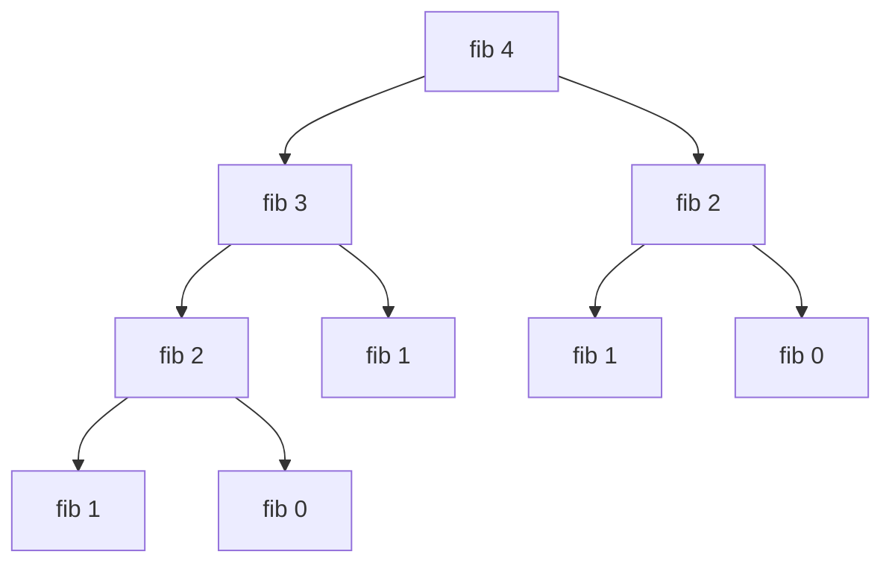
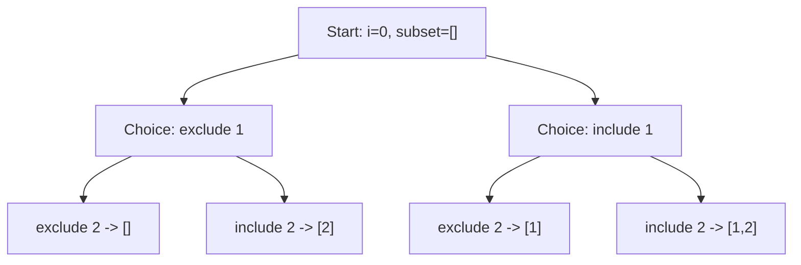
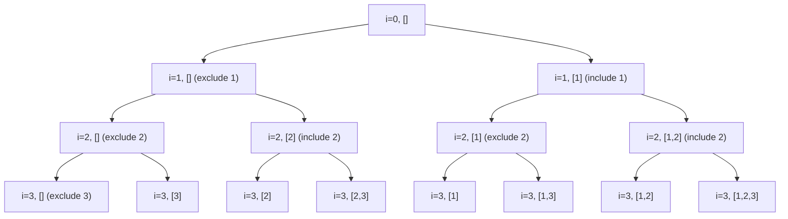
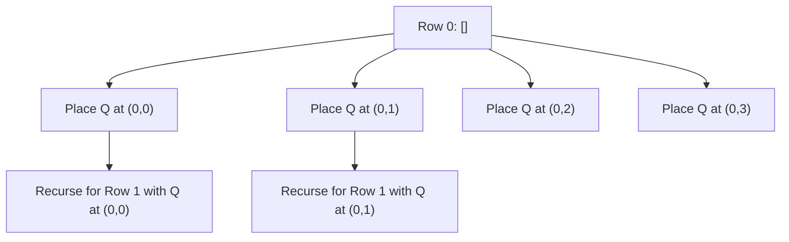
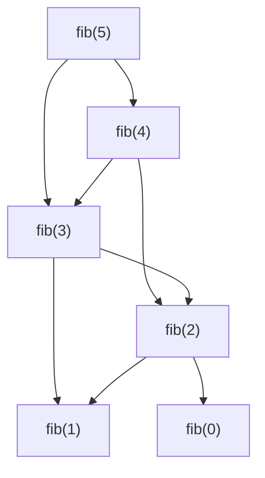
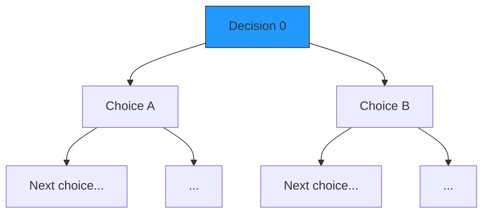

# 📚 Week_1_Day_5_Recursion_II_Instructional.md — Advanced Recursion Patterns

🗓 **Week:** 1 | 📅 **Day:** 5  
📌 **Topic:** Recursion II — Advanced Recursion Patterns  
⏱ **Duration:** ~75–90 minutes (reading) + practice  
🎯 **Difficulty:** 🟡🔴 Medium → Hard  
📚 **Prerequisites:**  
- Week 1 Day 1 — RAM Model & Pointers  
- Week 1 Day 2 — Asymptotic Analysis  
- Week 1 Day 3 — Space Complexity  
- Week 1 Day 4 — Recursion I (Call Stack & Basics)  

📊 **Interview Frequency (explicit):** Medium–High (~40–50%)  
📊 **Interview Frequency (implicit):** Very High (trees, backtracking, top‑down DP)

🏭 **Real-World Impact:** Advanced recursion powers **backtracking, search, parsing, and dynamic programming**. It is how real systems explore huge state spaces (games, compilers, constraint solvers) and how many interview “trick” problems are naturally expressed.

---

## 🎯 LEARNING OBJECTIVES

By the end of this file, you will:

✅ Recognize and use **advanced recursion patterns**: tree recursion, backtracking, mutual recursion, recursion + memoization, and tail recursion ideas  
✅ Trace backtracking algorithms with **state changes and undoing** (include/exclude pattern)  
✅ Understand **combinatorial explosion** (O(2^n), O(n!)) and when it is unavoidable  
✅ See how **top-down DP (recursion + memoization)** turns exponential recursion into polynomial time  
✅ Understand when to **prune recursion trees** to cut down search  
✅ Prepare for later topics: backtracking (Week 10), DP (Week 11), divide & conquer, graph DFS

---

## 🤔 SECTION 1: THE WHY (Motivation & Context)

Basic recursion (Week 1 Day 4) covers linear recursion like factorial or simple tree traversals. But many real problems are more complex:

- “Generate all subsets…”
- “Find all permutations…”
- “Place N queens on an N×N chessboard…”
- “Count paths in a grid with obstacles…”

These problems ask for **entire sets of solutions** over huge search spaces. Straightforward iterative approaches often become tangled or impossible to manage, while **advanced recursion** models them naturally.

### 💼 Real-World Problems This Solves

1. **Constraint Solving and Scheduling**

Organizations solve:

- Exam timetabling.
- Employee shift scheduling.
- Resource allocation (machines, CPUs, rooms).

Such problems can be phrased as:

> “Assign values to variables (timeslots, resources) such that constraints are satisfied.”

A backtracking recursive algorithm explores assignments:

- At each step:
  - Choose a variable.
  - Try a value.
  - Recursively assign the next variable.
  - If a constraint is violated, backtrack.

Real systems:

- Constraint programming engines.
- SAT/SMT solvers.
- Prolog-style logic programming.

Advanced recursion is the conceptual backbone: **searching a combinatorial tree of assignments with pruning.**

2. **Game AI and Move Search**

In games like chess, Go, or board puzzles:

- AI explores possible move sequences.
- Each move leads to a new **game state**.
- Recursively, each state leads to more states.

Algorithms like **minimax** and **alpha-beta pruning**:

- Recursively evaluate game trees.
- Depth-limited search to avoid infinite exploration.
- Prune branches that cannot change the outcome.

This is advanced recursion with:

- Tree depth as ply count.
- Branching factor as number of legal moves.
- Pruning to reduce complexity.

3. **Parsing and Language Processing**

Compilers and interpreters parse code using **recursive descent**:

- Grammar rules like:
  - `Expr = Term (+ Term)*`
  - `Term = Factor (* Factor)*`
  - `Factor = Number | (Expr)`

Recursive functions call each other (mutual recursion) to parse nested constructs:

- `parseExpr` calls `parseTerm`, which may call `parseFactor`, which may call `parseExpr` again for parentheses.

Understanding mutual recursion helps you reason about such parsers.

4. **Top-Down Dynamic Programming (Memoization)**

Many problems have overlapping subproblems:

- Fibonacci numbers.
- Grid path counting.
- Edit distance.

The naive recursive solution recomputes the same subproblem many times, leading to **exponential time**. Adding memoization:

- Store results for each subproblem in a cache.
- On subsequent calls, reuse stored value.

This transforms complexity from **exponential to polynomial**, while keeping code in recursive form.

5. **Generating Combinatorial Objects**

Tasks like:

- All subsets of a set.
- All permutations of a sequence.
- All combinations of k elements out of n.

These are inherently **exponential** (O(2^n) subsets, O(n!) permutations). Advanced recursion:

- Gives concise frameworks: choose/skip current element, swap positions, etc.
- Helps you structure and prune search.

### 🎯 Design Goals & Trade-offs

Advanced recursion aims to:

- Express **search over large trees** systematically.
- Encapsulate **choice, exploration, and backtracking**.
- Leverage **memoization** to avoid doing the same work twice.

Trade-offs:

- ✅ Expressive power: can express very complex searches succinctly.
- ✅ Better conceptual alignment with combinatorial problems.
- ❌ Potential for exponential time and stack depth.
- ❌ Complexity of reasoning about state changes and backtracking.
- ❌ Need for memoization or pruning to be practical.

### 📜 Historical Context (Brief)

- Early AI research (1950s–1970s) used recursive search (DFS, minimax) for games.
- Logic programming languages (e.g., Prolog) use recursion and backtracking as core mechanisms.
- Recursive descent parsing has been standard in compilers for decades.
- Memoization and dynamic programming grew out of recognizing overlap in recursive subproblems (Bellman’s work).

### 🎓 Interview Relevance

Advanced recursion pattern questions are classic:

- “Print all subsets/permutations.”
- “Solve N-Queens.”
- “Partition a string into palindromic substrings.”
- “Count ways to climb stairs with constraints.”

Interviewers want to see:

- Whether you can set up recursive state and base cases.
- Whether you can **backtrack correctly** (undo choices).
- Whether you understand **complexity growth** (e.g., O(2^n)).
- Whether you recognize when to add **memoization**.

---

## 📌 SECTION 2: THE WHAT (Core Concepts)

### 💡 Core Analogy

Imagine exploring a **maze with branches**:

- At each intersection:
  - You choose a direction.
  - Walk down that path.
  - If it leads to a dead end, you walk back to the intersection and try another direction.

Advanced recursion is like systematically exploring that maze:

- **Backtracking**: explore one path, back up, explore another.
- **Recursion tree**: each intersection is a node, each choice is an edge.
- **Pruning**: skipping paths that obviously cannot lead to a solution.

### 📌 Advanced Recursion Patterns

1. **Tree Recursion (Multiple Recursive Calls Per Function)**

- A function calls itself more than once per invocation.
- Example: naive Fibonacci:
  - `fib(n) = fib(n−1) + fib(n−2)`.
- Recursion tree branching factor > 1.

2. **Backtracking Recursion**

- Framework:
  - Make a choice.
  - Recursively explore.
  - Undo the choice (backtrack).
- Used for generating combinations, permutations, solving puzzles.

3. **Mutual Recursion**

- Two or more functions call each other recursively.
- Example:
  - `isEven(n)` calls `isOdd(n−1)`
  - `isOdd(n)` calls `isEven(n−1)`

4. **Recursion + Memoization (Top-Down DP)**

- Recursion tree with repeated subproblems.
- Add cache:
  - If result for subproblem already computed, reuse.
- Complexity becomes number of distinct subproblems.

5. **Tail Recursion (Conceptual)**

- Recursive call is last action in function.
- Allows some languages to optimize away stack growth.
- Example: tail-recursive sum with accumulator.

### 🎨 Visual Representation (Recursion Trees & State Space)

#### Tree Recursion Example (Fibonacci)

ASCII recursion tree for fib(4):

```
           fib(4)
          /      \
      fib(3)    fib(2)
      /   \      /   \
  fib(2) fib(1) fib(1) fib(0)
  /   \
fib(1) fib(0)
```

Notice repeated subproblems: fib(2), fib(1).

Mermaid version:



#### Backtracking State Space (Subsets)

Given [1,2], subsets recursion tree (include/exclude):



Leaves:
- []
- [2]
- [1]
- [1,2]

#### Backtracking State Model (ASCII)

At each recursion level:

```
function backtrack(i, currentSet):

Level 0: i = 0, currentSet = []
  → Level 1: exclude A[0] → currentSet = []
  → Level 1: include A[0] → currentSet = [A[0]]
```

The key invariant: after returning from a recursive call, **currentSet is restored** to its previous state.

### 📋 Key Invariants for Advanced Recursion

1. **State Restoration in Backtracking**

   - Any changes to state (like adding an element to current subset) must be **undone** when backtracking.
   - Ensures each branch explores from a correct starting state.

2. **No Recomputing in Memoized Recursion**

   - For each subproblem key (e.g., (i, currentSum)), we compute result at most once.
   - All subsequent visits reuse stored result.

3. **Finiteness of Recursion Tree**

   - Choices, depth, and pruning ensure recursion tree is finite.
   - Without this, recursion may diverge.

4. **Progress Measure**

   - For backtracking, typically the index `i` increases, or the partial solution grows until size `n`.

---

## ⚙ SECTION 3: THE HOW (Mechanics of Advanced Recursion)

### 📋 1. Backtracking Template (Logic, not Code)

Goal: systematically explore all combinations/assignments.

Core template (conceptual):

1. If we have reached a **complete state**:
   - Record a solution.
   - Return.

2. Otherwise:
   - Identify the next decision (e.g., next index, next position, next variable).
   - For each allowed choice:
     - Make the choice (update state).
     - Recursively explore further.
     - Undo the choice (restore state).

State is a combination of:

- Current position / index.
- Partial solution (e.g., current subset, partial permutation, partial board).
- Any additional information needed for pruning (e.g., used columns in N-Queens).

### ⚙ 2. Recursion + Memoization (Top-Down DP)

Template:

1. Represent subproblems with a **key** (tuple of parameters).
2. If key in cache:
   - Return cached result.
3. Else:
   - Compute result by recursing on smaller subproblems.
   - Store result in cache.
   - Return result.

This ensures each distinct subproblem is solved once.

### ⚙ 3. Mutual Recursion

Two functions:

- fA calls fB.
- fB calls fA.

Mechanics:

1. Inputs and base cases must be designed so that:
   - Each recursive call moves closer to ultimate base case.
   - No infinite ping-pong.

Example conceptual mutual recursion:

- isEven(n):
  - If n = 0: return true.
  - Else: return isOdd(n−1).
- isOdd(n):
  - If n = 0: return false.
  - Else: return isEven(n−1).

Each call reduces n by 1, ensuring termination.

### ⚙ 4. Tail Recursion (Conceptually)

A recursive function is tail-recursive if:

- The recursive call is the **last operation** in the function.
- There is no computation after recursion returns.

In some languages, tail calls can be optimized:

- No new stack frame; reuse current frame.
- Effectively constant stack usage.

Conceptual use:

- Turn `f(n)` into `fTail(n, accumulator)` where result is eventually `accumulator`.

Though not all languages optimize tail recursion, the pattern is intellectually useful.

### 🧱 Example: Backtracking for Subsets (Logical Steps)

Given array A[0..n−1], find all subsets:

1. Define recursive function `backtrack(i, currentSet)`.
2. Base case: if i == n:
   - Record currentSet as one subset; return.
3. Recursive case:
   - Option 1: exclude A[i]:
     - Call `backtrack(i+1, currentSet)`.
   - Option 2: include A[i]:
     - Add A[i] to currentSet.
     - Call `backtrack(i+1, currentSet)`.
     - Remove A[i] from currentSet (undo).

Invariant:

- At entry to `backtrack(i, currentSet)`, currentSet contains exactly the elements chosen from indices < i.

### 💾 State Management & Backtracking

Key idea: **undo what you do**:

- Add an element before recursion → remove it afterwards.
- Place a queen on a board before deeper recursion → remove it when backtracking.

Without proper undo, later branches see incorrect state.

---

## 🎨 SECTION 4: VISUALIZATION (Examples & Traces)

### 📌 Example 1: Generating Subsets (Backtracking)

Array: `[1, 2, 3]`.

We call `backtrack(0, [])`.

Recursion tree (Mermaid):



Leaf nodes (i=3) give final subsets:

- []
- [3]
- [2]
- [2,3]
- [1]
- [1,3]
- [1,2]
- [1,2,3]

ASCII subset generation trace for simpler `[1, 2]`:

```
backtrack(0, [])
  - Exclude 1 → backtrack(1, [])
      - Exclude 2 → backtrack(2, []) → record []
      - Include 2 → backtrack(2, [2]) → record [2]
  - Include 1 → currentSet = [1]
      - Exclude 2 → backtrack(1, [1]) then (2, [1]) → record [1]
      - Include 2 → backtrack(2, [1,2]) → record [1,2]
```

Notice how **include** modifies `currentSet`, and after returning, we must restore it.

---

### 📌 Example 2: N-Queens Partial Recursion Tree

Goal: Place N queens such that no two attack each other.

For N=4, we place queens row by row:

- State: current row r, columns in which queens are placed so far.

At each row:

- Try each column c:
  - If column and diagonals not attacked, place queen (r,c).
  - Recursively solve next row r+1.

Partial recursion tree for N=4 (Mermaid-style, rough sketch):



Some branches will fail early when no valid column is available. **Pruning**:

- We never explore placements that violate constraints.
- This can dramatically reduce actual search compared to naive O(N^N) or similar.

### 📌 Example 3: Naive vs Memoized Fibonacci

Naive recursion tree for fib(5):

```
          fib(5)
        /        \
    fib(4)      fib(3)
    /   \        /   \
 fib(3) fib(2) fib(2) fib(1)
 ...
```

We re-compute `fib(3)` and `fib(2)` many times.

With memoization:

- When fib(3) is computed once, store the result.
- Next time we need fib(3), use the stored value rather than recursing.

This collapses the recursion tree into a **DAG** of subproblems:



Each node is computed once.

### ❌ Counter-Example: Backtracking Without Undo

Imagine trying to generate subsets without removing the last element after recursion:

- `currentSet` keeps growing.
- Later recursive calls see incorrect `currentSet`.
- Final results contain incorrect or duplicated elements.

This violates the **state restoration invariant**.

---

## 📊 SECTION 5: CRITICAL ANALYSIS (Complexity & Correctness)

### Complexity Patterns for Advanced Recursion

Let n be input size:

- **Subsets generation:** 2 choices per element (include/exclude) → O(2^n) leaves.
- **Permutations:** n! permutations → O(n·n!) time typically.
- **Backtracking for N-Queens:** O(branch_factor^n), with pruning; theoretical worst-case exponential.
- **Naive Fibonacci recursion:** O(2^n) calls; fib(n) computed many times.
- **Memoized Fibonacci:** O(n) calls; each fib(k) computed once.

### Complexity Table (Representative Patterns)

| 📌 Pattern                         | ⏱ Time           | 💾 Space                | 📝 Notes                                              |
|-----------------------------------|------------------|-------------------------|------------------------------------------------------|
| Subsets (backtracking)            | O(2^n)           | O(n)                    | 2^n subsets, stack depth n.                          |
| Permutations                      | O(n·n!)          | O(n)                    | n! results; O(n) per permutation to construct.       |
| Naive Fibonacci                   | O(2^n)           | O(n)                    | Binary recursion tree, depth n.                      |
| Memoized Fibonacci                | O(n)             | O(n)                    | Each fib(k) computed once.                           |
| N-Queens backtracking             | Exponential      | O(n)                    | Pruned search; complexity depends on pruning power.  |
| Top-down DP over grid (m×n)       | O(m·n)           | O(m·n) or reduced       | Number of distinct subproblems.                      |

### Why Big-O May Not Tell Full Story

- **Exponential vs exponential with pruning:**  
  N-Queens complexity is exponential, but effective pruning can cut down many branches, making small N (like 8) manageable.

- **Memoization overhead:**  
  Adding hash maps or arrays for memoization uses extra space and constant time, so though asymptotically better, might be slower for small inputs.

- **Solution count:**  
  For generating all outputs (subsets, permutations), output size itself is exponential. Even the best algorithm cannot beat O(output_size) time, i.e., exponential.

### Correctness Arguments

Correctness of advanced recursion is often shown by:

- **Induction on depth or size**: similar to simple recursion.
- **Invariant reasoning**:
  - For backtracking: partial solution is always valid (no constraints violated).
  - For memoization: cached value is always equal to actual subproblem result.

---

## 🏭 SECTION 6: REAL SYSTEMS (Advanced Recursion in Practice)

### 🏭 System 1: SAT/SMT Solvers

- **Problem:** Decide satisfiability of boolean formulas with millions of variables.
- **Implementation:** Backtracking search with powerful heuristics and pruning:
  - Choose variable, assign true/false, recursively proceed.
  - If conflict arises, backtrack and try different assignments.
- **Impact:** Used in verification, synthesis, optimization across industry.

### 🏭 System 2: Game Engines & AI (Minimax, Alpha-Beta)

- **Problem:** Decide optimal moves in turn-based games.
- **Implementation:** Tree recursion:
  - Evaluate positions recursively to limited depth.
  - Use pruning (alpha-beta) to skip branches guaranteed to be worse.
- **Impact:** Underpins computer chess, Go programs (with enhancements like Monte Carlo Tree Search).

### 🏭 System 3: Compilers (Recursive Descent Parsing)

- **Problem:** Convert source code into parse trees / ASTs.
- **Implementation:**
  - One recursive function per grammar nonterminal.
  - Mutual recursion among parse functions.
- **Impact:** Many compilers (especially for simpler grammars) use this approach for clarity and extensibility.

### 🏭 System 4: Regex Engines (Backtracking Implementation)

- **Problem:** Match patterns in text.
- **Implementation (PCRE-style):** Backtracking recursion:
  - Try pattern branches, backtrack when mismatch occurs.
- **Impact:** Can handle complex patterns but may have worst-case exponential time; understanding recursion and pruning helps mitigate.

### 🏭 System 5: Pathfinding & Puzzle Solvers

- **Problem:** Solve puzzles (Sudoku, mazes), find paths with constraints.
- **Implementation:**
  - DFS with recursion and backtracking to step through moves.
- **Impact:** Many puzzle solvers and experimental AI prototypes use recursive backtracking.

### 🏭 System 6: Dynamic Programming APIs / Libraries

- **Problem:** Provide reusable tools for DP-based optimizations.
- **Implementation:** Sometimes expose top-down memoized recursion as a high-level interface.
- **Impact:** Developers can write recursive definitions; the library handles caching.

---

## 🔗 SECTION 7: CONCEPT CROSSOVERS

### 📚 Prerequisites

- Basic recursion (Recursion I).
- Big-O and space complexity.
- RAM model / call stack.

### 🔀 Dependent Topics

- **Week 4: Divide and Conquer Pattern**:
  - Quicksort, merge sort use tree recursion.
- **Week 6–7: DFS in Graphs**:
  - DFS is recursive or stack-based; backtracking is DFS over state spaces.
- **Week 10: Backtracking (Greedy & Backtracking Focus)**:
  - N-Queens, path enumeration.
- **Week 11: Dynamic Programming**:
  - Top-down DP = advanced recursion + memoization.
- **Week 13: Advanced Extensions**:
  - Many advanced techniques (profile DP, digit DP) start as recursive definitions.

### 🔄 Similar Concepts & Differences

- **Backtracking vs DFS:**
  - DFS on graphs: mostly exploring connectivity (reachability).
  - Backtracking: exploring choices under constraints, often building solutions.

- **Top-down DP vs Bottom-up DP:**
  - Top-down uses recursion + memo; natural to write.
  - Bottom-up uses loops and tables; often more efficient, but requires insight into order.

---

## 📐 SECTION 8: MATHEMATICAL (Formal Foundation)

### 📌 Tree Recursion and Exponential Growth

Consider a recurrence for naive Fibonacci:

- T(n) = T(n−1) + T(n−2) + O(1), with T(0), T(1) = O(1).

This recurrence behaves like the Fibonacci numbers themselves, leading to:

- T(n) = Θ(φ^n), where φ ≈ 1.618 (the golden ratio).
- Asymptotically O(2^n).

### 📐 Counting Nodes in Subset Recursion Tree

For n elements:

- Each element gives 2 choices (include/exclude).
- Tree has:
  - Depth n.
  - 2^n leaves (subsets).
  - Roughly 2^(n+1) − 1 total nodes.

Total operations ∝ total nodes → O(2^n).

### 📈 Memoization and Distinct Subproblems

For Fibonacci:

- Distinct subproblems: fib(k) for k in [0..n].
- With memoization:
  - Each fib(k) computed once → O(n).
- Similar logic for many DP problems:
  - Complexity = number of distinct (state) combinations.

### 🧮 Correctness via Induction for Backtracking

Claim: Backtracking subset generator yields all subsets exactly once.

Sketch:

- Base: n = 0 → only subset is [].
- Step: For n > 0:
  - Recursion on first n−1 elements yields all subsets of first n−1.
  - For each subset S of first n−1:
    - Excluding A[n−1] gives S.
    - Including A[n−1] gives S ∪ {A[n−1]}.
  - Total = 2 × (number of subsets of n−1) = 2^n.
  - Each subset of n either contains A[n−1] or not; both cases covered, none repeated.

---

## 💡 SECTION 9: ALGORITHMIC INTUITION (Decision Framework)

### 🎯 When to Use Advanced Recursion (Backtracking / Tree Recursion)

Use advanced recursion when:

- Problem asks for **all solutions** (subsets, permutations, paths).
- Constraints are complex but **checkable locally** (e.g., no collisions, validity of partial state).
- You can **prune** impossible branches early.
- There are **distinct subproblems** that can be cached (DP).

Indicators:

- “Find all…” or “count all ways…”
- “Subject to these constraints…”
- “Return all combinations/permutations/partitions…”

### ❌ When Not To

Avoid or be cautious when:

- n is large (e.g., 30–40) and search space is exponential with limited pruning.
- Recursion depth may exceed stack limits.
- A **greedy** or **DP** solution exists with polynomial complexity.

### 🔍 Interview Pattern Recognition

Red flags for backtracking:

- “Return all valid …”
- “Place objects with constraints (no attacking queens, no repeated characters, etc.).”
- “Search with constraints, stop when you find one or all solutions.”

Red flags for memoized recursion / top-down DP:

- Overlapping subproblems: same parameters recur (e.g., same index and partial value).
- Naive recursion revisits same state many times.

### 🎲 Decision Heuristics

- If problem is inherently combinatorial with required enumeration:
  - Accept exponential time; focus on clean backtracking recursion.
- If problem only asks for count or best value:
  - Look for overlapping subproblems → DP.
- If recursion depth is ~log n:
  - Recursion is safe and clean (divide-and-conquer).
- If recursion depth is ~n and n can be large:
  - Consider iterative transformation.

---

## ❓ SECTION 10: KNOWLEDGE CHECK (Deep Questions)

1. **For the subsets generation problem, why is O(2^n) time unavoidable if we must output every subset? How does this relate to the size of the output space?**  
2. **In N-Queens, what are typical pruning conditions? How do they reduce the size of the search tree, and how would you measure their effectiveness?**  
3. **Explain how memoization changes the recursion tree for Fibonacci. What invariant about subproblem computation must hold for memoization to be correct?**  
4. **Describe the key steps you would take to debug a backtracking solution that appears to be missing some solutions or generating duplicates. Which invariants would you check?**  
5. **Given a recursive definition with multiple recursive calls (branching factor b), how would you approximate the time complexity in terms of b and depth d? When does this lead to exponential behavior?**

---

## 🎯 SECTION 11: RETENTION HOOK (Memory Devices)

### 💎 One-Liner Essence

“**Advanced recursion explores a tree of choices—branching, pruning, and caching—to systematically search huge solution spaces.**”

### 🧠 Mnemonic Device

Acronym: **TREE**

- **T** – **T**ree of choices: recursion builds a decision tree.  
- **R** – **R**ecord and **R**estore state (backtracking).  
- **E** – **E**xponential growth (be aware).  
- **E** – **E**nhance with pruning and memoization.

Before writing advanced recursion, think **TREE**:

- What is my **Tree of choices**?  
- How do I **Record** decisions and **Restore** on backtrack?  
- Is the search space **Exponential**?  
- Can I **Enhance** with pruning or memoization?

### 📐 Visual Cue (Mermaid)



Picture this for any advanced recursion: a **tree of choices** expanding outwards; your job is to carefully traverse, prune, and optionally cache.

### 📖 Real Interview Story

An interviewer asks:

> “Given a set of integers, return all unique permutations.”

Candidate A:

- Tries to use nested loops and swapping without a clear plan.
- Code quickly becomes tangled, misses permutations, or repeats them.
- When asked about complexity, they give vague answers.

Candidate B:

- Recognizes backtracking pattern:
  - At index i, try each unused element as position i.
  - Recursively fix position i+1.
  - Use a set to avoid duplicates when elements repeat.
- Explains:
  - Base case: i == n → record permutation.
  - State: current permutation, used flags.
  - Complexity: O(n·n!) time, O(n) stack and state.

They also describe:

> “We can think of this as a recursion tree where each level chooses one position. There are n options for the first position, n−1 for the next, etc., leading to n! leaves.”

Interviewer is satisfied:

- Candidate B clearly understands advanced recursion, backtracking, and complexity.

---

## 🧩 5 COGNITIVE LENSES

### 🖥 Computational Lens

- **Stack depth** is crucial:
  - Backtracking recursion often has depth = n (e.g., subsets, permutations).
- **Branching factor**:
  - Each node in recursion tree may spawn multiple children.
- **Memoization**:
  - Trade time for memory; storing results in arrays/maps.
- **Cache locality**:
  - Recursion over contiguous structures (arrays) can have decent locality.
  - Backtracking with lots of small objects may have scattered memory, more cache misses.

### 🧠 Psychological Lens

- Students often fear advanced recursion because:
  - The recursion tree is hard to visualize.
  - State restoration (“undo”) is easy to get wrong.
- Helpful strategies:
  - Draw recursion trees for small inputs.
  - Trace a few paths and explicitly write down state changes and undos.
  - Use invariants: “current partial solution is always valid.”
- Memory aids:
  - Think in terms of “**choose, explore, un-choose**” for backtracking.
  - For memoization: “**check, compute, cache**.”

### 🔄 Design Trade-off Lens

- Backtracking vs brute force:
  - Both may be exponential; but backtracking with pruning drastically reduces real work.
- Memoized recursion vs bottom-up DP:
  - Top-down: easier to write, natural from recurrence, uses recursion stack.
  - Bottom-up: iterative, more control, may be more cache-friendly and avoid stack issues.
- Recursion vs explicit stacks:
  - Recursion simpler to express.
  - Explicit stacks avoid stack overflow and may give more control over order of exploration.

### 🤖 AI/ML Analogy Lens

- Search over hypothesis space:
  - Backtracking akin to exploring model configurations or hyperparameters.
- Decision trees:
  - Training can be seen as exploring splits recursively; though actual algorithms are iterative, conceptual structure is recursive.
- Dynamic programming:
  - Often described in terms of **Bellman equations** (recursive definitions).
  - Memoized recursion corresponds to solving Bellman equations top-down.

### 📚 Historical Context Lens

- Early AI (e.g., search in chess) used recursive DFS/Backtracking, long before modern ML.
- Prolog’s execution model is essentially recursion + backtracking.
- DP emerged as a way to tame exponential recursion by exploiting overlapping subproblems.
- Today:
  - Recursive search is still used in combinatorial optimization and exact solvers.
  - Many algorithm descriptions remain recursive, even if implementation uses loops.

---

## 🎁 SUPPLEMENTARY OUTCOMES

### ⚔ Practice Problems (8–10, no solutions)

1. **Subsets** (LeetCode 78 – 🟡 Medium)  
   🎯 Concepts: Backtracking, recursion tree, O(2^n) time.

2. **Permutations** (LeetCode 46 – 🟡 Medium)  
   🎯 Concepts: Backtracking with swapping, O(n·n!) time.

3. **Combination Sum** (LeetCode 39 – 🟡 Medium)  
   🎯 Concepts: Backtracking with pruning based on target sum.

4. **Palindrome Partitioning** (LeetCode 131 – 🟡 Medium)  
   🎯 Concepts: Backtracking with substring checks; recursion over indices.

5. **N-Queens** (LeetCode 51 – 🔴 Hard)  
   🎯 Concepts: Recursive search with complex constraints and pruning.

6. **Word Search** (LeetCode 79 – 🟡 Medium)  
   🎯 Concepts: DFS/backtracking on 2D grid, visited marking/unmarking.

7. **Restore IP Addresses** (LeetCode 93 – 🟡 Medium)  
   🎯 Concepts: Recursion over string partitions, pruning based on segment validity.

8. **Letter Combinations of a Phone Number** (LeetCode 17 – 🟢 Easy)  
   🎯 Concepts: Tree recursion over choices for each digit.

9. **Target Sum** (LeetCode 494 – 🟡 Medium)  
   🎯 Concepts: Recursion + memoization (top-down DP) over index and sum.

10. **Unique Paths II** (LeetCode 63 – 🟡 Medium)  
    🎯 Concepts: Recursive grid path counting with memoization.

---

### 🎙 Interview Q&A (6+ pairs)

**Q1:** How do you structure a backtracking solution to generate all subsets of a set?  
📢 **A:**  
I define a recursive function that makes a binary decision at each element: include or exclude. The function takes an index and a partial subset. At each step:

1. If the index reaches n (length of the set), the partial subset is a complete subset; record it.
2. Otherwise:
   - First, recurse without including the current element.
   - Then, add the current element to the partial subset, recurse, and finally remove it (undo) to restore state.

This creates a recursion tree of depth n with 2^n leaves, each representing a unique subset. The key invariants are that the index always moves forward and the partial subset is correctly restored after each recursive call.

🔀 **Follow-up 1:** What is the time and space complexity of this approach?  
🔀 **Follow-up 2:** How would you modify it to generate only subsets of a particular size k?

---

**Q2:** Explain how memoization improves a naive recursive solution for a problem like Fibonacci.  
📢 **A:**  
Naive recursion recomputes the same subproblems many times; fib(n) calls fib(n−1) and fib(n−2), and each of those calls repeats work. Memoization adds a cache (for example, a map keyed by n). When the function is called:

1. If the result for the current n is already cached, we return it immediately.
2. Otherwise, we compute it via recursion, store the result in the cache, and return it.

This ensures each fib(k) is computed only once, reducing time complexity from O(2^n) to O(n). The recursion tree collapses into a DAG where each node (subproblem) is processed once. Space complexity becomes O(n) for the cache plus O(n) stack depth.

🔀 **Follow-up 1:** How would you generalize this to a two-parameter DP (e.g., grid paths with coordinates (i,j))?  
🔀 **Follow-up 2:** When might bottom-up DP be preferable to memoized recursion?

---

**Q3:** What are the key steps to implement a backtracking algorithm correctly?  
📢 **A:**  
I follow a “choose–explore–un-choose” pattern:

1. **Base case:** Detect when we have a complete solution (e.g., processed all indices, filled all positions) and record or count it.
2. **Choice generation:** At each step, list all possible choices (e.g., which element to place next, which value to assign).
3. **Choose:** Apply a choice by updating the state (add element, mark position, assign value).
4. **Explore:** Recursively call the function to continue building the solution.
5. **Un-choose:** Undo the choice (remove element, unmark position) to restore the previous state before trying the next choice.

Correctness hinges on always restoring state and ensuring that each branch explores a valid partial solution without interference from previous branches.

🔀 **Follow-up 1:** How do you integrate pruning into this framework?  
🔀 **Follow-up 2:** Give an example where failing to un-choose leads to incorrect results.

---

**Q4:** In problems like N-Queens, how does pruning affect the search space and complexity?  
📢 **A:**  
Without pruning, placing queens naïvely at each row and trying all columns yields an enormous search space (roughly n^n placements). Pruning cuts off branches where constraints are violated early:

- When placing a queen at (row, col), we mark that column and diagonals as attacked.
- Future rows only consider columns that are not attacked.
- If at some row no column is valid, we immediately backtrack.

This avoids exploring the full combinatorial space; many partial placements are never extended. Although the theoretical worst-case complexity remains exponential, in practice pruning can reduce the number of explored states by many orders of magnitude, making small n (e.g., n=8) tractable.

🔀 **Follow-up 1:** How would you efficiently track which columns and diagonals are attacked?  
🔀 **Follow-up 2:** Can you think of an example where over-aggressive pruning might remove valid solutions?

---

**Q5:** Why is recursion with memoization often easier to write than bottom-up DP, and what trade-offs does it involve?  
📢 **A:**  
Recursion with memoization starts from the natural recursive definition of the problem: “solution for state S depends on solutions for smaller states S1, S2, …”. You simply implement that definition, adding memoization to cache results. This is intuitive and mirrors mathematical recurrences.

Bottom-up DP requires you to:

- Identify all states.
- Determine an order in which to fill them so that dependencies are satisfied.
- Manage table indices and boundaries.

While bottom-up can be more efficient (less stack usage, often better locality), top-down is often quicker to write and less error-prone. The trade-offs are:

- Top-down uses recursion and may risk stack overflow on deep problems.
- Top-down may have slightly higher overhead per state due to function calls and cache lookups.
- Bottom-up is iterative, more explicit but sometimes harder to derive.

🔀 **Follow-up 1:** Give a problem where top-down is much easier to write than bottom-up.  
🔀 **Follow-up 2:** How could tail recursion play into this if the language supports tail-call optimization?

---

**Q6:** How would you detect overlapping subproblems in a recursive solution?  
📢 **A:**  
I look at the recursion tree or at the function’s parameters:

1. Identify the parameters that uniquely define a subproblem (e.g., indices, remaining capacity, partial sum).
2. Examine whether the same combination of parameters can be reached through different recursive paths.
3. Draw or mentally simulate a small recursion tree and check for repeated nodes.

If the same parameter combination appears at multiple nodes, there are overlapping subproblems. This is a strong signal that memoization or DP can reduce complexity. In contrast, purely combinatorial enumeration (like generating all subsets) often has each leaf representing a unique object, and overlapping subproblems may not be present in the same way.

🔀 **Follow-up 1:** Provide a concrete example of overlapping subproblems in a grid path counting problem.  
🔀 **Follow-up 2:** How would you design a key for memoization for such a problem?

---

### ⚠ Common Misconceptions (3–5)

1. **❌ Misconception:** “Backtracking is just DFS; if I know DFS, I know backtracking.” 
   🧠 **Why:** Both traverse trees/graphs recursively.  
   ✅ **Reality:** Backtracking additionally requires **state management and undoing**. You often maintain and revert partial solutions, which DFS in graphs may not require in the same way.  
   💡 **Memory aid:** Think “DFS + UNDO = Backtracking.”

2. **❌ Misconception:** “Memoization always improves performance significantly.” 
   🧠 **Why:** Students see dramatic improvements in examples like Fibonacci.  
   ✅ **Reality:** Memoization helps **only when there is significant overlap**. If each recursive call explores unique states (like generating all permutations), memoization offers little or no benefit and adds overhead.  
   💡 **Memory aid:** “Cache only helps when you **reuse**.”

3. **❌ Misconception:** “Pruning never changes correctness; it only speeds things up.” 
   🧠 **Why:** They equate pruning with harmless optimization.  
   ✅ **Reality:** Incorrect pruning conditions can cut off valid solutions. You must guarantee that any pruned branch **cannot** contain a solution.  
   💡 **Memory aid:** “Prune only dead branches; never prune maybe-alive ones.”

4. **❌ Misconception:** “If recursion is exponential, the algorithm is always useless in practice.” 
   🧠 **Why:** Exponential sounds impossibly large.  
   ✅ **Reality:** For small n (like 10–20), exponential algorithms are often acceptable, especially when the problem requires enumerating all solutions.  
   💡 **Memory aid:** “Exponential is fine when the **output itself** is exponential.”

---

### 📈 Advanced Concepts (3–5)

1. **Branch and Bound**

   🎓 Prerequisite: Backtracking.  
   🔗 Extends: Backtracking with cost bounds (pruning based on current best solution).  
   💼 Use when: Optimization problems (e.g., TSP) where you want the best solution, not all.

2. **Iterative Deepening DFS**

   🎓 Prerequisite: DFS/recursion.  
   🔗 Relates to: Depth-limited recursion, repeated with increasing depth limits.  
   💼 Use when: Memory constraints and need for optimal solution depth.

3. **Meet-in-the-Middle (Week 10, optional)**

   🎓 Prerequisite: Tree recursion and exponential patterns.  
   🔗 Relates to: Splitting problem into two halves, using recursion on each, then combining.  
   💼 Use when: Reducing complexity from O(2^n) to O(2^(n/2)).

4. **Memoized Search on Graphs (DFS + DP)**

   🎓 Prerequisite: Graph DFS and memoization.  
   🔗 Relates to: Solving problems on DAGs with recursion + caching.  
   💼 Use when: Counting paths, longest path in DAG, etc.

5. **Functional Recursion Patterns (Map/Fold)**

   🎓 Prerequisite: Basic recursion and functional thinking.  
   🔗 Relates to: Abstracting recursion into higher-order functions.  
   💼 Use when: Writing composable, high-level code in functional languages.

---

### 🔗 External Resources (3–5)

1. 🔗 **“Backtracking” chapter in “Algorithms” by Sedgewick & Wayne**  
   🎥 Type: 📖 Book  
   💡 Value: Clear introduction to backtracking, permutations, and N-Queens.  
   📊 Difficulty: Intermediate.

2. 🔗 **MIT 6.006 / 6.046 Lectures on Recursion and DP**  
   🎥 Type: 🎥 Video lectures  
   💡 Value: Great visual explanations of recursion trees, memoization, and DP.  
   📊 Difficulty: Intermediate–Advanced.

3. 🔗 **TopCoder / Codeforces tutorials on Backtracking and DP**  
   🎥 Type: 📝 Online tutorials  
   💡 Value: Competitive programming-oriented: many examples and patterns.  
   📊 Difficulty: Intermediate.

4. 🔗 **“Introduction to Algorithms” (CLRS) – Chapters on DP and Backtracking**  
   🎥 Type: 📖 Book  
   💡 Value: Formal approaches to recursive problem solving, with proofs and complexity.  
   📊 Difficulty: Advanced.

5. 🔗 **VisuAlgo – Recursion, Backtracking, DP Visualization**  
   🎥 Type: 🛠 Interactive tool  
   💡 Value: See recursion trees, call stacks, and DP tables animated.  
   📊 Difficulty: Beginner–Intermediate.

---