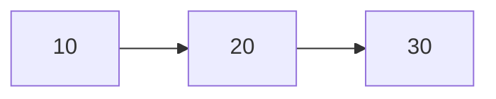
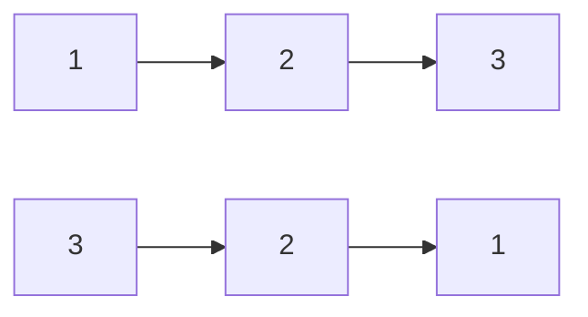

# 📚 Week_2_Day_3_Linked_Lists_Instructional.md — Linked Lists & Pointer-Based Linear Structures

🗓 **Week:** 2 | 📅 **Day:** 3  
📌 **Topic:** Linked Lists — Singly, Doubly, Circular & Memory Behavior  
⏱ **Duration:** ~75–90 minutes (reading) + practice  
🎯 **Difficulty:** 🟡 Medium  
📚 **Prerequisites:**  
- Week 1 (RAM model, Big-O, space complexity, recursion I)  
- Week 2 Day 1–2 (Arrays, Dynamic Arrays)  

📊 **Interview Frequency:** High (~35–45% directly or as building blocks)  

🏭 **Real-World Impact:** Linked lists are the canonical **pointer-based** linear structure. They reveal how data structures behave when elements are scattered in memory, how pointer manipulation works, and why cache behavior matters. They are heavily used in low-level systems (OS kernels, memory allocators) and as components of higher-level designs (LRU caches, adjacency lists).

---

## 🤔 SECTION 1: THE WHY (Motivation & Context)

Arrays are great for random access and dense storage, but:

- They have **fixed or costly capacity**.
- Inserting/removing in the middle is **O(n)** due to shifting.
- They require **contiguous memory** for all elements.

Sometimes you need a structure that:

- Grows and shrinks frequently at arbitrary positions.
- Does not require one big contiguous block.
- Supports fast insertion/removal given a position.

Linked lists achieve this by:

- Storing elements in **independent nodes**.
- Connecting them with pointers (`next`, optionally `prev`).
- Allowing local modifications:
  - Insert or remove by updating a few pointers.

### 💼 Real-World Problems This Solves

1. **Intrusive Lists in Operating Systems**

In OS kernels (e.g., Linux):

- Processes, tasks, and file descriptors are often managed in **intrusive linked lists**:
  - Each object (task struct) contains `next` and `prev` pointers.
  - These lists are used for:
    - Ready queues.
    - Timer lists.
    - Resource tracking.

Why linked lists?

- Fast insertion/removal given a pointer to the node (O(1)).
- No need to move whole objects; only pointer fields are updated.
- No requirement for contiguous storage; nodes can live anywhere in memory.

2. **LRU Caches & Doubly Linked Lists**

In an LRU (Least Recently Used) cache:

- We want to:
  - Move accessed elements to the front of a list.
  - Remove the least recently used (at the tail).
- Implementation pattern:
  - Hash map from key → node.
  - Doubly linked list of nodes ordered by recency.

Linked list advantages:

- Given node (from hash map), remove it from list and insert at front in O(1):
  - Update 2–4 pointers only.
- No shifting or copying; nodes stored individually.

3. **Memory Allocators (Free Lists)**

Allocators in runtimes and OS:

- Maintain **free lists** of available blocks.
- Each free block is part of a linked list of free memory.
- When allocating:
  - Remove a node from free list.
- When freeing:
  - Add node back to free list.

Linked lists here:

- Allow flexible insertion/removal without moving blocks.
- Represent fragmented free memory without contiguous requirement.

4. **Chaining in Hash Tables**

Chaining in hash tables:

- Each bucket is typically a linked list (or vector) of entries.
- Insert:
  - Add new entry to list at bucket index (O(1) given head).
- Delete:
  - Remove node from list with pointer to previous (O(1)).

Though modern code often favors vectors, linked lists were historically standard for chaining and still appear.

5. **Functional & Persistent Data Structures**

In functional languages:

- Immutable singly linked lists are ubiquitous.
- Prepending (cons) is O(1):
  - Create new node pointing to existing list.
- Persistent: old lists remain valid.

This highlights a conceptual side of linked lists that goes beyond typical imperative usage.

### 🎯 Design Goals & Trade-offs

Linked lists aim to:

- Support **O(1) insertion/deletion** at known locations (head, or given node).
- Decouple physical memory layout from logical order.
- Enable data structures where elements move logically without moving in memory.

Trade-offs:

- ❌ **No O(1) random access**: accessing ith element is O(i).
- ❌ **Poor cache locality**: nodes may be scattered → more cache misses.
- ❌ Extra **pointer overhead** per node (memory & pointer chasing).
- ✅ Great for **mutable** sequences with frequent insert/delete inside the list.
- ✅ Allow **intrusive design** (pointers stored in existing objects).

### 🎓 Interview Relevance

Linked list questions are classic:

- Reverse a linked list.
- Detect a cycle (fast & slow pointers).
- Merge two sorted linked lists.
- Remove the Nth node from the end.
- Find intersection of two linked lists.

Interviewers use them to test:

- Pointer reasoning and invariants.
- Edge case handling (empty, single-node, head/tail updates).
- Understanding of **time-space trade-offs** vs arrays.

---

## 📌 SECTION 2: THE WHAT (Core Concepts)

### 💡 Core Analogy

Think of linked list nodes as **train cars**:

- Each car has a box (value) and a coupler (pointer) linking to the next car.
- The train (list) is defined by its head (first car).
- To insert/remove a car, you **uncouple and recouple** cars; you do not pick up the entire train.

### 📌 Types of Linked Lists

1. **Singly Linked List**

- Each node:
  - Holds a value.
  - Holds a pointer to the next node (`next`).
- Last node’s `next` is null (or special sentinel).

2. **Doubly Linked List**

- Each node:
  - Holds a value.
  - Next pointer (`next`) and previous pointer (`prev`).
- Allows traversal in both directions.
- Easier O(1) removal when given a node pointer.

3. **Circular Linked List**

- Last node’s `next` points back to head (or some sentinel).
- Possibly doubly circular (prev of head points to tail).

### 🎨 Visual Representation (ASCII)

#### Singly Linked List

```
head
  |
  v
+-----+-----+    +-----+-----+    +-----+-----+
| 10  |  o-----> | 20  |  o-----> | 30  | null|
+-----+-----+    +-----+-----+    +-----+-----+
 value  next       value  next       value next
```

#### Doubly Linked List

```
head
  |
  v
null  <---+     +-----+-----+-----+     +-----+-----+-----+     +-----+-----+-----> null
          |     |prev | val | next|     |prev | val | next|     |prev | val | 
          +---> |null | 10  |  o------> | o   | 20  |  o------> | o   | 30  |
                +-----+-----+-----+     +-----+-----+-----+     +-----+-----+
```

### 🎨 Mermaid Diagram — Singly List



Where arrows represent `next` pointers.

### 📋 Key Properties & Invariants

1. **Node Linking Invariant**

   - For singly list:
     - Starting from head and following `next` pointers eventually reaches null (no cycles) unless intentionally circular.
   - For doubly list:
     - For each node:
       - `node.next.prev == node` (if next exists).
       - `node.prev.next == node` (if prev exists).

2. **Head/Tail References**

   - `head` always points to first node (or null if empty).
   - `tail` (if tracked) points to last node (for fast append).

3. **Size Property (If Maintained)**

   - `size` equals number of nodes reachable from `head`.

4. **No Random Access**

   - To reach the ith node, you must follow `i` `next` pointers.

---

## ⚙ SECTION 3: THE HOW (Mechanics)

We describe the **logic** (not language syntax) for operations.

### 📋 1. Traversal

Goal: visit each node once, starting from head.

Steps:

1. Set `current` = `head`.
2. While `current` is not null:
   - Process `current.value`.
   - Move `current` = `current.next`.

Time: O(n).  
Space: O(1) extra.

### 📋 2. Insert at Head (Singly List)

To insert new node with value x at head:

1. Create node `newNode` with `value = x`.
2. Set `newNode.next = head`.
3. Update `head = newNode`.
4. If list was empty, also update `tail = newNode` (if tail tracked).

Time: O(1).

### 📋 3. Insert After a Given Node (Singly)

Given a pointer `node` in the list (not null):

1. Create `newNode` with value x.
2. Set `newNode.next = node.next`.
3. Set `node.next = newNode`.
4. If `node` was tail, update `tail = newNode`.

Time: O(1).

**Note:** If you only know the index, you must first traverse to that node (O(n)).

### 📋 4. Delete After a Given Node (Singly)

Given pointer `node` (not tail):

1. Let `toDelete = node.next`.
2. Set `node.next = toDelete.next`.
3. If `toDelete` was tail, update `tail = node`.
4. Optionally free `toDelete` or allow GC.

Time: O(1).

Delete at head:

1. If head is null: nothing to delete.
2. Else:
   - `toDelete = head`.
   - `head = head.next`.
   - If list becomes empty, `tail = null`.

### 📋 5. Doubly Linked List — Insert Between Nodes

Given `prevNode` and `nextNode` (e.g., inserting between them):

1. Create `newNode` with value x.
2. Set `newNode.prev = prevNode`.
3. Set `newNode.next = nextNode`.
4. If `prevNode` not null: `prevNode.next = newNode`.
5. If `nextNode` not null: `nextNode.prev = newNode`.
6. If inserting at head:
   - `head = newNode`.
7. If inserting at tail:
   - `tail = newNode`.

Removal of a node `node`:

1. If `node.prev` not null: `node.prev.next = node.next`.
2. Else: `head = node.next`.
3. If `node.next` not null: `node.next.prev = node.prev`.
4. Else: `tail = node.prev`.

Time: O(1) given node pointer.

### 💾 State Management & Invariants

For each operation:

- **Traversal:** `current` moves along the chain; we must ensure `current` eventually becomes null for terminating recursion/iteration if list is acyclic.
- **Insert/Delete:** We must maintain:
  - Correct `next` and `prev` relationships.
  - `head` and `tail` consistent (no dangling references).
  - Size (if maintained) updated accordingly.

### ⚠ Edge Case Handling

- Empty list (head = null):
  - Inserting at head: new node becomes both head and tail.
  - Deleting from head: nothing to delete.
- Single-node list:
  - Removing the only node: head and tail become null.
  - Inserting before/after carefully updates head/tail.
- Deleting node at boundaries (head or tail):
  - Special handling for null prev or null next.

---

## 🎨 SECTION 4: VISUALIZATION (Examples & Traces)

### 📌 Example 1: Insert at Head (Singly List)

Start with list: 20 → 30 → null.

ASCII:

```
head
  |
  v
+-----+-----+    +-----+-----+
| 20  |  o-----> | 30  | null|
+-----+-----+    +-----+-----+
```

Insert 10 at head:

1. newNode(10); newNode.next = head.
2. head = newNode.

Result:

```
head
  |
  v
+-----+-----+    +-----+-----+    +-----+-----+
| 10  |  o-----> | 20  |  o-----> | 30  | null|
+-----+-----+    +-----+-----+    +-----+-----+
```

Time: O(1).

---

### 📌 Example 2: Delete Node in Middle (Singly List)

List: 10 → 20 → 30 → 40 → null.

We want to delete node with value 30, given pointer to previous node (20).

Before:

```
head
  |
  v
+-----+-----+    +-----+-----+    +-----+-----+    +-----+-----+
| 10  |  o-----> | 20  |  o-----> | 30  |  o-----> | 40  | null|
+-----+-----+    +-----+-----+    +-----+-----+    +-----+-----+
```

Operation:

1. toDelete = node20.next (node30).
2. node20.next = toDelete.next (node40).

After:

```
head
  |
  v
+-----+-----+    +-----+-----+    +-----+-----+
| 10  |  o-----> | 20  |  o-----> | 40  | null|
+-----+-----+    +-----+-----+    +-----+-----+
```

Node 30 is now *unlinked* and can be freed/GC’d.

---

### 📌 Example 3: Doubly Linked List Removal

List: 10 ⇄ 20 ⇄ 30.

ASCII:

```
null <-+    +-----+-----+-----+    +-----+-----+-----+    +-----+-----+-----+ -> null
       |    |prev | val | next|    |prev | val | next|    |prev | val | next|
       +--> |null | 10  |  o------>| o   | 20  |  o------>| o   | 30  | null|
            +-----+-----+-----+    +-----+-----+-----+    +-----+-----+-----+
                     ^                                      
                     |  node to remove (20)
```

Removing 20:

1. node20.prev.next = node20.next → node10.next = node30.
2. node20.next.prev = node20.prev → node30.prev = node10.

Result:

```
null <-+    +-----+-----+-----+    +-----+-----+-----+ -> null
       |    |prev | val | next|    |prev | val | next|
       +--> |null | 10  |  o------>| o   | 30  | null|
            +-----+-----+-----+    +-----+-----+-----+
```

---

### 📌 Example 4: Singly List Reverse

List: 1 → 2 → 3 → null.

Goal: reverse to 3 → 2 → 1 → null.

We maintain pointers:

- `prev`, `current`, `next`.

Trace:

1. Initially:
   - prev = null, current = head (1).
2. Step:
   - next = current.next (2).
   - current.next = prev (null).  // 1 → null
   - prev = current (1).
   - current = next (2).

After first step:

```
prev: 1 → null

current: 2 → 3 → null
```

3. Step:
   - next = 3.
   - current.next = prev (1).  // 2 → 1 → null
   - prev = 2.
   - current = 3.

4. Step:
   - next = null.
   - current.next = prev (2).  // 3 → 2 → 1 → null
   - prev = 3.
   - current = null.

At end, `prev` points to new head: 3 → 2 → 1 → null.

Mermaid diagram (simplified):



---

### ❌ Counter-Example: Losing the List Head During Reverse

Common bug:

- Setting `current.next = prev` **before** saving `current.next` in `next`.
- Without storing original next pointer, you lose reference to remaining list.
- After rewriting `current.next`, you have no path to nodes beyond current.

Correct pattern:

1. next = current.next (save).
2. current.next = prev (reverse link).
3. Move prev, current forward using saved next.

---

## 📊 SECTION 5: CRITICAL ANALYSIS (Complexity & Trade-offs)

### 📈 Complexity Table — Singly Linked List

Assume operations given head (and tail, if maintained) and, for some operations, a pointer to node or previous node.

| 📌 Operation                         | ⏱ Time          | 💾 Aux Space | 📝 Notes                                           |
|-------------------------------------|-----------------|-------------|---------------------------------------------------|
| Access by index i                   | O(i)            | O(1)        | Traverse from head, following `next` pointers     |
| Insert at head                      | O(1)            | O(1)        | Just change head (and tail if empty)             |
| Insert after given node             | O(1)            | O(1)        | Update a couple of pointers                       |
| Insert at tail (with tail pointer)  | O(1)            | O(1)        | Append and update tail                            |
| Delete at head                      | O(1)            | O(1)        | Move head forward                                 |
| Delete after given node             | O(1)            | O(1)        | Update `next` pointers                            |
| Search for value                    | O(n)            | O(1)        | Must traverse list                                |
| Reverse list                        | O(n)            | O(1)        | Single pass with pointer rewiring                 |

### Trade-offs vs Arrays

- Arrays:
  - O(1) random access; O(n) middle insert/delete.
- Linked lists:
  - O(n) random access; O(1) insert/delete given node.

For many general-purpose tasks:

- Arrays/dynamic arrays are better due to locality and good constants.
- Linked lists shine when you have **direct node pointers** and many insert/delete operations scattered in the list.

### Cache Behavior

- Linked list traversal:
  - Each node may reside in a different cache line.
  - Pointer chasing leads to more cache misses compared to contiguous array traversal.
- Doubly linked lists:
  - Even more pointer fields → slightly higher memory overhead.

---

## 🏭 SECTION 6: REAL SYSTEMS (Linked Lists in Practice)

### 🏭 System 1: Linux Kernel `list_head`

- **Usage:** Manage lists of tasks, file descriptors, timers.
- **Implementation:** Intrusive doubly linked lists:
  - Each struct embeds a `list_head` linking it into lists.
- **Impact:** O(1) insert/delete given node; no extra allocation.  
  Kernels rely heavily on these for performance-critical path.

### 🏭 System 2: LRU Cache Implementations

- **Usage:** Web caches, DB page caches, OS page replacement.
- **Implementation:**
  - Doubly linked list for recency order.
  - Hash map for key → node mapping.
- **Impact:** Efficient O(1) move-to-front and eviction from tail.

### 🏭 System 3: Memory Allocators

- **Usage:** Manage free blocks in runtime or OS.
- **Implementation:**
  - Free lists as singly/doubly linked lists.
- **Impact:** O(1) insertion/removal of free blocks; no shifting.

### 🏭 System 4: Chaining in Hash Tables

- **Usage:** Resolve collisions via chaining.
- **Implementation:** Each bucket holds a (possibly small) linked list of entries.
- **Impact:** Simple, robust; though many modern systems prefer arrays or open addressing, linked lists remain a canonical method.

### 🏭 System 5: Text Editors / Undo Histories (Conceptually)

- **Usage:** Store edit operations in sequences.
- **Implementation:** Some editors use linked lists of operations to allow O(1) insertion of new edits and traversal backward/forward for undo/redo.

### 🏭 System 6: Functional Language Runtimes

- **Usage:** Immutable lists (cons lists).
- **Implementation:** Singly linked lists where:
  - New list = new head node pointing to existing tail list.
- **Impact:** Enable persistent data structures and structural sharing.

---

## 🔗 SECTION 7: CONCEPT CROSSOVERS

### 📚 Prerequisites

- Arrays & dynamic arrays (Week 2 Day 1–2).
- RAM model (Week 1): know what pointers and scattered allocations mean.

### 🔀 Dependents

- **Stacks & Queues (Week 2 Day 4):**
  - Implementable using linked lists (linked stacks/queues).
- **Hash Tables (Week 3):**
  - Chaining representation.
- **Graphs (Weeks 6–7):**
  - Adjacency lists can be implemented with linked lists (less common now than vectors but historically significant).
- **Two-pointer / Fast & Slow Pointers (Week 4.5 / Week 13):**
  - Cycle detection, middle node finding in linked lists.

### 🔄 Linked List vs Dynamic Array vs Tree

- **LL vs Dynamic Array:**
  - LL: better for insertion/deletion given node; worse for random access and cache.
  - Dynamic array: better for indexing; worst-case O(n) for mid insert/delete but amortized O(1) append.
- **LL vs Balanced Tree:**
  - Tree: O(log n) search/insert/delete; pointer-based, but more overhead; good for ordered operations.
  - LL: O(n) search; O(1) local modifications.

---

## 📐 SECTION 8: MATHEMATICAL (Formal Foundation)

### 📌 Formal Model of Singly Linked List

Let each node be a pair (value, nextIndex), where:

- `value` in some set V.
- `nextIndex` is either:
  - Index of next node in some global array of nodes, or
  - A special null marker.

A list is defined by:

- An index `headIndex` (or null).
- A finite sequence of nodes `(v0, v1, ..., v_{n-1})` such that:
  - headIndex points to node with value v0.
  - Following `nextIndex` pointers from v0 yields v1, then v2, etc.
  - last node’s nextIndex is null.

### 📐 Access Cost for kth Element

To retrieve the value at position k (0-based):

- We start from head and follow `next` pointers:

  - Steps: 1 to reach node 0, 2 to reach node 1, ..., k+1 to reach node k.

Thus:

- Time complexity T(k) = O(k).

In worst-case (k = n−1):

- T(n−1) = O(n).

### 📈 List Length Calculation

To compute length of list:

- Traverse from head until null.
- Number of steps equals n, the number of nodes.

This gives:

- Time complexity O(n).
- No way to do better without maintaining a separate `size` field.

---

## 💡 SECTION 9: ALGORITHMIC INTUITION (Decision Framework)

### 🎯 When to Use Linked Lists

Use linked lists when:

- You must frequently insert or delete **given a node reference**, especially near head or tail.
- Memory is fragmented and contiguous allocation of large arrays is difficult (low-level systems).
- You want intrusive structures where objects manage their own list pointers.
- The list is not huge and random access is not required.

Typical interview scenarios:

- Implement LRU cache (doubly linked list + hash map).
- Implement queue or stack using linked list.
- Reverse a linked list or manipulate pointers.

### ❌ When Not to Use Linked Lists

Avoid linked lists when:

- You need frequent random access by index.
- You require hot loops over large sequences (cache locality matters).
- Language environment or GC overhead makes many small allocations expensive.

Here, arrays/dynamic arrays are typically better.

### 🔍 Interview Pattern Recognition

Red flags that linked lists are the intended structure:

- Problem description includes:
  - Node with `next` or `prev`.
  - Pointer to head; operations to add/remove nodes.
- Problem explicitly states:
  - “Given the head of a linked list…”
- Operations:
  - Reversal, reordering nodes, partitioning around value, finding cycles.

### 🎲 Quick Decision Rules

- Need O(1) insertion/deletion given node? → Linked list (or something more advanced).
- Need O(1) random access and frequent indexing? → Arrays/dynamic arrays.
- Need LRU-style movement by pointer? → Doubly linked list + map.

---

## ❓ SECTION 10: KNOWLEDGE CHECK (Deep Questions)

1. **Explain why linked lists provide O(1) insertion and deletion given a node pointer, but only O(n) access by index. Include the underlying memory structure in your explanation.**  
2. **Compare the cache behavior of arrays and linked lists when traversing all elements. How does this influence your data structure choice in performance-critical code?**  
3. **In an LRU cache implementation, why is a doubly linked list used instead of a singly linked list? What operations become simpler or more efficient?**  
4. **Describe how you would detect a cycle in a singly linked list using fast and slow pointers. What are the time and space complexities, and why?**  
5. **If you maintain a `size` field in a linked list structure, how does this affect the complexity of computing the length? What invariants must be maintained to keep `size` correct?**

---

## 🎯 SECTION 11: RETENTION HOOK (Memory Devices)

### 💎 One-Liner Essence

“**Linked lists are chains of scattered nodes connected by pointers, trading O(1) local updates for O(n) indexing and weaker cache locality.**”

### 🧠 Mnemonic Device

Acronym: **CHAIN**

- **C** – **C**ars on a train: nodes linked one after another.  
- **H** – **H**ead and tail pointers define list ends.  
- **A** – **A**ccess by index is slow (O(n)), must walk the chain.  
- **I** – **I**nsertion/deletion at a node is O(1) if you have the pointer.  
- **N** – **N**on-contiguous memory (scattered nodes).

Whenever you see a linked list, think **CHAIN**: a chain of nodes, great for local edits, slow for index-based access.

### 📐 Visual Cue (ASCII)

Picture a chain of boxes:

```text
head
  |
  v
[ val |  o ]-->[ val |  o ]-->[ val |  o ]--> null
```

Each “o” is a link to the next box; to reach the last box, you follow links step by step.

### 📖 Real Interview Story

An interviewer asks:

> “Reverse a singly linked list in-place.”

Candidate A:

- Tries to allocate a new list and copy elements.
- Uses extra memory, O(n) space.
- Doesn’t fully understand in-place pointer manipulation.

Candidate B:

- Explains the standard iterative pointer reversal:
  - Maintain `prev`, `current`, `next`.
  - At each step: save `next`, set `current.next = prev`, move `prev` and `current` forward.
- Handles edge cases:
  - Empty list (head null).
  - Single-node list.
- Analyzes:
  - Time: O(n).
  - Space: O(1).
- Draws a small diagram showing pointer changes.

Interviewer sees:

- Candidate B understands **how linked lists work at the pointer level**, not just conceptually.

---

## 🧩 5 COGNITIVE LENSES

### 🖥 Computational Lens

- Each node is a separate structure in memory, referenced by a pointer:
  - Access involves dereferencing pointers, possibly causing cache misses.
- Traversal:
  - O(n) pointer dereferences, scattered addresses.
- Insert/delete given node:
  - Only local pointer updates; no bulk copying, good for large lists where memory movement is expensive.
- Comparisons vs arrays:
  - Arrays use base+offset arithmetic; fewer pointer indirections and better locality.

### 🧠 Psychological Lens

- Students often misunderstand:
  - “Linked lists make everything O(1)” — not true; only local operations with pointers are O(1).
  - “Linked lists are always better for insertion” — only if insertion positions are known (via pointer) or if typically near head.
- Mental model pitfalls:
  - Losing track of head/tail after operations.
  - Forgetting to update both directions in doubly lists (next and prev).
- Helpful strategies:
  - Always draw small diagrams when reasoning about pointer updates.
  - Use invariants:
    - “List remains connected.”
    - “Head and tail are consistent.”

### 🔄 Design Trade-off Lens

- Memory overhead:
  - Each node stores at least one pointer; this increases memory use and can harm cache.
- Time vs flexibility:
  - Arrays: better for read-heavy and index-heavy workloads.
  - Linked lists: better for mutate-heavy, pointer-local operations.
- Implementation complexity:
  - Linked list logic for insert/delete is more error-prone than array index operations.

### 🤖 AI/ML Analogy Lens

- Linked lists directly rarely appear in ML model implementations, but:
  - Graph-like or tree-like recursive structures conceptually resemble linked nodes.
  - Computation graphs in deep learning frameworks are DAGs of nodes with pointers to children; conceptually a generalization of linked structures.
- Data loading:
  - Queues or buffers for streaming data could be implemented as linked lists, but arrays often preferred for throughput.

### 📚 Historical Context Lens

- Linked lists are one of the earliest dynamic data structures studied.
- Classic CS education heavily emphasized linked lists as a first pointer-based structure.
- Over time, many high-performance systems have moved toward array-based or hybrid structures due to cache efficiency.
- Nonetheless, linked lists remain fundamental in teaching, OS kernels, and certain specialized structures (intrusive lists, LRU lists, persistent lists).

---

## 🎁 SUPPLEMENTARY OUTCOMES

### ⚔ Practice Problems (8–10)

1. **Reverse Linked List** (LeetCode 206 – 🟢 Easy)  
   🎯 Concepts: In-place reversal, pointer manipulation, O(n) time, O(1) space.

2. **Reverse Linked List II** (LeetCode 92 – 🟡 Medium)  
   🎯 Concepts: Reverse sublist between positions m and n; careful pointer handling.

3. **Merge Two Sorted Lists** (LeetCode 21 – 🟢 Easy)  
   🎯 Concepts: Merging via pointers, stable merging, re-linking nodes.

4. **Remove Nth Node From End of List** (LeetCode 19 – 🟡 Medium)  
   🎯 Concepts: Two-pointer technique, single-pass, edge cases at head.

5. **Linked List Cycle** (LeetCode 141 – 🟡 Medium)  
   🎯 Concepts: Cycle detection with fast and slow pointers; O(n) time, O(1) space.

6. **Linked List Cycle II** (LeetCode 142 – 🟡 Medium)  
   🎯 Concepts: Find cycle start using fast/slow pointers and math.

7. **Intersection of Two Linked Lists** (LeetCode 160 – 🟡 Medium)  
   🎯 Concepts: Shared tail nodes, pointer synchronization, O(n) time, O(1) space.

8. **Palindrome Linked List** (LeetCode 234 – 🟡 Medium)  
   🎯 Concepts: Reverse second half, compare halves, restore list if needed.

9. **Rotate List** (LeetCode 61 – 🟡 Medium)  
   🎯 Concepts: Making list circular, breaking at correct position.

10. **Remove Duplicates from Sorted List** (LeetCode 83 – 🟢 Easy)  
    🎯 Concepts: Single pass, pointer relinking, managing duplicates.

---

### 🎙 Interview Q&A (6+ pairs)

**Q1:** Why is insertion or deletion in a linked list O(1) given a pointer to the node, but O(n) when given an index?  
📢 **A:**  
Given a pointer to a node (or its predecessor), insertion or deletion only requires updating a constant number of pointers—no shifting of elements. This is O(1). However, if we are given an index, we must walk from head through `next` pointers until we reach that position, which takes O(n) time. The linked list does not provide a direct way to jump to the ith node the way an array does. Thus, the cost of the full operation is dominated by the traversal to find the node, not the pointer updates.

🔀 **Follow-up 1:** How does this compare to arrays for insertion and deletion at arbitrary positions?  
🔀 **Follow-up 2:** What if we frequently insert at the head—how do arrays and lists compare?

---

**Q2:** What are the advantages of a doubly linked list over a singly linked list?  
📢 **A:**  
A doubly linked list allows traversal in both directions (`next` and `prev`) and supports O(1) deletion of a node given only a pointer to that node. In a singly linked list, to delete a node, you typically need a pointer to its predecessor, which may require traversal from head. Doubly lists make operations like remove-from-tail or move-node-to-front easier and more efficient, which is why they are used in LRU caches and many intrusive list implementations. The trade-off is extra memory for the `prev` pointer and slightly more complex insertion/deletion logic.

🔀 **Follow-up 1:** In what scenarios is the additional memory overhead justified?  
🔀 **Follow-up 2:** Could you simulate some doubly list operations with a singly list and what would be the cost?

---

**Q3:** How does the cache behavior of linked lists differ from arrays, and why does it matter?  
📢 **A:**  
Arrays store elements contiguously, so iterating over them accesses memory sequentially. This works well with CPU caches and prefetching, resulting in fewer cache misses and high throughput. Linked lists store nodes scattered across memory; each node access involves a pointer dereference to an unpredictable address. This leads to more cache misses and lower effective throughput—even though both traversals are O(n) in Big-O terms, arrays are often significantly faster in practice. In performance-critical code, this difference can be decisive when choosing data structures.

🔀 **Follow-up 1:** How would you empirically demonstrate this difference?  
🔀 **Follow-up 2:** Are there list variants or hybrid structures that improve locality?

---

**Q4:** Describe how you would detect a cycle in a singly linked list and find its starting point.  
📢 **A:**  
To detect a cycle, use the fast and slow pointer technique:

1. Initialize two pointers, slow and fast, to head.
2. Move slow by one step and fast by two steps at a time.
3. If fast or fast.next becomes null, there is no cycle.
4. If slow and fast ever meet, a cycle exists.

To find the start of the cycle:

1. Once slow and fast meet, place one pointer at head and keep the other at the meeting point.
2. Advance both by one step at a time; where they meet again is the start of the cycle.

Time complexity is O(n); space is O(1). The correctness follows from analyzing distances traveled along the cycle and the non-cycle part.

🔀 **Follow-up 1:** Why does moving both pointers at the same speed from head and meeting point give the cycle start?  
🔀 **Follow-up 2:** Could you accomplish this with extra space instead? What would be the complexity?

---

**Q5:** What is an intrusive linked list and why might a system like the Linux kernel use it instead of a non-intrusive list?  
📢 **A:**  
An intrusive linked list stores the list pointers (next, prev) **inside** the objects being linked, rather than in separate node wrappers. For example, a process control block struct might contain `list_head` fields that link it into various lists. This avoids separate node allocations, saves memory (fewer allocations and overhead), and improves locality because the object and its link metadata are in the same memory block. Systems like the Linux kernel use intrusive lists to reduce overhead and maintain tight control over memory and performance.

🔀 **Follow-up 1:** What are the trade-offs or downsides of intrusive lists?  
🔀 **Follow-up 2:** How does this compare to typical high-level language list implementations?

---

**Q6:** Why are linked lists still taught and used when arrays or dynamic arrays dominate many practical use cases?  
📢 **A:**  
Linked lists are fundamental for understanding pointer-based data structures, memory layout, and how local updates can be O(1) even when arrays require O(n) shifting. They appear in core domains like OS design, memory allocators, and certain caches. Conceptually, they also model persistent and functional data structures (e.g., cons lists). Even if arrays are often more practical for many tasks, linked lists teach essential skills: reasoning about pointer invariants, detecting cycles, and understanding trade-offs in memory and performance. These concepts generalize to more sophisticated data structures (trees, graphs, skip lists).

🔀 **Follow-up 1:** Give an example where linked lists are clearly preferable to arrays.  
🔀 **Follow-up 2:** How do linked lists help in designing more advanced structures, like trees?

---

### ⚠ Common Misconceptions (3–5)

1. **❌ Misconception:** “Linked lists make insertion and deletion always O(1).”  
   ✅ **Reality:** They are O(1) **only when you already have a pointer** to the relevant node (or its predecessor). Finding that node by index or value is O(n).  
   💡 **Memory aid:** “Fast to cut if you’re already there; slow to walk there.”

2. **❌ Misconception:** “Linked lists are always better than arrays for insertions.”  
   ✅ **Reality:** For small n or rare insertions, arrays may be faster due to better cache usage and lower overhead. Linked lists pay pointer overhead and poor locality.  
   💡 **Memory aid:** “Few surgeries? Use arrays; many surgeries with known positions? Use lists.”

3. **❌ Misconception:** “Doubly linked list operations are just like singly, only with more pointers, so no big deal.”  
   ✅ **Reality:** It’s easier to make bugs; you must consistently maintain two directions. Forgetting to update one side can corrupt the list.  
   💡 **Memory aid:** “Two-way streets need twice the signs.”

4. **❌ Misconception:** “Cycle detection requires storing all visited nodes in a set.”  
   ✅ **Reality:** Fast & slow pointers detect cycles in O(n) time and O(1) space, often preferred in interviews.  
   💡 **Memory aid:** “Two runners on a circular track eventually meet.”

---

### 📈 Advanced Concepts (3–5)

1. **Skip Lists**

   - Multi-level linked lists providing O(log n) search.
   - Probabilistic alternative to balanced trees.

2. **Unrolled Linked Lists**

   - Each node stores an array of elements instead of a single element.
   - Trade-off between locality (arrays) and flexibility (lists).

3. **XOR Linked Lists** (for completeness, mostly academic)

   - Store XOR of prev and next pointers to save memory.
   - Harder to implement and debug; rarely used in production now.

4. **Persistent Linked Lists**

   - Immutable lists with structural sharing (functional languages).
   - O(1) cons; older versions preserved.

5. **Linked List + Array Hybrids**

   - Combining arrays and linked lists (e.g., deque structures, rope data structures).

---

### 🔗 External Resources (3–5)

1. 🔗 **“Computer Systems: A Programmer’s Perspective” (CS:APP)**  
   🎥 Type: 📖 Book  
   💡 Value: Explains pointers, linked structures, and memory behavior clearly.

2. 🔗 **“Algorithms” (Sedgewick & Wayne)**  
   🎥 Type: 📖 Book + lectures  
   💡 Value: Linked lists, stacks, queues implementations and analyses.

3. 🔗 **Linux Kernel Documentation: `list_head` API**  
   🎥 Type: 📝 Docs / Source  
   💡 Value: Real-world intrusive doubly linked list macros and usage.

4. 🔗 **MIT 6.006 Lectures on Data Structures**  
   🎥 Type: 🎥 Video  
   💡 Value: Introduces linked lists and compares them with arrays.

5. 🔗 **Wikipedia: Linked List**  
   🎥 Type: 📝 Article  
   💡 Value: Overview, variants, and complexity summary.
