# 📚 Week_2_Day_4_Stacks_And_Queues_Instructional.md — LIFO & FIFO Linear Structures

🗓 **Week:** 2 | 📅 **Day:** 4  
📌 **Topic:** Stacks & Queues — LIFO/FIFO Patterns & Implementations  
⏱ **Duration:** ~75–90 minutes (reading) + practice  
🎯 **Difficulty:** 🟡 Medium  
📚 **Prerequisites:**  
- Week 1: RAM Model, Asymptotic Analysis, Space Complexity, Recursion I/II  
- Week 2: Arrays, Dynamic Arrays, Linked Lists  

📊 **Interview Frequency:** Very High (~50–60% directly or as core sub-patterns)  

🏭 **Real-World Impact:** Stacks and queues are **core scheduling and traversal primitives**. They underlie call stacks, undo/redo, expression evaluation, BFS, OS schedulers, and message queues. Recognizing them in problems is critical for designing correct and efficient algorithms.

---

## 🤔 SECTION 1: THE WHY (Motivation & Context)

Arrays and linked lists give you generic “sequences”. But many problems are not about arbitrary access; they’re about **strict disciplines** on how items are added and removed:

- **Undo/redo** in editors: last action undone first → LIFO.
- **CPU call stack**: last function called returns first → LIFO.
- **Print queues / request queues**: first request should be served first → FIFO.
- **Breadth-first search**: process nodes in order of discovery → FIFO.

Stacks and queues **encode these disciplines**:

- Stack → “last in, first out” (LIFO).
- Queue → “first in, first out” (FIFO).

### 💼 Real-World Problems This Solves

1. **Function Calls & Recursion (Call Stack)**

When you call a function:

- Its local variables and return address are pushed onto a **call stack**.
- When the function returns:
  - Its frame is popped.
- Nested calls produce a stack of frames:
  - The last function called must finish before earlier ones resume.

Without the stack discipline:

- You couldn’t safely resume callers in reverse order of invocation.
- Recursion would be impossible to implement.

Understanding stacks explains:

- Recursion limits.
- Stack overflow.
- Why recursion and stacks are deeply linked.

2. **Undo/Redo in Editors and IDEs**

Text editors, drawing tools, IDEs:

- Keep a history of actions:
  - Insert char, delete line, move object.
- When user presses Undo:
  - The most recent action is reversed.

This is stack behavior:

- **Undo stack:** push each action as it happens; pop to undo.
- **Redo stack:** after undo, move action to redo stack; pop to redo.

Stacks provide:

- Simple, O(1) push/pop semantics.
- Natural LIFO undo model.

3. **Task Scheduling & Request Handling**

Servers, OS schedulers, print servers, routers:

- Often maintain **queues** of tasks or messages:
  - Requests are added at the end.
  - Processed in order of arrival.

Examples:

- HTTP server request queue.
- OS ready queue for processes.
- Print spooler queue.

Queues enforce fairness:

- “First come, first served.”
- Important in systems where order matters for fairness or correctness.

4. **Breadth-First Search & Level-Order Processing**

In graphs and trees:

- BFS explores nodes **level by level**.
- Implementation uses a **queue**:
  - Enqueue neighbors as discovered.
  - Dequeue nodes in order of discovery.

Without queue semantics:

- You might not get shortest paths in unweighted graphs.
- Level-order traversal of a tree would be cumbersome.

5. **Expression Evaluation & Parsing**

Stacks shine in:

- Evaluating expressions in Reverse Polish Notation (RPN).
- Converting infix to postfix (shunting-yard algorithm).
- Checking balanced parentheses and operators.

Stack behavior matches nested structures:

- On seeing an opening symbol or operator, push.
- On seeing a closing symbol or needing to reduce, pop.

### 🎯 Design Goals & Trade-offs

Stacks aim to:

- Provide **O(1)** push and pop at one end.
- Model **nested, LIFO** behavior.

Queues aim to:

- Provide **O(1)** enqueue at one end (rear) and dequeue at the other (front).
- Model **FIFO** behavior.

Trade-offs:

- ✅ Conceptually simple (clear invariants).
- ✅ Fast operations with minimal overhead.
- ❌ Restricted access: only top (stack) or front/back (queue).
- ❌ Random access is not provided (you’d use array or list for that).

### 🎓 Interview Relevance

Stacks & queues appear:

- Explicitly:
  - “Implement a stack with O(1) min.”
  - “Implement queue using two stacks.”
  - “Design circular queue.”
- Implicitly:
  - BFS (queue).
  - DFS recursion vs explicit stack.
  - Valid parentheses / next greater element (stack).
  - Sliding window maximum (deque queue variant).

Interviewers use them to test:

- Your **recognition** of patterns (LIFO vs FIFO).
- Your understanding of **array vs linked list** implementations.
- Your ability to handle **edge cases and invariants**.

---

## 📌 SECTION 2: THE WHAT (Core Concepts)

### 💡 Core Definitions

- **Stack (LIFO):**  
  Abstract data type supporting operations:
  - `push(x)` — add element x to top.
  - `pop()` — remove and return top element.
  - `top()` / `peek()` — read top element without removing.
  - `isEmpty()` — check if stack has elements.

  Property: the last element pushed is the first popped.

- **Queue (FIFO):**  
  Abstract data type supporting operations:
  - `enqueue(x)` — add element x to back.
  - `dequeue()` — remove and return front element.
  - `front()` / `peek()` — read front element without removing.
  - `isEmpty()` — check if queue has elements.

  Property: elements are processed in the order they were added.

### 🎨 Visual Representation (ASCII)

#### Stack (LIFO)

Think of a pile of plates:

```
   top
    |
   [ 30 ]   ← pushed last
   [ 20 ]
   [ 10 ]   ← bottom (pushed first)
```

- Push: place new item on top.
- Pop: remove item from top.

#### Queue (FIFO)

Think of a line at a ticket counter:

```
front                        back
  |                            |
 [10] <- [20] <- [30] <- [40]
   dequeued first      enqueued last
```

- Enqueue: add at back.
- Dequeue: remove from front.

### 🎨 Mermaid Diagrams

Stack:

```mermaid
flowchart TB
    S3[30 (top)] --> S2[20] --> S1[10 (bottom)]
```

Queue:


### 📋 Key Invariants

**Stack Invariant:**

- Elements form a sequence.
- `top` is the last inserted element not yet popped.
- After k pushes and k pops (assuming no underflow), stack returns to original state.

**Queue Invariant:**

- Elements form a sequence.
- `front` is the oldest element not yet dequeued.
- `back` is the most recently enqueued element.
- Elements leave in the exact order they entered.

---

## ⚙ SECTION 3: THE HOW (Mechanics)

Stacks and queues are **abstract**; implementations often use:

- Arrays / dynamic arrays.
- Linked lists.
- Circular buffers (for queues).

We’ll describe logic, not code.

### 📋 Stack Implementations

#### Array-Based Stack

State:

- `array` with capacity C.
- `topIndex` indicating next free position (or index of top).

Operations:

- `push(x)`:
  1. If `topIndex == capacity`: grow (if dynamic).
  2. `array[topIndex] = x`.
  3. `topIndex++`.

- `pop()`:
  1. If `topIndex == 0`: underflow (empty stack).
  2. `topIndex--`.
  3. Return `array[topIndex]`.

- `peek()`:
  1. If empty: error.
  2. Return `array[topIndex-1]`.

Time (ignoring resizes): O(1) per operation.

#### Linked-List-Based Stack

State:

- Singly linked list.
- `head` points to top of stack.

Operations:

- `push(x)`:
  1. Create new node with value x.
  2. newNode.next = head.
  3. head = newNode.

- `pop()`:
  1. If head is null: underflow.
  2. toDelete = head.
  3. head = head.next.
  4. Return toDelete.value.

Time: O(1) per operation, but more overhead per node.

---

### 📋 Queue Implementations

#### Linked-List-Based Queue

State:

- Singly linked list with `head` (front) and `tail` (back).

Operations:

- `enqueue(x)`:
  1. Create new node with value x.
  2. If tail is not null: tail.next = newNode.
  3. Else: head = newNode.
  4. tail = newNode.

- `dequeue()`:
  1. If head is null: underflow.
  2. toDelete = head.
  3. head = head.next.
  4. If head is null: tail = null.
  5. Return toDelete.value.

Time: O(1) per operation.

#### Array-Based Circular Queue

Naively, using a plain array with front index 0, we’d need to shift on each dequeue → O(n). Instead, we use a **circular buffer**.

State:

- `array` with capacity C.
- `headIndex` — index of current front.
- `tailIndex` — index of position to insert next element.
- `size` — number of elements.

Indices wrap around using modulo C.

Operations:

- `enqueue(x)`:
  1. If size == capacity: overflow (or grow).
  2. `array[tailIndex] = x`.
  3. `tailIndex = (tailIndex + 1) mod C`.
  4. `size++`.

- `dequeue()`:
  1. If size == 0: underflow.
  2. value = `array[headIndex]`.
  3. `headIndex = (headIndex + 1) mod C`.
  4. `size--`.
  5. Return value.

- `front()`:
  1. If size == 0: error.
  2. Return `array[headIndex]`.

All O(1) time.

### 🎨 Circular Queue ASCII Example

Capacity = 5.

Initially:

```
Indices: 0    1    2    3    4
Array:  [ ]  [ ]  [ ]  [ ]  [ ]
headIndex = 0, tailIndex = 0, size = 0
```

Enqueue 10, 20, 30:

- After 10:
  - array[0] = 10; tail=1; head=0; size=1
- After 20:
  - array[1] = 20; tail=2; head=0; size=2
- After 30:
  - array[2] = 30; tail=3; head=0; size=3

Dequeue:

- value = array[0] (10); head=1; size=2.

Enqueue 40, 50, 60:

- After 40:
  - array[3] = 40; tail=4; head=1; size=3.
- After 50:
  - array[4] = 50; tail=(4+1) mod 5=0; head=1; size=4.
- After 60:
  - array[0] = 60; tail=1; head=1; size=5 (full).

Visual:

```
Indices:   0    1    2    3    4
Values:   [60] [20] [30] [40] [50]
headIndex = 1 (front=20), tailIndex = 1 (next free wraps)
```

---

## 🎨 SECTION 4: VISUALIZATION (Examples & Traces)

### 📌 Example 1: Evaluating RPN Expression with Stack

Expression: `2 1 + 3 *` (equivalent to (2+1)*3 = 9).

Algorithm (conceptual):

- Use a stack of numbers.
- Scan tokens left to right:
  - If token is a number: push onto stack.
  - If token is an operator (+,−,*,/):
    - Pop top two numbers (b, then a).
    - Compute a operator b.
    - Push result.

Trace:

1. Token 2: push 2 → stack: [2]
2. Token 1: push 1 → stack: [2,1]
3. Token +:
   - Pop b=1, a=2 → compute 2+1=3 → push 3.
   - Stack: [3].
4. Token 3: push 3 → stack: [3,3].
5. Token *:
   - Pop b=3, a=3 → compute 3*3=9 → push 9.
   - Stack: [9].

End: top of stack = 9.

Mermaid depiction:

```mermaid
flowchart TD
    S0[ ] --> S1[[2]]
    S1 --> S2[[2,1]]
    S2 --> S3[[3]]   %% after +
    S3 --> S4[[3,3]]
    S4 --> S5[[9]]   %% after *
```

---

### 📌 Example 2: BFS with Queue

Graph with nodes A, B, C, D, edges:

- A–B, A–C, B–D, C–D.

We perform BFS starting from A.

Algorithm (conceptual):

1. Initialize queue with A, mark A visited.
2. While queue not empty:
   - Dequeue node u.
   - For each neighbor v of u:
     - If not visited:
       - Mark visited, enqueue v.

Trace:

- Initially: queue = [A].
- Dequeue A:
  - Visit neighbors B, C.
  - Mark B, C visited; enqueue them → queue = [B, C].
- Dequeue B:
  - Neighbors: A, D.
  - A already visited; D not → mark D, enqueue D → queue = [C, D].
- Dequeue C:
  - Neighbors: A, D.
  - Both visited; nothing to add → queue = [D].
- Dequeue D:
  - Neighbors: B, C, both visited; queue becomes empty.

Traversal order: A, B, C, D.

Mermaid queue flow:

```mermaid
flowchart LR
    Q0[Queue: A] --> Q1[Dequeue A, Enqueue B,C → Queue: B,C]
    Q1 --> Q2[Dequeue B, Enqueue D → Queue: C,D]
    Q2 --> Q3[Dequeue C → Queue: D]
    Q3 --> Q4[Dequeue D → Queue: empty]
```



---

### 📌 Example 3: Browser Back/Forward using Two Stacks

Concept:

- **Back stack** — pages you navigated from.
- **Forward stack** — pages you can go forward to.

Operations:

- Visit new page P:
  - Push current page to back stack.
  - Clear forward stack.
  - Set current = P.
- Back:
  - Push current page to forward stack.
  - Pop from back stack → new current.
- Forward:
  - Push current page to back stack.
  - Pop from forward stack → new current.

This pattern is a classic two-stack usage.

ASCII snapshot:

```
Back stack (top on right): [Page1, Page2]
Current: Page3
Forward stack: [Page4]
```

---

### ❌ Counter-Example: Naive Queue Using Array Without Wrapping

If you implement queue with:

- `frontIndex` always 0.
- `tailIndex` increments and you never reuse freed slots.

After many dequeues:

- `tailIndex` grows indefinitely.
- Effective capacity is reached prematurely.
- You’ll run out of array even though there are many unused slots at front.

Circular buffer fixes this by wrapping indices modulo capacity.

---

## 📊 SECTION 5: CRITICAL ANALYSIS (Complexity & Trade-offs)

We consider well-designed implementations:

- Stacks: array or linked list.
- Queues: linked list or circular buffer.

### 📈 Complexity Table — Stack & Queue (Good Implementations)

| 📌 Operation               | Stack (Array or LL) | Queue (LL or Circular Array) | 💾 Aux Space | 📝 Notes                            |
|---------------------------|---------------------|------------------------------|-------------|-------------------------------------|
| push / enqueue            | O(1) amortized      | O(1)                         | O(1)        | Array stack has occasional resize   |
| pop / dequeue             | O(1)                | O(1)                         | O(1)        | Constant-time pointer/index moves   |
| peek (top/front)          | O(1)                | O(1)                         | O(1)        | Just read top/front element         |
| search by value           | O(n)                | O(n)                         | O(1)        | Must scan all elements              |
| isEmpty                   | O(1)                | O(1)                         | O(1)        | Check size counter                  |

### Performance & Implementation Details

- **Array-based stack:**
  - Best for dense, bounded or dynamically growing sequences.
  - Great locality and constant factors.
- **Linked-list-based stack:**
  - Useful when number of elements huge or dynamic and you don’t want contiguous big allocations.
  - Overhead per node (pointer, allocation).

- **Linked-list queue:**
  - Simple; only pointer arithmetic.
- **Circular array queue:**
  - Highly performant in systems code; avoids per-node allocation.
  - Ideal when capacity can be fixed or bounded.

### When Big-O Is Not Enough

- In practice, array-based implementations are often faster due to cache locality and less pointer chasing.
- Linked list queues or stacks pay per-node allocation overhead and sometimes extra GC pressure.

---

## 🏭 SECTION 6: REAL SYSTEMS (Stacks & Queues in Practice)

### 🏭 System 1: CPU Call Stack

- **Usage:** Store function call frames.
- **Structure:** Stack in memory growing down/up depending on architecture.
- **Impact:** Recursion limits, stack overflows, unwinding on exceptions.
- **Why stack:** Last called function must return first; LIFO matches natural control flow.

### 🏭 System 2: OS Ready Queues & Job Queues

- **Usage:** Scheduler queues ready processes/threads.
- **Structure:** Usually some form of queue or multiple queues (multi-level feedback).
- **Impact:** Order of execution, fairness, time-slicing.
- **Why queue:** Processes that arrived earlier (or are more urgent) need to be scheduled in order.

### 🏭 System 3: Message Queues & Broker Systems (Kafka, RabbitMQ, SQS)

- **Usage:** Store messages between producers and consumers.
- **Structure:** Persistent queues; often log + index, but semantics are queue-like.
- **Impact:** Decoupling, backpressure, reliability.
- **Why queue:** First messages enqueued should be processed first unless logic dictates otherwise.

### 🏭 System 4: Undo/Redo Stacks in Editors & IDEs

- **Usage:** Track command history.
- **Structure:** Two stacks (undo & redo).
- **Impact:** User experience; ability to revert/redo operations.
- **Why stack:** Last operation must be reverted first.

### 🏭 System 5: BFS in Graph Libraries

- **Usage:** Level-order traversal, shortest path in unweighted graphs.
- **Structure:** Queue for frontier of nodes.
- **Impact:** Core to algorithms in networking, routing, social network analysis.
- **Why queue:** Strict FIFO ensures processing in increasing distance order.

### 🏭 System 6: Web Server Request Handling

- **Usage:** Incoming HTTP requests buffered in queues.
- **Structure:** OS/network queues, server-side request queues.
- **Impact:** Latency, throughput, fairness.
- **Why queue:** Ensures first-come-first-served semantics.

---

## 🔗 SECTION 7: CONCEPT CROSSOVERS

### 📚 Prerequisites

- Arrays & dynamic arrays: basis for array-backed stacks & queues.
- Linked lists: basis for linked implementations.
- Recursion: uses stack implicitly; can be replaced with explicit stack.

### 🔀 Dependents

- **Week 4: Two Pointers & Sliding Window:**
  - Often operate on array windows; stacks sometimes used in monotonic stack problems.
- **Week 4.5: Monotonic Stack Pattern:**
  - Stack variant used in next greater element, largest rectangle in histogram.
- **Weeks 6–7: Graph Traversals:**
  - DFS uses stack (often recursion), BFS uses queue.
- **Priority Queues (Heaps):**
  - Conceptually a queue ordered by priority; built on array with heap semantics.

### 🔄 Stack vs Queue vs Deque vs Priority Queue

- **Stack:** LIFO access; one end only.
- **Queue:** FIFO access; front & back.
- **Deque:** Double-ended queue; push/pop at both ends.
- **Priority Queue:** Always remove highest/lowest priority; internal heap.

Knowing which discipline fits your problem is crucial.

---

## 📐 SECTION 8: MATHEMATICAL (Formal Foundation)

### 📌 Stack as ADT

Stack S over universe U is defined by:

- A set of sequences over U.
- Operations:
  - `push(S, x)` → S′ = S ∘ x (append x at end).
  - `pop(S)` → (x, S′), where S = S′ ∘ x and x is last element.
- Invariant:
  - If we record sequence of pushes and pops that do not underflow, sequence of popped elements is in **reverse** order of pushes.

Formally, if we perform pushes with values v₁, v₂, ..., vₙ (and no intervening pops), then subsequent pops produce vₙ, vₙ₋₁, ..., v₁.

### 📌 Queue as ADT

Queue Q over universe U is defined by:

- A set of sequences over U.
- Operations:
  - `enqueue(Q, x)` → Q′ = Q ∘ x.
  - `dequeue(Q)` → (x, Q′), where Q = x ∘ Q′ and x is first element.
- Property:
  - Elements leave in same order they enter.

If we perform enqueues v₁, v₂, ..., vₙ (and no intervening dequeues), subsequent dequeues produce v₁, v₂, ..., vₙ.

### 📈 Correctness of BFS with Queue (Sketch)

Claim: BFS using queue visits nodes in non-decreasing distance from source (unweighted graph).

Sketch:

- At start, queue holds source (distance 0).
- When we dequeue a node at distance d:
  - We enqueue all unvisited neighbors at distance d+1.
- Hence, before processing any node at distance d+1, all nodes at distance ≤ d have been enqueued earlier.
- Since queue is FIFO, nodes are processed in distance order.

Queue’s FIFO behavior is fundamental.

---

## 💡 SECTION 9: ALGORITHMIC INTUITION (Decision Framework)

### 🎯 When to Use a Stack

Use a stack when:

- Problem involves **nested** or **reverse** order relationships:
  - Parentheses balancing.
  - Backtracking: undo last decision.
  - Expression evaluation.
- You naturally think “the last thing I saw is the first I need to process.”

Common cues in problem statements:

- “Check if parentheses are balanced.”
- “Evaluate expression.”
- “Implement undo.”
- “Depth-first traversal, but iterative.”

### 🎯 When to Use a Queue

Use a queue when:

- Problem requires **fair**, **in-order** processing:
  - First-come-first-served behavior.
  - Level-by-level exploration (BFS).
- You see repeated pattern:
  - Add new tasks at end.
  - Process tasks from front.

Typical cues:

- “Process nodes level by level.”
- “Return shortest path in unweighted graph.”
- “Simulate a buffer or waiting line.”

### ❌ When Not to Use Them Alone

- Need random access or search:
  - Stacks/queues do not provide efficient index-based access.
- Need sorted order retrieval:
  - Priority queue or sorted structure more appropriate.

### 🔍 Interview Pattern Recognition

- Expression / parentheses / nested structure → stack.
- BFS / shortest unweighted path / level order → queue.
- Undo/redo / backtracking → stacks (often 2 stacks).
- Scheduling / message buffers → queues.

---

## ❓ SECTION 10: KNOWLEDGE CHECK (Deep Questions)

1. **Why is recursion closely related to stack data structure? Describe what happens on the call stack when a recursive function is invoked and how that maps to an explicit stack implementation.**  
2. **Explain how a circular buffer allows a queue to use a fixed-size array efficiently without shifting elements. Include a discussion of head/tail indices and how wrap-around works.**  
3. **Consider a system that requires strict per-operation worst-case guarantees (not just amortized). Would a dynamic array-based stack be appropriate? Why or why not, and what alternatives exist?**  
4. **Describe how you would implement an undo/redo system using two stacks. How do the stacks change with each user action, undo, and redo?**  
5. **In BFS, why would using a stack instead of a queue change the behavior of the algorithm? What traversal would it correspond to and how would shortest path properties be affected?**

---

## 🎯 SECTION 11: RETENTION HOOK (Memory Devices)

### 💎 One-Liner Essence

“**Stacks handle nested, last-in-first-out work; queues handle ordered, first-in-first-out work—together they orchestrate how computation flows.**”

### 🧠 Mnemonic Device

Acronyms:

- **STACK:**  
  **S** – **S**ame end for add/remove  
  **T** – **T**op element is last pushed  
  **A** – **A**ll about **LIFO**  
  **C** – **C**all stack & **C**ompiler recursion  
  **K** – **K**eep track of nested structures  

- **QUEUE:**  
  **Q** – **Q**ueue like a line of people  
  **U** – **U**sage: BFS, schedulers, buffers  
  **E** – **E**nqueue at back  
  **U** – **U**nqueue (dequeue) from front  
  **E** – **E**nforces **FIFO** fairness  

### 📐 Visual Cue (ASCII)

Stack: pile of plates

```text
   [ top ]
   [     ]
   [     ]
   [_____] 
```

Queue: line of people

```text
front → [ A ] [ B ] [ C ] [ D ] ← back
```

You add D behind C; A leaves first.

### 📖 Real Interview Story

An interviewer gives:

> “Given a string containing just the characters '(', ')', '{', '}', '[' and ']', determine if the input string is valid (all brackets closed in correct order).”

Candidate A:

- Starts writing complex conditionals and counters.
- Handles some cases but misses nested combinations.
- Code becomes messy.

Candidate B:

- Immediately recognizes a stack pattern:
  - Scan characters:
    - For opening brackets, push onto stack.
    - For closing brackets, check top of stack for matching opening. If mismatch or stack empty → invalid. If match, pop.
  - After scan, if stack empty → valid; else → invalid.
- Explains complexity:
  - O(n) time, O(n) space stack.
- Handles edge cases (empty string, starting with closing bracket).

Interviewer sees:

- Pattern recognition (stack).
- Clean invariant: stack holds unclosed opening brackets.
- Correctness and complexity reasoning.

---

## 🧩 5 COGNITIVE LENSES

### 🖥 Computational Lens

- Stack implementation:
  - Often uses contiguous memory (array) with a pointer/index.
  - Excellent locality for push/pop at top.
- Queue implementation:
  - Circular buffer: indices wrap, but data is contiguous; good locality.
  - Linked list: pointer chasing; more cache misses.
- Call stack:
  - Region of memory reserved for frames.
  - LIFO movement of stack pointer.
- Concurrency:
  - Lock-free queues use careful memory ordering and atomic operations; beyond this topic but practical.

### 🧠 Psychological Lens

- Misconception: “Stack = recursion only.”
  - Reality: stack is a general LIFO tool; recursion is one use.
- Misconception: “Queue must be a linked list.”
  - Reality: array-based circular queues are often superior in practice.
- Students often:
  - Forget to check underflow/overflow conditions.
  - Mix up front/back in queue operations.

Helpful mental models:

- Stack: think of pushing/popping plates.
- Queue: think of people lining up at a service counter.

### 🔄 Design Trade-off Lens

- Array vs linked list for stacks/queues:
  - Arrays: better locality, lower per-element overhead, fixed capacity unless dynamic.
  - Linked: flexible size, but overhead and worse locality.
- Dynamic vs static capacity:
  - Static circular buffer: fixed capacity, predictable behavior.
  - Dynamic array: amortized O(1) growth, potential spikes.
- Two stacks implementing a queue:
  - Conceptually elegant; operations amortized O(1).
  - Additional constant overhead.

### 🤖 AI/ML Analogy Lens

- Stacks:
  - Used implicitly in recursive tree traversals (e.g., structure of some recursive architectures).
- Queues:
  - BFS-like frontier management in search/inference.
  - Data input pipelines where batches are processed in order.
  - Buffering minibatches before feeding them into models.

Even if not explicit, the **control flow** of many ML algorithms uses stack/queue-like behavior.

### 📚 Historical Context Lens

- Stacks and queues were among the earliest abstract data types formalized.
- Call stacks have existed since early programming languages with subroutines.
- Queues have long been used in OS kernels, batch processing systems, and networking stacks.
- Many classic textbooks (Knuth, Aho-Hopcroft-Ullman) present stacks and queues early as fundamental building blocks.

---

## 🎁 SUPPLEMENTARY OUTCOMES

### ⚔ Practice Problems (8–10)

1. **Valid Parentheses** (LeetCode 20 – 🟢 Easy)  
   🎯 Concepts: Stack for matching brackets.

2. **Min Stack** (LeetCode 155 – 🟡 Medium)  
   🎯 Concepts: Stack with O(1) min retrieval, auxiliary stack or encoding.

3. **Evaluate Reverse Polish Notation** (LeetCode 150 – 🟡 Medium)  
   🎯 Concepts: Stack-based expression evaluation.

4. **Implement Queue using Stacks** (LeetCode 232 – 🟢 Easy)  
   🎯 Concepts: Two stacks to simulate queue, amortized O(1).

5. **Implement Stack using Queues** (LeetCode 225 – 🟢 Easy)  
   🎯 Concepts: Use one or two queues to simulate stack.

6. **Binary Tree Level Order Traversal** (LeetCode 102 – 🟢 Easy)  
   🎯 Concepts: Queue-based BFS.

7. **Sliding Window Maximum** (LeetCode 239 – 🔴 Hard)  
   🎯 Concepts: Monotonic deque (specialized queue).

8. **Daily Temperatures** (LeetCode 739 – 🟡 Medium)  
   🎯 Concepts: Monotonic stack for next warmer day.

9. **Design Circular Queue** (LeetCode 622 – 🟡 Medium)  
   🎯 Concepts: Implementation of array-based circular queue.

10. **Simplify Path** (LeetCode 71 – 🟡 Medium)  
    🎯 Concepts: Stack for canonical path simplification.

---

### 🎙 Interview Q&A (6+ pairs)

**Q1:** How would you implement a stack using an array, and what are the complexities of push and pop?  
📢 **A:**  
I would maintain a dynamic or static array and an integer `topIndex` indicating the next free position (or index of the current top plus one). For `push(x)`, I check if there is capacity; if so, I store `x` at `array[topIndex]` and increment `topIndex`. For `pop()`, I check for underflow (topIndex > 0), decrement `topIndex`, and return `array[topIndex]`. Both operations are O(1) time, ignoring rare O(n) resizes if a dynamic array is used, in which case push is amortized O(1). Space overhead is O(n) for the array and O(1) for the index.

🔀 **Follow-up 1:** How would this differ with a linked list implementation?  
🔀 **Follow-up 2:** When might the linked list implementation be preferable?

---

**Q2:** Why is a queue implemented with a circular buffer more efficient than using a plain array that shifts elements on each dequeue?  
📢 **A:**  
In a plain array implementation, dequeuing from the front requires shifting all remaining elements one position left, which is O(n) per dequeue. Over many operations, this is inefficient. A circular buffer uses fixed-size array and two indices: `head` (front) and `tail` (next insertion point), both wrapping around using modulo arithmetic. Enqueue and dequeue simply adjust these indices and read/write at constant time, O(1), without any shifting. This preserves FIFO behavior while keeping operations efficient and memory-contiguous.

🔀 **Follow-up 1:** What information do you need to maintain to distinguish between full and empty in a circular buffer?  
🔀 **Follow-up 2:** How could you design a dynamic circular buffer that can grow?

---

**Q3:** How does using a queue instead of a stack in graph traversal change the algorithm’s behavior?  
📢 **A:**  
Using a stack (or recursion) in graph traversal yields **depth-first search (DFS)**: you explore paths deeply before backtracking. This can reach far nodes quickly but doesn’t guarantee shortest paths in unweighted graphs. Using a queue yields **breadth-first search (BFS)**: you explore all neighbors at distance 1, then distance 2, etc. BFS guarantees that the first time you visit a node, you have found a shortest path (in number of edges) from the source. Thus, the data structure choice directly determines whether the traversal is DFS or BFS and affects properties like shortest path guarantees.

🔀 **Follow-up 1:** In what scenarios is BFS more appropriate than DFS?  
🔀 **Follow-up 2:** Can DFS be made to find shortest paths in an unweighted graph? Under which conditions?

---

**Q4:** Explain how to implement a queue using two stacks and analyze the amortized complexity of enqueue and dequeue operations.  
📢 **A:**  
We maintain two stacks: `inStack` and `outStack`.  

- `enqueue(x)`: push `x` onto `inStack`.  
- `dequeue()`:  
  - If `outStack` is not empty, pop and return top of `outStack`.  
  - If `outStack` is empty:  
    - Pop all elements from `inStack` and push them onto `outStack` (reversing order).  
    - Then pop and return top of `outStack`.  

Amortized analysis: Each element is moved from `inStack` to `outStack` at most once. Over n operations, each element participates in at most two pushes and two pops. Thus, total work is O(n), giving amortized O(1) per operation, even though individual operations (the transfer step) can be O(n).

🔀 **Follow-up 1:** What are the worst-case costs of a single `dequeue`?  
🔀 **Follow-up 2:** How would you respond if a system required strict O(1) worst-case rather than amortized?

---

**Q5:** How would you design a stack that supports retrieving the minimum element in O(1) time, along with push and pop?  
📢 **A:**  
One approach is to maintain two stacks: a main stack for values and a min stack for tracking current minimums. When pushing a value x:

- Push x onto main stack.
- If min stack is empty or x ≤ current min (top of min stack), also push x onto min stack.

When popping:

- Pop from main stack, call it y.
- If y equals top of min stack, also pop from min stack.

The `getMin()` operation returns top of min stack, O(1). This approach ensures all operations—push, pop, getMin—are O(1). Space overhead is O(n) in worst case, when the sequence is monotonically decreasing.

🔀 **Follow-up 1:** How would you adapt this if you needed max as well as min?  
🔀 **Follow-up 2:** Is it possible to achieve O(1) time and O(1) extra space for getMin in all cases?

---

**Q6:** Why is amortized analysis appropriate when reasoning about dynamic-array-based stacks and two-stack queues?  
📢 **A:**  
Because many operations are cheap (O(1)), and expensive operations (like resizing arrays or transferring elements between stacks) occur infrequently. Amortized analysis looks at the total cost over a sequence of operations and divides by the number of operations to find average per-operation cost. For dynamic-array-based stacks, each element participates in a limited number of copies across resizes, so total work over n pushes is O(n). For two-stack queues, each element moves from `inStack` to `outStack` at most once, so total transfer cost over n operations is O(n). Amortized analysis captures this behavior better than worst-case per-operation analysis, which would label some operations O(n) and obscure the typical performance.

🔀 **Follow-up 1:** How does this differ from average-case analysis?  
🔀 **Follow-up 2:** When might amortized guarantees be insufficient?

---

### ⚠ Common Misconceptions (3–5)

1. **❌ Misconception:** “Stack = recursion and recursion = stack; they are the same thing.” 
   ✅ **Reality:** Recursion uses the call stack, but a stack is a general-purpose data structure usable independently. You can replace recursion with an explicit stack, and you can use stacks for many non-recursive tasks (undo, parsing, etc.).  
   💡 **Memory aid:** “Recursion **uses** stacks; stacks do much more.”

2. **❌ Misconception:** “Queue must be implemented with a linked list.” 
   ✅ **Reality:** Array-based circular queues are often faster and simpler, especially when capacity is known or bounded. Linked list queues are flexible but pay pointer and allocation overhead.  
   💡 **Memory aid:** “Queue is a policy (FIFO), not a pointer requirement.”

3. **❌ Misconception:** “Using two stacks to implement a queue makes operations O(n).” 
   ✅ **Reality:** While individual dequeues can occasionally be O(n) when all elements are transferred, amortized over many operations each element moves a constant number of times, giving amortized O(1) per operation.  
   💡 **Memory aid:** “Transfer once, pay once; amortization spreads the pain.”

4. **❌ Misconception:** “Stack overflow means the stack data structure is too large.” 
   ✅ **Reality:** It usually refers to exhaustion of the **call stack** memory due to deep recursion or large frames, not a container stack overflowing.  
   💡 **Memory aid:** “Call stack overflow is about function frames, not your Stack<T> container.”

---

### 📈 Advanced Concepts (3–5)

1. **Monotonic Stack**

   - Stack maintaining elements in increasing/decreasing order.
   - Used in problems like next greater element, largest rectangle in histogram, daily temperatures.

2. **Monotonic Queue / Deque**

   - Queue variant maintaining elements in sorted order for sliding window minima/maxima.
   - Basis of O(n) sliding window maximum.

3. **Double-Ended Queue (Deque)**

   - Supports push/pop at both ends in O(1).
   - Useful for BFS variants, sliding windows, and advanced algorithms.

4. **Lock-Free Queues**

   - Concurrent queues using atomic operations instead of locks.
   - Important in high-performance, multi-threaded environments.

5. **Multi-Queue Schedulers**

   - OS schedulers with multiple queues (by priority).
   - Combining queue semantics with priority and aging strategies.

---

### 🔗 External Resources (3–5)

1. 🔗 **“Algorithms” by Sedgewick & Wayne — Stacks & Queues Chapter**  
   🎥 Type: 📖 Book + lectures  
   💡 Value: Clean introduction and classic examples (expression evaluation, BFS).

2. 🔗 **MIT 6.006 / 6.046 Lectures on Stacks, Queues, and BFS/DFS**  
   🎥 Type: 🎥 Video  
   💡 Value: Shows how these data structures drive graph algorithms.

3. 🔗 **CPython `list` and `collections.deque` Documentation**  
   🎥 Type: 📝 Docs  
   💡 Value: Real-world implementations of stacks, queues, and deques.

4. 🔗 **Linux Kernel Documentation on Scheduling (Ready Queues)**  
   🎥 Type: 📝 Docs  
   💡 Value: Shows how queue semantics are embedded in OS scheduling.

5. 🔗 **Wikipedia: Stack (abstract data type), Queue (abstract data type)**  
   🎥 Type: 📝 Articles  
   💡 Value: Definitions, operations, complexity summaries, and variations.

---