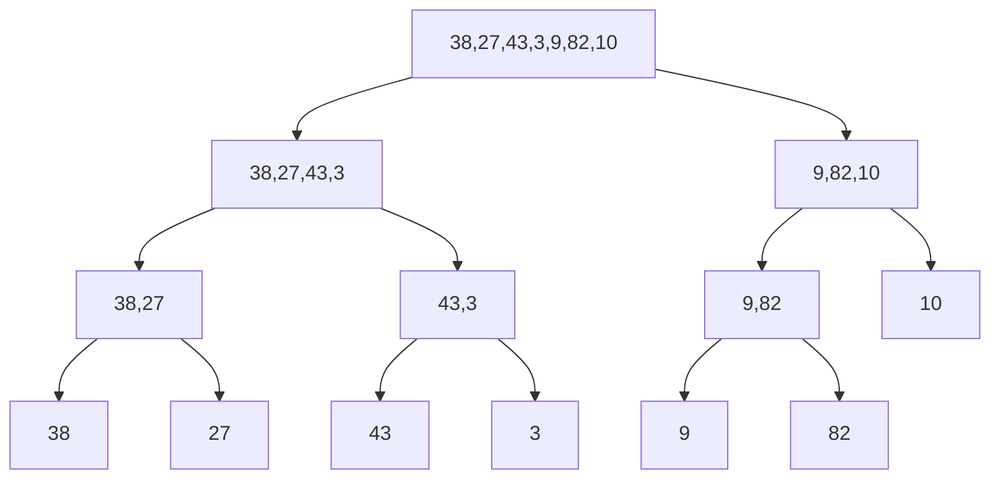
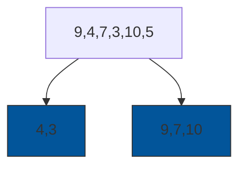
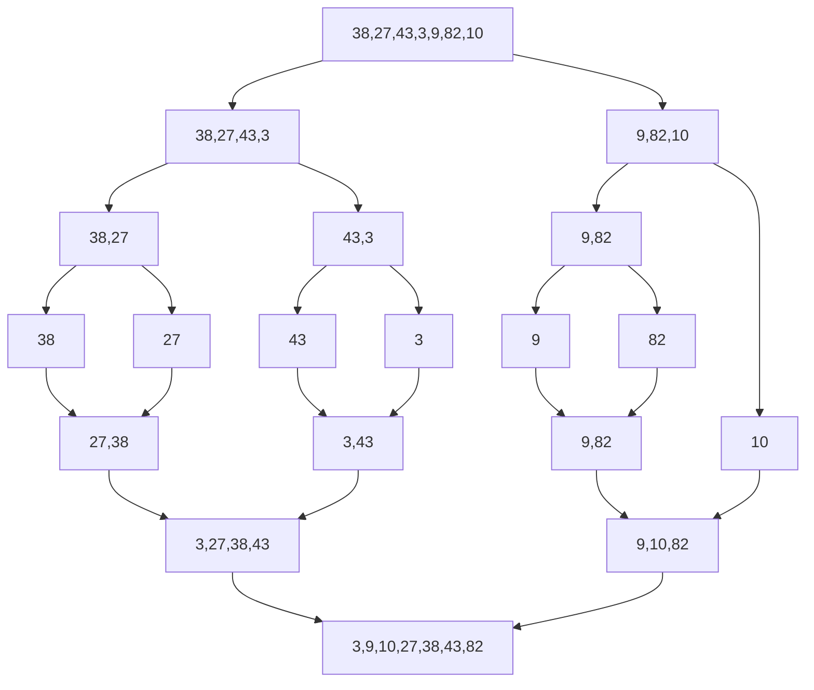
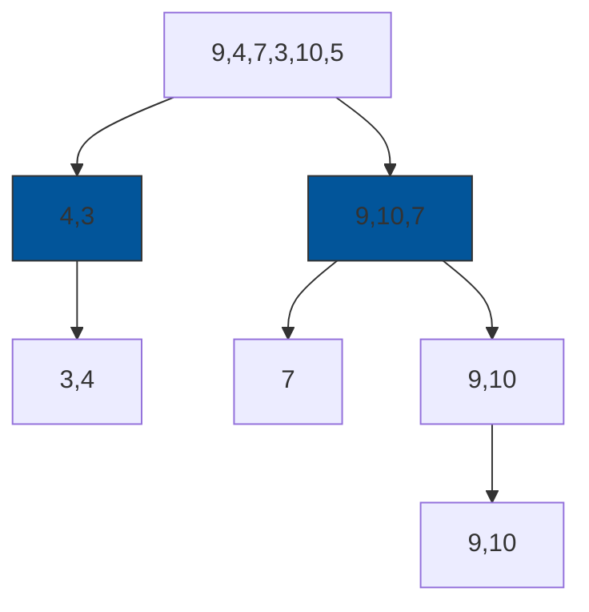
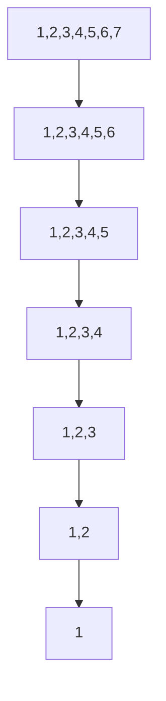

# 📚 Week_3_Day_2_Merge_Sort_And_Quick_Sort_Instructional.md — O(n log n) Sorting Workhorses

🗓 Week: 3 | 📅 Day: 2  
📌 Topic: Merge Sort & Quick Sort  
⏱ Duration: ~75–90 minutes (reading) + practice  
🎯 Difficulty: 🟡 Medium → 🔴 Hard (edge cases and variants)  

📚 Prerequisites:
- Week 1: RAM Model, Asymptotic Analysis, Recursion I/II
- Week 2: Arrays, Dynamic Arrays, Recursion patterns, Basic Big-O

📊 Interview Frequency:
- Direct: High (sorting and partitioning questions)
- Indirect: Very high (as building block in many problems)

🏭 Real-World Impact:
- Core to .NET’s `Array.Sort` / `List<T>.Sort`
- Fundamental in databases, search engines, and distributed data processing
- Underpins higher-level APIs like LINQ `OrderBy` and ORDER BY in SQL-backed systems

---

## 🎯 LEARNING OBJECTIVES

By the end of this file, you will:

✅ Understand how **merge sort** and **quick sort** work at a systems level (recursion, partitioning, merging)  
✅ Analyze their **time, space, and cache behavior**, including O(n log n) vs O(n^2) trade-offs  
✅ Explain **stability**, **in-place** behavior, and when each algorithm is preferred  
✅ Recognize how modern runtimes (including .NET) use **hybrid strategies** based on these algorithms  
✅ Apply binary-search-style reasoning about pivots and partitions to related problems (selection, partitioning, k-th order statistics)

---

## 🤔 SECTION 1: THE WHY (Motivation & Real-World Context)

You already know elementary O(n^2) sorts (insertion, selection, bubble). For small n, they can be fast and simple. But for large data sets—millions or billions of elements—O(n^2) is a non-starter.

For n = 1,000,000:

- O(n^2) ≈ 10^12 operations (completely impractical).
- O(n log n) ≈ 10^6 * ~20 = about 20 million comparisons (reasonable on modern hardware).

Merge sort and quick sort are the **canonical O(n log n) comparison sorts**. They power:

- Sorting APIs in languages and frameworks.
- External sorts in databases.
- Intermediate steps in joins, group-by, top-k, and analytics.

### 💼 Real-World Problems This Solves

#### Problem 1: Sorting Large In-Memory Collections in C#

Scenario:

- You have a microservice that aggregates metrics per tenant.
- Each minute, it collects hundreds of thousands of metric samples.
- Before sending results to downstream systems, you need to sort by timestamp, then by metric key.

Naive approach:

- Use a hand-written O(n^2) algorithm (like repeated scanning for minimum).
- Performance: absolutely terrible at scale.

Production approach:

- Use `Array.Sort` or `List<T>.Sort`:
  - Under the hood: **introspective sort** (a hybrid of quick sort, heap sort, and insertion sort).
  - Average complexity: O(n log n).
  - Handles large lists efficiently and robustly.

Business impact:

- Sorting time scales reasonably as data volume grows.
- Latency stays within SLOs even when tenant count increases.

#### Problem 2: ORDER BY in Databases and Analytics

Relational databases and analytical systems frequently need to return results sorted by some column(s):

- Example: `SELECT * FROM Orders ORDER BY CreatedAt, OrderId`
- Result sets can be millions of rows.
- Under the hood:
  - In-memory sorts often use quick sort or merge sort variants.
  - External sorts (when data does not fit in memory) are usually variations of **merge sort**:
    - Read chunks from disk.
    - Sort each chunk in memory.
    - Merge sorted chunks.

Naive O(n^2) sort:

- Would make ORDER BY completely unusable at scale.

Using O(n log n) sorts:

- Ensures that sorting operations scale acceptably with data size.
- Enables features like stable secondary ordering (merge sort / stable sort).

#### Problem 3: Distributed Systems & MapReduce / Spark

In distributed engines (Spark, Flink, MapReduce-like systems):

- Shuffle and sort are central primitives.
- Typical pipeline:
  - Map → local sort → shuffle → reduce.
- Local sorts and merge phases:
  - Use optimized variants of **merge sort** and **quick sort**.
  - Need to be predictable and parallelizable.

If you do not understand merge sort and quick sort:

- It is hard to reason about:
  - Performance bottlenecks.
  - Why specific stages dominate runtime.
  - The cost of data skew or poor partitioning.

### 🎯 Design Goals & Trade-offs

Merge and quick sort are designed around:

- **Time complexity target**: O(n log n) average and ideally worst-case.
- **Memory trade-offs**:
  - Merge sort: stable, predictable O(n log n) but needs extra space.
  - Quick sort: in-place with tiny extra memory, but risk of O(n^2) on bad pivots.
- **Cache behavior**:
  - Merge sort: good sequential access patterns during merging.
  - Quick sort: partitions contiguous chunks, generally good locality.

You’ll see this trade-off echoed in real libraries:

- If you need **stability** and can afford extra memory, merge sort or TimSort-like algorithms.
- If you need **in-place, low-extra-space** behavior and average-case speed, quick sort or introsort.

### 📜 Historical Context

- **Merge sort**: described by John von Neumann in the 1940s.
- **Quick sort**: invented by Tony Hoare around 1960.
- Both became textbook examples of divide-and-conquer:
  - Solve large problems by splitting them into smaller ones.
  - Recursively sort subproblems.
  - Combine (merge) or rely on partitioning to yield sorted arrays.

Over time:

- Quick sort became the default in many libraries for in-memory arrays due to its speed and space efficiency.
- Merge sort became the default for linked lists and external sorting due to stability and natural merging behavior.
- Modern runtimes (including .NET) use **hybrid** variants that combine the strengths of both, plus heuristics.

### 🎓 Interview Relevance

Interviewers love merge and quick sort because they probe:

- Your understanding of **recursion**, **divide-and-conquer**, and **recurrence relations**.
- Your ability to reason about **average vs worst-case** complexity.
- Your understanding of practical concerns:
  - Stack depth.
  - Pivot selection.
  - Additional memory.
  - Stability and in-place behavior.

They also appear indirectly in many problems that require:

- Efficient partitioning (like “k-th largest element”).
- Sorting as a preprocessing step (e.g., merging intervals, scheduling tasks).

---

## 📌 SECTION 2: THE WHAT (Core Concepts & Definitions)

### 💡 Core Analogies

- **Merge sort**: Think of sorting a large pile of documents by:
  - Splitting them into halves repeatedly.
  - Sorting each half separately.
  - Then merging sorted piles into one big sorted pile.
- **Quick sort**: Think of organizing numbers around a **pivot**:
  - Put all items smaller than the pivot on one side.
  - Put all items larger on the other side.
  - Recursively repeat within each side.

Both use **divide-and-conquer**, but differ in how they combine or partition.

### 📌 Merge Sort — Conceptual Definition

Merge sort:

1. Divide:
   - Split the array into two halves.
2. Conquer:
   - Recursively sort each half.
3. Combine:
   - Merge the two sorted halves into a single sorted array.

Characteristics:

- Time complexity: O(n log n) in best, average, and worst case.
- Stability: typically **stable** (relative order of equal keys preserved).
- Extra memory: O(n) for arrays (requires auxiliary buffer).
- Recursion depth: O(log n).

### 📌 Quick Sort — Conceptual Definition

Quick sort:

1. Choose a pivot element from the array.
2. Partition:
   - Rearrange elements so that:
     - All elements less than pivot come before it.
     - All elements greater than pivot come after it.
     - Pivot ends up in its final sorted position.
3. Recursively quick sort the subarrays:
   - Left of pivot.
   - Right of pivot.

Characteristics:

- Average time complexity: O(n log n).
- Worst-case time complexity: O(n^2) (bad pivot choices).
- Extra memory: O(log n) for recursion stack, in-place partition.
- Stability: typically **unstable** (equal elements may be reordered).
- Very good in practice if pivots are chosen well.

### 🎨 Visual Representation (Arrays and Recursion Trees)

#### Merge Sort Array Splitting

Example array:

```text
[38, 27, 43, 3, 9, 82, 10]
```

Splits:

```text
[38, 27, 43, 3]           [9, 82, 10]
   /           \            /       \
[38,27]     [43,3]        [9,82]   [10]
 /    \      /   \        /    \
[38] [27]  [43] [3]     [9]  [82]
```

Each leaf (single element) is trivially sorted. Then we merge bottom-up.

Recursion tree (mermaid):



#### Quick Sort Partitioning

Example array:

```text
[9, 4, 7, 3, 10, 5]
```

Choose pivot (e.g., last element 5):

- Partition into:
  - Less than 5: [4,3]
  - Pivot: [5]
  - Greater than 5: [9,7,10]

Recursive subproblems:



Then quick sort [4,3] and [9,7,10].

---

## ⚙ SECTION 3: THE HOW (Step-by-Step Mechanics)

We’ll walk through both algorithms’ mechanics in a no-code, step-oriented way.

### 📋 Merge Sort — Algorithm Overview

**Input:** Array A of length n  
**Output:** A sorted version of A (typically in a separate array or back into A using a buffer)

High-level steps:

1. If n <= 1, return (already sorted).
2. Split array into left half and right half.
3. Recursively sort left half.
4. Recursively sort right half.
5. Merge the two sorted halves.

#### ⚙ Merge Operation (Core of Merge Sort)

Merging two sorted arrays L and R into a sorted array:

State:

- L[0..l-1], R[0..r-1] sorted.
- i = 0 (index into L), j = 0 (index into R).
- k = 0 (index into output buffer B).

Steps:

1. While i < l and j < r:
   - If L[i] <= R[j]:
     - B[k] = L[i]; i++, k++.
   - Else:
     - B[k] = R[j]; j++, k++.
2. After one array is exhausted:
   - Copy remaining items from the other:
     - While i < l: B[k] = L[i]; i++, k++.
     - While j < r: B[k] = R[j]; j++, k++.

This yields a sorted merged array B.

#### 💾 State Management and Memory

- For arrays:
  - Often allocate one auxiliary buffer B of size n.
  - At each merge step:
    - Copy merged result into B for the current segment.
    - Copy B segment back into A.
- For linked lists:
  - Merging can be done in-place by relinking nodes, with O(1) extra memory.

Memory behavior:

- Extra O(n) storage for arrays (buffer).
- Recursion stack uses O(log n) extra (function frames).

#### ⚠ Edge Cases in Merge Sort

- Empty array (n = 0): immediately return.
- Single element (n = 1): trivial base case.
- Odd length splits:
  - If n is odd, left half can be n/2, right half n - n/2.
- Very large arrays:
  - Recursion depth ~ log2(n); still manageable but must be careful about stack usage in languages with small default stack (C# generally fine for typical sizes).

---

### 📋 Quick Sort — Algorithm Overview

**Input:** Array A of length n  
**Output:** Sorted array A in-place (no extra arrays for data)

High-level steps:

1. If subarray length <= 1, return.
2. Choose a pivot element (e.g., A[high], A[mid], random).
3. Partition A into:
   - Elements less than pivot.
   - Pivot itself at its final sorted index.
   - Elements greater than pivot.
4. Recursively quick sort the two subarrays:
   - Left of pivot index.
   - Right of pivot index.

#### ⚙ Partitioning (Conceptual Mechanics)

We’ll describe a basic partition scheme:

State:

- Subarray A[low..high].
- Pivot value p (e.g., A[high]).
- `storeIndex` starts at low.

Steps:

1. For each index i from low to high-1:
   - If A[i] < p:
     - Swap A[i] with A[storeIndex].
     - Increment storeIndex.
2. After the loop:
   - Swap A[storeIndex] with A[high] (pivot).
3. Now:
   - Pivot is at index storeIndex.
   - All elements left of storeIndex are < pivot.
   - All elements right of storeIndex are >= pivot.

This partition is in-place and ensures pivot is in correct final position.

#### 🧠 Pivot Selection Strategies

- First element as pivot:
  - Simple but can cause O(n^2) when array is already sorted or reverse-sorted.
- Last element as pivot:
  - Similar risk as above.
- Random pivot:
  - Reduces likelihood of adversarial inputs.
- Median-of-three:
  - Pick the median of A[low], A[mid], A[high].
  - Helps avoid worst-case for many patterns (nearly sorted, reverse sorted).

In .NET’s introsort-like implementations, pivot choice is carefully designed to avoid pathological behaviors.

#### 💾 State Management & Recursion

- Each recursive call sorts a subarray A[low..high].
- Recursion depth:
  - Average: O(log n).
  - Worst-case: O(n) without depth limitation.
- Introsort approach:
  - Track recursion depth.
  - If depth exceeds threshold (say 2 * log2(n)), switch to heap sort or another O(n log n) guaranteed method.

#### ⚠ Edge Cases in Quick Sort

- All elements equal:
  - Partition degenerates (many equal elements).
  - Must ensure partition doesn’t create tiny subarrays repeatedly.
- Already sorted or reverse sorted input:
  - Bad pivot strategy (e.g., always first element) can yield worst-case O(n^2).
- Very small subarrays:
  - It’s often better to switch to insertion sort instead of recursing.

---

## 🎨 SECTION 4: VISUALIZATION (Detailed Examples & Traces)

### 📌 Example 1: Merge Sort on [38, 27, 43, 3, 9, 82, 10]

Initial array:

```text
[38, 27, 43, 3, 9, 82, 10]
```

#### Step 1: Split Phase

Split repeatedly:

```text
[38, 27, 43, 3, 9, 82, 10]
   /                     \
[38, 27, 43, 3]         [9, 82, 10]
  /         \              /     \
[38, 27]  [43, 3]        [9, 82] [10]
 /    \    /   \         /    \
[38] [27] [43] [3]     [9]   [82]
```

#### Step 2: Merge Bottom-Up

1. Merge [38] and [27] → [27, 38]
2. Merge [43] and [3] → [3, 43]
3. Merge [9] and [82] → [9, 82]

Array after merging small pieces:

```text
Left side:
[27, 38] and [3, 43]  → will merge to [3, 27, 38, 43]
Right side:
[9, 82] and [10]      → [9, 10, 82]
```

4. Merge left halves:

Merging [27, 38] and [3, 43]:

- Compare 27 and 3 → 3 first.
- Then 27 vs 43 → 27.
- Then 38 vs 43 → 38.
- Remaining 43.

Result: [3, 27, 38, 43].

5. Merge [3, 27, 38, 43] and [9, 10, 82]:

- Compare 3 vs 9 → 3
- 27 vs 9 → 9
- 27 vs 10 → 10
- 27 vs 82 → 27
- 38 vs 82 → 38
- 43 vs 82 → 43
- Remaining 82

Final array:

```text
[3, 9, 10, 27, 38, 43, 82]
```

Mermaid overview:



(Arrows represent merging; some intermediate merge nodes are conceptual.)

---

### 📌 Example 2: Quick Sort on [9, 4, 7, 3, 10, 5]

Array: [9, 4, 7, 3, 10, 5]  
Use last element as pivot: 5.

#### First Partition (pivot = 5, low=0, high=5)

Initial:

```text
[9, 4, 7, 3, 10, 5]
 L                 H
 pivot = 5
```

Iteration (i from 0 to 4, storeIndex starts at 0):

- i=0: A[0]=9 (>=5) → do nothing.
- i=1: A[1]=4 (<5) → swap A[0] and A[1]:
  - array becomes [4, 9, 7, 3, 10, 5], storeIndex=1.
- i=2: A[2]=7 (>=5) → do nothing.
- i=3: A[3]=3 (<5) → swap A[1] and A[3]:
  - array becomes [4, 3, 7, 9, 10, 5], storeIndex=2.
- i=4: A[4]=10 (>=5) → do nothing.

After loop:

- Swap pivot with A[storeIndex] (A[2]):
  - array becomes [4, 3, 5, 9, 10, 7].
- Pivot 5 now at index 2.

Partition result:

- Left of pivot index 2: [4, 3] (values < 5)
- Right of pivot index 2: [9, 10, 7] (values >= 5)

#### Recursively Quick Sort [4, 3]

Subarray [4,3], pivot = 3:

- i=0: A[0]=4 (>=3) → no swap.
- After loop: swap pivot (3) with A[0]:
  - [3,4].

Now [3,4] sorted.

#### Recursively Quick Sort [9, 10, 7]

Subarray [9, 10, 7], pivot = 7:

- i=3: 9 >= 7 → no swap.
- i=4: 10 >= 7 → no swap.
- After loop: swap pivot (7) with A[3]:
  - [7,10,9] in that subarray.

Then recursively sort [7] and [10,9]:

- [7] trivial.
- [10,9], pivot=9:
  - i=0: 10 >=9 → no swap.
  - Swap pivot with A[0] → [9,10].

Final combination:

- Left: [3,4]
- Pivot: [5]
- Right: [7,9,10]

Sorted array: [3,4,5,7,9,10].

Mermaid overview:



---

### 📌 Example 3: Quick Sort Worst Case

Array: [1,2,3,4,5,6,7] (already sorted)  
Pivot strategy: always choose last element.

First call: pivot=7:

- All other elements < pivot → partition leaves:
  - [1,2,3,4,5,6] on left, no elements on right.
- Next recursion: [1,2,3,4,5,6], pivot=6.
- And so on.

Recursion tree degenerates:



Depth O(n), and partition cost sums to O(n^2).

This is why pivot selection and introsort depth limits matter.

---

### ❌ Counter-Example: Broken Partition

A common bug:

- Partition logic fails to move pivot to a smaller subarray when all elements are equal.
- Example: If conditions only handle A[i] < pivot but ignore A[i] == pivot carefully, you can end up with:
  - One side not shrinking, leading to infinite recursion or very deep recursion.

Correct partitioning must ensure:

- The pivot ends up at a unique index where at least one side strictly shrinks.  
- Or bounds (low, high) always progress inward.

---

## 📊 SECTION 5: CRITICAL ANALYSIS (Complexity & Edge Cases)

### 📈 Complexity Summary

| 📌 Algorithm  | ⏱ Time (Best) | ⏱ Time (Average) | ⏱ Time (Worst) | 💾 Space (Array) | 📝 Notes                         |
|--------------|---------------|------------------|----------------|------------------|----------------------------------|
| Merge Sort   | O(n log n)    | O(n log n)       | O(n log n)     | O(n)             | Stable, predictable              |
| Quick Sort   | O(n log n)    | O(n log n)       | O(n^2)         | O(log n) stack   | In-place, very fast in practice  |

### 🔌 Cache Behavior

- Merge Sort:
  - Merge step reads from two sorted subarrays sequentially and writes sequentially to output.
  - Very friendly to caches (sequential access).
  - Extra buffer may help with streaming and prefetching.

- Quick Sort:
  - Partitioning loops over contiguous segments.
  - Good locality; but access patterns can be less predictable when partitioning unevenly.
  - Still typically very cache-friendly compared to pointer-rich structures.

### 🤔 Why Big-O Might Be Misleading

- Quick sort’s worst-case O(n^2) is rarely hit in well-engineered implementations (randomized pivots, depth limits).
- Merge sort’s O(n) additional memory might be unacceptable in constrained environments, even if time complexity is good.
- For small n, constant-factor overhead of recursion and copying can make insertion sort faster than both.

### ⚡ When Analysis Breaks Down

- Big-O does not capture:
  - Constant factors (function call overhead, comparisons vs swaps).
  - Branch misprediction costs.
  - Real-world input distributions (e.g., mostly sorted, many equal keys).
- It also does not reflect external behaviors:
  - Virtual memory effects (page faults).
  - Disk I/O costs for external merges.

In systems like databases or .NET runtime:

- Designers choose algorithms based on empirical performance under realistic workloads, not purely on asymptotic complexity.

---

## 🏭 SECTION 6: REAL SYSTEMS (Where They Actually Run)

### 🏭 Real System 1: .NET `Array.Sort` / `List<T>.Sort`

- Problem:
  - Provide a general-purpose efficient sort for arrays and lists.
- Implementation:
  - Uses an introspective sort:
    - Quick sort–like partitioning initially.
    - Monitors recursion depth.
    - Switches to heap sort if depth too large (to avoid worst-case O(n^2)).
    - Uses insertion sort for small subarrays.
- Merge sort:
  - Historically used for objects in some runtimes for stability (or stable wrapper built on top).
- Impact:
  - Sorting large arrays of primitives or objects in C# with predictable performance and minimal memory overhead.

### 🏭 Real System 2: LINQ’s `OrderBy`

- LINQ `OrderBy` must produce a **stable** sort (preserve order of equal keys).
- The underlying implementation:
  - Decorates elements with their original index.
  - Uses the runtime sort (`Array.Sort`) but with additional logic to ensure stability.
  - Conceptually similar to merge sort regarding stable semantics.
- Merge sort concepts:
  - Merging runs.
  - Stability.
- Impact:
  - Allows multiple `OrderBy` / `ThenBy` chains to behave as expected.

### 🏭 Real System 3: SQL Server / Relational Databases

- ORDER BY implementation:
  - For small in-memory sets: quick sort or variants.
  - For large sets exceeding memory:
    - External merge sort:
      - Write sorted “runs” to disk.
      - Merge runs in multiple passes.
- Merge sort is the natural choice because:
  - Merging sorted runs from disk is efficient.
  - Stability and order-by semantics matter.

### 🏭 Real System 4: Big Data Engines (Spark, Flink)

- Sorting is part of shuffle:
  - Local sort on each worker node (usually quicksort/introsort).
  - Merge and reduce across nodes (merge sort over sorted partitions).
- Merge sort pattern:
  - Merge sorted streams from many partitions.
- Impact:
  - Directly influences job runtime and scalability.

### 🏭 Real System 5: External Sorting Utilities (Unix `sort`, ETL Pipelines)

- For very large files:
  - Data is split into chunks.
  - Chunks sorted in memory (often with quicksort/introsort).
  - Sorted chunks written to disk.
  - Merge sort (multi-way merge) applied to combine chunks.
- Merge sort’s merging step is the backbone of these external sort utilities.

---

## 🔗 SECTION 7: CONCEPT CROSSOVERS (Prerequisites & Dependents)

### 📚 Prerequisites

- Arrays and dynamic arrays:
  - Both algorithms operate primarily on contiguous arrays.
- Recursion:
  - Both merge and quick sort are recursive (divide-and-conquer).
- Elementary sorts:
  - Used as base cases for very small subarrays.
- Big-O:
  - Understanding O(n log n) vs O(n^2).

### 🔀 Dependents (What Builds on This)

- **Heap Sort (Week 3 Day 3)**:
  - An alternative O(n log n) in-place sort; complements quick sort.
  - Forms part of introsort fallback strategy.
- **Binary Search / Searching Patterns**:
  - Often applied to sorted arrays produced by these algorithms.
- **Selection Algorithms (Quickselect)**:
  - Use quick sort–style partitioning to find k-th element in expected O(n) time.
- **Graph and DP Algorithms**:
  - Many algorithms require sorted edges or intervals (e.g., Kruskal’s MST, scheduling problems).

### 🔄 Similar Algorithms: How Do They Compare?

| 📌 Algorithm | ⏱ Time (avg) | 💾 Space | ✅ Best For                           | 🔀 vs Merge/Quick Sort                           |
|-------------|--------------|----------|----------------------------------------|--------------------------------------------------|
| Merge Sort  | O(n log n)   | O(n)     | Stability, external sorting, lists     | Uses more memory, predictable time               |
| Quick Sort  | O(n log n)   | O(log n) | In-place, large in-memory arrays       | Faster in practice but risk of O(n^2)            |
| Heap Sort   | O(n log n)   | O(1)     | In-place, worst-case guarantees        | Worse cache behavior, not stable                 |

---

## 📐 SECTION 8: MATHEMATICAL (Formal Foundations)

### 📌 Merge Sort Recurrence

Let T(n) be the time to sort n elements with merge sort.

- Splitting the array: O(1) or O(n) depending on view (but we usually treat as O(1) overhead within recursion).
- Sorting each half: T(n/2) for each half.
- Merging two sorted halves: O(n).

Recurrence:

- T(n) = 2 * T(n/2) + c * n, for some constant c.

By repeated expansion or applying the Master Theorem:

- T(n) = O(n log n).

Intuition:

- At each level of recursion tree:
  - Work of merging all subproblems sums to O(n).
- There are log2(n) levels.
- So total work is n * log2(n).

### 📌 Quick Sort Recurrence (Average vs Worst Case)

Worst case (bad pivot each time):

- T(n) = T(n−1) + c * n  
- This sums to O(n^2) (roughly n + (n−1) + ... + 1 operations).

Average case (good pivots, roughly equal splits):

- Expected recurrence:
  - T(n) ≈ T(an) + T((1−a)n) + c * n, with a around 1/2 on average.
- For uniformly random pivots, expected T(n) = O(n log n).

Intuition:

- Over many partitions, most splits are “reasonable”.
- The probability of extremely skewed splits repeatedly is low if pivot selection is random or robust.

### 📐 Stability and In-Place (Informal)

- Merge sort:
  - Merging step compares equal keys and usually takes from the left run first.
  - Thus, equal elements keep their original relative order → stable.
  - Requires extra buffer to merge arrays → O(n) extra space.

- Quick sort:
  - Partitioning step can move equal elements around without preserving relative order.
  - Algorithm is generally not stable, unless carefully modified with extra data structures (not common in practice).

---

## 💡 SECTION 9: ALGORITHMIC INTUITION (Decision Framework)

### 🎯 Decision: Merge Sort vs Quick Sort

Ask these questions:

1. **Do you need stability?**
   - Yes → merge sort (or stable variant) is safer.
   - No → quick sort / introsort is often better in memory.

2. **Is memory tight?**
   - Yes:
     - Quick sort (in-place) or heap sort.
   - No:
     - Merge sort’s extra O(n) memory is acceptable.

3. **Are you sorting linked lists or merging external data?**
   - Linked lists:
     - Merge sort is a natural fit (merge in O(1) extra space, pointer re-linking).
   - External data:
     - Merge sort is ideal due to sequential disk I/O and merging of runs.

4. **Is your environment adversarial?**
   - Highly adversarial or worst-case critical:
     - Use introsort (quick sort + heap sort fallback) or merge sort.
   - Regular workloads:
     - Quick sort with good pivot selection is extremely fast.

### 🔍 Interview Pattern Recognition

Red flags that merge sort is intended:

- Problem mentions:
  - Linked lists.
  - External files or very large data sets.
  - Need for stable sort semantics.
- Constraints:
  - Memory not extremely tight.

Red flags that quick sort / partitioning is intended:

- Problem asks for:
  - k-th largest/smallest element.
  - Partition into elements less than X and greater than X.
- Typical pattern:
  - “You don’t need full sort, just partition or find pivot-based position.”

### ⚠ Common Misconceptions

- “Quick sort is always faster than merge sort.”
  - Not necessarily; depends on data, memory model, pivot strategy.
- “Merge sort is always better because it has guaranteed O(n log n).”
  - Extra memory and constant factors can make it slower in some contexts.
- “In-place means no recursion overhead.”
  - Quick sort is in-place for array data, but recursion still uses stack space.

In real life, libraries use **hybrid algorithms**:

- Quick sort for partitioning.
- Merge-style or heap-style logic for worst-case or external data.
- Insertion sort for small segments.

---

## ❓ SECTION 10: KNOWLEDGE CHECK (Socratic Questions)

1. If you had to implement a stable sort for a linked list in C#, which algorithm would you choose and why? Consider both time complexity and memory usage.

2. Suppose you have an array that is already nearly sorted (only a few elements are out of place). How would merge sort and quick sort perform relative to insertion sort? When would you switch to insertion sort in a hybrid design?

3. In an environment where memory is very limited but worst-case performance must be predictable (e.g., a real-time system), which sorting algorithm would you prefer: merge sort, quick sort, or heap sort? Explain your reasoning.

4. How does pivot selection affect the performance of quick sort? Give an example where bad pivot selection leads to poor performance and explain how to mitigate it.

5. For external sorting of multi-gigabyte files, why is merge sort (and not quick sort) the standard approach? Discuss in terms of disk I/O patterns and memory constraints.

(Reflect on these in your own words; being able to answer clearly is a strong interview signal.)

---

## 🎯 SECTION 11: RETENTION HOOK (Memory Devices & Story)

### 💎 One-Liner Essence

“**Merge sort guarantees O(n log n) by splitting and merging with extra space; quick sort gambles for speed by partitioning in-place with good pivots.**”

### 🧠 Mnemonic Device

Acronym: **MQS** — “Merge is Quality and Stable, Quick is Space-light and fast (usually).”

- **M**erge: **M**emory heavier, **M**onotonic O(n log n), **M**erges runs, **M**ostly stable.
- **Q**uick: **Q**uick in practice, **Q**uestionable worst-case, **Q**uietly uses pivot **Q**uality.
- **S**witch: Hybrid algorithms **S**witch between them (plus insertion sort) for optimal performance.

### 📐 Visual Cue (ASCII)

```text
Merge Sort:
    Split
      /\
     /  \
  sort  sort
     \  /
      \/
     merge

Quick Sort:
      pivot
   < pivot | > pivot
     sort    sort
```

Merge sort: “split and merge.”  
Quick sort: “pivot and partition.”

### 📖 Real Interview Story

You’re in a senior backend interview. The interviewer says:

> “We have a service that loads up to 5 million user records into memory, then sorts them by a timestamp and a secondary key. We currently call `List<User>.Sort()` and it’s fast enough, but we’re seeing occasional latency spikes. Can you talk about what sort algorithm is likely being used and why we might see variance in performance?”

A strong answer:

- Recognizes that .NET uses an introspective sort built on quick sort:
  - Quick sort partitioning.
  - Heap sort fallback in deep recursion.
  - Insertion sort on small subarrays.
- Explains:
  - Quick sort’s average O(n log n) and in-place nature.
  - Potential worst-case patterns if data is adversarial or extremely skewed.
  - How pivot selection and recursion depth thresholds mitigate spikes.
- Suggests:
  - Measuring distribution of input data.
  - Ensuring pivot selection is robust.
  - Considering stable sort semantics if multi-key ordering matters.

The interviewer hears:

- You understand more than just “sort is O(n log n)”.
- You can reason about runtime internals and their effect on latency and reliability.
- You can propose realistic, system-level improvements.

That depth of understanding is precisely what this topic is meant to develop.

---

## 🧩 5 COGNITIVE LENSES

### 🖥 Computational Lens (Hardware & Memory)

- Merge sort:
  - Extra buffer of size n.
  - Merging is sequential reads/writes:
    - Good for cache, prefetching, and disk I/O.
  - Recursion adds function call overhead.

- Quick sort:
  - In-place partitioning:
    - Very good locality (a few pointers moving within contiguous memory).
  - Recursion depth generally O(log n).
  - Branch behavior depends on data distribution and pivot quality.

- In C#:
  - JIT can inline small helper methods.
  - Arrays are contiguous objects on the managed heap.
  - Good iteration patterns are crucial for performance; both algorithms leverage that.

### 🧠 Psychological Lens (Mental Models & Misconceptions)

Common misunderstandings:

- “Quick sort is always the best choice”:
  - Ignores worst-case and stability requirements.
- “Merge sort is slow because of extra memory”:
  - For external sorting or linked lists, merge sort is often the only sensible choice.
- “I only need to know library sort, not internals”:
  - Limits your ability to reason about performance anomalies or design custom workflows.

Mental models:

- Merge sort: “organize by halving and merging sorted piles.”
- Quick sort: “organize by picking a pivot and throwing items left or right.”

Use these analogies when explaining to others.

### 🔄 Design Trade-off Lens (Architecture Decisions)

- Merge sort vs quick sort:
  - Stable vs unstable.
  - O(n) extra memory vs O(log n) stack.
  - Predictable worst-case vs average-case with risk.

- Hybrid designs (introsort):
  - Combine quick sort’s speed with heap sort’s worst-case guarantee.
  - Plug in insertion sort at the bottom for small segments.

Design considerations in .NET:

- `Array.Sort` must:
  - Work well on many data types and workloads.
  - Avoid worst-case behavior.
  - Conserve memory.
- Designing your own sort:
  - Might choose merge sort for a stable, predictable pipeline sort.
  - Might choose quick-sort-like partitioning for in-memory ephemeral data.

### 🤖 AI/ML Analogy Lens

- Merge sort:
  - Resembles multi-stage aggregation:
    - Compute partial results on subsets.
    - Merge into a final answer.
  - Similar to how certain tree-based models build structures bottom-up.

- Quick sort:
  - Partitioning around a pivot is like:
    - Splitting data based on a threshold.
    - Decision trees choosing a split point on a feature.

- Binary search and quick sort:
  - Quick sort’s partition step is like a “multi-way” comparison step:
    - It puts pivot in final position and recurses on both halves.

These analogies are heuristic, but help connect algorithmic thinking with ML workflows.

### 📚 Historical Context Lens

- Merge sort:
  - Proposed by von Neumann in the 1940s.
  - Designed for tape-based computers where sequential access was cheap, but random access was expensive.
  - Still ideal for external sorting on disks and tape-like systems.

- Quick sort:
  - Created by Tony Hoare around 1960.
  - Remarkably simple yet extremely effective.
  - Became the sort of choice for in-memory arrays in many languages.

- Evolution:
  - Introsort: combine quick sort, heap sort, and insertion sort.
  - TimSort: hybrid stable sort optimized for partially ordered data (used in Python and Java).
  - Parallel mergesort and quicksort variants for modern multi-core CPUs.

Today:

- Sorting remains a solved-but-optimized area:
  - Focused on cache behavior, parallelism, stability, and worst-case guarantees.
- As a senior C# engineer, understanding this evolution helps you appreciate why certain design choices appear in the .NET runtime.

---

## 🎁 SUPPLEMENTARY OUTCOMES

### ⚔ Practice Problems (8–10)

1. ⚔ Sort an Array (LeetCode 912 – 🟡 Medium)  
   🎯 Concepts: Implementing merge sort or quick sort on arrays; O(n log n) sorting.

2. ⚔ Sort List (LeetCode 148 – 🟡 Medium)  
   🎯 Concepts: Merge sort on linked lists; O(n log n) time, O(1) extra space by pointer manipulation.

3. ⚔ Kth Largest Element in an Array (LeetCode 215 – 🟡 Medium)  
   🎯 Concepts: Quickselect using quick sort partition logic; average O(n) time.

4. ⚔ Sort Colors (LeetCode 75 – 🟡 Medium)  
   🎯 Concepts: Three-way partitioning (Dutch National Flag) related to quick sort’s partition step.

5. ⚔ Merge Sorted Array (LeetCode 88 – 🟢 Easy)  
   🎯 Concepts: Merge step of merge sort; O(m+n) time merging sorted arrays.

6. ⚔ Merge Intervals (LeetCode 56 – 🟡 Medium)  
   🎯 Concepts: Sort by interval start; merging logic after sort.

7. ⚔ Maximum Number of Events That Can Be Attended (LeetCode 1353 – 🔴 Hard)  
   🎯 Concepts: Sort + greedy; interplay of sorting and heap.

8. ⚔ Data Stream as Disjoint Intervals (LeetCode 352 – 🔴 Hard)  
   🎯 Concepts: Sorted structure plus merging; heavy merge sort flavored reasoning.

9. ⚔ Meeting Rooms II (LeetCode 253 – 🟡 Medium)  
   🎯 Concepts: Sort start/end times, interval management.

10. ⚔ Reduce Array Size to The Half (LeetCode 1338 – 🟡 Medium)  
    🎯 Concepts: Counting and sorting frequencies; O(n log n) sort of counts.

---

### 🎙 Interview Q&A (6+ Pairs)

**Q1:** Why do many library implementations (including .NET) use a hybrid sort instead of pure quick sort or pure merge sort?  
📢 **A:**  
Because no single algorithm is ideal across all workloads and constraints. Quicksort is in-place and extremely fast on average, but has O(n^2) worst case and can behave poorly on certain patterns without careful pivoting. Merge sort has guaranteed O(n log n) time and stability, but requires O(n) extra memory and may have larger constant factors. Hybrid sorts like introsort start with quick sort partitioning, monitor recursion depth, and fall back to heap sort or other O(n log n) algorithms when depth grows too large; they also switch to insertion sort on small subarrays for better cache utilization and lower overhead. This combination yields near-optimal performance on most workloads while protecting against worst-case scenarios.

🔀 Follow-up 1: How would you decide on the threshold at which to switch to insertion sort?  
🔀 Follow-up 2: What metrics would you monitor to detect when quick sort recursion is going too deep?

---

**Q2:** In what scenarios would merge sort be strictly preferable to quick sort?  
📢 **A:**  
Merge sort is preferable when you require stability, predictable O(n log n) worst-case bounds, or when you are working with linked lists or external data (such as large files on disk). For linked lists, merge sort can be implemented with O(1) additional memory by relinking nodes, whereas quick sort’s partitioning is less natural. For external sorting, merge sort’s sequential reads/writes and merging of sorted runs are ideally suited to disk I/O characteristics, minimizing random access. When sort stability is required (for multi-key sorting), merge sort, or a stable sort built on similar principles, is almost always the right choice.

🔀 Follow-up 1: How would you implement merge sort for a singly linked list conceptually?  
🔀 Follow-up 2: Why is stability important for multi-level sorting (e.g., sort by department then salary)?

---

**Q3:** Why is quick sort often faster in practice than merge sort on in-memory arrays, even though both are O(n log n)?  
📢 **A:**  
Quick sort is in-place and does not require extra arrays for merges, which reduces memory usage and data movement. Its partitioning step typically has very simple, tight loops with good cache locality and branch behavior, especially with good pivot selection. Merge sort, while also cache-friendly during merging, has to copy data back and forth between arrays, which introduces additional memory bandwidth usage and overhead. The constant factors in quick sort’s in-place operations are often lower than those in merge sort’s copying operations, which is why quick sort-based hybrids perform better on in-memory arrays in many cases.

🔀 Follow-up 1: How can poor pivot selection negate quick sort’s performance advantage?  
🔀 Follow-up 2: How do modern quick sort variants mitigate worst-case behavior?

---

**Q4:** How does pivot selection in quick sort affect its time complexity?  
📢 **A:**  
Pivot selection determines how evenly the array is partitioned at each step. If the pivot tends to split the array into two nearly equal parts, the recursion depth is around log n and total work remains O(n log n). If the pivot consistently produces highly skewed partitions (e.g., one side of size n−1 and the other of size 0), the recursion depth degenerates to O(n) and total work becomes O(n^2). Randomized pivot selection or strategies like median-of-three significantly reduce the probability of pathological splits, making worst-case scenarios extremely unlikely in practice.

🔀 Follow-up 1: Can you give an example input that triggers worst-case behavior with naive pivot choice?  
🔀 Follow-up 2: How would you incorporate randomness or median-of-three in a conceptual design?

---

**Q5:** Why is merge sort the algorithm of choice for external sorting on disk?  
📢 **A:**  
Because merge sort’s operations align with the characteristics of disk I/O. You can read the data in chunks that fit in memory, sort each chunk (using an in-memory algorithm, often quick sort or introsort), write out the sorted chunks as “runs,” and then perform multi-way merges over these runs in a streaming fashion. Merging is sequential, minimizing random disk seeks and maximizing throughput. Quick sort, by contrast, relies heavily on random access and partitioning that is not well-suited to disk-based operations, where random reads are extremely expensive compared to sequential reads.

🔀 Follow-up 1: How would you design a multi-way merge for k sorted runs on disk?  
🔀 Follow-up 2: What data structure would you use in memory to help with multi-way merging?

---

**Q6:** Is merge sort in-place? Is quick sort stable? Why do these properties matter?  
📢 **A:**  
Standard merge sort on arrays is not in-place; it requires O(n) extra memory for the merge buffer. It is generally stable, because merges can be implemented to preserve the relative order of equal elements. Standard quick sort is in-place, using only O(log n) extra stack space, but it is not stable: equal elements may be moved arbitrarily.

These properties matter because:

- In-place behavior is important when memory is constrained or when copying large objects is costly.
- Stability is crucial when sorting by multiple keys (e.g., sort by key1, then stable sort by key2), or when the original order encodes important information.

🔀 Follow-up 1: How can you simulate stability when using an unstable sort?  
🔀 Follow-up 2: Are there in-place merge sort variants, and what trade-offs do they make?

---

### ⚠ Common Misconceptions (3–5)

1. ❌ Misconception: “Quick sort is always better than merge sort.”  
   ✅ Reality: Quick sort is often faster for large, in-memory arrays under normal conditions, but merge sort is superior for linked lists, external sorting, and when stability or guaranteed worst-case bounds are necessary. The “best” algorithm depends on the context and constraints.

2. ❌ Misconception: “Merge sort is too memory-hungry to be practical.”  
   ✅ Reality: While merge sort requires O(n) extra memory for arrays, modern systems often have enough RAM for this overhead, especially in comparison to data sizes. For external sorting, merge sort’s memory pattern is ideal, and for linked lists, it can be implemented with O(1) additional memory.

3. ❌ Misconception: “If I call `Array.Sort`, I don’t need to know how it works.”  
   ✅ Reality: Understanding how your runtime sorts data is essential for diagnosing performance issues and designing systems that behave predictably at scale. Knowing that .NET uses an introspective sort with quick sort, heap sort, and insertion sort influences how you think about worst-case inputs, memory usage, and latency spikes.

4. ❌ Misconception: “O(n log n) means all O(n log n) sorts are equally fast.”  
   ✅ Reality: Constant factors, memory access patterns, and stability all matter. Two O(n log n) algorithms can differ significantly in real runtime performance.

---

### 📈 Advanced Concepts (3–5)

1. 📈 Introspective Sort (Introsort)  
   🎓 Prerequisite: Quick sort, heap sort, insertion sort.  
   🔗 Extends: Quick sort with worst-case O(n log n) guarantee.  
   💼 Use when: You need in-place sorting with robust performance across all inputs (used in .NET).  

2. 📈 TimSort  
   🎓 Prerequisite: Merge sort, insertion sort, runs detection.  
   🔗 Extends: Stable merge sort optimized for partially sorted data.  
   💼 Use when: Input often contains existing runs; used by Python and modern Java.  

3. 📈 Dual-Pivot Quick Sort  
   🎓 Prerequisite: Quick sort partitioning.  
   🔗 Extends: Uses two pivots to partition into three segments.  
   💼 Use when: Well-tuned for certain primitive arrays; used in some Java implementations.  

4. 📈 Parallel Merge Sort / Parallel Quick Sort  
   🎓 Prerequisite: Basic merge/quick sort and concurrency.  
   🔗 Extends: Uses multiple threads to sort subarrays concurrently.  
   💼 Use when: Large arrays on multi-core systems; partial parallel speed-up.  

5. 📈 External Multi-Way Merge Sort  
   🎓 Prerequisite: Merge sort, heap for k-way merge.  
   🔗 Extends: Merge sort to multi-file, multi-run merging.  
   💼 Use when: Sorting very large datasets on disk or cloud storage.

---

### 🔗 External Resources (3–5)

1. 🔗 “Introduction to Algorithms” (CLRS) — Sorting Chapters  
   🎥 Type: 📖 Book  
   💡 Value: Formal definitions, recurrences, proofs for merge sort and quick sort.  
   📊 Difficulty: Intermediate to advanced.

2. 🔗 .NET Runtime Source (CoreCLR / CoreFX) — Sorting Implementation  
   🎥 Type: 📝 Source code / Documentation  
   💡 Value: Real-world introsort implementation details for `Array.Sort` and `List<T>.Sort`.  
   📊 Difficulty: Intermediate to advanced.

3. 🔗 “Engineering a Sort Function” by Bentley & McIlroy  
   🎥 Type: 📄 Paper  
   💡 Value: Practical considerations for designing high-performance sorting functions; hybrid strategies.  
   📊 Difficulty: Advanced.

4. 🔗 TimSort Description by Tim Peters (Python Sorting FAQ / Implementer Notes)  
   🎥 Type: 📝 Article / Design notes  
   💡 Value: Explains how merge sort and insertion sort are combined for real-world workloads.  
   📊 Difficulty: Intermediate.

5. 🔗 MIT 6.006 / 6.046 Lectures on Sorting and Recursion  
   🎥 Type: 🎥 Video  
   💡 Value: Visual, intuitive explanation of merge sort and quick sort, including recursion tree and partitioning.  
   📊 Difficulty: Intermediate.

---