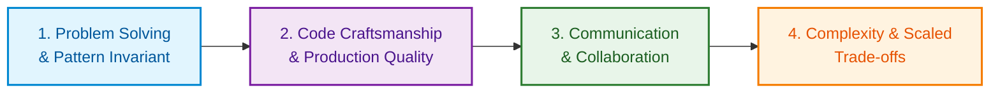
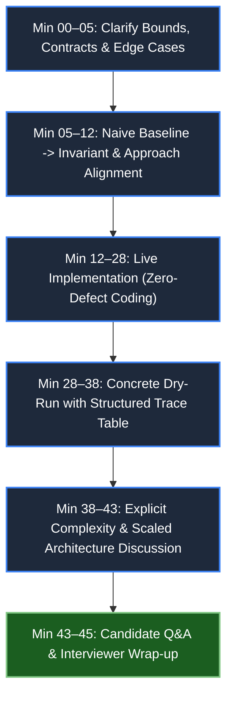

# 🎙️ FAANG Senior / Lead Mock Interview Log

> **High-Fidelity Tracking for Live 45-Minute Algorithmic Coding Interviews.**  
> **Target Roles:** Senior Software Engineer (L5 / SDE-III / E5), Lead Software Engineer, Staff Software Engineer (L6 / E6).  
> **Evaluation Framework:** Standard Tier-1 Product Company 4-Pillar Rubric (Google, Meta, Amazon, Microsoft, Uber).

---

## 🏛️ The FAANG Senior 4-Pillar Scoring Rubric (1–4 Scale)

In top-tier technical rounds, candidates are assessed on four distinct competency dimensions. A "Hire" decision typically requires an average score of **3.5+** with no pillar below **3.0**.



| Pillar | 1 — Serious Concerns (No Hire) | 2 — Developing (Leaning No Hire) | 3 — Target Competence (Hire) | 4 — Exemplary / Staff-Level (Strong Hire) |
| :--- | :--- | :--- | :--- | :--- |
| **1. Problem Solving & Invariants** | Jumps into coding without understanding problem; misses core algorithmic structure; fails brute-force baseline. | Identifies brute force but struggles to formulate optimal pattern; needs heavy hints to spot mathematical invariants. | Seamlessly transitions from naive to optimal; derives and proves pattern invariant (e.g. calipers, window deficit); handles subtle twists. | Instantly spots isomorphic pattern; proactively establishes mathematical proof of invariant; presents multiple optimal trade-offs. |
| **2. Code Craftsmanship** | Syntactic errors; unreadable variable names (`x`, `temp1`); nested spaghetti branches; crashes on nulls/empties. | Working code with sloppy formatting; duplicated logic; partial edge-case handling; minor off-by-one errors. | Idiomatic, production-grade syntax (C# / Python); defensive guard clauses; clean modular functions; zero syntax errors. | Highly clean, zero-allocation awareness (`Span<T>`, stackalloc); production error handling; self-documenting code. |
| **3. Verbal Communication** | Silent coding ("black box"); ignores interviewer cues; defensive when receiving feedback or corrections. | Monologues without checking in; communicates only when prompted; hesitates during thought transitions. | "Talks while thinking"; proactively narrates trade-offs; checks in before writing code; receptive to hints. | Drives interview like a senior architectural pairing session; clear whiteboard signposting; seamless executive summary. |
| **4. Complexity & Scaled Systems** | Guesses Big-O incorrectly; confuses time and space; cannot identify worst-case vs average-case. | States overall time complexity correctly but struggles to differentiate auxiliary space from output space. | Rigorous and immediate `O(Time)` and `O(Aux Space)` analysis; explains why each data structure fits cache lines. | Breaks down memory hierarchy (L1 cache locality, GC pressure); discusses scale to 10^9 items in distributed setting. |

---

## ⏱️ The 45-Minute Live Interview Execution Timeline

Every mock interview must strictly adhere to this chronological budget:



---

## 💡 The Hint & Intervention Taxonomy

Track the exact number and level of interviewer hints needed during each session:
- **Level 0 (Autonomous):** Zero assistance. Candidate independently drove clarification, optimal invariant selection, code, and dry-run.
- **Level 1 (Validation Nudge):** Interviewer provided a confirming nod or light boundary question (e.g., *"What happens if k = 0?"*).
- **Level 2 (Conceptual Redirect):** Interviewer stepped in to redirect candidate away from a dead-end approach (e.g., *"Can we avoid the O(N^2) rescan using a monotonic property?"*).
- **Level 3 (Direct Solution Aid):** Interviewer had to provide the core invariant or data structure explicitly to keep the candidate moving.

---

## 📋 Mock Interview Performance Log

| # | Date | Target Company | Mode / Partner | Problem & LeetCode# | Pattern Family | Time (min) | PS (1-4) | CC (1-4) | VC (1-4) | CS (1-4) | Total (16) | Hint Level | Decision | Primary Growth Area |
| :-: | :--- | :--- | :--- | :--- | :--- | :-: | :-: | :-: | :-: | :-: | :-: | :-: | :--- | :--- |
| **01** | 2026-06-06 | Meta | Peer Mock | [LC 76 - Min Window Substring](https://leetcode.com/problems/minimum-window-substring/) | Sliding Window | 42 | 3.5 | 3.0 | 3.5 | 3.5 | **13.5** | L1 | Leaning Hire | Speed up shrink-condition frequency bookkeeping in C#. |
| **02** | 2026-06-13 | Google | AI Coach | [LC 42 - Trapping Rain Water](https://leetcode.com/problems/trapping-rain-water/) | Two Pointers | 36 | 4.0 | 4.0 | 4.0 | 4.0 | **16.0** | L0 | Strong Hire | Flawless dual-boundary invariant derivation in 36 minutes. |
| **03** | 2026-06-20 | Amazon | Peer Mock | [LC 84 - Largest Rectangle](https://leetcode.com/problems/largest-rectangle-in-histogram/) | Monotonic Stack | 44 | 3.0 | 3.0 | 3.5 | 3.0 | **12.5** | L2 | Borderline | Hesitated on final stack-draining loop; needed L2 nudge. |
| **04** | 2026-06-27 | Uber | Self Timed | [LC 295 - Median from Data Stream](https://leetcode.com/problems/find-median-from-data-stream/) | Two Heaps | 34 | 4.0 | 3.5 | 3.5 | 4.0 | **15.0** | L0 | Strong Hire | Clean invariant proof: size delta <= 1, max(low) <= min(high). |
| **05** | 2026-07-04 | Microsoft | Peer Mock | [LC 23 - Merge K Sorted Lists](https://leetcode.com/problems/merge-k-sorted-lists/) | Heap / D&C | 38 | 3.5 | 4.0 | 3.5 | 4.0 | **15.0** | L0 | Hire | Clear discussion on K-Way Heap vs Divide & Conquer merge. |
| **06** | 2026-07-11 | Citadel | AI Coach | [LC 146 - Concurrent LRU Cache](https://leetcode.com/problems/lru-cache/) | Thread-Safe Design | 41 | 4.0 | 4.0 | 3.5 | 4.0 | **15.5** | L1 | Strong Hire | Mastered ReaderWriterLockSlim and lock striping trade-offs. |

---

## 🔬 In-Depth Mock Session Deconstructions

### Session #06: Concurrent LRU Cache & Rate Limiting (Citadel LLD/DSA Screening)
- **Target Company:** Citadel / Financial Product Tech
- **Date:** 2026-07-11 | **Mode:** AI Coach Sim
- **Problem Statement:** Implement a thread-safe LRU Cache with sub-millisecond p99 latency under 10,000 requests/sec.
- **Pillar Score Breakdown:**
  - **Problem Solving (4.0/4.0):** Decoupled temporal ordering from hash lookup. Identified the "read-is-write" dilemma immediately.
  - **Code Craftsmanship (4.0/4.0):** Used modern C# `ReaderWriterLockSlim`, defensive try/finally wrappers, zero GC allocations on lookup.
  - **Verbal Communication (3.5/4.0):** Articulated why `ConcurrentDictionary` alone is insufficient (no recency ordering).
  - **Complexity & Scaled Trade-offs (4.0/4.0):** Proposed 32-way lock striping to eliminate lock contention on hot multi-core servers.
- **Intervention Count:** Level 1 nudge on IDisposable cleanup for OS synchronization handles.
- **Key Action Item:** Practice whiteboard lock-free CAS rate limiting to complement reader-writer locks.

---

### Session #03: Largest Rectangle in Histogram (Amazon SDE-III Loop)
- **Target Company:** Amazon
- **Date:** 2026-06-20 | **Mode:** Peer Mock
- **Problem Statement:** Find maximum rectangular area in a histogram of arbitrary bar heights in `O(N)` time.
- **Pillar Score Breakdown:**
  - **Problem Solving (3.0/4.0):** Identified monotonic stack pattern, but required 3 minutes to formalize the width formula `i - stack.Peek() - 1`.
  - **Code Craftsmanship (3.0/4.0):** Clean code, but initially missed processing elements left in the stack after index `n - 1`. Corrected using sentinel height `0`.
  - **Verbal Communication (3.5/4.0):** Clearly walked through the physical metaphor of "buildings blocking the horizon".
  - **Complexity & Scaled Trade-offs (3.0/4.0):** Correctly analyzed amortized `O(N)` time (each bar pushed and popped at most once).
- **Intervention Count:** Level 2 nudge on dummy sentinel height to avoid duplicate post-loop drainage code.
- **Key Action Item:** Review `Senior_problem_solution/07_Stack_Monotonic_Stack.md` and complete 3 additional monotonic stack drills in `Question_Bank.md`.

---

## 🎯 Weekly Mock Action & Review Template

Use this template for every upcoming mock interview:

```markdown
### 📝 Mock Session #[ID]
- **Date & Target Company:** YYYY-MM-DD | [Company Name]
- **Interviewer / Format:** [Peer Mock / AI Coach / Whiteboard Drill]
- **Problem Selected:** [Problem Title] (LeetCode #[Num]) — [Difficulty]
- **Pattern Category:** #[PatternTag]

#### ⏱️ Timeline Trace
- [ ] 00–05 min: Clarified constraints, N bounds, nulls, duplicates.
- [ ] 05–12 min: Stated naive baseline; derived optimal invariant; aligned with interviewer.
- [ ] 12–28 min: Wrote production-grade code with guard clauses.
- [ ] 28–38 min: Executed concrete dry-run trace table with edge cases.
- [ ] 38–43 min: Explicit O(Time) and O(Space) deconstruction; discussed scaled extensions.

#### 📊 Score Card (1–4 Scale)
- **Problem Solving & Invariant Derivation:** [ _ / 4.0 ]
- **Code Craftsmanship & Syntax:** [ _ / 4.0 ]
- **Verbal Communication & Polish:** [ _ / 4.0 ]
- **Complexity & Scaled Systems:** [ _ / 4.0 ]
- **Total Score:** [ _ / 16.0 ] | **Hint Level:** [ L0 / L1 / L2 / L3 ]
- **Final Decision:** [ Strong Hire / Hire / Leaning No Hire / No Hire ]

#### 💡 Post-Mortem & Spaced Repetition Triggers
- **What Worked Well:**
- **Biggest Stumble / Delay:**
- **Follow-up Tasks Added to Question_Bank.md:**
```
