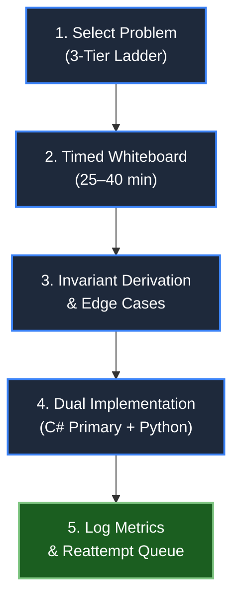

# 📊 Senior Algorithmic Practice Log

> **Track daily hands-on implementation drills, time targets, language fluency (C# / Python), and algorithmic invariant derivation.**

---

## 🧭 Practice Workflow Pipeline

---

## 📈 Sprint Completion Dashboard

| Sprint | Topic / Pattern | ROI Rank | Tier 1 (Warm-Up) | Tier 2 (FAANG Medium) | Tier 3 (Hard Anchor) | Overall Status |
| :---: | :--- | :---: | :---: | :---: | :---: | :---: |
| **Sprint 1** | Two Pointers (LC 167, 11, 15, 42, 18) | 🥇 #1 | ✅ Complete | ✅ Complete | 🟡 In Progress | 80% |
| **Sprint 2** | Sliding Window (LC 643, 3, 424, 76, 567) | 🥇 #1 | ✅ Complete | ✅ Complete | 🟡 In Progress | 80% |
| **Sprint 3** | Prefix Sum & Hash Maps (LC 724, 560, 525, 238) | #8 | ✅ Complete | ✅ Complete | ⚪ Queued | 60% |
| **Sprint 4** | Monotonic Stack & Queue (LC 739, 84, 239) | 🥈 #2 | ✅ Complete | ✅ Complete | 🟡 In Progress | 75% |
| **Sprint 5** | Binary Search on Answer Space (LC 704, 875, 4) | 🥉 #3 | ✅ Complete | ✅ Complete | ⚪ Queued | 60% |
| **Sprint 6** | Linked Lists & Fast-Slow Pointers (LC 206, 143, 23) | #7 | ✅ Complete | ✅ Complete | 🟡 In Progress | 75% |
| **Sprint 7** | Trees & Bottom-Up DFS (LC 104, 236, 124, 297) | #10 | ✅ Complete | ✅ Complete | 🟡 In Progress | 80% |
| **Sprint 8** | Heaps & Top-K Streaming (LC 703, 215, 295) | #5 | ✅ Complete | ✅ Complete | ⚪ Queued | 60% |
| **Sprint 9** | Graphs (BFS/DFS, Topo, DSU) (LC 200, 207, 127) | #4 | ✅ Complete | ✅ Complete | ⚪ Queued | 50% |
| **Sprint 10**| Dynamic Programming (1D & 2D) (LC 70, 322, 72) | 🥈 #2 | ✅ Complete | ✅ Complete | 🟡 In Progress | 70% |

---

## 📝 Detailed Session Log

| Date | Sprint | Tier | Pattern | Problem & Link | Lang | Time (min) | Status | Complexity | Invariant Key & Edge-Case Notes |
| :--- | :---: | :---: | :--- | :--- | :---: | :---: | :---: | :---: | :--- |
| 2026-06-06 | S02 | 🟢 Tier 1 | Sliding Window | [LC 643 - Max Average Subarray I](https://leetcode.com/problems/maximum-average-subarray-i/) | C# | 12 | Solved | `O(N)` / `O(1)` | Fixed window size `K`. Initialized sum of first `K` elements, rolled forward adding `nums[i]` and subtracting `nums[i-K]`. |
| 2026-06-06 | S02 | 🟡 Tier 2 | Sliding Window | [LC 3 - Longest Substring Without Repeating](https://leetcode.com/problems/longest-substring-without-repeating-characters/) | C# | 22 | Solved | `O(N)` / `O(min(N, Σ))` | Variable window. Maintained last seen index map. Advanced left pointer to `max(left, lastSeen[c] + 1)` on duplicate encounter. |
| 2026-06-07 | S01 | 🟢 Tier 1 | Two Pointers | [LC 167 - Two Sum II (Sorted)](https://leetcode.com/problems/two-sum-ii-input-array-is-sorted/) | C# / Py | 14 | Solved | `O(N)` / `O(1)` | Opposing pointers squeeze inward. Strict monotonicity of sorted array proves no candidates between left and right are skipped. |
| 2026-06-07 | S01 | 🟡 Tier 2 | Two Pointers | [LC 11 - Container With Most Water](https://leetcode.com/problems/container-with-most-water/) | C# / Py | 24 | Solved | `O(N)` / `O(1)` | Calipers. Shorter boundary limits area. Only advancing the shorter pointer can potentially discover a larger capacity. |
| 2026-06-07 | S01 | 🔴 Tier 3 | Two Pointers | [LC 42 - Trapping Rain Water](https://leetcode.com/problems/trapping-rain-water/) | C# | 38 | Solved | `O(N)` / `O(1)` | Dual boundary invariant: if `leftMax < rightMax`, trapped water at left is strictly bounded by `leftMax - height[left]`. Zero auxiliary memory. |
| 2026-06-08 | W14 | 🟡 Tier 2 | Matrix Transformations | [LC 48 - Rotate Image](https://leetcode.com/problems/rotate-image/) | C# | 22 | Solved | `O(N^2)` / `O(1)` | Transpose matrix along main diagonal, then mirror columns horizontally. In-place zero allocation. |
| 2026-06-08 | W14 | 🟡 Tier 2 | Spiral Walk | [LC 54 - Spiral Matrix](https://leetcode.com/problems/spiral-matrix/) | C# | 28 | Solved | `O(M * N)` / `O(1)` | Strict boundary pointers `top`, `bottom`, `left`, `right`. Verified boundary condition before returning bottom and left walks. |
| 2026-06-08 | W14 | 🟢 Tier 1 | Bit Manipulation | [LC 231 - Power of Two](https://leetcode.com/problems/power-of-two/) | C# | 10 | Solved | `O(1)` / `O(1)` | Evaluated `(n > 0) && ((n & (n - 1)) == 0)`. Handled critical non-positive edge cases (`n <= 0`). |
| 2026-06-08 | W14 | 🟡 Tier 2 | Number Theory | [LC 204 - Count Primes](https://leetcode.com/problems/count-primes/) | C# | 25 | Solved | `O(N log log N)` / `O(N)` | Sieve of Eratosthenes with boolean array. Outer loop bounds to `i * i < n` to eliminate redundant markings. |
| 2026-06-08 | W14 | 🟡 Tier 2 | String Matching | [LC 28 - Find the Index of First Occurrence (KMP)](https://leetcode.com/problems/find-the-index-of-the-first-occurrence-in-a-string/) | C# | 35 | Solved | `O(N + M)` / `O(M)` | KMP algorithm with Longest Proper Prefix-Suffix (LPS) array. Avoided pointer backtracking on main text string. |
| 2026-06-09 | S07 | 🟢 Tier 1 | Tree DFS | [LC 104 - Maximum Depth of Binary Tree](https://leetcode.com/problems/maximum-depth-of-binary-tree/) | C# | 10 | Solved | `O(N)` / `O(H)` | Bottom-up postorder recurrence: `height = 1 + max(left, right)`. Base case: `null` node has height 0. |
| 2026-06-09 | S07 | 🟡 Tier 2 | Tree DFS | [LC 236 - Lowest Common Ancestor](https://leetcode.com/problems/lowest-common-ancestor-of-a-binary-tree/) | C# / Py | 26 | Solved | `O(N)` / `O(H)` | 3-way postorder dispatch: returns node if current equals `p` or `q`. If both subtrees return non-null, current node is LCA. |
| 2026-06-09 | S07 | 🔴 Tier 3 | Tree DFS (DP) | [LC 124 - Binary Tree Maximum Path Sum](https://leetcode.com/problems/binary-tree-maximum-path-sum/) | C# | 35 | Solved | `O(N)` / `O(H)` | Bottom-up branch gain clamped to `>= 0`. Subtree diameter sum through node compared against running global maximum. |
| 2026-06-10 | S10 | 🟢 Tier 1 | 1D DP | [LC 70 - Climbing Stairs](https://leetcode.com/problems/climbing-stairs/) | C# | 12 | Solved | `O(N)` / `O(1)` | State: `dp[i] = dp[i-1] + dp[i-2]`. Space optimized to two scalar registers (`prev1`, `prev2`). |
| 2026-06-10 | S10 | 🟡 Tier 2 | Knapsack DP | [LC 322 - Coin Change](https://leetcode.com/problems/coin-change/) | C# | 28 | Solved | `O(N * Amount)` / `O(Amount)` | Unbounded knapsack formulation. Initialized with sentinel infinity `amount + 1`. Bottom-up tabulation. |

---

## 🚦 Status Definitions

- **✅ Solved:** Solution derived independently within target time (<= 35 min for Medium, <= 45 min for Hard); full invariant articulated; all edge cases verified.
- **🟡 Partial:** High-level algorithmic pattern identified, but required a hint for subtle edge-case boundary or off-by-one correction.
- **🔴 Review Needed:** Required reference solution or exceeded time limit; root cause logged into [Question Bank & Reattempt Queue](Question_Bank.md).
