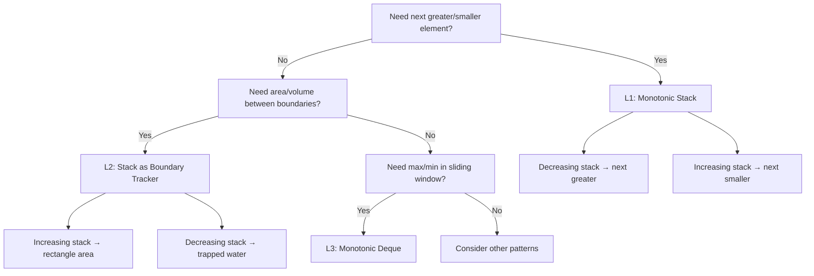

# Monotonic Stack / Queue — Traversal Mastery Curriculum v1

---

## Summary Table

| Level | Mental Model | Stack/Queue State | Drill Problems |
|-------|-------------|-------------------|----------------|
| **L1 — Next Greater Element** | Maintain a **decreasing stack** of unresolved elements; each new element resolves all smaller pending entries | Stack holds indices of elements awaiting their "next greater" | LC 496, 503, 739, 1475 |
| **L2 — Histogram & Trapping Water** | Stack tracks **boundaries**; a pop event means we found a rectangle/water-trap bounded on both sides | Stack holds indices forming a monotonic sequence of heights | LC 84, 42, 85, 907 |
| **L3 — Sliding Window Maximum (Monotonic Deque)** | Maintain a **decreasing deque** of candidates; front = current window max; expire stale indices from front | Deque holds indices of elements in decreasing value order within the window | LC 239, 1438, 862, 1499 |

---

## Level 1 — Next Greater Element (Monotonic Decreasing Stack)

### Mental Model

> **Core idea**: Scan elements left-to-right (or right-to-left). Maintain a stack of *unresolved* elements (those that haven't found their next greater yet). When a new element `nums[i]` arrives and is **greater** than `stack[-1]`, it *is* the next greater element for everything it can pop.

| Concept | Definition |
|---------|-----------|
| **What does the index `i` mean?** | Current element being processed in the scan |
| **What region is processed?** | `nums[0..i-1]` — all elements before `i` have been pushed; some have been resolved (popped) |
| **Invariant** | Stack is always **monotonically decreasing** (top is smallest). Every element in the stack is still waiting for its next greater element |

### Visual State Transition — `nums = [2, 1, 2, 4, 3]`

| Step | `i` | `nums[i]` | Stack (values) | Action | Result Updated |
|------|-----|-----------|----------------|--------|----------------|
| 0 | 0 | 2 | `[2]` | Push 2 | — |
| 1 | 1 | 1 | `[2, 1]` | 1 < 2 → Push | — |
| 2 | 2 | 2 | `[2, 2]` | 2 ≥ 1 → Pop 1, result[1]=2; 2 = 2 → stop; Push 2 | `res[1]=2` |
| 3 | 3 | 4 | `[4]` | 4 > 2 → Pop 2, res[2]=4; 4 > 2 → Pop 2, res[0]=4; Push 4 | `res[0]=4, res[2]=4` |
| 4 | 4 | 3 | `[4, 3]` | 3 < 4 → Push | — |
| End | — | — | `[4, 3]` | Remaining → result = -1 | `res[3]=-1, res[4]=-1` |

**Final**: `[4, 2, 4, -1, -1]`

### Code

**Problem: Given an array, find the next greater element for each element — i.e., the first element to its right that is strictly larger. Return `-1` if none exists.**

```python
def next_greater_element(nums: list[int]) -> list[int]:
    n = len(nums)
    # 1. Initialize result: default -1 for elements with no next greater
    res = [-1] * n
    # 2. Stack stores indices; invariant: values at these indices are monotonically decreasing
    stack = []
    for i in range(n):
        # 3. Resolve: nums[i] is the next greater element for all smaller pending entries
        while stack and nums[i] > nums[stack[-1]]:
            idx = stack.pop()
            res[idx] = nums[i]
        # 4. Push current index as a new unresolved entry
        stack.append(i)
    # 5. Any indices still in the stack have no next greater element (already -1)
    return res
```

```csharp
public int[] NextGreaterElement(int[] nums)
{
    int n = nums.Length;
    // 1. Initialize result: default -1 for elements with no next greater
    int[] res = new int[n];
    Array.Fill(res, -1);
    // 2. Stack stores indices; invariant: values at these indices are monotonically decreasing
    var stack = new Stack<int>();

    for (int i = 0; i < n; i++)
    {
        // 3. Resolve: nums[i] is the next greater element for all smaller pending entries
        while (stack.Count > 0 && nums[i] > nums[stack.Peek()])
        {
            int idx = stack.Pop();
            res[idx] = nums[i];
        }
        // 4. Push current index as a new unresolved entry
        stack.Push(i);
    }
    // 5. Any indices still in the stack have no next greater element (already -1)
    return res;
}
```

#### Variant — Circular Array (Next Greater Element II)

**Problem: Same as above, but the array is circular — the search wraps around from the end back to the beginning.**

For circular arrays, iterate `2 * n` times and use `i % n`:

```python
def next_greater_circular(nums: list[int]) -> list[int]:
    n = len(nums)
    # 1. Initialize result: default -1 for all positions
    res = [-1] * n
    # 2. Stack of indices (into the original array), monotonically decreasing by value
    stack = []
    # 3. Simulate circularity by iterating twice through the array
    for i in range(2 * n):
        # 4. Resolve: current element is the next greater for all smaller pending entries
        while stack and nums[i % n] > nums[stack[-1]]:
            res[stack.pop()] = nums[i % n]
        # 5. Only push indices from the first pass to avoid duplicate entries
        if i < n:
            stack.append(i)
    return res
```

### ⚠️ Gotchas & Pitfalls

| # | Pitfall | Detail |
|---|---------|--------|
| 1 | **Strict vs Non-strict** | `>` gives *next strictly greater*. Using `>=` changes semantics to *next greater or equal* — this matters for problems like LC 907 (Sum of Subarray Minimums). Always clarify which comparison the problem requires. |
| 2 | **Forgetting remaining stack items** | Elements left in the stack after the full scan have **no** next greater element. Initialize `res` to `-1` (or `0`, per problem) so these are handled implicitly. |
| 3 | **Index vs Value on stack** | Always push **indices** not raw values. You need the index to write back into `res[idx]`. Pushing values alone loses positional information. |

### Drill Problems

| Problem | Difficulty | Focus |
|---------|-----------|-------|
| [LeetCode 496: Next Greater Element I](https://leetcode.com/problems/next-greater-element-i/) | Easy | Hash-map + monotonic stack on `nums2` |
| [LeetCode 739: Daily Temperatures](https://leetcode.com/problems/daily-temperatures/) | Medium | Classic next-greater with index distance |
| [LeetCode 503: Next Greater Element II](https://leetcode.com/problems/next-greater-element-ii/) | Medium | Circular array — double-pass trick |
| [LeetCode 1475: Final Prices With a Special Discount](https://leetcode.com/problems/final-prices-with-a-special-discount-in-a-shop/) | Easy | Next smaller or equal (flip comparison) |

---

## Level 2 — Histogram & Trapping Water (Stack as Boundary Tracker)

### Mental Model

> **Core idea**: The stack tracks a sequence of bars/heights. A **pop** means we've found a bounded region — the popped element is the *bottleneck* (shortest bar or trapped depth), the new stack top is the *left boundary*, and the current index `i` is the *right boundary*.

| Concept | Definition |
|---------|-----------|
| **What does the index `i` mean?** | Right boundary of the potential rectangle / water trap |
| **What region is processed?** | All bars `0..i-1`; rectangles fully enclosed before `i` are computed |
| **Invariant (Histogram)** | Stack is **monotonically increasing** by height. A pop computes the maximal rectangle with the popped bar as the *shortest* bar |
| **Invariant (Trapping Water)** | Stack is **monotonically decreasing** by height. A pop computes the water layer trapped above the popped bar, bounded by left-wall (new top) and right-wall (`i`) |

### Visual State Transition — Largest Rectangle in Histogram

`heights = [2, 1, 5, 6, 2, 3]`

| Step | `i` | `h[i]` | Stack (idx→val) | Pop & Area Calc | Max Area |
|------|-----|--------|-----------------|-----------------|----------|
| 0 | 0 | 2 | `[0→2]` | — | 0 |
| 1 | 1 | 1 | `[1→1]` | Pop 0: h=2, w=1, area=2 | **2** |
| 2 | 2 | 5 | `[1→1, 2→5]` | — | 2 |
| 3 | 3 | 6 | `[1→1, 2→5, 3→6]` | — | 2 |
| 4 | 4 | 2 | `[1→1, 4→2]` | Pop 3: h=6, w=1, area=6; Pop 2: h=5, w=2, area=10 | **10** |
| 5 | 5 | 3 | `[1→1, 4→2, 5→3]` | — | 10 |
| End | — | — | drain | Pop 5: h=3, w=1, area=3; Pop 4: h=2, w=4, area=8; Pop 1: h=1, w=6, area=6 | **10** |

**Width formula**: `width = i - stack[-1] - 1` (if stack non-empty after pop), else `width = i`.

### Code — Largest Rectangle in Histogram

**Problem: Given an array of bar heights, find the area of the largest rectangle that fits entirely under the histogram.**

```python
def largest_rectangle_area(heights: list[int]) -> int:
    # 1. Stack stores indices; invariant: heights at these indices are monotonically increasing
    stack = []
    max_area = 0
    # 2. Append sentinel height 0 to force all remaining bars to be popped at the end
    heights.append(0)

    for i, h in enumerate(heights):
        # 3. Pop when current bar is shorter: the popped bar's rectangle is now bounded
        while stack and heights[stack[-1]] > h:
            # 4. Popped bar is the shortest bar in the rectangle
            height = heights[stack.pop()]
            # 5. Width: extends from (new stack top + 1) to (i - 1); if stack empty, extends to index 0
            width = i if not stack else i - stack[-1] - 1
            # 6. Update maximum area
            max_area = max(max_area, height * width)
        # 7. Push current index — maintains increasing invariant
        stack.append(i)

    # 8. Remove sentinel to restore original input
    heights.pop()
    return max_area
```

```csharp
public int LargestRectangleArea(int[] heights)
{
    int n = heights.Length;
    // 1. Stack stores indices; invariant: heights at these indices are monotonically increasing
    var stack = new Stack<int>();
    int maxArea = 0;

    for (int i = 0; i <= n; i++)
    {
        // 2. Treat index n as a sentinel bar of height 0 to flush remaining bars
        int h = (i == n) ? 0 : heights[i];
        // 3. Pop when current bar is shorter: the popped bar's rectangle is now bounded
        while (stack.Count > 0 && heights[stack.Peek()] > h)
        {
            // 4. Popped bar is the shortest bar in the rectangle
            int height = heights[stack.Pop()];
            // 5. Width: extends from (new stack top + 1) to (i - 1); if stack empty, extends to index 0
            int width = stack.Count == 0 ? i : i - stack.Peek() - 1;
            // 6. Update maximum area
            maxArea = Math.Max(maxArea, height * width);
        }
        // 7. Push current index — maintains increasing invariant
        stack.Push(i);
    }
    return maxArea;
}
```

### Code — Trapping Rain Water (Stack-Based)

**Problem: Given an elevation map (array of non-negative integers representing bar heights), compute how much rain water can be trapped between the bars after raining.**

```python
def trap(height: list[int]) -> int:
    # 1. Stack stores indices; invariant: heights at these indices are monotonically decreasing
    stack = []
    water = 0

    for i, h in enumerate(height):
        # 2. Current bar is taller than the stack top → water is trapped above the top bar
        while stack and h > height[stack[-1]]:
            # 3. Pop the bottom of the water layer
            bottom = height[stack.pop()]
            # 4. If stack is empty after pop, there is no left wall → no water trapped
            if not stack:
                break
            # 5. Left boundary is the new stack top
            left = stack[-1]
            # 6. Water height = min(left wall, right wall) − bottom elevation
            bounded_height = min(height[left], h) - bottom
            # 7. Water width = horizontal distance between left and right boundaries
            width = i - left - 1
            # 8. Accumulate the water volume for this layer
            water += bounded_height * width
        # 9. Push current index — maintains decreasing invariant
        stack.append(i)

    return water
```

```csharp
public int Trap(int[] height)
{
    // 1. Stack stores indices; invariant: heights at these indices are monotonically decreasing
    var stack = new Stack<int>();
    int water = 0;

    for (int i = 0; i < height.Length; i++)
    {
        // 2. Current bar is taller than the stack top → water is trapped above the top bar
        while (stack.Count > 0 && height[i] > height[stack.Peek()])
        {
            // 3. Pop the bottom of the water layer
            int bottom = height[stack.Pop()];
            // 4. If stack is empty after pop, there is no left wall → no water trapped
            if (stack.Count == 0) break;
            // 5. Left boundary is the new stack top
            int left = stack.Peek();
            // 6. Water height = min(left wall, right wall) − bottom elevation
            int boundedHeight = Math.Min(height[left], height[i]) - bottom;
            // 7. Water width = horizontal distance between left and right boundaries
            int width = i - left - 1;
            // 8. Accumulate the water volume for this layer
            water += boundedHeight * width;
        }
        // 9. Push current index — maintains decreasing invariant
        stack.Push(i);
    }
    return water;
}
```

### ⚠️ Gotchas & Pitfalls

| # | Pitfall | Detail |
|---|---------|--------|
| 1 | **Sentinel trick** | Appending `0` at the end of `heights` forces all remaining bars to be popped. If you forget this, bars remaining in the stack are never evaluated. Alternatively, drain the stack in a post-loop. |
| 2 | **Width calculation after pop** | After popping, the width extends back to `stack[-1] + 1` (left boundary), **not** to the popped index. If the stack is empty after popping, the width is `i` (the bar extends to the very beginning). This is the #1 bug source. |
| 3 | **Trapping Water: empty stack after pop** | After popping the bottom bar, if the stack is empty there is **no left wall** → no water can be trapped. You must `break` out of the while-loop, not continue calculating. |

### Drill Problems

| Problem | Difficulty | Focus |
|---------|-----------|-------|
| [LeetCode 84: Largest Rectangle in Histogram](https://leetcode.com/problems/largest-rectangle-in-histogram/) | Hard | Core monotonic increasing stack pattern |
| [LeetCode 42: Trapping Rain Water](https://leetcode.com/problems/trapping-rain-water/) | Hard | Monotonic decreasing stack; layer-by-layer water |
| [LeetCode 85: Maximal Rectangle](https://leetcode.com/problems/maximal-rectangle/) | Hard | Row-by-row histogram reduction → LC 84 |
| [LeetCode 907: Sum of Subarray Minimums](https://leetcode.com/problems/sum-of-subarray-minimums/) | Medium | Contribution technique; previous-less & next-less element via stack |

---

## Level 3 — Sliding Window Maximum (Monotonic Deque)

### Mental Model

> **Core idea**: Maintain a **double-ended queue (deque)** of indices whose corresponding values are in **strictly decreasing** order. The front of the deque is always the index of the current window maximum. As the window slides, we (1) expire indices that fall outside the window from the **front**, and (2) remove indices from the **back** that are ≤ the new element (they can never be a future window max).

| Concept | Definition |
|---------|-----------|
| **What does index `i` mean?** | Right edge of the sliding window `[i-k+1, i]` |
| **What region is processed?** | Window `[i-k+1 .. i]` is the active window; results emitted for `i ≥ k-1` |
| **Invariant** | Deque stores indices in **increasing order** of index but **decreasing order** of value. `deque[0]` is always the index of the maximum value in the current window |

### Visual State Transition — `nums = [1, 3, -1, -3, 5, 3, 6, 7]`, `k = 3`

| Step | `i` | `nums[i]` | Deque (idx→val) | Expire Front? | Trim Back? | Window Max |
|------|-----|-----------|-----------------|---------------|------------|------------|
| 0 | 0 | 1 | `[0→1]` | — | — | — |
| 1 | 1 | 3 | `[1→3]` | — | Pop 0 (1<3) | — |
| 2 | 2 | -1 | `[1→3, 2→-1]` | — | — | **3** |
| 3 | 3 | -3 | `[1→3, 2→-1, 3→-3]` | — | — | **3** |
| 4 | 4 | 5 | `[4→5]` | Pop 1 (out of window) | Pop all (5 > all) | **5** |
| 5 | 5 | 3 | `[4→5, 5→3]` | — | — | **5** |
| 6 | 6 | 6 | `[6→6]` | Pop 4 (out of window) | Pop 5,5→3 (6>3); Pop 4→5 already gone | **6** |
| 7 | 7 | 7 | `[7→7]` | — | Pop 6 (7>6) | **7** |

**Output**: `[3, 3, 5, 5, 6, 7]`

### Code

**Problem: Given an array and a window size `k`, return the maximum value in each sliding window of size `k` as it moves from left to right.**

```python
from collections import deque

def max_sliding_window(nums: list[int], k: int) -> list[int]:
    # 1. Deque stores indices; invariant: values at these indices are monotonically decreasing
    dq = deque()
    result = []

    for i in range(len(nums)):
        # 2. Expire: remove the front index if it has slid out of the current window [i-k+1, i]
        if dq and dq[0] < i - k + 1:
            dq.popleft()

        # 3. Trim back: remove all indices whose values are ≤ nums[i] — they can never be a future window max
        while dq and nums[dq[-1]] <= nums[i]:
            dq.pop()

        # 4. Add current index to the deque as a new candidate
        dq.append(i)

        # 5. Record result: once the first full window is formed (i >= k-1), front of deque is the window max
        if i >= k - 1:
            result.append(nums[dq[0]])

    return result
```

```csharp
public int[] MaxSlidingWindow(int[] nums, int k)
{
    // 1. Deque stores indices; invariant: values at these indices are monotonically decreasing
    var dq = new LinkedList<int>();
    int n = nums.Length;
    int[] result = new int[n - k + 1];
    int ri = 0;

    for (int i = 0; i < n; i++)
    {
        // 2. Expire: remove the front index if it has slid out of the current window [i-k+1, i]
        if (dq.Count > 0 && dq.First.Value < i - k + 1)
            dq.RemoveFirst();

        // 3. Trim back: remove all indices whose values are ≤ nums[i] — they can never be a future window max
        while (dq.Count > 0 && nums[dq.Last.Value] <= nums[i])
            dq.RemoveLast();

        // 4. Add current index to the deque as a new candidate
        dq.AddLast(i);

        // 5. Record result: once the first full window is formed (i >= k-1), front of deque is the window max
        if (i >= k - 1)
            result[ri++] = nums[dq.First.Value];
    }
    return result;
}
```

### Monotonic Deque for Minimum (Variant)

**Problem: Same as sliding window maximum, but return the minimum value in each window instead. Flip the deque to maintain an increasing order.**

Flip the comparison to `>=` to maintain an **increasing** deque for sliding window **minimum**:

```python
def min_sliding_window(nums: list[int], k: int) -> list[int]:
    # 1. Deque stores indices; invariant: values at these indices are monotonically increasing
    dq = deque()
    result = []
    for i in range(len(nums)):
        # 2. Expire: remove front if it has slid out of the window
        if dq and dq[0] < i - k + 1:
            dq.popleft()
        # 3. Trim back: remove all indices whose values are >= nums[i] (increasing deque)
        while dq and nums[dq[-1]] >= nums[i]:
            dq.pop()
        # 4. Add current index as a new candidate
        dq.append(i)
        # 5. Record the window minimum once the first full window is formed
        if i >= k - 1:
            result.append(nums[dq[0]])
    return result
```

### ⚠️ Gotchas & Pitfalls

| # | Pitfall | Detail |
|---|---------|--------|
| 1 | **Expiry check: `<` vs `<=`** | The front index should be removed when `dq[0] < i - k + 1` (i.e., it is strictly outside the window). Using `<=` would incorrectly expire a valid element. Off-by-one here silently produces wrong answers on edge windows. |
| 2 | **`<=` vs `<` in back trimming** | Using `<` (strict) in the back trim keeps duplicates in the deque. Using `<=` removes equal elements. For *sliding window max*, `<=` is correct — equal-valued older elements can never beat the newer one. For problems needing *count* of maxima, you may need `<`. |
| 3 | **Result emission timing** | Results should only be collected when `i >= k - 1` (first full window). Emitting earlier produces garbage values. Also ensure the result array has exactly `n - k + 1` entries. |

### Drill Problems

| Problem | Difficulty | Focus |
|---------|-----------|-------|
| [LeetCode 239: Sliding Window Maximum](https://leetcode.com/problems/sliding-window-maximum/) | Hard | Core monotonic deque pattern |
| [LeetCode 1438: Longest Continuous Subarray With Absolute Diff ≤ Limit](https://leetcode.com/problems/longest-continuous-subarray-with-absolute-diff-less-than-or-equal-to-limit/) | Medium | Dual deque (max-deque + min-deque) with sliding window |
| [LeetCode 862: Shortest Subarray with Sum at Least K](https://leetcode.com/problems/shortest-subarray-with-sum-at-least-k/) | Hard | Monotonic deque on prefix sums; handles negatives |
| [LeetCode 1499: Max Value of Equation](https://leetcode.com/problems/max-value-of-equation/) | Hard | Deque optimization on `yi - xi + yj + xj` decomposition |

---

## Cross-Level Complexity Reference

| Operation | Stack Direction | Pop Means | Time | Space |
|-----------|----------------|-----------|------|-------|
| Next Greater Element | Decreasing stack | Found a greater element to the right | O(n) | O(n) |
| Largest Rectangle | Increasing stack | Found a shorter bar → compute bounded rectangle | O(n) | O(n) |
| Trapping Rain Water | Decreasing stack | Found a taller bar → compute water layer | O(n) | O(n) |
| Sliding Window Max | Decreasing deque | Expired or dominated candidate removed | O(n) | O(k) |

---

## Decision Flowchart


