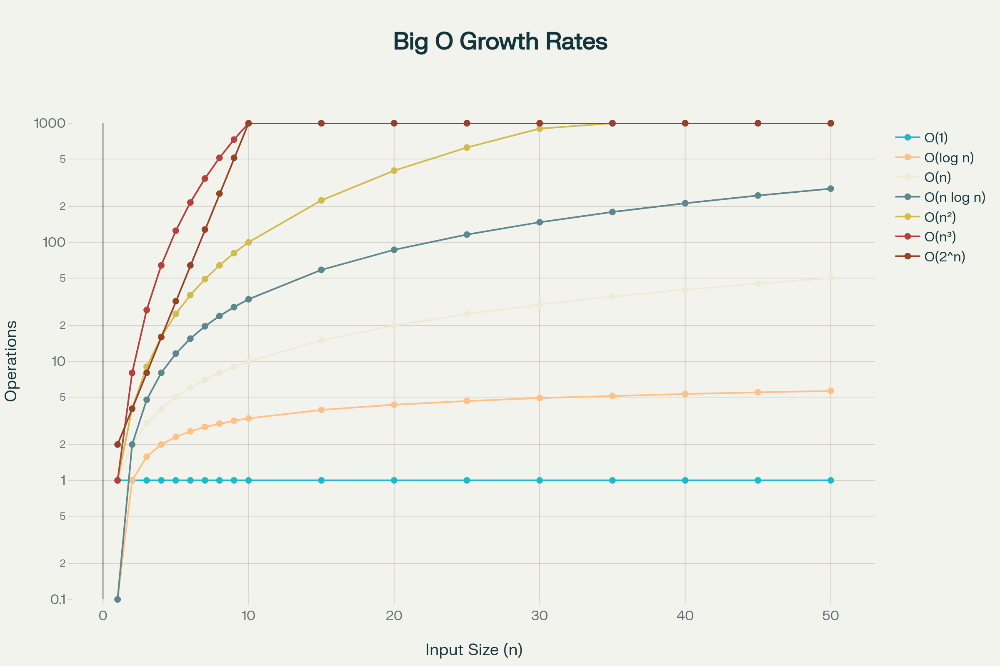

# 🎯 WEEK 1 DAY 2: ASYMPTOTIC ANALYSIS (BIG-O, BIG-OMEGA, BIG-THETA) — COMPLETE GUIDE

**Category:** Foundations / Computational Theory  
**Difficulty:** 🟢 Foundation  
**Prerequisites:** Week 1 Day 1 (RAM Model & Pointers), Basic Algebra (functions, growth rates)  
**Interview Frequency:** ~100% (Every technical interview requires complexity analysis)  
**Real-World Impact:** Defines the scalability of every software system. Determines whether a system can handle 10 users or 10 million users.

---

## 🎓 LEARNING OBJECTIVES

By the end of this topic, you will be able to:

- ✅ Understand **why** we measure algorithm efficiency using growth rates (asymptotics) rather than seconds or milliseconds
- ✅ Explain the precise meaning of **Big-O** (Upper Bound), **Big-Omega** (Lower Bound), and **Big-Theta** (Tight Bound)
- ✅ Recognize common complexity classes: Constant O(1), Logarithmic O(log n), Linear O(n), Quadratic O(n²), and Exponential O(2ⁿ)
- ✅ Analyze code snippets to determine their time and space complexity
- ✅ Compare algorithms theoretically and understand when "slower" algorithms might be faster in practice due to constants

| 🎯 Objective | 📍 Primary Section(s) |
|--------------|----------------------|
| Motivation for growth rates | Section 1, Section 2 |
| Formal definitions (O, Ω, Θ) | Section 2, Section 8 |
| Common complexity classes | Section 2, Section 5 |
| Code analysis mechanics | Section 3, Section 4 |
| Theoretical vs Practical performance | Section 5, Section 6 |

---

## 🤔 SECTION 1: THE WHY — Engineering Motivation

**Purpose:** Motivate asymptotic analysis with concrete engineering problems and trade-offs.

### 🎯 Real-World Problems This Solves

#### **Problem 1: Selecting the Right Tool for Scale**

- 🌍 **Where:** Database design, Search engines, Social networks
- 💼 **Why it matters:** An algorithm that runs instantly on a developer's laptop with 100 items might take 100 years to finish with 1 billion items (e.g., Google Search index).
- 🏭 **Example system:** **Sorting user search results**. If we use Bubble Sort O(n²) for 10,000 results, it takes ~100 million operations. If we use Merge Sort O(n log n), it takes ~140,000 operations. The difference is "instant" vs "server timeout."
- 🔧 **Solution:** Asymptotic analysis allows us to predict how an algorithm behaves as input size (n) grows toward infinity, *before* we write the code.

#### **Problem 2: Service Level Agreement (SLA) Guarantees**

- 🌍 **Where:** Cloud services (AWS Lambda), Financial trading systems, Real-time APIs
- 💼 **Why it matters:** Companies guarantee response times (e.g., "99% of requests within 200ms").
- 🏭 **Example system:** **API Rate Limiter**. We need to check if a user has exceeded their limit.
- 🔧 **Solution:** We choose a Hash Map O(1) or Token Bucket O(1) algorithm. If we used a linear scan O(n) through logs, the API would slow down as more users joined, violating the SLA. Big-O proves the system *scales* effectively.

#### **Problem 3: Resource Provisioning and Cost Estimation**

- 🌍 **Where:** Cloud infrastructure, Capacity planning
- 💼 **Why it matters:** Estimating server costs.
- 🏭 **Example system:** **Processing daily logs**. If processing time grows quadratically O(n²), doubling the user base requires 4x more servers. If linear O(n), it requires only 2x more servers.
- 🔧 **Solution:** Understanding complexity classes helps CTOs and architects predict hardware budget requirements years in advance.

### ⚖ Design Problem & Trade-offs

**Core Design Problem:** How do we compare the efficiency of two algorithms without running them on every possible computer?

- **The Challenge:** Running time depends on hardware (CPU speed, RAM speed), compiler optimizations, and current system load. Measuring "seconds" is unreliable.
- **The Goal:** A hardware-independent measurement that captures the *fundamental efficiency* of the logic itself.

**Main Goals:**

- ⏱ **Scalability Prediction:** Know how performance degrades as data grows.
- 🧮 **Hardware Independence:** Valid analysis regardless of whether it runs on a supercomputer or a smartphone.
- 📐 **Worst-Case Safety:** Guarantee the algorithm won't hang/crash on difficult inputs.

**What We Give Up:**

- ❌ **Precise Timing:** Big-O doesn't tell you if it takes 10ms or 50ms, just the *growth trend*.
- ❌ **Constant Factors:** O(n) might be slower than O(n²) for very small inputs (e.g., n < 10) due to setup costs, which Big-O ignores.

### 💼 Interview Relevance

- **Every Coding Question:** "What is the time and space complexity of your solution?" is the standard closing question for every technical interview.
- **System Design:** "How does this scale?" translates directly to "What is the asymptotic complexity of the core operations?"
- **Optimization:** "Can you do better?" usually means "Can you reduce the Big-O complexity?" (e.g., from O(n²) to O(n)).

---

## 📌 SECTION 2: THE WHAT — Mental Model & Core Concepts

**Purpose:** Build a mental picture: analogy, shape, invariants, and key variations.

### 🧠 Core Analogy

> **"Think of Asymptotic Analysis like describing the 'Top Speed' of a vehicle versus its 'Acceleration'."**
>
> - **O(1) (Constant):** Teleportation. Distance doesn't matter; it takes the same time to go anywhere.
> - **O(log n) (Logarithmic):** A Jet Plane. Takes a bit of time to start, but doubling the distance only adds a tiny bit of flight time.
> - **O(n) (Linear):** A Car driving at constant speed. Double the distance = double the time.
> - **O(n²) (Quadratic):** A Rocket that gets *heavier* the further it goes. To go 2 miles takes 4x fuel/time; to go 3 miles takes 9x. It becomes impossible very quickly.
> - **O(2ⁿ) (Exponential):** Cell division (bacterial growth). The work explodes unimaginably fast.

### 🖼 Visual Representation

**Growth Rate Curves (The "Shape" of Complexity):**



**Key Takeaway from Visual:**
- For small `n`, the lines are close together.
- As `n` gets large (the "asymptotic" part), the gap between curves becomes massive.
- **This is why we care about Big-O:** It describes the *trajectory* as n → infinity.

### 🔑 Core Invariants

These properties are the rules of the game for Big-O analysis:

1. **Drop Constants:** `O(2n)` is just `O(n)`. `O(500n)` is just `O(n)`.
   - *Why:* We care about the *shape* of the curve, not the slope. Both are straight lines.
2. **Drop Non-Dominant Terms:** `O(n² + n)` is just `O(n²)`.
   - *Why:* As `n` becomes huge, `n²` is so much larger than `n` that the `n` part becomes irrelevant noise.
3. **Worst-Case Assumption (Big-O):** Unless specified, we usually care about the Worst Case.
   - *Why:* Engineers need guarantees. "It usually works fast" isn't good enough for critical systems.

### 📋 Core Concepts & Variations (List All)

#### 1. **Big-O (O) — Upper Bound (Worst Case)**
- **What it is:** The "Speed Limit". The algorithm will never be slower than this.
- **Analogy:** "I will arrive in **at most** 1 hour." (Could be 10 mins, but definitely not 2 hours).
- **Use:** Guaranteeing performance limits.

#### 2. **Big-Omega (Ω) — Lower Bound (Best Case)**
- **What it is:** The "Minimum Speed". The algorithm will never be faster than this.
- **Analogy:** "I will arrive in **at least** 10 minutes." (Impossible to do it in 5).
- **Use:** Proving a problem *cannot* be solved faster than a certain limit (e.g., Sorting is lower-bounded by Ω(n log n)).

#### 3. **Big-Theta (Θ) — Tight Bound (Average/Exact Case)**
- **What it is:** The "Exact Zone". The algorithm runs between the Upper and Lower bounds, and they are the same function.
- **Analogy:** "I will arrive **around** 1 hour." (Bounded above and below by the same growth rate).
- **Use:** Describes algorithms that behave consistently regardless of input (e.g., standard Merge Sort is always n log n).

#### 📊 Concept Summary Table

| # | 🧩 Complexity Class | ✏️ Name | 🔍 Example Algorithm | ⏱ Time Increase (if n doubles) |
|---|-------------------|---------|----------------------|--------------------------------|
| 1 | **O(1)** | Constant | Array Access, Hash Map Insert | No change (Same time) |
| 2 | **O(log n)** | Logarithmic | Binary Search | Adds a tiny constant amount |
| 3 | **O(n)** | Linear | Loop through array | Doubles (2x time) |
| 4 | **O(n log n)** | Linearithmic | Merge Sort, Quick Sort | Slightly more than doubles (~2.1x) |
| 5 | **O(n²)** | Quadratic | Nested Loops, Bubble Sort | Quadruples (4x time) |
| 6 | **O(2ⁿ)** | Exponential | Recursive Fibonacci | Squares! (Explodes massively) |

---

## ⚙ SECTION 3: THE HOW — Mechanical Walkthrough

**Purpose:** Show how to actually *calculate* Big-O from code, step-by-step.

### 🧱 Mental State / Analysis Process

When analyzing code, we use the **RAM Model** (from Day 1):
1. **Simple operations** (add, subtract, assign, return) count as **1 step**.
2. **Loops** multiply the steps inside them by the number of iterations.
3. **Nested loops** multiply the outer loop count by the inner loop count.

### 🔧 Operation 1: Analyzing Simple Loops (Linear Time)

**Code Snippet:**
```csharp
void PrintItems(int[] arr) {
    int n = arr.Length;          // 1 step (assignment)
    for (int i = 0; i < n; i++) { // Loop runs n times
        Console.WriteLine(arr[i]); // 1 step (print)
    }
}
```

**Step-by-Step Analysis:**
1. **Identify Basic Steps:**
   - Assignment `int n = ...` runs **1 time**.
   - Loop comparison `i < n` and increment `i++` run **n times**.
   - Body `Console.WriteLine` runs **n times**.
2. **Sum Operations:**
   - Total Steps ≈ `1 + n + n` = `2n + 1`.
3. **Apply Invariants (Drop Constants & Lower Terms):**
   - Drop `+ 1` (non-dominant).
   - Drop `2` (coefficient).
   - Result: **O(n)**.

**Mechanics:**
- **Mental Shortcut:** Found a single loop iterating from 0 to n? It's **O(n)**.

### 🔧 Operation 2: Analyzing Nested Loops (Quadratic Time)

**Code Snippet:**
```csharp
void PrintPairs(int[] arr) {
    int n = arr.Length;
    for (int i = 0; i < n; i++) {        // Outer Loop: n times
        for (int j = 0; j < n; j++) {    // Inner Loop: n times
            Console.WriteLine(arr[i] + arr[j]); // Work: Constant
        }
    }
}
```

**Step-by-Step Analysis:**
1. **Inner Loop:** Runs `n` times.
2. **Outer Loop:** Runs the inner loop `n` times.
3. **Total Work:** `n * n` = `n²`.
4. **Result:** **O(n²)**.

**Mechanics:**
- **Mental Shortcut:** Loop inside a loop? Multiply them. `n * n` = **O(n²)**.

### 🔧 Operation 3: Logarithmic Growth (Halving)

**Code Snippet:**
```csharp
void CutInHalf(int n) {
    while (n > 1) {
        n = n / 2;    // Dividing input by 2 each step
        Console.WriteLine(n);
    }
}
```

**Step-by-Step Analysis:**
1. **Trace Execution:**
   - Start: n = 16
   - Step 1: n = 8
   - Step 2: n = 4
   - Step 3: n = 2
   - Step 4: n = 1 (Stop)
2. **Pattern:** How many times can we divide `n` by 2 before reaching 1?
   - This is the mathematical definition of **logarithm base 2**.
   - `2ˣ = n` → `x = log₂(n)`.
3. **Result:** **O(log n)**.

**Mechanics:**
- **Mental Shortcut:** Loop variable gets divided (or multiplied) by a constant? It's **O(log n)**.

### 💾 Memory Behavior (Space Complexity)

**Space Complexity Analysis:**
- We count **extra memory** allocated relative to input size.
- **Inputs don't count** usually (auxiliary space).

**Examples:**
1. **O(1) Space:**
   ```csharp
   int sum = 0; // One variable allocated
   for(int i=0; i<n; i++) sum += arr[i];
   ```
   - Only `sum` and `i` exist. No matter if `n` is 10 or 1 billion, variables used is constant.

2. **O(n) Space:**
   ```csharp
   int[] copy = new int[n]; // Allocating array of size n
   for(int i=0; i<n; i++) copy[i] = arr[i];
   ```
   - Created new array proportional to input size.

### 🛡 Edge Cases

- **Different Inputs:**
  ```csharp
  void Process(int[] a, int[] b) {
      for(int i : a) ... // O(A)
      for(int j : b) ... // O(B)
  }
  ```
  - Complexity is **O(A + B)**, not O(n) or O(n²). Don't accidentally merge distinct inputs variables!

- **Loop Step Value:**
  ```csharp
  for(int i=0; i<n; i+=2) ...
  ```
  - Runs `n/2` times. Drop constant `1/2`. Still **O(n)**.

---

## 🎨 SECTION 4: VISUALIZATION — Simulation & Examples

**Purpose:** Let the learner "see" the growth rates exploding.

### 🧊 Example 1: The "Guess the Number" Game (O(log n) vs O(n))

**Scenario:** Friend picks a number between 1 and 100. You guess. They say "Higher" or "Lower".

**Approach A: Linear Scan (O(n))**
- Guess 1. "Higher".
- Guess 2. "Higher".
- Guess 3. "Higher".
- ...
- **Worst Case:** Number is 100. You take 100 guesses.

**Approach B: Binary Search (O(log n))**
- Guess 50. "Higher". (Eliminated 1-50)
- Guess 75. "Lower". (Eliminated 76-100)
- Guess 62. "Higher".
- ...
- **Worst Case:** 100 items → ~7 guesses (`log₂ 100 ≈ 6.64`).

**Visual Comparison Table:**

| Input Size (n) | Linear O(n) Guesses | Logarithmic O(log n) Guesses | Impact |
|----------------|---------------------|------------------------------|--------|
| 100            | 100                 | 7                            | 14x Faster |
| 1,000          | 1,000               | 10                           | 100x Faster |
| 1,000,000      | 1,000,000           | 20                           | **50,000x Faster** |
| 1 Billion      | 1 Billion           | 30                           | **Algorithm A is useless; B is instant** |

### 📈 Example 2: Nested Loops (O(n²))

**Scenario:** Checking for duplicate cards in a deck of `n` cards.

**Algorithm:** Pick card 1, compare with all others. Pick card 2, compare with all others.

```text
Iter 1: [Card 1] vs [2, 3, 4 ... n]  (n-1 comparisons)
Iter 2: [Card 2] vs [1, 3, 4 ... n]  (n-1 comparisons)
...
Total: n * (n-1) ≈ n²
```

**Visual Growth:**
- 10 cards: 100 comparisons (Instant)
- 1,000 cards: 1,000,000 comparisons (Fast)
- 100,000 cards: 10,000,000,000 comparisons (Hours/Days)

### 🔥 Example 3: Recursion Tree (O(2ⁿ))

**Scenario:** Fibonacci Sequence `fib(n) = fib(n-1) + fib(n-2)` without memory (naive).

**Visual Tree:**
```text
        fib(4)
       /      \
   fib(3)     fib(2)
   /    \     /    \
fib(2) fib(1) fib(1) fib(0)
 /  \
... ...
```
- **Depth:** n
- **Width:** Doubles at every level.
- **Total Nodes:** 2ⁿ.
- **For n=30:** ~1 Billion operations.
- **For n=50:** ~1 Quadrillion operations (Thousands of years).

### ❌ Counter-Example: Premature Optimization

**Scenario:** Replacing an O(n) loop with a complex O(1) mathematical formula.
- **O(n) code:** Simple loop, readable, runs in 0.1ms for n=100.
- **O(1) code:** Complex math, hard to debug, constant setup cost takes 0.2ms.
- **Lesson:** For small `n`, O(n) is often better/simpler. Asymptotics matter for *scalability*.

---

## 📊 SECTION 5: CRITICAL ANALYSIS — Performance & Robustness

**Purpose:** Summarize performance beyond just "Big-O says so".

### 📈 Complexity Table

| 📌 Class | 🟢 Best For | 🔴 Terrible For | 💾 Space Implications | 📝 Notes |
|----------|-------------|-----------------|-----------------------|----------|
| **O(1)** | Everything | Nothing | Usually O(1) | Holy grail of efficiency. |
| **O(log n)** | Huge datasets | Tiny datasets (overhead) | O(1) or O(log n) | Increases very slowly. Scale-proof. |
| **O(n)** | Processing lists | Heavy compute per item | O(1) or O(n) | Standard baseline. Acceptable. |
| **O(n log n)** | Sorting | Simple scans | O(log n) or O(n) | Best practical time for sorting. |
| **O(n²)** | Tiny inputs (<5000) | Large inputs | O(1) | OK for prototypes, bad for production. |
| **O(2ⁿ)** | Nothing practical | Anything > 20 | O(n) (stack) | Use only if no other choice exists (NP-Hard). |
| **O(n!)** | Combinatorics | Anything > 12 | O(n) | Solving Traveling Salesman brute-force. |

### 🤔 Why Big-O Might Mislead Here

**1. Hidden Constants:**
- Algorithm A: `1000 * n` steps. Big-O: **O(n)**.
- Algorithm B: `2 * n²` steps. Big-O: **O(n²)**.
- **Reality:** For `n = 10`, A takes 10,000 steps. B takes 200 steps. B is faster!
- **Lesson:** Big-O predicts the *limit*. For small data, constants rule.

**2. Average vs Worst Case:**
- **Quick Sort:** Average O(n log n), Worst Case O(n²).
- **Merge Sort:** Always O(n log n).
- **Reality:** Quick Sort is often preferred because its *constants* are smaller (better cache locality), and worst-case is rare. Big-O O(n²) looks scary, but practical performance is superior.

**3. Memory Hierarchy (RAM Model limits):**
- Big-O assumes accessing memory is O(1).
- As learned in **Day 1**, linear scan O(n) is cache-friendly (fast).
- Random access O(n) (e.g., following pointers) is cache-hostile (slow).
- Two O(n) algorithms can have 100x performance difference due to cache misses.

### ⚠ Edge Cases & Failure Modes

- **Infinite Loops:** `while(true)` is technically O(∞), but logically a bug.
- **Overflows:** Calculation of `n²` might overflow integer limits before time limit is reached.
- **Amortized Analysis:** `ArrayList` resizing is O(n), but happens rarely. We say "Amortized O(1)". Be careful: one "unlucky" operation will be slow.

---

## 🏭 SECTION 6: REAL SYSTEMS — Integration in Production

**Purpose:** Make complexity concepts feel real and relevant.

### 🏭 Real System 1: Database Indices (B-Trees)

- 🎯 **Problem:** Finding a user in a database of 1 billion rows.
- 🔧 **Implementation:** B-Tree index (Balanced Tree).
- 📊 **Impact:**
  - **Without Index (O(n)):** Scan 1 billion rows. Takes ~10 seconds.
  - **With Index (O(log n)):** Traverse tree height. Takes ~30 steps. Instant.
  - **Trade-off:** Inserting is slower (need to update tree O(log n) vs just append O(1)), but read speed is critical.

### 🏭 Real System 2: Netflix/YouTube Recommendations

- 🎯 **Problem:** Comparing your watch history with millions of other users to find similar tastes.
- 🔧 **Implementation:** Matrix Factorization / Approximate Nearest Neighbors.
- 📊 **Impact:**
  - A brute force O(n²) comparison of all user pairs is impossible.
  - Engineers use **Approximation Algorithms** that might reduce complexity to O(n log n) or O(n) at the cost of slightly less perfect recommendations. Accuracy is traded for Speed (Complexity).

### 🏭 Real System 3: Regular Expression (Regex) Denial of Service

- 🎯 **Problem:** Parsing text inputs.
- 🔧 **Implementation:** Poorly written Regex can trigger backtracking with exponential O(2ⁿ) complexity.
- 📊 **Impact:** Attackers send a specially crafted string (e.g., "aaaaaaaaa!") that hangs the server CPU for minutes. This is a "ReDoS" attack. Understanding complexity prevents security vulnerabilities.

### 🏭 Real System 4: Python's `sort()` (Timsort)

- 🎯 **Problem:** Efficiently sorting real-world data.
- 🔧 **Implementation:** Timsort (Hybrid of Merge Sort and Insertion Sort).
- 📊 **Impact:**
  - Uses Insertion Sort O(n²) for small chunks (because constants are low).
  - Uses Merge Sort O(n log n) for merging chunks.
  - Exploits the fact that real data is often "partially sorted" to achieve **O(n)** best case. It adapts complexity to the data!

---

## 🔗 SECTION 7: CONCEPT CROSSOVERS — Connections & Comparisons

### 📚 What It Builds On (Prerequisites)

- **RAM Model (Day 1):** The basis for counting "steps". Big-O is just counting RAM operations.
- **Algebra:** Functions `f(x)` and `g(x)` growth rates directly map to code complexity.

### 🚀 What Builds On It (Successors)

- **Data Structures (Weeks 2-3):** We choose Arrays O(1) read vs Linked Lists O(1) insert based on Big-O analysis of our needs.
- **Sorting (Week 3):** The entire hierarchy of sorts (Bubble vs Merge) is a lesson in O(n²) vs O(n log n).
- **Hash Tables (Week 5):** The ultimate quest for O(1) performance.
- **Trees/Graphs (Phase C):** Complexity depends on node/edge counts (V, E), extending O(n) concepts.

### 🔄 Comparison with Alternatives

| 📌 Metric | ⏱ Seconds (Profiling) | 📐 Big-O (Asymptotic) | ✅ Best For |
|-----------|-----------------------|-----------------------|-------------|
| **Accuracy** | Exact (125ms) | Trend (Quadratic) | Real-time constraints |
| **Portability** | Low (Machine specific) | High (Universal) | Algorithm Design / Interviews |
| **Predictability**| Low (Noise, Load) | High (Guaranteed bound) | Architecture planning |

---

## 📐 SECTION 8: MATHEMATICAL & THEORETICAL PERSPECTIVE

**Purpose:** Formal definitions for precision (Mental Safety Net).

### 📋 Formal Definition

**Big-O Notation (O):**
`f(n) = O(g(n))` if there exist positive constants `c` and `n₀` such that:
`0 ≤ f(n) ≤ c * g(n)` for all `n ≥ n₀`.
- Translation: `f(n)` is bounded **above** by `g(n)` (multiplied by a constant).

**Big-Omega Notation (Ω):**
`f(n) = Ω(g(n))` if there exist positive constants `c` and `n₀` such that:
`0 ≤ c * g(n) ≤ f(n)` for all `n ≥ n₀`.
- Translation: `f(n)` is bounded **below** by `g(n)`.

**Big-Theta Notation (Θ):**
`f(n) = Θ(g(n))` if `f(n) = O(g(n))` AND `f(n) = Ω(g(n))`.
- Translation: `f(n)` is bounded tightly above and below. It *is* that class.

### 📐 Key Theorem

**Master Theorem (Simplified):**
Used to solve recurrence relations for divide-and-conquer algorithms.
`T(n) = a * T(n/b) + f(n)`
- Defines how recursion complexity is calculated (e.g., why Merge Sort is n log n).

---

## 💡 SECTION 9: ALGORITHMIC DESIGN INTUITION

**Purpose:** "When to use what?"

### 🎯 Decision Framework

- ✅ **Use O(n log n) or better when:** Input `n > 1,000`. (Sorting, Search)
- ✅ **Use O(n²) when:** Input `n < 500` or for quick prototyping.
- ❌ **Avoid O(2ⁿ) when:** `n > 20`. It will crash/hang.
- ✅ **Use O(1) / O(log n) when:** High-frequency lookups (API endpoints, DB queries).

### 🔍 Interview Pattern Recognition

- 🔴 **Red Flag:** "Find all subsets" or "Try every combination".
  - **Detection:** This is combinatorics.
  - **Complexity:** Likely **O(2ⁿ)** or **O(n!)**. Mention this trade-off immediately.

- 🔴 **Red Flag:** "Find duplicates" or "Find pair with sum X".
  - **Detection:** Naive approach is nested loops.
  - **Complexity:** **O(n²)**.
  - **Optimization:** Can we use Sorting O(n log n) or Hash Map O(n)?

- 🔵 **Blue Flag:** "Sorted Array" is provided.
  - **Detection:** Sorted data allows jumping.
  - **Complexity:** Signal to use **Binary Search O(log n)**.

---

## ❓ SECTION 10: KNOWLEDGE CHECK — Socratic Reasoning

1. **Trade-offs:** If Algorithm A is O(n) and Algorithm B is O(log n), is B *always* faster? Can you construct a scenario where A wins for n=5?
2. **Space vs Time:** Would you trade an O(n²) time algorithm for an O(n) time algorithm if the O(n) one required O(n) extra RAM space and the O(n²) one required O(1) space? When is this a bad deal?
3. **Loop Logic:** What is the complexity of a loop that runs `for(i=1; i<n; i*=2)`? Why is it not O(n)?
4. **Data Dependent:** Insertion Sort is O(n²) worst case, but O(n) best case. When would you prefer it over Merge Sort (always O(n log n))?

---

## 🎯 SECTION 11: RETENTION HOOK — Memory Anchors

### 💎 One-Liner Essence
> **"Big-O is the 'Speed Limit' sign for your code—it tells you how bad things get when traffic (data) piles up."**

### 🧠 Mnemonic Device

**"Oh No! Log The Linear Quadratics!"**
- **O(1)** - **Oh** (Instant)
- **O(log n)** - **Log** (Logarithmic)
- **O(n)** - **The** (Linear)
- **O(n log n)** - **Linear**-Log
- **O(n²)** - **Quadratics**

### 🖼 Visual Cue

```text
       /
      /    <-- O(n^2) "The Rocket" (To the moon, crash likely)
     /
    /
   /_______  <-- O(n) "The Car" (Steady climb)
  /
 /_________  <-- O(log n) "The Plane" (Levels off)
```

### 💼 Real Interview Story
**Context:** Candidate asked to "Find the median of a stream of numbers."
**Approach:** Candidate suggests sorting the list every time a number comes in.
**Analysis:** "Sorting is O(n log n). Doing this n times makes total O(n² log n). For a stream of 1 million numbers, this will timeout."
**Pivot:** "I need something faster. Heaps allow insertion in O(log n). Total O(n log n)."
**Outcome:** Interviewer impressed by the *refusal* to accept the naive complexity.

---

## 🧩 5 COGNITIVE LENSES

### 🖥 Computational Lens
- **Hardware:** CPU executes billions of ops/sec. O(n²) for n=100,000 exceeds this limit.
- **Cache:** O(n) linear scan is predictable for pre-fetchers. O(log n) linked list jumps (tree) causes cache misses. Theoretical speed vs Hardware reality.

### 🧠 Psychological Lens
- **Trap:** "My code runs fast on my laptop."
- **Reality:** Your laptop has n=10. Production has n=10,000,000. Humans are bad at visualizing exponential growth.
- **Fix:** Trust the math, not the stopwatch during dev.

### 🔄 Design Trade-off Lens
- **Readability vs Complexity:** An O(n²) bubble sort is 5 lines of code. An O(n log n) merge sort is 30 lines. Is the complexity worth the maintenance cost for small n?

### 🤖 AI/ML Analogy Lens
- **Training vs Inference:** Training a model is O(Huge) (weeks). Inference (running it) is O(1) or O(Small). We pay the complexity cost upfront to get speed later. Similar to pre-sorting data.

### 📚 Historical Context Lens
- **1960s:** Computers were slow. Saving one instruction inside a loop mattered.
- **Today:** Computers are fast. Asymptotic complexity (scalability) matters more than instruction counting. O(n) vs O(n²) is the only battle worth fighting.

---

## ⚔ SUPPLEMENTARY OUTCOMES

### ⚔ Practice Problems (8)
1. **⚔ Nested Loop Analysis** (Source: Custom - 🟢)
   - Code with dependent inner loops `for(j=0; j<i; j++)`. Calculate total operations.
2. **⚔ Logarithmic Loop** (Source: LeetCode/Custom - 🟢)
   - `while(n > 0) { n /= 3; }`. Determine base of logarithm.
3. **⚔ Space Complexity Calc** (Source: Custom - 🟡)
   - Recursive function with slice/substring operations. Identify hidden O(n) space.
4. **⚔ Two Pointer Complexity** (Source: Two Sum - 🟢)
   - Analyze why sorting (N log N) + Two Pointers (N) is dominated by sorting.
5. **⚔ String Builder vs String** (Source: Java/C# Mechanics - 🟡)
   - Analyze O(n²) of string concatenation in loop vs O(n) StringBuilder.
6. **⚔ Fibonacci Recursive** (Source: Classic - 🔴)
   - Draw recursion tree. Prove O(2ⁿ).
7. **⚔ Fibonacci Memoized** (Source: DP Intro - 🟡)
   - Analyze how cache reduces O(2ⁿ) to O(n).
8. **⚔ Array vs List Access** (Source: Theory - 🟢)
   - Compare Random Access O(1) vs Linked List access O(n).

### 🎙 Interview Questions (6)
1. **Q:** "What is the complexity of `str.contains(char)`?"
   - **Follow-up:** "What if we check it K times?"
2. **Q:** "Why do we say O(log n) is faster than O(n)?"
   - **Follow-up:** "When is it not?" (Answer: tiny n).
3. **Q:** "Explain Space Complexity of a recursive tree traversal."
   - **Follow-up:** "Best vs Worst case height?"
4. **Q:** "Does O(1) mean 'Instant'?"
   - **Follow-up:** "Can O(1) be slow?" (Yes, huge constant).
5. **Q:** "Analyze this function..." (Gives code with `i*=2` loop).
6. **Q:** "What is the worst-case complexity of Hash Map?"
   - **Follow-up:** "How do we fix it?" (Better hash / Balanced Tree).

### ⚠ Common Misconceptions (3)
1. **Misconception:** O(1) is always faster than O(n).
   - **Reality:** For n=1, O(n) is 1 op. O(1) could be 1000 ops setup.
2. **Misconception:** Space complexity ignores the input.
   - **Reality:** Correct. We count *Auxiliary* space. But sometimes interviewers ask for "Total" space. Clarify!
3. **Misconception:** Two loops = O(n²).
   - **Reality:** Only if *nested*. Two separate loops are O(n) + O(n) = O(2n) = O(n).

### 🚀 Advanced Concepts (3)
1. **Amortized Analysis:** How `ArrayList` expansion is O(1) on average despite O(n) worst case.
2. **Average Case Complexity:** Probabilistic analysis (Randomized Quicksort).
3. **NP-Completeness:** Problems with no known polynomial time solution (O(n^k)).

### 🔗 External Resources (3)
1. **Big-O Cheat Sheet:** (Website) - Visual charts of all data structures.
2. **CLRS (Introduction to Algorithms):** (Book) - The bible of algorithms (Chapter 3).
3. **VisualAlgo:** (Website) - Animations showing steps (complexity visually).

---

*End of Week 1, Day 2 Instructional File*
