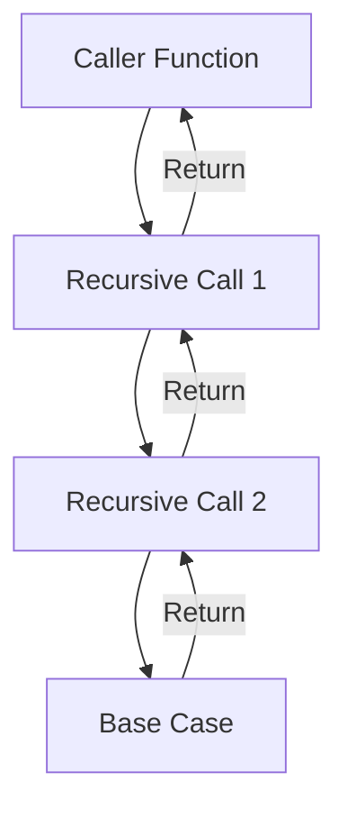
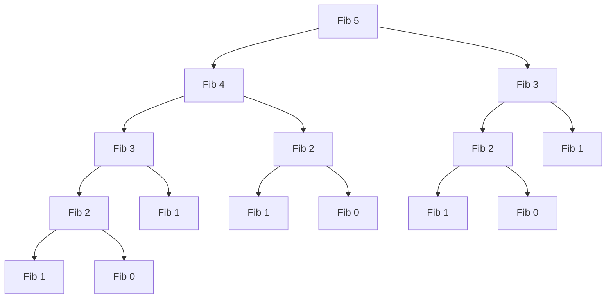

# Week_01_Day_4_Recursion_I_Call_Stack_And_Basic_Patterns_Instructional.md

# 🎯 WEEK 1 DAY 4: RECURSION I — CALL STACK AND BASIC PATTERNS — COMPLETE GUIDE

**Category:** Foundations  |  **Difficulty:** 🟢 Foundation  
**Prerequisites:** RAM model, process memory layout, time/space complexity basics  
**Interview Frequency:** 90% (either directly or hidden inside larger problems)  
**Real-World Impact:** Underlies compilers, interpreters, UI rendering, backtracking engines, and many algorithmic patterns.

---

## 🎓 LEARNING OBJECTIVES

By the end of this topic, you will be able to:

- ✅ Explain how the **call stack** grows, shrinks, and stores activation records.  
- ✅ Distinguish between **base case**, **recursive case**, and understand why both are required.  
- ✅ Simulate common recursive patterns: **linear**, **tail**, **tree-like**, and **divide-and-conquer** recursion.  
- ✅ Recognize how recursion translates into **recursion trees**, enabling complexity insights.  
- ✅ Diagnose and prevent **stack overflow**, **infinite recursion**, and **duplicate work**.  

---

## 🤔 SECTION 1: THE WHY — ENGINEERING MOTIVATION

### 🎯 Real-World Problems This Solves

| 🧩 Problem | 🌍 Where It Appears | 💼 Business Impact | 🏭 Example System |
|-----------|---------------------|--------------------|-------------------|
| **Rendering Nested UI Elements** | Mobile/Web UI frameworks | Smooth layout and repaint operations | **React** reconciliation |
| **Navigating Hierarchical Data** | File systems, org charts, XML/JSON parsing | Accurate traversal and manipulation | **Windows Explorer**, **VS Code** |
| **Backtracking Decision Engines** | Booking systems, puzzle solvers, AI search | Optimal or feasible solutions under constraints | **Airline seat allocation**, **SAT solvers** |
| **Compiler Parsing** | Source code parsing, syntax trees | Correct compilation or interpretation | **LLVM**, **GCC** |
| **Distributed Monitoring** | Recursive status aggregation across nodes | Reliable system health reports | **Zabbix**, **Nagios** |

**Problem 1: UI Tree Rendering**  
Modern frameworks like React render deeply nested components. Each component may render children, which render more children. Recursion elegantly expresses this “process children before returning to parent” logic. Without recursion, code becomes imperative and verbose.

**Problem 2: File System Traversal**  
Operating systems represent file structure as trees. When you search for “invoice” inside nested folders, recursion naturally expresses “open folder → search each child → return results upwards.”

**Problem 3: Backtracking and Decision Making**  
Booking engines must explore combinations (e.g., seats, time slots). Recursion models “choose → explore → unchoose” elegantly. The alternative is an explicit stack or queue, which is fine—but recursion teaches you to reason about state change depth-first.

### ⚖ Design Goals & Trade-Offs

| ⚙ Goal | 🔍 Trade-Off |
|--------|-------------|
| **Code Expressiveness** | Recursion mirrors problem structure but uses extra stack space. |
| **Automatic State Management** | Call stack helps track state, but loses control over stack size. |
| **Readability vs Performance** | Recursion is clean. Sometimes iteration is faster and safer (tail recursion, loops). |
| **Correctness** | Base case mistakes lead to infinite loops; iteration can be easier to reason about for simple sequences. |

### 💼 Interview Relevance

- **Classic Questions:** Factorial, power, Fibonacci, tower of Hanoi, tree traversals, permutations, combinations.  
- **Hidden Recursion:** Sorting algorithms (merge sort, quicksort), tree DFS, binary search, parsing problems.  
- **Differentiator:** Explaining what happens in memory (stack frames) shows depth; not just writing the function.

---

## 📌 SECTION 2: THE WHAT — MENTAL MODEL & CORE CONCEPTS

### 🧠 Core Analogy

**"Russian Nesting Dolls."**

- Each function call is a doll that opens up, revealing a smaller doll.  
- The smallest doll (base case) doesn’t open further.  
- After looking at a smaller doll, you close it (return) and reassemble the stack.

### 🖼 Visual Representation



### 🔑 Core Invariants

1. **Every recursive function must have a base case** that eventually stops recursion.  
2. **Each recursive call pushes a new frame onto the call stack**, storing parameters and locals.  
3. **After the call returns, the function can combine results or continue with other work**.  
4. **Stack depth equals recursion depth**; finite stack space means gentle caution for deep recursion.  
5. **Recursion tree structure reveals duplicated work** (important for optimization).

### 📋 CORE CONCEPTS & VARIATIONS (List All)

| # | 🧩 Concept / Pattern | ✏️ Description | ⏱ Typical Time | 💾 Typical Space |
|---|----------------------|----------------|----------------|------------------|
| 1 | **Call Stack Frame** | Activation record storing return address, parameters, locals | O(1) per call | O(depth) |
| 2 | **Base Case** | Stop condition preventing infinite recursion | O(1) | - |
| 3 | **Recursive Case** | Calls itself with smaller or simpler input | Depends on problem | - |
| 4 | **Linear Recursion** | Single recursive call (factorial, sum) | Often O(n) | O(n) |
| 5 | **Tree Recursion** | Multiple recursive calls (Fibonacci, permutations) | O(branches^depth) | O(depth) |
| 6 | **Tail Recursion** | Recursive call is last statement (can be optimized into a loop) | O(n) | O(n) (unless optimized) |
| 7 | **Divide and Conquer** | Split problem, solve parts, combine (merge sort) | O(n log n) or similar | O(log n) to O(n) |
| 8 | **Backtracking** | Explore choices, undo, try next (DFS, Sudoku) | Exponential in worst case | O(depth) |

---

## ⚙ SECTION 3: THE HOW — MECHANICAL WALKTHROUGH

### 🧱 Stack Layout Concepts

- Every function call creates a **stack frame** with:
  - Return address
  - Parameters
  - Local variables
- When the function returns, the frame is popped.
- Recursive calls keep stacking until base case.

### 🧮 Operation 1: Simple Linear Recursion (Factorial)

Pseudo-C# (logic-only, no heavy syntax):

```text
Factorial(n):
    if n equals 0 return 1
    else return n * Factorial(n - 1)
```

**Step-wise Mechanics (n = 4):**

| ⏱ Step | Stack Snapshot (Top to Bottom) | Action |
|--------|--------------------------------|--------|
| 1 | Factorial(4)                        | Call with n=4 |
| 2 | Factorial(4), Factorial(3)          | Recurse |
| 3 | Factorial(4), Factorial(3), Factorial(2) | Recurse |
| 4 | ..., Factorial(1)                   | Recurse |
| 5 | ..., Factorial(0)                   | Base case returns 1 |
| 6 | Multiply step: 1 * 1 = 1            | Factorial(1) returns 1 |
| 7 | Multiply step: 2 * 1 = 2            | Factorial(2) returns 2 |
| 8 | Multiply step: 3 * 2 = 6            | Factorial(3) returns 6 |
| 9 | Multiply step: 4 * 6 = 24           | Factorial(4) returns 24 |

### 🧮 Operation 2: Tree-like Recursion (Fibonacci)

```text
Fib(n):
    if n <= 1 return n
    return Fib(n-1) + Fib(n-2)
```

**Expands into a tree**: each call spawns two children.

**Observation:** Many nodes are duplicates (e.g., Fib(2) appears multiple times). Important for optimization (memoization).

### 🧮 Operation 3: Divide and Conquer (Sum of Array)

```text
Sum(arr, start, end):
    if start == end return arr[start]
    mid = (start + end) / 2
    return Sum(arr, start, mid) + Sum(arr, mid+1, end)
```

**Recursion Tree:** Balanced binary tree depth around log base 2 of n.

### 🧮 Operation 4: Backtracking (Binary Strings)

```text
GenerateBinary(n, prefix):
    if length(prefix) == n:
        print prefix
        return
    GenerateBinary(n, prefix + "0")
    GenerateBinary(n, prefix + "1")
```

**Tree structure:** Each level adds a digit. Depth n means stack size n. Output size 2^n.

### 💾 Memory Behavior

- Stack usage grows linearly with depth.  
- Deep recursion can overflow stack (especially with thousands of calls).  
- Some languages optimize tail recursion (convert to loop). Many (like C#) do not by default.  
- Backtracking reuses stack frames once branches return (no memory leak if base case correct).

### 🛡 Edge Cases

| 🚧 Edge Case | Expected Handling |
|-------------|-------------------|
| **Missing Base Case** | Infinite recursion → Stack overflow |
| **Base Case Order Wrong** | Checks after recursion → still infinite |
| **Too Deep Recursion** | Input size huge (e.g., Factorial(100000)) → Stack overflow |
| **Mutating Shared State** | Recursion must restore state on backtracking to avoid corruption |

---

## 🎨 SECTION 4: VISUALIZATION — SIMULATION & EXAMPLES

### 🧊 Example 1: Factorial Stack Frames

ASCII diagram of stack growth for Factorial(3):

```text
Top of Stack
+------------------------+
| return address to main |
| locals: n = 3          |
| result pending         |
+------------------------+
| return address: Fact(3)|
| locals: n = 2          |
+------------------------+
| return address: Fact(2)|
| locals: n = 1          |
+------------------------+
| return address: Fact(1)|
| locals: n = 0          |
| returns 1              |
+------------------------+
Bottom of Stack
```

### 📈 Example 2: Fibonacci Recursion Tree



Duplicated subtrees highlight inefficiency.

### 🔥 Example 3: Backtracking Visualization (Binary Strings of Length 3)

```mermaid
graph TD
    Root[""]
    Root --> A0["0"]
    Root --> A1["1"]
    A0 --> B00["00"]
    A0 --> B01["01"]
    A1 --> B10["10"]
    A1 --> B11["11"]
    B00 --> C000["000"]
    B00 --> C001["001"]
    B01 --> C010["010"]
    B01 --> C011["011"]
    B10 --> C100["100"]
    B10 --> C101["101"]
    B11 --> C110["110"]
    B11 --> C111["111"]
```

Each root-to-leaf path prints a string.

---

## 📊 SECTION 5: CRITICAL ANALYSIS — PERFORMANCE & ROBUSTNESS

### 📈 Complexity Table

| 📌 Pattern | 🟢 Time Complexity | 💾 Space (Stack) | 📝 Notes |
|-----------|--------------------|------------------|----------|
| **Linear Recursion** | O(n) | O(n) | E.g., factorial, sum of list |
| **Balanced Divide-Conquer** | O(n log n) | O(log n) to O(n) | E.g., merge sort (if auxiliary arrays used) |
| **Tree Recursion** | O(branch^depth) | O(depth) | Fibonacci naive is O(2^n) |
| **Backtracking** | O(branch^depth) | O(depth) | Often exponential |
| **Tail Recursion** | O(n) | O(n) Typically | Can be optimized to O(1) space in tail-recursive languages |

### 🤔 Why Complexity Matters Here

- **Stack Depth:** Directly tied to recursion depth. Depth 10^5 will overflow in most languages.  
- **Repeated Work:** Tree recursion often revisits identical subproblems.  
  - Example: Fibonacci (n=50) naive version is unusable (takes minutes/hours).  
  - Solution: Memoization (store results) or bottom-up iteration.

### 🖥 Real Hardware Considerations

- Stack per thread is typically 1–8 MB. Factorial(100000) will crash in C#, Java.  
- Some languages (Scheme, Haskell) have guaranteed tail-call optimization. Java and C# do not by default.  
- Recursion adds overhead per call (function entry/exit), whereas loops reuse the same frame.

### ⚠ Failure Modes

| ⚠ Failure | 💥 Cause | 🛠 Mitigation |
|-----------|---------|---------------|
| Stack Overflow | Too many nested calls | Use iteration, tail recursion, or increase stack (if safe) |
| Infinite Recursion | Base case missing or unreachable | Audit base condition first |
| Incorrect State Restoration | Mutating shared structures without undo | Use copy or manual rollback |
| Performance Cliff | Exponential recursion on medium inputs | Use memoization or dynamic programming |

---

## 🏭 SECTION 6: REAL SYSTEMS — INTEGRATION IN PRODUCTION

| 🏭 System | 🧩 Recursion Role | 🎯 Impact | ⚠ Pitfall |
|-----------|-------------------|-----------|-----------|
| **React Fiber** | Recursively reconciles UI components | Smooth UI updates | Excessive depth on large trees |
| **Angular Change Detection** | Traverses component tree recursively | Keeps UI in sync | Complexity with deep nesting |
| **Google Chrome DOM Parser** | Recursive descent parsing for HTML/XML | Accurate tree representation | Stack overflow on maliciously deep HTML |
| **Unix `find` Command** | Recursively traverses file directories | Comprehensive search | Slow on huge directory without pruning |
| **Compilers (LLVM)** | Recursive descent or recursive AST processing | Correct syntax analysis | Deep recursion on nested constructs |
| **Terraform** | Recursively resolves dependencies between infrastructure resources | Reliable provisioning order | Complex graphs increase stack usage |
| **AWS Lambda Tracing** | Recursively aggregates span data | End-to-end monitoring | Large depth needs tail recursion-like patterns |

---

## 🔗 SECTION 7: CONCEPT CROSSOVERS — CONNECTIONS & COMPARISONS

### 📚 Prerequisites Somewhere Else

- RAM model & stack/heap differences (Week 1 Day 1).  
- Control structures and loops (general programming).

### 🚀 What Builds on This Later

- Dynamic programming (Week 14) relies on understanding recursion trees.  
- Divide-and-conquer algorithms (merge sort, quicksort).  
- Graph traversal (DFS) uses recursion or an explicit stack.  
- Backtracking problems (Week 13) build heavy recursive control flows.

### 🔄 Comparison Table

| 📌 Method | ⏱ Time | 💾 Space | ✅ Best For | ❌ When Not to Use |
|-----------|--------|----------|-------------|--------------------|
| **Pure Recursion** | Varies (often O(n) to O(2^n)) | O(depth) | Elegant tree/nested structures | Depth too large, performance-critical loops |
| **Iteration** | Often O(n) | O(1) | Simple sequences, tail patterns | Hard to express tree expansions |
| **Explicit Stack Simulation** | O(n) | O(n) | Avoiding recursion limits | Code more complex, manual state handling |

---

## 📐 SECTION 8: MATHEMATICAL & THEORETICAL PERSPECTIVE

- **Recurrence Relation:** Many recursive solutions expressed as T(n) = a * T(n/b) + f(n).  
- For factorial: T(n) = T(n-1) + O(1) -> O(n).  
- For merge sort: T(n) = 2T(n/2) + O(n) -> O(n log n).  
- **Recursion Tree:** Draw depth vs branching to estimate cost.  
- **Stack Depth Bound:** Depth equals the number of nested calls before hitting base case. For linear recursion, depth = n. For divide-and-conquer halving, depth approx log n.

---

## 💡 SECTION 9: ALGORITHMIC DESIGN INTUITION

### 🎯 Decision Framework

| ❓ Consideration | Use Recursion? | Alternative |
|------------------|---------------|-------------|
| Natural tree/graph structure? | ✅ | Iterative DFS/ BFS |
| Depth within safe limit (e.g., < 1,000)? | ✅ | Otherwise consider iteration |
| Need to explore decisions/backtrack? | ✅ | Hard without recursion; implement explicit stack |
| Heavy performance constraints? | ⚠ Evaluate | Sometimes iteration or memoization better |
| Tail recursion supported language? | ✅ (with tail opt) | In C#/Java, prefer loops for tail cases |

### 🔍 Patterns to Recognize

- **"Process children, then combine"** -> recursion.  
- **"List all possibilities"** -> recursion/backtracking.  
- **"Divide into halves"** -> recursion (merge sort, binary search).  
- **"Recurrence relation given"** -> recursion likely.

---

## ❓ SECTION 10: KNOWLEDGE CHECK — SOCRATIC QUESTIONS

1. **Why must every recursive function have at least one base case?**  
2. **What happens in memory if a recursive function never reaches its base case?**  
3. **How would you convert a tail-recursive function into an iterative version manually?**  
4. **Why does naïve Fibonacci recursion perform poorly as n grows?**  
5. **When might recursion be less readable than iteration? Give an example.**

---

## 🎯 SECTION 11: RETENTION HOOK — MEMORY ANCHORS

### 💎 One-Liner Essence

**"Recursion is breaking a problem into smaller clones of itself until it becomes trivial."**

### 🧠 Mnemonic Device

**"S.C.A.R.E."**

- **S**tack frames manage context  
- **C**ombine results on unwind  
- **A**lways define base case  
- **R**ecurse with smaller inputs  
- **E**nsure exit to avoid overflow

### 🖼 Visual Cue

Imagine descending a spiral staircase into a cellar. Each step is a recursive call. You collect an item at the bottom (base case), then climb back up, dropping the item into each room (combining results) until back to the entrance (original caller).

### 💼 Real Interview Story

Candidate asked to generate all permutations of a list.  
- She drew the decision tree showing swaps (visual).  
- Explained state at each recursion depth (stack frame).  
- Discussed time complexity O(n!).  
Interviewer impressed—recursion knowledge demonstrated with clarity.

---

## 🧩 5 COGNITIVE LENSES

### 🖥 Computational Lens
Stack frames occupy memory. Each call pushes locals and return address. Recursion depth limited by stack size (1–8 MB). Tail-call optimization matters in languages that support it.

### 🧠 Psychological Lens
Common misconception: “Recursion is magic.” Reality: simple stack mechanism. Visualizing stack frames and recursion trees builds intuition. Practice tracing small inputs manually.

### 🔄 Design Trade-off Lens
Recursion is expressive but not always efficient. Danger of stack overflow. Iteration is manual but predictable. Choose recursion for clarity, iteration for safety and performance when depth large.

### 🤖 AI/ML Analogy Lens
Backpropagation in neural networks recursively applies chain rule. Recursive tree structures (like decision trees) naturally modeled with recursion. Recursion in ML frameworks often converted to iterative operations for performance.

### 📚 Historical Context Lens
Functional programming languages embraced recursion early (LISP, 1950s). Imperative languages followed but often prioritized loops. Tail-call optimization became a key feature in Scheme and Haskell. Modern compilers still have to weigh recursion efficiency trade-offs.

---

## ⚔ SUPPLEMENTARY OUTCOMES

### ⚔ Practice Problems (8–10)

1. **Factorial Calculation** (Easy, LeetCode style) — Base and recursive case practice.  
2. **Sum of Linked List** (Easy) — Linear recursion.  
3. **Binary Tree Traversal** (Easy/Medium) — In-order, pre-order, post-order recursion.  
4. **Reverse a Linked List** (Medium) — Recursion vs iteration.  
5. **Power Function (Fast Exponentiation)** (Medium) — Divide-and-conquer.  
6. **Generate Parentheses** (Medium) — Backtracking recursion.  
7. **Permutations of an Array** (Medium) — Tree recursion.  
8. **Subsets (Power Set)** (Medium) — Recursive tree of inclusion/exclusion.  
9. **Tower of Hanoi** (Medium) — Classic recursive pattern.  
10. **Sudoku Solver** (Hard) — Backtracking recursion with constraints.

*(Sources: LeetCode, HackerRank, Cracking the Coding Interview)*

### 🎙 Interview Questions (6+)

1. **Describe what happens in memory when a recursive function runs.**  
   - Follow-up: How can stack overflow occur?  

2. **When should recursion be avoided in favor of iteration?**  
   - Follow-up: Show iterative equivalent of a tail-recursive function.  

3. **How do you optimize recursive functions that revisit subproblems?**  
   - Follow-up: Example with Fibonacci.  

4. **Explain how recursion is used in quicksort.**  
   - Follow-up: What is the base case? What leads to worst-case recursion depth?  

5. **Why is understanding the base case critical?**  
   - Follow-up: Example where base case is incorrect or unreachable.  

6. **How can you trace recursion to debug complex functions?**  
   - Follow-up: Tools or strategies (call stack viewer, logging).  

### ⚠ Common Misconceptions (3–5)

1. **“Recursion is always slower than loops.”**  
   - Reality: Overhead is minimal for shallow recursion. Clarity can reduce bugs.  

2. **“Stack frames disappear instantly when recursive call is made.”**  
   - Reality: They remain until the call returns; stack grows downward.  

3. **“Tail recursion is always optimized in modern languages.”**  
   - Reality: Depends on compiler/language. Many mainstream languages do not optimize tail calls.  

### 🚀 Advanced Concepts (3–5)

1. **Tail-call optimization** — When supported, compiler reuses frame.  
2. **Memoization and dynamic programming** — Avoid duplicate work in recursion trees.  
3. **Continuation Passing Style** — Representing recursion via explicit continuation arguments.  

### 🔗 External Resources (3–5)

1. **Book:** “Structure and Interpretation of Computer Programs” — Recursion foundations.  
2. **Video:** MIT 6.0001 Recursion lecture — Visual understanding.  
3. **Article:** “Visualizing Recursion” on Medium — Step-by-step stack frames.  
4. **Tool:** PythonTutor.com — Visualizes call stack for code.  
5. **Podcast:** Software Engineering Daily — “Recursion and functional programming insights.”
