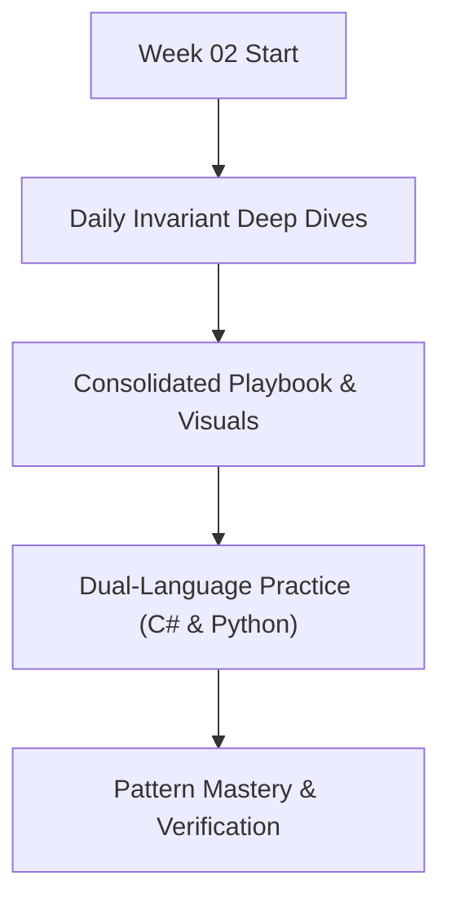

# 📘 Linear Data Structures & Binary Search Invariants

> 🧭 **Navigation:** [← Previous: Week 01](../week_01_foundations_i_computational_fundamentals/README.md) • [🏠 Curriculum Overview](../README.md) • [📘 Complete Syllabus](../COMPLETE_SYLLABUS.md) • [Next: Week 03 →](../week_03_foundations_iii_sorting_and_hashing/README.md)

---

> 💡 **Instructor Guidance Note:**  
> *Not all sections or topics are mandatory. As a learner, you can adapt your pace freely. If you are preparing on an accelerated interview timeline or already feel confident with specific foundational concepts, feel free to skip or skim optional topics and prioritize high-yield patterns based on your personal interview goals.*

---

## 🎯 Weekly Mission & Conceptual Focus

Master static/dynamic array memory layout, cache prefetching, singly/doubly linked lists, circular queues, stacks, and binary search invariants.

---

## 📅 Day-by-Day Learning Path

| Day | Instructional Module | Focus & Core Objective |
| :--- | :--- | :--- |
| **Day 01** | [Arrays Memory Layout](Week_02_Day_01_Arrays_Memory_Layout_Instructional.md) | Core Daily Concept Deep Dive |
| **Day 02** | [Dynamic Arrays Amortized Growth](Week_02_Day_02_Dynamic_Arrays_Amortized_Growth_Instructional.md) | Core Daily Concept Deep Dive |
| **Day 03** | [Linked Lists](Week_02_Day_03_Linked_Lists_Instructional.md) | Core Daily Concept Deep Dive |
| **Day 04** | [Stacks Queues Deques](Week_02_Day_04_Stacks_Queues_Deques_Instructional.md) | Core Daily Concept Deep Dive |
| **Day 05** | [Binary Search Invariants](Week_02_Day_05_Binary_Search_Invariants_Instructional.md) | Core Daily Concept Deep Dive |
| **Day 06** | [Strings Numbers](Week_02_Day_06_Strings_Numbers_Instructional.md) | Core Daily Concept Deep Dive |

---

## 📚 Consolidated Playbooks & Reference Guides

*   📖 **Comprehensive Week Playbook:** [WEEK_02_FULL_PLAYBOOK.md](WEEK_02_FULL_PLAYBOOK.md) — High-density synthesis of all invariants, theorems, and pattern triggers for this week.
*   📊 **Visual Concepts Playbook (Hybrid):** [Week_02_Visual_Concepts_Playbook_HYBRID.md](Week_02_Visual_Concepts_Playbook_HYBRID.md) — Compact Mermaid diagrams, state transitions, and complexity reference tables.
*   💻 **Production C# Reference (.NET 8/9):** [Week_02_Extended_CSharp_Complete.md](Week_02_Extended_CSharp_Complete.md) — Idiomatic, zero-allocation memory-aware implementations and problem ladders.
*   🐍 **Production Python Reference (Python 3.11+):** [Week_02_Extended_Python_Complete.md](Week_02_Extended_Python_Complete.md) — Clean, pythonic reference implementations for rapid whiteboard prototyping.

---

## 🛠️ The 5 Core Support Files (`support files/`)

Every week is accompanied by five dedicated support files located in the `support files/` subdirectory:

1.  📋 [Daily Progress Checklist](support%20files/Week_02_Daily_Progress_Checklist.md) — Step-by-step accountability tracker for theory, coding, and variants.
2.  🧭 [Weekly Guidelines & Mental Models](support%20files/Week_02_Guidelines.md) — Strategic roadmap, common pitfalls, and conceptual anchors.
3.  🎙️ [Interview Q&A Comprehensive Reference](support%20files/Week_02_Interview_QA_Reference.md) — High-frequency senior technical questions with verbal response frameworks.
4.  🗺️ [Problem-Solving Roadmap](support%20files/Week_02_Problem_Solving_Roadmap.md) — Tier-1 problem progression ladder from warm-up to advanced.
5.  📑 [Summary & Key Concepts Synthesis](support%20files/Week_02_Summary_Key_Concepts.md) — Fast-revision cheat sheet covering all governing invariants and system trade-offs.

---

> 🧭 **Navigation:** [← Previous: Week 01](../week_01_foundations_i_computational_fundamentals/README.md) • [🏠 Curriculum Overview](../README.md) • [📘 Complete Syllabus](../COMPLETE_SYLLABUS.md) • [Next: Week 03 →](../week_03_foundations_iii_sorting_and_hashing/README.md)
